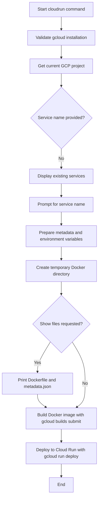
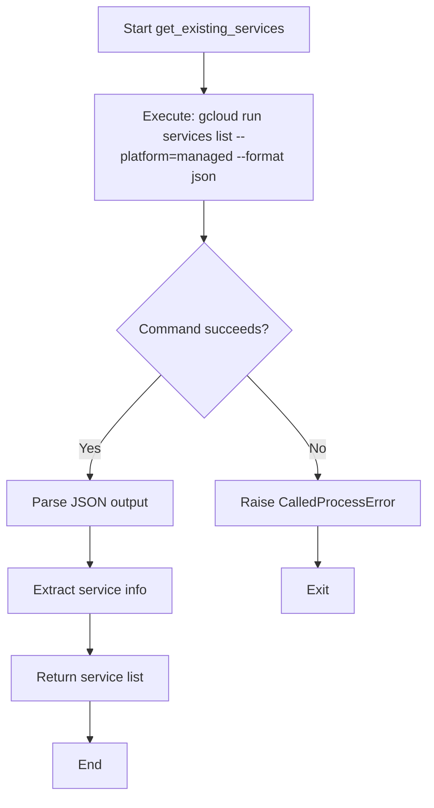
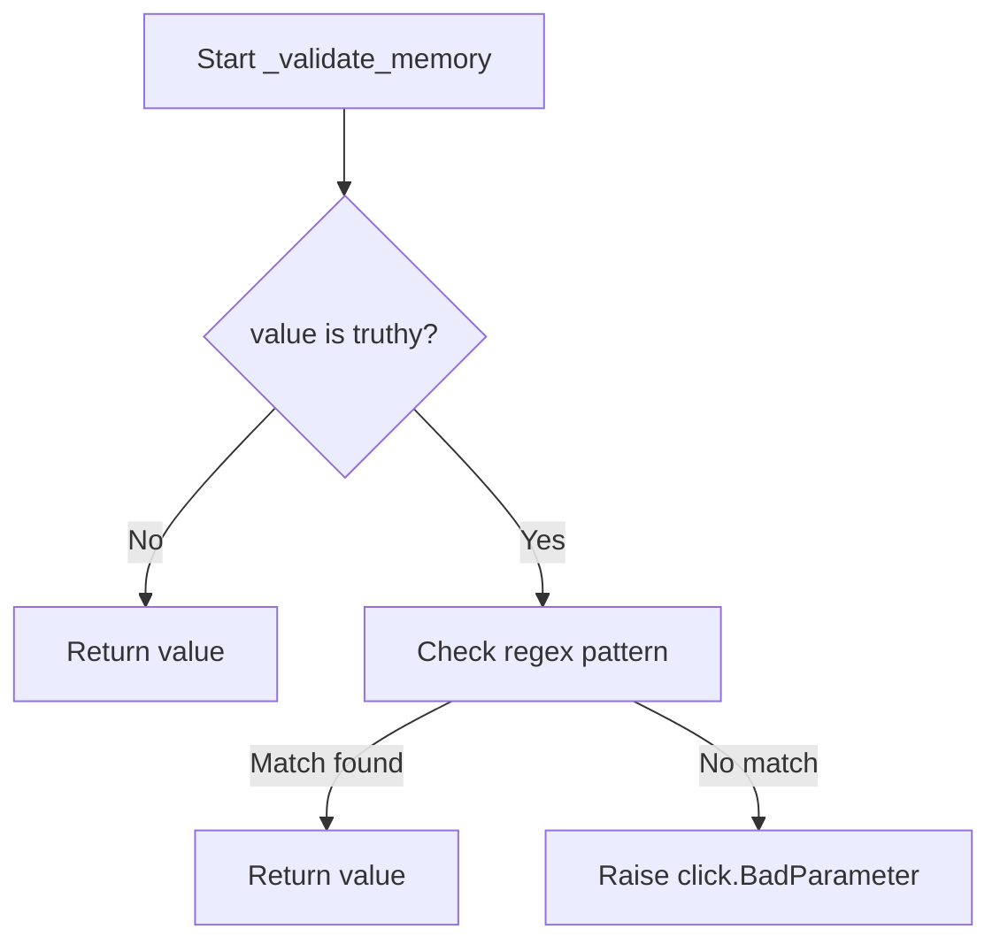

# `cloudrun.py`

## `datasette.publish.cloudrun.publish_subcommand` · *function*

## Summary:
Registers the Google Cloud Run publish command with the datasette publish CLI, enabling deployment of Datasette applications to Google Cloud Run.

## Description:
This function acts as a decorator that registers the `cloudrun` subcommand with the datasette publish CLI group. It defines all command-line options for Cloud Run deployment including service naming, resource allocation, and deployment configuration. The command handles interactive service name prompting, validates prerequisites like gcloud installation, prepares metadata and environment variables, generates Docker artifacts in a temporary directory, and orchestrates the gcloud build and deploy operations.

## Args:
    publish (click.Group): The Click group object to which this command will be registered.

## Returns:
    None: This function registers a Click command and does not return a value directly.

## Raises:
    click.Abort: When the user cancels the interactive service name prompt.
    subprocess.CalledProcessError: When gcloud commands fail during build or deployment phases.
    click.BadParameter: When memory validation fails due to invalid format.

## Constraints:
    Preconditions:
        - The `publish` parameter must be a valid Click Group instance
        - The gcloud CLI must be installed and configured with appropriate credentials
        - The user must have permissions to create and manage Cloud Run services in the project
        - Required files and directories must be accessible for the deployment process

    Postconditions:
        - A Cloud Run service is either created or updated with the Datasette application
        - Temporary Docker artifacts are cleaned up after deployment
        - The command exits successfully upon completion or raises appropriate exceptions

## Side Effects:
    - Creates temporary directories and files for Docker artifact generation
    - Executes subprocess commands for gcloud builds and deployments
    - Modifies process working directory during Docker artifact generation
    - Outputs informational messages to stdout during interactive prompts
    - Makes network calls to Google Cloud APIs via gcloud CLI

## Control Flow:


## Examples:
    # Basic deployment with default settings
    datasette publish cloudrun my-database.db
    
    # Deployment with custom service name and memory allocation
    datasette publish cloudrun --service my-service --memory 2Gi my-database.db
    
    # Deployment with plugin secrets and additional apt packages
    datasette publish cloudrun --service my-service \\
        --plugin-secret my-plugin api-key abc123 \\
        --apt-get-install libgeos-dev \\
        my-database.db
```

## `datasette.publish.cloudrun.get_existing_services` · *function*

## Summary:
Retrieves a list of existing Google Cloud Run services in the managed platform.

## Description:
This function executes a gcloud command to list all Cloud Run services deployed on the managed platform and parses the JSON output to extract key service metadata including name, creation timestamp, and URL. It is used during the publish workflow to discover existing deployments before creating new ones.

## Args:
    None

## Returns:
    list[dict]: A list of dictionaries containing service information with keys:
        - "name" (str): The name of the Cloud Run service
        - "created" (str): ISO timestamp of when the service was created
        - "url" (str): The public URL address of the service

## Raises:
    subprocess.CalledProcessError: When the gcloud command fails to execute or returns a non-zero exit code
    json.JSONDecodeError: When the gcloud command output cannot be parsed as valid JSON

## Constraints:
    Preconditions:
        - The gcloud CLI must be installed and configured with appropriate credentials
        - The user must have permissions to list Cloud Run services in the project
        - The managed platform must be selected (via --platform=managed flag)

    Postconditions:
        - Returns a list of service dictionaries with consistent structure
        - All returned dictionaries contain the required keys: name, created, url

## Side Effects:
    - Executes a subprocess command: "gcloud run services list --platform=managed --format json"
    - Makes network calls to Google Cloud APIs via the gcloud CLI
    - May modify process environment through subprocess execution

## Control Flow:


## Examples:
    # Typical usage in a publish workflow
    try:
        services = get_existing_services()
        for service in services:
            print(f"Service: {service['name']}, URL: {service['url']}")
    except subprocess.CalledProcessError as e:
        print(f"Failed to retrieve services: {e}")
    except json.JSONDecodeError as e:
        print(f"Invalid JSON response: {e}")
```

## `datasette.publish.cloudrun._validate_memory` · *function*

## Summary:
Validates that a memory specification string follows the format of a number followed by a unit (Gi, G, Mi, or M).

## Description:
This function serves as a Click callback validator for memory-related command-line arguments. It ensures that the provided memory value conforms to the expected format of a numeric value followed by a valid memory unit suffix. The validation prevents invalid memory specifications from being processed further in the publishing workflow.

## Args:
    ctx (click.Context): The Click context object, providing access to command-line context information.
    param (click.Parameter): The Click parameter being validated.
    value (str): The memory specification string to validate.

## Returns:
    str: The original value if it passes validation, allowing it to be used in subsequent processing.

## Raises:
    click.BadParameter: Raised when the value does not match the expected pattern of a number followed by a valid memory unit (Gi, G, Mi, or M).

## Constraints:
    Preconditions:
        - The value parameter must be a string or None.
        - The function assumes that if value is truthy (non-empty), it should conform to the memory specification format.
    Postconditions:
        - If the value is valid, it is returned unchanged.
        - If the value is invalid, a click.BadParameter exception is raised.

## Side Effects:
    - No I/O operations or external state mutations occur.
    - Only performs string validation and raises an exception if validation fails.

## Control Flow:


## Examples:
    - Valid inputs: "1Gi", "2G", "512Mi", "1024M"
    - Invalid inputs: "1GB", "abc", "1.5Gi", ""

