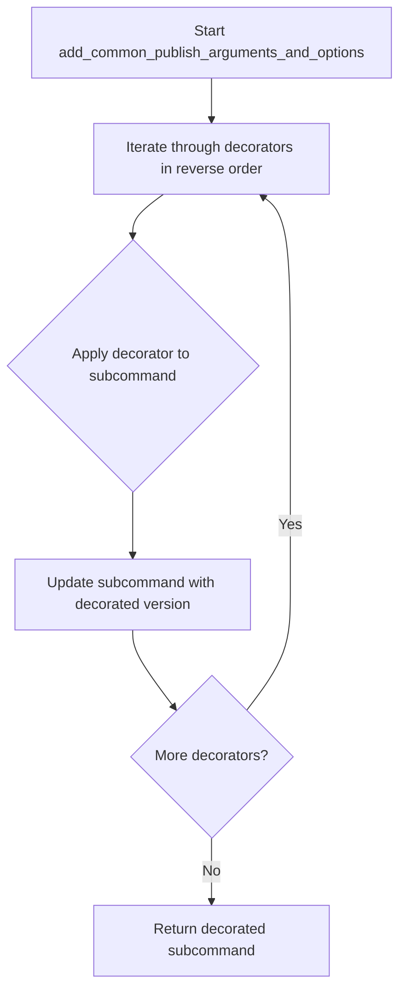
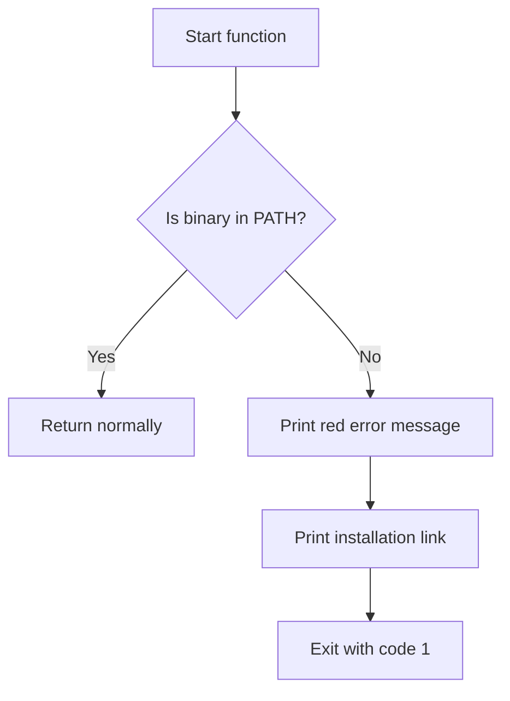
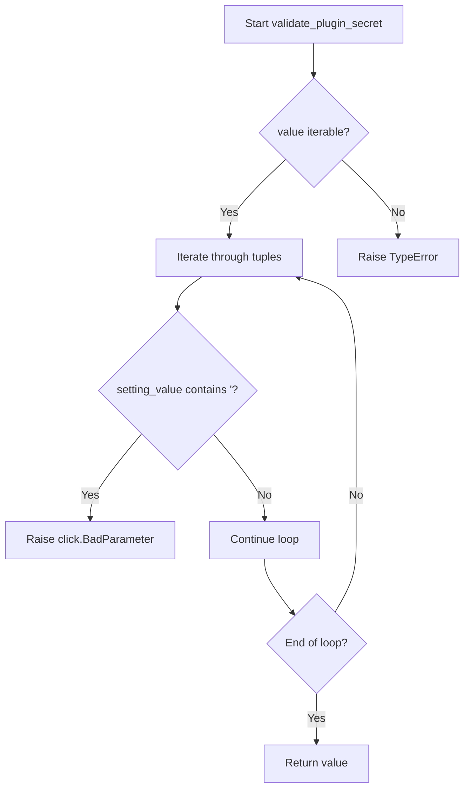

# `common.py`

## `datasette.publish.common.add_common_publish_arguments_and_options` · *function*

## Summary:
Adds common command-line arguments and options for datasette publishing commands to a Click subcommand.

## Description:
This function decorates a Click subcommand with a standardized set of command-line arguments and options used across various datasette publishing operations. It applies decorators in reverse order to ensure proper stacking of Click decorators. The function centralizes the definition of common publishing parameters, promoting consistency and reducing code duplication across different publish subcommands like `datasette publish heroku` or `datasette publish now`.

## Args:
    subcommand (click.Command): The Click command object to be decorated with common publishing arguments and options

## Returns:
    click.Command: The same Click command object, now decorated with all common publishing arguments and options

## Raises:
    None explicitly raised by this function

## Constraints:
    - Preconditions: The input `subcommand` must be a valid Click command object
    - Postconditions: The returned command object has all the common publishing arguments and options applied

## Side Effects:
    None

## Control Flow:


## Examples:
```python
import click

@click.command()
def my_publish_command():
    # Command implementation here
    pass

# Apply common publishing arguments to the command
my_publish_command = add_common_publish_arguments_and_options(my_publish_command)

# Now my_publish_command has all standard publishing options available
# e.g., --metadata, --template-dir, --plugins-dir, etc.
```

## `datasette.publish.common.fail_if_publish_binary_not_installed` · *function*

## Summary:
Checks if a required binary tool is installed and exits the program with an error message if it's not found.

## Description:
This function validates that a specified binary tool is available in the system PATH before proceeding with a publishing operation. It's designed to provide clear error messages to users when required dependencies are missing, helping them install the necessary tools to complete their publishing workflow. The function is typically called at the beginning of publishing commands to ensure prerequisites are met.

## Args:
    binary (str): Name of the binary executable to check for existence in PATH
    publish_target (str): Name of the publishing platform/service that requires this binary
    install_link (str): URL to documentation or installation instructions for the missing binary

## Returns:
    None: This function never returns normally as it calls sys.exit(1) when the binary is not found

## Raises:
    None: This function doesn't raise exceptions but terminates the program via sys.exit()

## Constraints:
    Preconditions:
        - All arguments must be non-empty strings
        - The binary name should be a valid executable name that could exist in PATH
        - The install_link should be a valid URL pointing to installation documentation

    Postconditions:
        - If the binary exists, the function completes without side effects
        - If the binary doesn't exist, the program terminates with exit code 1

## Side Effects:
    - Writes error messages to stderr using click.secho and click.echo
    - Terminates the program execution via sys.exit(1)

## Control Flow:


## Examples:
    # Check if 'gh' (GitHub CLI) is installed for GitHub Pages publishing
    fail_if_publish_binary_not_installed(
        binary="gh",
        publish_target="GitHub Pages",
        install_link="https://docs.github.com/en/github/authenticating-to-github/installing-git"
    )
    
    # Check if 'aws' CLI is installed for AWS S3 publishing
    fail_if_publish_binary_not_installed(
        binary="aws",
        publish_target="AWS S3",
        install_link="https://docs.aws.amazon.com/cli/latest/userguide/install-cliv2.html"
    )
```

## `datasette.publish.common.validate_plugin_secret` · *function*

## Summary:
Validates that plugin secret values do not contain single quote characters to prevent shell injection vulnerabilities.

## Description:
This function serves as a validation callback for Click command-line arguments to ensure that plugin secret values are safe for shell execution. It iterates through a list of plugin configurations and raises an error if any secret value contains single quotes, which could be exploited for command injection attacks. This validation is critical for security when passing secrets to shell commands.

## Args:
    ctx (click.Context): The Click context object
    param (click.Parameter): The Click parameter being validated
    value (list[tuple]): A list of tuples containing (plugin_name, plugin_setting, setting_value) representing plugin configuration values

## Returns:
    list[tuple]: The original value unchanged, if validation passes

## Raises:
    click.BadParameter: When any plugin secret value contains a single quote character

## Constraints:
    - Preconditions: The value parameter must be iterable and contain tuples of length 3
    - Postconditions: The returned value is identical to the input value if validation passes

## Side Effects:
    None

## Control Flow:


## Examples:
```python
# Valid usage
secret_config = [("my_plugin", "api_key", "secret123")]
result = validate_plugin_secret(None, None, secret_config)
# Returns: [("my_plugin", "api_key", "secret123")]

# Invalid usage - would raise click.BadParameter
invalid_config = [("my_plugin", "api_key", "secret'withquote")]
# validate_plugin_secret(None, None, invalid_config) 
# Raises: click.BadParameter("--plugin-secret cannot contain single quotes")

# Typical usage in a Click command
@click.command()
@click.option('--plugin-secret', multiple=True, callback=validate_plugin_secret)
def my_command(plugin_secret):
    # plugin_secret is guaranteed to be safe for shell operations
    pass
```

