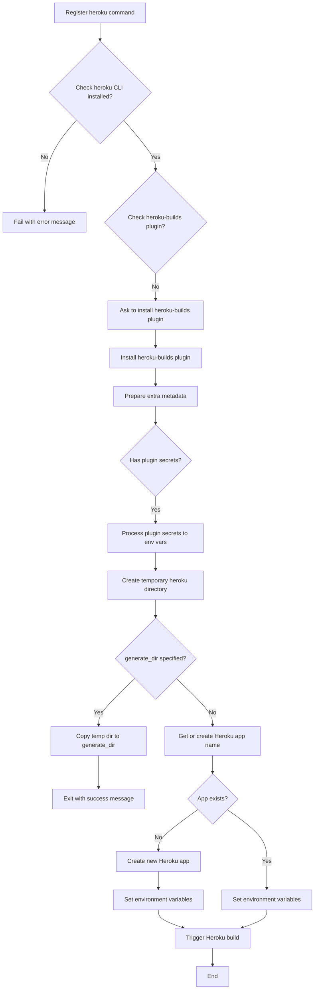

```mermaid
flowchart TD
    A[Start] --> B{metadata provided?}
    B -- Yes --> C[Parse metadata]
    B -- No --> C
    C --> D[Merge extra_metadata]
    D --> E[Change to temp dir]
    E --> F{metadata_content exists?}
    F -- Yes --> G[Write metadata.json]
    F -- No --> H
    G --> H
    H --> I[Write runtime.txt]
    I --> J{branch provided?}
    J -- Yes --> K[Update install with branch URL]
    J -- No --> L[Update install with datasette]
    K --> M
    L --> M
    M --> N[Write requirements.txt]
    N --> O[Create bin/ directory]
    O --> P[Write bin/post_compile]
    P --> Q{template_dir provided?}
    Q -- Yes --> R[Link/copy template_dir]
    Q -- No --> S
    R --> S
    S --> T{plugins_dir provided?}
    T -- Yes --> U[Link/copy plugins_dir]
    T -- No --> V
    U --> V
    V --> W{version_note provided?}
    W -- Yes --> X[Add --version-note to extras]
    W -- No --> Y
    X --> Y
    Y --> Z{metadata_content exists?}
    Z -- Yes --> AA[Add --metadata to extras]
    Z -- No --> AB
    AA --> AB
    AB --> AC{extra_options provided?}
    AC -- Yes --> AD[Split and add to extras]
    AC -- No --> AE
    AD --> AE
    AE --> AF[Process static files]
    AF --> AG[Build procfile_cmd]
    AG --> AH[Write Procfile]
    AH --> AI[Link/copy files to temp dir]
    AI --> AJ[Yield control]
    AJ --> AK[Cleanup temp directory]
    AK --> AL[Restore original directory]
    AL --> AM[End]
```

# `heroku.py`

## `datasette.publish.heroku.publish_subcommand` · *function*

## Summary:
Configures and executes the deployment of a Datasette application to Heroku by managing dependencies, creating temporary build files, and triggering the Heroku deployment process.

## Description:
This function implements the `datasette publish heroku` command that enables users to deploy their Datasette applications to Heroku. It handles validation of the Heroku CLI installation, ensures required plugins are installed, manages metadata and environment variables for plugins, creates a temporary directory structure with all necessary deployment files, and finally triggers the Heroku build process. The function acts as the main entry point for Heroku publishing operations within the Datasette CLI ecosystem.

## Args:
    publish (click.Group): The Click group object to which this command will be added

## Returns:
    None: This function registers a Click command and does not return a value

## Raises:
    click.ClickException: When the specified generate_dir already exists, preventing overwrites

## Constraints:
    Preconditions:
        - The `publish` parameter must be a valid Click Group object
        - Heroku CLI must be installed and accessible in PATH
        - User must have appropriate permissions to execute Heroku commands
        - Required files and directories specified in parameters must exist

    Postconditions:
        - If `generate_dir` is specified, the temporary directory structure is written to that location and the function exits
        - If deploying to Heroku, the application is either created or reused based on the provided name
        - Environment variables are properly configured for plugin settings
        - Heroku build process is initiated successfully

## Side Effects:
    - Modifies global state by registering a Click command with the publish group
    - Installs Heroku plugins if not present (via subprocess calls)
    - Creates temporary directory structure with files for deployment
    - Executes subprocess calls to Heroku CLI for app creation and builds
    - Sets environment variables on deployed Heroku applications
    - May modify the current working directory during temporary directory operations

## Control Flow:


## Examples:
```bash
# Deploy to Heroku with default settings
datasette publish heroku data.db

# Deploy with custom application name
datasette publish heroku data.db --name=my-datasette-app

# Generate files without deploying
datasette publish heroku data.db --generate-dir=./deploy-files

# Deploy with custom metadata
datasette publish heroku data.db --metadata=metadata.json --title="My Dataset"

# Deploy with plugin secrets
datasette publish heroku data.db --plugin-secret=plugin_name setting_name value
```

## `datasette.publish.heroku.temporary_heroku_directory` · *function*

## Summary:
Creates a temporary directory structure for deploying Datasette applications to Heroku, including configuration files and file linking.

## Description:
This function serves as a context manager that prepares a temporary directory containing all necessary files and configurations for deploying a Datasette application to Heroku. It handles metadata processing, dependency management, file linking, and configuration file generation. The function changes the working directory to the temporary location during execution and restores the original directory upon completion.

## Args:
    files (list[str]): List of file paths to include in the deployment
    name (str): Application name (not directly used in the function body)
    metadata (TextIOWrapper): File handle containing metadata in JSON or YAML format
    extra_options (str): Additional command-line options to pass to datasette serve
    branch (str): Git branch to use for datasette installation (optional)
    template_dir (str): Path to template directory to include
    plugins_dir (str): Path to plugins directory to include
    static (list[tuple[str, str]]): List of (mount_point, path) tuples for static files
    install (list[str]): Additional packages to install via pip
    version_note (str): Version note to include in deployment
    secret (str): Secret key (not directly used in the function body)
    extra_metadata (dict, optional): Additional metadata key-value pairs to merge

## Returns:
    None: This function is a context manager that yields control to the caller

## Raises:
    BadMetadataError: When metadata content is not valid JSON or YAML
    OSError: When file operations fail during linking/copying or directory operations, specifically:
    - When attempting to create symbolic links across different filesystems
    - When directory operations fail due to permissions or invalid paths
    - When file operations fail due to insufficient disk space or permissions

## Constraints:
    Preconditions:
    - Files in the `files` list must exist at their specified paths
    - Directory paths in `template_dir`, `plugins_dir`, and `static` must exist
    - `install` parameter must be iterable
    - `extra_options` must be a string or None
    
    Postconditions:
    - Temporary directory is created and populated with all necessary files
    - Working directory is changed to temporary location during execution
    - Original working directory is restored after execution
    - Temporary directory is cleaned up after execution

## Side Effects:
    - Changes the current working directory temporarily
    - Creates temporary directory and files
    - Writes configuration files: metadata.json, runtime.txt, requirements.txt, Procfile, bin/post_compile
    - Creates directories: templates/, plugins/, bin/
    - Creates symbolic links or copies files from source locations to temporary directory
    - Cleans up temporary directory upon completion

## Control Flow:


## Examples:
```python
# Basic usage with minimal parameters
with temporary_heroku_directory(
    files=["data.db"],
    name="my-datasette-app",
    metadata=None,
    extra_options=None,
    branch=None,
    template_dir=None,
    plugins_dir=None,
    static=[],
    install=[],
    version_note=None,
    secret=None
) as temp_dir:
    # Deployment logic here
    pass

# Usage with metadata and custom dependencies
with temporary_heroku_directory(
    files=["data.db", "other.db"],
    name="my-app",
    metadata=open("metadata.yaml"),
    extra_options="--setting debug True",
    branch="main",
    template_dir="templates",
    plugins_dir="plugins",
    static=[("static", "public/static")],
    install=["datasette-graphql", "datasette-auth-github"],
    version_note="v1.0.0",
    secret="secret-key"
) as temp_dir:
    # Deployment logic here
    pass
```

