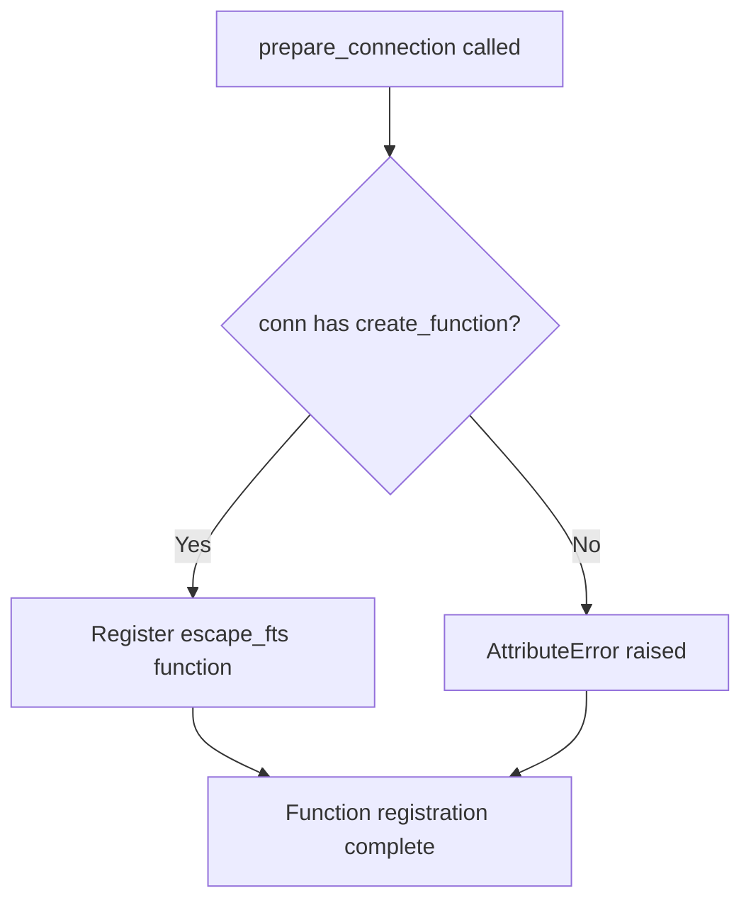

# `sql_functions.py`

## `datasette.sql_functions.prepare_connection` · *function*

## Summary:
Configures a SQLite connection with a custom FTS escaping function for full-text search operations.

## Description:
This function registers a custom SQL function named "escape_fts" with the provided SQLite connection. The registered function applies proper escaping rules to text queries for use in SQLite's Full-Text Search (FTS) functionality, ensuring that special characters and quotes are handled correctly. This extraction into a dedicated function allows for centralized configuration of SQL functions across Datasette's database connections while maintaining clean separation between database setup logic and application business logic.

## Args:
    conn: A SQLite database connection object that supports the create_function method.

## Returns:
    None: This function does not return any value.

## Raises:
    AttributeError: If the provided conn object does not have a create_function method.

## Constraints:
    Preconditions:
        - The conn parameter must be a valid SQLite connection object.
        - The conn object must support the create_function method.
    Postconditions:
        - The "escape_fts" SQL function is registered with the provided connection.
        - The registered function can be invoked from SQL queries to process FTS search terms.

## Side Effects:
    - Modifies the state of the provided SQLite connection by registering a new SQL function.
    - No external I/O operations or state mutations beyond the database connection itself.

## Control Flow:


## Examples:
```python
import sqlite3
from datasette.sql_functions import prepare_connection

# Create a database connection
db_conn = sqlite3.connect(":memory:")

# Prepare the connection with custom SQL functions
prepare_connection(db_conn)

# Now the escape_fts function can be used in SQL queries
cursor = db_conn.cursor()
cursor.execute("SELECT escape_fts('hello world')")
result = cursor.fetchone()[0]
```

