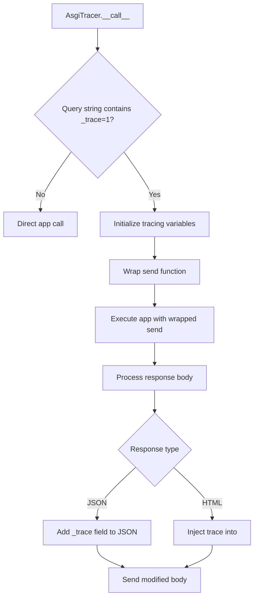

# `tracer.py`

## `datasette.tracer.get_task_id` · *function*

## Summary:
Retrieves the unique identifier for the current asynchronous task, either from a context variable or by generating one from the current event loop.

## Description:
This function provides a consistent way to obtain a unique identifier for the currently executing async task. It first checks if a task ID is already stored in a context variable (`trace_task_id`), falling back to deriving the ID from the current asyncio task if not available. This abstraction allows for consistent task identification across different execution contexts while maintaining performance by avoiding redundant task creation.

The function is designed to work in both async and sync contexts, making it suitable for tracing and logging operations that need to associate information with specific tasks regardless of the execution environment.

## Args:
    None

## Returns:
    int or None: The unique identifier for the current task if available, or None if the function cannot determine the current task. The return value is the result of calling `id()` on the asyncio task object.

## Raises:
    None

## Constraints:
    Preconditions:
        - The function should be called within an async context or when an event loop is available.
    Postconditions:
        - If a task ID is found in the context variable, it is returned directly.
        - If no context variable is set, the function attempts to retrieve the current task from the event loop.
        - If no event loop is available or no current task exists, None is returned.

## Side Effects:
    None

## Control Flow:
```mermaid
flowchart TD
    A[Start get_task_id()] --> B{trace_task_id.get(None) != None?}
    B -- Yes --> C[Return trace_task_id]
    B -- No --> D[Try asyncio.get_event_loop()]
    D --> E{RuntimeError?}
    E -- Yes --> F[Return None]
    E -- No --> G[asyncio.current_task(loop)]
    G --> H[Return id(task)]
```

## Examples:
    # In an async context with a set task ID
    task_id = get_task_id()  # Returns the context task ID
    
    # In an async context without a set task ID
    task_id = get_task_id()  # Returns the ID of the current asyncio task
    
    # In a synchronous context without an event loop
    task_id = get_task_id()  # Returns None
```

## `datasette.tracer.trace_child_tasks` · *function*

## Summary:
A context manager that establishes and cleans up a task tracing context for child tasks within an asynchronous execution flow.

## Description:
This function serves as a context manager that sets up a tracing context for asynchronous tasks by storing the current task ID in a context variable. It ensures proper cleanup by resetting the context variable when the context exits. This mechanism enables consistent task identification and tracing across nested asynchronous operations.

The function is designed to be used as a context manager (via the `yield` statement) and is typically employed in async task processing pipelines where maintaining task identity across coroutine boundaries is important for debugging, monitoring, or logging purposes.

## Args:
    None

## Returns:
    None

## Raises:
    None

## Constraints:
    Preconditions:
        - Must be called within an asynchronous context where `get_task_id()` can successfully retrieve a task identifier.
        - The `trace_task_id` context variable must be properly initialized as a `ContextVar` instance.
    Postconditions:
        - The `trace_task_id` context variable is set to the current task ID upon entering the context.
        - The `trace_task_id` context variable is reset to its previous value upon exiting the context.

## Side Effects:
    - Modifies the global context variable `trace_task_id` by setting and resetting its value.
    - No external I/O operations or state mutations beyond context variable management.

## Control Flow:
```mermaid
flowchart TD
    A[Enter trace_child_tasks()] --> B[Get current task ID via get_task_id()]
    B --> C[Set trace_task_id to task ID]
    C --> D[Yield control to caller]
    D --> E[Exit context manager]
    E --> F[Reset trace_task_id to previous value]
```

## Examples:
    # Typical usage in an async task processing function
    async def process_task():
        with trace_child_tasks():
            # All child operations inherit the parent task context
            await some_async_operation()
            await another_async_operation()
```

## `datasette.tracer.trace` · *function*

*No documentation generated.*

## `datasette.tracer.capture_traces` · *function*

## Summary:
A context manager that temporarily associates a tracer object with the current task ID for tracing purposes.

## Description:
This function serves as a context manager that manages the lifecycle of a tracer object associated with the current asynchronous task. It retrieves the current task ID, stores the tracer in a global dictionary if a task ID exists, and ensures cleanup by removing the tracer when exiting the context. This pattern enables tracing of asynchronous operations by associating trace data with specific tasks.

The function is extracted as a separate component to enforce clear responsibility boundaries around tracer management, separating the concerns of task identification from trace collection and ensuring proper resource cleanup. It leverages Python's context manager protocol through a generator function, making it usable with the `with` statement.

## Args:
    tracer (Any): The tracer object to be associated with the current task. The specific type depends on the tracing implementation being used.

## Returns:
    Generator: A context manager generator that yields control to the wrapped code block.

## Raises:
    None

## Constraints:
    Preconditions:
        - The function must be called within an asynchronous context where task identification is possible.
        - The tracer object should be serializable or compatible with the tracing system.
    Postconditions:
        - If a task ID is available, the tracer is stored in the global `tracers` dictionary under that ID.
        - The tracer is removed from the global `tracers` dictionary upon exiting the context.
        - The function always yields control to the wrapped code block.

## Side Effects:
    - Modifies the global `tracers` dictionary by adding and removing entries.
    - Uses the `get_task_id()` function which may involve accessing context variables and asyncio internals.

## Control Flow:
```mermaid
flowchart TD
    A[Start capture_traces(tracer)] --> B[Get task_id via get_task_id()]
    B --> C{task_id is None?}
    C -- Yes --> D[Yield control to wrapped code]
    C -- No --> E[Store tracer in tracers[task_id]]
    E --> F[Yield control to wrapped code]
    F --> G[Delete tracer from tracers[task_id]]
```

## Examples:
    # Basic usage with a tracer object
    tracer = SomeTracer()
    with capture_traces(tracer):
        # All tracing operations within this block are associated with the current task
        trace_operation()
        
    # Usage in an async context where task ID is available
    async def async_function():
        tracer = AsyncTracer()
        async with capture_traces(tracer):
            await some_async_operation()
            # Tracing is automatically cleaned up after this block
```

## `datasette.tracer.AsgiTracer` · *class*

## Summary:
An ASGI middleware class that instruments HTTP requests to collect and display performance tracing information.

## Description:
The AsgiTracer class serves as an ASGI middleware component that wraps an application to provide detailed performance tracing information for HTTP requests. When a request includes the query parameter `_trace=1`, it captures timing data for various operations and injects this information into the response body for debugging and optimization purposes.

This class implements the ASGI callable interface and intercepts HTTP responses to accumulate body content and inject trace data. It specifically targets HTML responses by embedding trace information within the `<body>` tag and JSON responses by adding trace data to the root of the JSON object. The tracing mechanism uses a `capture_traces` context manager to associate trace data with the current asynchronous task.

## State:
- app: The wrapped ASGI application instance that this tracer will instrument
- max_body_bytes: Class attribute defining the maximum response body size (256KB) for trace injection

## Lifecycle:
- Creation: Instantiate with an ASGI application object
- Usage: Called as an ASGI middleware with standard ASGI parameters (scope, receive, send)
- Destruction: No explicit cleanup required; relies on Python's garbage collection

## Method Map:


## Raises:
- None explicitly raised by __init__
- Exceptions from the wrapped app are propagated normally

## Example:
```python
# Create tracer middleware
tracer = AsgiTracer(my_asgi_app)

# Use in ASGI server (e.g., with uvicorn)
# Request: GET /endpoint?_trace=1
# Response will contain trace information embedded in HTML or JSON
```

### `datasette.tracer.AsgiTracer.__init__` · *method*

## Summary:
Initializes an ASGI tracer middleware with the target application to instrument.

## Description:
Configures the AsgiTracer instance by storing the wrapped ASGI application. This initialization method sets up the core component that will intercept and trace HTTP requests when the `_trace=1` query parameter is present.

## Args:
    app: The ASGI application instance to be wrapped and instrumented for tracing

## Returns:
    None

## Raises:
    None

## State Changes:
    Attributes READ: None
    Attributes WRITTEN: self.app

## Constraints:
    Preconditions: The app parameter must be a valid ASGI application callable
    Postconditions: The tracer instance will have its app attribute set to the provided application

## Side Effects:
    None

### `datasette.tracer.AsgiTracer.__call__` · *method*

## Summary:
Intercepts ASGI HTTP requests to optionally trace and augment response content with performance metrics.

## Description:
This method implements the ASGI application interface to wrap incoming HTTP requests. When the `_trace=1` query parameter is present, it enables tracing of request processing duration and individual trace events captured during the request lifecycle. The traced information is then embedded into the HTTP response body, either as HTML comments for HTML responses or as JSON fields for JSON responses.

The method acts as a middleware layer that wraps the underlying ASGI application (`self.app`) with tracing capabilities. It intercepts the response stream to accumulate the full response body, then injects trace information before sending the final response. The tracing mechanism uses a context manager (`capture_traces`) to associate trace data with the current task, while the `traces` list accumulates trace events during request processing.

## Args:
    scope (dict): ASGI scope containing request metadata including query string.
    receive (callable): ASGI receive callable to receive messages from the client.
    send (callable): ASGI send callable to send messages to the client.

## Returns:
    None: This method does not return a value directly, but sends messages through the ASGI send interface.

## Raises:
    None explicitly raised, though underlying ASGI calls or JSON parsing may raise exceptions.

## State Changes:
    Attributes READ: 
        - self.app
        - self.max_body_bytes
    Attributes WRITTEN: 
        - None

## Constraints:
    Preconditions:
        - The method must be called within an ASGI context with valid scope, receive, and send parameters.
        - The `scope` dictionary must contain a `query_string` key.
        - The `self.app` attribute must be a valid ASGI application.
        - The `self.max_body_bytes` attribute must be a positive integer.
    Postconditions:
        - If `_trace=1` is not in the query string, the original application is called directly without modification.
        - If `_trace=1` is present, the response body is modified to include trace information.
        - Trace data is accumulated in the `traces` list during request processing, which is then used to generate trace information.
        - Response body size is limited to `self.max_body_bytes` to prevent memory issues.

## Side Effects:
    - Makes asynchronous calls to the wrapped ASGI application (`self.app`).
    - May modify the response body by injecting trace information.
    - Uses time measurement functions for performance tracking.
    - Performs JSON serialization/deserialization operations.
    - Calls external functions like `escape` from markupsafe.
    - Accesses and modifies global state through the `capture_traces` context manager.

