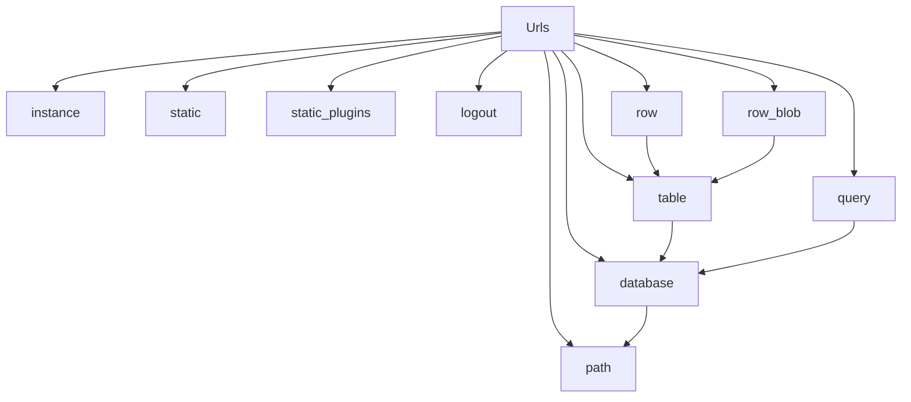

# `url_builder.py`

## `datasette.url_builder.Urls` · *class*

## Summary:
The Urls class provides a centralized interface for constructing URLs within a Datasette application, handling path construction, formatting, and encoding for various datasette resources.

## Description:
The Urls class serves as a factory for generating properly formatted URLs within Datasette. It encapsulates the logic for building paths with base URL prefixes, format parameters, and proper encoding. This class is typically instantiated by Datasette itself and accessed through the datasette instance's url_builder property.

The motivation for this abstraction is to ensure consistent URL construction throughout the application, handle base URL configuration, and manage special encoding requirements for database names, tables, and queries. It centralizes URL-building logic and prevents duplication across different parts of the codebase.

## State:
- ds: Datasette instance, required for accessing settings and database information
- The class maintains no other persistent state beyond the reference to the Datasette instance

## Lifecycle:
- Creation: Instantiated with a Datasette instance (ds) as the sole required argument
- Usage: Methods are called to build URLs for different resources (database, table, query, etc.) with appropriate chaining
- Destruction: No explicit cleanup required; relies on Python garbage collection

## Method Map:


## Raises:
- No explicit exceptions are raised by __init__
- All URL construction methods may raise exceptions from underlying utilities (path_with_format, tilde_encode) or from ds.get_database() if database doesn't exist

## Example:
```python
# Create URL builder instance
urls = Urls(datasette_instance)

# Build various URLs
instance_url = urls.instance(format="json")
db_url = urls.database("mydb")
table_url = urls.table("mydb", "mytable")
query_url = urls.query("mydb", "SELECT * FROM mytable")
row_url = urls.row("mydb", "mytable", "123")
blob_url = urls.row_blob("mydb", "mytable", "123", "image_column")
```

### `datasette.url_builder.Urls.__init__` · *method*

## Summary:
Initializes the Urls object with a Datasette instance, establishing the core dependency for URL building operations.

## Description:
This constructor method sets up the Urls class by storing the provided Datasette instance as an instance attribute. It serves as the entry point for configuring the URL builder with the necessary datasette context. The method is called during object instantiation and establishes the foundational relationship between the URL builder and the Datasette application instance.

## Args:
    ds (Datasette): A Datasette application instance that provides the context and configuration needed for URL construction.

## Returns:
    None: This method does not return any value.

## Raises:
    None: This method does not explicitly raise any exceptions.

## State Changes:
    Attributes READ: None
    Attributes WRITTEN: self.ds

## Constraints:
    Preconditions: The ds argument must be a valid Datasette instance.
    Postconditions: The Urls instance will have its self.ds attribute set to the provided Datasette instance.

## Side Effects:
    None: This method performs no I/O operations, external service calls, or mutations to objects outside the instance.

### `datasette.url_builder.Urls.path` · *method*

## Summary:
Constructs a full URL path by prefixing with the dataset's base URL and optionally appending a format extension.

## Description:
This method builds a complete URL path by taking a relative path and prepending the dataset's configured base URL. If the path starts with a forward slash, it removes it before concatenation. When a format is specified, it applies the appropriate format extension to the path. The method returns a PrefixedUrlString instance to maintain URL formatting consistency.

## Args:
    path (str or PrefixedUrlString): The relative path to construct a full URL for. If already a PrefixedUrlString, it's returned unchanged.
    format (str, optional): Format extension to append to the path (e.g., 'json', 'csv'). Defaults to None.

## Returns:
    PrefixedUrlString: A prefixed URL string combining the base URL with the path and optional format extension.

## Raises:
    None explicitly raised.

## State Changes:
    Attributes READ: self.ds.setting
    Attributes WRITTEN: None

## Constraints:
    Preconditions:
    - The path argument must be a string or PrefixedUrlString instance
    - The dataset's base_url setting must be accessible via self.ds.setting()
    Postconditions:
    - Returns a PrefixedUrlString instance
    - If format is provided, the resulting path will have the format extension applied
    - Leading slashes are stripped from paths before base URL concatenation

## Side Effects:
    None

### `datasette.url_builder.Urls.instance` · *method*

## Summary:
Returns a URL path for the root Datasette instance endpoint with optional format specification.

## Description:
Constructs and returns a URL path pointing to the root of the Datasette instance. This method is used to generate URLs for accessing the main instance view, typically used in navigation or API endpoints. It leverages the underlying `path` method with an empty path string and applies any requested output format.

## Args:
    format (str, optional): Output format specifier (e.g., 'json', 'csv', 'html'). Defaults to None.

## Returns:
    PrefixedUrlString: A formatted URL path string for the root instance endpoint, prefixed with the base URL and optionally formatted.

## Raises:
    None explicitly raised.

## State Changes:
    Attributes READ: self.ds, self.ds.setting
    Attributes WRITTEN: None

## Constraints:
    Preconditions: The Urls instance must be properly initialized with a Datasette instance (self.ds) containing a valid "base_url" setting.
    Postconditions: The returned PrefixedUrlString contains the properly constructed URL with base_url prefix and optional format extension applied.

## Side Effects:
    None.

### `datasette.url_builder.Urls.static` · *method*

## Summary:
Returns a URL path for a static resource by prefixing the given path with "-/static/".

## Description:
This method constructs a URL path for accessing static resources within the application. It is designed to be a convenience method for building paths to static assets like CSS, JavaScript, or image files. The method delegates to the parent `path` method after prepending the standard static resource prefix "-/static/" to the provided path.

The method is part of the Urls class and is typically used during the URL construction phase of web application requests to generate proper links to static assets.

## Args:
    path (str): The relative path to the static resource, such as "styles.css" or "images/logo.png".

## Returns:
    PrefixedUrlString: A URL path string prefixed with "-/static/" that can be used to reference static resources.

## Raises:
    None explicitly raised by this method.

## State Changes:
    Attributes READ: None
    Attributes WRITTEN: None

## Constraints:
    Preconditions: The `path` argument must be a valid string representing a relative path to a static resource.
    Postconditions: The returned value is a properly formatted URL path string with the "-/static/" prefix.

## Side Effects:
    None

### `datasette.url_builder.Urls.static_plugins` · *method*

## Summary:
Constructs a URL path for accessing static plugin resources by combining a base path with plugin name and resource path.

## Description:
This method generates a URL path for static plugin assets by formatting a path template with the provided plugin name and resource path. It leverages the existing `self.path` method to handle URL construction and formatting logic. The method is designed to create standardized paths for accessing static files within plugin directories, following the pattern "-/static-plugins/{plugin}/{path}".

This method exists as a dedicated utility to provide consistent URL generation for static plugin resources, separating concerns from the general path construction logic in the `path` method. It is part of the Urls class that provides various URL building utilities for the Datasette application.

## Args:
    plugin (str): Name of the plugin for which to construct the static resource path
    path (str): Path to the specific static resource within the plugin directory

## Returns:
    PrefixedUrlString: Formatted URL path string for the static plugin resource

## Raises:
    None explicitly raised

## State Changes:
    Attributes READ: None
    Attributes WRITTEN: None

## Constraints:
    Preconditions: 
    - The `plugin` argument must be a valid string identifier
    - The `path` argument must be a valid string representing a file path
    - The `self.path` method must be properly initialized and functional
    
    Postconditions:
    - Returns a properly formatted URL path string as a PrefixedUrlString object
    - The returned path follows the pattern "-/static-plugins/{plugin}/{path}"

## Side Effects:
    None

### `datasette.url_builder.Urls.logout` · *method*

## Summary:
Generates a URL path for logging out of the Datasette application.

## Description:
This method constructs and returns a URL path for the logout endpoint by calling the parent class's `path` method with the argument "-/logout". It is designed to be part of a URL building utility that generates various application paths. The logout path follows Datasette's convention for special endpoints prefixed with "-/".

## Args:
    self: The instance of the Urls class that this method belongs to.

## Returns:
    PrefixedUrlString: A PrefixedUrlString object representing the URL path for the logout endpoint.

## Raises:
    None explicitly raised by this method.

## State Changes:
    Attributes READ: None
    Attributes WRITTEN: None

## Constraints:
    Preconditions: The instance must have access to the parent class's `path` method and the `ds` attribute must be properly initialized.
    Postconditions: The returned PrefixedUrlString will contain a properly formatted URL path for the logout endpoint.

## Side Effects:
    None

### `datasette.url_builder.Urls.database` · *method*

## Summary:
Constructs a URL path for accessing a specific database resource with optional format specification.

## Description:
This method generates a properly formatted URL path for a given database by retrieving the database's route, encoding it appropriately, and constructing the full path using the base URL setting. It serves as a utility for building database-specific URLs within the application's URL routing system.

The method is typically called during URL construction phases when generating links to database resources, such as when creating navigation elements or API endpoints that reference specific databases. It is part of the Urls class that provides various URL construction utilities for different application resources.

This logic is encapsulated in its own method to promote code reuse and maintainability, separating the concerns of database route retrieval, URL encoding, and path construction from other URL-building operations. It leverages the tilde_encode function to properly encode special characters in database routes and integrates with the existing path construction mechanism.

## Args:
    database (str): Name of the database to construct a URL for.
    format (str, optional): Output format specifier (e.g., 'json', 'csv'). Defaults to None.

## Returns:
    PrefixedUrlString: A formatted URL path string prefixed with the application's base URL.

## Raises:
    None explicitly declared in the method signature, but may propagate exceptions from:
    - self.ds.get_database(database) if database doesn't exist
    - self.path() method calls
    - tilde_encode() function calls

## State Changes:
    Attributes READ: self.ds (database service instance)
    Attributes WRITTEN: None

## Constraints:
    Preconditions: 
    - The database parameter must correspond to a valid database registered with the dataset service (self.ds)
    - The self.ds instance must have a get_database method available
    - The self.ds instance must have a setting method that can retrieve the "base_url" setting
    - The database object returned by get_database must have a route attribute
    
    Postconditions:
    - Returns a properly formatted URL path string
    - The returned path includes the base URL prefix
    - If format is specified, the path includes appropriate format parameters

## Side Effects:
    None directly observable, but relies on external services:
    - Calls self.ds.get_database() which may involve database lookups or caching
    - Calls self.path() which may involve string manipulation and potentially query string handling
    - Uses tilde_encode() which performs character-by-character encoding

### `datasette.url_builder.Urls.table` · *method*

## Summary:
Constructs a URL path for accessing a specific database table with optional format specification.

## Description:
This method generates a properly formatted URL path for a database table by combining the database path and table name, applying URL encoding to handle special characters in the table name, and optionally appending a format extension. It serves as part of Datasette's URL building infrastructure to create consistent paths for table resources.

The method leverages the `self.database()` method to obtain the database path prefix, applies `tilde_encode()` to safely encode the table name, and uses `path_with_format()` to append format extensions when requested. This approach ensures proper URL construction for table endpoints regardless of special characters in table names or format specifications.

## Args:
    database (str): Name of the database containing the table
    table (str): Name of the table to access
    format (str, optional): Output format extension (e.g., 'json', 'csv'). Defaults to None

## Returns:
    PrefixedUrlString: A URL path string prefixed with the base URL, properly encoded and formatted

## Raises:
    None explicitly raised

## State Changes:
    Attributes READ: self.database (method)
    Attributes WRITTEN: None

## Constraints:
    Preconditions: 
    - database parameter must be a valid database name string
    - table parameter must be a valid table name string
    - format parameter, if provided, must be a valid format identifier string
    
    Postconditions:
    - Returned PrefixedUrlString contains a properly formatted path
    - Table name is URL-encoded using tilde encoding to handle special characters
    - Format extension is appended when specified, following Datasette's format conventions

## Side Effects:
    None

### `datasette.url_builder.Urls.query` · *method*

## Summary:
Constructs a URL path for executing a SQL query against a specified database in Datasette.

## Description:
This method builds a properly formatted URL path for querying a database using a SQL query string. It leverages the parent class's database method to construct the database portion of the path, applies tilde encoding to the query string for proper URL encoding, and optionally appends a format specifier for response formatting. This method is part of the Urls class responsible for generating various URL patterns in Datasette.

The method is designed to be reusable across different parts of the application where database query URLs need to be constructed, particularly in API endpoints and user interface elements that allow SQL query execution. It encapsulates the logic for proper URL construction and encoding to ensure compatibility with Datasette's routing system.

## Args:
    database (str): Name of the database to query
    query (str): SQL query string to execute
    format (str, optional): Response format (e.g., 'json', 'csv'). Defaults to None

## Returns:
    PrefixedUrlString: A URL path string prefixed with the appropriate base URL for the query endpoint

## Raises:
    None explicitly raised, but may propagate exceptions from:
    - self.database() method if database doesn't exist
    - path_with_format() utility function if format handling fails
    - tilde_encode() function if encoding fails

## State Changes:
    Attributes READ: None
    Attributes WRITTEN: None

## Constraints:
    Preconditions: 
    - database parameter must be a valid database name string registered with the dataset service
    - query parameter must be a valid SQL query string
    - format parameter, if provided, must be a valid format string
    
    Postconditions:
    - Returns a properly formatted URL path for database queries
    - Query string is properly URL-encoded using tilde encoding
    - Format parameter is handled according to Datasette's format handling rules

## Side Effects:
    None directly observable, but relies on external services:
    - Calls self.database() which may involve database lookup or caching
    - Uses path_with_format() which may involve query string manipulation
    - Uses tilde_encode() which performs character-by-character encoding

### `datasette.url_builder.Urls.row` · *method*

## Summary:
Constructs a URL path for accessing a specific database table row with optional format specification.

## Description:
This method generates a properly formatted URL path for a given database table row by combining the database and table paths with the provided row identifier. It serves as a utility for building row-specific URLs within the application's URL routing system.

The method is typically called during URL construction phases when generating links to specific table rows, such as when creating navigation elements or API endpoints that reference particular data records. It is part of the Urls class that provides various URL construction utilities for different application resources.

This logic is encapsulated in its own method to promote code reuse and maintainability, separating the concerns of row path construction from other URL-building operations. It leverages the existing table() method to build the base path and integrates with the path formatting mechanism.

## Args:
    database (str): Name of the database containing the table.
    table (str): Name of the table containing the row.
    row_path (str): Path identifier for the specific row.
    format (str, optional): Output format specifier (e.g., 'json', 'csv'). Defaults to None.

## Returns:
    PrefixedUrlString: A formatted URL path string for the database table row.

## Raises:
    None explicitly declared in the method signature, but may propagate exceptions from:
    - self.table() method calls
    - path_with_format() function calls

## State Changes:
    Attributes READ: None
    Attributes WRITTEN: None

## Constraints:
    Preconditions: 
    - The database and table parameters must correspond to valid database and table resources
    - The row_path parameter must be a valid identifier for a row in the specified table
    - The self.table() method must be callable and return a valid path
    
    Postconditions:
    - Returns a properly formatted URL path string
    - The returned path combines database/table path with the row identifier
    - If format is specified, the path includes appropriate format parameters

## Side Effects:
    None directly observable, but relies on external functions:
    - Calls self.table() which may involve database lookups or path construction
    - Calls path_with_format() which may involve string manipulation and query parameter handling

### `datasette.url_builder.Urls.row_blob` · *method*

## Summary:
Constructs a URL path for accessing a blob column value from a specific row in a database table.

## Description:
This method generates a URL that points to a specific blob column value within a row of a database table. It builds upon the base table URL by appending a blob-specific path and query parameter containing the column name. The column name is properly URL-encoded to handle special characters. This method is part of the URL building utilities for Datasette's web interface.

## Args:
    database (str): Name of the database containing the table.
    table (str): Name of the table containing the row.
    row_path (str): Path identifier for the specific row (typically a primary key or row ID).
    column (str): Name of the blob column to access.

## Returns:
    str: A URL string formatted as "{table_url}/{row_path}.blob?_blob_column={encoded_column_name}".

## Raises:
    None explicitly raised.

## State Changes:
    Attributes READ: None
    Attributes WRITTEN: None

## Constraints:
    Preconditions: All arguments must be non-empty strings. The database and table must exist in the system.
    Postconditions: The returned string is a valid URL path fragment for accessing a blob column value.

## Side Effects:
    None.

