# `__init__.py`

## `datasette.utils.__init__.documented` · *function*

## Summary:
Decorator that marks a function as documented by registering it in a global list.

## Description:
This decorator is used to identify functions that should be included in the public API documentation. It adds the decorated function to a global registry (`functions_marked_as_documented`) which is later used by the documentation generation system to determine which functions to document.

The decorator is designed to be transparent - it doesn't modify the behavior of the decorated function, but simply registers it for documentation purposes. This allows developers to easily mark functions for documentation without affecting their runtime behavior.

## Args:
    fn (callable): The function object to be marked as documented.

## Returns:
    callable: The original function unchanged, enabling normal function usage.

## Raises:
    None

## Constraints:
    - Preconditions: The argument `fn` must be a callable object (function, method, etc.).
    - Postconditions: The function is added to the global list `functions_marked_as_documented`.

## Side Effects:
    - Mutates the global variable `functions_marked_as_documented` by appending the decorated function to it.
    - No other side effects occur.

## Control Flow:
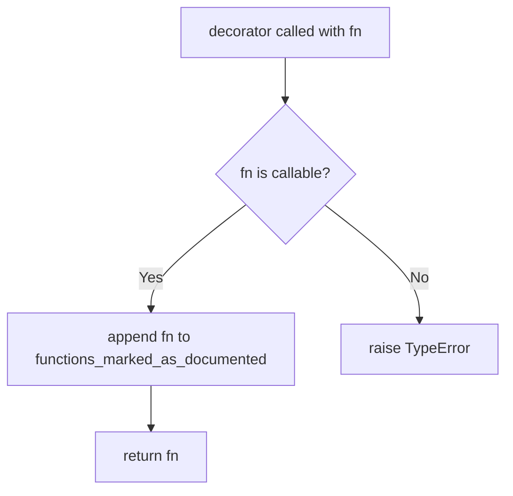

## Examples:
```python
# Mark a function for documentation
@documented
def my_api_function(param1, param2):
    """Process two parameters."""
    return param1 + param2

# The function is now registered in the documentation system
assert my_api_function in functions_marked_as_documented

# Regular usage still works
result = my_api_function(1, 2)  # Returns 3
```

## `datasette.utils.__init__.await_me_maybe` · *function*

## Summary:
Asynchronously handles values that may be callable or awaitable by executing them or awaiting them appropriately.

## Description:
This utility function provides a flexible way to process values that could be either synchronous callables, asynchronous coroutines, or plain values. It automatically detects the nature of the input and processes it accordingly, making it useful for handling mixed-type inputs in async contexts.

## Args:
    value (typing.Any): The input value to process, which can be a callable, an awaitable coroutine, or any other value.

## Returns:
    typing.Any: The result of executing the callable or awaiting the coroutine, or the original value if it's neither.

## Raises:
    Any exceptions raised by the callable or coroutine when executed or awaited.

## Constraints:
    - Preconditions: The input value can be of any type.
    - Postconditions: The returned value is the result of processing the input according to its type.

## Side Effects:
    - May execute functions or coroutines, potentially causing side effects from those executions.
    - No direct I/O operations or external state mutations.

## Control Flow:
```mermaid
flowchart TD
    A[Start] --> B{Is value callable?}
    B -- Yes --> C[Call value()]
    C --> D{Is result awaitable?}
    D -- Yes --> E[Await result]
    D -- No --> F[Return result]
    B -- No --> G{Is value awaitable?}
    G -- Yes --> H[Await value]
    G -- No --> I[Return value]
    E --> F
    H --> F
    F --> J[End]
    I --> J
```

## Examples:
```python
# Example 1: Simple value
result = await await_me_maybe("hello")
# Returns: "hello"

# Example 2: Callable
result = await await_me_maybe(lambda: "world")
# Returns: "world"

# Example 3: Async function
async def async_func():
    return "async_result"
result = await await_me_maybe(async_func())
# Returns: "async_result"
```

## `datasette.utils.__init__.urlsafe_components` · *function*

## Summary:
Splits a comma-separated token string and decodes each component using tilde-decoding.

## Description:
This function processes a token string that contains comma-separated values, where each value may be tilde-encoded. It splits the token on commas and applies tilde-decoding to each component to convert escape sequences back to their original characters. This logic is extracted into its own function to provide a clean interface for handling comma-separated, tilde-encoded data while encapsulating the splitting and decoding operations.

## Args:
    token (str): A comma-separated string potentially containing tilde-encoded values

## Returns:
    list[str]: A list of decoded string components, one for each comma-separated value in the input

## Raises:
    None explicitly raised

## Constraints:
    Preconditions:
        - Input token must be a string
    Postconditions:
        - Each component is properly decoded using tilde_decode
        - The returned list maintains the same order as the comma-separated components

## Side Effects:
    None

## Control Flow:
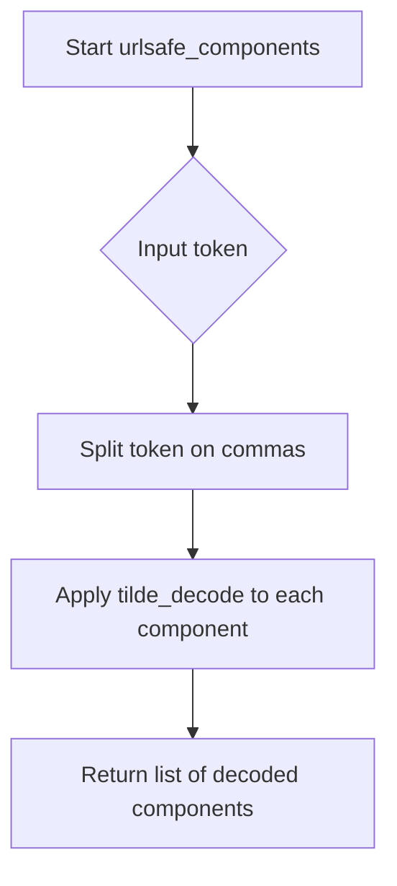

## Examples:
    >>> urlsafe_components("foo~2Cbar,baz~2Fqux")
    ['foo,bar', 'baz/qux']
    
    >>> urlsafe_components("simple,value")
    ['simple', 'value']
    
    >>> urlsafe_components("encoded~20string")
    ['encoded string']
```

## `datasette.utils.__init__.path_from_row_pks` · *function*

## Summary:
Generates a unique identifier for a database row by combining its primary key values, with optional tilde-encoding for URL safety.

## Description:
This function creates a compact, unique string identifier for a database row by extracting its primary key values. It supports two modes: using the row's internal rowid or using specified primary key columns. The resulting identifier can be optionally tilde-encoded to ensure URL-safe formatting. This utility is commonly used in Datasette's URL routing system to uniquely identify rows across different database tables.

## Args:
    row (dict): A dictionary representing a database row, containing either 'rowid' key or primary key column values
    pks (list[str]): List of primary key column names to extract values from when use_rowid is False
    use_rowid (bool): If True, uses the row's internal rowid instead of primary key values
    quote (bool): If True, applies tilde-encoding to each primary key value for URL safety; defaults to True

## Returns:
    str: A comma-separated string of primary key values (optionally tilde-encoded) that uniquely identifies the row

## Raises:
    None explicitly raised by this function

## Constraints:
    Preconditions:
        - When use_rowid=False, row must contain all keys specified in pks
        - When use_rowid=True, row must contain 'rowid' key
        - All primary key values must be convertible to strings
    
    Postconditions:
        - Return value is always a comma-separated string
        - If quote=True, each component is tilde-encoded for URL safety
        - The returned string uniquely identifies the row within the context of the table's primary key structure

## Side Effects:
    None

## Control Flow:
```mermaid
flowchart TD
    A[Start path_from_row_pks] --> B{use_rowid}
    B -- True --> C[bits = [row["rowid"]]]
    B -- False --> D[Extract pks values from row]
    D --> E{quote}
    E -- True --> F[Apply tilde_encode to each bit]
    E -- False --> G[Convert each bit to str]
    F --> H[Join bits with commas]
    G --> H
    H --> I[Return result]
```

## Examples:
    >>> row = {"id": 123, "name": "test"}
    >>> path_from_row_pks(row, ["id"], False)
    '123'
    
    >>> row = {"id": 123, "name": "test"}
    >>> path_from_row_pks(row, ["id"], False, quote=False)
    '123'
    
    >>> row = {"rowid": 456}
    >>> path_from_row_pks(row, ["id"], True)
    '456'
    
    >>> row = {"name": "/path/to/file"}
    >>> path_from_row_pks(row, ["name"], False)
    '~2Fpath~2Fto~2Ffile'

## `datasette.utils.__init__.compound_keys_after_sql` · *function*

## Summary:
Generates SQL WHERE clauses for keyset pagination using compound primary keys.

## Description:
Creates a series of OR-connected SQL conditions that enable efficient keyset-based pagination for tables with compound primary keys. This function implements the algorithm described in Datasette issue #190 to construct pagination queries that can efficiently skip to a specific record position without using OFFSET.

The function is extracted into its own utility to encapsulate the complex logic of building multi-level comparison expressions for compound keys, separating this concern from the main query construction logic.

## Args:
    pks (list[str]): List of primary key column names that form a compound key.
    start_index (int): Starting parameter index for SQL placeholders. Defaults to 0.

## Returns:
    str: A formatted SQL WHERE clause string containing OR-connected conditions for keyset pagination.

## Raises:
    None explicitly raised.

## Constraints:
    Preconditions:
        - pks must be a non-empty list of strings representing valid column names.
        - start_index must be a non-negative integer.
    Postconditions:
        - Returns a properly formatted SQL fragment enclosed in parentheses.
        - Each primary key is escaped using the escape_sqlite utility function.

## Side Effects:
    None.

## Control Flow:
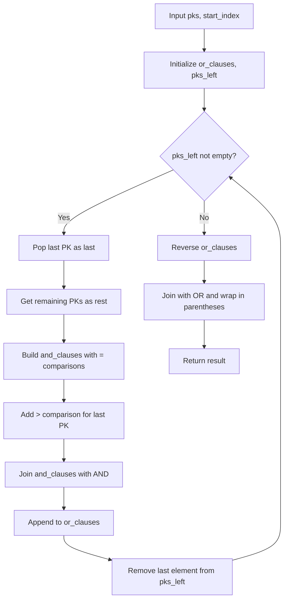

## Examples:
    compound_keys_after_sql(['id', 'created_at'])
    # Returns: "([id] > :p0) or ([id] = :p0 and [created_at] > :p1)"

    compound_keys_after_sql(['user_id', 'post_id', 'timestamp'], start_index=2)
    # Returns: "([user_id] > :p2) or ([user_id] = :p2 and [post_id] > :p3) or ([user_id] = :p2 and [post_id] = :p3 and [timestamp] > :p4)"

## `datasette.utils.__init__.CustomJSONEncoder` · *class*

## Summary:
A custom JSON encoder that extends the standard library's JSONEncoder to handle SQLite-specific data types and binary data.

## Description:
This class overrides the default serialization behavior of Python's standard JSONEncoder to properly serialize SQLite database objects (Row and Cursor) and binary data. It serves as a specialized encoder for Datasette's JSON output, ensuring that database query results and binary data can be correctly converted to JSON format without losing information or causing serialization errors.

The encoder is designed to be used with Python's json.dumps() function via the cls parameter, allowing seamless integration with existing JSON serialization workflows while extending support for Datasette-specific data types.

## State:
- Inherits all state from json.JSONEncoder parent class
- No additional instance attributes beyond those inherited from the parent
- The default method is overridden to provide custom serialization logic

## Lifecycle:
- Creation: Instantiated automatically when needed by JSON serialization functions
- Usage: Called internally by Python's json.dumps() when encountering unsupported object types
- Destruction: Managed by Python's garbage collector

## Method Map:
```mermaid
graph TD
    A[json.dumps(cls=CustomJSONEncoder)] --> B[CustomJSONEncoder.default()]
    B --> C{obj instanceof sqlite3.Row?}
    C -->|Yes| D[return tuple(obj)]
    C -->|No| E{obj instanceof sqlite3.Cursor?}
    E -->|Yes| F[return list(obj)]
    E -->|No| G{obj instanceof bytes?}
    G -->|Yes| H[try decode utf8]
    H -->|Success| I[return decoded string]
    H -->|Failure| J[return base64 dict]
    G -->|No| K[super().default(obj)]
```

## Raises:
- No explicit exceptions raised by CustomJSONEncoder.__init__
- May raise UnicodeDecodeError internally when processing bytes (caught and handled)
- The parent class may raise exceptions for unsupported types during fallback

## Example:
```python
import json
from datasette.utils import CustomJSONEncoder
import sqlite3

# Create a custom encoder instance
encoder = CustomJSONEncoder()

# Handle SQLite Row
row = sqlite3.Row((1, 'test'))
result = encoder.default(row)  # Returns tuple representation

# Handle bytes
binary_data = b'\x89PNG\r\n\x1a\n'
result = encoder.default(binary_data)  # Returns base64 encoded dict

# Handle regular objects
result = encoder.default({'key': 'value'})  # Delegates to parent

# Use with json.dumps
data = {'row': row, 'binary': binary_data}
json_string = json.dumps(data, cls=CustomJSONEncoder)
```

### `datasette.utils.__init__.CustomJSONEncoder.default` · *method*

## Summary:
Handles serialization of special Python objects (sqlite3.Row, sqlite3.Cursor, bytes) into JSON-compatible formats during JSON encoding.

## Description:
This method extends the standard JSONEncoder's default handling to support serialization of SQLite-specific objects and binary data that are not natively JSON serializable. It is invoked automatically by the JSON encoding process when encountering objects that aren't basic types like str, int, float, list, dict, etc. The method ensures that Datasette can properly serialize database results and binary data for JSON responses.

## Args:
    self: The CustomJSONEncoder instance
    obj: The Python object being serialized to JSON

## Returns:
    For sqlite3.Row objects: Returns a tuple representation of the row
    For sqlite3.Cursor objects: Returns a list of rows from the cursor
    For bytes objects: Returns either the UTF-8 decoded string or a base64-encoded dictionary
    For all other objects: Delegates to the parent JSONEncoder.default method

## Raises:
    UnicodeDecodeError: When bytes cannot be decoded as UTF-8, triggering base64 encoding fallback

## State Changes:
    Attributes READ: None
    Attributes WRITTEN: None

## Constraints:
    Preconditions: The method assumes obj is a valid Python object that may be one of the supported special types
    Postconditions: The returned value is JSON serializable

## Side Effects:
    I/O: Base64 encoding operations using base64.b64encode
    External service calls: None

## `datasette.utils.__init__.sqlite_timelimit` · *function*

## Summary:
Sets a time limit for SQLite queries by installing a progress handler that monitors execution time and terminates long-running queries.

## Description:
This function implements a timeout mechanism for SQLite database operations by configuring a progress handler on the provided connection. It allows queries to be terminated if they exceed the specified time limit, preventing long-running queries from blocking the system. The function uses a context manager pattern to ensure proper cleanup of the progress handler regardless of how the wrapped code exits.

## Args:
    conn: A SQLite database connection object that supports the set_progress_handler method
    ms: An integer representing the maximum time in milliseconds allowed for the query

## Returns:
    This function is a context manager that yields control to the wrapped code block. It does not return a meaningful value directly.

## Raises:
    None explicitly raised by this function. However, if the wrapped code block raises exceptions, they propagate normally.

## Constraints:
    Preconditions:
        - The conn parameter must be a valid SQLite connection object with set_progress_handler method
        - The ms parameter must be a non-negative integer
    Postconditions:
        - The progress handler is installed before yielding control
        - The progress handler is uninstalled after the wrapped code completes (even if it raises an exception)

## Side Effects:
    - Installs a progress handler on the SQLite connection, which may affect query execution timing
    - Modifies the connection's progress handler settings temporarily
    - No external I/O operations or state mutations beyond the SQLite connection

## Control Flow:
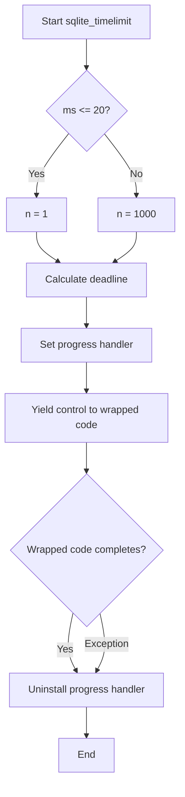

## Examples:
```python
# Basic usage with a 500ms timeout
with sqlite_timelimit(conn, 500):
    cursor.execute("SELECT * FROM large_table")

# Usage in a test environment with very short timeout
with sqlite_timelimit(conn, 10):
    cursor.execute("SELECT * FROM test_table")
```

## `datasette.utils.__init__.InvalidSql` · *class*

## Summary:
Represents an exception raised when invalid SQL is encountered during database operations.

## Description:
The InvalidSql class is a custom exception that extends Python's built-in Exception class. It serves as a specialized error type to indicate when SQL queries or operations are malformed or otherwise invalid. This abstraction allows the system to distinguish SQL-related errors from other types of exceptions and handle them appropriately in the database layer.

This class is typically instantiated by SQL validation functions or database operation handlers when they detect malformed SQL syntax or unsupported operations. The exception carries no additional data beyond what's inherent to the standard Exception class, making it suitable for simple error signaling without requiring extra context.

## State:
- No instance attributes are defined beyond those inherited from Exception
- The class inherits all standard Exception behavior including message storage and traceback generation
- No constructor parameters are accepted (uses default Exception.__init__)

## Lifecycle:
- Creation: Instantiated using standard exception syntax like `raise InvalidSql("message")`
- Usage: Raised during SQL validation or execution when invalid syntax is detected
- Destruction: Handled by standard Python exception handling mechanisms

## Method Map:
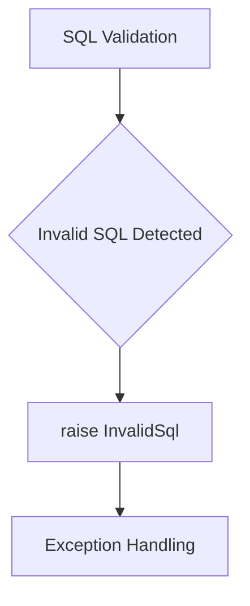

## Raises:
- InvalidSql: Raised when SQL validation fails due to malformed syntax or unsupported operations

## Example:
```python
try:
    # Some SQL validation operation
    validate_sql(query)
except InvalidSql as e:
    print(f"Invalid SQL detected: {e}")
    # Handle the invalid SQL case
```

## `datasette.utils.__init__.validate_sql_select` · *function*

## Summary:
Validates that SQL input is a SELECT statement and does not contain prohibited patterns.

## Description:
This function performs validation on SQL statements to ensure they are SELECT queries and do not contain disallowed patterns. It strips out SQL comments, normalizes the input to lowercase, and applies regex-based checks to enforce these constraints. The function is designed to prevent execution of potentially dangerous SQL operations like INSERT, UPDATE, DELETE, etc.

## Args:
    sql (str): The SQL statement to validate. Must be a string containing valid SQL syntax.

## Returns:
    None: This function does not return any value. It raises an exception if validation fails.

## Raises:
    InvalidSql: Raised when the SQL statement is not a SELECT query or contains prohibited patterns. This exception is a custom exception that extends Python's built-in Exception class and is used to signal SQL validation failures.

## Constraints:
    Preconditions:
        - Input must be a string
        - Input must contain valid SQL syntax (though not necessarily safe SQL)
    Postconditions:
        - Function completes without raising an exception if SQL is valid SELECT statement
        - Function raises InvalidSql exception if SQL is not a SELECT or contains prohibited patterns

## Side Effects:
    None: This function has no side effects beyond validating input.

## Control Flow:
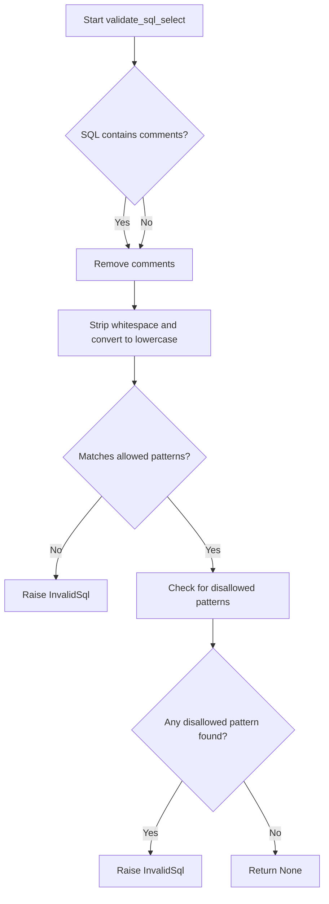

## Examples:
    # Valid SELECT statement
    validate_sql_select("SELECT * FROM users")
    
    # Invalid statement (INSERT)
    try:
        validate_sql_select("INSERT INTO users VALUES ('John')")
    except InvalidSql as e:
        print(f"Validation failed: {e}")
        
    # Invalid statement with disallowed pattern
    try:
        validate_sql_select("SELECT * FROM users; DROP TABLE users")
    except InvalidSql as e:
        print(f"Validation failed: {e}")
```

## `datasette.utils.__init__.append_querystring` · *function*

## Summary:
Appends a query string to a URL, properly handling existing query parameters by inserting the correct separator character.

## Description:
This function takes a URL and a query string, and appends the query string to the URL with the appropriate separator ('?' or '&'). It ensures that URLs with existing query parameters are handled correctly by using '&' as the separator, while URLs without query parameters get a '?' separator. This function is commonly used in web applications to build URLs with additional query parameters.

## Args:
    url (str): The base URL to which the query string will be appended. May or may not already contain query parameters.
    querystring (str): The query string to append to the URL. Should not contain a leading '?' character.

## Returns:
    str: The resulting URL with the query string properly appended using '?' or '&' as the separator.

## Raises:
    None

## Constraints:
    Preconditions:
        - Both `url` and `querystring` must be strings.
        - The `querystring` should not already contain a leading '?' character.
    Postconditions:
        - The returned URL will have exactly one '?' character if there were no existing query parameters.
        - The returned URL will have exactly one '&' character if there were existing query parameters.
        - The function does not validate the format of either the URL or query string beyond basic string operations.

## Side Effects:
    None

## Control Flow:
```mermaid
flowchart TD
    A[Start] --> B{Does URL contain "?"?}
    B -- Yes --> C[Set op = "&"]
    B -- No --> D[Set op = "?"]
    C --> E[Return f"{url}{op}{querystring}"]
    D --> E
```

## Examples:
    >>> append_querystring("https://example.com", "key=value")
    'https://example.com?key=value'
    
    >>> append_querystring("https://example.com?existing=param", "key=value")
    'https://example.com?existing=param&key=value'
    
    >>> append_querystring("https://example.com?", "key=value")
    'https://example.com?&key=value'
    
    >>> append_querystring("https://example.com?param1=value1&param2=value2", "key=value")
    'https://example.com?param1=value1&param2=value2&key=value'

## `datasette.utils.__init__.path_with_added_args` · *function*

## Summary:
Constructs a URL path with additional query arguments while preserving existing query parameters and removing specified parameters.

## Description:
This function takes a request object and adds or modifies query parameters in the URL path. It handles both adding new parameters and removing existing ones by setting their values to None. The function preserves all existing query parameters that are not marked for removal, making it useful for building navigation URLs with filtered or updated parameters.

## Args:
    request: The HTTP request object containing the original path and query string.
    args: Either a dictionary of query parameters to add/update or an iterable of (key, value) pairs. If a value is None, the parameter will be removed from the resulting URL.
    path: Optional override for the base path. If not provided, uses request.path.

## Returns:
    A string representing the full URL path with updated query parameters.

## Raises:
    None explicitly raised.

## Constraints:
    Preconditions:
    - request must have a path attribute
    - request must have a query_string attribute
    - args must be either a dictionary or an iterable of key-value pairs

    Postconditions:
    - The returned string is a valid URL path
    - All parameters in args with None values are removed from the result
    - Parameters not in args are preserved from the original request

## Side Effects:
    None.

## Control Flow:
```mermaid
flowchart TD
    A[Start] --> B{args is dict?}
    B -- Yes --> C[Convert args to items()]
    B -- No --> C
    C --> D[Extract args_to_remove]
    D --> E[Parse existing query string]
    E --> F[Filter out removed params]
    F --> G[Add new non-None params]
    G --> H[Build query string]
    H --> I[Append to path]
    I --> J[Return result]
```

## Examples:
    # Adding a new parameter
    path_with_added_args(request, {"page": "2"}) 
    
    # Removing a parameter by setting it to None
    path_with_added_args(request, {"sort": None})
    
    # Combining additions and removals
    path_with_added_args(request, {"page": "2", "sort": None, "filter": "active"})
    
    # Using with custom path
    path_with_added_args(request, {"page": "2"}, "/custom/path")

## `datasette.utils.__init__.path_with_removed_args` · *function*

## Summary:
Removes specified query arguments from a URL path and returns the modified path.

## Description:
This function takes a request object and a set or dictionary of query arguments to remove, then constructs a new URL path with those arguments stripped out. It handles both cases where the path is derived from the request object or provided explicitly, and properly manages query string parsing and reconstruction. This utility is commonly used in web applications to modify URLs while preserving the base path.

## Args:
    request: The request object containing the original path and query string.
    args: Either a set of query argument names to remove, or a dictionary mapping argument names to specific values to remove.
    path: Optional override for the path to process. If not provided, uses request.path.

## Returns:
    A string representing the URL path with specified query arguments removed.

## Raises:
    None explicitly raised.

## Constraints:
    Preconditions:
    - The request object must have a query_string attribute.
    - The request object must have a path attribute.
    - The args parameter must be either a set or a dictionary.

    Postconditions:
    - The returned string is a valid URL path.
    - Query arguments matching the criteria are removed from the path.
    - If no arguments are removed, the original path is returned unchanged.

## Side Effects:
    None.

## Control Flow:
```mermaid
flowchart TD
    A[Start] --> B{path is None?}
    B -- Yes --> C[Use request.path]
    B -- No --> D[path contains ?]
    D -- Yes --> E[Split path and query_string at first ?]
    D -- No --> F[Use path as-is, query_string = request.query_string]
    C --> G[Set query_string = request.query_string]
    E --> G
    F --> G
    G --> H{args type}
    H -- set --> I[Define should_remove to check key membership]
    H -- dict --> J[Define should_remove to check key-value match]
    I --> K[Iterate through query string pairs]
    J --> K
    K --> L{should_remove(key, value)}
    L -- True --> M[Skip pair]
    L -- False --> N[Add pair to current]
    N --> O[Rebuild query string]
    M --> O
    O --> P{query_string not empty?}
    P -- Yes --> Q[Prepend ?]
    P -- No --> R[Return path]
    Q --> R
    R --> S[Return path + query_string]
```

## Examples:
    Example 1: Remove specific query arguments by name
    ```python
    # Given a request with path="/search?q=python&sort=date&limit=10"
    # and args={"sort", "limit"}
    # Result would be "/search?q=python"
    ```

    Example 2: Remove specific query arguments by key-value pair
    ```python
    # Given a request with path="/search?q=python&sort=date&limit=10"
    # and args={"sort": "date"}
    # Result would be "/search?q=python&limit=10"
    ```

## `datasette.utils.__init__.path_with_replaced_args` · *function*

## Summary:
Constructs a URL path with updated query parameters by replacing existing ones with new values.

## Description:
This function takes an HTTP request object and a set of arguments, then generates a new URL path that maintains the original path while updating or adding query string parameters. It's commonly used in web applications to modify URLs with new parameters while preserving the base path and excluding old parameters that are being replaced.

The function extracts existing query parameters from the request, filters out those that are being replaced, adds the new parameters, and constructs a new query string. This approach ensures clean URL construction without duplicate or conflicting parameters.

## Args:
    request: An HTTP request object containing the original path and query string.
    args: Either a dictionary or iterable of key-value pairs representing new query parameters to add or replace.
    path: Optional string specifying the base path. If not provided, uses request.path.

## Returns:
    A string representing the full URL path with updated query parameters.

## Raises:
    None explicitly raised by this function.

## Constraints:
    Preconditions:
    - The request object must have a path attribute and a query_string attribute.
    - The args parameter must be either a dictionary or an iterable of key-value pairs.
    
    Postconditions:
    - The returned string is a valid URL path with properly encoded query parameters.
    - Query parameters from args that have None values are excluded from the result.

## Side Effects:
    None.

## Control Flow:
```mermaid
flowchart TD
    A[Start] --> B{args is dict?}
    B -- Yes --> C[Convert args to items()]
    B -- No --> C
    C --> D[Extract keys_to_replace from args]
    D --> E[Parse existing query string]
    E --> F[Filter out replaced keys]
    F --> G[Add new args (non-None)]
    G --> H[Encode new query string]
    H --> I{Query string exists?}
    I -- Yes --> J[Prepend ?]
    I -- No --> J
    J --> K[Return path + query string]
```

## Examples:
    # Basic usage with dict args
    new_path = path_with_replaced_args(request, {"page": "2", "sort": "name"})
    
    # Usage with list of tuples
    new_path = path_with_replaced_args(request, [("category", "tech"), ("limit", "10")])
    
    # With custom path
    new_path = path_with_replaced_args(request, {"filter": "active"}, path="/api/users")
    
    # Excluding parameters with None values
    new_path = path_with_replaced_args(request, {"page": "2", "filter": None})
```

## `datasette.utils.__init__.escape_css_string` · *function*

## Summary:
Escapes special characters in a string for safe use in CSS contexts by converting them to Unicode hex escape sequences.

## Description:
This function prepares strings for use in CSS by escaping characters that could break CSS parsing or introduce security vulnerabilities. It handles carriage return + newline sequences by normalizing them to just newlines, then applies CSS-specific escaping to prevent interpretation of special characters as CSS syntax.

## Args:
    s (str): The input string to escape for CSS usage. Must be a valid string.

## Returns:
    str: A CSS-safe version of the input string where special characters are escaped using Unicode hex escape sequences (e.g., \00000A for newline).

## Raises:
    None explicitly raised by this function.

## Constraints:
    Preconditions:
    - Input must be a string type
    - Input should not be None
    
    Postconditions:
    - Output string contains only valid CSS characters
    - All problematic CSS characters are properly escaped
    - Line endings are normalized to \n format

## Side Effects:
    None

## Control Flow:
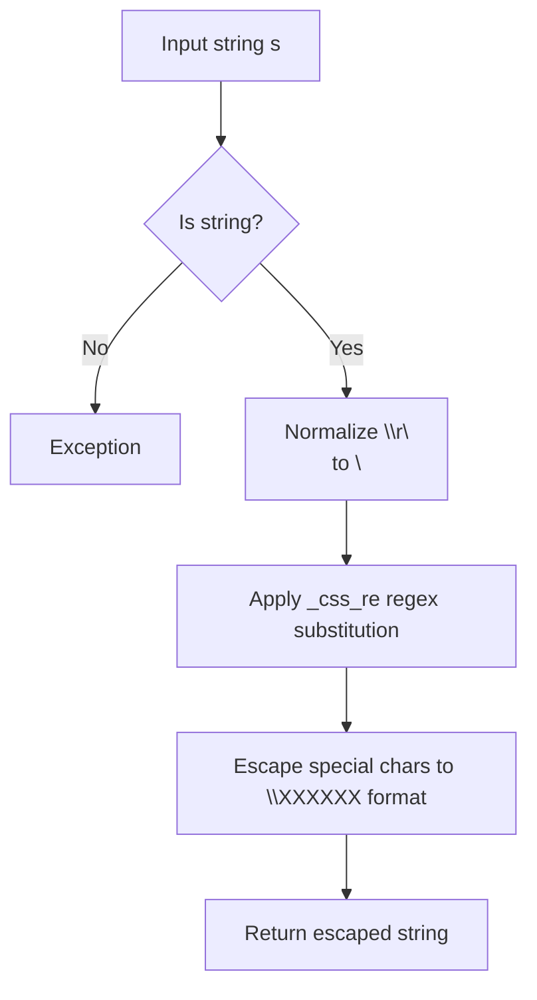

## Examples:
    >>> escape_css_string("hello\nworld")
    'hello\\00000Aworld'
    
    >>> escape_css_string("color: red;")
    'color\\00003A red\\00003B'
    
    >>> escape_css_string("background:url('test.jpg')")
    'background\\00003Aurl\\000028\\000027test.jpg\\000027\\000029'
```

## `datasette.utils.__init__.escape_sqlite` · *function*

## Summary:
Escapes SQLite identifiers by wrapping them in square brackets when they are not valid keywords or reserved words.

## Description:
This function determines whether an SQLite identifier needs to be escaped with square brackets to ensure proper SQL parsing. It checks if the identifier matches a pattern for "boring" keywords and is not in the list of reserved words. If both conditions are met, the identifier is returned unchanged; otherwise, it is wrapped in square brackets.

The function is designed to handle SQLite identifier escaping properly, ensuring that identifiers that could conflict with SQL keywords are safely quoted while preserving those that are safe to use directly.

## Args:
    s (str): The SQLite identifier string to escape.

## Returns:
    str: The escaped identifier, either unchanged or wrapped in square brackets.

## Raises:
    None explicitly raised.

## Constraints:
    Preconditions:
        - Input must be a string.
    Postconditions:
        - Output is always a string.
        - If input is a valid non-reserved keyword, it remains unchanged.
        - Otherwise, it is wrapped in square brackets.

## Side Effects:
    None.

## Control Flow:
```mermaid
flowchart TD
    A[Input string s] --> B{Matches _boring_keyword_re?}
    B -- Yes --> C{s.lower() not in reserved_words?}
    C -- Yes --> D[Return s]
    C -- No --> E[Return [s]]
    B -- No --> E
```

## Examples:
    escape_sqlite("id")  # Returns "id" (unchanged)
    escape_sqlite("select")  # Returns "[select]" (escaped)
    escape_sqlite("table_name")  # Returns "table_name" (unchanged)
```

## `datasette.utils.__init__.make_dockerfile` · *function*

## Summary:
Generates a Dockerfile configuration for running Datasette applications with specified dependencies, configurations, and optional features like Spatialite support.

## Description:
This function constructs a complete Dockerfile string tailored for deploying Datasette applications. It handles various configuration options such as file mounting, metadata files, template directories, plugin directories, static mounts, extra command-line options, and installation requirements. The function also manages environment variables, port configurations, and conditional dependencies like Spatialite support.

The logic is extracted into its own function to encapsulate the complexity of Dockerfile generation and ensure consistent formatting across different deployment scenarios. This promotes reusability and reduces duplication in deployment workflows.

## Args:
    files (list[str]): List of SQLite database filenames to be included in the Docker image.
    metadata_file (str or None): Path to a metadata JSON file for Datasette configuration.
    extra_options (str or None): Additional command-line options to pass to the datasette serve command.
    branch (str or None): Git branch name to install Datasette from GitHub (e.g., "main" or "v0.60"). If provided, installs from GitHub archive.
    template_dir (str or None): Directory containing custom Jinja templates.
    plugins_dir (str or None): Directory containing custom Datasette plugins.
    static (list[tuple[str, str]] or None): List of tuples specifying static file mount points as (mount_point, directory_path).
    install (list[str]): Additional packages to install via pip.
    spatialite (bool): Whether to enable Spatialite support in the Docker image.
    version_note (str or None): Version note to display in the Datasette UI.
    secret (str): Secret key used for Datasette's security features.
    environment_variables (dict[str, str] or None): Additional environment variables to set in the Docker container.
    port (int): Port number to expose and run Datasette on (default: 8001).
    apt_get_extras (list[str] or None): Additional Debian packages to install via apt-get.

## Returns:
    str: A formatted Dockerfile string ready for use in building a Datasette Docker image.

## Raises:
    None explicitly raised.

## Constraints:
    Preconditions:
    - The `files` parameter must be a list of valid SQLite database file paths.
    - The `secret` parameter must be a non-empty string.
    - All directory paths (template_dir, plugins_dir) must be valid if provided.
    Postconditions:
    - The returned Dockerfile string is properly formatted and contains all requested configurations.
    - Environment variables are correctly set, including DATASETTE_SECRET and SQLITE_EXTENSIONS when applicable.

## Side Effects:
    None.

## Control Flow:
```mermaid
flowchart TD
    A[Start make_dockerfile] --> B[Initialize cmd array with base command]
    B --> C[Set environment_variables to default if None]
    C --> D[Set DATASETTE_SECRET in environment_variables]
    D --> E[Set apt_get_extras to default if None]
    E --> F[Add files to cmd with -i flags]
    F --> G[Add --cors and --inspect-file to cmd]
    G --> H{metadata_file provided?}
    H -->|Yes| I[Add --metadata flag to cmd]
    I --> J{template_dir provided?}
    J -->|Yes| K[Add --template-dir flag to cmd]
    K --> L{plugins_dir provided?}
    L -->|Yes| M[Add --plugins-dir flag to cmd]
    M --> N{version_note provided?}
    N -->|Yes| O[Add --version-note flag to cmd]
    O --> P{static provided?}
    P -->|Yes| Q[Add --static flags to cmd]
    Q --> R{extra_options provided?}
    R -->|Yes| S[Add extra options to cmd]
    S --> T[Quote cmd parts with shlex.quote]
    T --> U[Add --port $PORT to cmd]
    U --> V[Join cmd parts into string]
    V --> W{branch provided?}
    W -->|Yes| X[Install from GitHub branch URL]
    X --> Y[Else install datasette from PyPI]
    Y --> Z[Process apt_get_extras for Spatialite]
    Z --> AA[Return formatted Dockerfile]
```

## Examples:
    Example usage with basic configuration:
    ```python
    dockerfile_content = make_dockerfile(
        files=["data.db"],
        metadata_file="metadata.json",
        extra_options="--cors",
        branch=None,
        template_dir=None,
        plugins_dir=None,
        static=None,
        install=[],
        spatialite=False,
        version_note="Production deployment",
        secret="my-secret-key"
    )
    ```

    Example usage with Spatialite support:
    ```python
    dockerfile_content = make_dockerfile(
        files=["spatial_data.db"],
        metadata_file=None,
        extra_options=None,
        branch=None,
        template_dir="templates/",
        plugins_dir="plugins/",
        static=[("/static", "static/")],
        install=["geoalchemy2"],
        spatialite=True,
        version_note="Spatial dataset",
        secret="secure-secret-key"
    )
    ```

## `datasette.utils.__init__.temporary_docker_directory` · *function*

## Summary:
Creates a temporary directory structure for Docker deployment configuration, yielding the path to a configured Datasette deployment environment.

## Description:
This function generates a temporary directory containing all necessary files for creating a Docker image to deploy a Datasette application. It creates a structured directory layout, generates a Dockerfile based on provided configuration parameters, copies required files (SQLite databases, metadata, templates, plugins, static assets), and yields the path to the temporary directory. The temporary directory is automatically cleaned up after use via a context manager pattern.

The function is extracted into its own utility to encapsulate the complex process of preparing a temporary deployment environment, ensuring proper cleanup and consistent directory structure regardless of deployment scenario. It serves as a building block for Datasette's deployment workflows.

## Args:
    files (list[str]): List of SQLite database file paths to include in the Docker image.
    name (str): Name of the temporary directory to create.
    metadata (TextIO or None): File handle to a metadata JSON/YAML file, or None if no metadata is provided.
    extra_options (str or None): Additional command-line options to pass to datasette serve.
    branch (str or None): Git branch name to install Datasette from GitHub (e.g., "main" or "v0.60").
    template_dir (str or None): Directory containing custom Jinja templates.
    plugins_dir (str or None): Directory containing custom Datasette plugins.
    static (list[tuple[str, str]] or None): List of tuples specifying static file mount points as (mount_point, directory_path).
    install (list[str]): Additional packages to install via pip.
    spatialite (bool): Whether to enable Spatialite support in the Docker image.
    version_note (str or None): Version note to display in the Datasette UI.
    secret (str): Secret key used for Datasette's security features.
    extra_metadata (dict[str, Any] or None): Additional metadata values to merge with parsed metadata (default: None).
    environment_variables (dict[str, str] or None): Additional environment variables to set in the Docker container (default: None).
    port (int): Port number to expose and run Datasette on (default: 8001).
    apt_get_extras (list[str] or None): Additional Debian packages to install via apt-get (default: None).

## Returns:
    str: Path to the temporary directory containing the Docker deployment configuration.

## Raises:
    None explicitly raised.

## Constraints:
    Preconditions:
        - The `files` parameter must be a list of valid SQLite database file paths.
        - The `secret` parameter must be a non-empty string.
        - All directory paths (template_dir, plugins_dir) must be valid if provided.
        - The `name` parameter must be a valid directory name.
    Postconditions:
        - The temporary directory is created and populated with all necessary files.
        - The yielded directory path is valid and contains a properly formatted Dockerfile.
        - The temporary directory is automatically cleaned up after use.

## Side Effects:
    - Creates temporary directory structure on disk.
    - Changes current working directory during execution.
    - Writes files to temporary directory (Dockerfile, metadata.json).
    - Copies files from source locations to temporary directory.
    - Modifies global working directory state temporarily.

## Control Flow:
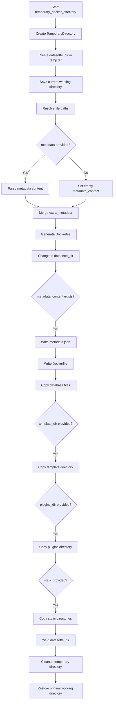

## Examples:
```python
# Basic usage with minimal configuration
with temporary_docker_directory(
    files=["data.db"],
    name="my-datasette-app",
    metadata=None,
    extra_options=None,
    branch=None,
    template_dir=None,
    plugins_dir=None,
    static=None,
    install=[],
    spatialite=False,
    version_note=None,
    secret="my-secret-key"
) as temp_dir:
    print(f"Temporary directory created at: {temp_dir}")
    # Docker image can be built from this directory

# Usage with metadata and custom configuration
with temporary_docker_directory(
    files=["spatial.db"],
    name="spatial-datasette",
    metadata=open("metadata.json"),
    extra_options="--cors",
    branch="main",
    template_dir="templates/",
    plugins_dir="plugins/",
    static=[("/static", "static/")],
    install=["geoalchemy2"],
    spatialite=True,
    version_note="Spatial dataset",
    secret="secure-secret-key",
    extra_metadata={"title": "My Spatial Dataset"}
) as temp_dir:
    # Build Docker image from temp_dir
    pass
```

## `datasette.utils.__init__.detect_primary_keys` · *function*

## Summary:
Determines the primary key column(s) for a given database table by analyzing column metadata.

## Description:
Analyzes column information retrieved from a database table to identify which columns constitute the primary key. This function filters columns based on their primary key status and returns their names in a consistent order. It serves as a utility for schema introspection and data modeling operations where primary key identification is required.

The logic is extracted into its own function to provide a clean abstraction layer for primary key detection, separating the column analysis logic from the underlying database query mechanisms and ensuring consistent return formatting regardless of the column metadata source.

## Args:
    conn (sqlite3.Connection): An active SQLite database connection object.
    table (str): The name of the table for which to detect primary keys.

## Returns:
    list[str]: A list of column names that make up the primary key for the specified table. Returns an empty list if no primary key is defined. The list is sorted by primary key index to ensure consistent ordering.

## Raises:
    Any exceptions that may occur during database query execution or connection establishment, including those from the underlying `table_column_details` function.

## Constraints:
    Preconditions:
        - The `conn` parameter must be a valid SQLite connection object.
        - The `table` parameter must be a string representing an existing table name.
    Postconditions:
        - The returned list contains only column names that are part of the primary key.
        - Column names are returned in a consistent order based on their primary key index.

## Side Effects:
    - Executes SQL queries against the database connection through the `table_column_details` function.
    - May perform I/O operations through the database connection.

## Control Flow:
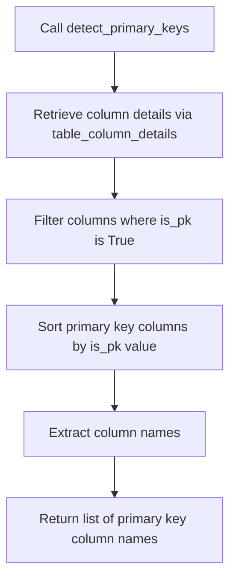

## Examples:
    # Detect primary keys for a table with a composite primary key
    pk_columns = detect_primary_keys(db_connection, "orders")
    print(pk_columns)  # Output: ['order_id', 'customer_id']
    
    # Detect primary keys for a table with a single primary key
    pk_columns = detect_primary_keys(db_connection, "users")
    print(pk_columns)  # Output: ['id']
    
    # Handle table without primary key
    pk_columns = detect_primary_keys(db_connection, "log_entries")
    print(pk_columns)  # Output: []

## `datasette.utils.__init__.get_outbound_foreign_keys` · *function*

## Summary:
Retrieves outbound foreign key relationships for a specified SQLite table by analyzing foreign key constraints and filtering out compound foreign keys.

## Description:
This function queries the SQLite database's pragma information to extract foreign key definitions for a given table. It processes the raw foreign key data to filter out compound foreign keys (where multiple columns participate in the same foreign key relationship) and returns a simplified list containing only single-column foreign key relationships.

The function is designed to be reusable across different parts of the Datasette application that need to understand table relationships, particularly for features like navigation links, relationship visualization, or data integrity validation. It safely handles table names by using bracketed identifiers to prevent SQL injection.

## Args:
    conn (sqlite3.Connection): An active SQLite database connection object used to execute the PRAGMA query.
    table (str): The name of the SQLite table for which outbound foreign keys should be retrieved. Must be a valid table name in the database.

## Returns:
    list[dict]: A list of dictionaries representing single-column foreign key relationships. Each dictionary contains:
        - "column" (str): The name of the column in the source table that acts as a foreign key.
        - "other_table" (str): The name of the referenced table.
        - "other_column" (str): The name of the referenced column in the other table.

## Raises:
    sqlite3.Error: If the database connection fails or if the table name is invalid/does not exist.

## Constraints:
    - Preconditions: The `conn` parameter must be a valid SQLite connection object, and the `table` parameter must refer to an existing table in the database.
    - Postconditions: The returned list will only contain entries for simple (single-column) foreign keys, excluding compound foreign keys where multiple columns share the same foreign key ID.

## Side Effects:
    - Executes a database query against the provided connection using PRAGMA foreign_key_list.
    - No modifications to database state occur; only reads are performed.

## Control Flow:
```mermaid
flowchart TD
    A[Start get_outbound_foreign_keys] --> B[Execute PRAGMA foreign_key_list with bracketed table name]
    B --> C[Fetch all foreign key info rows]
    C --> D{Info row exists?}
    D -->|Yes| E[Extract fields and append to fks list]
    D -->|No| F[Skip null info]
    E --> G[Loop through all info rows]
    G --> H[All info processed?]
    H -->|No| D
    H -->|Yes| I[Count FK IDs using Counter]
    I --> J[Filter fks by unique ID (id_counts[fk['id']] == 1)]
    J --> K[Return simplified FK list with only column, other_table, other_column]
```

## Examples:
```python
# Example usage with a valid database connection and table
import sqlite3
conn = sqlite3.connect("example.db")
foreign_keys = get_outbound_foreign_keys(conn, "posts")
print(foreign_keys)
# Output might be:
# [{'column': 'author_id', 'other_table': 'authors', 'other_column': 'id'}]

# Example with compound foreign key (will be filtered out)
# If a table has a compound foreign key constraint, only simple foreign keys are returned
```

## `datasette.utils.__init__.get_all_foreign_keys` · *function*

## Summary:
Retrieves all inbound and outbound foreign key relationships for every table in a SQLite database.

## Description:
Analyzes all tables in a SQLite database to build a comprehensive mapping of foreign key relationships. For each table, it identifies both incoming foreign keys (references from other tables) and outgoing foreign keys (references to other tables). This function serves as a central utility for understanding database schema relationships and is used by various Datasette components for navigation, relationship visualization, and data integrity analysis.

The function delegates to `get_outbound_foreign_keys` for retrieving outbound foreign key information from each table, then constructs bidirectional relationship mappings by processing the foreign key definitions.

## Args:
    conn (sqlite3.Connection): An active SQLite database connection object used to query table information and foreign key constraints.

## Returns:
    dict: A dictionary mapping table names to their foreign key relationships. Each table entry contains:
        - "incoming" (list): Foreign key relationships pointing to this table from other tables
        - "outgoing" (list): Foreign key relationships originating from this table to other tables
    Each foreign key entry is a dictionary with:
        - "other_table" (str): Name of the related table
        - "column" (str): Column name in the current table
        - "other_column" (str): Column name in the related table

## Raises:
    None explicitly raised by this function. Any database errors will propagate from underlying SQLite operations.

## Constraints:
    - Preconditions: The `conn` parameter must be a valid SQLite connection object with access to the target database.
    - Postconditions: The returned dictionary will contain entries for all existing tables in the database, even those with no foreign key relationships.

## Side Effects:
    - Executes multiple database queries against the provided connection to retrieve table names and foreign key information.
    - No modifications to database state occur; only reads are performed.

## Control Flow:
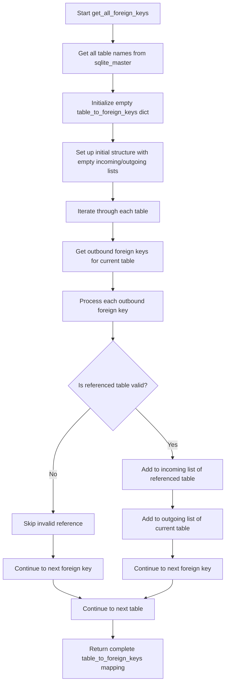

## Examples:
```python
import sqlite3
conn = sqlite3.connect("example.db")
foreign_key_map = get_all_foreign_keys(conn)
# Result structure:
# {
#   "users": {
#     "incoming": [],
#     "outgoing": [{"other_table": "posts", "column": "author_id", "other_column": "id"}]
#   },
#   "posts": {
#     "incoming": [{"other_table": "users", "column": "id", "other_column": "author_id"}],
#     "outgoing": []
#   }
# }
```

## `datasette.utils.__init__.detect_spatialite` · *function*

## Summary:
Determines whether a SQLite database connection has Spatialite extension enabled by checking for the existence of the geometry_columns table.

## Description:
This function checks if a SQLite database has Spatialite support by querying the sqlite_master table for the presence of a geometry_columns table. It's used to detect spatial capabilities in SQLite databases that may have been extended with Spatialite functionality.

The function is extracted into its own utility to encapsulate the detection logic, separating concerns between database connection management and spatial capability determination. This allows other parts of the codebase to make decisions based on spatial support without duplicating the detection logic.

## Args:
    conn: A SQLite database connection object that supports execute() and fetchall() methods

## Returns:
    bool: True if the database has Spatialite enabled (geometry_columns table exists), False otherwise

## Raises:
    sqlite3.Error: If there's an issue executing the SQL query against the database connection

## Constraints:
    Preconditions:
        - The conn parameter must be a valid SQLite connection object
        - The connection must be open and functional
        - The database must be accessible
    
    Postconditions:
        - The function returns a boolean value indicating spatial support status
        - No modifications are made to the database

## Side Effects:
    - Executes a SELECT query against the sqlite_master table
    - May cause I/O operations if the database is on disk
    - No external state mutations

## Control Flow:
```mermaid
flowchart TD
    A[Start detect_spatialite] --> B{Execute query}
    B --> C{Fetch all results}
    C --> D{Rows exist?}
    D -->|Yes| E[Return True]
    D -->|No| F[Return False]
```

## Examples:
```python
# Basic usage
import sqlite3
conn = sqlite3.connect('database.db')
has_spatial = detect_spatialite(conn)
print(f"Spatialite supported: {has_spatial}")

# Usage in conditional logic
if detect_spatialite(conn):
    # Enable spatial features
    print("Spatialite detected - enabling spatial queries")
else:
    # Fall back to regular queries
    print("No Spatialite support detected")
```

## `datasette.utils.__init__.detect_fts` · *function*

## Summary:
Determines if a SQLite table has an associated full-text search (FTS) table.

## Description:
Checks whether a table with the FTS (Full Text Search) extension exists for a specified SQLite table. This function is used in Datasette to identify tables that support full-text search capabilities.

## Args:
    conn: sqlite3.Connection
        A connection to the SQLite database.
    table: str
        The name of the table to check for FTS support.

## Returns:
    str or None
        Returns the name of the FTS table if it exists, otherwise returns None.

## Raises:
    None explicitly raised.

## Constraints:
    Preconditions:
        - The conn parameter must be a valid SQLite connection object.
        - The table parameter must be a string containing a valid table name.
    
    Postconditions:
        - The function returns either a string (the FTS table name) or None.
        - No modifications are made to the database.

## Side Effects:
    - Executes two SQL queries against the database.
    - No external state mutations or I/O operations.

## Control Flow:
```mermaid
flowchart TD
    A[Start detect_fts] --> B{Table exists?}
    B -- Yes --> C[Construct FTS table name]
    C --> D[Check if FTS table exists]
    D --> E{FTS table exists?}
    E -- Yes --> F[Return FTS table name]
    E -- No --> G[Return None]
    B -- No --> H[Return None]
    F --> I[End]
    G --> I
    H --> I
```

## Examples:
    # Check if 'my_table' has an associated FTS table
    fts_table_name = detect_fts(db_connection, 'my_table')
    if fts_table_name:
        print(f"FTS table found: {fts_table_name}")
    else:
        print("No FTS table found")

## `datasette.utils.__init__.detect_fts_sql` · *function*

## Summary:
Generates a SQL query to detect full-text search (FTS) virtual tables in SQLite that reference a specific table as their content source.

## Description:
This function constructs a SQL query string that searches the SQLite master table to identify virtual tables configured with FTS (Full Text Search) that use the provided table as their content source. It's designed to help Datasette identify which tables are backed by FTS virtual tables, enabling proper indexing and search capabilities.

The function handles escaping of single quotes in table names to prevent SQL injection vulnerabilities in the generated query.

## Args:
    table (str): The name of the table to check for FTS virtual table references. Must be a valid SQLite table identifier.

## Returns:
    str: A formatted SQL query string that can be executed against a SQLite database to find FTS virtual tables referencing the specified table.

## Raises:
    None explicitly raised.

## Constraints:
    Preconditions:
        - The input `table` parameter must be a valid string representing a SQLite table name.
        - The function assumes the caller will properly escape or sanitize the table name to prevent SQL injection.
    
    Postconditions:
        - The returned SQL query string is properly escaped to handle single quotes in table names.
        - The query follows SQLite syntax for detecting FTS virtual tables.

## Side Effects:
    None.

## Control Flow:
```mermaid
flowchart TD
    A[Start detect_fts_sql] --> B{Input table}
    B --> C[Escape single quotes in table name]
    C --> D[Format SQL template with escaped table name]
    D --> E[Return SQL query string]
```

## Examples:
```python
# Basic usage
query = detect_fts_sql("my_table")
print(query)
# Output: "select name from sqlite_master where rootpage = 0 and (sql like '%VIRTUAL TABLE%USING FTS%content=\"my_table\"%' or sql like '%VIRTUAL TABLE%USING FTS%content=[my_table]%' or (tbl_name = \"my_table\" and sql like '%VIRTUAL TABLE%USING FTS%'))"

# With table name containing single quotes
query = detect_fts_sql("table'name")
print(query)
# Output: "select name from sqlite_master where rootpage = 0 and (sql like '%VIRTUAL TABLE%USING FTS%content=\"table''name\"%' or sql like '%VIRTUAL TABLE%USING FTS%content=[table''name]%' or (tbl_name = \"table''name\" and sql like '%VIRTUAL TABLE%USING FTS%'))"
```

## `datasette.utils.__init__.detect_json1` · *function*

## Summary:
Determines whether the SQLite database connection supports JSON1 extension functionality.

## Description:
Checks if the SQLite database connection has the JSON1 extension enabled by attempting to execute a basic JSON function. This utility function abstracts away the detection logic for JSON1 support, allowing callers to make conditional decisions based on database capabilities without duplicating the detection code.

## Args:
    conn (sqlite3.Connection, optional): An existing SQLite database connection. If None, a temporary in-memory connection is created. Defaults to None.

## Returns:
    bool: True if the connection supports JSON1 extension (can execute json('{}')), False otherwise.

## Raises:
    None explicitly raised, though underlying SQLite operations may raise exceptions.

## Constraints:
    Preconditions:
        - If a custom connection is provided, it must be a valid sqlite3.Connection object.
        - The function assumes that SQLite is available and properly installed.
    
    Postconditions:
        - The function returns a boolean indicating JSON1 support status.
        - No modifications are made to the database state.

## Side Effects:
    - Creates an in-memory SQLite connection if none is provided.
    - Executes a SELECT statement on the database connection.
    - May trigger SQLite internal operations during connection setup and query execution.

## Control Flow:
```mermaid
flowchart TD
    A[Start detect_json1] --> B{conn is None?}
    B -- Yes --> C[Create in-memory connection]
    B -- No --> D[Use provided connection]
    C --> E[Try executing "SELECT json('{}')"]
    D --> E
    E --> F{Execute succeeds?}
    F -- Yes --> G[Return True]
    F -- No --> H[Return False]
    G --> I[End]
    H --> I
```

## Examples:
```python
# Check JSON1 support on default in-memory connection
has_json1 = detect_json1()
print(has_json1)  # True or False

# Check JSON1 support on a specific connection
import sqlite3
conn = sqlite3.connect('example.db')
has_json1 = detect_json1(conn)
print(has_json1)  # True or False
```

## `datasette.utils.__init__.table_columns` · *function*

## Summary:
Retrieves the names of all columns in a specified SQLite table.

## Description:
Extracts column names from detailed column metadata for a given table by delegating to the `table_column_details` utility function. This function provides a simplified interface that returns only the column names, making it easier to work with table schemas when only the names are needed.

Known callers within the codebase:
- Various internal components that require quick access to column names for schema inspection, query building, or data processing workflows.
- The function is typically called during database schema analysis or when constructing dynamic SQL queries based on existing table structures.

This logic is extracted into its own function rather than being inlined because it separates the concern of retrieving column names from the more complex process of gathering full column metadata. This creates a cleaner API for consumers that only need column names, while maintaining a reusable foundation in `table_column_details`.

## Args:
    conn (sqlite3.Connection): An active SQLite database connection object.
    table (str): The name of the table for which to retrieve column names.

## Returns:
    list[str]: A list of column names (strings) for the specified table, in order of their appearance in the table schema.

## Raises:
    sqlite3.Error: If the database connection fails or the specified table does not exist.

## Constraints:
    Preconditions:
        - The `conn` parameter must be a valid SQLite connection object.
        - The `table` parameter must be a string representing an existing table name.
    Postconditions:
        - The returned list contains only column names as strings.
        - The order of column names matches their order in the table schema.

## Side Effects:
    - Executes SQL queries against the database connection through the `table_column_details` function.
    - May perform I/O operations through the database connection.

## Control Flow:
```mermaid
flowchart TD
    A[Call table_columns] --> B[Call table_column_details]
    B --> C[Get list of Column objects]
    C --> D[Extract .name from each Column]
    D --> E[Return list of column names]
```

## Examples:
    # Basic usage with a valid table
    column_names = table_columns(db_connection, "users")
    print(column_names)  # Output: ['id', 'username', 'email']
    
    # Error handling for non-existent table
    try:
        column_names = table_columns(db_connection, "nonexistent")
    except sqlite3.Error as e:
        print(f"Database error: {e}")
```

## `datasette.utils.__init__.table_column_details` · *function*

## Summary:
Retrieves detailed column information for a specified SQLite table, handling different SQLite versions by using appropriate PRAGMA commands.

## Description:
This function fetches column metadata for a given SQLite table by executing PRAGMA commands. It adapts its approach based on the SQLite version available: using `table_xinfo` for newer versions (3.26.0+) that support hidden column information, or falling back to `table_info` for older versions where hidden status is not available. The function ensures compatibility across different SQLite installations by dynamically selecting the appropriate metadata retrieval method.

The logic is extracted into a separate function to encapsulate the version-specific database querying behavior, providing a clean abstraction layer that allows callers to retrieve column details without worrying about SQLite version differences or the underlying PRAGMA command variations.

## Args:
    conn (sqlite3.Connection): An active SQLite database connection object.
    table (str): The name of the table for which to retrieve column details.

## Returns:
    list[Column]: A list of Column namedtuples containing detailed information about each column in the specified table. Each Column tuple contains the following fields in order: cid (column id), name (column name), type (data type), notnull (not null constraint), dflt_value (default value), pk (primary key flag), and hidden (hidden flag for newer SQLite versions).

## Raises:
    sqlite3.Error: If the database connection fails or the specified table does not exist.

## Constraints:
    Preconditions:
        - The `conn` parameter must be a valid SQLite connection object.
        - The `table` parameter must be a string representing an existing table name.
    Postconditions:
        - The returned list contains Column objects with consistent field ordering.
        - All returned Column objects have the same structure regardless of SQLite version.

## Side Effects:
    - Executes SQL queries against the database connection.
    - May perform I/O operations through the database connection.

## Control Flow:
```mermaid
flowchart TD
    A[Call table_column_details] --> B{supports_table_xinfo()?}
    B -- Yes --> C[Execute PRAGMA table_xinfo]
    B -- No --> D[Execute PRAGMA table_info]
    C --> E[Create Column objects from results]
    D --> E
    E --> F[Return list of Column objects]
```

## Examples:
    # Basic usage with a valid table
    columns = table_column_details(db_connection, "users")
    for col in columns:
        print(f"Column: {col.name}, Type: {col.type}")
        
    # Error handling for non-existent table
    try:
        columns = table_column_details(db_connection, "nonexistent")
    except sqlite3.Error as e:
        print(f"Database error: {e}")

## `datasette.utils.__init__.filters_should_redirect` · *function*

## Summary:
Analyzes special filter arguments and determines if URL parameters should be redirected to a cleaner format for filter queries.

## Description:
This function processes special filter parameters (_filter_column, _filter_op, _filter_value) and their numbered variants (_filter_column_1, _filter_op_1, _filter_value_1, etc.) to determine if the current URL should redirect to a cleaner parameter format. It transforms legacy-style filter URLs into a more standardized format by extracting filter information and preparing redirect parameters.

The function is extracted to separate the logic of determining redirect parameters from the actual HTTP redirection mechanism, enabling reuse in various contexts where filter parameter validation and transformation is needed.

## Args:
    special_args (dict): Dictionary containing special filter arguments from URL parameters, including:
        - _filter_column, _filter_op, _filter_value for simple filters
        - _filter_column_N, _filter_op_N, _filter_value_N for numbered filters where N is a positive integer

## Returns:
    list[tuple]: List of tuples representing redirect parameters in the form (param_name, param_value) where:
        - param_name is the parameter name to set in redirect
        - param_value is the parameter value to set, or None to indicate removal
        - Parameters with value None are meant to be removed from the URL

## Raises:
    None explicitly raised

## Constraints:
    Preconditions:
    - special_args must be a dictionary-like object with string keys
    - Filter operations may contain double underscores (__) to separate operation from value
    - Numbered filter parameters must follow the pattern _filter_column_N, _filter_op_N, _filter_value_N
    
    Postconditions:
    - Returned list contains tuples with valid parameter names and values
    - All legacy filter parameters are marked for removal (value=None)
    - Redirect parameters follow the format {column}__{operation} for clean filter representation

## Side Effects:
    None

## Control Flow:
```mermaid
flowchart TD
    A[Start filters_should_redirect] --> B{Has _filter_column?}
    B -- Yes --> C[Extract filter_op, filter_value]
    B -- No --> D[Skip first section]
    C --> E{filter_op contains __?}
    E -- Yes --> F[Split op and value at __]
    E -- No --> G[Use op as-is]
    F --> H[Build redirect param: {column}__{op}, {value}]
    G --> H
    H --> I[Add legacy params to remove: _filter_column, _filter_op, _filter_value]
    I --> J[Find numbered column keys matching pattern]
    J --> K{Has numbered column key?}
    K -- Yes --> L[Extract number from key]
    L --> M[Get column, op, value for number]
    M --> N{op contains __?}
    N -- Yes --> O[Split op and value at __]
    N -- No --> P[Use op as-is]
    O --> Q[Build redirect param: {column}__{op}, {value}]
    P --> Q
    Q --> R[Add legacy params to remove for number]
    R --> S[Continue with next numbered key]
    K -- No --> T[End]
    T --> U[Return redirect_params]
```

## Examples:
    Example 1: Simple filter
    Input: {"_filter_column": "name", "_filter_op": "exact", "_filter_value": "john"}
    Output: [("name__exact", "john"), ("_filter_column", None), ("_filter_op", None), ("_filter_value", None)]

    Example 2: Filter with double underscore in operation
    Input: {"_filter_column": "title", "_filter_op": "contains__hello", "_filter_value": ""}
    Output: [("title__contains", "hello"), ("_filter_column", None), ("_filter_op", None), ("_filter_value", None)]

    Example 3: Numbered filter
    Input: {"_filter_column_1": "category", "_filter_op_1": "startswith", "_filter_value_1": "tech"}
    Output: [("category__startswith", "tech"), ("_filter_column_1", None), ("_filter_op_1", None), ("_filter_value_1", None)]

## `datasette.utils.__init__.is_url` · *function*

## Summary:
Validates that a string is a properly formatted HTTP or HTTPS URL with no extraneous characters.

## Description:
Checks whether the provided value is a valid URL starting with either "http://" or "https://", ensuring it contains only a URL and no additional whitespace or characters. This function is used to validate URL inputs in various parts of the Datasette application.

## Args:
    value (Any): The input to validate as a URL. Expected to be a string.

## Returns:
    bool: True if the value is a valid URL (starts with http:// or https:// and contains no whitespace), False otherwise.

## Raises:
    None

## Constraints:
    Preconditions:
        - Input must be a string type
        - String must start with either "http://" or "https://"
        - String must not contain any whitespace characters
    
    Postconditions:
        - Returns boolean indicating URL validity
        - No side effects or mutations occur

## Side Effects:
    None

## Control Flow:
```mermaid
flowchart TD
    A[Start is_url] --> B{Is value str?}
    B -- No --> C[Return False]
    B -- Yes --> D{Starts with http://?}
    D -- No --> E{Starts with https://?}
    E -- No --> F[Return False]
    E -- Yes --> G{Contains whitespace?}
    G -- Yes --> H[Return False]
    G -- No --> I[Return True]
    D -- Yes --> J{Contains whitespace?}
    J -- Yes --> K[Return False]
    J -- No --> L[Return True]
```

## Examples:
    >>> is_url("http://example.com")
    True
    >>> is_url("https://example.com/path")
    True
    >>> is_url("ftp://example.com")
    False
    >>> is_url("http://example.com with space")
    False
    >>> is_url(123)
    False
```

## `datasette.utils.__init__.to_css_class` · *function*

## Summary:
Converts a string into a valid CSS class identifier by sanitizing invalid characters and appending a hash suffix when needed.

## Description:
This function ensures that any input string can be safely used as a CSS class name. It first checks if the input string already conforms to valid CSS class naming rules. If not, it sanitizes the string by removing invalid characters, normalizing whitespace, and appending a 6-character MD5 hash to guarantee uniqueness. This prevents conflicts when multiple identifiers would otherwise result in identical CSS class names.

## Args:
    s (str): Input string to convert into a CSS class name. Typically represents identifiers like table names or column names.

## Returns:
    str: A valid CSS class name derived from the input string. May be identical to input if already valid, or modified with sanitization and a hash suffix if needed.

## Raises:
    None explicitly raised. However, the function may raise exceptions from underlying operations like `hashlib.md5()` if the input string cannot be encoded.

## Constraints:
    - Preconditions: Input must be a string.
    - Postconditions: Output is always a valid CSS class name that can be safely used in HTML/CSS contexts.

## Side Effects:
    None.

## Control Flow:
```mermaid
flowchart TD
    A[Input string s] --> B{Matches css_class_re?}
    B -- Yes --> C[Return s]
    B -- No --> D[Generate MD5 suffix]
    D --> E[Strip leading _ and -]
    E --> F[Replace whitespace with -]
    F --> G[Remove invalid chars with css_invalid_chars_re]
    G --> H[Join s and suffix with -]
    H --> C
```

## Examples:
    >>> to_css_class("valid-class")
    'valid-class'
    
    >>> to_css_class("invalid_class")
    'invalid-class-a1b2c3'
    
    >>> to_css_class("table name")
    'table-name-d4e5f6'
    
    >>> to_css_class("_invalid")
    'invalid-789abc'

## `datasette.utils.__init__.link_or_copy` · *function*

## Summary:
Attempts to create a hard link between source and destination files, falling back to copying if linking fails due to cross-device restrictions.

## Description:
This utility function provides a robust method for creating file references in temporary directories. It first attempts to create a hard link using `os.link()`, which is more efficient than copying as it shares the same inode. When the source and destination are on different filesystems, an `OSError` is raised and the function falls back to using `shutil.copyfile()` to create a separate copy of the file. This approach addresses cross-device linking issues commonly encountered in temporary directory operations.

## Args:
    src (str): Path to the source file that needs to be linked or copied.
    dst (str): Path to the destination where the link or copy should be created.

## Returns:
    None: This function does not return any value.

## Raises:
    OSError: Raised when `os.link()` fails, typically due to cross-device linking restrictions or insufficient permissions. In such cases, the function automatically falls back to `shutil.copyfile()`.

## Constraints:
    Preconditions:
        - Both `src` and `dst` must be valid file paths.
        - The parent directory of `dst` must exist and be writable.
        - The source file (`src`) must exist and be readable.
    Postconditions:
        - Either a hard link or a copy of the source file exists at the destination path (`dst`).
        - The content of the source file is preserved at the destination.

## Side Effects:
    - File I/O operations: Creates a file at `dst` either as a hard link or a copy of `src`.
    - May involve disk I/O depending on whether linking or copying is performed.

## Control Flow:
```mermaid
flowchart TD
    A[Start link_or_copy] --> B{os.link(src, dst) succeed?}
    B -- Yes --> C[Return]
    B -- No --> D[shutil.copyfile(src, dst)]
    D --> E[Return]
```

## Examples:
    # Example 1: Successful linking within same filesystem
    link_or_copy('/tmp/source.txt', '/tmp/destination.txt')
    
    # Example 2: Fallback to copying due to cross-device restriction
    link_or_copy('/home/user/file.txt', '/tmp/file.txt')  # If /tmp is on different device
    
    # Example 3: Error handling - source file doesn't exist
    try:
        link_or_copy('/nonexistent.txt', '/tmp/test.txt')
    except FileNotFoundError:
        print("Source file not found")
```

## `datasette.utils.__init__.link_or_copy_directory` · *function*

## Summary:
Attempts to hard-link files from a source directory to a destination directory, falling back to copying if hard-linking fails.

## Description:
This utility function provides a robust method for duplicating directory contents by first attempting to create hard links for efficiency, and only falling back to full file copying when hard-linking is not possible. This approach minimizes disk usage while maintaining performance benefits where supported.

The function is typically used during Datasette's setup or deployment processes where directory duplication is needed, such as when creating temporary directories or copying database files.

## Args:
    src (str): Path to the source directory to be duplicated.
    dst (str): Path to the destination directory where contents will be copied.

## Returns:
    None: This function does not return any value.

## Raises:
    OSError: Raised when the copy operation fails completely, either during the hard-link attempt or the fallback copy operation. This occurs when:
        - The source directory does not exist or is not readable
        - The destination path cannot be written to
        - Insufficient permissions for file operations
        - File system errors occur during the copy process

## Constraints:
    Preconditions:
        - The source directory must exist and be readable.
        - The destination directory path must be writable.
        - The parent directory of the destination must exist.
    
    Postconditions:
        - The destination directory will contain a copy of all files and subdirectories from the source.
        - If hard-linking is supported and successful, files will share inode references (space efficient).
        - If hard-linking fails, files will be copied (functionally equivalent but uses more disk space).

## Side Effects:
    - Creates files and directories in the destination path.
    - May modify filesystem metadata (inode references) if hard-linking is successful.
    - Performs I/O operations on both source and destination paths.

## Control Flow:
```mermaid
flowchart TD
    A[Start link_or_copy_directory] --> B{Try hard-link copy}
    B -->|Success| C[Return]
    B -->|OSError| D[Retry with copy]
    D --> E{Copy succeeds}
    E -->|Yes| F[Return]
    E -->|No| G[Re-raise OSError]
```

## Examples:
```python
# Basic usage
link_or_copy_directory('/path/to/src', '/path/to/dst')

# Typical usage in Datasette context
# Used when setting up temporary directories for database operations
```

## `datasette.utils.__init__.module_from_path` · *function*

## Summary:
Dynamically creates and executes a Python module from a file path.

## Description:
Loads Python source code from a file and executes it within a new module namespace. This utility function provides a way to import and execute Python code from arbitrary file paths without requiring the file to be in the Python module search path. It is commonly used for loading configuration files, plugins, or executing dynamic code where standard import mechanisms are not suitable.

## Args:
    path (str): Absolute or relative file system path to the Python source file to be loaded.
    name (str): Name to assign to the created module object. This becomes the module's __name__ attribute.

## Returns:
    types.ModuleType: A dynamically created module object containing the executed code from the specified file.

## Raises:
    FileNotFoundError: When the specified file path does not exist.
    PermissionError: When the file cannot be read due to insufficient permissions.
    SyntaxError: When the file contains invalid Python syntax.
    Exception: Any other exception that may occur during file reading or code execution.

## Constraints:
    Preconditions:
        - The path argument must point to a valid existing file.
        - The file must contain valid Python code.
        - The name argument must be a valid string identifier for a module name.
    Postconditions:
        - A new module object is returned with its __file__ attribute set to the provided path.
        - The module's namespace (__dict__) contains all global variables and functions defined in the source file.

## Side Effects:
    - Reads from the file system at the specified path.
    - Executes arbitrary Python code contained in the file.
    - Modifies the module's namespace dictionary with definitions from the source file.

## Control Flow:
```mermaid
flowchart TD
    A[Start module_from_path] --> B{File exists?}
    B -- No --> C[Raise FileNotFoundError]
    B -- Yes --> D[Open file for reading]
    D --> E[Compile file contents]
    E --> F[Execute compiled code in module dict]
    F --> G[Return module object]
```

## Examples:
```python
# Load a configuration module from a file
config_module = module_from_path("/path/to/config.py", "my_config")
value = config_module.some_setting

# Load a plugin module dynamically
plugin_module = module_from_path("./plugins/my_plugin.py", "my_plugin")
plugin_module.initialize()

# Load a utility module for custom processing
utils_module = module_from_path("custom_utils.py", "custom_utils")
result = utils_module.process_data(input_data)
```

## `datasette.utils.__init__.path_with_format` · *function*

## Summary:
Constructs a URL path with an appropriate format extension and query parameters.

## Description:
This function builds a URL path that includes a format extension (like .json or .csv) and merges additional query string parameters. It handles cases where a format is already present in the path and ensures proper query string construction. This utility is commonly used in Datasette to generate URLs for data export formats.

## Args:
    request (object, optional): A request object with `path` and `query_string` attributes. If provided, the function uses this object's path and query string to construct the result.
    path (str, optional): The base path string. Used if `request` is not provided.
    format (str, optional): The format extension to append to the path (e.g., 'json', 'csv').
    extra_qs (dict, optional): Additional query string parameters to merge into the final URL.
    replace_format (str, optional): If provided and the path ends with this format extension, the extension is stripped from the path before proceeding.

## Returns:
    str: A URL path string that includes the appropriate format extension and merged query parameters.

## Raises:
    None explicitly raised.

## Constraints:
    Preconditions:
    - Either `request` or `path` must be provided.
    - If `format` is provided, it should be a valid string representing a file extension.
    - If `extra_qs` is provided, it must be a dictionary.

    Postconditions:
    - The returned string is a valid URL path with proper formatting.
    - Query parameters are properly encoded and ordered.

## Side Effects:
    None.

## Control Flow:
```mermaid
flowchart TD
    A[Start] --> B{request provided?}
    B -- Yes --> C[Set path = request.path]
    B -- No --> D[Set path = path arg]
    C --> E{replace_format provided AND path ends with .replace_format?}
    D --> E
    E -- Yes --> F[Remove .replace_format from path]
    E -- No --> G[Continue with path]
    F --> G
    G --> H{`.` in path?}
    H -- Yes --> I[Add _format to qs]
    H -- No --> J[Append .format to path]
    I --> K[Build query string]
    J --> K
    K --> L{qs not empty?}
    L -- Yes --> M[Encode qs and merge with existing query string]
    L -- No --> N{request and request.query_string?}
    M --> O[Return path with qs]
    N -- Yes --> P[Append request.query_string to path]
    N -- No --> Q[Return path]
    P --> O
    Q --> O
```

## Examples:
    # Basic usage with format
    path_with_format(path="/data", format="json")
    # Returns: "/data.json"

    # Usage with existing format and replacement
    path_with_format(path="/data.csv", format="json", replace_format="csv")
    # Returns: "/data.json"

    # Usage with extra query parameters
    path_with_format(path="/data", format="json", extra_qs={"limit": 10})
    # Returns: "/data.json?limit=10"

    # Usage with request object and existing query string
    path_with_format(request=request_obj, format="csv")
    # Returns: "/some/path.csv?existing=query"
```

## `datasette.utils.__init__.CustomRow` · *class*

## Summary:
A custom dictionary-like class that provides both index-based and key-based access to row data, mimicking sqlite3.Row behavior.

## Description:
The CustomRow class extends OrderedDict to provide flexible access patterns for database row data. It allows accessing values using either column indices (integers) or column names (strings), making it compatible with both positional and named column access patterns. This is particularly useful when working with database query results where column information is available but flexible access patterns are needed.

## State:
- columns: list of column names in order, type=list[str], valid range=all string column names, invariant: maintains column ordering
- values: inherited from OrderedDict, stored as key-value pairs where keys are column names, type=dict-like, valid range: any valid column name-value pairs

## Lifecycle:
- Creation: Instantiate with columns list and optional values dict; columns must be provided, values are optional
- Usage: Access elements via __getitem__ using integer indices or string keys; iterate over the object to get values in column order
- Destruction: Inherits standard OrderedDict cleanup behavior

## Method Map:
```mermaid
graph TD
    A[CustomRow.__init__] --> B[columns set]
    A --> C[values updated if provided]
    B --> D[CustomRow.__getitem__]
    D --> E{key type}
    E -->|int| F[super().__getitem__(self.columns[key])]
    E -->|str| G[super().__getitem__(key)]
    D --> H[return value]
    C --> I[CustomRow.__iter__]
    I --> J[for column in self.columns]
    J --> K[self[column]]
    K --> L[yield value]
```

## Raises:
- None explicitly raised by __init__
- KeyError may be raised by parent OrderedDict methods when accessing non-existent keys

## Example:
```python
# Create a CustomRow with column names and values
columns = ['id', 'name', 'email']
values = {'id': 1, 'name': 'Alice', 'email': 'alice@example.com'}
row = CustomRow(columns, values)

# Access by index
print(row[0])  # Output: 1

# Access by name
print(row['name'])  # Output: Alice

# Iterate over values in column order
for value in row:
    print(value)
# Output: 1, Alice, alice@example.com
```

### `datasette.utils.__init__.CustomRow.__init__` · *method*

## Summary:
Initializes a CustomRow object with column definitions and optional initial values.

## Description:
The `__init__` method sets up the basic structure of a CustomRow instance by storing column names and optionally populating initial values. This method serves as the constructor for the CustomRow class, establishing the foundational data structure that represents a row of data with named columns. The method leverages the inherited OrderedDict behavior to store and manage the actual data values.

## Args:
    columns (list): A list of column names that define the structure of this row.
    values (dict, optional): A dictionary mapping column names to their initial values. Defaults to None.

## Returns:
    None: This method does not return a value.

## Raises:
    KeyError: If any key in the values dictionary does not correspond to a column name in the columns list when the update method is called.

## State Changes:
    Attributes READ: None
    Attributes WRITTEN: 
        - self.columns: Set to the provided columns parameter
        - self.values: Modified through the inherited OrderedDict.update() method when values parameter is provided

## Constraints:
    Preconditions:
        - The columns parameter must be a list-like object containing valid column identifiers
        - If values is provided, it must be a dictionary-like object with keys matching column names from the columns list
    Postconditions:
        - self.columns will contain the provided column definitions
        - If values are provided, the instance's internal OrderedDict will be populated with those key-value pairs

## Side Effects:
    None: This method performs no I/O operations or external service calls.

### `datasette.utils.__init__.CustomRow.__getitem__` · *method*

## Summary:
Retrieves a value from the row using either column index or column name as key.

## Description:
This method enables flexible access to row data by supporting both integer indices and string column names. When an integer is provided as a key, it maps to the corresponding column name via the internal `columns` attribute before retrieving the value. This allows for both positional and named access patterns, similar to SQLite's Row objects. This design provides a unified interface for accessing row data regardless of whether you know the column position or name.

## Args:
    key (int or str): Column index (integer) or column name (string) to retrieve value for

## Returns:
    Any: The value associated with the specified column

## Raises:
    KeyError: When the column name doesn't exist in the row or when the integer index is out of bounds
    IndexError: When the integer index is out of bounds of the columns array

## State Changes:
    Attributes READ: self.columns
    Attributes WRITTEN: None

## Constraints:
    Preconditions: 
    - If key is an integer, it must be within the valid range of column indices (0 to len(self.columns)-1)
    - If key is a string, it must correspond to a valid column name in self.columns
    Postconditions: 
    - Returns the value at the specified column location
    - Does not modify the object's state

## Side Effects:
    None

### `datasette.utils.__init__.CustomRow.__iter__` · *method*

## Summary:
Returns an iterator over the column values of this row in column order, implementing the Python iterator protocol.

## Description:
This method implements the Python iterator protocol for CustomRow objects, enabling them to be used in for-loops and other iteration contexts. It yields each column's value in the order specified by the row's columns attribute, providing a consistent way to access all column data without requiring knowledge of specific column names or positions.

## Args:
    None

## Returns:
    generator: A generator that yields column values in the order specified by self.columns.

## Raises:
    KeyError: If a column name in self.columns does not exist as a key in the underlying OrderedDict.
    IndexError: If an index lookup fails when accessing values via __getitem__.

## State Changes:
    Attributes READ: self.columns, self (via __getitem__)
    Attributes WRITTEN: None

## Constraints:
    Preconditions: 
    - self.columns must be a sequence of column names that correspond to keys in the OrderedDict
    - All column names in self.columns must exist as keys in the CustomRow instance
    - The CustomRow must have been initialized with a valid columns list
    
    Postconditions:
    - The generator will yield exactly one value for each column name in self.columns
    - Values are yielded in the same order as specified in self.columns
    - The method does not modify the object's state

## Side Effects:
    None

## `datasette.utils.__init__.value_as_boolean` · *function*

## Summary:
Converts a string representation of a boolean value into its corresponding Python boolean equivalent.

## Description:
This function provides a standardized way to parse string inputs that represent boolean values, converting them into Python's native boolean type (True or False). It accepts various common string representations including "on"/"off", "true"/"false", and "1"/"0". The function raises a custom exception when encountering invalid inputs.

## Args:
    value (str): A string representing a boolean value. Must be one of "on", "off", "true", "false", "1", or "0" (case-insensitive).

## Returns:
    bool: True if the input string represents a truthy value ("on", "true", or "1"), False otherwise ("off", "false", or "0").

## Raises:
    ValueAsBooleanError: When the input string is not one of the recognized boolean representations.

## Constraints:
    Preconditions:
        - The input value must be a string.
        - The input value must be one of the predefined valid boolean string representations.
    
    Postconditions:
        - The returned value is always a Python boolean (True or False).
        - The function is case-insensitive for input validation.

## Side Effects:
    None

## Control Flow:
```mermaid
flowchart TD
    A[Start value_as_boolean] --> B{value.lower() in valid_values?}
    B -- No --> C[raise ValueAsBooleanError]
    B -- Yes --> D[value.lower() in truthy_values?]
    D -- Yes --> E[return True]
    D -- No --> F[return False]
```

## Examples:
    >>> value_as_boolean("true")
    True
    >>> value_as_boolean("FALSE")
    False
    >>> value_as_boolean("1")
    True
    >>> value_as_boolean("off")
    False
    >>> value_as_boolean("maybe")
    # Raises ValueAsBooleanError
```

## `datasette.utils.__init__.ValueAsBooleanError` · *class*

## Summary:
Represents an error that occurs when a value cannot be converted to a boolean.

## Description:
This exception is raised when attempting to convert a value to a boolean representation but the value is not recognized as a valid boolean-like value. It inherits from Python's built-in ValueError, indicating that the conversion failed due to invalid input rather than a logical error in program flow.

## State:
The class has no instance attributes beyond those inherited from ValueError. It serves purely as a distinct exception type to differentiate boolean conversion failures from other value-related errors.

## Lifecycle:
- Creation: Instantiated when a value fails boolean conversion, typically through utility functions in the datasette.utils module
- Usage: Raised during operations that require boolean interpretation of arbitrary values
- Destruction: Automatically cleaned up by Python's garbage collector

## Method Map:
```mermaid
graph TD
    A[ValueAsBooleanError] --> B[ValueError]
```

## Raises:
This class itself does not raise exceptions, but is raised by functions that attempt to convert values to booleans when the conversion fails.

## Example:
```python
# This would raise ValueAsBooleanError
try:
    # Some utility function that converts values to booleans
    result = convert_to_boolean("invalid_value")
except ValueAsBooleanError as e:
    print(f"Boolean conversion failed: {e}")
```

## `datasette.utils.__init__.WriteLimitExceeded` · *class*

## Summary:
Represents an exception raised when a write operation exceeds configured limits.

## Description:
This exception is raised to indicate that a write operation has exceeded predefined constraints, such as maximum allowed file size or write duration. It serves as a clear signal to callers that their write attempt was rejected due to exceeding imposed limits.

## State:
The class has no instance attributes. It inherits from Python's built-in Exception class and does not introduce any additional state.

## Lifecycle:
- Creation: Instantiated directly with `raise WriteLimitExceeded()` or `raise WriteLimitExceeded("message")`
- Usage: Typically raised during write operations when limits are exceeded
- Destruction: Handled by exception handling mechanisms; no special cleanup required

## Method Map:
```mermaid
graph TD
    A[WriteLimitExceeded] --> B{Exception}
    B --> C[Base Exception]
```

## Raises:
- WriteLimitExceeded: Raised when write operations exceed configured limits

## Example:
```python
try:
    # Some write operation that might exceed limits
    perform_write_operation(data)
except WriteLimitExceeded:
    # Handle the case where limits were exceeded
    print("Write operation exceeded allowed limits")
```

## `datasette.utils.__init__.LimitedWriter` · *class*

## Summary:
A wrapper class that limits the number of bytes that can be written to an underlying writer.

## Description:
The LimitedWriter class provides a mechanism to enforce byte limits on write operations. It wraps an existing writer object and tracks the total number of bytes written, raising a WriteLimitExceeded exception when the configured limit is exceeded. This is particularly useful for controlling resource consumption during data export operations like CSV generation.

## State:
- writer: The underlying writer object that handles actual write operations. Type: Any object implementing a write method.
- limit_bytes: Maximum allowed bytes before raising an exception. Type: int, calculated as limit_mb * 1024 * 1024.
- bytes_count: Current count of bytes written. Type: int, starts at 0.

## Lifecycle:
- Creation: Instantiate with a writer object and a limit in megabytes (limit_mb). The limit_mb parameter defaults to None, which means no limit is enforced.
- Usage: Call the async write() method to write byte data while enforcing the maximum byte limit.
- Destruction: No explicit cleanup required; relies on normal Python garbage collection.

## Method Map:
```mermaid
graph TD
    A[LimitedWriter] --> B[write(bytes)]
    B --> C{bytes_count + len(bytes) > limit_bytes?}
    C -->|Yes| D[WriteLimitExceeded]
    C -->|No| E[self.writer.write(bytes)]
```

## Raises:
- WriteLimitExceeded: Raised when attempting to write bytes that would exceed the configured limit.

## Example:
```python
# Create a limited writer with 1MB limit
limited_writer = LimitedWriter(writer, limit_mb=1)

# Write data (will succeed if under 1MB)
await limited_writer.write(b"some data")

# This will raise WriteLimitExceeded if total bytes exceed 1MB
await limited_writer.write(b"more data that pushes over limit")
```

### `datasette.utils.__init__.LimitedWriter.__init__` · *method*

## Summary:
Initializes a LimitedWriter instance with a delegate writer and byte limit.

## Description:
The LimitedWriter class is designed to wrap another writer object while enforcing a maximum byte limit on the total amount of data written. This constructor sets up the internal state for tracking bytes written and establishes the limit constraint. The LimitedWriter is typically used in data export operations where resource consumption needs to be controlled.

## Args:
    writer: An object implementing a write method that accepts bytes, used as the underlying writer.
    limit_mb (int): Maximum allowed size in megabytes before writes are restricted.

## Returns:
    None

## Raises:
    None

## State Changes:
    Attributes READ: None
    Attributes WRITTEN: 
    - self.writer: Assigned the provided writer object
    - self.limit_bytes: Calculated as limit_mb * 1024 * 1024 
    - self.bytes_count: Initialized to 0

## Constraints:
    Preconditions:
    - limit_mb must be a non-negative number
    - writer must implement a write method that accepts bytes
    
    Postconditions:
    - self.writer is assigned the provided writer object
    - self.limit_bytes is set to the equivalent of limit_mb in bytes
    - self.bytes_count is initialized to 0

## Side Effects:
    None

### `datasette.utils.__init__.LimitedWriter.write` · *method*

## Summary:
Writes byte data to an underlying writer while enforcing a maximum byte limit.

## Description:
This asynchronous method writes the provided byte data to an internal writer object while tracking the total number of bytes written. It enforces a configurable limit on the total bytes that can be written, raising an exception if that limit is exceeded. This method is part of the LimitedWriter class which provides rate-limiting and size-constrained writing capabilities.

## Args:
    bytes (bytes): The byte data to be written to the underlying writer.

## Returns:
    None: This method does not return a value.

## Raises:
    WriteLimitExceeded: When the cumulative byte count exceeds the configured limit set during initialization.

## State Changes:
    Attributes READ: self.limit_bytes, self.writer, self.bytes_count
    Attributes WRITTEN: self.bytes_count

## Constraints:
    Preconditions: 
    - The LimitedWriter instance must have been properly initialized with a valid writer and limit_mb value
    - The bytes argument must be of type bytes
    Postconditions:
    - self.bytes_count is incremented by the length of the bytes argument
    - If the limit is exceeded, the WriteLimitExceeded exception is raised before any write occurs

## Side Effects:
    I/O: Performs an asynchronous write operation on the underlying writer object

## `datasette.utils.__init__.EscapeHtmlWriter` · *class*

## Summary:
A wrapper class that escapes HTML content before writing it through an underlying writer.

## Description:
The EscapeHtmlWriter class serves as a decorator or wrapper around another writer object, ensuring that any content written through it is HTML-escaped before being passed through to the underlying writer. This prevents XSS (Cross-Site Scripting) vulnerabilities when writing user-generated content to HTML contexts.

This class is particularly useful in web applications where content needs to be safely rendered in HTML templates or responses. It provides a clean abstraction for applying HTML escaping consistently without modifying the underlying writer's interface.

## State:
- writer: An object implementing a write method that accepts string content. This is the underlying writer that will receive the escaped content.
- The writer parameter is required and must have a write method that accepts string content.

## Lifecycle:
- Creation: Instantiate with a writer object that implements a write method
- Usage: Call the write() method with content to be escaped and written
- Destruction: No special cleanup required; relies on underlying writer's lifecycle

## Method Map:
```mermaid
graph TD
    A[EscapeHtmlWriter] --> B[write(content)]
    B --> C[markupsafe.escape(content)]
    C --> D[writer.write(escaped_content)]
```

## Raises:
- AttributeError: If the provided writer does not have a write method
- Any exceptions raised by the underlying writer's write method

## Example:
```python
# Create an underlying writer (e.g., a file writer or response writer)
underlying_writer = SomeWriter()

# Wrap it with EscapeHtmlWriter
html_writer = EscapeHtmlWriter(underlying_writer)

# Write content that may contain HTML
await html_writer.write("<script>alert('xss')</script>")
# The content gets HTML-escaped before being written
```

### `datasette.utils.__init__.EscapeHtmlWriter.__init__` · *method*

## Summary:
Initializes an EscapeHtmlWriter instance with an underlying writer object.

## Description:
Configures the EscapeHtmlWriter by storing a reference to the provided writer object. This writer will be used to handle the actual writing operations after HTML escaping is applied to content. The writer parameter must implement a write method that accepts string content.

## Args:
    writer: An object implementing a write method that accepts string content. This is the underlying writer that will receive the escaped content.

## Returns:
    None

## Raises:
    AttributeError: If the provided writer does not have a write method

## State Changes:
    Attributes READ: None
    Attributes WRITTEN: self.writer

## Constraints:
    Preconditions: The writer argument must have a write method that accepts string content
    Postconditions: The self.writer attribute is set to the provided writer object

## Side Effects:
    None

### `datasette.utils.__init__.EscapeHtmlWriter.write` · *method*

## Summary:
Writes escaped HTML content to an underlying writer asynchronously.

## Description:
This method takes raw content, escapes any HTML special characters using markupsafe, and writes the escaped content to an underlying async writer. It serves as a wrapper around the underlying writer to ensure all content is properly escaped before being written, preventing potential XSS vulnerabilities. The EscapeHtmlWriter class is designed to be used in contexts where untrusted content needs to be safely rendered in HTML output.

## Args:
    content (str): The raw string content to be escaped and written.

## Returns:
    None: This method does not return any value.

## Raises:
    Any exceptions raised by the underlying writer's write method.

## State Changes:
    Attributes READ: self.writer
    Attributes WRITTEN: None

## Constraints:
    Preconditions: The self.writer attribute must be initialized and support an async write method.
    Postconditions: The content is written to the underlying writer after HTML escaping.

## Side Effects:
    I/O: Performs asynchronous write operation to the underlying writer.

## `datasette.utils.__init__.remove_infinites` · *function*

## Summary:
Removes infinite floating-point values from a row of data by replacing them with None.

## Description:
This function processes a row (sequence) of data and identifies any floating-point values that are positive or negative infinity. These infinite values are replaced with None, while all other values remain unchanged. The function is designed to handle rows containing mixed data types, ensuring that only infinite floats are modified.

## Args:
    row (iterable): A sequence of values that may contain floating-point numbers representing infinity.

## Returns:
    list: A new list where all infinite floating-point values have been replaced with None, and all other values remain unchanged.

## Raises:
    None explicitly raised.

## Constraints:
    Preconditions:
        - The input row should be iterable.
        - The function assumes that `_infinities` is defined in the module scope and contains the set of infinite float values to be detected.
    
    Postconditions:
        - The returned list has the same length as the input row.
        - All infinite floats in the input are replaced with None in the output.
        - Non-infinite values are preserved exactly as they were in the input.

## Side Effects:
    None.

## Control Flow:
```mermaid
flowchart TD
    A[Start remove_infinites] --> B{Any infinite floats in row?}
    B -- Yes --> C[Create new list with infinities replaced by None]
    B -- No --> D[Return original row]
    C --> E[End]
    D --> E
```

## Examples:
    >>> remove_infinites([1.0, float('inf'), 3.0])
    [1.0, None, 3.0]
    
    >>> remove_infinites([1.0, 2.0, 3.0])
    [1.0, 2.0, 3.0]
    
    >>> remove_infinites([float('-inf'), 'text', 42])
    [None, 'text', 42]
```

## `datasette.utils.__init__.StaticMount` · *class*

## Summary:
A Click parameter type for validating and parsing static mount point specifications in the format "mountpoint:directory".

## Description:
This class extends Click's ParamType to define a custom parameter type that accepts string values in the format "mountpoint:directory". It validates that the specified directory exists and is a valid directory path, then returns a tuple of (mountpoint, directory_path). This is commonly used in Datasette CLI commands that require mounting directories at specific paths.

The StaticMount parameter type is designed to be used with Click command-line interfaces where users need to specify mount points for static directories. It ensures proper formatting and validates that the referenced directories exist.

## State:
- name: str - Class attribute set to "mount:directory" indicating the parameter type name
- No instance attributes beyond those inherited from click.ParamType

## Lifecycle:
- Creation: Instantiated automatically by Click when parsing command-line arguments of this type
- Usage: Called internally by Click during argument validation and conversion through the convert() method
- Destruction: Managed by Python garbage collection

## Method Map:
```mermaid
graph TD
    A[Click CLI Parser] --> B[StaticMount.convert]
    B --> C{Value contains ":"?}
    C -->|No| D[Fail with error]
    C -->|Yes| E[Split by ":"]
    E --> F[Normalize directory path]
    F --> G{Directory exists and is dir?}
    G -->|No| H[Fail with error]
    G -->|Yes| I[Return (mountpoint, dirpath)]
```

## Raises:
- click.BadParameter: Raised when the value doesn't contain a colon separator or when the directory path is invalid

## Example:
```python
# Command line usage:
# datasette serve --static /tmp/data:/var/www/data

# In code:
mount_spec = StaticMount()  # Created by Click framework
result = mount_spec.convert("/tmp/data:/var/www/data", None, None)
# Returns: ("/tmp/data", "/var/www/data")

# Invalid usage examples:
# mount_spec.convert("/tmp/data", None, None)  # Missing colon
# mount_spec.convert("/tmp/data:/nonexistent", None, None)  # Non-existent directory
```

### `datasette.utils.__init__.StaticMount.convert` · *method*

## Summary:
Converts a string value in "mountpoint:directory" format into a validated tuple of mountpoint and absolute directory path.

## Description:
This method serves as a Click parameter converter for the StaticMount parameter type, validating that input strings follow the "mountpoint:directory" format and that the specified directory exists and is accessible. It is part of the StaticMount class, which implements a custom Click parameter type for configuring static file mounts in Datasette applications.

## Args:
    value (str): The input string containing the mountpoint and directory path separated by a colon
    param (click.Parameter): The Click parameter being processed
    ctx (click.Context): The Click context for the command

## Returns:
    tuple[str, str]: A tuple containing (mountpoint, absolute_directory_path) where the directory path is normalized to an absolute path

## Raises:
    click.BadParameter: When the input value doesn't contain a colon separator or when the directory path is invalid (doesn't exist or is not a directory)

## State Changes:
    Attributes READ: None
    Attributes WRITTEN: None

## Constraints:
    Preconditions:
        - The input value must be a string
        - The input value must contain a colon character separating mountpoint and directory
        - The directory path must exist and be a directory
    Postconditions:
        - Returns a tuple with the mountpoint and absolute path of the directory
        - The returned directory path is normalized to an absolute path using os.path.abspath()

## Side Effects:
    None

## `datasette.utils.__init__.LoadExtension` · *class*

## Summary:
A Click parameter type for parsing SQLite extension specifications in "path:entrypoint" format.

## Description:
The LoadExtension class extends click.ParamType to handle command-line parameters specifying SQLite extensions. It parses input values that may contain a colon separator to distinguish between the extension file path and an optional entrypoint name. This enables flexible specification of SQLite extensions in Datasette's command-line interface.

## State:
- name: str - Class attribute set to "path:entrypoint?" indicating the expected parameter format
- No instance attributes beyond the inherited ones from click.ParamType

## Lifecycle:
- Creation: Automatically instantiated by Click when a command uses this parameter type
- Usage: Invoked by Click's argument parsing system during command execution when processing arguments of this type
- Destruction: Managed by Python's garbage collection

## Method Map:
```mermaid
graph TD
    A[Command Line Input] --> B[Click Parameter Processing]
    B --> C[convert method called]
    C --> D{Contains ':' character?}
    D -->|No| E[Return value unchanged]
    D -->|Yes| F[Split at first ':']
    F --> G[Return (path, entrypoint) tuple]
```

## Raises:
- No explicit exceptions defined in this class
- May propagate exceptions from Click's internal parameter processing

## Example:
```python
import click
from datasette.utils import LoadExtension

@click.command()
@click.option('--load-extension', type=LoadExtension(), 
              help='Load SQLite extension (path:entrypoint)')
def cli(load_extension):
    if isinstance(load_extension, tuple):
        path, entrypoint = load_extension
        print(f"Loading extension from {path} with entrypoint {entrypoint}")
    else:
        print(f"Loading extension from {load_extension}")

# Usage:
# python script.py --load-extension "myext.so:sqlite3_myextension_init"
# Output: Loading extension from myext.so with entrypoint sqlite3_myextension_init
#
# python script.py --load-extension "myext.so"
# Output: Loading extension from myext.so
```

### `datasette.utils.__init__.LoadExtension.convert` · *method*

## Summary:
Converts a string value into either a single value or a tuple of (path, entrypoint) based on colon delimiter presence.

## Description:
This method is part of the LoadExtension Click parameter type and implements the conversion logic for parsing extension specifications in CLI applications. When a colon is present in the input string, it splits the string into two components: the path and the entrypoint. If no colon is present, it returns the original string unchanged. This method follows the standard Click ParamType.convert interface.

## Args:
    value (str): The input string to be converted, potentially containing a colon separator.
    param (click.Parameter): The Click parameter being processed (unused in current implementation).
    ctx (click.Context): The Click context (unused in current implementation).

## Returns:
    str or tuple[str, str]: If the input string contains a colon, returns a tuple of (path, entrypoint). Otherwise, returns the original string unchanged.

## Raises:
    None explicitly raised.

## State Changes:
    Attributes READ: None
    Attributes WRITTEN: None

## Constraints:
    Preconditions: The input value must be a string.
    Postconditions: The returned value will either be the original string or a tuple of two strings if a colon was present.

## Side Effects:
    None

## `datasette.utils.__init__.format_bytes` · *function*

## Summary:
Formats a byte count into a human-readable string with appropriate units (bytes, KB, MB, GB, TB).

## Description:
Converts a raw byte value into a formatted string that uses the largest appropriate unit (up to terabytes) with proper rounding. This utility function is commonly used in user interfaces to display file sizes or memory usage in a more readable format.

## Args:
    bytes (int or float): The number of bytes to format. Must be a non-negative numeric value. Can accept integers, floats, or string representations of numbers that convert to float.

## Returns:
    str: A formatted string representing the byte value with appropriate unit. Examples include "1024 bytes", "1.0 KB", "2.5 MB". For values less than 1024 bytes, returns integer formatting; for larger values, returns one decimal place formatting.

## Raises:
    TypeError: If the input cannot be converted to float (e.g., non-numeric input like strings that don't represent numbers).

## Constraints:
    Preconditions:
        - Input must be a numeric value (int, float, or convertible string) that can be converted to float
        - Input must be non-negative (though negative values will work mathematically)
    Postconditions:
        - Returns a string with exactly one space between the numeric value and unit
        - For byte values less than 1024, returns integer formatting
        - For larger values, returns one decimal place formatting

## Side Effects:
    None

## Control Flow:
```mermaid
flowchart TD
    A[Start format_bytes] --> B{Convert bytes to float}
    B --> C[Initialize current = float(bytes)]
    C --> D[Iterate through units]
    D --> E{current < 1024?}
    E -- Yes --> F[Break loop]
    E -- No --> G[current = current / 1024]
    G --> D
    F --> H{unit == "bytes"?}
    H -- Yes --> I[Return f"{int(current)} {unit}"]
    H -- No --> J[Return f"{current:.1f} {unit}"]
```

## Examples:
    >>> format_bytes(1024)
    '1.0 KB'
    >>> format_bytes(512)
    '512 bytes'
    >>> format_bytes(1048576)
    '1.0 MB'
    >>> format_bytes(0)
    '0 bytes'
    >>> format_bytes(1500)
    '1.5 KB'
    >>> format_bytes(1073741824)
    '1.0 GB'

## `datasette.utils.__init__.escape_fts` · *function*

## Summary:
Processes raw text queries for SQLite Full-Text Search by escaping special characters and handling quoted phrases.

## Description:
This function prepares text queries for use with SQLite's Full-Text Search (FTS) by ensuring proper tokenization and quote handling. It automatically corrects unbalanced quotation marks and splits the query into appropriately formatted tokens. The function is designed to handle complex FTS queries while maintaining quoted phrases intact.

## Args:
    query (str): The raw text query string to be processed for FTS compatibility.

## Returns:
    str: A properly formatted query string where unquoted tokens are wrapped in double quotes and quoted phrases are preserved.

## Raises:
    None explicitly raised.

## Constraints:
    Preconditions:
        - Input query must be a string.
    Postconditions:
        - Output string contains only valid FTS tokens.
        - Quoted phrases remain unchanged.
        - Unbalanced quotes are corrected by appending a closing quote.

## Side Effects:
    None.

## Control Flow:
```mermaid
flowchart TD
    A[Start escape_fts] --> B{Unbalanced quotes in query?}
    B -- Yes --> C[Append closing quote]
    B -- No --> D[Skip quote correction]
    C --> E[Split query using _escape_fts_re pattern]
    D --> E
    E --> F[Remove empty and empty-string tokens]
    F --> G{Token starts with quote?}
    G -- No --> H[Wrap token in double quotes]
    G -- Yes --> I[Keep token as-is]
    H --> J[Collect processed token]
    I --> J
    J --> K[Join all tokens with spaces]
    K --> L[Return result]
```

## Examples:
    >>> escape_fts('hello world')
    '"hello" "world"'
    
    >>> escape_fts('"hello world"')
    '"hello world"'
    
    >>> escape_fts('hello "world')
    '"hello" "world"'

## `datasette.utils.__init__.MultiParams` · *class*

## Summary:
A container class that handles HTTP query parameters with support for multiple values per key.

## Description:
MultiParams provides a convenient interface for working with HTTP query parameters that may have multiple values associated with the same key. It accepts either a dictionary mapping keys to lists of values or a list of key-value pairs, normalizing them into an internal dictionary structure. This abstraction is commonly used in web frameworks to handle form data and query strings where duplicate parameter names are allowed.

## State:
- `_data`: dict[str, list[str]] - Internal storage containing keys mapped to lists of string values. Each key maps to a list of all values provided for that key. This field is initialized during construction and never modified afterward.

## Lifecycle:
- Creation: Instantiate with either a dictionary of key => [list of values] or a list of ["key", "value"] pairs
- Usage: Access values via indexing, iteration, or getter methods
- Destruction: No special cleanup required; uses standard Python garbage collection

## Method Map:
```mermaid
graph TD
    A[MultiParams.__init__] --> B[Internal _data structure]
    B --> C[MultiParams.__getitem__]
    B --> D[MultiParams.get]
    B --> E[MultiParams.getlist]
    B --> F[MultiParams.keys]
    B --> G[MultiParams.__contains__]
    B --> H[MultiParams.__iter__]
    B --> I[MultiParams.__len__]
```

## Raises:
- AssertionError: When input data doesn't conform to expected formats (dictionary values must be lists/tuples, list items must be 2-element lists/tuples)

## Example:
```python
# Create from dictionary
params = MultiParams({"name": ["Alice"], "hobby": ["reading", "swimming"]})

# Create from list of pairs
params = MultiParams([["name", "Alice"], ["hobby", "reading"], ["hobby", "swimming"]])

# Access first value
name = params["name"]  # Returns "Alice"

# Get all values
hobbies = params.getlist("hobby")  # Returns ["reading", "swimming"]

# Get first value with default
email = params.get("email", "no-email")  # Returns "no-email"
```

### `datasette.utils.__init__.MultiParams.__init__` · *method*

## Summary:
Initializes a MultiParams object by normalizing input data into a standardized internal dictionary representation.

## Description:
This constructor method accepts input data in two formats and converts it to a uniform internal representation. It validates the input structure and ensures consistent handling of multi-valued parameters. The method is designed to handle both dictionary-based input (key → [values]) and list-based input ([key, value] pairs) while maintaining proper data integrity.

## Args:
    data (dict or list or tuple): Input data in one of two supported formats:
        - Dictionary mapping string keys to lists or tuples of values
        - List or tuple of [key, value] pairs (each pair being a list or tuple of length 2)

## Returns:
    None: This method initializes the object's internal state and does not return a value.

## Raises:
    AssertionError: When input data doesn't conform to expected formats:
        - If data is a dictionary, all values must be lists or tuples
        - If data is a list or tuple, each item must be a list or tuple of exactly 2 elements

## State Changes:
    Attributes READ: None
    Attributes WRITTEN: self._data

## Constraints:
    Preconditions:
        - data must be either a dict, list, or tuple
        - If data is dict, all values must be lists or tuples
        - If data is list/tuple, each item must be a list or tuple with exactly 2 elements (key, value)

    Postconditions:
        - self._data will be a dictionary mapping string keys to lists of values
        - All input data is normalized into the same internal representation

## Side Effects:
    None: This method performs no I/O operations or external service calls.

### `datasette.utils.__init__.MultiParams.__repr__` · *method*

## Summary:
Returns a string representation of the MultiParams object showing its internal data structure.

## Description:
This method provides a developer-friendly string representation of the MultiParams instance, primarily for debugging and logging purposes. It displays the internal `_data` attribute which contains the key-value mappings where each key maps to a list of values.

## Args:
    None

## Returns:
    str: A formatted string representation in the form "<MultiParams: {self._data}>" where self._data is the internal dictionary structure.

## Raises:
    None

## State Changes:
    Attributes READ: self._data
    Attributes WRITTEN: None

## Constraints:
    Preconditions: The object must be properly initialized with a valid _data attribute containing a dictionary structure.
    Postconditions: The returned string accurately reflects the current state of self._data.

## Side Effects:
    None

### `datasette.utils.__init__.MultiParams.__contains__` · *method*

## Summary:
Checks if a key exists in the MultiParams collection.

## Description:
This method implements the Python `__contains__` magic method to enable the `in` operator for MultiParams objects. It determines whether a given key is present in the internal `_data` dictionary structure.

## Args:
    key (str): The key to search for in the MultiParams collection

## Returns:
    bool: True if the key exists in the collection, False otherwise

## Raises:
    None

## State Changes:
    Attributes READ: self._data
    Attributes WRITTEN: None

## Constraints:
    Preconditions: The object must be properly initialized with a valid _data dictionary
    Postconditions: The method returns a boolean indicating key membership without modifying object state

## Side Effects:
    None

### `datasette.utils.__init__.MultiParams.__getitem__` · *method*

## Summary:
Retrieves the first value associated with a given key from the internal data structure.

## Description:
This method provides dictionary-like access to the first value stored for a specific key in the MultiParams collection. It implements the standard `__getitem__` protocol, allowing users to access values using bracket notation (e.g., `params['key']`). The MultiParams class stores data as key-value pairs where each key maps to a list of values, and this method returns only the first value in that list.

## Args:
    key (str): The key to look up in the internal data structure.

## Returns:
    Any: The first value associated with the specified key.

## Raises:
    KeyError: When the specified key does not exist in the internal data structure.
    IndexError: When the specified key exists but has no associated values (empty list).

## State Changes:
    Attributes READ: self._data
    Attributes WRITTEN: None

## Constraints:
    Preconditions: The key must exist in self._data, and self._data[key] must be a non-empty list or tuple.
    Postconditions: The method returns the first element of self._data[key] without modifying the object's state.

## Side Effects:
    None

### `datasette.utils.__init__.MultiParams.keys` · *method*

## Summary:
Returns an iterable of all keys stored in the MultiParams instance's internal data dictionary.

## Description:
This method provides access to the underlying dictionary's keys without exposing the internal _data attribute directly. It is typically called during request parameter processing when iterating over available parameter names. The MultiParams class is designed to handle HTTP request parameters that may have multiple values for the same key, making this method useful for retrieving all unique parameter names.

## Args:
    self: The MultiParams instance whose keys are being retrieved.

## Returns:
    dict_keys: An iterable view of the keys in the internal _data dictionary, representing all parameter names currently stored.

## Raises:
    None

## State Changes:
    Attributes READ: self._data
    Attributes WRITTEN: None

## Constraints:
    Preconditions: The instance must have been initialized with a valid _data dictionary.
    Postconditions: The returned keys view reflects the current state of the internal data store.

## Side Effects:
    None

### `datasette.utils.__init__.MultiParams.__iter__` · *method*

## Summary:
Returns an iterator over the keys stored in the MultiParams collection.

## Description:
This method enables iteration over the unique keys contained within the MultiParams object. It provides a clean interface for accessing the keys without exposing the underlying `_data` structure. The method is part of the standard Python iterator protocol, allowing MultiParams instances to be used in for-loops and other iteration contexts.

## Args:
    None

## Returns:
    iterator: An iterator over the keys of the internal `_data` dictionary.

## Raises:
    None

## State Changes:
    Attributes READ: self._data
    Attributes WRITTEN: None

## Constraints:
    Preconditions: The instance must have been initialized with valid data (either a dictionary or list of key-value pairs).
    Postconditions: The returned iterator will yield the same keys as those accessible via `keys()` method.

## Side Effects:
    None

### `datasette.utils.__init__.MultiParams.__len__` · *method*

## Summary:
Returns the number of unique keys stored in the MultiParams collection.

## Description:
This method provides the count of distinct keys in the MultiParams object, which represents a mapping where each key can have multiple associated values. It serves as the implementation of Python's built-in `len()` function for MultiParams instances.

## Args:
    None

## Returns:
    int: The number of unique keys in the MultiParams collection.

## Raises:
    None

## State Changes:
    Attributes READ: self._data
    Attributes WRITTEN: None

## Constraints:
    Preconditions: The object must be properly initialized with a valid _data attribute that is a dictionary-like structure.
    Postconditions: The returned integer value accurately reflects the number of keys in the internal _data storage.

## Side Effects:
    None

### `datasette.utils.__init__.MultiParams.get` · *method*

## Summary:
Returns the first value from a list of values associated with a given key in the MultiParams data structure.

## Description:
This method retrieves the first value stored in the internal `_data` dictionary under the specified key. It is designed to handle cases where a key may have multiple values stored as a list, but only the first value is needed. The method safely handles missing keys or invalid data structures by returning a default value.

## Args:
    name (str): The key to look up in the internal data structure.
    default (Any, optional): The default value to return if the key is not found or if the value is not a list. Defaults to None.

## Returns:
    Any: The first value from the list associated with the key, or the default value if the key is not found or the value is not a list.

## Raises:
    None: This method does not raise any exceptions directly.

## State Changes:
    Attributes READ: self._data
    Attributes WRITTEN: None

## Constraints:
    Preconditions: The internal `_data` attribute must be a dictionary-like object that supports the `.get()` method and returns lists when a key exists. When the key exists, `self._data.get(name)` must return a list-like object.
    Postconditions: The method returns either the first element of the list associated with the key or the default value, without modifying the object's state.

## Side Effects:
    None: This method performs no I/O operations or external service calls. It only accesses internal data structures.

### `datasette.utils.__init__.MultiParams.getlist` · *method*

## Summary:
Returns all values associated with a given key as a list, or an empty list if the key is not present.

## Description:
This method retrieves all values stored under a specified key in the MultiParams collection. It provides access to the complete list of values for a key, unlike the `get` method which only returns the first value. This method is part of the MultiParams class that manages key-value pairs where each key can have multiple values.

## Args:
    name (str): The key to look up in the data store

## Returns:
    list: A list of all values associated with the key, or an empty list if the key does not exist

## Raises:
    None

## State Changes:
    Attributes READ: self._data
    Attributes WRITTEN: None

## Constraints:
    Preconditions: The method assumes self._data is a dictionary-like object with string keys
    Postconditions: The returned list is either the full list of values for the key or an empty list

## Side Effects:
    None

## `datasette.utils.__init__.ConnectionProblem` · *class*

## Summary:
Represents an exception that occurs when a database connection problem arises during operations.

## Description:
The ConnectionProblem class is a custom exception used throughout the Datasette application to signal issues related to database connectivity or connection failures. It inherits from Python's built-in Exception class, making it compatible with standard exception handling mechanisms. This abstraction allows the application to distinguish database connection errors from other types of exceptions and handle them appropriately in various contexts such as query execution, database initialization, or data access operations.

## State:
- No instance attributes are defined beyond those inherited from Exception
- The class serves purely as an exception type marker with no internal state

## Lifecycle:
- Creation: Instantiated directly with optional message argument, e.g., `raise ConnectionProblem("Database unavailable")`
- Usage: Raised during database-related operations when connection issues occur
- Destruction: Handled by standard Python exception handling mechanisms

## Method Map:
```mermaid
graph TD
    A[ConnectionProblem] --> B[Exception]
    B --> C[BaseException]
    C --> D[object]
```

## Raises:
- ConnectionProblem: Raised when database connection problems occur during operations

## Example:
```python
try:
    # Attempt database operation
    db.execute("SELECT * FROM table")
except ConnectionProblem as e:
    # Handle connection-specific error
    print(f"Connection failed: {e}")
```

## `datasette.utils.__init__.SpatialiteConnectionProblem` · *class*

## Summary:
Represents a specialized exception type for spatial database connection problems in Datasette.

## Description:
The SpatialiteConnectionProblem class is a subclass of ConnectionProblem designed to handle exceptions that occur when interacting with spatial SQLite databases (Spatialite). This exception type provides a distinct error classification for spatial database connectivity issues, allowing the application to differentiate between general database connection problems and those specific to spatial data operations. Like its parent ConnectionProblem class, it serves purely as an exception type marker with no internal state, inheriting all behavior from Exception.

## State:
- Inherits all state from ConnectionProblem parent class
- No additional instance attributes defined
- No constructor parameters beyond those inherited from Exception base class

## Lifecycle:
- Creation: Instantiated like any other Exception, typically with an optional error message
- Usage: Raised during spatial database operations when connection or configuration issues arise
- Destruction: Handled by standard Python exception handling mechanisms

## Method Map:
```mermaid
graph TD
    A[SpatialiteConnectionProblem] --> B[ConnectionProblem]
    B --> C[Exception]
    C --> D[BaseException]
    D --> E[object]
```

## Raises:
- SpatialiteConnectionProblem: Raised when spatial database connection problems occur during spatial operations

## Example:
```python
try:
    # Attempt spatial database operation
    spatial_db.execute("SELECT ST_GeomFromText('POINT(0 0)')")
except SpatialiteConnectionProblem as e:
    # Handle spatial database connection error
    print(f"Spatial database connection failed: {e}")
```

## `datasette.utils.__init__.check_connection` · *function*

## Summary:
Validates a SQLite database connection by checking the integrity of all database tables and identifying connection issues.

## Description:
The `check_connection` function performs a comprehensive validation of a SQLite database connection by enumerating all tables and executing PRAGMA queries on each one to verify their accessibility. This function acts as a diagnostic tool to detect connection problems, particularly those related to spatial database extensions (Spatialite) or general database corruption. The function is designed to be called during database initialization or before critical operations to ensure the connection is stable and functional.

The logic is extracted into its own function to provide a centralized validation mechanism that can be reused across different parts of the application. This promotes code reuse, improves testability, and ensures consistent connection validation behavior throughout the system.

## Args:
    conn: A SQLite database connection object (sqlite3.Connection) that needs to be validated.

## Returns:
    None: This function does not return any value. It raises exceptions upon detecting connection problems.

## Raises:
    SpatialiteConnectionProblem: Raised when a spatial database connection issue is detected, specifically when encountering the "no such module: VirtualSpatialIndex" error.
    ConnectionProblem: Raised for all other SQLite operational errors encountered during table validation.

## Constraints:
    Preconditions:
        - The `conn` parameter must be a valid SQLite database connection object.
        - The connection must be established and accessible.
    Postconditions:
        - If no exceptions are raised, the connection is considered valid and all tables are accessible.
        - The function does not modify any database state or data.

## Side Effects:
    - Executes SQL queries against the database connection (read-only operations).
    - May trigger database I/O operations during PRAGMA table_info execution.
    - No modifications to database content or schema.

## Control Flow:
```mermaid
flowchart TD
    A[Start check_connection] --> B[Get list of tables]
    B --> C{Table list empty?}
    C -- Yes --> D[Return]
    C -- No --> E[Iterate through tables]
    E --> F[Execute PRAGMA table_info]
    F --> G{PRAGMA succeeds?}
    G -- Yes --> H[Continue to next table]
    G -- No --> I{Error message contains "VirtualSpatialIndex"?}
    I -- Yes --> J[Raise SpatialiteConnectionProblem]
    I -- No --> K[Raise ConnectionProblem]
```

## Examples:
```python
# Basic usage
try:
    check_connection(db_connection)
    print("Database connection is valid")
except ConnectionProblem:
    print("Database connection failed")

# With spatial database handling
try:
    check_connection(spatial_db_connection)
except SpatialiteConnectionProblem:
    print("Spatial database connection issue detected")
```

## `datasette.utils.__init__.BadMetadataError` · *class*

## Summary:
Represents an exception raised when metadata provided to Datasette is invalid or malformed.

## Description:
This exception is raised when Datasette encounters metadata that fails validation checks during processing. It serves as a distinct error type to differentiate metadata-related issues from other potential exceptions in the system. The class inherits from Python's built-in Exception, making it compatible with standard exception handling patterns while providing semantic clarity for metadata processing failures.

## State:
The class has no instance attributes beyond those inherited from Exception. It functions purely as an exception marker with no internal state requirements.

## Lifecycle:
Creation: Instantiated directly with `raise BadMetadataError("message")` or `raise BadMetadataError()` to signal metadata validation failure. No special initialization parameters required.
Usage: Used in exception handling blocks to catch and respond to metadata errors specifically.
Destruction: Automatically cleaned up by Python's garbage collector after the exception is handled.

## Method Map:
```mermaid
graph TD
    A[BadMetadataError] -->|inherits from| B(Exception)
```

## Raises:
None - this is an exception class itself, not a method that raises exceptions.

## Example:
```python
try:
    # Some metadata processing operation
    process_metadata(raw_metadata)
except BadMetadataError as e:
    logger.error(f"Invalid metadata provided: {e}")
    return {"error": "Invalid metadata"}
```

## `datasette.utils.__init__.parse_metadata` · *function*

## Summary:
Parses metadata content that can be either JSON or YAML format and returns the parsed dictionary representation.

## Description:
This function provides a unified interface for parsing metadata that may be formatted in either JSON or YAML. It attempts to parse the input content as JSON first, falling back to YAML parsing if the JSON parsing fails. This design allows for flexible metadata input while maintaining strict validation through appropriate error handling.

The function is extracted into its own utility to centralize metadata parsing logic and avoid duplication across different parts of the Datasette codebase that may need to handle metadata parsing. This promotes consistency and reduces maintenance burden.

## Args:
    content (str): The metadata content to be parsed, which can be either valid JSON or YAML format string.

## Returns:
    dict: A dictionary representation of the parsed metadata content.

## Raises:
    BadMetadataError: Raised when the content cannot be parsed as either valid JSON or YAML format. This occurs when both parsing attempts (JSON and YAML) fail.

## Constraints:
    Preconditions:
        - The input content must be a string
        - The content must represent valid JSON or YAML structure
    
    Postconditions:
        - If successful, returns a dictionary representing the parsed metadata
        - If unsuccessful, raises BadMetadataError with descriptive message

## Side Effects:
    None - This function performs no I/O operations or external state mutations.

## Control Flow:
```mermaid
flowchart TD
    A[Start parse_metadata] --> B{Try JSON parse}
    B -- Success --> C[Return JSON result]
    B -- Failure --> D{Try YAML parse}
    D -- Success --> E[Return YAML result]
    D -- Failure --> F[Raise BadMetadataError]
```

## Examples:
```python
# Valid JSON content
metadata = parse_metadata('{"name": "test", "version": "1.0"}')
# Returns: {'name': 'test', 'version': '1.0'}

# Valid YAML content  
metadata = parse_metadata('name: test\nversion: 1.0')
# Returns: {'name': 'test', 'version': '1.0'}

# Invalid content
try:
    parse_metadata('{invalid json}')
except BadMetadataError as e:
    print(f"Metadata error: {e}")
```

## `datasette.utils.__init__._gather_arguments` · *function*

## Summary:
Collects and validates function arguments from a dictionary, ensuring all required parameters are present.

## Description:
This utility function extracts argument values from a keyword argument dictionary based on a function's signature, validating that all required parameters are provided. It's designed to support dynamic function calling patterns where arguments are passed as a dictionary.

## Args:
    fn (callable): The function whose signature will be inspected to determine required parameters.
    kwargs (dict): Dictionary mapping parameter names to their values.

## Returns:
    list: A list of argument values in the same order as the function's parameters.

## Raises:
    TypeError: When a required parameter is missing from the kwargs dictionary.

## Constraints:
    Preconditions:
        - The `fn` parameter must be a callable object with a valid signature.
        - All keys in `kwargs` must correspond to valid parameter names of the function.
    Postconditions:
        - Returns a list of argument values matching the function's parameter order.
        - Raises TypeError if any required parameter is missing.

## Side Effects:
    None

## Control Flow:
```mermaid
flowchart TD
    A[Start _gather_arguments] --> B{Get function signature}
    B --> C[Iterate over parameters]
    C --> D{Parameter in kwargs?}
    D -- No --> E[Raise TypeError]
    D -- Yes --> F[Append value to call_with]
    F --> G{More parameters?}
    G -- Yes --> C
    G -- No --> H[Return call_with]
```

## Examples:
```python
def sample_function(a, b, c=10):
    return a + b + c

# Valid usage
args = _gather_arguments(sample_function, {'a': 1, 'b': 2})
# Returns: [1, 2]

# Invalid usage - missing required parameter
try:
    _gather_arguments(sample_function, {'a': 1})
except TypeError as e:
    print(e)
# Raises: "sample_function requires parameters ('a', 'b', 'c'), missing: {'b', 'c'}"
```

## `datasette.utils.__init__.call_with_supported_arguments` · *function*

## Summary:
Calls a function with only the arguments it supports, filtering out unsupported keyword arguments.

## Description:
This utility function dynamically invokes another function using only the keyword arguments that the target function accepts. It leverages the `_gather_arguments` helper to validate and extract supported parameters from a dictionary, ensuring compatibility even when passing a broader set of arguments than required.

## Args:
    fn (callable): The function to be called with supported arguments.
    **kwargs (dict): A dictionary of potential arguments to be filtered and passed to the function.

## Returns:
    Any: The result of calling the function `fn` with the filtered arguments.

## Raises:
    TypeError: When a required parameter is missing from the provided kwargs.

## Constraints:
    Preconditions:
        - The `fn` parameter must be a callable object with a valid signature.
        - All keys in `kwargs` must correspond to valid parameter names of the function.
    Postconditions:
        - The function `fn` is invoked with only the arguments it supports.
        - Raises TypeError if any required parameter is missing.

## Side Effects:
    None

## Control Flow:
```mermaid
flowchart TD
    A[Start call_with_supported_arguments] --> B[Call _gather_arguments]
    B --> C[Get validated arguments]
    C --> D[Invoke fn with gathered arguments]
    D --> E[Return fn result]
```

## Examples:
```python
def sample_function(a, b, c=10):
    return a + b + c

# Valid usage
result = call_with_supported_arguments(sample_function, a=1, b=2, extra_param="ignored")
# Returns: 13

# Invalid usage - missing required parameter
try:
    call_with_supported_arguments(sample_function, a=1)
except TypeError as e:
    print(e)
# Raises: "sample_function requires parameters ('a', 'b', 'c'), missing: {'b', 'c'}"
```

## `datasette.utils.__init__.async_call_with_supported_arguments` · *function*

## Summary:
Asynchronously calls a function with only the arguments it supports, filtering out unsupported keyword arguments.

## Description:
This utility function enables asynchronous function calls where the provided keyword arguments may include parameters not supported by the target function. It uses introspection to determine which arguments are actually accepted by the function and passes only those to avoid runtime errors. This pattern is useful in frameworks where functions are dynamically invoked with flexible argument sets.

## Args:
    fn (callable): An asynchronous function to be called with filtered arguments.
    **kwargs (dict): Keyword arguments that may include parameters supported by fn.

## Returns:
    Any: The result of calling fn with only the arguments it accepts.

## Raises:
    TypeError: When a required parameter is missing from kwargs, or when fn is not callable.

## Constraints:
    Preconditions:
        - fn must be a callable object (function, method, or callable instance).
        - All keys in kwargs must correspond to valid parameter names of fn.
    Postconditions:
        - The function fn is called with only the arguments it supports.
        - The return value is the result of fn's execution.

## Side Effects:
    None

## Control Flow:
```mermaid
flowchart TD
    A[Start async_call_with_supported_arguments] --> B{Get function signature via _gather_arguments}
    B --> C[Filter kwargs to supported arguments]
    C --> D[Call fn asynchronously with filtered arguments]
    D --> E[Return fn result]
```

## Examples:
```python
async def example_async_func(name, count=1):
    return f"Hello {name} {count} times"

# Valid usage
result = await async_call_with_supported_arguments(
    example_async_func, 
    name="World", 
    count=5, 
    extra_param="ignored"
)
# Returns: "Hello World 5 times"

# Another valid usage with default parameter
result = await async_call_with_supported_arguments(
    example_async_func, 
    name="Datasette"
)
# Returns: "Hello Datasette 1 times"
```

## `datasette.utils.__init__.actor_matches_allow` · *function*

## Summary:
Determines whether an actor (user) satisfies authorization requirements defined in an allow policy.

## Description:
This function evaluates if a given actor (typically representing a user or client) matches the permissions specified in an allow policy configuration. It handles various authorization scenarios including explicit boolean allowances, unauthenticated access control, wildcard matching, and value-based permission checking.

The function is designed to be reusable across different authorization contexts within the Datasette application, providing a standardized way to validate actor permissions against policy definitions.

## Args:
    actor (dict or None): A dictionary containing actor attributes such as roles, groups, or other identifying characteristics. May be None if no actor is authenticated.
    allow (dict, bool, or None): Authorization policy configuration. Can be:
        - True: Always grants access
        - False: Always denies access  
        - None: Grants access by default
        - dict: Policy mapping attribute keys to allowed values, where "*" indicates any value is acceptable

## Returns:
    bool: True if the actor satisfies the allow policy, False otherwise.

## Raises:
    None explicitly raised

## Constraints:
    Preconditions:
        - actor parameter should be a dictionary or None
        - allow parameter should be a boolean, dict, or None
    Postconditions:
        - Always returns a boolean value
        - Behavior is deterministic based on input parameters

## Side Effects:
    None

## Control Flow:
```mermaid
flowchart TD
    A[Start actor_matches_allow] --> B{allow is True?}
    B -- Yes --> C[Return True]
    B -- No --> D{allow is False?}
    D -- Yes --> E[Return False]
    D -- No --> F{actor is None AND allow has "unauthenticated"=True?}
    F -- Yes --> G[Return True]
    F -- No --> H{allow is None?}
    H -- Yes --> I[Return True]
    H -- No --> J[Set actor = {} if None]
    J --> K[Iterate allow.items()]
    K --> L{values == "*" AND key in actor?}
    L -- Yes --> M[Return True]
    L -- No --> N{values is not list?}
    N -- Yes --> O[Wrap values in list]
    N -- No --> P[Continue]
    O --> P
    P --> Q[Get actor_values for key]
    Q --> R{actor_values is None?}
    R -- Yes --> S[Continue loop]
    R -- No --> T{actor_values is not list?}
    T -- Yes --> U[Wrap actor_values in list]
    T -- No --> V[Continue]
    U --> V
    V --> W[Convert actor_values to set]
    W --> X{set intersection with values?}
    X -- Yes --> Y[Return True]
    X -- No --> Z[Continue loop]
    Z --> K
    K --> AA[End iteration]
    AA --> AB[Return False]
```

## Examples:
    # Allow all access
    result = actor_matches_allow({"role": "admin"}, True)  # Returns True
    
    # Deny all access  
    result = actor_matches_allow({"role": "user"}, False)  # Returns False
    
    # Unauthenticated access allowed
    result = actor_matches_allow(None, {"unauthenticated": True})  # Returns True
    
    # Wildcard matching
    result = actor_matches_allow({"role": "admin"}, {"role": "*"})  # Returns True
    
    # Value-based matching
    result = actor_matches_allow({"role": "user"}, {"role": ["admin", "user"]})  # Returns True

## `datasette.utils.__init__.resolve_env_secrets` · *function*

## Summary:
Recursively processes configuration objects to replace special keys with environment variable or file contents.

## Description:
This function transforms configuration data by recursively traversing dictionaries and lists, replacing specific placeholder structures with actual values from the environment or file system. It supports two special key formats: {"$env": "VAR_NAME"} which gets replaced with the environment variable value, and {"$file": "PATH"} which gets replaced with the contents of the specified file. This extraction allows for flexible configuration management without hardcoding sensitive values.

## Args:
    config (dict, list, or other): Configuration structure that may contain special "$env" or "$file" placeholders
    environ (dict): Dictionary mapping environment variable names to their values

## Returns:
    The processed configuration with placeholders replaced by actual values or contents. Returns the original value unchanged if no special keys are found.

## Raises:
    FileNotFoundError: When a file referenced by {"$file": "PATH"} does not exist
    KeyError: When an environment variable referenced by {"$env": "VAR_NAME"} is not defined in environ

## Constraints:
    Precondition: config must be a valid Python data structure (dict, list, or primitive)
    Precondition: environ must be a dictionary-like object with string keys and values
    Postcondition: All "$env" and "$file" placeholders in config are resolved

## Side Effects:
    File I/O operations when processing "$file" placeholders
    No external state mutations

## Control Flow:
```mermaid
flowchart TD
    A[Start resolve_env_secrets] --> B{config is dict?}
    B -- Yes --> C{keys == ["$env"]?}
    C -- Yes --> D[Return environ.get(value)]
    C -- No --> E{keys == ["$file"]?}
    E -- Yes --> F[Return open(value).read()]
    E -- No --> G[Recursively process dict items]
    B -- No --> H{config is list?}
    H -- Yes --> I[Recursively process list items]
    H -- No --> J[Return config unchanged]
```

## Examples:
    >>> resolve_env_secrets({"$env": "DATABASE_URL"}, {"DATABASE_URL": "sqlite:///test.db"})
    'sqlite:///test.db'
    
    >>> resolve_env_secrets({"$file": "/tmp/config.txt"}, {})
    'file_content'
    
    >>> resolve_env_secrets({"key": {"$env": "SECRET"}}, {"SECRET": "topsecret"})
    {'key': 'topsecret'}
    
    >>> resolve_env_secrets([{"$env": "VAR"}], {"VAR": "value"})
    ['value']

## `datasette.utils.__init__.display_actor` · *function*

## Summary:
Returns the most appropriate display identifier from an actor dictionary by checking for common display keys in priority order.

## Description:
This function extracts a human-readable identifier from an actor dictionary by prioritizing standard keys like 'display', 'name', 'username', 'login', and 'id'. It's designed to handle various actor representations consistently across different systems or APIs. The function is typically used when displaying user or actor information in UI contexts where a clean identifier is needed.

## Args:
    actor (dict): A dictionary representing an actor with potential display-related keys

## Returns:
    str: The first available display-friendly value from the actor dictionary, or the string representation of the entire actor if no suitable keys exist

## Raises:
    None explicitly raised

## Constraints:
    - Preconditions: The actor parameter must be a dictionary-like object that supports the .get() method
    - Postconditions: Always returns a string value

## Side Effects:
    - None

## Control Flow:
```mermaid
flowchart TD
    A[Start display_actor] --> B{actor.get(key) for key in ["display","name","username","login","id"]}
    B -- True --> C[Return actor[key]]
    B -- False --> D[Return str(actor)]
```

## Examples:
    >>> display_actor({"name": "John Doe", "id": 123})
    'John Doe'
    
    >>> display_actor({"username": "johndoe", "email": "john@example.com"})
    'johndoe'
    
    >>> display_actor({"id": 456})
    '456'
    
    >>> display_actor({"unknown_key": "value"})
    "{'unknown_key': 'value'}"

## `datasette.utils.__init__.SpatialiteNotFound` · *class*

## Summary:
Represents an exception raised when Spatialite functionality is requested but not available in the system.

## Description:
This exception is specifically designed to indicate that Spatialite (a SQLite extension for spatial data) is not installed or accessible in the environment where Datasette is running. It serves as a clear signal to callers that spatial database operations cannot be performed due to missing dependencies.

The class inherits from Python's built-in Exception class, making it compatible with standard exception handling patterns while providing semantic clarity for spatial database-related failures.

## State:
- Inherits all state from Exception base class
- No additional attributes or parameters required
- No invariants to maintain

## Lifecycle:
- Creation: Instantiated when spatial database operations are attempted but Spatialite is unavailable
- Usage: Raised during runtime when spatial functionality is required but not present
- Destruction: Handled by standard Python exception mechanisms

## Method Map:
```mermaid
graph TD
    A[Request Spatial Operation] --> B{Check Spatialite Availability}
    B -- Not Available --> C[Raise SpatialiteNotFound]
    B -- Available --> D[Proceed with Spatial Operation]
    C --> E[Exception Handling]
```

## Raises:
- SpatialiteNotFound: Raised when spatial database operations are attempted but Spatialite is not found in the system

## Example:
```python
try:
    # Attempt to perform spatial database operation
    result = perform_spatial_query(database_connection)
except SpatialiteNotFound:
    print("Spatialite is not available. Please install Spatialite to enable spatial queries.")
```

## `datasette.utils.__init__.find_spatialite` · *function*

## Summary:
Finds the filesystem path to the Spatialite library by checking predefined candidate paths.

## Description:
This function searches through a predefined list of potential filesystem locations where the Spatialite library might be installed. It returns the first matching path that exists on the system, or raises a SpatialiteNotFound exception if none are found. This extraction into a separate function allows for centralized management of Spatialite discovery logic and enables consistent fallback behavior across different parts of the Datasette codebase.

The function is typically called during initialization or when spatial database operations are about to be performed, ensuring that the required Spatialite extension is available before attempting to use it.

## Args:
    None

## Returns:
    str: The absolute filesystem path to the Spatialite library if found.

## Raises:
    SpatialiteNotFound: When no valid Spatialite library path is found in the predefined search locations.

## Constraints:
    Preconditions:
    - The SPATIALITE_PATHS constant must be defined and contain a list of valid filesystem paths
    - The system must have appropriate permissions to check file existence at the candidate paths
    
    Postconditions:
    - Either returns a valid existing filesystem path or raises SpatialiteNotFound
    - Does not modify any system state

## Side Effects:
    None

## Control Flow:
```mermaid
flowchart TD
    A[Call find_spatialite()] --> B{Iterate through SPATIALITE_PATHS}
    B --> C{Does path exist?}
    C -- Yes --> D[Return path]
    C -- No --> B
    B --> E{End of list?}
    E -- Yes --> F[Raise SpatialiteNotFound]
```

## Examples:
```python
# Basic usage
try:
    spatialite_path = find_spatialite()
    print(f"Spatialite found at: {spatialite_path}")
except SpatialiteNotFound:
    print("Spatialite library not found")
```

## `datasette.utils.__init__.initial_path_for_datasette` · *function*

## Summary:
Returns the suggested initial navigation path for a Datasette instance based on database and table counts.

## Description:
This function determines the most appropriate starting URL when opening a Datasette interface. When there is exactly one non-internal database containing exactly one table, it returns a direct link to that table. Otherwise, it returns a link to the main instance view showing all databases.

## Args:
    datasette (Datasette): The Datasette instance containing database information and URL generation capabilities.

## Returns:
    str: A URL path string representing the recommended initial view for the Datasette interface.

## Raises:
    None explicitly raised.

## Constraints:
    Preconditions:
        - The datasette parameter must be a valid Datasette instance with a databases attribute
        - The databases attribute must contain at least one non-internal database
        - The datasette.urls instance must support database() and table() methods for URL generation

    Postconditions:
        - Returns a valid URL path string
        - The returned path corresponds to either a database view, table view, or instance view

## Side Effects:
    - Asynchronous operation: Calls await db.table_names() which may involve database I/O
    - No external state mutations or I/O operations beyond database queries

## Control Flow:
```mermaid
flowchart TD
    A[Start initial_path_for_datasette] --> B{len(databases) == 1?}
    B -- Yes --> C[Get db_name]
    C --> D[Get db object]
    D --> E[Call db.table_names()]
    E --> F{len(tables) == 1?}
    F -- Yes --> G[Return table URL]
    F -- No --> H[Return database URL]
    B -- No --> I[Return instance URL]
    G --> J[End]
    H --> J
    I --> J
```

## Examples:
    # Single database with single table
    # Returns: "/database_name/table_name"
    
    # Single database with multiple tables  
    # Returns: "/database_name"
    
    # Multiple databases
    # Returns: "/"

## `datasette.utils.__init__.PrefixedUrlString` · *class*

## Summary:
A string subclass that preserves its type when undergoing string operations, particularly useful for URL construction with prefixes.

## Description:
The PrefixedUrlString class extends Python's built-in str class to ensure that when string operations like concatenation or method calls are performed, the result maintains the same type (PrefixedUrlString) rather than reverting to a standard Python str. This is particularly useful in web applications where URLs need to maintain their prefixed nature throughout manipulation operations.

This class acts as a wrapper around standard strings that automatically promotes results back to PrefixedUrlString type, making it ideal for building URLs with consistent prefix handling.

## State:
- Inherits all attributes from str class
- No additional instance attributes beyond those inherited from str
- Maintains all string invariants of the parent class

## Lifecycle:
- Creation: Instantiate with any string value; the prefix is implicit in the class type itself
- Usage: Can be used anywhere a regular string is expected, with automatic type preservation in operations
- Destruction: Standard Python garbage collection applies

## Method Map:
```mermaid
graph TD
    A[PrefixedUrlString] --> B[__add__]
    A --> C[__str__]
    A --> D[__getattribute__]
    D --> E[str methods]
    E --> F[type(self)(result)]
```

## Raises:
- No explicit exceptions raised by __init__ (inherits from str)
- All exceptions from underlying str operations are propagated normally

## Example:
```python
# Create a prefixed URL string
url = PrefixedUrlString("https://example.com/api/")
# Concatenation preserves type
new_url = url + "/users"
# Method calls preserve type
upper_url = url.upper()
# Both result in PrefixedUrlString instances
print(type(new_url))  # <class 'PrefixedUrlString'>
print(type(upper_url))  # <class 'PrefixedUrlString'>
```

### `datasette.utils.__init__.PrefixedUrlString.__add__` · *method*

## Summary:
Concatenates this PrefixedUrlString with another string-like object and returns a new PrefixedUrlString instance.

## Description:
This method implements the `+` operator for PrefixedUrlString objects. When used in expressions like `prefix_string + other_string`, it ensures the result maintains the PrefixedUrlString type rather than returning a standard Python str. The method delegates to the parent str class's addition operation and wraps the result in the same PrefixedUrlString type.

## Args:
    other (str or PrefixedUrlString): Another string-like object to append to this PrefixedUrlString instance. Must be compatible with str addition.

## Returns:
    PrefixedUrlString: A new PrefixedUrlString instance containing the concatenated content of self and other.

## Raises:
    TypeError: If other is not a string-like object that can be added to a string (e.g., int, float, None).

## State Changes:
    Attributes READ: None
    Attributes WRITTEN: None

## Constraints:
    Preconditions: 
    - self must be a PrefixedUrlString instance
    - other must be a string-like object (str, PrefixedUrlString, or compatible type)
    
    Postconditions:
    - The returned object is always an instance of PrefixedUrlString
    - The content is the concatenation of self and other
    - The operation is immutable - self remains unchanged

## Side Effects:
    None

### `datasette.utils.__init__.PrefixedUrlString.__str__` · *method*

## Summary:
Returns the string representation of the PrefixedUrlString object, ensuring proper type handling in string operations.

## Description:
This method overrides the standard `__str__` behavior of Python's built-in `str` class to provide a consistent string representation for PrefixedUrlString instances. When called, it delegates to the parent class's `__str__` method to retrieve the underlying string value. This override is essential for maintaining type consistency in string operations, particularly when the object is used in contexts where string conversion occurs implicitly or explicitly.

## Args:
    None

## Returns:
    str: The string representation of the PrefixedUrlString object, which is identical to the underlying string value.

## Raises:
    None

## State Changes:
    Attributes READ: None
    Attributes WRITTEN: None

## Constraints:
    Preconditions: The object must be properly initialized as a PrefixedUrlString instance with a valid string value.
    Postconditions: The returned value is a plain string representing the object's content, while the object itself retains its PrefixedUrlString type for further operations.

## Side Effects:
    None

### `datasette.utils.__init__.PrefixedUrlString.__getattribute__` · *method*

## Summary:
Intercepts attribute access to string methods and wraps their return values in the same PrefixedUrlString type.

## Description:
This method overrides the default `__getattribute__` behavior to intercept calls to built-in string methods. When a string method is accessed, it creates a wrapper function that invokes the parent class's method and wraps the result back into the PrefixedUrlString type. This ensures that operations like slicing, splitting, or concatenation preserve the custom type of the object.

## Args:
    name (str): The name of the attribute being accessed

## Returns:
    callable: Either a wrapped method that preserves PrefixedUrlString type or the original attribute

## Raises:
    AttributeError: If the attribute doesn't exist and isn't handled by the override

## State Changes:
    Attributes READ: None
    Attributes WRITTEN: None

## Constraints:
    Preconditions: The object must be an instance of PrefixedUrlString
    Postconditions: String-returning methods will return PrefixedUrlString instances

## Side Effects:
    None

## `datasette.utils.__init__.StartupError` · *class*

## Summary:
Represents an exception that occurs during application startup, indicating a failure in the initialization process.

## Description:
The StartupError class is a custom exception used throughout the Datasette application to signal failures that happen during the system's startup phase. It inherits from Python's built-in Exception class and serves as a distinct error type to differentiate startup-related issues from runtime errors. This abstraction allows the application to handle startup failures gracefully and provide meaningful feedback to users or calling code.

## State:
- No instance attributes are defined beyond those inherited from Exception
- The class itself has no constructor parameters beyond the standard Exception constructor
- Invariant: Instances represent errors occurring specifically during application initialization

## Lifecycle:
- Creation: Instantiated like any standard Exception, typically with an error message string
- Usage: Raised when startup conditions are not met (e.g., database connection failures, configuration issues)
- Destruction: Handled by Python's exception mechanism; no special cleanup required

## Method Map:
```mermaid
graph TD
    A[StartupError] --> B[Exception]
    B --> C[BaseException]
    C --> D[object]
```

## Raises:
- None directly raised by the class constructor
- May be raised by code that catches and re-raises it as part of error handling during startup

## Example:
```python
try:
    # Some startup operation
    if not database_connected():
        raise StartupError("Failed to connect to database")
except StartupError as e:
    print(f"Startup failed: {e}")
```

## `datasette.utils.__init__.derive_named_parameters` · *function*

## Summary:
Determines which named parameters in a SQL query are actually referenced by analyzing the query execution plan.

## Description:
This asynchronous function identifies named parameters (like ":param_name") that are actually used in a SQL query by executing an EXPLAIN statement. It first extracts all potential named parameters using a regex pattern, then uses SQLite's EXPLAIN command to determine which ones are actually referenced. If the EXPLAIN fails due to a database error, it falls back to returning all identified parameters.

## Args:
    db: Database connection object supporting async execute method
    sql (str): SQL query string potentially containing named parameters

## Returns:
    list[str]: List of parameter names that are actually referenced in the SQL query, without the leading colon prefix

## Raises:
    sqlite3.DatabaseError: When the EXPLAIN query fails due to database issues

## Constraints:
    Preconditions:
        - The db parameter must support an async execute method
        - The sql parameter must be a valid SQL string
    Postconditions:
        - Returns a list of parameter names (without colons) that are actually used in the query
        - If EXPLAIN fails, returns all possible parameters found via regex

## Side Effects:
    - Executes a database query (EXPLAIN) on the provided database connection
    - May cause database I/O operations

## Control Flow:
```mermaid
flowchart TD
    A[Start derive_named_parameters] --> B{SQL query valid?}
    B -->|Yes| C[Strip semicolon from SQL]
    C --> D[Find all potential params with _re_named_parameter regex]
    D --> E[Try EXPLAIN query with all params set to None]
    E --> F{EXPLAIN succeeds?}
    F -->|Yes| G[Filter rows where opcode = Variable]
    G --> H[Return param names (p4 without colon)]
    F -->|No| I[Return all possible params]
    I --> J[End]
    H --> J
```

## Examples:
    # Basic usage with a query containing named parameters
    params = await derive_named_parameters(db_connection, "SELECT * FROM users WHERE id = :id AND name = :name")
    # Returns ['id', 'name'] if both are used
    
    # Usage with unused parameter
    params = await derive_named_parameters(db_connection, "SELECT * FROM users WHERE id = :id")
    # Returns ['id'] even if ':name' was provided in the parameter dict
    
    # Fallback behavior on EXPLAIN failure
    params = await derive_named_parameters(db_connection, "INVALID SQL")
    # Returns all possible parameters found via regex even though EXPLAIN failed

## `datasette.utils.__init__.add_cors_headers` · *function*

## Summary:
Adds Cross-Origin Resource Sharing (CORS) headers to an HTTP response dictionary.

## Description:
This function configures CORS headers in the provided headers dictionary to enable cross-origin requests. It sets standard CORS headers that allow any origin, specify "Authorization" as an allowed header, and expose the "Link" header to clients.

## Args:
    headers (dict): A dictionary representing HTTP response headers that will be modified in-place to include CORS configuration.

## Returns:
    None: This function modifies the headers dictionary in-place and does not return a value.

## Raises:
    None: This function does not raise any exceptions under normal operation.

## Constraints:
    Preconditions:
        - The headers argument must be a mutable dictionary-like object.
        - The function assumes the headers dictionary supports item assignment operations.
    
    Postconditions:
        - The headers dictionary will contain the following keys with specified values:
          - "Access-Control-Allow-Origin": "*"
          - "Access-Control-Allow-Headers": "Authorization"
          - "Access-Control-Expose-Headers": "Link"

## Side Effects:
    - Modifies the input headers dictionary in-place by adding or updating specific key-value pairs.
    - No external I/O operations or state mutations beyond modifying the input dictionary.

## Control Flow:
```mermaid
flowchart TD
    A[Start add_cors_headers] --> B[Set Access-Control-Allow-Origin to "*"]
    B --> C[Set Access-Control-Allow-Headers to "Authorization"]
    C --> D[Set Access-Control-Expose-Headers to "Link"]
    D --> E[End]
```

## Examples:
```python
# Basic usage
headers = {}
add_cors_headers(headers)
print(headers)
# Output: {'Access-Control-Allow-Origin': '*', 'Access-Control-Allow-Headers': 'Authorization', 'Access-Control-Expose-Headers': 'Link'}

# Usage with existing headers
headers = {'Content-Type': 'application/json'}
add_cors_headers(headers)
print(headers)
# Output: {'Content-Type': 'application/json', 'Access-Control-Allow-Origin': '*', 'Access-Control-Allow-Headers': 'Authorization', 'Access-Control-Expose-Headers': 'Link'}
```

## `datasette.utils.__init__.TildeEncoder` · *class*

## Summary:
A dictionary-based encoder that converts byte values into URL-safe string representations, caching results for efficiency.

## Description:
The TildeEncoder class provides a mechanism to encode byte values into strings suitable for URL encoding, with special handling for common characters. It extends the built-in dict class to maintain an internal cache of previously encoded values, avoiding redundant computations. This class is designed to be used as a mapping object where keys are byte values and values are their encoded string representations.

## State:
- Internal cache stored in the parent dict class
- The cache maps byte values (integers) to their encoded string representations (str)
- No explicit constructor parameters required; inherits from dict
- All instance variables are inherited from dict class
- Depends on two internal constants defined elsewhere in the module:
  - `_TILDE_ENCODING_SAFE`: A set containing byte values that can be represented directly as characters
  - `_space`: The byte value representing a space character (32)

## Lifecycle:
- Creation: Instantiated directly with no arguments (TildeEncoder())
- Usage: Access encoded values via dictionary-style key lookup (encoder[byte_value])
- Destruction: Standard Python garbage collection handles cleanup

## Method Map:
```mermaid
graph TD
    A[TildeEncoder instantiation] --> B[__missing__ triggered]
    B --> C{Byte value check}
    C -->|In _TILDE_ENCODING_SAFE| D[Return chr(byte)]
    C -->|Equals _space| E[Return "+"]
    C -->|Otherwise| F[Return "~{hex}" format]
    F --> G[Cache result in self]
    D --> G
    E --> G
    G --> H[Return cached result]
```

## Raises:
- No explicit exceptions raised by __init__ or __missing__
- May raise KeyError if accessed with invalid keys (inherited from dict behavior)

## Example:
```python
# Create encoder instance
encoder = TildeEncoder()

# Encode various byte values
encoded_space = encoder[32]  # Returns "+" (space character)
encoded_a = encoder[97]      # Returns "a" (since 97 is in _TILDE_ENCODING_SAFE)
encoded_ff = encoder[255]    # Returns "~FF"

# Accessing same values again uses cached results
cached_result = encoder[32]  # Returns "+" from cache
```

### `datasette.utils.__init__.TildeEncoder.__missing__` · *method*

## Summary:
Handles cache misses in the TildeEncoder by encoding byte values and storing them in the internal cache.

## Description:
This method is invoked when a key lookup fails in the TildeEncoder dictionary. It computes the appropriate string representation for a byte value according to the tilde encoding scheme and stores it in the cache before returning it. This method ensures that each byte value is encoded only once and subsequently retrieved from the cache.

The encoding logic follows these rules:
1. If the byte is in the safe set (_TILDE_ENCODING_SAFE), it's converted to its character representation
2. If the byte equals the space character (_space), it's represented as "+"
3. Otherwise, the byte is encoded as "~XX" where XX is the uppercase hexadecimal representation

## Args:
    b (int): A byte value (0-255) that is not present in the encoder's cache.

## Returns:
    str: The encoded string representation of the byte value, stored in the cache.

## Raises:
    None explicitly raised.

## State Changes:
    Attributes READ: None
    Attributes WRITTEN: self (the dictionary cache is updated with the new key-value pair)

## Constraints:
    Preconditions: The byte value `b` must be an integer in the range [0, 255].
    Postconditions: The byte value `b` is added to the dictionary cache with its encoded string representation as the value.

## Side Effects:
    None

## `datasette.utils.__init__.tilde_encode` · *function*

## Summary:
Encodes a string using a tilde-based hexadecimal encoding where each byte is represented as ~XX where XX is the uppercase hexadecimal value of the byte.

## Description:
This function implements a custom encoding scheme that converts each character in a UTF-8 encoded string into a tilde-prefixed two-digit uppercase hexadecimal representation. The encoding is designed to create URL-safe representations of strings where special characters are escaped. For example, forward slashes (/) are encoded as ~2F, spaces as ~20, etc. This encoding ensures that the resulting string contains only alphanumeric characters and tilde characters, making it suitable for use in URLs or as identifiers.

## Args:
    s (str): The input string to be encoded. Must be a valid string that can be encoded to UTF-8.

## Returns:
    str: A tilde-encoded string where each byte of the UTF-8 representation is converted to ~XX format using uppercase hexadecimal digits.

## Raises:
    None explicitly raised by this function.

## Constraints:
    Preconditions:
        - Input must be a valid string
        - String encoding must be compatible with UTF-8
    
    Postconditions:
        - Output string contains only alphanumeric characters and tilde characters
        - Each byte of the input string is represented by exactly 3 characters in the output (~XX)
        - The encoding is deterministic - identical inputs will always produce identical outputs

## Side Effects:
    None.

## Control Flow:
```mermaid
flowchart TD
    A[Input string s] --> B[Encode to UTF-8 bytes]
    B --> C[Iterate through each byte]
    C --> D{Process byte with _tilde_encoder}
    D --> E[Convert byte to ~XX format]
    E --> F[Join all encoded parts]
    F --> G[Return encoded string]
```

## Examples:
    >>> tilde_encode("/foo/bar")
    '~2Ffoo~2Fbar'
    
    >>> tilde_encode("hello world")
    'hello~20world'
    
    >>> tilde_encode("café")
    'caf~C3~A9'

## `datasette.utils.__init__.tilde_decode` · *function*

## Summary:
Decodes a tilde-encoded string by converting tilde escape sequences into their percent-encoded equivalents before URL decoding.

## Description:
This function handles the decoding of strings that use tilde (~) as an escape character for special characters like forward slashes (/). It prevents conflicts with existing percent-encoding by temporarily replacing percent signs during processing. This logic is extracted into its own function to encapsulate the complex string manipulation required for proper tilde-decoding while maintaining compatibility with standard URL decoding practices.

## Args:
    s (str): The tilde-encoded input string to decode

## Returns:
    str: The decoded string with tilde escape sequences converted back to their original form

## Raises:
    None explicitly raised

## Constraints:
    Preconditions:
        - Input must be a string
    Postconditions:
        - Output is a properly decoded string
        - All tilde escape sequences are converted to their original characters
        - Percent signs in the original string are handled correctly without interference

## Side Effects:
    None

## Control Flow:
```mermaid
flowchart TD
    A[Start tilde_decode] --> B{Input string}
    B --> C[Generate random token]
    C --> D[Replace % with token]
    D --> E[Replace ~ with %]
    E --> F[URL decode with unquote_plus]
    F --> G[Replace token with %]
    G --> H[Return decoded string]
```

## Examples:
    >>> tilde_decode("~2Ffoo~2Fbar")
    '/foo/bar'
    
    >>> tilde_decode("hello~20world")
    'hello world'
    
    >>> tilde_decode("path~2Fwith~25percent")
    'path/with%percent'
```

## `datasette.utils.__init__.resolve_routes` · *function*

## Summary:
Matches a URL path against a list of route patterns and returns the first matching pattern and associated view.

## Description:
This function performs URL routing by iterating through a collection of regular expression patterns and their corresponding view handlers. It attempts to match the provided path against each regex pattern in order, returning the first successful match along with its associated view handler. This function is commonly used in web frameworks to determine which handler should process a given URL path.

The function implements a simple linear search through routes, making it suitable for small to medium-sized route tables where order matters for route precedence.

## Args:
    routes (list[tuple[re.Pattern, callable]]): A list of tuples where each tuple contains a compiled regular expression pattern and a view handler function.
    path (str): The URL path to match against the route patterns.

## Returns:
    tuple[re.Match | None, callable | None]: A tuple containing the regex match object and the view handler if a match is found, otherwise (None, None). When a match is found, the match object contains captured groups from the regex pattern.

## Raises:
    None explicitly raised.

## Constraints:
    Preconditions:
        - routes must be an iterable of tuples where each tuple contains a compiled regex pattern and a callable view handler.
        - path must be a string representing a URL path.
    Postconditions:
        - If a match is found, the returned match object will contain the matched groups from the regex pattern.
        - If no match is found, both elements of the returned tuple will be None.
        - The function processes routes in the order they appear in the routes list.

## Side Effects:
    None.

## Control Flow:
```mermaid
flowchart TD
    A[Start resolve_routes] --> B{Iterate through routes}
    B --> C[Get regex and view from tuple]
    C --> D[regex.match(path)]
    D --> E{Match found?}
    E -->|Yes| F[Return (match, view)]
    E -->|No| G[Continue loop]
    G --> H{End of routes?}
    H -->|Yes| I[Return (None, None)]
    H -->|No| B
```

## Examples:
    # Basic usage with a single route
    import re
    routes = [(re.compile(r'^/users/(\d+)$'), user_view)]
    match, view = resolve_routes(routes, '/users/123')
    # Returns match object with groups containing '123' and user_view function
    
    # No match case
    match, view = resolve_routes(routes, '/unknown/path')
    # Returns (None, None)
    
    # Multiple routes with precedence
    routes = [
        (re.compile(r'^/api/v1/users/(\d+)$'), api_user_handler),
        (re.compile(r'^/api/v1/users$'), api_users_handler),
        (re.compile(r'^/users/(\d+)$'), legacy_user_handler)
    ]
    match, view = resolve_routes(routes, '/api/v1/users/123')
    # Returns match object and api_user_handler due to first match precedence

## `datasette.utils.__init__.truncate_url` · *function*

## Summary:
Truncates a URL to a specified maximum length while preserving the file extension when possible.

## Description:
This function reduces the length of a URL string to fit within a given maximum length constraint. It attempts to preserve the file extension by truncating the path portion while maintaining the extension. When the URL is shorter than or equal to the specified length, it returns the URL unchanged. This logic is extracted into its own function to encapsulate URL formatting concerns and promote reuse across different parts of the application.

## Args:
    url (str): The URL string to be truncated.
    length (int): The maximum allowed length for the URL. If None or zero, the URL is returned unchanged.

## Returns:
    str: The truncated URL string. If the original URL was shorter than or equal to the specified length, it is returned unchanged. Otherwise, it is truncated with an ellipsis character ('…') appended.

## Raises:
    None

## Constraints:
    Preconditions:
        - The `url` argument must be a string.
        - The `length` argument must be an integer or None.
    Postconditions:
        - The returned string will not exceed the specified `length` parameter.
        - If the URL contains a file extension (with 1-4 characters and no slashes), it will be preserved in the truncated result.

## Side Effects:
    None

## Control Flow:
```mermaid
flowchart TD
    A[Start truncate_url] --> B{length is None or 0?}
    B -- Yes --> C[Return url]
    B -- No --> D{url length ≤ length?}
    D -- Yes --> C
    D -- No --> E[Split url by last "."]
    E --> F{bits length == 2 AND 1 ≤ ext length ≤ 4 AND no "/" in ext?}
    F -- Yes --> G[Truncate rest part and append extension with …]
    F -- No --> H[Truncate url and append …]
    G --> I[Return result]
    H --> I
```

## Examples:
    >>> truncate_url("https://example.com/path/to/file.html", 20)
    'https://example.com/pa…html'
    
    >>> truncate_url("https://example.com/path/to/file.html", 50)
    'https://example.com/path/to/file.html'
    
    >>> truncate_url("https://example.com/path/to/file", 20)
    'https://example.com/path/…'
    
    >>> truncate_url("https://example.com/file.txt", 15)
    'https://example.com/fi…txt'
    
    >>> truncate_url("https://example.com/file", 10)
    'https://example.com/…'

