# `asgi.py`

## `datasette.utils.asgi.Base400` · *class*

## Summary:
Base400 is an exception class that represents HTTP 400 Bad Request errors in ASGI applications.

## Description:
Base400 serves as a specialized exception type for handling HTTP 400 errors within ASGI-based web applications. It inherits from Python's built-in Exception class and provides a standardized way to signal bad request conditions while maintaining a consistent status code interface. This class enables centralized error handling and response generation for malformed requests, invalid parameters, or other client-side issues that result in HTTP 400 responses.

## State:
- status (int): Class attribute set to 400, representing the HTTP status code for bad requests. This value is immutable and always equals 400.

## Lifecycle:
- Creation: Instances are created like any standard Python exception using `raise Base400()` or `raise Base400(message)`. No special instantiation requirements exist beyond standard exception creation patterns.
- Usage: When raised, the exception propagates up the call stack until caught by appropriate exception handlers. The status attribute can be accessed by exception handlers to generate proper HTTP responses.
- Destruction: Like all Python exceptions, cleanup occurs automatically when the exception is handled or reaches the end of its scope.

## Method Map:
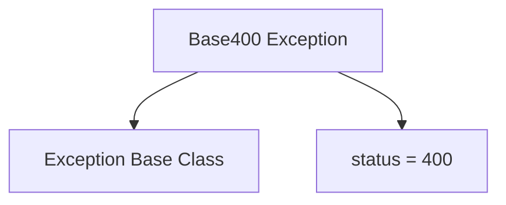

## Raises:
- None: This class itself does not raise any exceptions during initialization or usage. It simply defines a status code for HTTP 400 responses.

## Example:
```python
try:
    # Some operation that might fail
    if invalid_input:
        raise Base400("Invalid input provided")
except Base400 as e:
    # Handle the 400 error
    print(f"HTTP {e.status} Error: {str(e)}")
```

## `datasette.utils.asgi.NotFound` · *class*

## Summary:
NotFound is an exception class that represents HTTP 404 Not Found errors in ASGI applications, inheriting from Base400.

## Description:
NotFound serves as a specialized exception type for handling HTTP 404 errors within ASGI-based web applications. It extends Base400 to provide a standardized way to signal that requested resources could not be found, maintaining a consistent status code interface for HTTP 404 responses. This class enables centralized error handling and response generation for cases where clients request non-existent resources or endpoints.

## State:
- status (int): Class attribute set to 404, representing the HTTP status code for not found errors. This value is immutable and always equals 404.

## Lifecycle:
- Creation: Instances are created like any standard Python exception using `raise NotFound()` or `raise NotFound(message)`. No special instantiation requirements exist beyond standard exception creation patterns.
- Usage: When raised, the exception propagates up the call stack until caught by appropriate exception handlers. The status attribute can be accessed by exception handlers to generate proper HTTP 404 responses.
- Destruction: Like all Python exceptions, cleanup occurs automatically when the exception is handled or reaches the end of its scope.

## Method Map:


## Raises:
- None: This class itself does not raise any exceptions during initialization or usage. It simply defines a status code for HTTP 404 responses.

## Example:
```python
try:
    # Some operation that might fail
    if resource_not_found:
        raise NotFound("Resource not found")
except NotFound as e:
    # Handle the 404 error
    print(f"HTTP {e.status} Error: {str(e)}")
```

## `datasette.utils.asgi.Forbidden` · *class*

## Summary:
Forbidden represents an HTTP 403 Forbidden error in ASGI applications, inheriting from Base400 to provide standardized error handling for unauthorized access attempts.

## Description:
The Forbidden class is a specialized exception type designed to handle HTTP 403 Forbidden responses within ASGI-based web applications. It extends Base400, which establishes a foundation for HTTP 400 error handling, and specifically sets the status code to 403 to indicate that access to a requested resource is denied due to insufficient permissions or authorization. This class enables consistent error signaling and response generation for unauthorized access attempts, allowing application developers to distinguish between different types of client-side errors.

## State:
- status (int): Class attribute inherited from Base400 and overridden to 403, representing the HTTP status code for forbidden access. This value is immutable and always equals 403.

## Lifecycle:
- Creation: Instances are created like any standard Python exception using `raise Forbidden()` or `raise Forbidden(message)`. No special instantiation requirements exist beyond standard exception creation patterns.
- Usage: When raised, the exception propagates up the call stack until caught by appropriate exception handlers. The status attribute can be accessed by exception handlers to generate proper HTTP 403 responses.
- Destruction: Like all Python exceptions, cleanup occurs automatically when the exception is handled or reaches the end of its scope.

## Method Map:
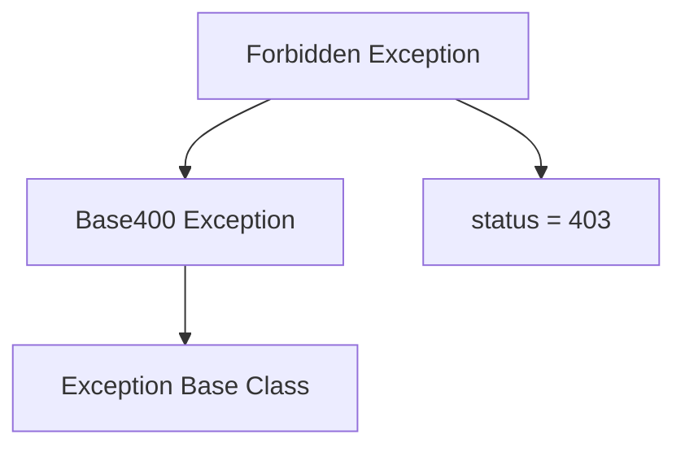

## Raises:
- None: This class itself does not raise any exceptions during initialization or usage. It simply defines a status code for HTTP 403 responses.

## Example:
```python
try:
    # Some operation requiring authorization
    if not user.is_authenticated():
        raise Forbidden("Access denied for unauthenticated users")
except Forbidden as e:
    # Handle the 403 error
    print(f"HTTP {e.status} Error: {str(e)}")
```

## `datasette.utils.asgi.BadRequest` · *class*

## Summary:
BadRequest is an exception class that represents HTTP 400 Bad Request errors in ASGI applications.

## Description:
BadRequest serves as a specialized exception type for handling HTTP 400 errors within ASGI-based web applications. It inherits from Base400 and provides a standardized way to signal bad request conditions while maintaining a consistent status code interface. This class enables centralized error handling and response generation for malformed requests, invalid parameters, or other client-side issues that result in HTTP 400 responses.

## State:
- status (int): Class attribute set to 400, representing the HTTP status code for bad requests. This value is immutable and always equals 400.

## Lifecycle:
- Creation: Instances are created like any standard Python exception using `raise BadRequest()` or `raise BadRequest(message)`. No special instantiation requirements exist beyond standard exception creation patterns.
- Usage: When raised, the exception propagates up the call stack until caught by appropriate exception handlers. The status attribute can be accessed by exception handlers to generate proper HTTP responses.
- Destruction: Like all Python exceptions, cleanup occurs automatically when the exception is handled or reaches the end of its scope.

## Method Map:
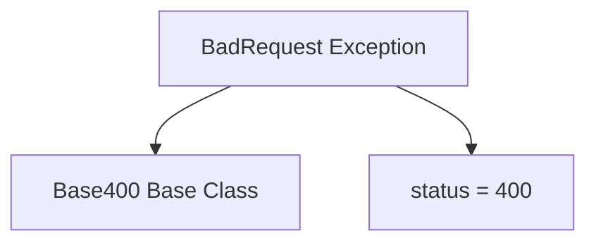

## Raises:
- None: This class itself does not raise any exceptions during initialization or usage. It simply defines a status code for HTTP 400 responses.

## Example:
```python
try:
    # Some operation that might fail
    if invalid_input:
        raise BadRequest("Invalid input provided")
except BadRequest as e:
    # Handle the 400 error
    print(f"HTTP {e.status} Error: {str(e)}")
```

## `datasette.utils.asgi.Request` · *class*

## Summary:
An ASGI HTTP request wrapper that provides convenient access to request metadata and body content.

## Description:
The Request class provides a convenient interface for accessing HTTP request information from ASGI scope and receive objects. It exposes properties for common request attributes such as method, URL, headers, cookies, and query parameters, and includes asynchronous methods for reading POST body content. This abstraction simplifies working with ASGI requests by providing standardized access patterns.

## State:
- scope: dict - The ASGI scope dictionary containing request metadata
- receive: callable - An ASGI receive callable for reading request body chunks
- method: str - HTTP method (GET, POST, etc.) extracted from the scope
- url: str - Full URL constructed from scheme, host, path, and query string
- url_vars: dict - URL route parameters extracted from the scope's url_route
- scheme: str - URL scheme (http or https) from the scope, defaults to "http"
- headers: dict - HTTP headers with lowercase keys, decoded from bytes to strings
- host: str - Host header value or "localhost" fallback
- cookies: dict - Cookie key-value pairs parsed from the cookie header
- path: str - Request path component, handling both raw_path and regular path
- query_string: str - Query string portion of the URL, decoded from bytes
- full_path: str - Path with optional query string
- args: MultiParams - Parsed query parameters with support for multiple values per key
- actor: object - Actor identity for authentication purposes

## Lifecycle:
- Creation: Instantiate with ASGI scope and receive callable
- Usage: Access properties and methods to retrieve request information
- Destruction: No special cleanup required; uses standard Python garbage collection

## Method Map:
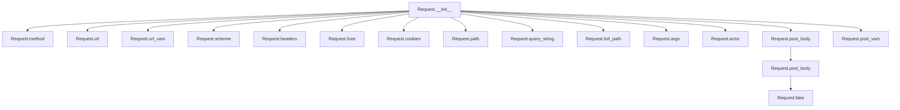

## Raises:
- AssertionError: When receiving unexpected message types in post_body() method

## Example:
```python
# Typical usage with ASGI server
request = Request(scope, receive)
print(request.method)  # GET
print(request.url)     # http://localhost/path?param=value
print(request.args["param"])  # value

# Creating a fake request for testing
fake_request = Request.fake("/test?foo=bar")
print(fake_request.url)  # http://localhost/test?foo=bar
```

### `datasette.utils.asgi.Request.__init__` · *method*

## Summary:
Initializes an ASGI Request object with scope and receive callable, setting up core request metadata storage.

## Description:
The `__init__` method serves as the constructor for the Request class, establishing the fundamental ASGI request components. It stores the ASGI scope dictionary and receive callable that are essential for accessing request metadata and reading request body content. This method is called during Request object instantiation and sets up the basic infrastructure needed for all subsequent request property access and body reading operations.

## Args:
    scope (dict): The ASGI scope dictionary containing HTTP request metadata including method, URL components, headers, and routing information
    receive (callable): An ASGI receive callable that can be used to read request body chunks asynchronously

## Returns:
    None: This method initializes instance attributes but does not return a value

## Raises:
    None: This method does not raise any exceptions

## State Changes:
    Attributes READ: None
    Attributes WRITTEN: 
    - self.scope: Stores the ASGI scope dictionary for later property access
    - self.receive: Stores the ASGI receive callable for reading request body content

## Constraints:
    Preconditions:
    - scope must be a valid ASGI scope dictionary containing HTTP request metadata
    - receive must be a callable that conforms to ASGI specification for receiving messages
    Postconditions:
    - self.scope is set to the provided scope parameter
    - self.receive is set to the provided receive parameter

## Side Effects:
    None: This method performs only attribute assignment with no I/O operations or external service calls

### `datasette.utils.asgi.Request.__repr__` · *method*

## Summary:
Returns a string representation of the ASGI request object showing its HTTP method and URL.

## Description:
This method provides a human-readable string representation of the Request object, primarily used for debugging and logging purposes. It is automatically called when the object needs to be displayed or converted to a string. The method accesses the request's HTTP method and URL properties to construct the representation.

## Args:
    None

## Returns:
    str: A formatted string in the pattern '<asgi.Request method="METHOD" url="URL">' where METHOD is the HTTP method and URL is the request URL.

## Raises:
    None

## State Changes:
    Attributes READ: self.method, self.url
    Attributes WRITTEN: None

## Constraints:
    Preconditions: The Request object must have been properly initialized with a valid scope dictionary containing the required keys for method and URL properties.
    Postconditions: The returned string follows a consistent format for debugging purposes.

## Side Effects:
    None

### `datasette.utils.asgi.Request.method` · *method*

## Summary:
Returns the HTTP method of the ASGI request scope.

## Description:
This property extracts and returns the HTTP method from the ASGI request's scope dictionary. It provides access to the standard HTTP methods like GET, POST, PUT, DELETE, etc. This method is part of the Request class that wraps ASGI scope information for easier access.

## Args:
    None

## Returns:
    str: The HTTP method string (e.g., "GET", "POST", "PUT", "DELETE") as stored in the ASGI scope under the "method" key.

## Raises:
    KeyError: If the "method" key is not present in the scope dictionary (though this would be unusual in a valid ASGI request).

## State Changes:
    Attributes READ: self.scope
    Attributes WRITTEN: None

## Constraints:
    Preconditions: The Request instance must have been initialized with a valid ASGI scope dictionary containing a "method" key.
    Postconditions: The returned value is always a string representing the HTTP method.

## Side Effects:
    None

### `datasette.utils.asgi.Request.url` · *method*

## Summary:
Constructs and returns the full URL string from the Request object's scheme, host, path, and query string components.

## Description:
This method combines the various components of an HTTP request (scheme, host, path, and query string) into a complete URL string. It serves as a convenient accessor for generating the full URL without manually concatenating components. The method is typically called during request processing when the full URL needs to be referenced, such as in redirects, links, or logging.

The method uses `urlunparse` from Python's `urllib.parse` module, which expects a 6-tuple containing (scheme, netloc, path, params, query, fragment). In this implementation, the params and fragment are set to None, while the other components are taken directly from the Request instance attributes. This approach ensures proper URL formatting according to RFC standards.

## Args:
    self: The Request instance containing the URL components.

## Returns:
    str: A complete URL string constructed from the request's scheme, host, path, and query string components.

## Raises:
    None: This method does not raise any exceptions.

## State Changes:
    Attributes READ: self.scheme, self.host, self.path, self.query_string
    Attributes WRITTEN: None

## Constraints:
    Preconditions: All attributes (scheme, host, path, query_string) must be properly initialized on the Request instance.
    Postconditions: The returned string is a valid URL representation combining all components.

## Side Effects:
    None: This method performs no I/O operations or external service calls.

### `datasette.utils.asgi.Request.url_vars` · *method*

## Summary:
Returns URL path parameters extracted from the ASGI scope's URL routing information.

## Description:
This property extracts URL route parameters (often called "path variables" or "URL vars") from the ASGI scope's `url_route` dictionary. It is used in Datasette's ASGI-based web framework to access dynamic path segments defined in URL patterns.

The method is part of the Request class and provides a clean interface for accessing route parameters without directly manipulating the ASGI scope dictionary. This abstraction allows the application to work with URL parameters consistently regardless of the underlying ASGI server implementation.

Known callers:
- Internal routing handlers that process incoming HTTP requests and need to extract path parameters for route matching
- Template rendering systems that may need to access URL parameters for generating links or populating context
- Middleware components that inspect URL parameters for authorization or logging purposes

This logic is encapsulated in its own property rather than being inlined because:
1. It provides a standardized interface for accessing URL parameters across the application
2. It handles the complex nested dictionary access pattern safely with default fallbacks
3. It abstracts away the ASGI-specific scope structure from the rest of the codebase
4. It makes the code more readable and maintainable by centralizing this access pattern

## Args:
    None

## Returns:
    dict: A dictionary containing URL route parameters. Returns an empty dictionary if no URL route parameters are available.

## Raises:
    None

## State Changes:
    Attributes READ: self.scope
    Attributes WRITTEN: None

## Constraints:
    Preconditions:
    - The Request instance must have been initialized with a valid ASGI scope dictionary
    - The scope dictionary should contain a "url_route" key, though this is optional
    
    Postconditions:
    - The returned dictionary is always a dictionary instance (never None)
    - The returned dictionary contains only string keys and values (based on ASGI conventions)

## Side Effects:
    None

### `datasette.utils.asgi.Request.scheme` · *method*

## Summary:
Returns the URL scheme (http or https) from the ASGI scope, defaulting to "http" if not specified.

## Description:
This property extracts the URL scheme from the ASGI scope dictionary, which contains information about the incoming HTTP request. It serves as a convenient accessor for the scheme component of the request URL. The method is part of the Request class and provides a standardized way to retrieve the scheme regardless of whether it's explicitly set in the scope.

## Args:
    None

## Returns:
    str: The URL scheme (either "http" or "https") from the ASGI scope, or "http" as default fallback.

## Raises:
    None

## State Changes:
    Attributes READ: self.scope
    Attributes WRITTEN: None

## Constraints:
    Preconditions: The Request instance must have been initialized with a valid ASGI scope dictionary containing a "scheme" key or None.
    Postconditions: The returned value is always a string representing a valid URL scheme.

## Side Effects:
    None

### `datasette.utils.asgi.Request.headers` · *method*

## Summary:
Returns a dictionary of HTTP headers from the ASGI scope, with keys and values decoded from bytes to lowercase strings.

## Description:
This method extracts HTTP headers from the ASGI scope's headers field and converts them from byte strings to regular strings using latin-1 decoding. The resulting dictionary has lowercase keys for case-insensitive header access. This abstraction provides a convenient way to access HTTP headers in a normalized format without requiring manual decoding.

## Args:
    None

## Returns:
    dict[str, str]: A dictionary mapping header names (lowercase strings) to their corresponding values (strings). Returns an empty dictionary if no headers are present in the scope.

## Raises:
    None

## State Changes:
    Attributes READ: self.scope
    Attributes WRITTEN: None

## Constraints:
    Preconditions: The method assumes self.scope contains a headers field that is either a list of (key, value) byte pairs or None.
    Postconditions: The returned dictionary will always have string keys and values, with all keys converted to lowercase.

## Side Effects:
    None

### `datasette.utils.asgi.Request.host` · *method*

## Summary:
Returns the host header from the HTTP request or defaults to "localhost" if not present.

## Description:
This method extracts the host information from the request headers, which typically contains the domain name or IP address of the server. It serves as a convenience accessor for the host header while providing a sensible fallback when the header is missing.

The method is designed to be part of the Request class in the ASGI utilities module, making it easy to access host information consistently across different parts of the application.

## Args:
    self: The Request instance from which to extract the host header.

## Returns:
    str: The value of the "host" header from the request, or "localhost" if the header is not present.

## Raises:
    None: This method does not raise any exceptions.

## State Changes:
    Attributes READ: self.headers
    Attributes WRITTEN: None

## Constraints:
    Preconditions: The Request instance must have a headers attribute that supports the .get() method.
    Postconditions: The returned value is always a string, either from the headers or the default "localhost".

## Side Effects:
    None: This method performs no I/O operations or external service calls.

### `datasette.utils.asgi.Request.cookies` · *method*

## Summary:
Extracts and returns all HTTP cookie key-value pairs from the request headers as a dictionary.

## Description:
This method parses the "cookie" header from an incoming HTTP request and converts it into a standard Python dictionary mapping cookie names to their values. It uses Python's built-in `http.cookies.SimpleCookie` class to safely parse cookie data and handles cases where no cookie header is present.

## Args:
    None

## Returns:
    dict[str, str]: A dictionary containing all parsed cookie names as keys and their corresponding values as values. Returns an empty dictionary if no cookie header is present or if parsing fails.

## Raises:
    None

## State Changes:
    Attributes READ: self.headers
    Attributes WRITTEN: None

## Constraints:
    Preconditions: The `self.headers` attribute must be accessible and contain HTTP headers.
    Postconditions: The returned dictionary contains only string keys and values representing valid cookie data.

## Side Effects:
    None

### `datasette.utils.asgi.Request.path` · *method*

## Summary:
Extracts and normalizes the URL path from the ASGI request scope, removing query parameters and handling both raw byte and decoded string representations.

## Description:
This property provides access to the URL path component from the ASGI request scope. It handles two different path representations that may be present in the ASGI scope: a raw byte string (`raw_path`) or a decoded string (`path`). The method ensures consistent return format by decoding bytes when necessary and stripping query parameters from the result. This normalization is important for consistent path handling across different ASGI servers and implementations.

The ASGI (Asynchronous Server Gateway Interface) specification defines a standard interface between async web servers and applications. In Datasette's ASGI implementation, the request scope contains metadata about the incoming HTTP request, including path information that may be encoded differently depending on the server implementation.

## Args:
    self: The Request instance containing the ASGI scope with path information.

## Returns:
    str: The URL path component without query parameters, normalized to a UTF-8 string.

## Raises:
    UnicodeDecodeError: When the raw_path bytes cannot be decoded using latin-1 or utf-8 encoding.

## State Changes:
    Attributes READ: self.scope
    Attributes WRITTEN: None

## Constraints:
    Preconditions: The Request instance must have a valid scope attribute containing either a "raw_path" key or a "path" key.
    Postconditions: The returned value is always a string representing the path portion of the URL without query parameters.

## Side Effects:
    None

### `datasette.utils.asgi.Request.query_string` · *method*

## Summary:
Returns the URL query string from the ASGI scope, decoded as a latin-1 encoded string.

## Description:
This property extracts and decodes the query string portion of the HTTP request from the ASGI scope. It is used to access the query parameters that were part of the original URL. The method ensures that even when no query string is present in the scope, an empty string is returned rather than None.

## Args:
    None

## Returns:
    str: The decoded query string from the ASGI scope, or an empty string if no query string is present.

## Raises:
    UnicodeDecodeError: If the query string bytes cannot be decoded using latin-1 encoding.

## State Changes:
    Attributes READ: self.scope
    Attributes WRITTEN: None

## Constraints:
    Preconditions: The self.scope dictionary must contain a "query_string" key that either maps to bytes or None.
    Postconditions: The returned value is always a string, never None, and represents the query portion of the URL.

## Side Effects:
    None

### `datasette.utils.asgi.Request.full_path` · *method*

## Summary:
Returns the full URL path including query string parameters.

## Description:
This property constructs and returns the complete URL path by combining the request's path with its query string. It is used to provide access to the full path information for routing and URL building purposes.

## Args:
    None

## Returns:
    str: The full path including query string, formatted as "{path}?{query_string}" when query string exists, or just "{path}" when it doesn't.

## Raises:
    None

## State Changes:
    Attributes READ: self.path, self.query_string
    Attributes WRITTEN: None

## Constraints:
    Preconditions: The Request object must have valid path and query_string properties.
    Postconditions: The returned string will always be a valid URL path representation.

## Side Effects:
    None

### `datasette.utils.asgi.Request.args` · *method*

## Summary:
Returns parsed HTTP query parameters as a MultiParams object for easy access to parameter values.

## Description:
This property extracts the query string from the HTTP request and parses it into a MultiParams object, allowing convenient access to query parameters that may have multiple values for the same key. The method is implemented as a property that performs parsing on each access.

Known callers:
- Various parts of the Datasette framework that need to access HTTP query parameters from ASGI requests
- The property is accessed during request processing pipelines when parameter inspection is required

This logic is encapsulated in its own property because:
1. Query string parsing is a common operation that benefits from reuse
2. The parsing result needs to be computed fresh on each access to reflect any changes in the underlying query string
3. MultiParams provides a convenient interface for handling parameters with multiple values
4. Separates concerns between raw HTTP data extraction and parameter processing

## Args:
None

## Returns:
MultiParams: An object that provides access to HTTP query parameters with support for multiple values per key. The object behaves like a dictionary where accessing a key returns the first value, but also provides methods to get all values (getlist) or specify defaults (get).

## Raises:
None

## State Changes:
Attributes READ: self.query_string
Attributes WRITTEN: None

## Constraints:
Preconditions:
- The Request instance must have been properly initialized with a valid ASGI scope
- The query_string property must be accessible and return a valid string representation of the query parameters

Postconditions:
- The returned MultiParams object is a fresh instance created from the current query string
- Each access to this property re-parses the query string to ensure up-to-date results

## Side Effects:
None

### `datasette.utils.asgi.Request.actor` · *method*

## Summary:
Returns the actor associated with the ASGI request scope, or None if not present.

## Description:
This property retrieves the 'actor' key from the request's ASGI scope dictionary. It is used to access authentication or authorization information that has been set by middleware or the ASGI server. The method is part of the Request class and provides a standardized way to access actor information throughout the application.

## Args:
    None

## Returns:
    Any: The value associated with the 'actor' key in the scope dictionary, or None if the key is not present.

## Raises:
    None

## State Changes:
    Attributes READ: self.scope
    Attributes WRITTEN: None

## Constraints:
    Preconditions: The Request instance must have been initialized with a valid scope dictionary containing the 'actor' key if it exists.
    Postconditions: The returned value is either the actor information or None, with no modification to the Request object's state.

## Side Effects:
    None

### `datasette.utils.asgi.Request.post_body` · *method*

## Summary:
Asynchronously collects and returns the complete HTTP request body from a streaming ASGI message stream.

## Description:
This method implements the ASGI protocol for receiving HTTP request bodies that may be sent in multiple chunks. It continuously receives messages from the ASGI server until all body data has been collected. This approach handles chunked HTTP requests properly by accumulating body content until the `more_body` flag indicates the final chunk.

The method is designed to work within the ASGI request handling lifecycle, specifically during the processing of incoming HTTP requests where the full body content needs to be available for parsing or further processing. It is typically called when handling POST requests or other methods requiring request body data.

## Args:
    None

## Returns:
    bytes: The complete HTTP request body as a bytes object containing all accumulated data from the streaming ASGI messages.

## Raises:
    AssertionError: When an unexpected message type is received from the ASGI server (specifically when message["type"] != "http.request").

## State Changes:
    Attributes READ: None
    Attributes WRITTEN: None

## Constraints:
    Preconditions: 
    - The method must be called within an ASGI HTTP request context
    - The `self.receive()` method must be available and properly implemented
    - The ASGI server must send messages with the correct "http.request" type
    
    Postconditions:
    - All HTTP request body data has been completely received and accumulated
    - The returned bytes object contains the full request body content

## Side Effects:
    I/O: Performs asynchronous I/O operations via `await self.receive()` to fetch data from the ASGI server

### `datasette.utils.asgi.Request.post_vars` · *method*

## Summary:
Parses the POST request body as form-encoded data into a dictionary of parameters.

## Description:
This asynchronous method retrieves the raw POST request body and parses it as form-encoded data (similar to URL query strings) into a dictionary. It's commonly used to extract form data submitted via HTML forms with POST method.

## Args:
    None

## Returns:
    dict[str, str]: A dictionary mapping form field names to their string values. If the body is empty or cannot be parsed, returns an empty dictionary. Note that if multiple values exist for the same key, only the last value will be retained.

## Raises:
    UnicodeDecodeError: When the POST body cannot be decoded as UTF-8.
    TypeError: If the body is not bytes or cannot be processed by parse_qsl.

## State Changes:
    Attributes READ: None
    Attributes WRITTEN: None

## Constraints:
    Preconditions: The Request object must have a valid post_body() method that returns bytes.
    Postconditions: The returned dictionary contains only string keys and values derived from the parsed form data.

## Side Effects:
    I/O: Performs async I/O operation by calling self.post_body().
    Decoding: Converts bytes to UTF-8 string.

### `datasette.utils.asgi.Request.fake` · *method*

## Summary:
Constructs a fake ASGI HTTP request scope for testing by parsing a URL string and creating minimal ASGI-compatible request data.

## Description:
This static method creates a mock ASGI scope dictionary that represents a minimal HTTP request. It's primarily used for testing purposes to create Request objects without requiring a real HTTP server or client. The method takes a URL-like string, separates the path and query components, encodes them in latin-1, and builds a scope dictionary that conforms to ASGI specification for HTTP requests.

## Args:
    cls (type): The Request class to instantiate with the generated scope
    path_with_query_string (str): A URL-style string containing path and optional query parameters (e.g., "/foo/bar?param=value")
    method (str): HTTP method for the fake request. Defaults to "GET"
    scheme (str): URL scheme for the fake request. Defaults to "http"
    url_vars (dict, optional): Dictionary of URL route variables to include in the scope. Defaults to None

## Returns:
    Request: A new Request instance initialized with the constructed ASGI scope

## Raises:
    None explicitly raised

## State Changes:
    Attributes READ: None
    Attributes WRITTEN: None (the returned Request object manages its own state)

## Constraints:
    Preconditions:
    - path_with_query_string must be a string
    - method must be a valid HTTP method string
    - scheme must be a valid URL scheme string
    - url_vars, if provided, must be a dictionary

    Postconditions:
    - The returned Request object contains a properly formatted ASGI scope
    - The scope includes all required ASGI HTTP fields: http_version, method, path, raw_path, query_string, scheme, type
    - Query parameters are encoded using latin-1 encoding
    - If url_vars is provided, the scope includes url_route with kwargs

## Side Effects:
    None

## `datasette.utils.asgi.AsgiLifespan` · *class*

## Summary:
AsgiLifespan is an ASGI middleware that manages application startup and shutdown lifecycle events according to the ASGI lifespan protocol.

## Description:
This class implements the ASGI lifespan protocol to handle application lifecycle management. It wraps an ASGI application and intercepts lifespan messages to execute registered startup and shutdown callbacks. When the ASGI scope type is "lifespan", it processes startup and shutdown events; otherwise, it forwards requests to the wrapped application. This pattern is commonly used in ASGI applications to manage resource initialization and cleanup.

## State:
- app: The wrapped ASGI application that handles normal HTTP requests
- on_startup: List of asynchronous functions to execute during application startup (default: empty list)
- on_shutdown: List of asynchronous functions to execute during application shutdown (default: empty list)

## Lifecycle:
- Creation: Instantiate with an ASGI app and optional startup/shutdown callback lists. Callbacks can be provided as single functions or lists of functions.
- Usage: Call the instance with standard ASGI parameters (scope, receive, send) to process lifespan events and forward regular requests.
- Destruction: Automatic cleanup occurs when the lifespan.shutdown event is processed and handled.

## Method Map:
```mermaid
graph TD
    A[ASGI Request Handler] --> B{scope.type == "lifespan"?}
    B -- Yes --> C[Loop: Receive Messages]
    C --> D{Message Type}
    D -->|lifespan.startup| E[Execute on_startup callbacks]
    E --> F[Send startup.complete]
    D -->|lifespan.shutdown| G[Execute on_shutdown callbacks]
    G --> H[Send shutdown.complete]
    H --> I[Exit Loop]
    B -- No --> J[Forward to app]
```

## Raises:
- None explicitly raised by __init__
- Exceptions from startup/shutdown callbacks will propagate through the async execution chain

## Example:
```python
async def initialize_database():
    # Database connection setup
    pass

async def cleanup_resources():
    # Resource cleanup
    pass

# Create the lifespan handler
lifespan = AsgiLifespan(
    app=my_asgi_app,
    on_startup=[initialize_database],
    on_shutdown=[cleanup_resources]
)

# Use in ASGI server
await lifespan(scope, receive, send)
```

### `datasette.utils.asgi.AsgiLifespan.__init__` · *method*

## Summary:
Initializes an ASGI lifespan handler with application and startup/shutdown callback management.

## Description:
Configures the AsgiLifespan instance by storing the ASGI application and normalizing startup and shutdown callback handlers into lists. This method ensures that both startup and shutdown handlers are consistently stored as lists, even when provided as single callable objects.

## Args:
    app (Any): The ASGI application instance to manage.
    on_startup (list or callable, optional): Startup handlers to execute when the application starts. Can be a single callable or list of callables. Defaults to None.
    on_shutdown (list or callable, optional): Shutdown handlers to execute when the application shuts down. Can be a single callable or list of callables. Defaults to None.

## Returns:
    None: This method does not return a value.

## Raises:
    None: This method does not explicitly raise exceptions.

## State Changes:
    Attributes READ: None
    Attributes WRITTEN: 
    - self.app: Stores the provided ASGI application instance
    - self.on_startup: Stores the normalized startup handler list
    - self.on_shutdown: Stores the normalized shutdown handler list

## Constraints:
    Preconditions:
    - The app parameter must be a valid ASGI application instance
    - on_startup and on_shutdown parameters, if provided, must be either callable objects or lists of callable objects
    
    Postconditions:
    - self.app is set to the provided app parameter
    - self.on_startup is guaranteed to be a list of callable objects (empty list if None)
    - self.on_shutdown is guaranteed to be a list of callable objects (empty list if None)

## Side Effects:
    None: This method performs no I/O operations or external service calls.

### `datasette.utils.asgi.AsgiLifespan.__call__` · *method*

## Summary:
Handles ASGI lifespan events by executing registered startup and shutdown callbacks, then delegates to the wrapped application for other event types.

## Description:
This method implements the ASGI lifespan protocol, managing application lifecycle events such as startup and shutdown. It processes incoming messages from the ASGI server, executes registered callback functions for each lifecycle event, and sends appropriate completion responses back to the server. For non-lifespan events, it forwards the request to the wrapped application instance.

The method operates in a loop to continuously handle lifespan messages until a shutdown event occurs, at which point it exits the loop and returns control to the ASGI server.

## Args:
    scope (dict): ASGI scope dictionary containing connection and request metadata
    receive (callable): ASGI receive callable for receiving messages from the server
    send (callable): ASGI send callable for sending messages to the server

## Returns:
    None: This method does not return a value directly, though it may return early when handling shutdown events

## Raises:
    None explicitly raised: The method relies on underlying async operations that may raise exceptions, but these are not caught or re-raised by this method

## State Changes:
    Attributes READ: self.on_startup, self.on_shutdown, self.app
    Attributes WRITTEN: None

## Constraints:
    Preconditions:
        - The scope parameter must be a valid ASGI scope dictionary
        - The receive and send parameters must be valid ASGI callable objects
        - The app attribute must be a valid ASGI application callable
        - The on_startup and on_shutdown lists must contain callable objects or be empty
    Postconditions:
        - For lifespan.startup messages: All registered startup callbacks are executed synchronously
        - For lifespan.shutdown messages: All registered shutdown callbacks are executed synchronously and the method returns
        - For non-lifespan messages: The wrapped application receives the scope, receive, and send parameters

## Side Effects:
    - Executes registered startup/shutdown callback functions asynchronously
    - Sends messages to the ASGI server via the send callable
    - May perform I/O operations during callback execution
    - Delegates to the wrapped application for non-lifespan events

## `datasette.utils.asgi.AsgiStream` · *class*

## Summary:
A wrapper class for ASGI HTTP response streaming that encapsulates the process of sending HTTP response headers and body chunks via ASGI.

## Description:
The AsgiStream class serves as an abstraction for creating and sending HTTP responses in ASGI applications using streaming semantics. It manages the ASGI response lifecycle by handling header setup and coordinating with a stream function that writes response body content. This class enables efficient streaming of large responses without buffering the entire content in memory.

## State:
- stream_fn: Callable, required parameter that accepts an AsgiWriter instance and returns a coroutine. Responsible for writing the response body content.
- status: int, optional parameter with default value 200. HTTP status code for the response.
- headers: dict, optional parameter with default value {}. Additional HTTP headers to include in the response.
- content_type: str, optional parameter with default value "text/plain". Content-Type header value for the response.

## Lifecycle:
- Creation: Instantiate with a stream function and optional status, headers, and content_type parameters.
- Usage: Call the asgi_send method with an ASGI 'send' callable to initiate the response streaming process.
- Destruction: No explicit cleanup required; relies on ASGI server lifecycle management.

## Method Map:
```mermaid
graph TD
    A[asgi_send(send)] --> B[Prepare headers]
    B --> C[Send http.response.start]
    C --> D[Create AsgiWriter]
    D --> E[Call stream_fn with AsgiWriter]
    E --> F[Send http.response.body]
```

## Raises:
- None explicitly raised by __init__
- Exceptions may occur during asgi_send if the underlying send callable or stream_fn raises them

## Example:
```python
async def stream_content(writer):
    await writer.write("Hello ")
    await writer.write("World!")

stream = AsgiStream(stream_content, status=200, content_type="text/html")
await stream.asgi_send(send)
```

### `datasette.utils.asgi.AsgiStream.__init__` · *method*

## Summary:
Initializes an AsgiStream object with streaming function, HTTP status, headers, and content type.

## Description:
The __init__ method sets up the AsgiStream instance by storing the provided streaming function, HTTP status code, headers dictionary, and content type. This method is called during object instantiation to configure the stream handler's basic properties.

## Args:
    stream_fn (callable): A function that generates the response stream content
    status (int): HTTP status code, defaults to 200
    headers (dict, optional): HTTP headers dictionary, defaults to None
    content_type (str): MIME content type, defaults to "text/plain"

## Returns:
    None: This method initializes the object's attributes but does not return anything

## Raises:
    None: This method does not raise any exceptions

## State Changes:
    Attributes READ: None
    Attributes WRITTEN: self.stream_fn, self.status, self.headers, self.content_type

## Constraints:
    Preconditions: 
    - stream_fn must be callable
    - status must be a valid HTTP status code integer
    - headers must be a dictionary or None
    - content_type must be a string representing a valid MIME type
    
    Postconditions:
    - self.stream_fn is set to the provided stream_fn parameter
    - self.status is set to the provided status parameter or defaults to 200
    - self.headers is set to the provided headers parameter or defaults to an empty dict
    - self.content_type is set to the provided content_type parameter or defaults to "text/plain"

## Side Effects:
    None: This method performs no I/O operations or external service calls

### `datasette.utils.asgi.AsgiStream.asgi_send` · *method*

## Summary:
Sends an HTTP response using the ASGI protocol by writing headers and invoking the stream function to generate response content.

## Description:
This method implements the ASGI response sending logic for an AsgiStream instance. It constructs the HTTP response headers, sends the initial response start message, executes the stream function to write response content, and concludes with an empty body message. This method serves as the core interface for converting a streaming response generator into an ASGI-compatible response.

## Args:
    send (callable): An ASGI send callable that accepts ASGI messages for sending HTTP responses.

## Returns:
    None: This method does not return a value.

## Raises:
    Exception: May raise exceptions from the underlying ASGI send callable or stream function execution.

## State Changes:
    Attributes READ: self.headers, self.content_type, self.status, self.stream_fn
    Attributes WRITTEN: None

## Constraints:
    Preconditions:
        - The 'send' parameter must be a valid ASGI send callable
        - self.stream_fn must be a callable that accepts an AsgiWriter instance
        - self.headers should be a dictionary-like object with string keys and values
        - self.content_type should be a valid MIME type string
        - self.status should be a valid HTTP status code integer
    Postconditions:
        - An ASGI http.response.start message is sent with constructed headers
        - The stream_fn is executed with an AsgiWriter instance
        - An ASGI http.response.body message with empty body is sent

## Side Effects:
    - Writes HTTP response headers to the client via the ASGI send callable
    - Invokes the stream function which may perform I/O operations
    - Sends HTTP response body chunks through the ASGI send callable

## `datasette.utils.asgi.AsgiWriter` · *class*

## Summary:
A wrapper class for ASGI response body writing operations that encodes and sends chunks of data asynchronously.

## Description:
The AsgiWriter class provides a simplified interface for sending HTTP response body chunks in ASGI applications. It wraps an ASGI 'send' callable and handles the encoding of string data to UTF-8 bytes, along with setting the appropriate ASGI message structure for streaming responses. This abstraction allows components to write response data without directly managing ASGI protocol details.

## State:
- send: Callable, required parameter passed to constructor. Should be an ASGI send function that accepts ASGI messages.
- The class maintains no internal state beyond the send callable.

## Lifecycle:
- Creation: Instantiate with an ASGI 'send' callable as the sole argument.
- Usage: Call the write() method with string data to send chunks of response body.
- Destruction: No explicit cleanup required; relies on ASGI server lifecycle management.

## Method Map:
```mermaid
graph TD
    A[write(chunk)] --> B[send({"type": "http.response.body", ...})]
    B --> C[ASGI Server]
```

## Raises:
- None explicitly raised by __init__
- Exceptions may occur during write() if the underlying send callable raises them

## Example:
```python
# Typical usage in ASGI application
async def app(scope, receive, send):
    writer = AsgiWriter(send)
    await writer.write("Hello ")
    await writer.write("World!")
```

### `datasette.utils.asgi.AsgiWriter.__init__` · *method*

## Summary:
Initializes an AsgiWriter instance with an ASGI send callable for handling HTTP response body streaming.

## Description:
The __init__ method sets up an AsgiWriter object by storing the provided ASGI send callable. This callable is used internally by the write() method to send HTTP response body chunks according to the ASGI specification. The method serves as the constructor that establishes the fundamental communication channel for asynchronous response writing.

## Args:
    send (callable): An ASGI send function that accepts ASGI messages. This callable is stored as self.send and used to transmit response data chunks.

## Returns:
    None: This method does not return a value.

## Raises:
    None: This method does not raise any exceptions under normal circumstances.

## State Changes:
    Attributes READ: None
    Attributes WRITTEN: self.send - stores the provided ASGI send callable

## Constraints:
    Preconditions: The send parameter must be a callable that conforms to the ASGI specification for sending messages.
    Postconditions: The AsgiWriter instance is initialized with the send callable stored in self.send.

## Side Effects:
    None: This method performs no I/O operations or external service calls. It only assigns the send parameter to an instance attribute.

### `datasette.utils.asgi.AsgiWriter.write` · *method*

## Summary:
Writes UTF-8 encoded byte data to an ASGI HTTP response body stream with continuation indication.

## Description:
This asynchronous method sends a chunk of string data as part of an HTTP response body through the ASGI communication interface. It encodes the provided string chunk to UTF-8 bytes and transmits it with the "more_body" flag set to True, signaling to the ASGI server that additional response body content will follow. This method is part of the AsgiWriter class which implements ASGI-compatible response writing for asynchronous web applications.

## Args:
    chunk (str): The string content to be written as part of the HTTP response body. Must be encodable to UTF-8.

## Returns:
    None: This method does not return any value.

## Raises:
    Any exceptions raised by the underlying ASGI send function when transmitting the response body chunk.

## State Changes:
    Attributes READ: None
    Attributes WRITTEN: None

## Constraints:
    Preconditions: 
    - The AsgiWriter instance must be properly initialized with a valid ASGI send function
    - The chunk parameter must be a string that can be encoded to UTF-8 without errors
    Postconditions:
    - The chunk is sent as part of the HTTP response body via the ASGI interface
    - The "more_body" flag is set to True to indicate additional content will follow in subsequent writes

## Side Effects:
    I/O: Performs an asynchronous write operation through the ASGI send interface
    External service call: Communicates with the ASGI server to transmit HTTP response data

## `datasette.utils.asgi.asgi_send_json` · *function*

## Summary:
Serializes a Python object to JSON and sends it as an HTTP response through the ASGI protocol.

## Description:
This asynchronous function takes a Python object, serializes it to JSON format, and sends it as an HTTP response using the ASGI protocol. It leverages the existing `asgi_send` utility to handle the actual ASGI communication, automatically setting the content type to JSON. This function provides a convenient way to send JSON responses in ASGI applications without manually serializing objects or constructing headers.

## Args:
    send (callable): An ASGI send callable that accepts a dictionary containing ASGI response events
    info (Any): A Python object that can be serialized to JSON (dict, list, str, int, float, bool, None)
    status (int): HTTP status code for the response. Defaults to 200
    headers (dict, optional): Dictionary of additional HTTP headers to include in the response. Defaults to None

## Returns:
    None: This function does not return a value but sends an ASGI response message to the client

## Raises:
    TypeError: Raised by json.dumps() if the info parameter contains non-serializable objects
    Exception: May raise exceptions from the underlying ASGI send callable if communication fails

## Constraints:
    Preconditions:
        - The send parameter must be a valid ASGI send callable
        - The info parameter must be serializable to JSON
        - The status parameter must be a valid HTTP status code integer
        - Headers dictionary keys and values must be strings that can be encoded with latin1
    Postconditions:
        - An ASGI "http.response.start" message is sent with status code and JSON content type
        - An ASGI "http.response.body" message is sent with the JSON-encoded content
        - The Content-Type header is set to "application/json; charset=utf-8"

## Side Effects:
    - Sends two ASGI messages to the client via the send callable
    - Performs JSON serialization of the info parameter
    - May cause network I/O if the ASGI server forwards the messages to a client

## Control Flow:
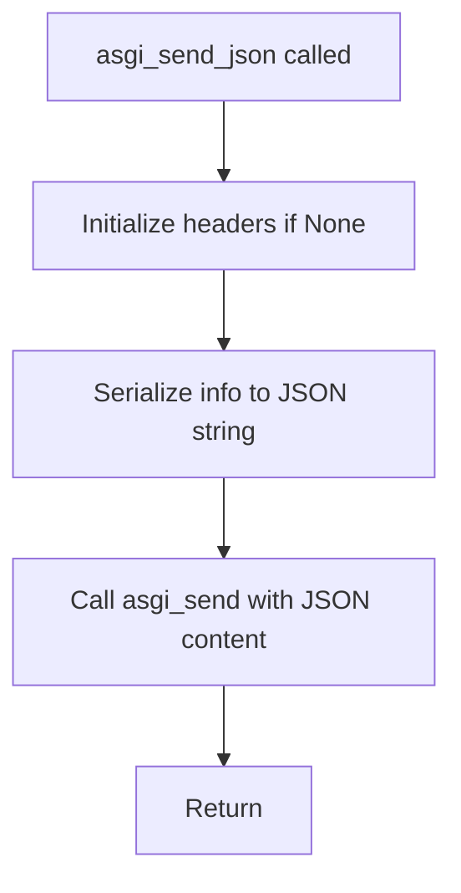

## Examples:
```python
# Basic usage with default status and headers
await asgi_send_json(send, {"message": "Hello World"})

# Usage with custom status and headers
await asgi_send_json(send, {"error": "not found"}, 404, {"x-custom-header": "value"})
```

## `datasette.utils.asgi.asgi_send_html` · *function*

## Summary:
Sends an HTML response through the ASGI protocol with appropriate content type header.

## Description:
This asynchronous function provides a convenience wrapper for sending HTML content via ASGI by automatically setting the correct content type header ("text/html; charset=utf-8"). It implements the ASGI HTTP response sending protocol by delegating to the underlying `asgi_send` function with the appropriate content type specification.

The function is extracted into its own utility to enforce a clear responsibility boundary for HTML-specific response handling, separating the concern of content type management from general ASGI response sending logic.

## Args:
    send (callable): An ASGI send callable that accepts a dictionary containing ASGI response events
    html (str): The HTML content to be sent as the response body
    status (int): HTTP status code for the response. Defaults to 200
    headers (dict, optional): Dictionary of additional HTTP headers to include in the response. Defaults to None

## Returns:
    None: This function does not return a value but sends ASGI messages to complete the HTTP response

## Raises:
    Exception: May raise exceptions from the underlying `asgi_send` function if ASGI communication fails

## Constraints:
    Preconditions:
        - The `send` parameter must be a valid ASGI send callable
        - The `html` parameter must be a string that can be encoded to UTF-8
        - The `status` parameter must be a valid HTTP status code integer
        - If provided, `headers` must be a dictionary-like object with string keys and values
    Postconditions:
        - An ASGI "http.response.start" message is sent with status and headers including content-type
        - An ASGI "http.response.body" message is sent with the HTML content
        - The Content-Type header is set to "text/html; charset=utf-8"

## Side Effects:
    - Sends two ASGI messages to the client via the send callable
    - May cause network I/O if the ASGI server forwards the messages to a client

## Control Flow:
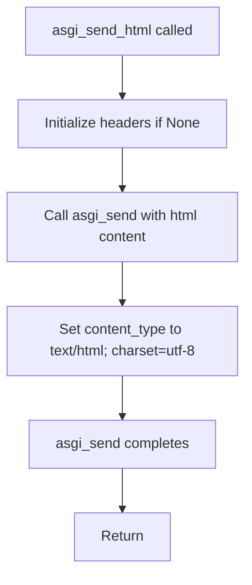

## Examples:
```python
# Basic usage
await asgi_send_html(send, "<h1>Hello World</h1>")

# Usage with custom status and headers
await asgi_send_html(send, "<h1>Error</h1>", status=404, headers={"x-custom": "value"})
```

## `datasette.utils.asgi.asgi_send_redirect` · *function*

## Summary:
Sends an ASGI HTTP redirect response with a specified location and status code.

## Description:
This asynchronous function creates and sends an HTTP redirect response using the ASGI protocol. It leverages the existing `asgi_send` utility to construct a properly formatted redirect response with the appropriate Location header and status code. The function is designed to be used in ASGI applications where a redirect response is needed, such as when handling form submissions or routing decisions.

The logic is extracted into its own function to provide a clean abstraction for redirect responses, separating the concerns of redirect construction from general response sending logic. This promotes code reuse and makes redirect handling more explicit and testable.

## Args:
    send (callable): An ASGI send callable that accepts a message dictionary to send to the client
    location (str): The URL to redirect to, used as the value for the Location header
    status (int): HTTP status code for the redirect response. Defaults to 302 (Found)

## Returns:
    None: This function does not return a value but sends ASGI messages to complete the HTTP redirect response

## Raises:
    Exception: May raise exceptions from the underlying ASGI send callable if communication fails

## Constraints:
    Preconditions:
        - The send parameter must be a valid ASGI send callable
        - The location parameter must be a string representing a valid URL
        - The status parameter must be a valid HTTP redirect status code (typically 301, 302, 303, 307, or 308)
    Postconditions:
        - An ASGI "http.response.start" message is sent with the specified status and Location header
        - An ASGI "http.response.body" message is sent with empty content
        - The Content-Type header is set to "text/html; charset=utf-8"

## Side Effects:
    - Sends two ASGI messages to the client via the send callable
    - May cause network I/O if the ASGI server forwards the messages to a client

## Control Flow:
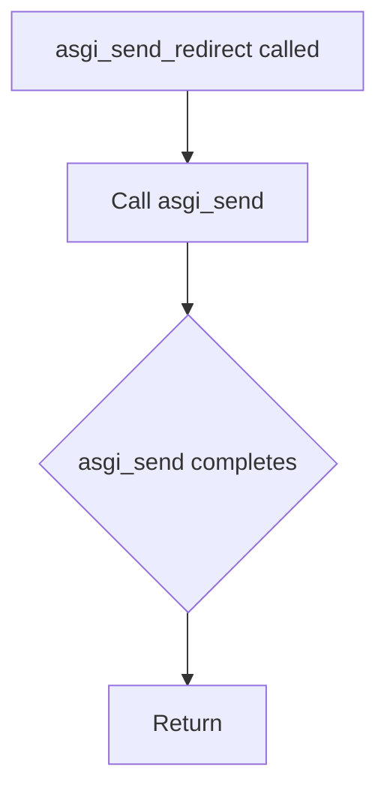

## Examples:
```python
# Basic redirect to another page
await asgi_send_redirect(send, "/new-page")

# Redirect with custom status code
await asgi_send_redirect(send, "/login", status=301)

# Redirect with absolute URL
await asgi_send_redirect(send, "https://example.com/redirected")
```

## `datasette.utils.asgi.asgi_send` · *function*

## Summary:
Sends an ASGI HTTP response with specified content, status, and headers.

## Description:
This asynchronous function completes an ASGI HTTP response by first initializing the response headers and status using `asgi_start`, then sending the response body. It is designed to be used in ASGI applications where a complete HTTP response needs to be sent to the client with proper formatting and encoding.

## Args:
    send (callable): ASGI send callable that accepts a message dictionary to send to the client
    content (str): The response body content to be sent
    status (int): HTTP status code for the response
    headers (dict, optional): Dictionary of HTTP headers to include in the response. Defaults to None
    content_type (str): MIME content type for the response body. Defaults to "text/plain"

## Returns:
    None: This function does not return a value but sends two ASGI messages to complete the HTTP response

## Raises:
    Exception: May raise exceptions from the underlying ASGI send callable if communication fails

## Constraints:
    Preconditions:
        - The send parameter must be a valid ASGI send callable
        - The status parameter must be a valid HTTP status code integer
        - The content parameter must be a string that can be encoded to UTF-8
        - Headers dictionary keys and values must be strings that can be encoded with latin1
    Postconditions:
        - An ASGI "http.response.start" message is sent with the specified status and headers
        - An ASGI "http.response.body" message is sent with the encoded content
        - The Content-Type header is set to the provided content_type value

## Side Effects:
    - Sends two ASGI messages to the client via the send callable
    - May cause network I/O if the ASGI server forwards the messages to a client

## Control Flow:
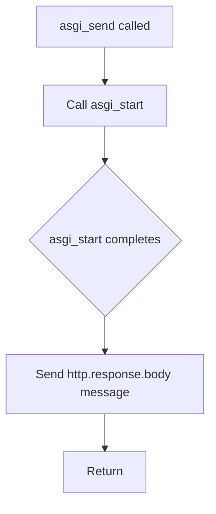

## Examples:
```python
# Basic usage
await asgi_send(send, "Hello World", 200)

# Usage with custom headers and content type
await asgi_send(send, '{"error": "not found"}', 404, {"x-error": "true"}, "application/json")
```

## `datasette.utils.asgi.asgi_start` · *function*

## Summary:
Initializes an ASGI HTTP response by sending the response start message with specified status, headers, and content type.

## Description:
This asynchronous function prepares and sends the initial HTTP response message in ASGI protocol format. It handles header management by removing any existing Content-Type header and setting a new one based on the provided content_type parameter. The function is designed to be used as part of an ASGI application's response handling pipeline, typically as the first step in sending an HTTP response.

## Args:
    send (callable): ASGI send callable that accepts a message dictionary to send to the client
    status (int): HTTP status code for the response
    headers (dict, optional): Dictionary of HTTP headers to include in the response. Defaults to None
    content_type (str): MIME content type for the response body. Defaults to "text/plain"

## Returns:
    None: This function does not return a value but sends an ASGI message

## Raises:
    None explicitly raised: The function itself doesn't raise exceptions, but the underlying send() call may raise exceptions if the ASGI server encounters issues

## Constraints:
    Preconditions:
        - The send parameter must be a valid ASGI send callable
        - The status parameter must be a valid HTTP status code integer
        - Headers dictionary keys and values must be strings that can be encoded with latin1
    Postconditions:
        - An ASGI "http.response.start" message is sent with the specified status and headers
        - The Content-Type header is set to the provided content_type value
        - Any existing Content-Type header in the input headers is removed

## Side Effects:
    - Sends an ASGI message to the client via the send callable
    - May cause network I/O if the ASGI server forwards the message to a client

## Control Flow:
```mermaid
flowchart TD
    A[asgi_start called] --> B{headers provided?}
    B -- No --> C[Set headers = {}]
    B -- Yes --> D[Use provided headers]
    C --> E[Filter out existing Content-Type]
    D --> E
    E --> F[Set Content-Type to content_type]
    F --> G[Encode headers to latin1 bytes]
    G --> H[Send ASGI message]
    H --> I[Return]
```

## Examples:
```python
# Basic usage with default content type
await asgi_start(send, 200)

# Usage with custom headers and content type
await asgi_start(send, 200, {"x-custom-header": "value"}, "application/json")

# Usage with existing headers that include Content-Type (will be overridden)
await asgi_start(send, 404, {"content-type": "text/html", "x-error": "true"}, "application/json")
```

## `datasette.utils.asgi.asgi_send_file` · *function*

## Summary:
Sends a file as an HTTP response using ASGI protocol with streaming chunks.

## Description:
Asynchronously reads a file and streams its contents as an HTTP response using the ASGI protocol. This function is designed to handle large files efficiently by reading and sending them in configurable-sized chunks. It automatically determines content type based on file extension and sets appropriate headers including content length and disposition.

## Args:
    send (callable): ASGI send callable that accepts a message dictionary to send to the client
    filepath (str or Path): Path to the file to be sent as response
    filename (str, optional): Name to use in Content-Disposition header for file download. Defaults to None
    content_type (str, optional): MIME content type for the response. If None, guessed from filepath. Defaults to None
    chunk_size (int): Size of chunks to read and send at a time. Defaults to 4096
    headers (dict, optional): Additional HTTP headers to include in response. Defaults to None

## Returns:
    None: This function does not return a value but sends ASGI messages to the client

## Raises:
    None explicitly raised: The function itself doesn't raise exceptions, but underlying I/O operations may raise exceptions

## Constraints:
    Preconditions:
        - The send parameter must be a valid ASGI send callable
        - The filepath must point to an existing readable file
        - The chunk_size must be a positive integer
    Postconditions:
        - An ASGI "http.response.start" message is sent with proper headers
        - File content is streamed in chunks to the client
        - All ASGI "http.response.body" messages are sent with correct more_body flags

## Side Effects:
    - Reads file from disk using async file operations
    - Sends multiple ASGI messages to the client via the send callable
    - May cause network I/O if the ASGI server forwards messages to a client

## Control Flow:
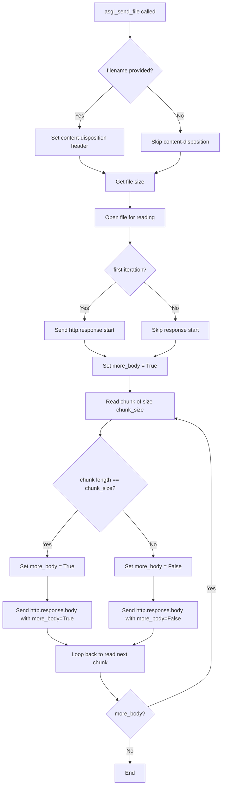

## Examples:
```python
# Send a file with automatic content type detection
await asgi_send_file(send, "/path/to/file.txt")

# Send a file with custom filename for download
await asgi_send_file(send, "/path/to/data.csv", filename="report.csv")

# Send a file with explicit content type and custom headers
await asgi_send_file(
    send, 
    "/path/to/image.png", 
    content_type="image/png", 
    headers={"x-cache-control": "no-cache"}
)
```

## `datasette.utils.asgi.asgi_static` · *function*

## Summary:
Creates an ASGI middleware function for serving static files from a specified directory path.

## Description:
Returns an asynchronous ASGI handler that serves static files from a configured root directory. The returned function handles incoming requests by resolving the requested path against the root directory, performing security checks to prevent directory traversal, and serving the file content using streaming I/O. This function encapsulates the complete logic for static file serving in an ASGI environment, including path validation, directory access control, and error handling.

The function is extracted into its own utility to enforce a clear responsibility boundary for static file serving, separating this concern from application routing logic and providing a reusable component for serving assets like CSS, JavaScript, images, and other static resources.

## Args:
    root_path (str or Path): Root directory path from which static files will be served
    chunk_size (int): Size of chunks to read and send at a time when serving files. Defaults to 4096
    headers (dict, optional): Additional HTTP headers to include in responses. Defaults to None
    content_type (str, optional): Default MIME content type for responses. Defaults to None

## Returns:
    callable: An ASGI async function that handles static file requests with the signature (request, send)

## Raises:
    None explicitly raised: The function itself doesn't raise exceptions, but underlying I/O operations may raise exceptions

## Constraints:
    Preconditions:
        - The root_path must be a valid directory path that exists on the filesystem
        - The chunk_size must be a positive integer
        - The headers parameter, if provided, must be a dictionary-like object with string keys and values
    Postconditions:
        - The returned function is an ASGI-compatible async handler
        - All paths are validated against the root_path to prevent directory traversal attacks
        - Directory listings are blocked for security reasons
        - Appropriate HTTP status codes are returned for various error conditions

## Side Effects:
    - Performs filesystem operations to resolve and validate file paths
    - May cause network I/O when sending file content via ASGI
    - May cause disk I/O when reading files for streaming

## Control Flow:
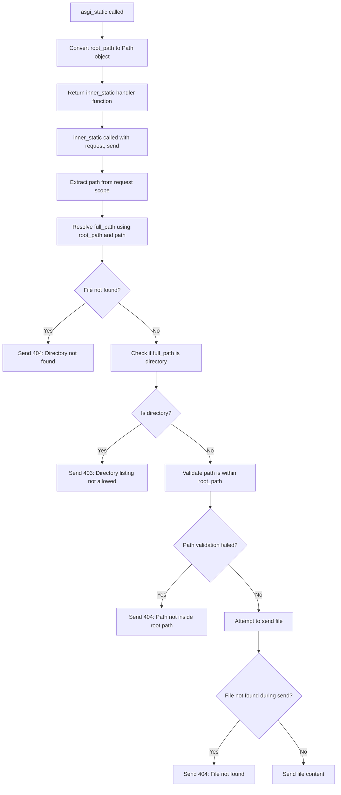

## Examples:
```python
# Basic usage with default settings
app.add_middleware(asgi_static("/var/www/static"))

# Usage with custom chunk size and headers
app.add_middleware(asgi_static("/var/www/assets", chunk_size=8192, headers={"Cache-Control": "public"}))
```

## `datasette.utils.asgi.Response` · *class*

## Summary:
Represents an HTTP response in ASGI applications, providing methods to construct various response types and handle cookie management.

## Description:
The Response class serves as a container for HTTP responses in ASGI applications, encapsulating response body, status code, headers, and content type. It provides factory methods for creating common response types (HTML, text, JSON) and utilities for setting cookies according to HTTP standards. The class is designed to work with ASGI frameworks and handles proper encoding of response bodies.

## State:
- body: The response body content, can be string or bytes
- status: HTTP status code (default 200)
- headers: Dictionary of HTTP headers (default empty)
- _set_cookie_headers: Internal list storing formatted Set-Cookie header strings
- content_type: MIME type of the response body (default "text/plain")

## Lifecycle:
- Creation: Instantiate directly with constructor or via class methods (html, text, json, redirect)
- Usage: Call asgi_send() to transmit response through ASGI interface
- Destruction: No explicit cleanup required; context manager support not implemented

## Method Map:
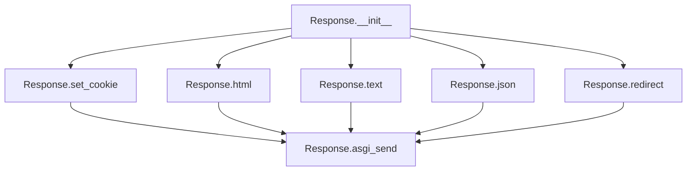

## Raises:
- AssertionError: When set_cookie is called with invalid samesite parameter value

## Example:
```python
# Create HTML response
response = Response.html("<h1>Hello World</h1>")
# Set a cookie
response.set_cookie("session_id", "abc123", max_age=3600)
# Send via ASGI
await response.asgi_send(send_function)
```

### `datasette.utils.asgi.Response.__init__` · *method*

## Summary:
Initializes an ASGI Response object with configurable body, status code, headers, and content type.

## Description:
The Response.__init__ method sets up the foundational attributes of an HTTP response object used in the ASGI framework. It configures the response body, HTTP status code, headers dictionary, cookie tracking mechanism, and content type. This method serves as the constructor that establishes the initial state of a Response instance, preparing it for subsequent processing in the ASGI request-response cycle.

## Args:
    body (bytes, str, or None): The response body content. Defaults to None.
    status (int): HTTP status code. Defaults to 200.
    headers (dict or None): Additional HTTP headers. Defaults to None.
    content_type (str): MIME content type for the response. Defaults to "text/plain".

## Returns:
    None: This method initializes the object's attributes and does not return a value.

## Raises:
    None: This method does not explicitly raise exceptions.

## State Changes:
    Attributes READ: None
    Attributes WRITTEN: 
    - self.body: Set to the provided body parameter
    - self.status: Set to the provided status parameter  
    - self.headers: Set to the provided headers parameter or an empty dict
    - self._set_cookie_headers: Initialized as an empty list
    - self.content_type: Set to the provided content_type parameter

## Constraints:
    Preconditions: None
    Postconditions: 
    - self.body contains the provided body value
    - self.status contains the provided status value
    - self.headers is either the provided headers dict or an empty dict
    - self._set_cookie_headers is initialized as an empty list
    - self.content_type contains the provided content_type value

## Side Effects:
    None: This method performs only local attribute assignments and has no external side effects.

### `datasette.utils.asgi.Response.asgi_send` · *method*

## Summary:
Serializes and transmits an HTTP response through the ASGI protocol by sending headers and body to the ASGI send channel.

## Description:
This asynchronous method implements the ASGI response sending protocol by converting the Response object's properties into the required ASGI message format. It combines standard headers with content-type and set-cookie headers, then sends both the response start event and body to the ASGI server for transmission to the client. This method serves as the bridge between the Response object and the ASGI communication layer, ensuring proper serialization of HTTP responses according to ASGI specifications.

## Args:
    send (callable): An ASGI send callable that accepts a dictionary containing ASGI response events

## Returns:
    None: This method does not return a value

## Raises:
    None explicitly raised: The method delegates error handling to the underlying ASGI send function

## State Changes:
    Attributes READ: self.headers, self.content_type, self._set_cookie_headers, self.status, self.body
    Attributes WRITTEN: None

## Constraints:
    Preconditions: 
    - self.headers must be a dictionary-like object with string keys and values
    - self.content_type must be a string
    - self._set_cookie_headers must be iterable of strings
    - self.status must be an integer representing HTTP status code
    - self.body must be either bytes or a string that can be encoded to UTF-8
    Postconditions: 
    - The ASGI send function is called twice: once for "http.response.start" and once for "http.response.body"
    - All header keys and values are properly encoded to UTF-8 bytes
    - Body is converted to bytes if it's a string using UTF-8 encoding

## Side Effects:
    - Invokes the ASGI send function which performs network I/O to transmit the HTTP response
    - Performs string-to-bytes encoding operations when converting string body to bytes

### `datasette.utils.asgi.Response.set_cookie` · *method*

## Summary:
Sets an HTTP cookie by appending a formatted cookie header to the response's cookie collection.

## Description:
This method constructs an HTTP Set-Cookie header from the provided parameters and appends it to the internal `_set_cookie_headers` list. It is used to configure cookies that will be sent to the client in the HTTP response. The method validates the `samesite` parameter against allowed values and properly formats cookie attributes according to HTTP standards.

## Args:
    key (str): The name of the cookie.
    value (str): The value of the cookie. Defaults to empty string.
    max_age (int, optional): Number of seconds until the cookie expires. Defaults to None.
    expires (str, optional): Expiration date for the cookie. Defaults to None.
    path (str): Path for which the cookie is valid. Defaults to "/".
    domain (str, optional): Domain for which the cookie is valid. Defaults to None.
    secure (bool): If True, cookie is only sent over HTTPS. Defaults to False.
    httponly (bool): If True, cookie is inaccessible to JavaScript. Defaults to False.
    samesite (str): SameSite attribute value. Must be one of 'lax', 'strict', or 'none'. Defaults to "lax".

## Returns:
    None: This method does not return a value.

## Raises:
    AssertionError: If the `samesite` parameter is not one of the allowed values ('lax', 'strict', 'none').

## State Changes:
    Attributes READ: self._set_cookie_headers
    Attributes WRITTEN: self._set_cookie_headers

## Constraints:
    Preconditions:
        - The `samesite` parameter must be one of 'lax', 'strict', or 'none'
        - The `key` parameter must be a valid cookie name
    Postconditions:
        - The `_set_cookie_headers` list contains one additional formatted cookie header string
        - The cookie header is properly formatted according to HTTP Set-Cookie specification

## Side Effects:
    None: This method does not perform any I/O operations or mutate external state beyond modifying the internal `_set_cookie_headers` list.

### `datasette.utils.asgi.Response.html` · *method*

## Summary:
Creates an HTML response by instantiating a Response class with appropriate content type and status.

## Description:
This class method serves as a convenience factory for creating HTML responses. It provides a standardized way to construct Response objects specifically for HTML content, automatically setting the content type to "text/html; charset=utf-8" while preserving other response properties like status code and custom headers. This method is part of a family of response creation helpers including `text()`, `json()`, and `redirect()`.

## Args:
    cls: The Response class to instantiate (typically the Response class itself)
    body: The response body content (str or bytes)
    status: HTTP status code, defaults to 200
    headers: Optional dictionary of additional headers

## Returns:
    An instance of the Response class configured for HTML content

## Raises:
    None explicitly raised

## State Changes:
    None

## Constraints:
    Preconditions: 
    - cls must be the Response class or a subclass of Response
    - body must be compatible with the Response class constructor
    
    Postconditions:
    - Returned object will have content_type set to "text/html; charset=utf-8"
    - Returned object will preserve provided status and headers
    - Returned object will have the same interface as other Response instances

## Side Effects:
    None

## Usage Context:
This method is typically called during ASGI request handling when rendering HTML templates or content. It's part of the Response class's utility methods that provide convenient constructors for different content types.

### `datasette.utils.asgi.Response.text` · *method*

## Summary:
Creates a Response instance with text/plain content type from the provided body.

## Description:
This is a classmethod factory method that creates Response objects specifically for plain text content. It provides a convenient way to generate HTTP responses containing plain text data with proper content-type headers. The method converts the input body to a string and sets the Content-Type header to "text/plain; charset=utf-8".

This method exists as part of a pattern of factory methods in the Response class (alongside html(), json(), and redirect()) to provide type-safe, consistent ways to create different kinds of HTTP responses without having to manually specify common headers and content types each time.

## Args:
    cls: The Response class (automatically passed as first argument when called as classmethod)
    body: The content to be sent in the response body, convertible to string
    status: HTTP status code for the response, defaults to 200
    headers: Additional HTTP headers to include, defaults to None

## Returns:
    Response: An instance of the Response class configured for text/plain content

## Raises:
    None explicitly raised

## State Changes:
    None

## Constraints:
    Preconditions: 
    - The cls parameter must be the Response class or a subclass
    - The body parameter must be convertible to string
    
    Postconditions:
    - The returned Response object will have content_type set to "text/plain; charset=utf-8"
    - The response body will be the string representation of the input body
    - The status code will match the provided status parameter
    - Headers will be merged with any provided headers

## Side Effects:
    None

### `datasette.utils.asgi.Response.json` · *method*

## Summary:
Creates a JSON response by serializing the provided body and wrapping it in an ASGI Response object with appropriate JSON content type.

## Description:
This method serves as a factory function for creating JSON responses in the ASGI framework. It takes a Python object, serializes it to JSON format using the standard json module, and wraps it in a Response instance with proper content-type headers. This method is intended to be called as a class method on the Response class, providing a convenient way to construct JSON responses with standardized formatting and proper content-type headers.

The method exists to centralize JSON response creation logic and ensure consistent handling of JSON serialization across the application, reducing boilerplate code in route handlers and API endpoints. It is typically used in API endpoints and JSON-based web services.

## Args:
    cls: The Response class itself, used for instantiation
    body: The Python object to serialize to JSON. Can be any JSON-serializable type
    status: HTTP status code for the response. Defaults to 200
    headers: Additional headers to include in the response. Defaults to None
    default: A function to handle serialization of non-standard types. Defaults to None

## Returns:
    Response: An instance of the Response class configured with JSON content

## Raises:
    TypeError: If the body contains non-serializable objects and no default handler is provided

## State Changes:
    None: This is a static factory method that doesn't modify any instance state

## Constraints:
    Preconditions: 
    - The body argument must be serializable to JSON
    - The cls parameter must be the Response class
    - All arguments must conform to their expected types
    
    Postconditions:
    - The returned Response object will have content_type set to "application/json; charset=utf-8"
    - The response body will contain properly formatted JSON string

## Side Effects:
    None: This method performs no I/O operations or external service calls

### `datasette.utils.asgi.Response.redirect` · *method*

## Summary:
Creates an HTTP redirect response by setting the Location header and returning a new Response instance.

## Description:
This method creates an HTTP redirect response by constructing a new Response object with the specified redirect path in the Location header. It's designed to be called as a class method on the Response class to generate proper redirect responses.

## Args:
    cls: The Response class itself, used to instantiate the new response object
    path (str): The URL path to redirect to, which becomes the Location header value
    status (int): HTTP status code for the redirect, defaults to 302 (Found)
    headers (dict, optional): Additional headers to include in the response

## Returns:
    Response: A new Response instance configured as an HTTP redirect

## Raises:
    None explicitly raised

## State Changes:
    None - This is a factory method that doesn't modify any instance state

## Constraints:
    Preconditions:
    - The path parameter must be a valid string representing a URL path
    - The cls parameter must be the Response class itself
    - Status code should be a valid HTTP redirect status code (typically 301, 302, 303, 307, or 308)
    
    Postconditions:
    - The returned Response object will have its Location header set to the provided path
    - The returned Response object will have the specified status code
    - The returned Response object will have an empty body

## Side Effects:
    None - This method performs no I/O operations or external service calls

## `datasette.utils.asgi.AsgiFileDownload` · *class*

## Summary:
A wrapper class for handling ASGI file downloads that encapsulates file metadata and provides an async interface for sending files via ASGI.

## Description:
The AsgiFileDownload class serves as a container for file download information in ASGI applications, providing a clean abstraction for sending files as HTTP responses. It is typically instantiated by components that need to serve files asynchronously through the ASGI protocol, such as datasette's file serving mechanisms. The class encapsulates file path, filename, content type, and additional headers, then delegates the actual file sending operation to the asgi_send_file utility function.

## State:
- filepath (str or Path): Absolute or relative path to the file to be downloaded
- filename (str, optional): Name to use in Content-Disposition header for file download; defaults to None
- content_type (str): MIME content type for the response; defaults to "application/octet-stream"
- headers (dict): Additional HTTP headers to include in the response; defaults to empty dict

## Lifecycle:
- Creation: Instantiate with filepath and optional filename, content_type, and headers parameters
- Usage: Call the asgi_send method with an ASGI send callable to initiate file transfer
- Destruction: No explicit cleanup required; class is lightweight and stateless

## Method Map:
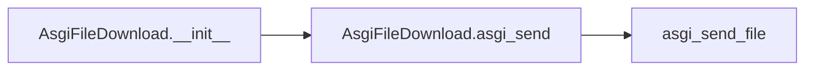

## Raises:
- No explicit exceptions raised by __init__
- Exceptions may occur during asgi_send execution due to file I/O errors or invalid ASGI send callable

## Example:
```python
# Create a file download handler
download = AsgiFileDownload(
    filepath="/path/to/data.json",
    filename="export.json",
    content_type="application/json"
)

# Send the file via ASGI
await download.asgi_send(send_callable)
```

### `datasette.utils.asgi.AsgiFileDownload.__init__` · *method*

## Summary:
Initializes an AsgiFileDownload object with file path, optional filename, content type, and custom headers for ASGI file serving.

## Description:
This constructor sets up the necessary attributes for downloading files via ASGI, including the file path, optional filename override, content type hint, and custom HTTP headers. It's designed to prepare the object for serving files through ASGI-compatible web servers.

## Args:
    filepath (str): The absolute or relative path to the file to be downloaded.
    filename (str, optional): Override the filename sent to the client. Defaults to None.
    content_type (str): MIME content type for the file. Defaults to "application/octet-stream".
    headers (dict, optional): Additional HTTP headers to include in the response. Defaults to None.

## Returns:
    None: This method initializes instance attributes and does not return a value.

## Raises:
    None: This method does not explicitly raise exceptions.

## State Changes:
    Attributes READ: None
    Attributes WRITTEN: 
    - self.headers: Set to the provided headers dict or an empty dict
    - self.filepath: Set to the provided filepath string
    - self.filename: Set to the provided filename or None
    - self.content_type: Set to the provided content_type string

## Constraints:
    Preconditions:
    - filepath must be a valid string representing a file path
    - headers, if provided, must be a dictionary-like object
    - content_type must be a valid MIME type string

    Postconditions:
    - All instance attributes are initialized with provided values or defaults
    - self.headers is guaranteed to be a dictionary (empty if None was provided)

## Side Effects:
    None: This method performs no I/O operations or external service calls. It only assigns values to instance attributes.

### `datasette.utils.asgi.AsgiFileDownload.asgi_send` · *method*

## Summary:
Streams file content as an HTTP response using ASGI protocol by delegating to asgi_send_file utility.

## Description:
This asynchronous method streams file content as an HTTP response using the ASGI protocol. It acts as a bridge between the AsgiFileDownload instance and the asgi_send_file utility function, passing the instance's file metadata (filepath, filename, content_type, headers) to the utility for actual file transmission. The method is designed to work within ASGI web server frameworks and handles large files efficiently through streaming.

## Args:
    send (callable): ASGI send callable that accepts a message dictionary to send to the client

## Returns:
    Awaitable: Returns the result of the asgi_send_file coroutine, which sends HTTP response messages to the client

## Raises:
    Exception: May propagate exceptions from asgi_send_file such as file I/O errors or invalid ASGI send calls

## State Changes:
    Attributes READ: self.filepath, self.filename, self.content_type, self.headers

## Constraints:
    Preconditions:
        - The send parameter must be a valid ASGI send callable
        - The file referenced by self.filepath must exist and be readable
        - Instance must be properly initialized with required attributes
    Postconditions:
        - File content is streamed to the client via ASGI protocol
        - Appropriate HTTP headers are set based on instance attributes
        - ASGI "http.response.start" and "http.response.body" messages are sent

## Side Effects:
    - Reads file from disk using async file operations
    - Sends multiple ASGI messages to the client via the send callable
    - May cause network I/O if the ASGI server forwards messages to a client

## `datasette.utils.asgi.AsgiRunOnFirstRequest` · *class*

## Summary:
A wrapper class that ensures ASGI startup hooks are executed exactly once before the first request is processed.

## Description:
This class implements the ASGI callable interface and serves as a middleware that executes a list of startup hooks exactly once when the first HTTP request is received. It is designed to defer initialization logic until the first request, which can help with lazy loading and resource management in ASGI applications.

## State:
- asgi: The underlying ASGI application to be wrapped, type: callable
- on_startup: List of async functions to be executed on first request, type: list
- _started: Boolean flag tracking whether startup hooks have been executed, type: bool, default: False

## Lifecycle:
- Creation: Instantiate with an ASGI application and a list of startup hook functions
- Usage: Call the instance as an ASGI callable with standard ASGI parameters (scope, receive, send)
- Destruction: No explicit cleanup required; relies on ASGI server lifecycle management

## Method Map:
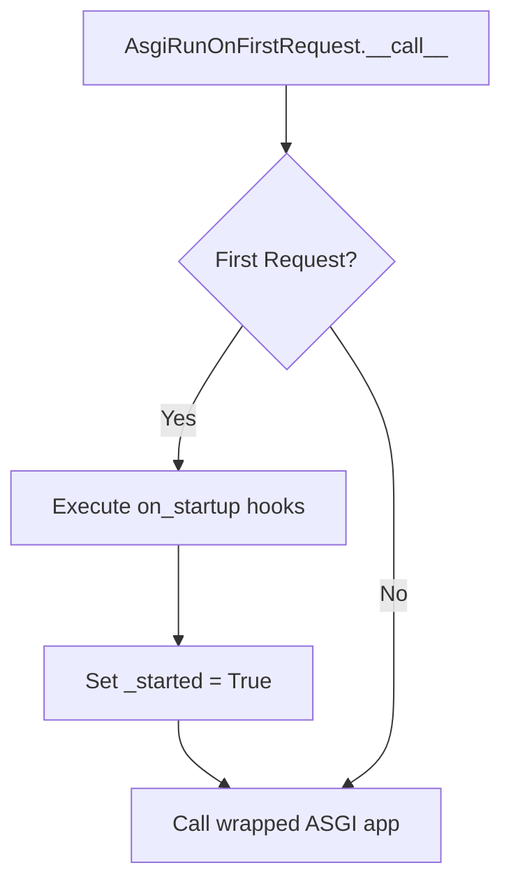

## Raises:
- AssertionError: If on_startup parameter is not a list

## Example:
```python
# Create startup hook
async def initialize_database():
    # Database connection setup logic here
    pass

# Create ASGI application
app = SomeASGIApp()

# Wrap with startup execution
wrapped_app = AsgiRunOnFirstRequest(app, [initialize_database])

# Use as normal ASGI application
# Startup hooks execute on first request
```

### `datasette.utils.asgi.AsgiRunOnFirstRequest.__init__` · *method*

## Summary:
Initializes an AsgiRunOnFirstRequest instance with ASGI application and startup handlers.

## Description:
Configures the instance to manage an ASGI application and its startup handlers, setting initial state to indicate that startup has not yet occurred.

## Args:
    asgi (Any): The ASGI application to be managed.
    on_startup (list): List of startup handler functions to be executed when the application starts.

## Returns:
    None

## Raises:
    AssertionError: If on_startup is not a list.

## State Changes:
    Attributes READ: None
    Attributes WRITTEN: 
    - self.asgi: Set to the provided ASGI application
    - self.on_startup: Set to the provided list of startup handlers  
    - self._started: Set to False to indicate startup has not occurred

## Constraints:
    Preconditions:
    - on_startup must be a list type
    - asgi can be any valid ASGI application

    Postconditions:
    - self.asgi is assigned the provided ASGI application
    - self.on_startup is assigned the provided list of startup handlers
    - self._started is initialized to False

## Side Effects:
    None

### `datasette.utils.asgi.AsgiRunOnFirstRequest.__call__` · *method*

## Summary:
Executes ASGI application startup hooks on first request and delegates to the wrapped ASGI application.

## Description:
This method serves as the entry point for ASGI requests, implementing a lazy initialization pattern. On the first request, it executes all registered startup hooks exactly once, then delegates to the wrapped ASGI application to handle the request. Subsequent requests skip the startup hook execution and directly invoke the ASGI application.

## Args:
    scope (dict): ASGI scope dictionary containing request information
    receive (callable): ASGI receive callable for receiving messages
    send (callable): ASGI send callable for sending messages

## Returns:
    Awaitable: An awaitable that resolves to the result of the wrapped ASGI application execution

## Raises:
    Any exceptions raised by the startup hooks or the wrapped ASGI application

## State Changes:
    Attributes READ: self._started, self.on_startup, self.asgi
    Attributes WRITTEN: self._started (set to True on first invocation)

## Constraints:
    Preconditions: The instance must be properly initialized with valid asgi and on_startup parameters
    Postconditions: The _started flag is set to True after first execution, ensuring startup hooks run exactly once

## Side Effects:
    I/O operations during startup hook execution, potential external service calls made by startup hooks, and delegation to the wrapped ASGI application for request processing

