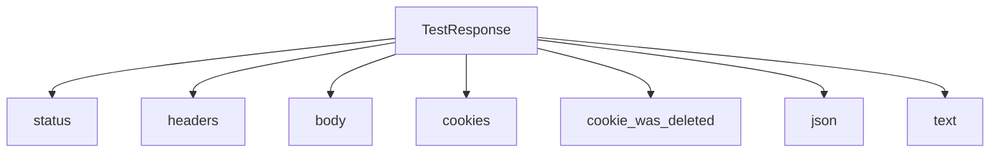
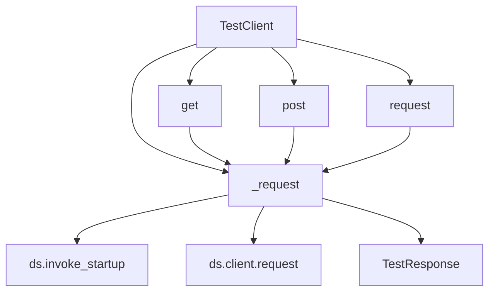

# `testing.py`

## `datasette.utils.testing.TestResponse` · *class*

## Summary:
A wrapper class that provides convenient accessors and utilities for HTTP responses in testing scenarios.

## Description:
The TestResponse class serves as a thin wrapper around an httpx.Response object, offering simplified property access and utility methods for examining HTTP responses during testing. It abstracts away direct interaction with the underlying httpx response object while providing commonly needed functionality like status codes, headers, cookies, and JSON parsing.

This class is designed to make test code more readable and maintainable by providing intuitive access patterns for common response inspection tasks.

## State:
- httpx_response: The underlying httpx.Response object being wrapped. Type: httpx.Response. This is the sole instance variable and must be provided during initialization.

## Lifecycle:
- Creation: Instantiate with an httpx.Response object via the constructor
- Usage: Access properties and methods in any order for response inspection
- Destruction: No special cleanup required; relies on Python's garbage collection

## Method Map:


## Raises:
- None explicitly raised by __init__
- However, if httpx_response is None or lacks expected attributes, accessing properties may raise AttributeError

## Example:
```python
# Assuming httpx_response is an httpx.Response object from a test request
response = TestResponse(httpx_response)
print(response.status)  # Access status code
print(response.json)    # Parse JSON response
print(response.text)    # Get raw text
print(response.cookies) # Get cookies as dict
if response.cookie_was_deleted('sessionid'):
    print("Session cookie was deleted")
```

### `datasette.utils.testing.TestResponse.__init__` · *method*

## Summary:
Initializes a TestResponse object with an httpx response for testing HTTP interactions.

## Description:
This method serves as the constructor for the TestResponse class, storing the provided httpx response object for later inspection during testing. It acts as a wrapper around httpx's response object to enable convenient testing of HTTP responses in Datasette's test suite.

## Args:
    httpx_response: The httpx response object to store and wrap for testing purposes.

## Returns:
    None

## Raises:
    None

## State Changes:
    Attributes READ: None
    Attributes WRITTEN: self.httpx_response

## Constraints:
    Preconditions: The httpx_response parameter must be a valid httpx response object.
    Postconditions: The TestResponse instance will have its httpx_response attribute set to the provided value.

## Side Effects:
    None

### `datasette.utils.testing.TestResponse.status` · *method*

## Summary:
Returns the HTTP status code from the underlying httpx response object.

## Description:
This method provides access to the HTTP status code of the response object. It serves as a simple accessor that delegates to the `status_code` attribute of the `httpx_response` instance variable. This method is typically called during test assertion phases to validate HTTP response codes.

## Args:
    None

## Returns:
    int: The HTTP status code returned by the server, such as 200, 404, or 500.

## Raises:
    AttributeError: If `self.httpx_response` is None or does not have a `status_code` attribute.

## State Changes:
    Attributes READ: self.httpx_response
    Attributes WRITTEN: None

## Constraints:
    Preconditions: The `self.httpx_response` attribute must be initialized and contain a valid httpx response object with a `status_code` attribute.
    Postconditions: The method returns an integer representing the HTTP status code without modifying any object state.

## Side Effects:
    None

### `datasette.utils.testing.TestResponse.headers` · *method*

## Summary:
Provides access to HTTP headers from the underlying test response.

## Description:
This method exposes the HTTP headers from the test response's underlying httpx response object. It acts as a clean interface for accessing response metadata during testing scenarios. The method is typically invoked during test assertion phases when validating response headers or inspecting response characteristics.

## Args:
    None

## Returns:
    httpx.Headers: An immutable mapping containing all HTTP headers from the response.

## Raises:
    AttributeError: If `self.httpx_response` is None or does not have a `headers` attribute.

## State Changes:
    Attributes READ: self.httpx_response
    Attributes WRITTEN: None

## Constraints:
    Preconditions: The `self.httpx_response` attribute must be properly initialized with a valid httpx response object before calling this method.
    Postconditions: The returned headers object is a direct reference to the underlying httpx response headers and maintains the same lifetime.

## Side Effects:
    None

### `datasette.utils.testing.TestResponse.body` · *method*

## Summary:
Returns the raw binary content bytes from the underlying HTTP response object.

## Description:
This method provides access to the binary content of an HTTP response by exposing the `content` attribute of the internal `httpx_response` object. It serves as a convenient accessor for retrieving the response body without requiring direct manipulation of the underlying HTTP client object. This method is part of the `TestResponse` class, which wraps HTTP responses for testing purposes in the Datasette framework.

## Args:
    None

## Returns:
    bytes: The raw binary content of the HTTP response.

## Raises:
    AttributeError: If `self.httpx_response` is None or does not have a `content` attribute.

## State Changes:
    Attributes READ: self.httpx_response
    Attributes WRITTEN: None

## Constraints:
    Preconditions: The `self.httpx_response` attribute must be initialized and contain a valid HTTP response object with a `content` attribute.
    Postconditions: The returned bytes object is identical to the content stored in `self.httpx_response.content`.

## Side Effects:
    None

### `datasette.utils.testing.TestResponse.cookies` · *method*

## Summary:
Returns a dictionary representation of the HTTP response cookies from the underlying httpx response object.

## Description:
This method provides access to the cookies contained in the HTTP response by converting the httpx response's cookies object into a standard Python dictionary. It serves as a convenient property for testing code that needs to inspect response cookies without dealing with the raw httpx cookies interface directly.

The method is part of the TestResponse class which wraps an httpx response object for easier testing of HTTP responses in the Datasette test suite. This property allows test code to easily examine cookies set by the server under test.

## Args:
    None

## Returns:
    dict[str, str]: A dictionary mapping cookie names to their values. Returns an empty dictionary if no cookies are present.

## Raises:
    None

## State Changes:
    Attributes READ: self.httpx_response.cookies
    Attributes WRITTEN: None

## Constraints:
    Preconditions: The TestResponse instance must have been initialized with a valid httpx response object that has a cookies attribute.
    Postconditions: The returned dictionary is a copy of the cookies data, so modifications to it won't affect the original httpx response cookies.

## Side Effects:
    None

### `datasette.utils.testing.TestResponse.cookie_was_deleted` · *method*

## Summary:
Checks whether a specific cookie was deleted by examining the HTTP response headers for a Set-Cookie header with an empty value.

## Description:
This method verifies if a cookie has been deleted by looking for a Set-Cookie header in the HTTP response that matches the pattern of a deleted cookie (i.e., the cookie name followed by an empty string value). It is typically used in testing scenarios to validate that cookies are properly cleared during logout or session expiration flows.

## Args:
    cookie (str): The name of the cookie to check for deletion.

## Returns:
    bool: True if a Set-Cookie header exists with the specified cookie name set to an empty string, False otherwise.

## Raises:
    None explicitly raised.

## State Changes:
    Attributes READ: self.httpx_response
    Attributes WRITTEN: None

## Constraints:
    Preconditions: The TestResponse instance must have an httpx_response attribute containing HTTP headers with a "set-cookie" header.
    Postconditions: The method returns a boolean indicating cookie deletion status without modifying any object state.

## Side Effects:
    None.

### `datasette.utils.testing.TestResponse.json` · *method*

## Summary:
Parses the response text as JSON and returns the resulting Python object.

## Description:
This method deserializes the textual response content into a Python data structure using the standard JSON parser. It is designed for testing purposes where API responses need to be validated or inspected programmatically. The method assumes that the response text is valid JSON and will raise an exception if it is not.

## Args:
    None

## Returns:
    The Python object resulting from parsing the response text as JSON. This could be a dict, list, str, int, float, bool, or None depending on the JSON structure.

## Raises:
    json.JSONDecodeError: When the response text is not valid JSON.

## State Changes:
    Attributes READ: self.text
    Attributes WRITTEN: None

## Constraints:
    Preconditions: The response text must be valid JSON format.
    Postconditions: The returned object is the parsed representation of the JSON string stored in self.text.

## Side Effects:
    None

### `datasette.utils.testing.TestResponse.text` · *method*

## Summary:
Returns the UTF-8 decoded text content of the HTTP response body.

## Description:
This method extracts and decodes the textual content from an HTTP response body that was previously captured during testing. It is commonly used in test assertions to verify the content returned by API endpoints or web handlers. The method assumes the response body contains UTF-8 encoded bytes and performs the decoding operation.

## Args:
    self: The TestResponse instance containing the response data.

## Returns:
    str: The UTF-8 decoded string representation of the response body.

## Raises:
    UnicodeDecodeError: If the response body contains invalid UTF-8 byte sequences that cannot be decoded.

## State Changes:
    Attributes READ: self.body
    Attributes WRITTEN: None

## Constraints:
    Preconditions: The self.body attribute must contain bytes that represent valid UTF-8 encoded text.
    Postconditions: The returned string is a properly decoded UTF-8 representation of the original byte content.

## Side Effects:
    None

## Usage Example:
    # In a test case
    response = client.get('/api/data')
    assert response.text == '{"status": "success"}'

## `datasette.utils.testing.TestClient` · *class*

## Summary:
A test client for making HTTP requests against a Datasette instance in testing scenarios.

## Description:
The TestClient class provides a convenient interface for making HTTP requests to a Datasette application during testing. It wraps asynchronous HTTP requests in synchronous methods, handles CSRF token management for POST requests, and manages redirects automatically. This abstraction allows test code to make realistic HTTP requests against a Datasette instance without dealing with low-level async details or manual CSRF handling.

The client is designed to simulate real HTTP interactions with the Datasette application, including proper middleware processing, authentication handling, and response parsing through the TestResponse wrapper.

## State:
- ds: The Datasette instance being tested. Type: Datasette. Required during initialization.
- max_redirects: Maximum number of redirects to follow. Type: int. Default value: 5.

## Lifecycle:
- Creation: Instantiate with a Datasette instance using `TestClient(datasette_instance)`
- Usage: Call methods like `.get()`, `.post()`, or `.request()` to make HTTP requests
- Destruction: No explicit cleanup required; relies on Python's garbage collection

## Method Map:


## Raises:
- AssertionError: When redirect count exceeds max_redirects limit
- AssertionError: When both post_data and body parameters are provided to post()
- AssertionError: When body parameter is provided with csrftoken_from in post()

## Example:
```python
# Create test client
client = TestClient(datasette_instance)

# Make GET request
response = client.get("/data.json")

# Make POST request with form data
response = client.post("/submit", post_data={"key": "value"})

# Make POST request with custom body and headers
response = client.post(
    "/api/data",
    body='{"name": "test"}',
    content_type="application/json"
)

# Make request with cookies
response = client.get("/protected", cookies={"sessionid": "abc123"})

# Create authenticated session using actor cookie
actor_cookie = client.actor_cookie("user123")
response = client.get("/admin", cookies={"ds_actor": actor_cookie})
```

### `datasette.utils.testing.TestClient.__init__` · *method*

## Summary:
Initializes a TestClient instance with a Datasette application for testing HTTP requests.

## Description:
The `__init__` method sets up the TestClient by storing a reference to the Datasette instance that will be tested. This constructor is called during object creation and establishes the core dependency relationship between the test client and the Datasette application it will interact with.

This method serves as the entry point for creating test clients and ensures that all subsequent HTTP request operations have access to the target Datasette instance.

## Args:
    ds (Datasette): The Datasette instance to test against. This is the core application object that will handle all HTTP requests made through this client.

## Returns:
    None: This method does not return a value.

## Raises:
    None: This method does not raise any exceptions.

## State Changes:
    Attributes READ: None
    Attributes WRITTEN: self.ds - stores the Datasette instance reference

## Constraints:
    Preconditions: The ds parameter must be a valid Datasette instance.
    Postconditions: The TestClient instance will have its ds attribute set to the provided Datasette instance.

## Side Effects:
    None: This method performs no I/O operations or external service calls.

### `datasette.utils.testing.TestClient.actor_cookie` · *method*

## Summary:
Generates a signed cookie value for an actor identifier using the Datasette instance's signing mechanism.

## Description:
This method creates a signed representation of an actor identifier by passing it to the Datasette instance's sign method with a fixed salt value. The signed value can be used as a cookie to simulate authenticated user sessions in tests.

## Args:
    actor (str): The actor identifier to be signed, typically representing a user or role in testing contexts.

## Returns:
    str: The result of signing the actor identifier with the Datasette instance's sign method using salt "actor".

## Raises:
    Exception: Any exceptions that may be raised by the underlying signing mechanism in the Datasette instance.

## State Changes:
    Attributes READ: self.ds
    Attributes WRITTEN: None

## Constraints:
    Preconditions: The self.ds attribute must be initialized with a Datasette instance that implements a sign method.
    Postconditions: The returned value is the signed representation of the input actor parameter.

## Side Effects:
    None

### `datasette.utils.testing.TestClient.get` · *method*

## Summary:
Performs an HTTP GET request to the specified path using the test client's configured dataset and returns the response.

## Description:
This method provides a convenient way to issue GET requests in testing scenarios. It delegates to the internal `_request` method with appropriate parameters, handling the specifics of GET request setup while maintaining consistency with other HTTP methods in the test client. The method is designed to be used within test suites to simulate HTTP interactions with the Datasette application.

This method is decorated with `@async_to_sync` which allows it to be called synchronously from test code while internally performing asynchronous operations.

## Args:
    path (str): The URL path to request. This is a required parameter.
    follow_redirects (bool): Whether to follow HTTP redirects. Defaults to False.
    redirect_count (int): Internal counter tracking redirect depth. Defaults to 0.
    method (str): The HTTP method to use. Defaults to "GET". Note: This parameter is fixed to "GET" in the public interface.
    cookies (dict): Cookies to include in the request. Defaults to None.
    if_none_match (str): Value for the If-None-Match header. Defaults to None.

## Returns:
    TestResponse: An object representing the HTTP response from the server, containing status code, headers, body, and other response data.

## Raises:
    AssertionError: If redirect count exceeds the maximum allowed redirects (defined by `self.max_redirects`).

## State Changes:
    Attributes READ: self.max_redirects, self.ds
    Attributes WRITTEN: None

## Constraints:
    Preconditions: The TestClient instance must be properly initialized with a dataset (`self.ds`).
    Postconditions: The returned TestResponse object contains the full HTTP response data including status, headers, and body.

## Side Effects:
    I/O: Makes asynchronous HTTP requests to the Datasette application under test.
    External service calls: Uses the Datasette client to make actual HTTP requests.

### `datasette.utils.testing.TestClient.post` · *method*

## Summary:
Sends an HTTP POST request with form data, CSRF token handling, and cookie management.

## Description:
This method constructs and sends an asynchronous HTTP POST request using the TestClient's internal `_request` method. It supports sending form-encoded data, raw body content, CSRF token injection, cookies, and custom headers. When `csrftoken_from` is specified, it automatically fetches a CSRF token from the given path and injects it into both the cookies and POST data.

## Args:
    path (str): The URL path to send the POST request to.
    post_data (dict, optional): Form data to encode and send as the request body. Defaults to None.
    body (str, optional): Raw body content to send. Defaults to None.
    follow_redirects (bool): Whether to follow HTTP redirects. Defaults to False.
    redirect_count (int): Number of redirects followed so far. Defaults to 0.
    content_type (str): Content type header for the request. Defaults to "application/x-www-form-urlencoded".
    cookies (dict, optional): Cookies to include in the request. Defaults to None.
    headers (dict, optional): Additional headers to include in the request. Defaults to None.
    csrftoken_from (str or bool, optional): Path to fetch CSRF token from, or True to use path as source. Defaults to None.

## Returns:
    Response object from the underlying HTTP request.

## Raises:
    AssertionError: If both post_data and body are provided, or if body is provided with csrftoken_from.

## State Changes:
    Attributes READ: None
    Attributes WRITTEN: None

## Constraints:
    Preconditions:
        - Either post_data or body must be provided, but not both.
        - If csrftoken_from is specified, body must not be provided.
        - If csrftoken_from is True, the path argument is used as the source for CSRF token.
    Postconditions:
        - The returned response object contains the server's reply to the POST request.
        - If csrftoken_from is used, the CSRF token is added to both cookies and post_data.

## Side Effects:
    - Makes an asynchronous HTTP request via the internal `_request` method.
    - May make additional requests to fetch CSRF tokens if `csrftoken_from` is specified.
    - Modifies the cookies dictionary in-place if CSRF token is injected.

### `datasette.utils.testing.TestClient.request` · *method*

## Summary:
An asynchronous HTTP client request method that sends requests to the Datasette test server with full control over request parameters and follows redirects.

## Description:
The `request` method is a flexible interface for sending HTTP requests to the Datasette test server during testing. It delegates to the internal `_request` method and provides a unified way to make GET, POST, and other HTTP requests with various options such as custom headers, cookies, and content types. This method is particularly useful for testing complex interactions that require fine-grained control over request parameters.

The method exists as a separate entity rather than being inlined because it provides a standardized entry point for making HTTP requests in tests, allowing for consistent handling of redirects, cookies, and headers while maintaining flexibility for different request types.

## Args:
- path (str): The URL path to request
- follow_redirects (bool): Whether to follow HTTP redirects (default: True)
- redirect_count (int): Current redirect count for tracking recursion (default: 0)
- method (str): HTTP method to use (default: "GET")
- cookies (dict): Cookies to send with the request (default: None)
- headers (dict): Additional headers to include in the request (default: None)
- post_body (str): Raw body content for POST requests (default: None)
- content_type (str): Content-Type header value (default: None)
- if_none_match (str): If-None-Match header value for conditional requests (default: None)

## Returns:
- TestResponse: An object wrapping the HTTP response with convenient accessors for status, headers, cookies, and content

## Raises:
- AssertionError: When redirect count exceeds max_redirects limit during redirect handling

## State Changes:
- Attributes READ: self.max_redirects
- Attributes WRITTEN: None

## Constraints:
- Preconditions: The TestClient must be properly initialized with a Datasette instance
- Postconditions: The returned TestResponse object contains the complete HTTP response information

## Side Effects:
- Makes asynchronous HTTP requests to the Datasette test server
- May trigger Datasette startup via `await self.ds.invoke_startup()`
- Invokes external httpx client for actual HTTP communication

### `datasette.utils.testing.TestClient._request` · *method*

## Summary:
Performs an asynchronous HTTP request with optional redirect handling and returns a test response object.

## Description:
This method executes an HTTP request using the Datasette test client, handling redirects recursively while respecting maximum redirect limits. It's designed for testing HTTP endpoints by simulating real HTTP requests with full middleware processing.

## Args:
    path (str): The URL path to request
    follow_redirects (bool): Whether to follow HTTP redirects (301, 302 status codes). Defaults to True
    redirect_count (int): Current redirect recursion depth. Used internally for tracking redirect loops. Defaults to 0
    method (str): HTTP method to use (GET, POST, PUT, DELETE, etc.). Defaults to "GET"
    cookies (dict): HTTP cookies to send with the request. Defaults to None
    headers (dict): Additional HTTP headers to send with the request. Defaults to None
    post_body (bytes): Raw body content for POST/PUT requests. Defaults to None
    content_type (str): Content-Type header value. Automatically sets content-type header if provided. Defaults to None
    if_none_match (str): If-None-Match header value for conditional requests. Defaults to None

## Returns:
    TestResponse: A wrapper around the HTTP response containing status code, headers, and content

## Raises:
    AssertionError: When redirect count exceeds max_redirects limit during redirect handling

## State Changes:
    Attributes READ: self.ds, self.max_redirects
    Attributes WRITTEN: None

## Constraints:
    Preconditions: 
    - self.ds must be initialized and have a client attribute
    - self.max_redirects must be defined on the TestClient instance
    - path must be a valid URL path string
    Postconditions:
    - The Datasette application is initialized via invoke_startup before making requests
    - Redirects are handled recursively up to max_redirects limit
    - Response object wraps the raw HTTP response

## Side Effects:
    - Invokes Datasette startup hooks via ds.invoke_startup()
    - Makes asynchronous HTTP requests through the test client
    - May make recursive calls to self._request during redirect handling

