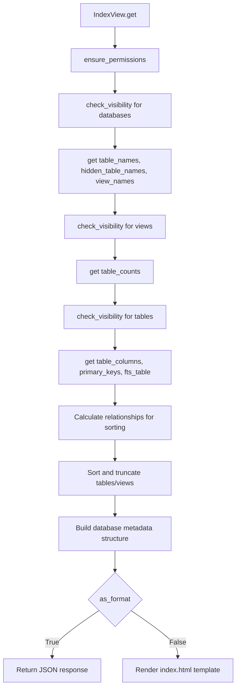

# `index.py`

## `datasette.views.index.IndexView` · *class*

## Summary:
IndexView is a Datasette web view responsible for rendering the main index page that displays database information, including tables, views, and their metadata.

## Description:
The IndexView handles HTTP GET requests to the index endpoint and generates either an HTML page or JSON response showing all accessible databases, their tables, views, and metadata. It implements dataset visibility controls, permission checks, and sorting logic for database resources. The view acts as the primary entry point for users to browse available datasets in the Datasette instance.

## State:
- ds (Datasette): The Datasette instance containing databases and configuration
- name (str): Class attribute set to "index" indicating the view's name
- TRUNCATE_AT (int): Constant controlling maximum number of tables/views shown per database (typically 100)
- COUNT_DB_SIZE_LIMIT (int): Constant determining when to skip table counting for performance (typically 1000000)

## Lifecycle:
- Creation: Instantiated automatically by Datasette's routing system when handling index requests
- Usage: Called via HTTP GET requests to the index endpoint, typically handled by Datasette's ASGI middleware
- Destruction: No explicit cleanup required; managed by Python garbage collection

## Method Map:


## Raises:
- Any exceptions that may occur during database operations, permission checks, or template rendering
- PermissionDenied exceptions when user lacks required permissions
- Database connection errors during table metadata retrieval

## Example:
```python
# Typical usage would be triggered by visiting the Datasette index URL
# GET / (for HTML view) or GET /?_format=json (for JSON view)

# The view would:
# 1. Check if user has view-instance permission
# 2. Iterate through all databases
# 3. Filter databases based on visibility permissions
# 4. For each database, gather table/view information
# 5. Apply visibility filters and sort tables/views
# 6. Render either HTML template or JSON response
```

### `datasette.views.index.IndexView.get` · *method*

## Summary:
Handles HTTP GET requests to render the Datasette index page or return database metadata in JSON format, applying visibility filtering and sorting.

## Description:
This method serves as the primary entry point for the index view, determining whether to render an HTML index page or return JSON-formatted database metadata based on the request format. It performs permission checks, gathers database and table information, applies visibility filters, and sorts tables/views for display. The method orchestrates complex data gathering and processing logic to prepare the appropriate response for the client. When rendering HTML, it uses the index.html template with database metadata. When returning JSON, it provides structured database information in a format suitable for programmatic consumption.

## Args:
    request (Request): ASGI request object containing URL variables and query parameters, with format parameter indicating desired response type

## Returns:
    Response: Either an HTML response rendering index.html with database context or a JSON response with database metadata structured by database name

## Raises:
    None explicitly raised, but may propagate exceptions from underlying async operations such as database queries or permission checks

## State Changes:
    Attributes READ: self.ds, self.ds.databases, self.ds.urls, self.ds.cors, self.ds.metadata(), self.ds.permission_allowed(), self.ds.ensure_permissions(), self.ds.check_visibility(), self.ds.get_all_foreign_keys()
    Attributes WRITTEN: None

## Constraints:
    Preconditions: 
    - Request must contain valid actor for permission checking
    - Database instance must be properly initialized
    - URL variables must contain format parameter
    - Database size must be considered for table counting limits (COUNT_DB_SIZE_LIMIT)
    Postconditions:
    - All returned data respects visibility permissions for databases and tables
    - Data is properly sorted and truncated according to TRUNCATE_AT limit
    - Response format matches requested format (HTML or JSON)
    - Table counts are only calculated for databases that meet size criteria

## Side Effects:
    - Performs asynchronous database queries for table names, counts, columns, and foreign keys
    - Makes permission checks against the datasette instance
    - May make CORS header additions if enabled
    - Renders HTML template or serializes JSON data for response
    - Applies sorting logic based on relationship counts or row counts
    - Truncates results to TRUNCATE_AT limit for display purposes

