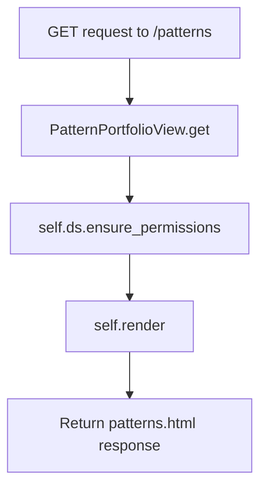
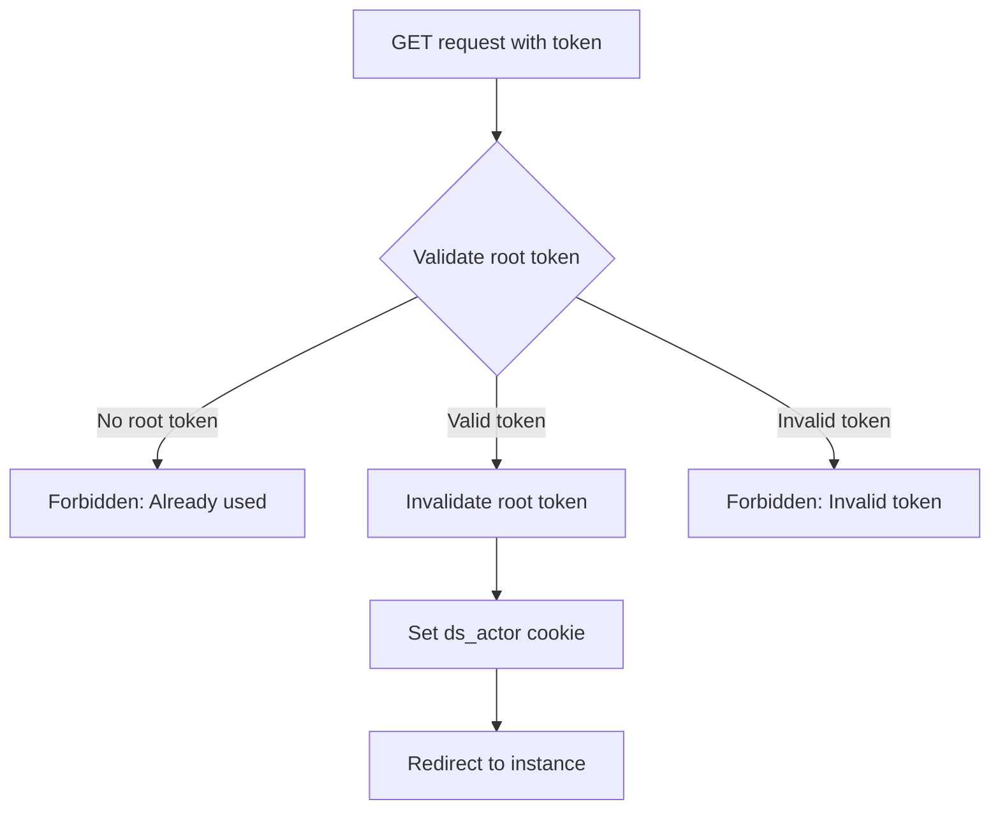
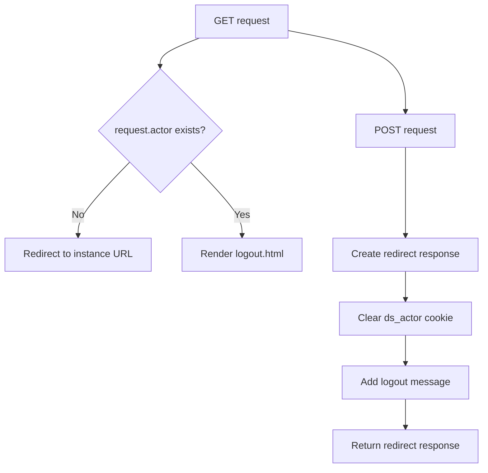

# `special.py`

## `datasette.views.special.JsonDataView` · *class*

## Summary:
A view class that serves JSON data either as a raw JSON response or rendered in an HTML template, depending on the request format.

## Description:
The JsonDataView class is designed to serve structured JSON data through Datasette's web interface. It provides flexibility in how the data is delivered—either as a direct JSON response for API consumption or as an HTML-rendered page for human readability. The class is initialized with a callback function that generates the data to be served, allowing for dynamic data generation based on various conditions.

This class enforces permission checks before serving data and supports CORS headers when enabled. It inherits from BaseView, which provides common ASGI view functionality.

## State:
- ds (Datasette): Reference to the Datasette instance for permission checking and CORS configuration
- filename (str): Name of the file associated with this JSON data, used in HTML rendering context
- data_callback (callable): Function that returns the JSON data to be served; can accept an optional request parameter
- needs_request (bool): Flag indicating whether the data_callback requires a request parameter; defaults to False

## Lifecycle:
- Creation: Instantiate with datasette instance, filename, data_callback, and optional needs_request flag
- Usage: Call the async get() method with a request object to handle the HTTP GET request
- Destruction: No explicit cleanup required; relies on Python garbage collection

## Method Map:
```mermaid
flowchart TD
    A[JsonDataView.get] --> B[Ensure permissions]
    B --> C[Check needs_request flag]
    C --> D{needs_request?}
    D -->|Yes| E[Call data_callback(request)]
    D -->|No| F[Call data_callback()]
    E --> G[Process format parameter]
    F --> G
    G --> H{as_format?}
    H -->|Yes| I[Return JSON response]
    H -->|No| J[Render HTML template]
```

## Raises:
- Forbidden: Raised when the requesting actor does not have the required "view-instance" permission

## Example:
```python
# Define a data callback function
def my_data_callback():
    return {"message": "Hello World", "count": 42}

# Create the view instance
view = JsonDataView(datasette_instance, "example.json", my_data_callback)

# Handle a GET request (in an async context)
response = await view.get(request_object)
```

### `datasette.views.special.JsonDataView.__init__` · *method*

## Summary:
Initializes a JsonDataView instance with datasette reference, filename, data callback, and request requirement flag.

## Description:
The __init__ method sets up the JsonDataView object by storing references to the Datasette instance, filename, data callback function, and a flag indicating whether the callback requires a request parameter. This initialization prepares the view for handling HTTP GET requests through its get() method.

## Args:
    datasette (Datasette): Reference to the Datasette instance for permission checking and configuration
    filename (str): Name of the file associated with this JSON data, used in HTML rendering context
    data_callback (callable): Function that returns the JSON data to be served; can accept an optional request parameter
    needs_request (bool): Flag indicating whether the data_callback requires a request parameter; defaults to False

## Returns:
    None: This method initializes instance attributes and does not return a value

## Raises:
    None: This method does not raise exceptions during initialization

## State Changes:
    Attributes READ: No self attributes are read during initialization
    Attributes WRITTEN: 
    - self.ds: Stores the Datasette instance reference
    - self.filename: Stores the filename string
    - self.data_callback: Stores the data callback function
    - self.needs_request: Stores the boolean flag

## Constraints:
    Preconditions:
    - datasette must be a valid Datasette instance
    - filename must be a string
    - data_callback must be callable
    - needs_request must be a boolean value
    
    Postconditions:
    - All instance attributes are properly set
    - The view is ready for use in the get() method

## Side Effects:
    None: This method performs no I/O operations or external service calls

### `datasette.views.special.JsonDataView.get` · *method*

## Summary:
Returns JSON-formatted data either as an HTTP response or renders it in an HTML template based on the requested format.

## Description:
This asynchronous method handles GET requests for JSON data views, supporting both JSON response output and HTML rendering. It validates permissions, retrieves data via a callback mechanism, and formats the response according to the requested format. When a format is specified in the URL, it returns a JSON response; otherwise, it renders the data in an HTML template for display.

## Args:
    request (Request): ASGI request object containing URL variables and actor information. Must have a "format" URL variable.

## Returns:
    Response or Awaitable[Response]: 
    - If as_format is truthy: A Response object containing JSON data with proper content-type headers
    - If as_format is falsy: An awaitable Response object that renders HTML with formatted JSON data

## Raises:
    None explicitly raised, but may propagate exceptions from:
    - self.data_callback() or self.data_callback(request) 
    - self.render()
    - self.ds.ensure_permissions()
    - json.dumps() when data contains non-serializable objects

## State Changes:
    Attributes READ:
        - self.needs_request
        - self.data_callback
        - self.filename
        - self.ds.cors
    Attributes WRITTEN: None

## Constraints:
    Preconditions:
        - The request must contain a "format" URL variable in url_vars
        - The user must have "view-instance" permission (validated via ensure_permissions)
        - The data_callback method must be properly implemented and return serializable data
        - The view must have a filename attribute set
    
    Postconditions:
        - If as_format is True, returns a JSON response with Content-Type: application/json; charset=utf-8
        - If as_format is False, returns an HTML response with formatted JSON data in context

## Side Effects:
    - Makes asynchronous call to self.ds.ensure_permissions() to validate user permissions
    - Calls self.data_callback() which may perform I/O operations or other processing
    - May make asynchronous call to self.render() to generate HTML response
    - Modifies headers dictionary in-place when CORS is enabled via add_cors_headers()
    - Uses json.dumps() to serialize data to JSON string format

## `datasette.views.special.PatternPortfolioView` · *class*

## Summary:
A view class that handles requests for the pattern portfolio page, rendering a dedicated HTML template for displaying design patterns.

## Description:
This class implements a specialized view for serving the pattern portfolio interface. It processes GET requests for the pattern portfolio view by validating permissions and rendering the patterns template. The view ensures proper authorization before rendering the patterns.html template, making it suitable for displaying design patterns or UI components within the Datasette application.

## State:
- name: str = "patterns" - The URL endpoint name associated with this view
- has_json_alternate: bool = False - Indicates this view does not support JSON output format

## Lifecycle:
- Creation: Instantiated automatically by the routing system when a request matches the "patterns" endpoint
- Usage: Called via HTTP GET requests to the patterns endpoint; the get() method handles the request processing
- Destruction: No explicit cleanup required; relies on parent class lifecycle management

## Method Map:


## Raises:
- Forbidden: Raised by ensure_permissions when the requesting actor lacks the "view-instance" permission

## Example:
```python
# This view would be accessed via HTTP GET to /patterns
# The view ensures the user has "view-instance" permission
# Then renders the patterns.html template
```

### `datasette.views.special.PatternPortfolioView.get` · *method*

## Summary:
Processes GET requests for the pattern portfolio view by validating permissions and rendering the patterns template.

## Description:
This async method handles HTTP GET requests for the pattern portfolio endpoint. It validates that the requesting actor has the "view-instance" permission and then renders the patterns.html template with the provided request context.

## Args:
    request: ASGI request object containing client request data

## Returns:
    Response object containing rendered HTML content from patterns.html template

## Raises:
    Forbidden: When the requesting actor lacks the "view-instance" permission

## State Changes:
    Attributes READ: self.ds (datasette instance)
    Attributes WRITTEN: None

## Constraints:
    Preconditions: 
    - The datasette instance (self.ds) must be initialized and available
    - The request object must contain a valid actor attribute
    - The "view-instance" permission must be defined in the system
    
    Postconditions:
    - Returns a Response object with properly rendered HTML content
    - Template rendering uses patterns.html template file

## Side Effects:
    - Asynchronously calls self.ds.ensure_permissions() to validate permissions
    - Asynchronously calls self.render() to generate HTML response

## `datasette.views.special.AuthTokenView` · *class*

## Summary:
Authenticates users via a root token and sets an authentication cookie upon successful validation.

## Description:
This view handles authentication requests using a root token. It validates the provided token against the stored root token, and if valid, invalidates the root token and sets an authentication cookie to establish user session. This class serves as a security mechanism for initial access to the Datasette instance.

## State:
- `name` (str): Class attribute set to "auth_token" indicating the view's identifier.
- `has_json_alternate` (bool): Class attribute set to False, indicating no JSON response alternative.
- `ds` (Datasette instance): Reference to the Datasette application instance, which contains the `_root_token` attribute.
- `_root_token` (str or None): Instance attribute from `self.ds` representing the root token. When None, indicates the token has already been used.

## Lifecycle:
- Creation: Instantiated automatically by the framework when handling requests to the auth_token endpoint.
- Usage: Called via HTTP GET requests containing a "token" parameter. The `get` method processes the request and performs authentication.
- Destruction: No explicit cleanup required; managed by the web framework lifecycle.

## Method Map:


## Raises:
- `Forbidden`: Raised when the root token has already been used or when the provided token is invalid.

## Example:
```python
# User accesses URL: /auth_token?token=abc123
# If token matches root token:
#   - Root token is invalidated
#   - Sets ds_actor cookie with root actor
#   - Redirects to main instance page
# If token doesn't match:
#   - Raises Forbidden with "Invalid token" message
```

### `datasette.views.special.AuthTokenView.get` · *method*

## Summary:
Validates a root authentication token and establishes a session for root access to the Datasette instance.

## Description:
This asynchronous method handles the authentication flow for root users by validating a provided token against the stored root token. When a valid token is presented, it invalidates the token (ensuring single-use) and redirects the user to the main instance page while setting an authentication cookie. This method is typically invoked as part of the ASGI request handling cycle when users attempt to authenticate with a root token.

## Args:
    request: ASGI request object containing query parameters including the authentication token

## Returns:
    Response: An HTTP redirect response to the instance page with authentication cookie set upon successful validation

## Raises:
    Forbidden: When the root token has already been used or when an invalid token is provided

## State Changes:
    Attributes READ: self.ds._root_token, self.ds.urls.instance(), self.ds.sign()
    Attributes WRITTEN: self.ds._root_token (set to None after successful validation)

## Constraints:
    Preconditions:
        - The request must contain a "token" query parameter
        - The Datasette instance must have a root token configured (self.ds._root_token must not be None)
        - The token must be a valid string matching the expected root token
    
    Postconditions:
        - If successful, the root token is invalidated (set to None)
        - If successful, the user is redirected to the main instance page
        - If successful, an authentication cookie is set for subsequent requests

## Side Effects:
    - Sets an HTTP cookie named "ds_actor" in the response
    - Performs an HTTP redirect to the instance URL
    - Uses cryptographic comparison to prevent timing attacks

## `datasette.views.special.LogoutView` · *class*

## Summary:
LogoutView handles user logout functionality by processing GET and POST requests to invalidate session cookies and redirect users.

## Description:
The LogoutView class implements the logout functionality for the Datasette application. It provides two HTTP method handlers: GET to display a logout confirmation page or redirect unauthenticated users, and POST to process the actual logout by clearing the authentication cookie and redirecting the user. This view is part of the special views module and integrates with Datasette's authentication system.

## State:
- name (str): Class attribute set to "logout", identifying this view in the routing system
- has_json_alternate (bool): Class attribute set to False, indicating this view doesn't support JSON responses
- ds (Datasette instance): Instance attribute inherited from BaseView, providing access to the Datasette application context
- request (Request instance): Parameter in method calls, representing the incoming HTTP request

## Lifecycle:
- Creation: Instantiated automatically by the routing system when a logout request is made
- Usage: Called via HTTP GET or POST requests to the logout endpoint
  - GET requests: Redirect unauthenticated users to the instance URL, render logout template for authenticated users
  - POST requests: Clear authentication cookie and redirect to instance URL
- Destruction: No explicit cleanup required; managed by the web framework lifecycle

## Method Map:


## Raises:
- None explicitly raised by the class methods
- Exception handling delegated to the underlying framework for invalid requests

## Example:
```python
# GET request when user is authenticated
# Results in rendering logout.html template with actor data

# GET request when user is not authenticated  
# Results in redirect to main instance URL

# POST request
# Results in clearing ds_actor cookie and redirecting to instance URL
```

### `datasette.views.special.LogoutView.get` · *method*

## Summary:
Handles GET requests for the logout view by redirecting unauthenticated users or rendering the logout template for authenticated users.

## Description:
This method processes HTTP GET requests to the logout endpoint. It checks if the user is authenticated via the request.actor attribute. If not authenticated, it redirects to the instance root URL. If authenticated, it renders the logout HTML template with the current actor information.

## Args:
    request (Request): ASGI request object containing the HTTP request data and authentication context

## Returns:
    Response: Redirect response to instance root if not authenticated, or rendered HTML response if authenticated

## Raises:
    None explicitly raised

## State Changes:
    Attributes READ: 
        - self.ds.urls.instance()
        - request.actor
    Attributes WRITTEN: 
        - None

## Constraints:
    Preconditions:
        - The request object must have an actor attribute
        - The self.ds.urls instance must be properly initialized
    Postconditions:
        - Returns either a redirect response or a rendered HTML response
        - The response contains the actor information in the template context when authenticated

## Side Effects:
    - Performs a redirect I/O operation when user is not authenticated
    - Renders an HTML template with actor data when user is authenticated

### `datasette.views.special.LogoutView.post` · *method*

## Summary:
Handles user logout by redirecting to the instance page and clearing the authentication cookie.

## Description:
This method processes POST requests for logging out users. It creates a redirect response to the instance page and clears the authentication cookie by setting it with an expiration date in the past. The method uses the Response.redirect() factory method to generate the redirect and Response.set_cookie() to remove the authentication token.

## Args:
    request: ASGI request object containing the logout request details

## Returns:
    Response object configured as an HTTP 302 redirect with cleared authentication cookie

## Raises:
    None explicitly raised

## State Changes:
    Attributes READ: self.ds, self.ds.urls, self.ds.WARNING
    Attributes WRITTEN: None

## Constraints:
    Preconditions: Must be called as part of a POST request handling flow
    Postconditions: Authentication cookie is cleared and user is redirected to instance page

## Side Effects:
    I/O: Sets a cookie on the response object via set_cookie() method by adding a Set-Cookie header
    External service calls: None
    Mutations to objects outside self: Modifies response headers to include Set-Cookie header for clearing the authentication cookie

## `datasette.views.special.PermissionsDebugView` · *class*

## Summary:
A special view for debugging permission checks in Datasette, providing visibility into the permission evaluation process.

## Description:
The PermissionsDebugView class is a specialized web view designed to expose internal permission checking information for debugging purposes. It provides administrators and developers with insights into how Datasette evaluates permissions for various actions, helping diagnose authorization issues and understand the permission system's behavior.

This view requires specific permissions to access and renders a template showing the most recent permission checks performed by the system. It's part of Datasette's diagnostic tools and should only be enabled in development or trusted environments due to the sensitive information it exposes.

## State:
- name: str - Class attribute identifying this view as "permissions_debug"
- has_json_alternate: bool - Class attribute indicating this view does not support JSON output
- ds: Datasette instance - Reference to the Datasette application instance (inherited from BaseView)
- request: ASGI request object - HTTP request being processed (inherited from BaseView)

## Lifecycle:
- Creation: Instantiated automatically by Datasette's routing system when a request matches the permissions_debug endpoint
- Usage: Called via HTTP GET requests to the permissions_debug endpoint
- Destruction: Managed by the ASGI framework lifecycle; no explicit cleanup required

## Method Map:
```mermaid
flowchart TD
    A[GET request] --> B[ensure_permissions]
    B --> C{actor has "view-instance"?}
    C -->|No| D[Forbidden Exception]
    C -->|Yes| E[permission_allowed]
    E --> F{actor has "permissions-debug"?}
    F -->|No| G[Forbidden Exception]
    F -->|Yes| H[render template]
    H --> I[Return Response]
```

## Raises:
- Forbidden: Raised when the requesting actor lacks either "view-instance" permission or "permissions-debug" permission
- Any exceptions potentially raised by the underlying permission checking or rendering mechanisms

## Example:
```python
# Accessing the debug view requires proper permissions
# GET /-/permissions-debug

# This would show recent permission checks in the rendered template
# Only accessible to users with both "view-instance" and "permissions-debug" permissions
```

### `datasette.views.special.PermissionsDebugView.get` · *method*

## Summary:
Retrieves and displays debugging information about permission checks for the current request actor.

## Description:
This asynchronous method serves as the GET handler for the permissions debug view, which provides detailed information about permission evaluations performed during the current request lifecycle. It ensures the requesting actor has instance viewing permissions, verifies access to the debug interface, and renders a template displaying the permission check history.

The method acts as a diagnostic tool for administrators to understand how permission decisions are made within the Datasette application. It's typically invoked during the HTTP request handling phase when a user accesses the permissions debug endpoint.

## Args:
    request (Request): ASGI request object containing the HTTP request details and actor information

## Returns:
    Response: ASGI response object rendering the permissions_debug.html template with permission check data

## Raises:
    Forbidden: When the requesting actor lacks the "permissions-debug" permission

## State Changes:
    Attributes READ:
        - self.ds._permission_checks: Internal list tracking permission evaluation history
    Attributes WRITTEN: None

## Constraints:
    Preconditions:
        - The Datasette instance (self.ds) must be properly initialized
        - The request object must contain a valid actor attribute
        - The requesting actor must have "view-instance" permission (verified via async call)
        - The requesting actor must have "permissions-debug" permission (verified via async call)

    Postconditions:
        - The response will contain rendered HTML with permission check history
        - The _permission_checks list is reversed before display to show most recent first

## Side Effects:
    - Performs async permission validation checks against the Datasette instance
    - Renders an HTML template with permission debugging information
    - May involve database queries during permission evaluation

## `datasette.views.special.AllowDebugView` · *class*

## Summary:
A debug view for testing actor authorization policies by evaluating JSON-formatted actor and allow configurations against the datasette.utils.actor_matches_allow function.

## Description:
The AllowDebugView class provides a web interface for debugging authorization policies within Datasette. It accepts actor and allow parameters via URL query strings, validates them as JSON, and determines whether the actor matches the allow policy using the actor_matches_allow utility function. This view serves as a diagnostic tool for developers to test and understand authorization logic without requiring a full application context.

The view inherits from BaseView and implements the standard async get() method pattern used by Datasette views. It is primarily intended for development and testing purposes to help developers understand and troubleshoot authorization scenarios.

## State:
- name (str): Class attribute set to "allow_debug", identifying this view in the routing system
- has_json_alternate (bool): Class attribute set to False, indicating this view doesn't support JSON responses
- No instance attributes beyond those inherited from BaseView

## Lifecycle:
- Creation: Instantiated automatically by the Datasette framework when handling requests to the /allow-debug endpoint
- Usage: Handles HTTP GET requests to /allow-debug with optional query parameters:
  - actor: JSON string representing the actor (defaults to '{"id": "root"}' if not provided)
  - allow: JSON string representing the authorization policy (defaults to '{"id": "*"}' if not provided)
- Destruction: Managed by the framework's view lifecycle; no explicit cleanup required

## Method Map:
```mermaid
flowchart TD
    A[GET request to /allow-debug] --> B[Extract actor parameter from request.args]
    B --> C{actor parameter provided?}
    C -- No --> D[Use default '{"id": "root"}']
    C -- Yes --> E[Use provided actor parameter]
    E --> F[Try to parse actor as JSON]
    F --> G{JSON parsing successful?}
    G -- No --> H[Collect error message]
    G -- Yes --> I[Format actor JSON with indentation]
    I --> J[Extract allow parameter from request.args]
    J --> K{allow parameter provided?}
    K -- No --> L[Use default '{"id": "*"}']
    K -- Yes --> M[Use provided allow parameter]
    M --> N[Try to parse allow as JSON]
    N --> O{JSON parsing successful?}
    O -- No --> P[Collect error message]
    O -- Yes --> Q[Format allow JSON with indentation]
    Q --> R{Any parsing errors?}
    R -- Yes --> S[Skip actor_matches_allow evaluation]
    R -- No --> T[Call actor_matches_allow(actor, allow)]
    S --> U[Prepare response data]
    T --> U[Prepare response data]
    U --> V[Render allow_debug.html template]
```

## Raises:
- No explicit exceptions raised by the class itself
- JSON parsing exceptions are caught and converted to error messages displayed in the UI
- Framework-level exceptions may occur during request processing or rendering

## Example:
```python
# Example request URL:
# /allow-debug?actor={"id":"user123","role":"admin"}&allow={"role":"admin"}

# This would render a page showing:
# - The parsed actor input formatted as indented JSON
# - The parsed allow input formatted as indented JSON  
# - Result: "True" (since admin user matches admin allow policy)

# Another example:
# /allow-debug?actor={"id":"guest"}&allow={"unauthenticated":true}

# This would render a page showing:
# - The parsed actor input formatted as indented JSON
# - The parsed allow input formatted as indented JSON
# - Result: "True" (since guest user matches unauthenticated allow policy)
```

### `datasette.views.special.AllowDebugView.get` · *method*

## Summary:
Processes actor and allow policy inputs to determine authorization matching results for debugging purposes.

## Description:
This method handles HTTP GET requests to the allow debug endpoint, parsing JSON inputs for actor and allow policies, validating their structure, and determining if the actor matches the allow policy using the `actor_matches_allow` utility function. It renders an HTML template showing the results and any parsing errors.

The method serves as a debugging interface for testing authorization policies by allowing users to submit actor and allow configurations via URL query parameters and see the resulting boolean match outcome. When valid JSON is provided for both parameters, it calls `actor_matches_allow(actor, allow)` which returns a boolean indicating whether the actor satisfies the allow policy.

## Args:
    request (Request): ASGI request object containing query parameters "actor" and "allow"
        - actor (str, optional): JSON string representing actor attributes, defaults to '{"id": "root"}'
        - allow (str, optional): JSON string representing allow policy configuration, defaults to '{"id": "*"}'

## Returns:
    Response: ASGI response rendering the allow_debug.html template with processing results including:
        - result: String representation of boolean match result (True/False) or None if errors occurred
        - error: Concatenated error messages if JSON parsing failed
        - actor_input: Formatted JSON string of parsed actor
        - allow_input: Formatted JSON string of parsed allow policy

## Raises:
    None explicitly raised

## State Changes:
    Attributes READ: None
    Attributes WRITTEN: None

## Constraints:
    Preconditions:
        - Request object must be valid ASGI request
        - Query parameters "actor" and "allow" may be present but are optional
        - Actor and allow parameters must be valid JSON when provided
    Postconditions:
        - Returns properly formatted ASGI response
        - Template rendering handles all provided data appropriately
        - Default values are applied when parameters are missing

## Side Effects:
    I/O: Reads request query parameters
    Template rendering: Generates HTML response using allow_debug.html template
    JSON parsing: Processes actor and allow input strings into Python objects

## `datasette.views.special.MessagesDebugView` · *class*

## Summary:
A debug view for managing and displaying messages within the Datasette application, allowing administrators to add various types of messages via HTTP POST requests.

## Description:
The MessagesDebugView class provides a special endpoint for debugging purposes that enables users with appropriate permissions to add informational, warning, or error messages to the Datasette instance. It serves as a GET endpoint to validate permissions and render the messages debug interface, and as a POST endpoint to process submitted messages and redirect back to the main instance page.

This class exists as a distinct abstraction to encapsulate the functionality of message management specifically for debugging purposes, providing a controlled interface for adding messages to the application state while enforcing permission checks.

## State:
- name: str - Class attribute identifying this view as "messages_debug"
- has_json_alternate: bool - Class attribute indicating this view does not support JSON alternate representation
- ds: Datasette instance - Reference to the Datasette application instance (inherited from BaseView)

## Lifecycle:
- Creation: Instantiated automatically by Datasette's routing mechanism; requires no explicit instantiation
- Usage: 
  1. GET requests validate instance view permissions and render the messages debug interface
  2. POST requests process form submissions and add messages to the Datasette instance
- Destruction: Managed by Datasette's lifecycle; no explicit cleanup required

## Method Map:
```mermaid
graph TD
    A[GET request] --> B[ensure_permissions]
    B --> C[render messages_debug.html]
    A --> D[POST request]
    D --> E[ensure_permissions]
    E --> F[post_vars]
    F --> G[assert message_type validation]
    G --> H{message_type == "all"?}
    H -->|Yes| I[add_message x3]
    H -->|No| J[add_message with specific type]
    J --> K[Response.redirect to instance URL]
    I --> K
```

## Raises:
- Forbidden: Raised by ensure_permissions when the requesting actor lacks the "view-instance" permission
- AssertionError: Raised during POST processing if message_type is not one of ("INFO", "WARNING", "ERROR", "all")

## Example:
```python
# GET request to /-/messages-debug validates permissions and renders the message form
# POST request with form data:
#   message="Test message"
#   message_type="WARNING"
# Results in adding a WARNING message to the Datasette instance
# and redirecting to the main instance page
```

### `datasette.views.special.MessagesDebugView.get` · *method*

## Summary:
Validates instance view permissions and renders the messages debug interface.

## Description:
This asynchronous method handles GET requests to the messages debug endpoint. It performs permission validation for the "view-instance" capability using the datasette server's permission system, then renders the messages_debug.html template with the request context. This method is part of the MessagesDebugView class and is invoked during the HTTP request processing pipeline when users access the debug messages interface.

## Args:
    request: ASGI request object containing client request information including actor details

## Returns:
    Response: ASGI Response object containing the rendered messages_debug.html template

## Raises:
    Forbidden: When the requesting actor does not possess the "view-instance" permission

## State Changes:
    Attributes READ: self.ds (datasette server instance reference)
    Attributes WRITTEN: None

## Constraints:
    Preconditions: 
    - The instance must have a valid datasette server reference (self.ds)
    - The request must contain a valid actor attribute
    - The actor must have the "view-instance" permission to access this endpoint
    
    Postconditions:
    - The response contains properly formatted HTML for debug messages
    - Permission validation occurs before template rendering

## Side Effects:
    I/O: Asynchronous permission validation via self.ds.ensure_permissions()
    I/O: Template rendering via self.render() method returning an ASGI Response

### `datasette.views.special.MessagesDebugView.post` · *method*

## Summary:
Handles POST requests to add debug messages to the Datasette instance with specified severity levels.

## Description:
This method processes form data submitted via a POST request to add messages to the Datasette instance's message queue. It validates permissions, extracts message content and type from the request, and dispatches the message(s) to the appropriate logging mechanism based on the specified type. The method supports adding messages with INFO, WARNING, ERROR, or ALL severity levels. It redirects the user back to the instance page after processing.

## Args:
    request: ASGI request object containing form data and actor information

## Returns:
    Response object redirecting back to the instance URL

## Raises:
    AssertionError: When message_type is not one of ("INFO", "WARNING", "ERROR", "all")

## State Changes:
    Attributes READ: self.ds
    Attributes WRITTEN: None directly modified; messages added to datasette's internal message store

## Constraints:
    Preconditions: 
    - User must have "view-instance" permission
    - message_type must be one of ("INFO", "WARNING", "ERROR", "all")
    Postconditions:
    - Message(s) are added to the datasette instance's message queue
    - User is redirected to the instance page

## Side Effects:
    - Performs permission check via self.ds.ensure_permissions
    - Reads POST form variables from request
    - Adds messages to datasette's internal message storage
    - Redirects user to instance URL via Response.redirect

