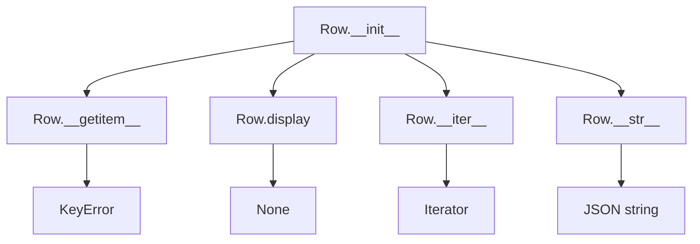
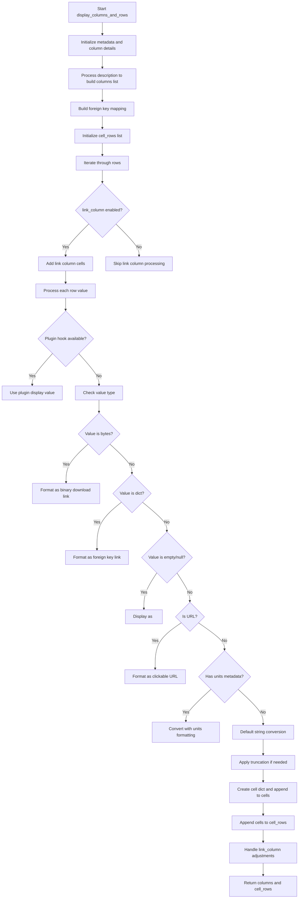

# `table.py`

## `datasette.views.table.Row` · *class*

## Summary:
Represents a single row of data from a database table with access to raw and formatted values.

## Description:
The Row class provides a structured interface for accessing data from a database row. It encapsulates a collection of cells, each containing column metadata and both raw and formatted values. This abstraction allows for easy access to row data using either the raw database values or their formatted representations for display purposes.

## State:
- cells: list of dictionaries, each representing a column with keys "column", "raw", and "value"
  - column (str): Name of the database column
  - raw (any): Raw value from the database
  - value (any): Formatted value for display purposes
- The cells list is initialized with the constructor argument and should contain at least one cell

## Lifecycle:
- Creation: Instantiate with a list of cell dictionaries containing column, raw, and value data
- Usage: Access raw values via __getitem__ or formatted values via display() method
- Destruction: No special cleanup required; uses standard Python garbage collection

## Method Map:


## Raises:
- KeyError: Raised by __getitem__ when a requested column key is not found in the cells

## Example:
```python
# Create a row with sample data
cells = [
    {"column": "id", "raw": 1, "value": "1"},
    {"column": "name", "raw": "Alice", "value": "Alice"},
    {"column": "age", "raw": 30, "value": "30"}
]
row = Row(cells)

# Access raw value
raw_id = row["id"]  # Returns 1

# Access formatted value
display_name = row.display("name")  # Returns "Alice"

# Iterate over cells
for cell in row:
    print(cell["column"])

# Convert to JSON string
json_str = str(row)  # Returns formatted JSON of all non-special columns
```

### `datasette.views.table.Row.__init__` · *method*

## Summary:
Initializes a Row object with a collection of cell data representing a database row.

## Description:
The Row class represents a single row from a database table, storing cell data in a structured format. This constructor accepts a list of cell dictionaries and stores them as an instance attribute. The cells are typically generated by database query results and contain column names, raw values, and formatted values.

## Args:
    cells (list[dict]): A list of cell dictionaries, each containing at least "column" and "raw" keys. Each dictionary represents a single cell in the row with metadata about the column and its value.

## Returns:
    None: This method initializes the object's state but does not return a value.

## Raises:
    None: This method does not explicitly raise exceptions.

## State Changes:
    Attributes READ: None
    Attributes WRITTEN: self.cells

## Constraints:
    Preconditions: The cells parameter must be a list of dictionaries, where each dictionary contains at least a "column" key mapping to a string column name.
    Postconditions: The self.cells attribute will contain exactly the list of cells passed in as the argument.

## Side Effects:
    None: This method performs no I/O operations or external service calls.

### `datasette.views.table.Row.__iter__` · *method*

## Summary:
Returns an iterator over the row's cell data, enabling iteration through the row's columns and values.

## Description:
This method provides iterable access to the row's internal cell data structure, allowing consumers to traverse each column-value pair in the row. It is implemented as a standard Python `__iter__` method that delegates to the internal `cells` attribute.

The method is typically called during template rendering or data processing when iterating over rows in a table view. It enables constructs like `for cell in row:` in the consuming code.

This logic is encapsulated in its own method because it follows Python's iterator protocol, providing a clean interface for iteration while maintaining the internal representation of row data as a list of cell dictionaries.

## Args:
    None

## Returns:
    iterator: An iterator over the row's cell data, where each item is a dictionary containing column metadata and value information.

## Raises:
    None

## State Changes:
    Attributes READ: self.cells
    Attributes WRITTEN: None

## Constraints:
    Preconditions: The `self.cells` attribute must be initialized and contain a valid iterable structure (typically a list of dictionaries).
    Postconditions: The returned iterator will yield the same sequence of cell dictionaries as contained in `self.cells`.

## Side Effects:
    None

### `datasette.views.table.Row.__getitem__` · *method*

## Summary:
Retrieves the raw value associated with a given column name from the row's cells collection.

## Description:
This method implements Python's special `__getitem__` protocol to enable dictionary-style access to row data using column names as keys. It searches through the row's internal `cells` collection to find a matching column and returns its raw value. This design allows for intuitive data access patterns while maintaining consistency with Python's built-in sequence and mapping protocols.

The method is typically called when accessing row data using bracket notation like `row['column_name']`. This approach provides a clean interface for retrieving individual column values from database rows.

## Args:
    key (str): The column name to search for within the row's cells

## Returns:
    The raw value stored in the matching cell's "raw" field

## Raises:
    KeyError: When no cell exists with a column name matching the provided key

## State Changes:
    Attributes READ: self.cells
    Attributes WRITTEN: None

## Constraints:
    Preconditions: The instance must have a populated `cells` attribute containing dictionaries with "column" and "raw" keys
    Postconditions: The method returns the raw value from the matching cell or raises KeyError

## Side Effects:
    None

### `datasette.views.table.Row.display` · *method*

## Summary:
Returns the formatted display value for a specific column from the row's cells collection.

## Description:
This method retrieves the formatted display value associated with a given column key from the row's internal cells data structure. It is designed to provide convenient access to individual column values within a row representation, typically used for rendering table data in web views. Unlike the `__getitem__` method which returns the raw value, this method specifically accesses the "value" field of the cell data structure.

## Args:
    key (str): The column name to look up within the row's cells

## Returns:
    Any: The formatted display value associated with the specified column key, or None if the key is not found

## Raises:
    None explicitly raised

## State Changes:
    Attributes READ: self.cells
    Attributes WRITTEN: None

## Constraints:
    Preconditions: The row must have a populated cells attribute containing column-value mappings where each cell is a dictionary with "column" and "value" keys
    Postconditions: The method returns either the matching cell's display value or None without modifying the object state

## Side Effects:
    None

### `datasette.views.table.Row.__str__` · *method*

## Summary:
Converts a Row object into a formatted JSON string representation, excluding special link columns.

## Description:
This method provides a string representation of a Row object by serializing its non-special-link columns into a JSON-formatted string with indentation. It's designed to be called during string conversion operations (like `str(row)`), allowing for clean, readable output of row data while filtering out special link columns that may contain non-data values.

The Row class represents a single database row and typically contains metadata about cells along with the actual data values. This method specifically excludes cells marked as special link columns to avoid including navigation or action links in the JSON output.

## Args:
    None

## Returns:
    str: A JSON-formatted string representation of the row's data columns, with indentation for readability. Special link columns are excluded from the output.

## Raises:
    TypeError: If any of the row's column values cannot be serialized to JSON.

## State Changes:
    Attributes READ: 
    - self.cells: The list of cell dictionaries containing column information and data
    - self[key]: Accesses individual column values by key

## Constraints:
    Preconditions:
    - The Row object must have a `cells` attribute containing a list of cell dictionaries
    - Each cell dictionary in `self.cells` must have a "column" key
    - The Row object must support item access via `self[key]` for retrieving column values

    Postconditions:
    - The returned string is a valid JSON representation of the row's data columns
    - Special link columns (identified by `c.get("is_special_link_column")`) are excluded from the result

## Side Effects:
    None

## `datasette.views.table.TableView` · *class*

## Summary:
TableView is a data view class that renders database tables and views in Datasette, handling queries, filtering, sorting, pagination, and display formatting.

## Description:
TableView extends DataView to provide functionality for displaying database tables and views through HTTP requests. It processes query parameters for filtering, sorting, and pagination, executes SQL queries against the database, and formats results for web presentation. The class handles both regular tables and views, supports foreign key expansion, faceted browsing, and various display options like column selection and labeling. It implements both GET and POST request handlers, with POST specifically supporting canned queries.

## State:
- name (str): Class identifier set to "table"
- Inherits all state from DataView parent class

## Lifecycle:
- Creation: Instantiated automatically by Datasette's routing system when handling table/view requests
- Usage: Called via HTTP GET/POST requests to table endpoints, typically through Datasette's ASGI middleware
- Destruction: No explicit cleanup required; managed by Python garbage collection

## Method Map:
```mermaid
flowchart TD
    A[TableView.data] --> B[TableView._data_traced]
    B --> C[TableView.columns_to_select]
    B --> D[TableView.sortable_columns_for_table]
    B --> E[TableView.expandable_columns]
    B --> F[QueryView.data] (for canned queries)
    B --> G[Database operations]
    B --> H[Facet processing]
    B --> I[Display formatting]
    B --> J[Template context preparation]
    J --> K[Extra template function]
    
    A --> L[TableView.post] (POST handler)
```

## Raises:
- NotFound: When database or table is not found
- Forbidden: When user lacks permission to view the table  
- BadRequest: When invalid parameters are provided (e.g., _size not a positive integer, conflicting sort parameters)
- DatasetteError: When invalid columns are specified in _col or _nocol parameters

## Example:
```python
# GET /database/table - renders a table with default settings
# GET /database/table?_sort=name&_size=10 - sorts by name, limits to 10 rows
# GET /database/table?_col=id,name,email - selects only specific columns
# GET /database/table?_label=foreign_key_column - expands foreign key labels
# POST /database/table/canned_query_name - executes a predefined query

# The class handles these requests through automatic instantiation by Datasette's routing
# and the appropriate method dispatch based on HTTP method and URL pattern
```

### `datasette.views.table.TableView.sortable_columns_for_table` · *method*

## Summary:
Determines the set of columns that can be used for sorting a database table, considering metadata configuration and table structure.

## Description:
This method calculates which columns in a table are considered sortable by examining table metadata and falling back to the table's actual column definitions. It also optionally includes the 'rowid' column when appropriate. This method is used during table data retrieval to validate sort parameters and ensure only valid sortable columns are used.

The method first checks if the table has a configured "sortable_columns" metadata setting. If present, it uses those columns. Otherwise, it retrieves all actual table columns. When use_rowid is True, it adds "rowid" to the set of sortable columns.

## Args:
    database_name (str): Name of the database containing the table
    table_name (str): Name of the table to check sortable columns for
    use_rowid (bool): Flag indicating whether to include 'rowid' as a sortable column

## Returns:
    set[str]: A set of column names that are considered sortable for the specified table

## Raises:
    None explicitly raised

## State Changes:
    Attributes READ: self.ds
    Attributes WRITTEN: None

## Constraints:
    Preconditions: 
    - The database_name must correspond to an existing database in self.ds.databases
    - The table_name must exist in the specified database
    - The table metadata must be accessible via self.ds.table_metadata()

    Postconditions:
    - Returns a set of column names that can be used for sorting
    - The returned set will always include the 'rowid' column if use_rowid is True
    - If sortable_columns metadata is defined, it takes precedence over actual table columns

## Side Effects:
    None

### `datasette.views.table.TableView.expandable_columns` · *method*

## Summary:
Retrieves foreign key relationships and their associated label columns for a given table to enable column expansion functionality.

## Description:
This method examines a specified table and identifies all foreign key constraints defined on it. For each foreign key, it determines the appropriate label column in the referenced table that should be displayed when expanding foreign key values. This information is used during table data rendering to provide users with human-readable labels instead of raw foreign key values.

The method is called by the TableView.data() method when processing column expansion requests via the `_label` parameter or `_labels` parameter. It enables the "expand" feature that allows users to see descriptive labels for foreign key references rather than just the raw key values.

## Args:
    database_name (str): Name of the database containing the table
    table_name (str): Name of the table to examine for foreign keys

## Returns:
    list[tuple]: A list of tuples where each tuple contains:
        - fk (dict): Foreign key definition dictionary containing information about the relationship (including 'other_table' key)
        - label_column (str or None): The label column name for the referenced table, or None if not found

## Raises:
    None explicitly raised - relies on underlying database methods which may raise exceptions

## State Changes:
    Attributes READ: self.ds (Datasette instance)
    Attributes WRITTEN: None

## Constraints:
    Preconditions: 
    - database_name must reference an existing database in self.ds.databases
    - table_name must reference an existing table in the specified database
    - The method assumes the database connection is properly initialized
    
    Postconditions:
    - Returns a list of tuples representing foreign key relationships and their label columns
    - Each tuple contains valid foreign key definition and corresponding label column (or None)

## Side Effects:
    - Makes asynchronous database calls to retrieve foreign key information
    - Makes asynchronous database calls to determine label columns for referenced tables
    - No direct I/O operations beyond database queries

### `datasette.views.table.TableView.post` · *method*

## Summary:
Processes POST requests to execute canned queries against a specified database table.

## Description:
This asynchronous method handles HTTP POST requests to execute predefined SQL queries (canned queries) stored in the datasette configuration. It decodes the database and table names from URL variables, validates the existence of the database, retrieves the corresponding canned query, and delegates execution to the QueryView.data method. This method serves as the entry point for executing saved queries via POST requests.

## Args:
    request: ASGI request object containing URL variables and query parameters

## Returns:
    Response from QueryView.data method, typically an HTTP response with query results or execution status

## Raises:
    NotFound: When the specified database route does not exist
    AssertionError: When the requested table is not a valid canned query

## State Changes:
    Attributes READ: self.ds (Datasette instance)
    Attributes WRITTEN: None

## Constraints:
    Preconditions: 
    - The request must contain valid database and table URL variables
    - The specified table must be registered as a canned query in the datasette configuration
    - The requesting actor must have appropriate permissions to access the canned query
    Postconditions:
    - A valid canned query is executed and its results are returned
    - Proper error handling occurs for invalid databases or missing canned queries

## Side Effects:
    - Database query execution via QueryView.data
    - Potential permission checks and authorization validation
    - May trigger external service calls through the datasette instance

### `datasette.views.table.TableView.columns_to_select` · *method*

## Summary:
Determines the set of columns to select from a table based on request parameters, ensuring valid column names and maintaining primary key inclusion.

## Description:
This asynchronous method processes HTTP request arguments to customize which columns are selected from a database table. It handles two special query parameters: `_col` to explicitly specify columns and `_nocol` to exclude specific columns. Primary keys are always included in the result. The method validates column names against the available table schema and raises appropriate errors for invalid inputs.

When `_col` is present in request arguments, the method prioritizes explicit column selection by:
1. Starting with primary key columns only
2. Extending with unique columns from the `_col` parameter (preserving order)
3. Then applying any exclusions from `_nocol` if present

When `_nocol` is present, it removes specified columns from the current column list while preserving primary keys.

## Args:
    self: TableView instance
    table_columns (list[str]): List of all available column names in the table
    pks (list[str]): List of primary key column names
    request (Request): ASGI request object containing query parameters

## Returns:
    list[str]: List of column names to be selected, including all primary keys and any explicitly requested columns, excluding any explicitly excluded columns

## Raises:
    DatasetteError: When invalid column names are provided in either `_col` or `_nocol` parameters

## State Changes:
    Attributes READ: None
    Attributes WRITTEN: None

## Constraints:
    Preconditions:
        - table_columns must contain all valid column names for the table
        - pks must contain valid primary key column names that exist in table_columns
        - request must be a valid ASGI request object with query parameters accessible via .args
    Postconditions:
        - The returned list will always include all primary keys from pks
        - All columns in the returned list will exist in table_columns
        - No column in the returned list will be in pks if also specified in _nocol

## Side Effects:
    None

### `datasette.views.table.TableView.data` · *method*

## Summary:
Asynchronously retrieves and processes table data with filtering, sorting, pagination, faceting, and labeling capabilities for web display.

## Description:
This method orchestrates the complete data retrieval and processing pipeline for displaying table data in Datasette. It handles database connection, permission checking, query building with filters and sorting, pagination logic, facet computation, and data formatting for web rendering. The method returns structured data for template rendering along with an async function for additional template context and template name suggestions.

## Args:
    self: TableView instance
    request: ASGI request object containing URL variables and query parameters
    default_labels: bool, default False - Whether to enable labels by default when no explicit _label parameters are provided
    _next: str, optional - Pagination token for fetching the next page of results
    _size: str, optional - Page size override for the current request

## Returns:
    tuple: A tuple containing:
        - dict: Core data dictionary with database info, table metadata, rows, query details, facets, and pagination info
        - callable: Async function that returns additional template context data
        - tuple: Template name suggestions for rendering the table view

## Raises:
    NotFound: When the specified database or table does not exist
    Forbidden: When the user lacks permission to view the table
    BadRequest: When invalid parameters are provided (e.g., negative _size, invalid _sort/_sort_desc combination)
    DatasetteError: When sorting is attempted on non-sortable columns or invalid column names are specified

## State Changes:
    Attributes READ: 
        - self.ds (Datasette instance)
        - self.ds.databases (database collection)
        - self.ds.max_returned_rows (maximum rows allowed)
        - self.ds.page_size (default page size)
        - self.ds.inspect_data (inspection cache)
        - self.ds.settings (configuration settings)
        - self.ds.metadata (metadata cache)
        - self.ds.table_metadata (table-specific metadata)
        - self.ds.permission_allowed (permission checking method)
        - self.ds.expand_foreign_keys (foreign key expansion method)
        - self.ds.absolute_url (URL generation)
        - self.ds.urls (URL builder)
        - self.ds.get_database (database lookup)
        - self.ds.get_canned_query (canned query lookup)
        - self.ds.check_visibility (visibility check)
        - self.ds.setting (setting retrieval)
        - self.ds.update_with_inherited_metadata (metadata inheritance)
        - self.ds.table_metadata (table metadata retrieval)
        - self.ds.expand_foreign_keys (foreign key expansion)
        - self.ds.permission_allowed (permission checking)

    Attributes WRITTEN: 
        - None (this method is read-only and doesn't modify self attributes directly)

## Constraints:
    Preconditions:
        - request.url_vars must contain valid "database" and "table" keys
        - Database referenced in url_vars must exist
        - Table referenced in url_vars must exist or be a view
        - User must have appropriate permissions to view the table
        - All query parameters must be valid according to Datasette's validation rules

    Postconditions:
        - Returns a complete data structure ready for template rendering
        - All data is properly sanitized and escaped for web display
        - Pagination tokens are correctly calculated and formatted
        - Facet computations are performed asynchronously
        - Foreign key labels are expanded when requested

## Side Effects:
    - Database queries for table existence, columns, primary keys, and data
    - Asynchronous calls to external services via plugin hooks (filters_from_request, register_facet_classes, table_actions)
    - Template context computation involving display_columns_and_rows
    - URL construction for pagination and redirects
    - Permission checking and visibility validation
    - Facet computation and suggestion gathering
    - Foreign key expansion for labeled display

## Known Callers:
    - This method is called by the TableView.data method (which is the public entry point)
    - Called during HTTP GET requests to table endpoints
    - Invoked as part of the standard Datasette table view pipeline
    - Used internally by Datasette's table view rendering system

## Why Separate Method:
This method provides a clean separation of concerns by encapsulating the entire table data retrieval and processing pipeline. It centralizes complex logic for:
- Database connection management and permission validation
- Dynamic query construction with filters, sorting, and pagination
- Asynchronous facet computation and suggestion gathering
- Data formatting and foreign key expansion for display
- Template context preparation for web rendering

By separating this logic into its own method, the code becomes more testable, maintainable, and reusable. The public `data()` method acts as a thin wrapper that adds tracing capabilities, while `_data_traced()` contains all the business logic. This design enables:
- Easier unit testing of the core data processing logic
- Clearer separation between HTTP request handling and data processing
- Better performance monitoring through tracing
- Cleaner code organization and reduced duplication

### `datasette.views.table.TableView._data_traced` · *method*

## Summary:
Asynchronously retrieves and processes table data with filtering, sorting, pagination, faceting, and labeling capabilities for web display.

## Description:
This method orchestrates the complete data retrieval and processing pipeline for displaying table data in Datasette. It handles database connection, permission checking, query building with filters and sorting, pagination logic, facet computation, and data formatting for web rendering. The method returns structured data for template rendering along with an async function for additional template context and template name suggestions.

## Args:
    self: TableView instance
    request: ASGI request object containing URL variables and query parameters
    default_labels: bool, default False - Whether to enable labels by default when no explicit _label parameters are provided
    _next: str, optional - Pagination token for fetching the next page of results
    _size: str, optional - Page size override for the current request

## Returns:
    tuple: A tuple containing:
        - dict: Core data dictionary with database info, table metadata, rows, query details, facets, and pagination info
        - callable: Async function that returns additional template context data
        - tuple: Template name suggestions for rendering the table view

## Raises:
    NotFound: When the specified database or table does not exist
    Forbidden: When the user lacks permission to view the table
    BadRequest: When invalid parameters are provided (e.g., negative _size, invalid _sort/_sort_desc combination)
    DatasetteError: When sorting is attempted on non-sortable columns or invalid column names are specified

## State Changes:
    Attributes READ: 
        - self.ds (Datasette instance)
        - self.ds.databases (database collection)
        - self.ds.max_returned_rows (maximum rows allowed)
        - self.ds.page_size (default page size)
        - self.ds.inspect_data (inspection cache)
        - self.ds.settings (configuration settings)
        - self.ds.metadata (metadata cache)
        - self.ds.table_metadata (table-specific metadata)
        - self.ds.permission_allowed (permission checking method)
        - self.ds.expand_foreign_keys (foreign key expansion method)
        - self.ds.absolute_url (URL generation)
        - self.ds.urls (URL builder)
        - self.ds.get_database (database lookup)
        - self.ds.get_canned_query (canned query lookup)
        - self.ds.check_visibility (visibility check)
        - self.ds.setting (setting retrieval)
        - self.ds.update_with_inherited_metadata (metadata inheritance)
        - self.ds.table_metadata (table metadata retrieval)
        - self.ds.expand_foreign_keys (foreign key expansion)
        - self.ds.permission_allowed (permission checking)

    Attributes WRITTEN: 
        - None (this method is read-only and doesn't modify self attributes directly)

## Constraints:
    Preconditions:
        - request.url_vars must contain valid "database" and "table" keys
        - Database referenced in url_vars must exist
        - Table referenced in url_vars must exist or be a view
        - User must have appropriate permissions to view the table
        - All query parameters must be valid according to Datasette's validation rules

    Postconditions:
        - Returns a complete data structure ready for template rendering
        - All data is properly sanitized and escaped for web display
        - Pagination tokens are correctly calculated and formatted
        - Facet computations are performed asynchronously
        - Foreign key labels are expanded when requested

## Side Effects:
    - Database queries for table existence, columns, primary keys, and data
    - Asynchronous calls to external services via plugin hooks (filters_from_request, register_facet_classes, table_actions)
    - Template context computation involving display_columns_and_rows
    - URL construction for pagination and redirects
    - Permission checking and visibility validation
    - Facet computation and suggestion gathering
    - Foreign key expansion for labeled display

## Known Callers:
    - TableView.data (via _data_traced wrapper)
    - Called during HTTP GET requests to table endpoints
    - Invoked as part of the standard Datasette table view pipeline
    - Used internally by Datasette's table view rendering system

## Why Separate Method:
This method encapsulates the complex logic for retrieving and preparing table data for display. It separates concerns by handling:
- Database connection and permission validation
- Query building with filters, sorting, and pagination
- Facet computation and suggestion gathering
- Data formatting and foreign key expansion
- Template context preparation
This modular approach allows for easier testing, reuse, and maintenance compared to inlining this logic into the main data() method.

## `datasette.views.table._sql_params_pks` · *function*

## Summary:
Generates SQL query components and parameter bindings for retrieving a specific row by primary key values from a database table.

## Description:
This function constructs a SELECT SQL statement and corresponding parameter dictionary to fetch a single row from a specified database table based on provided primary key values. It handles both tables with explicit primary keys and tables that rely on SQLite's implicit rowid. The function is designed to be reusable across various table view operations that require fetching specific rows by their identifiers.

## Args:
    db (Database): An asynchronous database connection object that provides access to database operations.
    table (str): Name of the database table to query.
    pk_values (list): A list of primary key values used to identify the specific row(s) to retrieve.

## Returns:
    tuple[str, dict, list]: A tuple containing:
        - SQL query string with placeholders for parameters
        - Dictionary mapping parameter names to their values
        - List of primary key column names used in the query

## Raises:
    None explicitly raised by this function.

## Constraints:
    - Preconditions: The `db` parameter must be a valid asynchronous database connection object, `table` must be a valid table name, and `pk_values` must contain the correct number of values matching the table's primary key columns.
    - Postconditions: The returned SQL string will always include a WHERE clause with appropriate parameter placeholders, and the params dictionary will contain exactly one entry for each primary key value provided.

## Side Effects:
    None.

## Control Flow:
```mermaid
flowchart TD
    A[Start _sql_params_pks] --> B{Primary Keys Exist?}
    B -- Yes --> C[Set select="*"]
    B -- No --> D[Set select="rowid, *"]
    D --> E[Set pks=["rowid"]]
    C --> E
    E --> F[Build WHERE conditions]
    F --> G[Construct SQL query with escaped table name]
    G --> H[Build params dict]
    H --> I[Return (sql, params, pks)]
```

## Examples:
```python
# Example 1: Table with explicit primary keys
db = await get_database_connection()
table_name = "users"
primary_key_values = ["123", "abc"]
sql, params, pks = await _sql_params_pks(db, table_name, primary_key_values)
# Result: sql="SELECT * FROM users WHERE \"id\"=:p0 AND \"name\"=:p1"
#         params={"p0": "123", "p1": "abc"}
#         pks=["id", "name"]

# Example 2: Table without explicit primary keys (uses rowid)
db = await get_database_connection()
table_name = "logs"
primary_key_values = [456]
sql, params, pks = await _sql_params_pks(db, table_name, primary_key_values)
# Result: sql="SELECT rowid, * FROM logs WHERE \"rowid\"=:p0"
#         params={"p0": 456}
#         pks=["rowid"]
```

## `datasette.views.table.display_columns_and_rows` · *function*

## Summary:
Processes database table rows and their column metadata into structured display-ready data for web rendering.

## Description:
Transforms raw database query results into a format suitable for web table display, including column metadata, formatted cell values, and optional link generation for primary keys. This function handles complex formatting logic for different data types including binary data, URLs, foreign key references, and unit conversions, while supporting plugin hooks for custom cell rendering.

## Args:
    datasette (Datasette): The Datasette application instance providing access to databases, settings, and URL generation utilities.
    database_name (str): Name of the database containing the target table.
    table_name (str): Name of the table being displayed.
    description (list[tuple]): Database column description tuples from cursor.description, typically containing column names.
    rows (list[tuple]): Raw database row data as tuples of column values.
    link_column (bool): If True, adds a special link column for primary key navigation.
    truncate_cells (int): Maximum length for cell content truncation; 0 means no truncation.
    sortable_columns (set[str]): Set of column names that should be marked as sortable in the UI.

## Returns:
    tuple[list[dict], list[Row]]: A tuple containing:
        - columns: List of column metadata dictionaries with properties like name, sortable flag, PK status, type, and description
        - cell_rows: List of Row objects, each containing a list of cell dictionaries with column, raw, and value properties

## Raises:
    None explicitly raised by this function.

## Constraints:
    Preconditions:
        - datasette must be a valid Datasette instance with accessible databases
        - database_name must reference an existing database in datasette.databases
        - table_name must reference an existing table in the specified database
        - description must contain valid column name tuples
        - rows must be iterable with matching column count to description
        - link_column parameter must be boolean
        - truncate_cells must be a non-negative integer
        - sortable_columns must be a set or None

    Postconditions:
        - Returns properly formatted column metadata and Row objects
        - Column metadata includes all requested properties (name, sortable, is_pk, type, notnull, description)
        - Cell values are appropriately formatted for display (HTML escaped, truncated, etc.)
        - Row objects contain cells with column, raw, and value properties

## Side Effects:
    - Calls asynchronous database methods (table_column_details, primary_keys, foreign_keys_for_table)
    - Makes plugin hook calls via pm.hook.render_cell
    - Uses datasette.settings() to retrieve base_url setting
    - May make external calls through plugin hooks

## Control Flow:


## Examples:
    >>> # Basic usage with minimal parameters
    >>> columns, rows = await display_columns_and_rows(
    ...     datasette,
    ...     "mydb",
    ...     "users",
    ...     [("id",), ("name",), ("email",)],
    ...     [(1, "Alice", "alice@example.com"), (2, "Bob", "bob@example.com")]
    ... )
    >>> # Usage with link column and truncation
    >>> columns, rows = await display_columns_and_rows(
    ...     datasette,
    ...     "mydb",
    ...     "products",
    ...     [("id",), ("description",), ("price",)],
    ...     [(1, "Long product description here...", 29.99)],
    ...     link_column=True,
    ...     truncate_cells=20
    ... )

