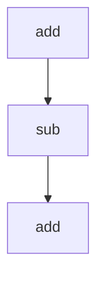

# `docs`

## Tree:
```
docs/
└── tasks.py
```

## Role:
This module provides basic arithmetic operations implemented as Celery tasks for asynchronous execution.

## Description:
The `docs.tasks` module contains simple mathematical operations (`add` and `sub`) that are decorated to be used as Celery tasks. These functions are designed to be executed in a distributed computing environment where tasks can be queued and processed asynchronously by worker processes. The module serves as a demonstration of how to wrap standard Python functions into Celery-compatible tasks.

### Primary Consumers:
- Celery task queue systems
- Asynchronous processing workflows
- Distributed computing frameworks

### Cohesion Principle:
All components in this module share the common concept of being lightweight, synchronous mathematical operations that have been adapted for asynchronous execution using Celery decorators. They represent a foundational layer for task-based distributed computing within the application.

## Components:
- `add(x: int or float, y: int or float) -> int or float`: Performs addition of two numeric values.
- `sub(x: int or float, y: int or float) -> int or float`: Performs subtraction with a 30-second delay.



## Public API:
- `add(x, y)`: Adds two numbers and returns their sum. Suitable for immediate execution in Celery.
- `sub(x, y)`: Subtracts y from x with a 30-second delay. Useful for simulating long-running tasks in Celery.

## Dependencies:
- `time.sleep`: Used in `sub` to simulate computational delay.
- `celery`: Required for task decoration (assumed to be imported in the file).

## Constraints:
- Callers must ensure that `x` and `y` are numeric types (int or float).
- When using `sub`, callers must expect a 30-second delay before receiving results.
- Both functions are intended for use within a Celery task framework.

---

## Files

- [`tasks.py`](docs/tasks.md)

