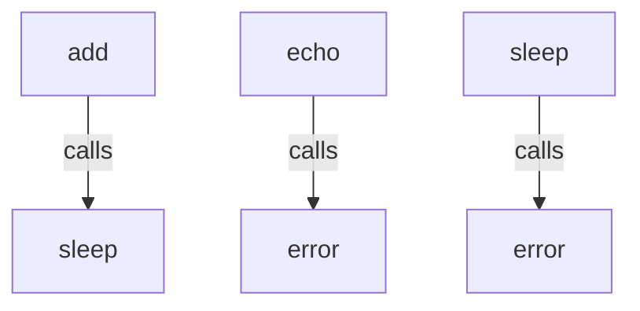

# `examples`

## Tree:
examples/
└── tasks.py

## Role:
Provides a collection of simple utility functions designed for use as Celery tasks, including arithmetic operations, messaging, error handling, and timing controls.

## Description:
The examples.tasks module contains a set of basic utility functions that are intended to be used as Celery tasks for distributed processing. These functions are kept simple and stateless to facilitate reliable execution in a distributed environment. They serve as examples of how to structure tasks for asynchronous processing and provide common utilities like arithmetic operations, logging helpers, error triggers, and timing controls.

Primary consumers of this module include:
- Celery task runners that execute distributed jobs
- Testing frameworks that mock or invoke these functions directly
- Documentation generators that showcase task usage patterns

These components are grouped together because they represent fundamental building blocks for asynchronous task execution, each serving a distinct but simple purpose in distributed computing workflows.

## Components:
- add(x: int or float, y: int or float) -> int or float
  Performs addition of two numeric values.
- echo(msg: str, timestamp: bool = False) -> str
  Returns a formatted message string with optional timestamp prefix.
- error(msg: str) -> None
  Raises an exception with the specified message.
- sleep(seconds: float) -> None
  Pauses execution for a specified number of seconds.

## Public API:
- add(x: int or float, y: int or float) -> int or float
  Performs addition of two numeric values. Can be used as a Celery task.
- echo(msg: str, timestamp: bool = False) -> str
  Formats and returns a message string with optional timestamp.
- error(msg: str) -> None
  Explicitly raises an exception with the provided message.
- sleep(seconds: float) -> None
  Delays execution for the specified number of seconds.

## Dependencies:
- time (built-in): Used by the sleep function for blocking delays.
- typing (built-in): Provides type hints for better code documentation and IDE support.

## Constraints:
- All functions must be pure or have minimal side effects to ensure reliability in distributed environments.
- The add function requires numeric inputs that support the '+' operator.
- The sleep function requires non-negative numeric input.
- The error function always raises an exception and never returns.
- Functions should be callable without requiring any initialization or setup.

---

## Files

- [`tasks.py`](examples/tasks.md)

