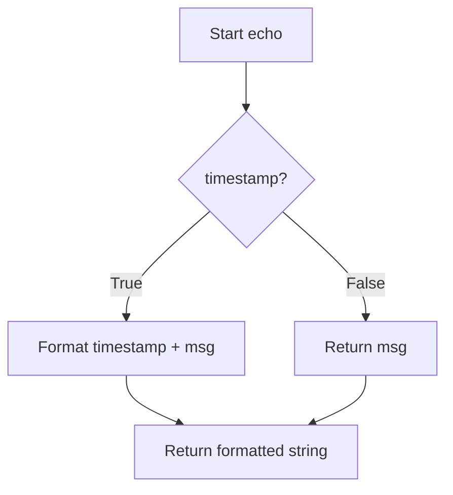

# `tasks.py`

## `examples.tasks.add` · *function*

## Summary:
Adds two numeric values together and returns their sum.

## Description:
This function performs basic arithmetic addition of two numeric inputs. It is designed to be a simple utility function that can be used in various computational contexts within the application. The function leverages Python's built-in addition operator, which supports integers, floats, and other numeric types that implement the __add__ method.

## Args:
    x (int or float or other numeric type): The first number to be added.
    y (int or float or other numeric type): The second number to be added.

## Returns:
    int or float or other numeric type: The sum of x and y. The return type depends on the input types and follows Python's standard arithmetic rules.

## Raises:
    TypeError: If either x or y is not a numeric type (int, float, or other type implementing __add__) and the operation cannot be performed.

## Constraints:
    Preconditions:
        - Both x and y must support the addition operation (be numeric or implement __add__).
    Postconditions:
        - The result will be the mathematical sum of the inputs according to Python's addition semantics.

## Side Effects:
    None.

## Control Flow:
```mermaid
flowchart TD
    A[Start add(x,y)] --> B{Are x and y numeric?}
    B -- No --> C[raise TypeError]
    B -- Yes --> D[return x + y]
    C --> E[End]
    D --> E[End]
```

## Examples:
    >>> add(2, 3)
    5
    >>> add(2.5, 3.7)
    6.2
    >>> add(1, 2.5)
    3.5

## `examples.tasks.sleep` · *function*

## Summary:
Pauses execution for a specified number of seconds.

## Description:
This function provides a blocking delay mechanism that halts program execution for the given duration. It serves as a wrapper around Python's standard `time.sleep()` function, enabling controlled timing delays in asynchronous workflows managed by Celery.

## Args:
    seconds (float): Number of seconds to pause execution. Must be non-negative.

## Returns:
    None: This function does not return any value.

## Raises:
    TypeError: If the argument `seconds` is not numeric (int or float).
    ValueError: If the argument `seconds` is negative.

## Constraints:
    Preconditions:
        - Argument `seconds` must be a numeric type (int or float).
        - Value of `seconds` must be non-negative.
    Postconditions:
        - Execution is suspended for approximately `seconds` seconds.
        - Function completes without returning a value.

## Side Effects:
    - Blocks the calling thread for the specified duration.
    - No external I/O operations or state mutations occur.

## Control Flow:
```mermaid
flowchart TD
    A[Start sleep()] --> B{seconds < 0?}
    B -- Yes --> C[raise ValueError]
    B -- No --> D{isinstance(seconds, (int, float))?}
    D -- No --> E[raise TypeError]
    D -- Yes --> F[time.sleep(seconds)]
    F --> G[Return None]
```

## Examples:
    # Basic usage
    sleep(2.5)  # Pauses execution for 2.5 seconds
    
    # In Celery task context
    @app.task
    def delayed_task():
        sleep(5)  # Wait 5 seconds before proceeding
        return "Task completed"

## `examples.tasks.echo` · *function*

## Summary:
Returns a formatted message string with optional timestamp prefix.

## Description:
This function takes a message string and optionally prepends the current timestamp to it. It is designed to be a simple utility for logging or displaying messages with temporal context.

## Args:
    msg (str): The message to be returned or formatted with timestamp.
    timestamp (bool): Flag indicating whether to prepend the current timestamp. Defaults to False.

## Returns:
    str: The original message if timestamp is False, or the message prefixed with current timestamp if timestamp is True.

## Raises:
    None

## Constraints:
    Preconditions: The msg argument must be a string.
    Postconditions: The returned value is always a string.

## Side Effects:
    None

## Control Flow:


## Examples:
    >>> echo("Hello World")
    'Hello World'
    
    >>> echo("Hello World", timestamp=True)
    '2023-05-15 14:30:45.123456: Hello World'

## `examples.tasks.error` · *function*

## Summary:
Raises an exception with the specified message.

## Description:
This function serves as a utility for explicitly triggering exceptions in the application. It is a simple wrapper around Python's built-in Exception constructor that allows for consistent error handling throughout the codebase.

The function is designed to be a clean abstraction for error conditions, enabling centralized error management and easier mocking during testing.

## Args:
    msg (str): The error message to include in the raised exception. Must be a string.

## Returns:
    None: This function never returns normally as it always raises an exception.

## Raises:
    Exception: Always raised with the provided message string.

## Constraints:
    Preconditions:
    - The input message must be a string.
    
    Postconditions:
    - The function will always raise an exception and never complete execution.

## Side Effects:
    - No I/O operations are performed.
    - No external state is mutated.
    - No external service calls are made.

## Control Flow:
```mermaid
flowchart TD
    A[Start error()] --> B[Raise Exception(msg)]
    B --> C[Exit with Exception]
```

## Examples:
    # Basic usage
    try:
        error("Something went wrong")
    except Exception as e:
        print(f"Caught exception: {e}")
        # Output: Caught exception: Something went wrong

