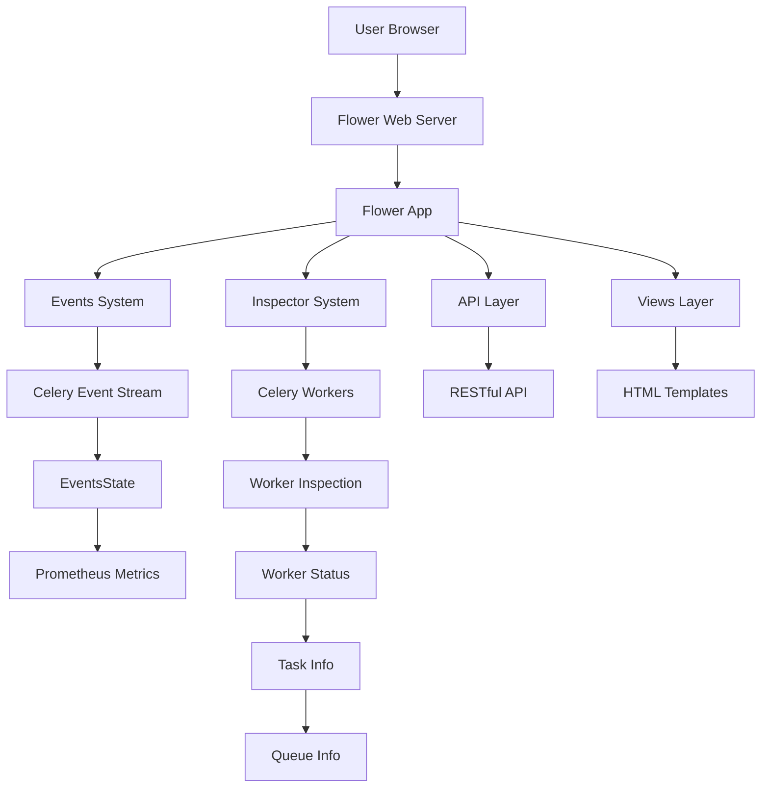

# `flower`

## Repository Overview

### Tree Structure
```
flower/
├── docs/
│   └── tasks.py
├── examples/
│   └── tasks.py
└── flower/
    ├── api/
    │   ├── __init__.py
    │   ├── control.py
    │   ├── tasks.py
    │   └── workers.py
    ├── utils/
    │   └── __init__.py
    ├── views/
    │   ├── __init__.py
    │   ├── auth.py
    │   ├── broker.py
    │   ├── error.py
    │   ├── monitor.py
    │   ├── tasks.py
    │   └── workers.py
    ├── __main__.py
    ├── app.py
    ├── command.py
    ├── events.py
    └── inspector.py
```

### Purpose
Flower is a comprehensive web-based monitoring and management interface for Celery distributed task queues. It provides real-time visibility into worker status, task execution, queue behavior, and system performance through an intuitive web dashboard. The tool bridges the gap between Celery's powerful distributed processing capabilities and the need for operational oversight, making it easier for developers and operators to manage large-scale task processing systems.

Flower operates as a command-line tool that can be invoked to start a web server, integrating seamlessly with existing Celery deployments without requiring modifications to the underlying task infrastructure. Users run the `flower` command to launch the monitoring interface, which connects to their Celery broker to collect real-time information.

Target users include:
- DevOps engineers managing distributed task infrastructures
- Developers debugging and optimizing Celery-based applications
- System administrators monitoring production task queues
- Teams deploying microservices that rely on Celery for background processing

### Architecture


Key architectural patterns:
- **Event-driven architecture**: Real-time monitoring through Celery's event system
- **Separation of concerns**: Clear division between UI, API, and backend services
- **Plugin-like design**: Modular components that can be extended or replaced
- **Asynchronous processing**: Non-blocking operations for scalability

### Entry Points
1. **CLI Command**: `flower` - Starts the web application with configurable options
2. **Importable API**: Direct Python imports for programmatic access to monitoring features
3. **Web Interface**: HTTP endpoints accessible via browser at configured URL

### Core Features
- Real-time worker monitoring and status tracking
- Task execution visualization and performance metrics
- Queue management and inspection capabilities
- Prometheus metrics integration for advanced monitoring
- Authentication and authorization support
- SSL/TLS encryption for secure access
- Customizable URL prefixes and deployment options

### Dependencies
- **Celery**: Core distributed task processing framework
- **Tornado**: Web framework for HTTP handling and asynchronous operations
- **Prometheus Client**: Metrics collection and exposition
- **Click**: Command-line interface construction
- **Logging**: Standard Python logging module for application diagnostics

### Extension Points
- **Custom Views**: Extend the web interface with new dashboard panels
- **API Endpoints**: Add new RESTful endpoints for custom monitoring
- **Authentication Backends**: Implement alternative auth mechanisms
- **Event Handlers**: Customize event processing logic
- **Metrics Collection**: Add new Prometheus metrics for domain-specific insights

---

## Modules

- [`docs`](docs.md)
- [`examples`](examples.md)
- [`flower`](flower.md)
- [`flower/api`](flower/api.md)
- [`flower/utils`](flower/utils.md)
- [`flower/views`](flower/views.md)

