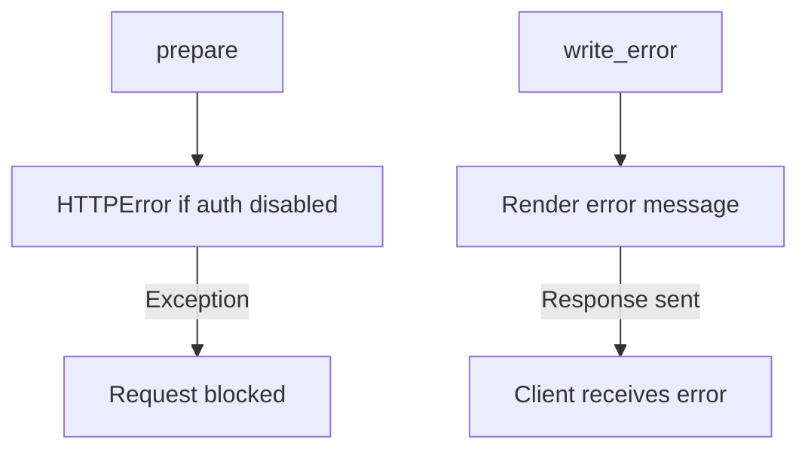

# `__init__.py`

## `flower.api.__init__.BaseApiHandler` · *class*

## Summary:
BaseApiHandler is a specialized request handler that provides authentication validation and customized error handling for API endpoints in the Flower web application.

## Description:
This class extends BaseHandler to enforce authentication requirements for API access and provides tailored error response handling. It ensures that API endpoints can only be accessed when proper authentication is configured or when explicitly permitted via an environment variable. The class overrides the standard error handling to provide more informative error responses for API clients.

The BaseApiHandler serves as a foundational component for all API-related request handlers, establishing security boundaries and consistent error presentation patterns.

## State:
- self.application.options.basic_auth: Boolean flag indicating if basic authentication is configured
- self.application.options.auth: String pattern or flag indicating if OAuth2 authentication is configured
- Environment variable FLOWER_UNAUTHENTICATED_API: String value that determines if unauthenticated API access is allowed

## Lifecycle:
- Creation: Instantiated automatically by Tornado web framework when handling API requests
- Usage: Called during request processing by Tornado's lifecycle methods (prepare, write_error)
- Destruction: Managed by Tornado framework's request lifecycle

## Method Map:


## Raises:
- tornado.web.HTTPError: Raised with status code 401 and message "FLOWER_UNAUTHENTICATED_API environment variable is required to enable API without authentication" when both authentication mechanisms are disabled and unauthenticated API access is not explicitly enabled

## Example:
```python
# During request processing, Tornado automatically calls:
# 1. prepare() - validates authentication
# 2. If authentication fails, raises HTTPError(401)
# 3. write_error() - formats and sends error response
```

### `flower.api.__init__.BaseApiHandler.prepare` · *method*

## Summary:
Validates that API access is properly authenticated or that unauthenticated access is explicitly enabled via environment variable.

## Description:
This method performs authentication validation during the request preparation phase. It ensures that API endpoints can only be accessed when either:
1. Authentication is properly configured (basic_auth or auth options are set), OR
2. The FLOWER_UNAUTHENTICATED_API environment variable is explicitly set to enable unauthenticated access

This validation prevents accidental exposure of API endpoints without proper authentication controls.

## Args:
    self: The BaseApiHandler instance being prepared for request processing

## Returns:
    None: This method does not return a value but raises an exception on validation failure

## Raises:
    tornado.web.HTTPError: Raised with status code 401 when both authentication mechanisms are disabled and FLOWER_UNAUTHENTICATED_API is not set to enable unauthenticated access

## State Changes:
    Attributes READ: 
    - self.application.options.basic_auth
    - self.application.options.auth
    Attributes WRITTEN: None

## Constraints:
    Preconditions:
    - The method assumes self.application.options contains basic_auth and auth attributes
    - Environment variables must be accessible via os.environ.get()
    
    Postconditions:
    - Either authentication is properly configured or FLOWER_UNAUTHENTICATED_API is enabled
    - If authentication is not properly configured, an HTTP 401 error is raised

## Side Effects:
    None: This method performs no I/O operations or external service calls, only environment variable reading and exception raising

### `flower.api.__init__.BaseApiHandler.write_error` · *method*

## Summary:
Writes an error response with appropriate status code and error message to the HTTP client.

## Description:
This method handles the rendering of error responses for HTTP requests that result in errors. It is invoked by the Tornado web framework when an exception occurs during request processing. The method determines the appropriate error response based on the HTTP status code and renders either a custom HTML template or plain text message. This method overrides the default Tornado error handling to provide customized error pages and messages.

Known callers:
- Tornado web framework automatically invokes this method when HTTP errors occur during request processing.
- Called during the request lifecycle when an exception is raised or when an HTTP error status is returned.

Why this logic is its own method:
- Provides centralized error handling logic for the application
- Allows customization of error responses for different HTTP status codes
- Enables consistent error presentation across the web application

## Args:
    status_code (int): The HTTP status code indicating the type of error (e.g., 404, 500).
    **kwargs: Additional keyword arguments, including 'exc_info' containing exception information.

## Returns:
    None: This method does not return a value but sends the error response directly to the client.

## Raises:
    None explicitly raised: The method relies on Tornado's error handling mechanism.

## State Changes:
    Attributes READ: None
    Attributes WRITTEN: None

## Constraints:
    Preconditions: The method assumes that the status_code is valid and that exc_info contains proper exception information when present.
    Postconditions: The HTTP response is sent to the client with the appropriate status code and error message.

## Side Effects:
    I/O: Writes error message to the HTTP response stream via self.write().
    HTTP Response: Sets the HTTP status code using self.set_status() and finishes the response using self.finish().

