# `control.py`

## `flower.api.control.ControlHandler` · *class*

## Summary:
ControlHandler is a specialized API handler that provides utility methods for worker management and error reporting in distributed task processing systems.

## Description:
This class extends BaseApiHandler to provide helper methods for validating worker identities and extracting error information from distributed system responses. It serves as a utility class that supports control and monitoring operations in Flower's web interface for Celery task queues. The class is designed to work within the Flower application's API framework and inherits authentication and error handling behaviors from its parent class.

The ControlHandler is specifically intended for use in API endpoints that require worker validation or error analysis capabilities. It provides two primary utility methods: one for checking worker validity and another for extracting meaningful error messages from distributed system responses.

## State:
- self.application.workers: Collection of registered worker names managed by the application (type: set-like collection)
- logger: Logger instance for recording error messages during error reason extraction (type: logging.Logger)

## Lifecycle:
- Creation: Instantiated automatically by Tornado web framework when handling API requests
- Usage: Methods are called during request processing to validate workers and extract error information
- Destruction: Managed by Tornado framework's request lifecycle

## Method Map:
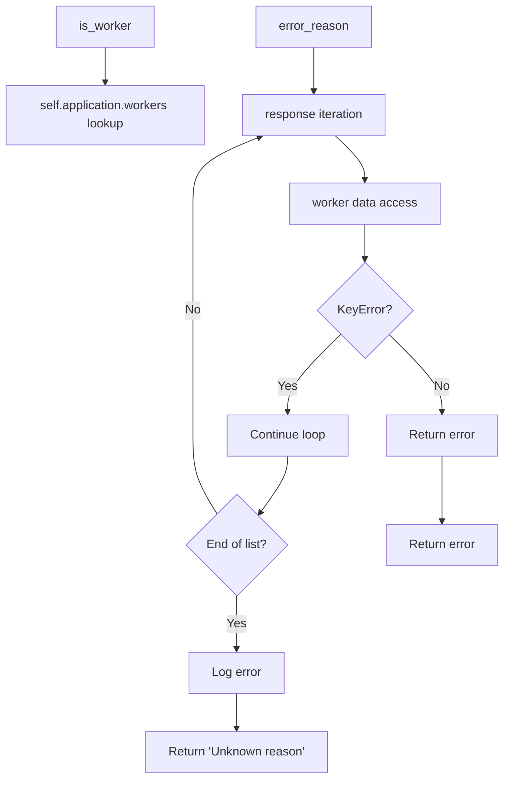

## Raises:
- None explicitly raised by the constructor
- HTTPError may be raised by parent BaseApiHandler during authentication validation (inherited from BaseApiHandler)

## Example:
```python
# During request processing, methods might be called as:
handler = ControlHandler(application)
is_valid = handler.is_worker("worker1")
error_msg = handler.error_reason("worker1", [{"worker1": {"error": "Connection failed"}}])
```

### `flower.api.control.ControlHandler.is_worker` · *method*

## Summary:
Checks whether a given worker name corresponds to an active worker in the application.

## Description:
Determines if the specified worker name exists in the set of registered workers within the application. This method serves as a utility for validating worker identifiers before performing operations on them. It performs a safe check that handles None or empty string inputs gracefully.

## Args:
    workername (str or None): The name of the worker to check for existence. May be None or empty string.

## Returns:
    bool: True if the worker name is truthy (non-empty) and exists in self.application.workers; False otherwise.

## Raises:
    None explicitly raised.

## State Changes:
    Attributes READ: self.application.workers
    Attributes WRITTEN: None

## Constraints:
    Preconditions: The workername parameter should be a string or None. self.application.workers should be a collection supporting 'in' operator.
    Postconditions: Returns a boolean indicating membership status in self.application.workers.

## Side Effects:
    None.

### `flower.api.control.ControlHandler.error_reason` · *method*

## Summary:
Extracts the error reason for a specific worker from a list of response dictionaries.

## Description:
This method searches through a list of response dictionaries to find and return the error message associated with a given worker name. It iterates through each response dictionary in order and attempts to retrieve the error field from the nested worker data structure. This method is commonly used in distributed systems to handle error reporting from multiple workers.

## Args:
    workername (str): The identifier of the worker whose error reason is being extracted.
    response (list): A list of dictionaries containing worker response data, where each dictionary may contain worker-specific information.

## Returns:
    str: The error reason string if found in any response dictionary, otherwise returns 'Unknown reason' as a fallback.

## Raises:
    None explicitly raised, though KeyError exceptions are caught internally during dictionary access.

## State Changes:
    Attributes READ: logger (used for error logging when no error is found)
    Attributes WRITTEN: None

## Constraints:
    Preconditions: 
    - workername must be a string
    - response must be a list of dictionaries
    - Each dictionary in response should support the key access pattern res[workername]
    Postconditions: 
    - Always returns a string value (either an error message or 'Unknown reason')

## Side Effects:
    I/O: Writes to the logger with an error message when no error reason can be extracted from the response collection.

## `flower.api.control.WorkerShutDown` · *class*

## Summary:
WorkerShutDown is an API endpoint handler that manages the shutdown of specific worker processes in a distributed task queue system.

## Description:
This class implements a POST endpoint for shutting down Celery workers within the Flower monitoring interface. It extends ControlHandler to inherit worker validation utilities and provides the capability to remotely terminate worker processes by broadcasting shutdown commands. The handler ensures proper authentication through the @web.authenticated decorator and validates worker existence before attempting shutdown operations.

The class handles HTTP POST requests to the /api/shutdown/{workername} endpoint, where workername is the identifier of the worker to be shut down. When invoked, it validates the worker's existence, logs the shutdown action, broadcasts a shutdown command to the worker, and writes a confirmation response back to the client.

## State:
- self.capp: Application-level control interface for sending commands to workers (type: Celery app instance)
- logger: Logger instance for recording shutdown events (type: logging.Logger)
- Inherited from ControlHandler:
  - self.application.workers: Set-like collection of registered worker names (type: set-like collection)
  - self.is_worker(): Method for validating worker existence (type: callable)

## Lifecycle:
- Creation: Automatically instantiated by Tornado web framework when handling API requests to the shutdown endpoint
- Usage: Called during HTTP POST request processing when a shutdown command is issued for a specific worker
- Destruction: Managed by Tornado framework's request lifecycle

## Method Map:
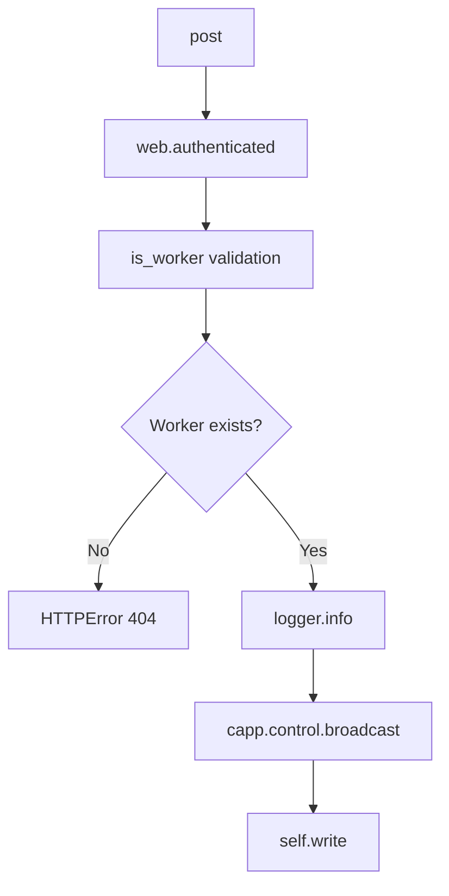

## Raises:
- web.HTTPError: Raised with status code 404 when the specified worker name does not correspond to an existing worker in the system

## Example:
```python
# To shut down a worker named 'worker1':
# POST /api/shutdown/worker1
# Response: {"message": "Shutting down!"}

# If worker doesn't exist:
# POST /api/shutdown/nonexistent
# Response: HTTP 404 error with message "Unknown worker 'nonexistent'"
```

### `flower.api.control.WorkerShutDown.post` · *method*

## Summary:
Initiates shutdown of a specified worker by broadcasting a shutdown command to the worker.

## Description:
This method handles HTTP POST requests to shut down a specific worker process. It validates that the worker exists using the is_worker method, logs the shutdown action, broadcasts a shutdown command to the worker via the control interface, and sends a confirmation response to the client.

## Args:
    workername (str): The unique identifier/name of the worker to shut down

## Returns:
    None: This method writes directly to the HTTP response and does not return a value

## Raises:
    web.HTTPError: Raised with status code 404 when the specified worker does not exist

## State Changes:
    Attributes READ: self.is_worker, self.capp, self.write
    Attributes WRITTEN: None

## Constraints:
    Preconditions: The workername must correspond to an existing worker in the system
    Postconditions: The shutdown command is broadcast to the specified worker, and a response is sent to the client

## Side Effects:
    I/O: Writes HTTP response to client
    External service calls: Calls self.capp.control.broadcast() to send shutdown command to worker
    Logging: Logs shutdown event using logger.info()

## `flower.api.control.WorkerPoolRestart` · *class*

## Summary:
WorkerPoolRestart is an API endpoint handler that manages the restart of a worker's task processing pool in a distributed Celery environment.

## Description:
This class implements a RESTful API endpoint for restarting the task pool of a specific worker process. It extends ControlHandler to leverage existing worker validation and error reporting utilities. The handler processes HTTP POST requests to initiate a pool restart operation, communicates with the specified worker via Celery's control interface, and returns appropriate HTTP responses based on the outcome.

The class is designed to be used within the Flower web interface for remote worker management. It ensures that only valid workers can have their pools restarted and provides detailed feedback about the success or failure of the operation.

## State:
- self.capp: The Celery application instance containing the control interface for sending commands to workers (type: Celery app instance)
- logger: Logger instance for recording informational and error messages during operation (type: logging.Logger)

## Lifecycle:
- Creation: Automatically instantiated by the Tornado web framework when handling API requests matching the route pattern
- Usage: Called during HTTP POST request processing when a client requests to restart a worker's pool
- Destruction: Managed by Tornado's request lifecycle; no explicit cleanup required

## Method Map:
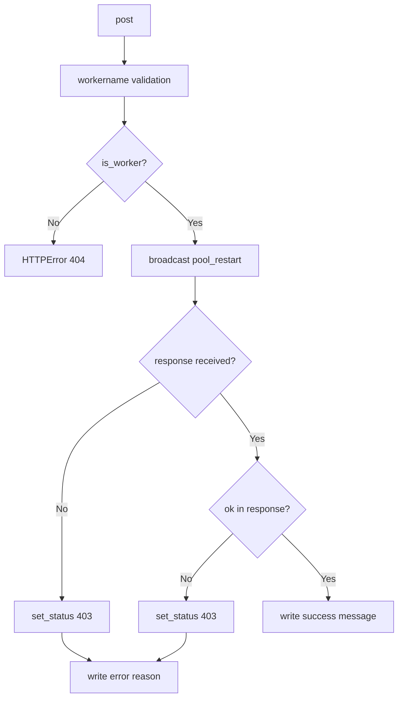

## Raises:
- web.HTTPError: Raised with status code 404 when the specified worker name does not correspond to an active worker in the application

## Example:
```python
# To restart a worker named 'celery@worker1':
# POST /api/worker/pool/restart/celery@worker1
# Response (success):
# {
#   "message": "Restarting 'celery@worker1' worker's pool"
# }
# Response (failure):
# {
#   "message": "Failed to restart the 'celery@worker1' pool: Connection timeout"
# }
```

### `flower.api.control.WorkerPoolRestart.post` · *method*

## Summary:
Restarts the task pool of a specified worker process and returns the result status.

## Description:
Handles HTTP POST requests to restart the task processing pool of a given worker. This method validates the worker's existence, broadcasts a pool restart command to the specified worker, and provides appropriate success or failure responses based on the worker's response. It is part of the control API for managing Celery workers remotely.

## Args:
    workername (str): The unique identifier of the worker whose task pool needs to be restarted.

## Returns:
    None: This method does not return a value directly, but writes HTTP response content via self.write().

## Raises:
    web.HTTPError: Raised with status code 404 when the specified worker does not exist according to self.is_worker().

## State Changes:
    Attributes READ: self.application.workers (via self.is_worker), self.capp (via self.capp.control.broadcast)
    Attributes WRITTEN: None

## Constraints:
    Preconditions:
    - The workername parameter must be a non-empty string
    - The worker identified by workername must exist in the application's worker registry
    - self.capp must be initialized and have a control attribute with a broadcast method
    Postconditions:
    - If successful, writes a JSON message confirming the restart operation
    - If failed, sets HTTP status to 403 and writes an error message explaining the failure

## Side Effects:
    I/O: Writes log messages to the logger at info and error levels
    External service calls: Invokes self.capp.control.broadcast() to send commands to the worker
    HTTP response mutation: Calls self.write() and self.set_status() to construct HTTP response

## `flower.api.control.WorkerPoolGrow` · *class*

## Summary:
WorkerPoolGrow is an API endpoint handler that increases the process pool size of a specified worker in a Celery-based distributed task queue system.

## Description:
This class implements a POST endpoint for dynamically scaling worker processes. It validates worker existence, retrieves the desired pool growth increment from request parameters, and communicates with the Celery application to expand the worker's process pool. The handler is part of Flower's web interface for monitoring and managing Celery workers.

The class extends ControlHandler to leverage existing worker validation and error reporting utilities. It is designed to be used in distributed task processing environments where dynamic worker scaling is required for load balancing or performance optimization.

## State:
- self.application.workers: Set-like collection of registered worker names (type: set-like collection)
- self.capp: Celery application instance providing access to control commands (type: Celery app)
- logger: Logger instance for recording operation logs (type: logging.Logger)

## Lifecycle:
- Creation: Automatically instantiated by Tornado web framework when handling API requests
- Usage: Called via HTTP POST requests to the endpoint, typically by Flower's web UI or API clients
- Destruction: Managed by Tornado framework's request lifecycle

## Method Map:
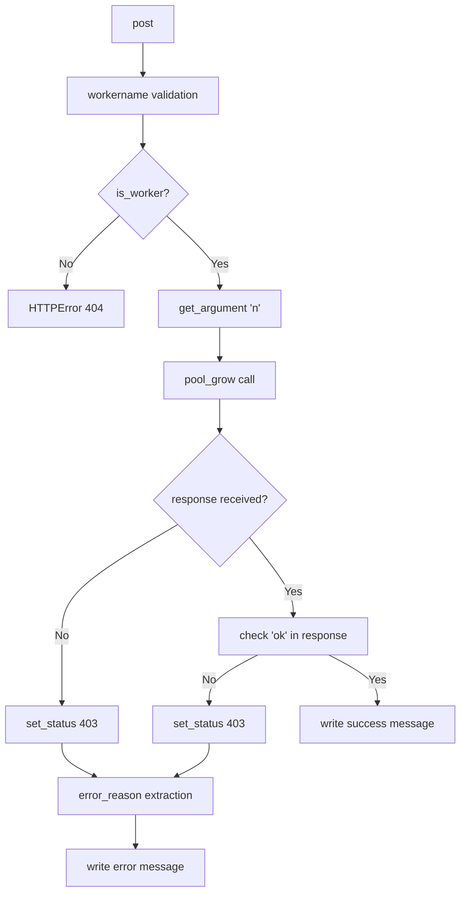

## Raises:
- tornado.web.HTTPError(404): Raised when the specified workername does not exist in self.application.workers
- tornado.web.HTTPError(403): Raised when the pool growth operation fails, with detailed error information in the response

## Example:
```python
# Typical usage via HTTP POST request:
# POST /api/worker/pool/grow/worker1?n=2
# Response on success:
# {"message": "Growing 'worker1' worker's pool by 2"}

# Response on failure:
# HTTP 403 Forbidden with error message
# "Failed to grow 'worker1' worker's pool: [error reason]"
```

### `flower.api.control.WorkerPoolGrow.post` · *method*

## Summary:
Increases the worker pool size for a specified worker by a given number of processes.

## Description:
This method handles HTTP POST requests to grow a worker's process pool. It validates the worker exists, retrieves the growth increment from request arguments, and communicates with the Celery application to expand the worker's pool. The method integrates with the control interface to manage distributed worker scaling operations.

## Args:
    workername (str): The unique identifier of the target worker whose pool needs to be grown.

## Returns:
    None: This method writes directly to the HTTP response and does not return a value.

## Raises:
    tornado.web.HTTPError: Raised with status code 404 when the specified worker does not exist.
    tornado.web.HTTPError: Raised with status code 400 when the 'n' argument cannot be converted to an integer.

## State Changes:
    Attributes READ: 
    - self.application.workers (via is_worker method)
    - self.capp (Celery application instance)
    Attributes WRITTEN: 
    - self (response writer methods)

## Constraints:
    Preconditions:
    - The workername must correspond to an existing worker in self.application.workers
    - The 'n' query parameter must be convertible to an integer (defaults to 1 if not provided)
    Postconditions:
    - If successful, the worker's process pool is increased by n processes
    - If failed, appropriate HTTP status code (403) and error message are returned

## Side Effects:
    I/O: Writes log messages to the logger at info/error levels
    External service calls: Invokes self.capp.control.pool_grow() to communicate with Celery workers
    Response mutation: Modifies HTTP response via self.write() and self.set_status() methods

## `flower.api.control.WorkerPoolShrink` · *class*

## Summary:
WorkerPoolShrink is an HTTP POST handler that reduces the size of a specified worker's process pool by a given number of processes.

## Description:
This class implements a control endpoint for shrinking worker process pools in a Celery-based distributed task queue system. It validates worker existence, retrieves the shrink count parameter (defaulting to 1), and communicates with the Celery application to reduce the worker pool size. The handler is designed to be used within Flower's web interface for managing distributed workers.

The class extends ControlHandler, inheriting worker validation and error reporting utilities. It specifically handles HTTP POST requests to shrink worker pools, making it part of the administrative control API for distributed task processing systems. The handler requires authentication via the @web.authenticated decorator.

## State:
- workername (str): The unique identifier of the worker whose process pool will be shrunk
- n (int): Number of processes to remove from the worker's pool (default: 1, validated as positive integer)
- self.capp: Celery application instance providing access to control interface
- self.application.workers: Collection of registered worker names for validation
- logger: Logger instance for recording informational and error messages

## Lifecycle:
- Creation: Instantiated automatically by Tornado web framework when handling API requests
- Usage: Called via HTTP POST to /api/shrink/{workername} endpoint with optional 'n' parameter
- Destruction: Managed by Tornado framework's request lifecycle

## Method Map:
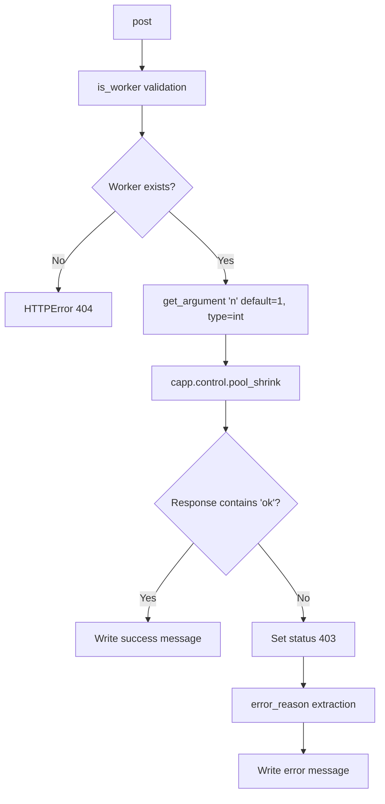

## Raises:
- tornado.web.HTTPError: Raised with status code 404 when the specified worker does not exist
- Various exceptions may be raised by underlying Tornado methods (inherited from ControlHandler)

## Example:
```python
# HTTP POST request to /api/shrink/worker1
# With optional parameter: ?n=2
# Response on success:
# {"message": "Shrinking 'worker1' worker's pool by 2"}

# Response on failure:
# HTTP 403 Forbidden with error message
# "Failed to shrink 'worker1' worker's pool: [reason]"
```

### `flower.api.control.WorkerPoolShrink.post` · *method*

## Summary:
Reduces the size of a specified worker's process pool by a given number of processes.

## Description:
Handles HTTP POST requests to shrink a worker's process pool. Validates the worker exists, retrieves the shrink count parameter (defaulting to 1), and communicates with the Celery application to reduce the worker pool size. This method is part of the control API for managing distributed workers in a Celery-based task queue system.

## Args:
    workername (str): The unique identifier of the worker whose process pool will be shrunk.

## Returns:
    None: This method does not return a value directly, but writes HTTP responses to the client.

## Raises:
    tornado.web.HTTPError: Raised with status code 404 when the specified worker does not exist.

## State Changes:
    Attributes READ: 
    - self.application.workers (via is_worker method)
    - self.capp (Celery application instance)
    Attributes WRITTEN: 
    - self (response writer methods)

## Constraints:
    Preconditions:
    - The workername must correspond to an existing worker in self.application.workers
    - The 'n' parameter must be a positive integer (default is 1)
    Postconditions:
    - If successful, writes a confirmation message to the HTTP response
    - If failed, writes an error message with status code 403

## Side Effects:
    - Makes a remote procedure call to the Celery control interface via self.capp.control.pool_shrink
    - Writes HTTP response data to the client
    - Logs informational messages at INFO level when shrinking the pool
    - Logs error messages at ERROR level when the shrink operation fails

## `flower.api.control.WorkerPoolAutoscale` · *class*

## Summary:
WorkerPoolAutoscale is an API endpoint handler that manages worker pool autoscaling configuration for Celery workers in a Flower monitoring application.

## Description:
This class implements a POST endpoint for configuring autoscaling parameters (minimum and maximum worker counts) for specific Celery workers. It extends ControlHandler to leverage existing worker validation and error handling utilities. The handler authenticates requests, validates worker existence, extracts autoscaling parameters from request arguments, and broadcasts the autoscaling configuration to the targeted worker(s) using Celery's control interface.

The class is designed to be used as part of Flower's web API for managing distributed task queue workers programmatically. It provides a RESTful interface for adjusting worker pool sizes dynamically without requiring manual intervention on individual worker nodes.

## State:
- Inherits all state from ControlHandler including self.application.workers for worker validation and logger for error reporting
- self.capp: Reference to the Celery application instance (from parent class) used for broadcasting control commands to workers

## Lifecycle:
- Creation: Instantiated automatically by Tornado web framework when handling API requests to the autoscale endpoint
- Usage: Called during HTTP POST request processing when the endpoint is accessed with a worker name
- Destruction: Managed by Tornado framework's request lifecycle

## Method Map:
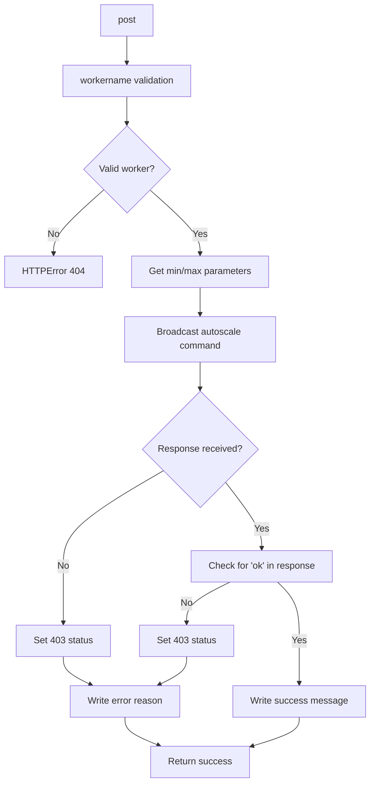

## Raises:
- tornado.web.HTTPError: Raised with status code 404 when the specified worker name is not found in self.application.workers
- tornado.web.HTTPError: Raised with status code 403 when autoscaling operation fails, with detailed error information in the response body

## Example:
```python
# Request: POST /api/worker/autoscale/worker1?min=2&max=10
# Response on success: {"message": "Autoscaling 'worker1' worker (min=2, max=10)"}
# Response on failure: "Failed to autoscale 'worker1' worker: <error reason>"
```

### `flower.api.control.WorkerPoolAutoscale.post` · *method*

## Summary:
Configures autoscaling parameters for a specified worker node and broadcasts the configuration to the worker.

## Description:
Handles POST requests to set autoscaling minimum and maximum limits for a specific worker. Validates the worker exists, retrieves autoscaling parameters from request arguments, and broadcasts the configuration to the targeted worker. This method is part of the control API for managing worker pool scaling behavior in a distributed Celery setup.

## Args:
    workername (str): The unique identifier of the worker to configure autoscaling for.

## Returns:
    None: This method does not return a value directly, but writes HTTP responses via self.write().

## Raises:
    tornado.web.HTTPError: Raised with status 404 when the specified worker does not exist (via is_worker check).

## State Changes:
    Attributes READ: 
    - self.application.workers (via is_worker)
    - self.capp (for accessing control interface)
    - self.request.arguments (via get_argument)
    Attributes WRITTEN: 
    - self (via write, set_status methods)

## Constraints:
    Preconditions:
    - The workername must correspond to an existing worker in self.application.workers
    - The 'min' and 'max' arguments must be convertible to integers via get_argument
    - self.capp must be initialized with a valid control interface
    Postconditions:
    - If successful, the worker's autoscaling configuration is updated
    - If failed, appropriate HTTP status codes and error messages are returned

## Side Effects:
    - Makes a broadcast call to the worker via self.capp.control.broadcast
    - Writes HTTP response data to the client
    - Logs informational and error messages using the logger
    - Sets HTTP status codes (200 for success, 403 for failure)

## `flower.api.control.WorkerQueueAddConsumer` · *class*

## Summary:
WorkerQueueAddConsumer is a Tornado web handler that enables dynamic addition of queue consumers to Celery worker processes through the Flower monitoring interface.

## Description:
This class implements a POST endpoint for adding queue consumers to specific worker processes in a Celery-based distributed task queue system. It serves as part of Flower's web API control interface, allowing administrators to dynamically configure worker consumption of message queues without requiring worker restarts. The handler validates worker existence, retrieves queue information from request arguments, and broadcasts control commands to target workers using Celery's distributed control mechanism.

The class extends ControlHandler, inheriting worker validation and error reporting utilities. It is designed to be used within the Flower web application's API framework and requires proper authentication through the @web.authenticated decorator.

## State:
- self.capp: Celery application instance with control interface for broadcasting commands (type: Celery app)
- self.application.workers: Set-like collection of registered worker names (type: set-like collection)
- logger: Logger instance for recording informational and error messages (type: logging.Logger)

## Lifecycle:
- Creation: Automatically instantiated by Tornado web framework when handling matching HTTP requests
- Usage: Processes HTTP POST requests to add queue consumers to workers by validating worker identity, retrieving queue arguments, and broadcasting control commands
- Destruction: Managed by Tornado framework's request lifecycle

## Method Map:
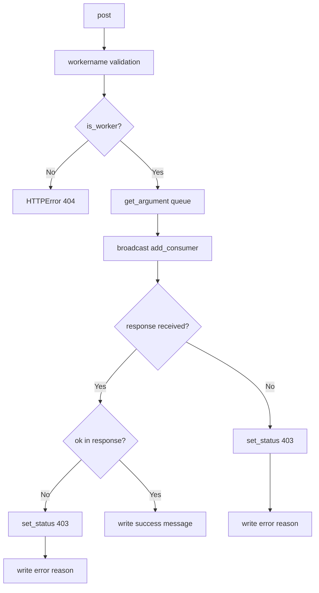

## Raises:
- web.HTTPError: Raised with status code 404 when the specified workername does not correspond to an active worker in the application

## Example:
```python
# Typical usage scenario:
# Client makes POST request to /api/worker/queue/add/worker1
# With form data containing 'queue=my_queue'
# Response on success: {"message": "Consumer added successfully"}
# Response on failure: "Failed to add 'my_queue' consumer to 'worker1' worker: Connection timeout"
```

### `flower.api.control.WorkerQueueAddConsumer.post` · *method*

## Summary:
Adds a queue consumer to a specified worker process through distributed task control.

## Description:
This method enables dynamic addition of queue consumers to Celery workers by broadcasting a control command to the target worker. It validates the worker's existence, retrieves the queue argument from the request, and executes the add_consumer command via the application's control interface. The method handles both successful and failed responses, providing appropriate HTTP status codes and error messages.

The endpoint is typically called during runtime to dynamically configure worker consumption of specific message queues, allowing for flexible task routing without restarting worker processes. This functionality is part of Flower's web-based monitoring and control interface for Celery task queues.

## Args:
    workername (str): The unique identifier of the target worker process to add the queue consumer to.

## Returns:
    None: This method writes directly to the HTTP response rather than returning a value.

## Raises:
    web.HTTPError: Raised with status code 404 when the specified workername does not correspond to an active worker.

## State Changes:
    Attributes READ: 
    - self.application.workers (via is_worker method)
    - self.capp (Celery app instance)
    - self.logger (logging instance)
    - self.request.arguments (via get_argument method)
    Attributes WRITTEN: 
    - None directly modified; response written to HTTP stream

## Constraints:
    Preconditions:
    - The workername parameter must be a non-empty string identifying an existing worker
    - The request must contain a 'queue' argument
    - The application must have a valid Celery control interface available
    Postconditions:
    - Either a success response with 'ok' message or a failure response with error details is written to the HTTP stream

## Side Effects:
    - I/O: Writes log entries to the application logger with info and error levels
    - External service call: Invokes self.capp.control.broadcast to communicate with target worker
    - HTTP response mutation: Sets HTTP status code (200 for success, 403 for failure) and writes response body to client

## `flower.api.control.WorkerQueueCancelConsumer` · *class*

## Summary:
WorkerQueueCancelConsumer is a Tornado web handler that cancels a consumer queue from a specified worker by broadcasting a control command.

## Description:
This class implements a Tornado web handler that processes POST requests to cancel a consumer queue from a specific worker in a Celery-based distributed task processing system. It validates the worker exists, retrieves the target queue from request arguments, and broadcasts a 'cancel_consumer' command to that worker. The handler manages both successful cancellations and failures, writing appropriate HTTP responses and status codes.

The class is designed to be used within Flower's web API framework for managing Celery workers and their consumer queues. It inherits from ControlHandler for worker validation and error handling utilities, and uses Tornado's authentication decorator to secure the endpoint.

## State:
- self.application.workers: Collection of registered worker names managed by the application (type: set-like collection)
- self.capp: Celery application instance with control interface for broadcasting commands (type: Celery app)
- logger: Logger instance for recording informational and error messages (type: logging.Logger)

## Lifecycle:
- Creation: Instantiated automatically by Tornado web framework when handling API requests
- Usage: Called during HTTP POST request processing when a client requests to cancel a consumer queue from a worker
- Destruction: Managed by Tornado framework's request lifecycle

## Method Map:
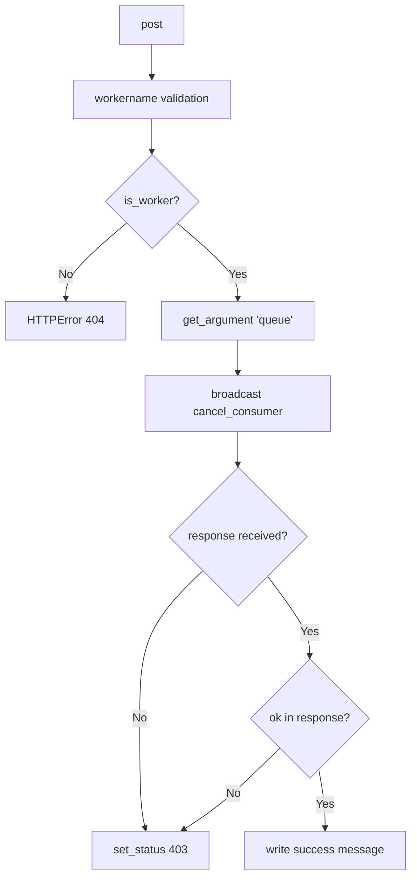

## Raises:
- tornado.web.HTTPError: Raised with status 404 when the specified worker does not exist
- Various exceptions may be raised by underlying Tornado methods but these are handled by the framework

## Example:
```python
# Client makes POST request:
# POST /api/worker/queue/cancel/worker1?queue=my_queue

# Handler processes request:
# 1. Validates worker 'worker1' exists via @web.authenticated decorator and is_worker check
# 2. Gets queue parameter 'my_queue' via get_argument
# 3. Broadcasts cancel_consumer command to worker1 via capp.control.broadcast
# 4. If successful: writes JSON {"message": "ok"} to HTTP response
# 5. If failed: sets 403 status and writes error message to HTTP response
```

### `flower.api.control.WorkerQueueCancelConsumer.post` · *method*

## Summary:
Cancels a consumer queue from a specified worker by broadcasting a control command.

## Description:
Handles POST requests to cancel a consumer queue from a specific worker. Validates the worker exists, retrieves the target queue from request arguments, and broadcasts a 'cancel_consumer' command to that worker. The method processes the response to either confirm success or report failure with appropriate HTTP status codes and error messages.

## Args:
    workername (str): The name of the worker from which to cancel the consumer queue.

## Returns:
    None: This method writes directly to the HTTP response rather than returning a value.

## Raises:
    tornado.web.HTTPError: Raised with status 404 when the specified worker does not exist.

## State Changes:
    Attributes READ: self.application.workers (via is_worker), self.capp (via capp.control.broadcast), self.request.arguments (via get_argument)
    Attributes WRITTEN: self (via write, set_status methods)

## Constraints:
    Preconditions:
    - The workername must correspond to an existing worker as validated by self.is_worker()
    - The request must contain a 'queue' argument
    - self.capp must be initialized with a valid control interface
    Postconditions:
    - On successful cancellation, writes a JSON message with 'ok' status
    - On failure, sets HTTP status 403 and writes an error message

## Side Effects:
    I/O: Writes HTTP response content via self.write()
    I/O: Sets HTTP status code via self.set_status()
    External service call: Invokes self.capp.control.broadcast() to send control command to worker
    Logging: Writes info and error messages to logger

## `flower.api.control.TaskRevoke` · *class*

## Summary:
TaskRevoke is an API endpoint handler that implements task revocation functionality for Celery tasks through the Flower web interface.

## Description:
This class handles HTTP POST requests to revoke running Celery tasks by sending termination signals to the associated workers. It extends ControlHandler to inherit authentication and utility methods, providing a secure interface for task management operations. The handler is specifically designed for use in Flower's web-based monitoring and control system for distributed task queues.

The class is decorated with @web.authenticated, ensuring that only authenticated users can perform task revocation operations. It processes task IDs and optional termination parameters to delegate revocation commands to the Celery control interface.

## State:
- self.capp: Celery application instance used for control operations (type: Celery app object)
- logger: Logger instance for recording revocation attempts (type: logging.Logger)
- self.get_argument: Method for extracting HTTP request arguments (type: callable)
- self.write: Method for writing HTTP response (type: callable)
- self.application.workers: Collection of registered worker names (inherited from ControlHandler, type: set-like collection)

## Lifecycle:
- Creation: Instantiated automatically by Tornado web framework when handling API requests
- Usage: Called during HTTP POST request processing when revoking tasks via the Flower web interface
- Destruction: Managed by Tornado framework's request lifecycle

## Method Map:
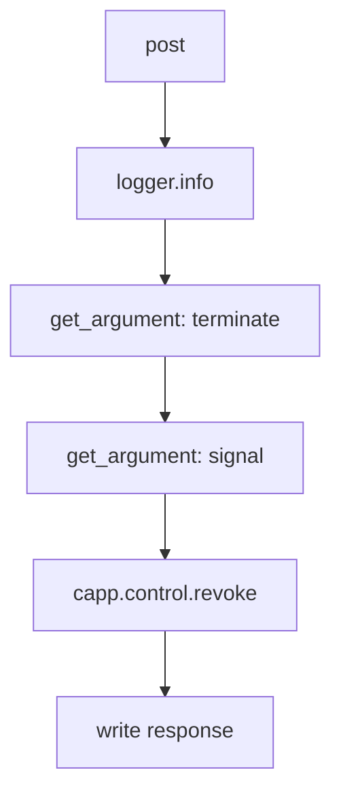

## Raises:
- HTTPError: May be raised by the parent ControlHandler or Tornado framework during authentication validation
- Celery-related exceptions: May be raised by capp.control.revoke() if task revocation fails

## Example:
```python
# Typical usage in Flower web interface:
# POST /api/task/revoke/{taskid}?terminate=true&signal=SIGKILL
# Response: {"message": "Revoked 'task-123'"}

# Creates an instance that handles:
# - Authentication check via @web.authenticated
# - Task ID extraction from URL path
# - Optional terminate parameter (default False)
# - Optional signal parameter (default 'SIGTERM')
# - Delegates to Celery control interface
# - Returns confirmation message
```

### `flower.api.control.TaskRevoke.post` · *method*

## Summary:
Revokes a task by sending a termination signal to the Celery worker, with optional force termination.

## Description:
This method handles HTTP POST requests to revoke a running Celery task identified by its task ID. It retrieves optional arguments for termination behavior and signal type, then delegates the revocation to the Celery control interface. The method logs the revocation attempt and responds with a confirmation message.

The method is part of the TaskRevoke handler class, which inherits from ControlHandler and provides API endpoints for task management in the Flower web interface. This handler is decorated with @web.authenticated, ensuring that only authenticated users can invoke task revocation operations.

## Args:
    taskid (str): The unique identifier of the task to be revoked.

## Returns:
    None: This method does not return a value directly, but writes an HTTP response.

## Raises:
    None explicitly raised: The method relies on underlying framework and Celery exceptions, which are not caught or re-raised.

## State Changes:
    Attributes READ: 
        - self.capp: Accesses the Celery app instance for control operations
        - self.get_argument: Reads HTTP request arguments
        - self.write: Writes HTTP response
    Attributes WRITTEN: 
        - None: No instance attributes are modified directly by this method.

## Constraints:
    Preconditions:
        - The task with the specified taskid must exist in the Celery task queue
        - The Celery app instance (self.capp) must be properly initialized
        - The HTTP request must contain valid arguments for terminate and signal
        - User must be authenticated (via @web.authenticated decorator)
    Postconditions:
        - The task revocation command is sent to the Celery worker
        - An HTTP response confirming the revocation is sent to the client

## Side Effects:
    - Logs a message indicating the task revocation attempt
    - Makes a call to the Celery control interface to revoke the task
    - Writes an HTTP response back to the client

## `flower.api.control.TaskTimout` · *class*

## Summary:
TaskTimout is a web API endpoint that allows setting timeout limits for specific tasks in a Celery-based distributed task queue system.

## Description:
This class implements a POST endpoint for configuring timeout settings (both hard and soft) for Celery tasks. It serves as part of Flower's web interface for monitoring and managing Celery workers. The endpoint validates task and worker existence before applying timeout configurations through the underlying Celery control mechanism.

The class is designed to be used within a Tornado web application framework and inherits authentication and base API handling from ControlHandler. It provides a RESTful interface for modifying task timeout behavior in real-time.

## State:
- Inherits all state from ControlHandler parent class
- self.capp: Reference to the Celery application instance containing task definitions and control mechanisms (type: Celery app instance)
- logger: Logger instance inherited from parent class for recording operational messages (type: logging.Logger)

## Lifecycle:
- Creation: Automatically instantiated by Tornado web framework when handling incoming HTTP requests to the task timeout endpoint
- Usage: Processes HTTP POST requests with taskname parameter, optionally including workername, hard, and soft timeout values
- Destruction: Managed by Tornado framework's request lifecycle

## Method Map:
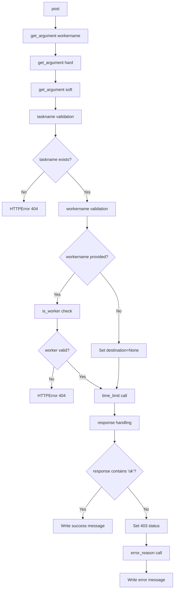

## Raises:
- web.HTTPError(404): Raised when the specified taskname does not exist in self.capp.tasks
- web.HTTPError(404): Raised when a workername is provided but does not correspond to a known worker
- web.HTTPError(403): Raised when the timeout configuration fails due to permission issues or invalid parameters

## Example:
```python
# Example HTTP request to set timeout for a task
POST /api/task/timeout/my_task?workername=worker1&soft=30.0&hard=60.0

# Successful response:
{"message": "Timeout set for my_task"}

# Failed response (when task doesn't exist):
{"message": "Failed to set timeouts: 'Unknown task 'my_task''"}
```

### `flower.api.control.TaskTimout.post` · *method*

## Summary:
Sets timeout limits for a specified task on a target worker or all workers.

## Description:
Configures time limits (hard and soft) for a Celery task. This method validates the task and worker existence, then delegates to the Celery control interface to apply the timeout settings. It supports setting timeouts either for a specific worker or across all workers. This endpoint is typically accessed via a POST request to the task timeout control API.

The method extracts workername, hard, and soft parameters from the HTTP request arguments. If workername is not provided, the timeout is applied to all workers. If hard or soft are not provided, they are set to None in the underlying Celery control call.

## Args:
    self: The ControlHandler instance
    taskname (str): The name of the task to configure timeouts for, passed as a URL parameter

## Returns:
    None: This method writes directly to the HTTP response rather than returning a value.

## Raises:
    web.HTTPError: Raised with status code 404 when the task or worker does not exist.
    web.HTTPError: Raised with status code 403 when the timeout configuration fails.

## State Changes:
    Attributes READ: self.capp.tasks, self.application.workers
    Attributes WRITTEN: HTTP response via self.write() and self.set_status()

## Constraints:
    Preconditions:
    - taskname must exist in self.capp.tasks
    - workername (if provided) must exist in self.application.workers
    Postconditions:
    - Timeout settings are applied to the specified task and worker(s)
    - Appropriate HTTP status codes are returned based on success/failure

## Side Effects:
    I/O: Writes HTTP response data via self.write()
    I/O: Sets HTTP status codes via self.set_status()
    Logging: Writes informational messages to logger at INFO level
    Logging: Writes error messages to logger at ERROR level when operation fails

## `flower.api.control.TaskRateLimit` · *class*

## Summary:
TaskRateLimit is an API endpoint handler that configures rate limits for Celery tasks.

## Description:
This class implements a POST endpoint for setting rate limits on Celery tasks within the Flower web interface. It accepts task names, optional worker names, and rate limit values through HTTP parameters, validates their existence, and applies the rate limit configuration via Celery's control interface. The handler provides appropriate HTTP responses for successful configuration or various error conditions.

The class is designed to be used as part of Flower's monitoring and control API, enabling administrators to manage task execution rates dynamically. It inherits authentication and base API functionality from ControlHandler, ensuring secure access to control operations.

## State:
- Inherits all state from ControlHandler including application workers collection and logger
- self.capp: Reference to the Celery application instance providing access to control interface
- self.application: Reference to the Tornado application instance containing configuration and workers

## Lifecycle:
- Creation: Instantiated automatically by Tornado web framework when handling API requests
- Usage: Called during HTTP POST request processing when a client submits rate limit configuration
- Destruction: Managed by Tornado framework's request lifecycle

## Method Map:
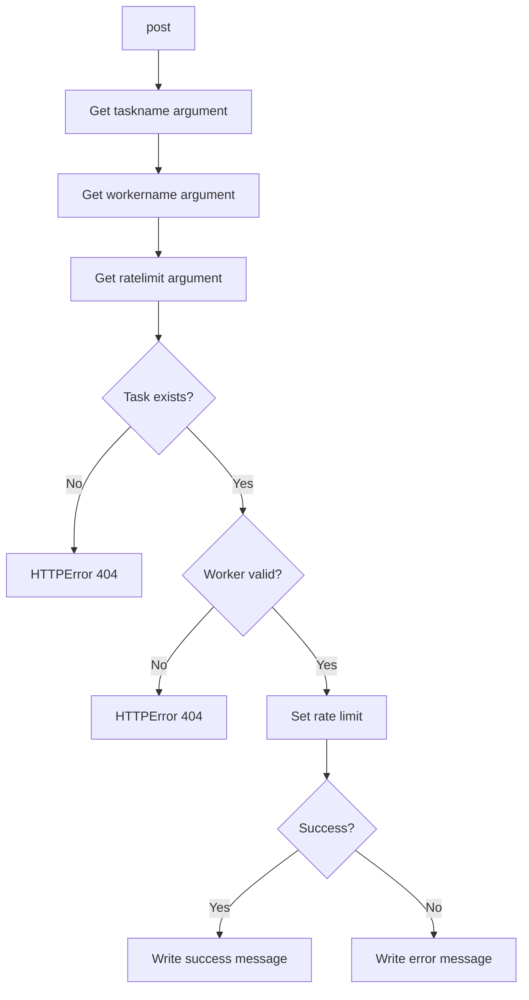

## Raises:
- tornado.web.HTTPError(404): Raised when the specified task name does not exist in self.capp.tasks
- tornado.web.HTTPError(404): Raised when the specified worker name is provided but does not exist in the application workers
- tornado.web.HTTPError(403): Raised when the rate limit operation fails and cannot be completed successfully

## Example:
```python
# Example API call to set rate limit for a task
# POST /api/task/rate-limit/my_task?workername=worker1&ratelimit=10/s
# Response on success: {"message": "Rate limit set to 10/s"}
# Response on failure: Failed to set rate limit: 'Unknown reason'
```

### `flower.api.control.TaskRateLimit.post` · *method*

## Summary:
Sets the rate limit for a specified task, optionally targeting a specific worker.

## Description:
Handles POST requests to configure rate limits for Celery tasks. This method validates the existence of the task and worker (if specified), then communicates with the Celery control interface to apply the rate limit configuration. It provides detailed error handling for invalid inputs and communication failures.

## Args:
    taskname (str): The name of the Celery task to configure rate limiting for.

## Returns:
    None: This method writes directly to the HTTP response rather than returning a value.

## Raises:
    web.HTTPError: Raised with status code 404 when the specified task or worker does not exist.
    web.HTTPError: Raised with status code 403 when the rate limit configuration fails due to permission or communication issues.

## State Changes:
    Attributes READ: self.capp.tasks, self.application.workers
    Attributes WRITTEN: None

## Constraints:
    Preconditions:
    - taskname must be a string identifying an existing task in self.capp.tasks
    - workername (when provided) must be a string identifying an existing worker in self.application.workers
    - ratelimit must be a valid rate limit string acceptable to Celery's rate_limit function
    Postconditions:
    - Rate limit is applied to the specified task (and optionally worker) via Celery's control interface
    - Appropriate HTTP response is written to client

## Side Effects:
    I/O: Writes HTTP response content to the client using self.write()
    I/O: Sets HTTP status code using self.set_status()
    I/O: Logs informational messages to the logger at INFO level
    I/O: Logs error messages to the logger at ERROR level
    External service call: Invokes self.capp.control.rate_limit() which communicates with Celery workers

