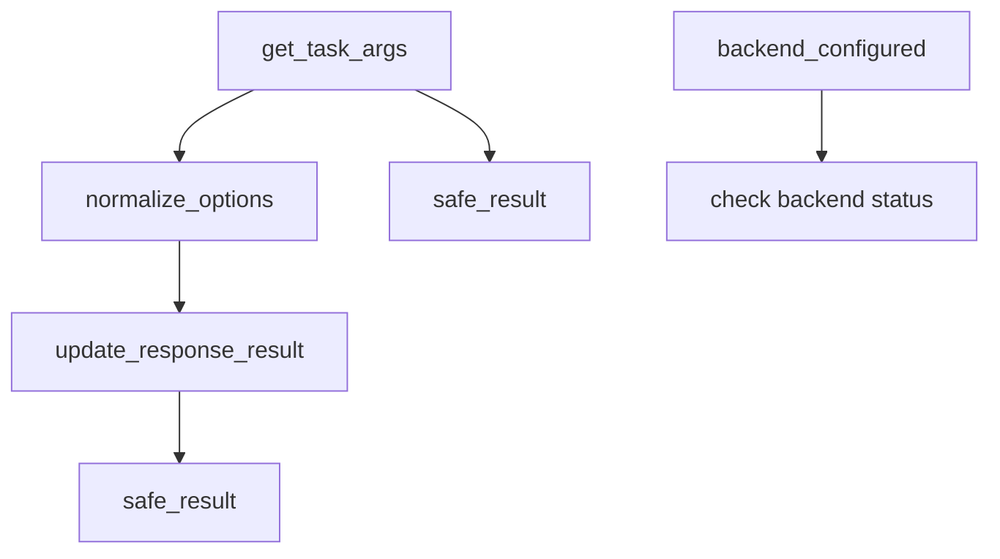
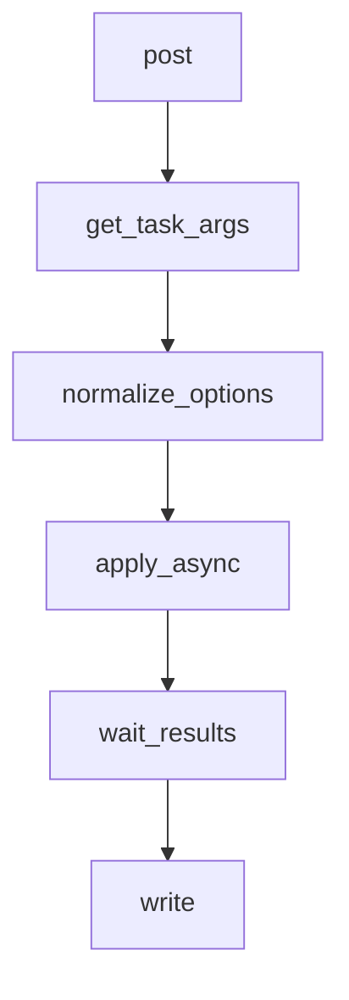
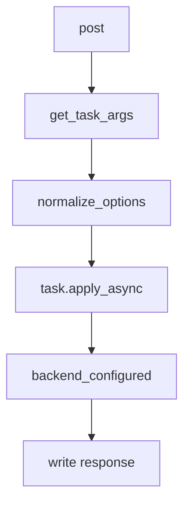
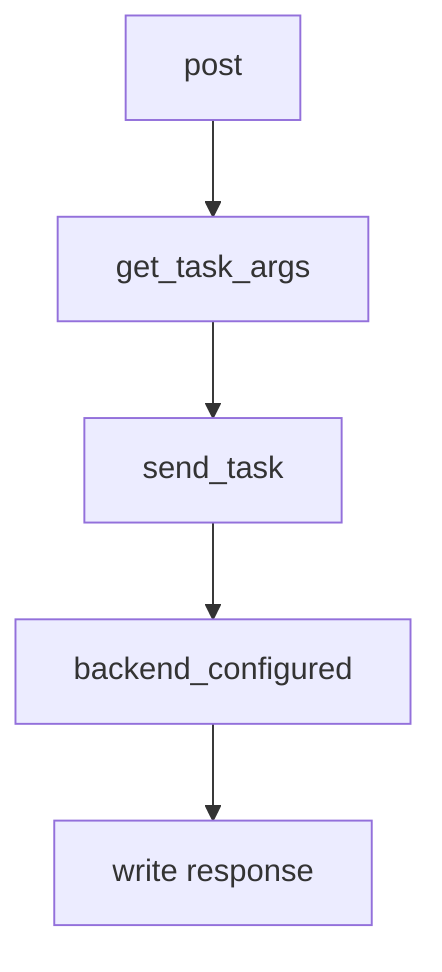
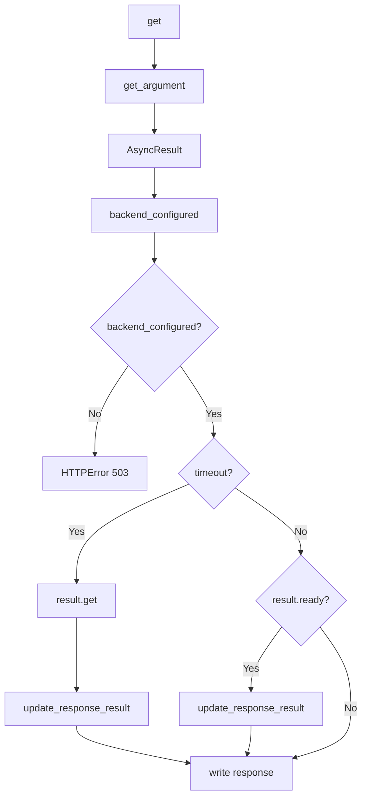
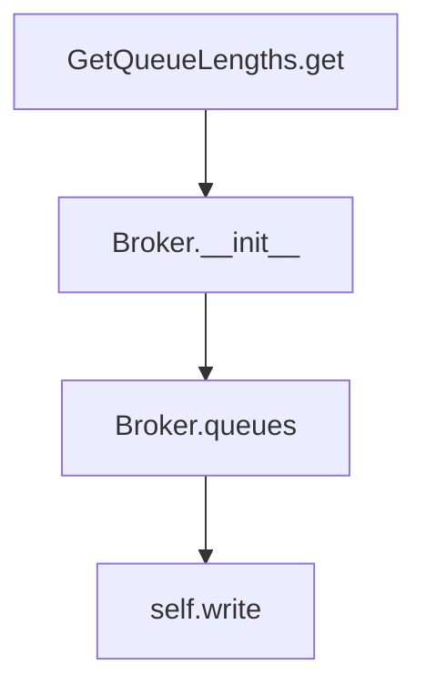
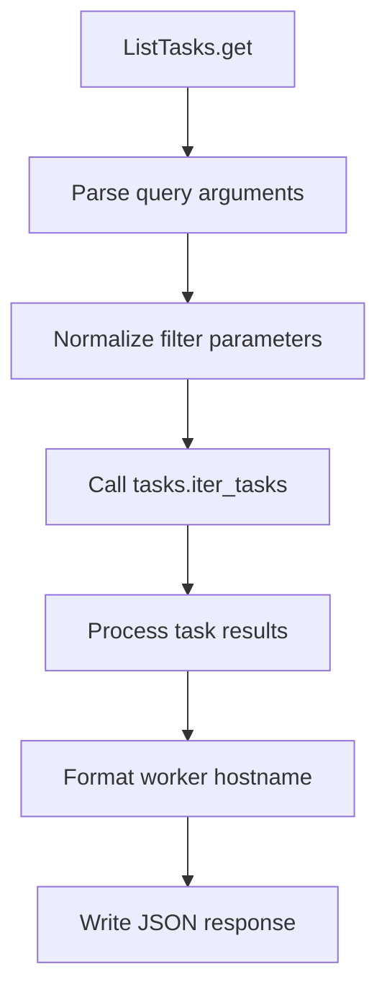

# `tasks.py`

## `flower.api.tasks.BaseTaskHandler` · *class*

## Summary:
BaseTaskHandler is a base class for API handlers that process Celery task-related requests, providing utilities for parsing task arguments, managing task options, and formatting task results.

## Description:
This class extends BaseApiHandler to provide specialized functionality for handling Celery task operations in the Flower web application. It serves as a foundation for concrete task handler implementations that need to parse incoming task requests, normalize task execution options, and format responses with task results or error information.

The class handles common task processing concerns such as argument parsing from JSON requests, option normalization (converting string timestamps to datetime objects), and safe result serialization that prevents JSON serialization errors. It also provides utility methods for checking backend configuration and safely handling task results.

## State:
- DATE_FORMAT (class attribute): String format for parsing datetime values from task options, set to '%Y-%m-%d %H:%M:%S.%f'
- Inherits all state from BaseApiHandler including authentication configuration and request handling infrastructure

## Lifecycle:
- Creation: Instantiated automatically by Tornado web framework when handling API requests to task endpoints
- Usage: Methods are called during the normal request processing lifecycle, typically starting with get_task_args() to parse incoming data, followed by normalize_options() for option processing, and finally update_response_result() for result formatting
- Destruction: Managed by Tornado framework's request lifecycle

## Method Map:


## Raises:
- tornado.web.HTTPError: Raised with status code 400 when JSON parsing fails, options are invalid, or args are not an array
- tornado.web.HTTPError: Raised with status code 401 when authentication fails (inherited from BaseApiHandler)

## Example:
```python
# Typical usage in a concrete task handler:
args, kwargs, options = self.get_task_args()
self.normalize_options(options)
response = {'task_id': task_id}
self.update_response_result(response, result)
```

### `flower.api.tasks.BaseTaskHandler.get_task_args` · *method*

## Summary:
Parses and validates JSON request body to extract task arguments, keyword arguments, and additional options.

## Description:
Extracts task execution parameters from the HTTP request body by parsing JSON data. This method serves as a utility for handling task submission requests, separating the raw request data into structured components: positional arguments, keyword arguments, and additional configuration options. It performs validation to ensure proper data types and formats.

The method processes the request body by:
1. Parsing JSON content from the request body
2. Extracting 'args' and 'kwargs' fields from the parsed options
3. Validating that extracted arguments conform to expected types

This logic is separated into its own method to provide reusable parsing and validation functionality for task submission endpoints.

## Args:
    self: The BaseTaskHandler instance containing the HTTP request context.

## Returns:
    tuple[list, dict, dict]: A tuple containing:
        - args (list): Positional arguments for the task, defaults to empty list if not present
        - kwargs (dict): Keyword arguments for the task, defaults to empty dict if not present  
        - options (dict): Additional configuration options not related to arguments

## Raises:
    HTTPError: Raised with status code 400 when:
        - JSON parsing fails due to malformed request body
        - The parsed options are not a dictionary
        - The args field is not a list or tuple

## State Changes:
    Attributes READ: 
        - self.request.body: Raw request body content
    Attributes WRITTEN: None

## Constraints:
    Preconditions:
        - The request body must be valid JSON or empty
        - The parsed JSON must represent a dictionary structure
        - The 'args' field must be either a list or tuple
    
    Postconditions:
        - Returns a tuple with exactly three elements: [args, kwargs, options]
        - All returned values are properly typed according to their expected structure
        - The original options dictionary is modified in-place by popping 'args' and 'kwargs'

## Side Effects:
    None

### `flower.api.tasks.BaseTaskHandler.backend_configured` · *method*

## Summary:
Checks whether a Celery result object has a configured backend for storing task results.

## Description:
Determines if the backend associated with a Celery task result is enabled and capable of storing task metadata. This utility function is used to verify that task result storage is properly configured before attempting to retrieve or process task results.

## Args:
    result (AsyncResult): A Celery AsyncResult object whose backend configuration needs to be checked.

## Returns:
    bool: True if the result's backend is not a DisabledBackend instance, indicating a configured backend is available. False if the backend is DisabledBackend, meaning no result storage is configured.

## Raises:
    None explicitly raised.

## State Changes:
    - Attributes READ: result.backend
    - Attributes WRITTEN: None

## Constraints:
    - Preconditions: The result parameter must be a valid Celery AsyncResult object.
    - Postconditions: The method returns a boolean value indicating backend configuration status without modifying the input object.

## Side Effects:
    - None

### `flower.api.tasks.BaseTaskHandler.write_error` · *method*

## Summary:
Sets the HTTP response status code for error responses in the BaseTaskHandler class.

## Description:
This method overrides Tornado's default error handling mechanism to set the HTTP status code for error responses. It is part of the BaseTaskHandler class, which inherits from BaseApiHandler, and is called by the Tornado framework when an error occurs during request processing. This implementation provides a minimal error response that only sets the status code, allowing subclasses to override it for more detailed error formatting.

The method is invoked during the normal request lifecycle when Tornado detects an error condition, such as when an HTTPError is raised or when an exception occurs during request processing.

## Args:
    status_code (int): The HTTP status code to set for the response
    **kwargs: Additional keyword arguments passed by the Tornado framework containing error information (not used in this implementation)

## Returns:
    None: This method does not return a value

## Raises:
    None: This method does not explicitly raise exceptions

## State Changes:
    Attributes READ: None
    Attributes WRITTEN: None

## Constraints:
    Preconditions: The status_code must be a valid HTTP status code integer
    Postconditions: The response object's status code will be set to the provided value

## Side Effects:
    I/O: Writes the HTTP status code to the response header

### `flower.api.tasks.BaseTaskHandler.update_response_result` · *method*

## Summary:
Updates a response dictionary with task result data, including traceback information for failed tasks.

## Description:
This method populates a response dictionary with task execution results, handling both successful and failed task states. When a task fails, it includes both the result and traceback information in the response. For successful tasks, it only includes the result. The method leverages the `safe_result` helper to ensure task results are properly serialized for API responses.

This method is designed to standardize how task results are formatted in API responses, ensuring consistent data presentation regardless of task execution outcome. It separates the responsibility of result formatting from the main request handling logic.

## Args:
    response (dict): Dictionary to be updated with task result data
    result (AsyncResult): Celery task result object containing state and result information

## Returns:
    None: This method modifies the response dictionary in-place

## Raises:
    None explicitly raised

## State Changes:
    Attributes READ: None
    Attributes WRITTEN: None

## Constraints:
    Preconditions: 
    - The response parameter must be a mutable dictionary
    - The result parameter must be a Celery AsyncResult object with a state attribute
    - The result.state must be comparable to celery.states.FAILURE
    
    Postconditions:
    - The response dictionary will be updated with result data
    - If result.state equals states.FAILURE, response will contain 'result' and 'traceback' keys
    - Otherwise, response will contain only the 'result' key

## Side Effects:
    None

### `flower.api.tasks.BaseTaskHandler.normalize_options` · *method*

## Summary:
Converts string representations of time-related task options into appropriate Python types for Celery task scheduling.

## Description:
This method normalizes time-based task options by converting string representations into their proper Python types. It processes three specific keys: 'eta' (estimated time of arrival), 'countdown' (time delay before execution), and 'expires' (task expiration time). The method ensures these parameters are properly formatted for Celery's task backend. This normalization happens during task submission to maintain consistency between string inputs from API requests and Python object types expected by Celery.

## Args:
    options (dict): Dictionary containing task options that may include time-related keys ('eta', 'countdown', 'expires')
                    Keys may contain string representations of dates/times or numeric values

## Returns:
    None: This method modifies the options dictionary in-place

## Raises:
    ValueError: When 'eta' or 'expires' contains invalid datetime string format that doesn't match self.DATE_FORMAT
                When 'countdown' cannot be converted to float

## State Changes:
    Attributes READ: self.DATE_FORMAT
    Attributes WRITTEN: None

## Constraints:
    Preconditions: 
    - The options dictionary must be mutable (passed by reference)
    - self.DATE_FORMAT must be defined as a valid datetime format string
    - Time-related keys in options must either be strings representing dates/times or numeric values
    
    Postconditions:
    - 'eta' key, if present, will be converted to a datetime.datetime object
    - 'countdown' key, if present, will be converted to a float
    - 'expires' key, if present, will be either a float or datetime.datetime object

## Side Effects:
    None: This method performs only in-place modifications to the input options dictionary

### `flower.api.tasks.BaseTaskHandler.safe_result` · *method*

## Summary:
Converts a result object to a JSON-serializable format, falling back to a string representation if serialization fails.

## Description:
This method ensures that task results can be safely serialized to JSON for API responses. It attempts to serialize the result using json.dumps(), and if that fails due to a TypeError (indicating the result contains non-JSON-serializable objects), it falls back to using repr() to create a string representation of the object. This method is typically called when preparing task results for HTTP responses in the Flower API.

## Args:
    result (Any): The result object to be made JSON-safe

## Returns:
    Any: Either the original result if it's JSON-serializable, or a string representation of the result if it isn't

## Raises:
    None explicitly raised

## State Changes:
    Attributes READ: None
    Attributes WRITTEN: None

## Constraints:
    Preconditions: The result parameter can be any Python object
    Postconditions: The returned value is either the original result (if JSON-serializable) or a string representation of the result

## Side Effects:
    None

## `flower.api.tasks.TaskApply` · *class*

## Summary:
TaskApply is a Tornado web handler that processes POST requests to invoke Celery tasks asynchronously and return their results.

## Description:
This class implements a RESTful API endpoint for executing Celery tasks through HTTP POST requests. It serves as the primary interface for triggering task execution in the Flower monitoring application. The handler parses incoming JSON requests, validates task existence, normalizes execution options, and asynchronously executes tasks while collecting and returning results.

The class inherits from BaseTaskHandler, which extends BaseApiHandler to provide specialized functionality for handling Celery task operations. TaskApply specifically focuses on the HTTP POST operation for task invocation, making it suitable for clients that need to submit tasks and wait for their completion.

## State:
- Inherits all state from BaseTaskHandler including authentication configuration and request handling infrastructure
- No additional instance attributes beyond those inherited from the parent class

## Lifecycle:
- Creation: Instantiated automatically by Tornado web framework when handling POST requests to task endpoints
- Usage: Called via Tornado's HTTP request processing when a POST request matches the route pattern for task execution
- Destruction: Managed by Tornado framework's request lifecycle

## Method Map:


## Raises:
- HTTPError(404): When the requested task name is not found in the Celery app registry
- HTTPError(400): When task options are invalid or JSON parsing fails
- HTTPError(401): When authentication fails (inherited from BaseApiHandler)

## Example:
```python
# Client sends POST request to /api/task/apply/my_task_name
# Request body:
{
    "args": [1, 2, 3],
    "kwargs": {"key": "value"},
    "options": {"countdown": 5}
}

# Server responds with:
{
    "task-id": "abc123",
    "result": "task completed successfully",
    "state": "SUCCESS"
}
```

### `flower.api.tasks.TaskApply.post` · *method*

## Summary:
Asynchronously invokes a Celery task with provided arguments and options, returning the task ID and results.

## Description:
This method handles POST requests to execute Celery tasks by parsing incoming request data, validating the requested task exists, normalizing execution options, and asynchronously executing the task. It serves as the primary entry point for task invocation through the Flower API.

The method follows a standard workflow:
1. Parses JSON request body to extract task arguments and options
2. Validates that the requested task exists in the Celery app registry
3. Normalizes time-based task options (eta, countdown, expires)
4. Executes the task asynchronously using Celery's apply_async
5. Waits for task completion and formats the response with results

This logic is encapsulated in its own method to separate task invocation concerns from request handling and provide a clean interface for task execution.

## Args:
    self: The TaskApply instance handling the HTTP request
    taskname (str): Name of the Celery task to invoke

## Returns:
    None: Response is written directly to the HTTP response via self.write()

## Raises:
    HTTPError: With status code 404 when the requested task name is not found in the Celery app
    HTTPError: With status code 400 when task options are invalid or JSON parsing fails

## State Changes:
    Attributes READ:
        - self.capp: Celery application instance containing task registry
        - self.request.body: Raw HTTP request body for argument parsing
    Attributes WRITTEN:
        - self.write(): Writes the final response to the HTTP client

## Constraints:
    Preconditions:
        - The taskname must correspond to a registered task in self.capp.tasks
        - The request body must contain valid JSON with proper task argument structure
        - Task options must be compatible with Celery's apply_async method
        
    Postconditions:
        - A task is successfully queued for execution in Celery
        - The HTTP response contains a JSON object with 'task-id' field
        - If backend is configured, response includes task state information

## Side Effects:
    - Makes asynchronous call to Celery task execution via apply_async
    - Performs blocking I/O operation through run_in_executor for result waiting
    - Writes HTTP response directly to client connection

### `flower.api.tasks.TaskApply.wait_results` · *method*

## Summary:
Waits for a Celery task result and updates the response with task state and result data.

## Description:
This method blocks until the specified Celery task completes, retrieves the result without propagating exceptions, and updates the response dictionary with task execution information. It handles both successful and failed task outcomes by incorporating result data and state information into the response. The method is typically called during asynchronous task processing to ensure proper result handling and response construction.

This method is part of the BaseTaskHandler class and is used in the task processing pipeline where task results need to be collected and formatted for API responses. It ensures that the response contains complete task information including both the result data and the current task state when a backend is configured.

## Args:
    result (AsyncResult): Celery task result object representing the asynchronous task
    response (dict): Dictionary to be updated with task result and state information

## Returns:
    dict: The updated response dictionary containing task result data and state

## Raises:
    None explicitly raised

## State Changes:
    Attributes READ: None
    Attributes WRITTEN: None

## Constraints:
    Preconditions:
    - The result parameter must be a valid Celery AsyncResult object
    - The response parameter must be a mutable dictionary
    - The result.get() operation should not raise exceptions due to propagate=False parameter
    
    Postconditions:
    - The response dictionary will be updated with task result data
    - If backend is configured, the response will include the task state
    - The method will block until the task completes

## Side Effects:
    - Calls result.get(propagate=False) which may block until task completion
    - Makes external calls to update_response_result and backend_configured methods
    - May perform I/O operations when accessing task result data

## `flower.api.tasks.TaskAsyncApply` · *class*

## Summary:
TaskAsyncApply handles POST requests to submit Celery tasks for asynchronous execution, returning the task identifier and optional execution state.

## Description:
This class implements a Tornado web handler for submitting Celery tasks asynchronously. It processes HTTP POST requests to invoke tasks by name, parsing arguments from the request body, validating task existence, normalizing execution options, and executing the task via Celery's async interface. The handler is decorated with @web.authenticated, ensuring authentication is required before task submission.

The class serves as a concrete implementation for asynchronous task invocation in the Flower web application, leveraging BaseTaskHandler's utility methods for argument parsing and option normalization while implementing the core task execution logic. It follows a standard pattern of request parsing → validation → task execution → response generation.

## State:
- Inherits all state from BaseTaskHandler including authentication configuration and request handling infrastructure
- taskname (method parameter): String identifier for the Celery task to execute, used to look up the task in self.capp.tasks

## Lifecycle:
- Creation: Automatically instantiated by Tornado web framework when handling API requests to task endpoints
- Usage: Called during the normal request processing lifecycle when a POST request is made to a task endpoint
- Destruction: Managed by Tornado framework's request lifecycle

## Method Map:


## Raises:
- HTTPError: Raised with status code 404 when the specified taskname is not found in self.capp.tasks
- HTTPError: Raised with status code 400 when:
  - Task arguments cannot be parsed from the request body
  - Task options contain invalid time-related values that fail normalization
  - Request body is malformed JSON
- HTTPError: Raised with status code 401 when authentication fails (inherited from BaseApiHandler)

## Example:
```python
# Submitting a task via HTTP POST to /api/task/async-apply/my_task
# Request body: {"args": [1, 2], "kwargs": {"delay": 5}, "options": {}}
# Response: {"task-id": "abc123-def456-ghi789"}
```

### `flower.api.tasks.TaskAsyncApply.post` · *method*

## Summary:
Submits a Celery task for asynchronous execution with provided arguments and options, returning the task identifier and optional execution state.

## Description:
Handles POST requests to invoke Celery tasks asynchronously. This method processes incoming task invocation requests by parsing arguments from the request body, validating task existence, normalizing task options, and executing the task via Celery's async interface. The response includes the task identifier and, if a result backend is configured, the initial task state.

This method is specifically designed for asynchronous task execution and separates the concerns of request parsing, validation, and task invocation into distinct phases. It leverages the BaseTaskHandler's utility methods for argument parsing and option normalization while implementing the core task execution logic.

The method operates within the Tornado web framework's request lifecycle, where authentication is handled by the @web.authenticated decorator inherited from BaseApiHandler. It follows a standard pattern of request parsing → validation → task execution → response generation.

## Args:
    self: The TaskAsyncApply instance handling the HTTP request
    taskname (str): Name of the Celery task to execute, used to look up the task in self.capp.tasks

## Returns:
    None: Response is written directly to the HTTP response via self.write()

## Raises:
    HTTPError: Raised with status code 404 when the specified taskname is not found in self.capp.tasks
    HTTPError: Raised with status code 400 when:
        - Task arguments cannot be parsed from the request body
        - Task options contain invalid time-related values that fail normalization
        - Request body is malformed JSON
    HTTPError: Raised with status code 401 when authentication fails (inherited from BaseApiHandler)

## State Changes:
    Attributes READ:
        - self.capp.tasks: Dictionary mapping task names to Celery task objects
        - self.request.body: Raw request body content for argument parsing
        - self.DATE_FORMAT: Class attribute for datetime parsing
        - self.backend: Backend configuration for result storage checking
        - self.application.options.basic_auth: Authentication configuration
        - self.application.options.auth: OAuth2 authentication configuration
    Attributes WRITTEN:
        - self.write(): Writes the response to the HTTP response stream

## Constraints:
    Preconditions:
        - The taskname parameter must correspond to a registered Celery task in self.capp.tasks
        - The request body must contain valid JSON with task arguments and options
        - Task options must be compatible with Celery's apply_async method signature
        - Authentication must be properly configured or unauthenticated access must be explicitly enabled
        
    Postconditions:
        - A Celery task is submitted for asynchronous execution
        - The HTTP response contains a JSON object with 'task-id' field
        - If backend is configured, the response also includes the 'state' field

## Side Effects:
    - Initiates asynchronous task execution via Celery's apply_async method
    - Makes external calls to Celery's task execution infrastructure
    - Writes HTTP response data to the client connection
    - May trigger database or cache operations if result backend is configured

## `flower.api.tasks.TaskSend` · *class*

## Summary:
TaskSend is a Tornado web handler that processes POST requests to invoke Celery tasks and returns task identifiers along with optional state information.

## Description:
This class implements a RESTful API endpoint for submitting Celery tasks through HTTP POST requests. It inherits from BaseTaskHandler to leverage shared functionality for parsing task arguments and managing task options. The handler authenticates requests using the @web.authenticated decorator and processes incoming JSON payloads to extract task parameters, send tasks to Celery, and return structured responses containing task IDs and optionally current task states.

The class serves as part of the Flower web interface's task management system, enabling programmatic task invocation via API calls while maintaining security through authentication and proper request validation.

## State:
- Inherits all state from BaseTaskHandler including authentication infrastructure and request handling capabilities
- No additional instance attributes defined in this class

## Lifecycle:
- Creation: Instantiated automatically by Tornado web framework when handling API requests to task endpoints
- Usage: Called during HTTP request processing when a POST request is made to a task endpoint, typically following the pattern: 
  1. Request arrives with JSON payload containing task arguments
  2. @web.authenticated decorator ensures authentication
  3. post() method parses arguments and sends task via Celery
  4. Response is written back to client
- Destruction: Managed by Tornado framework's request lifecycle

## Method Map:


## Raises:
- tornado.web.HTTPError: Raised with status code 400 when JSON parsing fails, options are invalid, or args are not an array (inherited from BaseTaskHandler.get_task_args)
- tornado.web.HTTPError: Raised with status code 401 when authentication fails (inherited from BaseApiHandler)

## Example:
```python
# Example request to invoke a task named "myapp.tasks.add"
# POST /api/task/send/myapp.tasks.add
# Body: {"args": [2, 3], "kwargs": {"delay": 10}}
# Response: {"task-id": "abc123-def456-ghi789", "state": "PENDING"}

# Example request with backend configured
# POST /api/task/send/myapp.tasks.process
# Body: {"args": ["file.txt"], "options": {"expires": 3600}}
# Response: {"task-id": "xyz987-wvu654-tsr321", "state": "SUCCESS"}
```

### `flower.api.tasks.TaskSend.post` · *method*

## Summary:
Invokes a Celery task with specified arguments and returns the task identifier along with optional state information.

## Description:
This method handles POST requests to execute Celery tasks by parsing incoming request data, sending the task through the Celery application, and returning a structured response containing the task ID. The method integrates with the Flower web interface's task management capabilities, allowing users to submit tasks via API calls.

The method follows a standard workflow:
1. Parses the request body to extract task arguments and options
2. Sends the task using Celery's send_task mechanism
3. Constructs a response with the task ID
4. Optionally includes the task's current state if result backend is configured

This logic is encapsulated in its own method to provide a clean separation between request parsing, task execution, and response formatting, making it reusable and testable.

## Args:
    self: The TaskSend instance handling the HTTP request
    taskname (str): Name of the Celery task to invoke

## Returns:
    None: This method writes the response directly to the HTTP response stream using the Tornado web framework's write method

## Raises:
    HTTPError: Raised with status code 400 when:
        - JSON parsing fails due to malformed request body
        - The parsed options are not a dictionary
        - The args field is not a list or tuple
    HTTPError: Raised with status code 401 when authentication fails (inherited from BaseApiHandler)

## State Changes:
    Attributes READ:
        - self.request.body: Raw request body content
        - self.capp: Celery application instance
        - self.backend_configured: Backend configuration check method
        - self.get_task_args: Task argument parsing method
    Attributes WRITTEN: 
        - None: This method doesn't modify persistent object state

## Constraints:
    Preconditions:
        - The request body must be valid JSON or empty
        - The parsed JSON must represent a dictionary structure
        - The 'args' field must be either a list or tuple
        - The taskname parameter must correspond to a registered Celery task
        - Authentication must be successful (handled by @web.authenticated decorator)
    
    Postconditions:
        - A JSON response is written to the HTTP stream containing task ID
        - If backend is configured, the response includes the task's current state
        - The task is successfully queued for execution by Celery

## Side Effects:
    - Makes a call to Celery's send_task method, which may involve network communication with broker
    - Writes HTTP response data to the client using Tornado's write method
    - May trigger task execution in the Celery worker pool

## `flower.api.tasks.TaskResult` · *class*

## Summary:
TaskResult is a Tornado web handler that retrieves and formats the current state and result of a Celery task for API consumption.

## Description:
This class implements a GET endpoint for retrieving task information from the Flower web application's API. It provides real-time status updates and results for Celery tasks by interfacing with Celery's AsyncResult mechanism. The handler supports optional timeout parameters for waiting on task completion and handles various task states including pending, running, successful, and failed executions.

The class extends BaseTaskHandler to inherit common task processing utilities while implementing the specific GET request logic for task result retrieval. It ensures proper backend configuration validation and provides standardized JSON responses for task status information.

## State:
- taskid (method parameter): String identifier of the Celery task being queried
- timeout (method parameter): Optional float value specifying maximum wait time for task completion
- result (AsyncResult): Celery result object representing the task state and data
- response (dict): Dictionary containing the formatted API response with task information

## Lifecycle:
- Creation: Instantiated automatically by Tornado web framework when handling GET requests to task result endpoints
- Usage: Called via Tornado's request processing pipeline when accessing task result URLs with a valid task ID
- Destruction: Managed by Tornado framework's request lifecycle

## Method Map:


## Raises:
- tornado.web.HTTPError: Raised with status code 503 when the Celery backend is not properly configured for the requested task
- tornado.web.HTTPError: Raised with status code 401 when authentication fails (inherited from BaseApiHandler)

## Example:
```python
# Request: GET /api/task/result/abc123?timeout=30.0
# Response: {"task-id": "abc123", "state": "SUCCESS", "result": "task completed"}

# Request: GET /api/task/result/def456
# Response: {"task-id": "def456", "state": "PENDING"}
```

### `flower.api.tasks.TaskResult.get` · *method*

## Summary:
Retrieves and returns the status and result of a Celery task, with optional timeout handling.

## Description:
This method handles HTTP GET requests to fetch the current state and result of a Celery task identified by its task ID. It supports optional timeout parameters to control how long to wait for task completion. The method interacts with Celery's result backend to retrieve task information and formats the response accordingly.

The method follows these execution paths:
1. When a timeout is specified and the task is not yet ready, it blocks waiting for the task to complete (up to the timeout duration)
2. When no timeout is specified but the task is ready, it immediately retrieves the result
3. In both cases, it updates the response with detailed task information

## Args:
    taskid (str): The unique identifier of the Celery task to retrieve.

## Returns:
    None: This method writes the response directly to the HTTP response stream via self.write().

## Raises:
    HTTPError: Raised with status code 503 if the Celery backend is not properly configured for the task.

## State Changes:
    Attributes READ: 
        - self.get_argument (used to extract timeout parameter)
        - result.state (accessed from AsyncResult object)
    Attributes WRITTEN: 
        - response dictionary (constructed and modified in method)
        - self.write (called to send response)

## Constraints:
    Preconditions:
        - The task with the given taskid must exist in the Celery system.
        - The Celery backend must be properly configured to retrieve task results.
    Postconditions:
        - A JSON response containing task-id and state is written to the HTTP response.
        - If timeout is specified and task completes successfully, the response includes the task result.
        - If task is ready without timeout, the response includes the task result.

## Side Effects:
    - Makes a blocking call to result.get() when timeout is specified, potentially delaying response.
    - May make calls to external services if the Celery backend is remote (e.g., Redis, database).
    - Writes directly to HTTP response stream via self.write().

## `flower.api.tasks.TaskAbort` · *class*

## Summary:
TaskAbort is a Tornado web handler that implements the API endpoint for aborting Celery tasks that support abortion.

## Description:
This class handles POST requests to abort running Celery tasks that are compatible with the AbortableAsyncResult interface. It provides an authenticated API endpoint that allows administrators or authorized users to terminate long-running tasks before they complete. The handler verifies that the task backend is properly configured before attempting to abort the task.

The class inherits from BaseTaskHandler, which provides common task processing utilities and authentication handling. It specifically targets tasks that implement the abortable pattern supported by Celery's contrib.abortable module.

## State:
- Inherits all state from BaseTaskHandler including authentication infrastructure and task processing utilities
- No additional instance attributes beyond those inherited from the parent class

## Lifecycle:
- Creation: Instantiated automatically by Tornado web framework when handling API requests to the task abort endpoint
- Usage: Called via HTTP POST request with a task ID parameter; performs authentication check, validates backend configuration, and attempts to abort the specified task
- Destruction: Managed by Tornado framework's request lifecycle

## Method Map:
```mermaid
graph TD
    A[post] --> B[web.authenticated]
    B --> C[logger.info]
    C --> D[AbortableAsyncResult(taskid)]
    D --> E[backend_configured(result)]
    E --> F{backend_configured?}
    F -->|No| G[HTTPError(503)]
    F -->|Yes| H[result.abort()]
    H --> I[self.write]
```

## Raises:
- tornado.web.HTTPError: Raised with status code 503 when the Celery task backend is not properly configured for the specified task
- tornado.web.HTTPError: Raised with status code 401 when authentication fails (inherited from BaseTaskHandler)
- tornado.web.HTTPError: Raised with status code 400 when task ID is invalid or malformed (inherited from BaseTaskHandler)

## Example:
```python
# Example HTTP request to abort a task:
# POST /api/task/abort/<task_id>
# Response: {"message": "Aborted '<task_id>'"}

# Typical usage scenario:
# 1. User makes authenticated POST request to abort endpoint
# 2. Handler authenticates user
# 3. Handler checks if task backend is configured
# 4. Handler calls abort() on the task result
# 5. Handler returns success message
```

### `flower.api.tasks.TaskAbort.post` · *method*

## Summary:
Aborts a running Celery task by ID and returns a confirmation message.

## Description:
This method handles POST requests to abort a currently executing Celery task identified by its task ID. It leverages the AbortableAsyncResult class to perform the abortion operation and ensures proper backend configuration before attempting the abort. The method is part of the TaskAbort handler class that manages task cancellation operations in the Flower web interface.

Known callers:
- Tornado web framework during API request processing when a POST request is made to the task abortion endpoint
- Invoked during the request lifecycle when a client sends an abort command for a specific task

This logic is encapsulated in its own method to separate the task abortion concern from other task management operations and to provide a clean interface for the RESTful API endpoint.

## Args:
    self: The instance of the TaskAbort class
    taskid (str): The unique identifier of the Celery task to abort

## Returns:
    None: This method writes directly to the HTTP response using self.write()

## Raises:
    tornado.web.HTTPError: Raised with status code 503 when the Celery backend is not properly configured for abort operations

## State Changes:
    Attributes READ: None
    Attributes WRITTEN: None

## Constraints:
    Preconditions:
    - The task identified by taskid must be a valid Celery task that supports abortion
    - The Celery backend must be configured to support abort operations
    - The task must be currently running or queued (not already completed or failed)

    Postconditions:
    - The task abortion attempt is initiated
    - A success message is written to the HTTP response

## Side Effects:
    - Calls the AbortableAsyncResult.abort() method which may communicate with the Celery broker
    - Writes a JSON response containing the abortion confirmation message
    - Logs the abortion attempt using the logger

## `flower.api.tasks.GetQueueLengths` · *class*

## Summary:
GetQueueLengths is an asynchronous API handler that retrieves current message queue lengths from the broker for active queues.

## Description:
This class implements a GET endpoint that provides real-time monitoring of message queue workloads by fetching queue statistics from the configured message broker. It is designed to work specifically with AMQP-compatible brokers (like RabbitMQ) that support management APIs, and provides insights into active queue statuses for system monitoring and debugging purposes.

The handler is authenticated through the web.authenticated decorator and integrates with the Flower web application's task monitoring infrastructure. It dynamically discovers active queues from worker configurations and queries the broker for current queue information.

## State:
- Inherits all state from BaseTaskHandler including authentication configuration and request handling infrastructure
- No additional instance attributes beyond those inherited from the parent class

## Lifecycle:
- Creation: Instantiated automatically by Tornado web framework when handling API requests to the queue lengths endpoint
- Usage: Called during HTTP GET requests to retrieve queue information; executes asynchronously to fetch broker data and writes the response directly via self.write()
- Destruction: Managed by Tornado framework's request lifecycle

## Method Map:


## Raises:
- tornado.web.HTTPError: Raised with status code 401 when authentication fails (inherited from BaseApiHandler)
- Various exceptions may be raised during broker communication (network errors, HTTP errors) but are handled internally

## Example:
```python
# Typical usage:
# GET /api/queues/lengths
# Response: {"active_queues": [{"name": "queue1", "messages": 5}, ...]}
```

### `flower.api.tasks.GetQueueLengths.get` · *method*

## Summary:
Retrieves and returns the current lengths of active message queues from the broker.

## Description:
This asynchronous method fetches queue length information for all currently active queues by interacting with the message broker. It constructs a broker connection using the application's configuration and retrieves queue statistics, returning them in a JSON response. The method is typically called during API requests to monitor queue status and provides real-time visibility into message queue workloads.

## Args:
    None

## Returns:
    None (writes JSON response directly via self.write())

## Raises:
    None explicitly raised

## State Changes:
    Attributes READ: 
    - self.application
    - self.capp
    - self.get_active_queue_names()

## Constraints:
    Preconditions:
    - The application must have a valid transport configuration set to 'amqp'
    - The broker API must be configured if using AMQP transport
    - Active queue names must be retrievable via self.get_active_queue_names()
    - The broker connection must be successfully established

    Postconditions:
    - A JSON response containing active queue information is written to the HTTP response
    - Queue information includes length and other metadata for each active queue

## Side Effects:
    - Makes asynchronous calls to the message broker for queue information
    - Writes HTTP response data
    - Creates a Broker instance with connection details
    - May involve network I/O operations to communicate with the broker

## `flower.api.tasks.ListTasks` · *class*

## Summary:
ListTasks is an API endpoint handler that retrieves and filters Celery tasks from the event stream, returning them as a JSON response with optional pagination and filtering parameters.

## Description:
This class implements a GET endpoint for listing Celery tasks in the Flower web application. It processes various query parameters to filter and sort tasks, then fetches matching tasks from the event stream using utility functions. The handler is decorated with @web.authenticated, ensuring only authenticated users can access task listings.

The class serves as part of the Flower monitoring interface, allowing users to view task history with customizable filters for worker, task type, state, date ranges, and search terms. It provides a paginated view of tasks through limit and offset parameters.

## State:
- Inherits all state from BaseTaskHandler including authentication handling and request processing infrastructure
- No additional instance attributes beyond those inherited from the parent class

## Lifecycle:
- Creation: Instantiated automatically by Tornado web framework when handling GET requests to the tasks listing endpoint
- Usage: The get() method is invoked during the HTTP GET request processing, parsing query parameters and generating a JSON response
- Destruction: Managed by Tornado framework's request lifecycle

## Method Map:


## Raises:
- tornado.web.HTTPError: Raised with status code 401 when authentication fails (inherited from BaseApiHandler)
- tornado.web.HTTPError: Raised with status code 400 for invalid argument values (inherited from BaseTaskHandler)

## Example:
```python
# Example request:
# GET /api/tasks?limit=10&offset=0&workername=worker1&taskname=task_type&state=SUCCESS

# Response format:
# {
#   "task_uuid_1": {
#     "name": "task_type",
#     "state": "SUCCESS",
#     "worker": "worker1",
#     "received": "2023-01-01 12:00:00"
#   },
#   ...
# }
```

### `flower.api.tasks.ListTasks.get` · *method*

## Summary:
Retrieves and filters task information from Celery events, returning a JSON-encoded ordered dictionary of task details.

## Description:
This method handles HTTP GET requests to fetch task data from the Flower monitoring interface. It processes various query parameters to filter and sort tasks, then formats the results for JSON serialization. The method serves as the backend endpoint for retrieving task information in the Flower web UI.

Known callers:
- HTTP GET requests to the `/tasks` endpoint in the Flower web application
- Invoked during task listing operations in the Flower dashboard

This logic is separated into its own method to encapsulate the complex task filtering, parameter parsing, and response formatting logic, making it reusable and testable.

## Args:
- limit (str, optional): Maximum number of tasks to return (converted to int)
- offset (int): Number of tasks to skip (default: 0)
- workername (str, optional): Filter tasks by worker hostname (All means no filter)
- taskname (str, optional): Filter tasks by task name/type (All means no filter)
- state (str, optional): Filter tasks by execution state (All means no filter)
- received_start (str, optional): Filter tasks received after this timestamp (format: 'YYYY-MM-DD HH:MM')
- received_end (str, optional): Filter tasks received before this timestamp (format: 'YYYY-MM-DD HH:MM')
- sort_by (str, optional): Sort order for tasks ('timestamp' or 'name')
- search (str, optional): Search term to filter tasks by content

## Returns:
- OrderedDict: A dictionary mapping task IDs to task details, serialized as JSON

## Raises:
- None explicitly raised

## State Changes:
- Attributes READ: self.application, self.request.arguments
- Attributes WRITTEN: None

## Constraints:
- Preconditions: The method assumes that self.application.events is available and properly initialized
- Postconditions: The returned OrderedDict contains task data formatted according to Flower's task representation

## Side Effects:
- Writes JSON response to HTTP client via self.write()
- Performs time conversion operations on date string parameters
- Accesses Celery event stream data through self.application.events

## `flower.api.tasks.ListTaskTypes` · *class*

## Summary:
ListTaskTypes is an API handler that provides a JSON endpoint for retrieving the set of task types observed by the Celery event system.

## Description:
This class implements a GET endpoint that exposes the collection of unique task types that have been registered or executed within the Celery application's event stream. It serves as a monitoring interface for clients to query what types of tasks are currently being tracked by Flower's event monitoring capabilities.

The handler inherits from BaseTaskHandler, which provides common infrastructure for task-related API operations including authentication handling and request/response management. The @web.authenticated decorator ensures that only authenticated users can access this endpoint.

## State:
- Inherits all state from BaseTaskHandler including authentication configuration and request handling infrastructure
- No additional instance attributes beyond those inherited from the parent class

## Lifecycle:
- Creation: Instantiated automatically by the Tornado web framework when handling HTTP GET requests to the task types endpoint
- Usage: Called during the normal request processing lifecycle when a GET request is made to the task types endpoint
- Destruction: Managed by Tornado framework's request lifecycle

## Method Map:
```mermaid
graph TD
    A[ListTaskTypes.get] --> B[self.application.events.state.task_types()]
    B --> C[response construction]
    C --> D[self.write()]
```

## Raises:
- tornado.web.HTTPError: Raised with status code 401 when authentication fails (inherited from BaseTaskHandler)
- No explicit exceptions raised by the get method itself

## Example:
```python
# Accessing the endpoint would return:
{
    "task-types": [
        "tasks.add",
        "tasks.multiply",
        "utils.send_email"
    ]
}
```

### `flower.api.tasks.ListTaskTypes.get` · *method*

## Summary:
Returns a JSON response containing the set of task types that have been observed by the Celery event system.

## Description:
This method retrieves the collection of unique task types that have been registered or executed within the Celery application's event stream. It serves as an endpoint for clients to query what types of tasks are currently being tracked by Flower's monitoring capabilities. The method is typically invoked during HTTP GET requests to the task types endpoint.

This method is part of the ListTaskTypes handler class, which inherits from BaseTaskHandler and is decorated with @web.authenticated, indicating that authentication is required to access this endpoint. The BaseTaskHandler provides common functionality for task-related API endpoints, including authentication handling and request/response management.

## Args:
    None

## Returns:
    None (writes directly to the HTTP response via self.write())

## Raises:
    None explicitly raised

## State Changes:
    Attributes READ: 
    - self.application.events.state.task_types()
    - self.write()

## Constraints:
    Preconditions:
    - The method assumes that self.application.events.state is properly initialized and contains valid event tracking data.
    - The method expects that self.write() can successfully serialize and send the response.
    - Authentication must be successful for the request to proceed (inherited from BaseTaskHandler).

    Postconditions:
    - The HTTP response will contain a JSON object with a 'task-types' key mapping to a list of task type strings.

## Side Effects:
    - Writes serialized JSON data to the HTTP response stream
    - Makes no external service calls or I/O operations beyond the standard Tornado HTTP response mechanism

## `flower.api.tasks.TaskInfo` · *class*

## Summary:
TaskInfo is an API handler that retrieves and returns detailed information about a specific Celery task, including optional worker assignment details.

## Description:
This class implements a RESTful API endpoint for fetching task metadata by task ID. It extends BaseTaskHandler to inherit common task processing utilities and enforces authentication through the @web.authenticated decorator. The handler is designed to serve as a read-only interface for retrieving task status, arguments, and execution details from the Flower monitoring application.

The class specifically handles HTTP GET requests to `/task/info/<taskid>` endpoints, making it suitable for monitoring tools or client applications that need to query individual task states and properties.

## State:
- Inherits all state from BaseTaskHandler including authentication configuration and request handling infrastructure
- taskid (method parameter): String identifier for the target Celery task, passed as URL parameter
- self.application.events: Reference to the application's event state management system for task lookups

## Lifecycle:
- Creation: Instantiated automatically by Tornado web framework when handling matching HTTP GET requests
- Usage: Called during request processing when a GET request is made to the task info endpoint with a valid task ID
- Destruction: Managed by Tornado framework's request lifecycle

## Method Map:
```mermaid
graph TD
    A[GET request] --> B[web.authenticated decorator]
    B --> C[get_task_by_id]
    C --> D[task.as_dict()]
    D --> E[self.write()]
    C -->|No task found| F[HTTPError(404)]
```

## Raises:
- tornado.web.HTTPError: Raised with status code 404 when the specified task ID is not found in the application's event state
- tornado.web.HTTPError: Raised with status code 401 when authentication fails (inherited from BaseApiHandler)

## Example:
```python
# Request: GET /task/info/abc123def456
# Response: {"task_id": "abc123def456", "name": "my_task", "args": [], "kwargs": {}, "status": "SUCCESS"}
# If assigned to worker: {"task_id": "abc123def456", "name": "my_task", "worker": "worker1@hostname"}
```

### `flower.api.tasks.TaskInfo.get` · *method*

## Summary:
Retrieves and formats task information for a given task ID, returning worker details if available.

## Description:
This method handles HTTP GET requests to fetch detailed information about a specific Celery task. It retrieves the task from the application's event state using the tasks.get_task_by_id utility, constructs a response dictionary containing task details via the task's as_dict() method, and optionally includes the worker hostname if the task is assigned to a worker. The method is part of the TaskInfo handler class and is typically invoked during API requests to retrieve task status and metadata.

## Args:
    taskid (str): The unique identifier of the target Celery task

## Returns:
    None: This method writes the response directly to the HTTP response using self.write()

## Raises:
    HTTPError: Raised with status code 404 when the specified task ID is not found in the application's event state

## State Changes:
    Attributes READ: 
        - self.application.events
        - task.worker
    Attributes WRITTEN: None

## Constraints:
    Preconditions:
        - The taskid parameter must be a valid string representing a Celery task ID
        - The application must have an events attribute containing task state information
        - The task must exist in the event state for successful retrieval
    Postconditions:
        - If the task exists, a JSON response containing task details is written to the HTTP response
        - If the task doesn't exist, an HTTP 404 error is raised
        - The response includes worker hostname information when the task is assigned to a worker

## Side Effects:
    - Makes a read-only lookup in the application's event state
    - Writes JSON response data to the HTTP response stream

