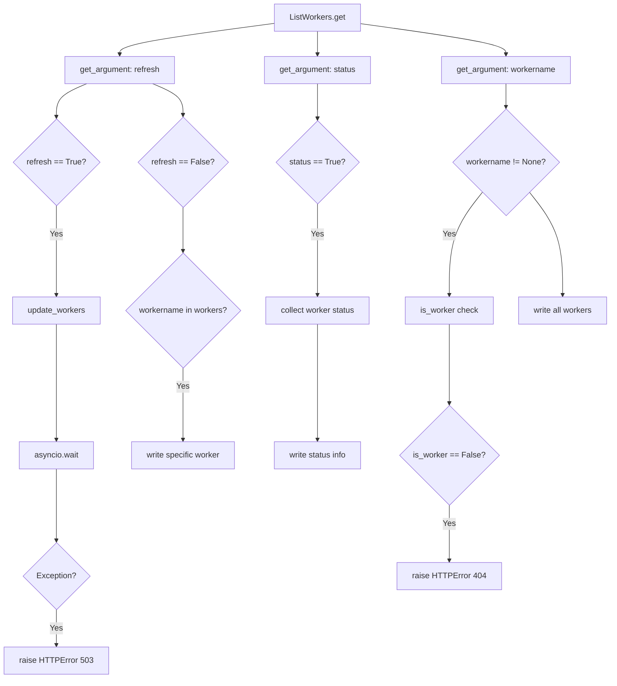

# `workers.py`

## `flower.api.workers.ListWorkers` · *class*

## Summary:
ListWorkers is a Tornado web handler that manages HTTP GET requests for retrieving worker information in the Flower monitoring interface.

## Description:
This class implements a RESTful API endpoint for retrieving information about Celery workers managed by the Flower application. It inherits from ControlHandler and provides functionality to fetch worker details, refresh worker data from external sources, and retrieve worker status information. The handler supports various query parameters to customize the response and integrates with the application's worker management system.

The class is designed to be used as part of the Flower web API, specifically handling requests to the /workers endpoint. It provides a centralized way to access worker information for monitoring purposes, with built-in authentication and error handling.

## State:
- self.application.workers: Dictionary mapping worker names to their metadata (type: dict)
- self.application.events.state.workers: Dictionary containing worker status information (type: dict)
- self.application.update_workers: Async method for refreshing worker data (type: callable)
- logger: Logger instance for error reporting (type: logging.Logger)

## Lifecycle:
- Creation: Automatically instantiated by Tornado web framework when handling HTTP GET requests to /workers endpoint
- Usage: Called via Tornado's request handling mechanism when client makes GET request to /workers
- Destruction: Managed by Tornado framework's request lifecycle

## Method Map:


## Raises:
- web.HTTPError(503): Raised when worker refresh operation fails due to external service issues
- web.HTTPError(404): Raised when requesting information for a worker that doesn't exist

## Example:
```python
# Typical usage would be via HTTP GET request:
# GET /workers?refresh=true&workername=worker1
# GET /workers?status=true
# GET /workers?workername=worker1

# The handler would respond with:
# {"worker1": {"hostname": "worker1@host", "pid": 12345}}
# Or for status: {"worker1": true, "worker2": false}
# Or for refresh failure: HTTP 503 error
```

### `flower.api.workers.ListWorkers.get` · *method*

## Summary:
Retrieves and returns worker information from the application, with optional refresh and status capabilities.

## Description:
This method handles HTTP GET requests to retrieve worker information. It supports refreshing worker data, retrieving worker status, and fetching specific worker details. The method integrates with the application's worker management system to provide real-time worker information.

This method is part of the ListWorkers class that inherits from ControlHandler. It processes request arguments to determine the appropriate worker data to return, including support for refreshing worker information from external sources.

Known callers:
- Tornado web framework routing for /workers endpoint
- Invoked during HTTP GET requests to the workers API endpoint

This logic is separated into its own method to handle the complex conditional flow of worker data retrieval, refresh operations, and error handling while maintaining clean separation of concerns in the web handler.

## Args:
    refresh (bool): Whether to refresh worker information from external sources
    status (bool): Whether to return worker status information only
    workername (str): Specific worker name to retrieve information for

## Returns:
    None (writes JSON response to HTTP response stream)

## Raises:
    web.HTTPError(503): When worker refresh operation fails
    web.HTTPError(404): When requesting information for an unknown worker

## State Changes:
    Attributes READ: 
    - self.application.workers
    - self.application.events.state.workers
    - self.application.update_workers
    - self.is_worker
    
    Attributes WRITTEN: 
    - None (writes to HTTP response stream only)

## Constraints:
    Preconditions:
    - self.application must have workers attribute
    - self.application must have events.state.workers attribute  
    - self.application must have update_workers method
    - self must have is_worker method
    - self must be an instance of ListWorkers class
    
    Postconditions:
    - HTTP response stream contains valid worker information
    - Appropriate HTTP status codes returned for errors

## Side Effects:
    - I/O operations for worker refresh via asyncio.wait
    - External service calls through self.application.update_workers
    - Logging of errors via logger.error
    - Writing to HTTP response stream via self.write

