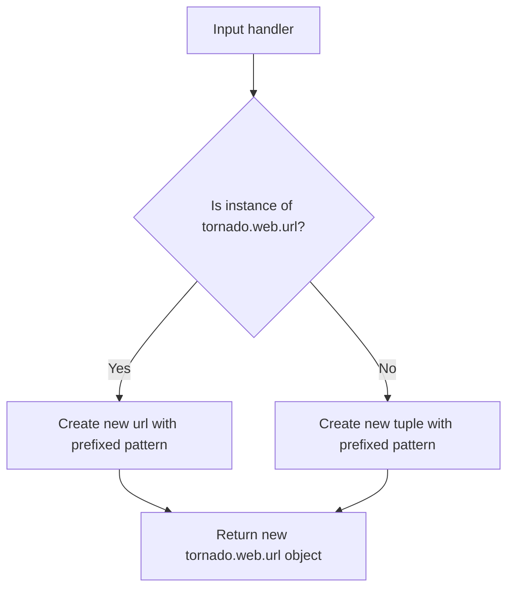
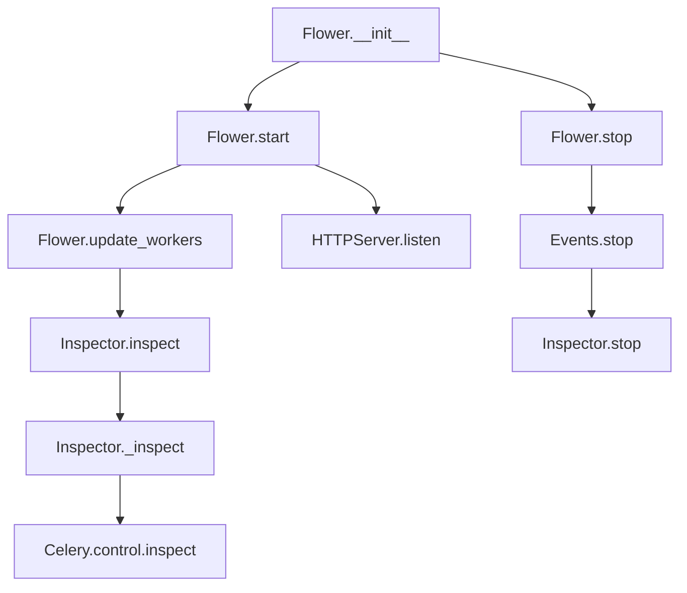

# `app.py`

## `flower.app.rewrite_handler` · *function*

## Summary:
Rewrites URL handler patterns by prepending a specified prefix to the URL path.

## Description:
This function takes a URL handler (either a tornado.web.url object or a tuple) and prepends a URL prefix to its path pattern. It is used to dynamically modify URL routing patterns, typically for mounting applications under sub-paths or applying common prefixes to URL routes.

## Args:
    handler (tornado.web.url or tuple): The URL handler to rewrite. If it's a tornado.web.url object, it contains regex pattern, handler class, kwargs, and name. If it's a tuple, it contains (pattern, handler_class).
    url_prefix (str): The URL prefix to prepend to the handler's path pattern. Leading and trailing slashes are stripped from this prefix.

## Returns:
    tornado.web.url or tuple: A new handler with the modified URL pattern. If the input was a tornado.web.url object, returns a new tornado.web.url object with updated pattern. If the input was a tuple, returns a new tuple with updated pattern.

## Raises:
    None explicitly raised.

## Constraints:
    Preconditions:
    - The handler parameter must be either a tornado.web.url object or a tuple with at least two elements.
    - The url_prefix parameter must be a string.
    
    Postconditions:
    - The returned handler maintains the same handler class and other properties as the input handler.
    - The URL pattern in the returned handler will have the url_prefix prepended to the original pattern.

## Side Effects:
    None.

## Control Flow:


## Examples:
    Example 1 - With tornado.web.url object:
        Input: handler = url(r'/api/users', UserHandler, {}, 'users'), url_prefix = '/v1'
        Output: url(r'/v1/api/users', UserHandler, {}, 'users')
        
    Example 2 - With tuple:
        Input: handler = (r'/users', UserHandler), url_prefix = '/api'
        Output: (r'/api/users', UserHandler)
        
    Example 3 - With prefix containing slashes:
        Input: handler = url(r'/profile', ProfileHandler), url_prefix = '/admin/v1'
        Output: url(r'/admin/v1/profile', ProfileHandler)

## `flower.app.Flower` · *class*

## Summary:
Flower is a web-based monitoring and management interface for Celery distributed task queues, built on Tornado web framework.

## Description:
Flower serves as a real-time monitoring dashboard that provides insights into Celery workers, tasks, and the overall state of a distributed task queue system. It allows users to view worker status, monitor task execution, inspect worker details, and manage task queues through a web browser interface.

The class extends Tornado's Application class to provide a complete web server implementation that integrates with Celery's event system and worker inspection capabilities. It manages the lifecycle of the monitoring interface, handles HTTP requests, and coordinates with Celery's control mechanisms to provide real-time information.

## State:
- options: Configuration options for the application, defaults to default_options if not provided
- io_loop: Tornado I/O event loop instance, defaults to the global instance if not provided  
- ssl_options: SSL configuration options for HTTPS support, defaults to None
- capp: Celery application instance, creates a default Celery instance if not provided
- executor: Thread pool executor for handling blocking operations, created with ThreadPoolExecutor
- inspector: Inspector instance for collecting worker status information
- events: Events instance for capturing and processing Celery events
- started: Boolean flag indicating whether the application has been started (False initially)

## Lifecycle:
Creation: Instantiate with optional configuration parameters (options, capp, events, io_loop). The constructor sets up the Tornado application with appropriate handlers and initializes internal components like the Celery app, executor, inspector, and events system.

Usage: Call start() method to begin serving HTTP requests and processing events. The application will listen on configured port/socket and maintain worker status information. To stop the application, call stop() method.

Destruction: Call stop() method to cleanly shut down the application, which stops event processing, shuts down executors, and stops the I/O loop.

## Method Map:


## Raises:
- None explicitly raised by the constructor. The transport property may raise AttributeError if capp.connection() does not return an object with a transport attribute, but this is handled gracefully with getattr.

## Example:
```python
# Create a Flower instance with default settings
app = Flower()

# Start the application
app.start()

# Later, stop the application
app.stop()
```

### `flower.app.Flower.__init__` · *method*

## Summary:
Initializes a Flower application instance with configuration options, Celery app integration, event handling, and asynchronous execution infrastructure.

## Description:
This method sets up the core components of a Flower web application, including URL routing configuration, Celery integration, event handling system, and asynchronous execution environment. It configures the application to handle HTTP requests through Tornado's web framework while providing monitoring capabilities for Celery workers and tasks.

## Args:
    options (object, optional): Configuration options for the application. If None, uses default_options. Must have url_prefix attribute for URL rewriting.
    capp (celery.Celery, optional): Celery application instance. If None, creates a new Celery instance with default settings.
    events (Events, optional): Event handling system instance. If None, creates a new Events instance.
    io_loop (tornado.ioloop.IOLoop, optional): Tornado I/O loop instance. If None, uses the default IOLoop instance.
    **kwargs: Additional keyword arguments passed to the parent class constructor.

## Returns:
    None: This method initializes the object's state and does not return a value.

## Raises:
    None explicitly raised.

## State Changes:
    Attributes READ:
        - self.max_workers (assumed to exist for executor creation)
        - self.pool_executor_cls (assumed to exist for executor creation)
        - self.options.inspect_timeout (assumed to exist for inspector initialization)
        - self.options.db (assumed to exist for events initialization)
        - self.options.persistent (assumed to exist for events initialization)
        - self.options.state_save_interval (assumed to exist for events initialization)
        - self.options.enable_events (assumed to exist for events initialization)
        - self.options.max_workers (assumed to exist for events initialization)
        - self.options.max_tasks (assumed to exist for events initialization)
    
    Attributes WRITTEN:
        - self.options: Set to provided options or default_options
        - self.io_loop: Set to provided io_loop or default IOLoop instance
        - self.ssl_options: Set from kwargs if present
        - self.capp: Set to provided capp or new Celery instance with imported modules
        - self.executor: Set to ThreadPoolExecutor instance
        - self.inspector: Set to Inspector instance
        - self.events: Set to provided events or new Events instance
        - self.started: Set to False

## Constraints:
    Preconditions:
        - The class must have self.max_workers attribute defined
        - The class must have self.pool_executor_cls attribute defined
        - The class must have self.options.inspect_timeout attribute defined
        - The class must have self.options.db attribute defined
        - The class must have self.options.persistent attribute defined
        - The class must have self.options.state_save_interval attribute defined
        - The class must have self.options.enable_events attribute defined
        - The class must have self.options.max_workers attribute defined
        - The class must have self.options.max_tasks attribute defined
    
    Postconditions:
        - self.options is properly initialized with either provided options or default_options
        - self.io_loop is properly initialized with either provided io_loop or default instance
        - self.capp is properly initialized with either provided capp or new Celery instance
        - self.executor is properly initialized with appropriate thread pool
        - self.inspector is properly initialized with io_loop, capp, and timeout
        - self.events is properly initialized with either provided events or new Events instance
        - self.started is set to False

## Side Effects:
    - Creates and configures a new Celery application instance with default module imports
    - Initializes a ThreadPoolExecutor for asynchronous operations
    - Sets the default executor on the I/O loop
    - Creates an Inspector instance for monitoring Celery workers
    - Creates an Events instance for capturing and processing Celery events
    - May create or access database files for persistent event storage
    - Starts background threads for event handling and periodic callbacks

### `flower.app.Flower.start` · *method*

## Summary:
Starts the Flower web application server and initializes its event handling system.

## Description:
This method initializes the Flower web application by starting the event handling system, setting up the HTTP server either on a TCP port or Unix socket, marking the application as started, updating worker information, and beginning the I/O loop execution. It serves as the main entry point for launching the Flower monitoring interface.

The method handles two server binding modes:
1. TCP socket binding when unix_socket option is not set
2. Unix domain socket binding when unix_socket option is configured

This method is typically called during the application startup phase to begin serving the Flower web interface.

## Args:
    None

## Returns:
    None

## Raises:
    None explicitly raised

## State Changes:
    Attributes READ: self.events, self.options, self.ssl_options, self.io_loop, self.inspector
    Attributes WRITTEN: self.started (set to True), triggers self.update_workers() call

## Constraints:
    Preconditions: The Flower instance must be properly initialized with valid options and event system.
    Postconditions: The HTTP server is running, events are being processed, and the I/O loop is actively processing requests.

## Side Effects:
    I/O: Creates network connections (TCP or Unix socket) and starts listening for incoming requests.
    External service calls: Initializes the event handling system via self.events.start(), starts the Tornado I/O loop via self.io_loop.start().
    Mutations: Updates the self.started flag to True and triggers worker information updates via self.update_workers().

### `flower.app.Flower.stop` · *method*

## Summary:
Stops the Flower application by shutting down executors, stopping the event loop, and marking the application as not started.

## Description:
This method is responsible for gracefully shutting down the Flower application. It is typically called during the application's termination phase to ensure proper cleanup of resources. The method checks if the application has been started, and if so, stops the event handling system, shuts down the thread pool executor, stops the I/O loop, and updates the started flag. This method is part of the application's lifecycle management and ensures clean resource deallocation.

## Args:
    None

## Returns:
    None

## Raises:
    None

## State Changes:
    Attributes READ: self.started, self.events, self.executor, self.io_loop
    Attributes WRITTEN: self.started

## Constraints:
    Preconditions: The method should only be called after the application has been started (self.started is True)
    Postconditions: The application's started flag is set to False, and all resources are shut down

## Side Effects:
    I/O: Writes debug log messages to the logging system
    External service calls: Calls shutdown() on the ThreadPoolExecutor, stop() on the event loop, and stop() on the events system

### `flower.app.Flower.transport` · *method*

## Summary:
Returns the driver type of the Celery application's connection transport.

## Description:
This method retrieves the driver type from the underlying transport object of the Celery application's connection. It is used to determine what type of transport mechanism is being used for communication.

The method is typically called during application initialization or configuration phases when the transport mechanism needs to be inspected or logged for debugging purposes. The method uses getattr with a default value of None, making it safe to call even when the transport object doesn't have a driver_type attribute.

## Args:
    self: The Flower instance object containing the capp attribute.

## Returns:
    str or None: The driver_type attribute of the transport object if it exists, otherwise None.

## Raises:
    AttributeError: If the connection() method does not return an object with a transport attribute.
    AttributeError: If the capp attribute does not exist or is not properly initialized.

## State Changes:
    Attributes READ: self.capp
    Attributes WRITTEN: None

## Constraints:
    Preconditions: 
    - self.capp must be a valid Celery application instance
    - self.capp.connection() must return a valid connection object
    - The connection object must have a transport attribute
    
    Postconditions:
    - The method returns either a string representing the driver type or None

## Side Effects:
    None

### `flower.app.Flower.workers` · *method*

## Summary:
Returns the cached worker information managed by the inspector component.

## Description:
This method provides access to the worker data that has been collected and cached by the Inspector instance. It serves as a convenient property to retrieve the current state of workers without directly accessing the inspector's internal storage.

The method is typically called during web request handling to serve worker status information to clients via the REST API endpoints defined in the application.

## Args:
    None

## Returns:
    dict: A dictionary containing cached worker information, where keys are worker names and values are dictionaries mapping inspection methods to their responses.

## Raises:
    None

## State Changes:
    Attributes READ: self.inspector.workers
    Attributes WRITTEN: None

## Constraints:
    Preconditions: The Inspector instance must have been properly initialized and worker data must have been collected at least once.
    Postconditions: The returned dictionary is a reference to the internal worker cache and should not be modified directly by callers.

## Side Effects:
    None

### `flower.app.Flower.update_workers` · *method*

## Summary:
Updates worker inspection data by querying Celery workers for their status information.

## Description:
This method initiates inspection of Celery workers to gather real-time status information including stats, queues, registered tasks, scheduled tasks, active tasks, reserved tasks, revoked tasks, and configuration details. It is called during application startup and periodically to refresh worker status information. The method delegates the actual inspection work to the Inspector class and returns futures representing the asynchronous inspection operations.

Known callers:
- Flower.start(): Called during application initialization to populate initial worker data
- Periodic callbacks: Likely called by periodic update mechanisms to refresh worker status

This method exists as a separate component to encapsulate the worker inspection logic and provide a clean interface for triggering inspections from various parts of the application.

## Args:
    workername (str, optional): Specific worker name to inspect. If None, inspects all workers. Defaults to None.

## Returns:
    list: A list of concurrent.futures.Future objects representing the asynchronous inspection operations for each worker method.

## Raises:
    None explicitly raised by this method.

## State Changes:
    Attributes READ: self.inspector
    Attributes WRITTEN: None directly modified by this method.

## Constraints:
    Preconditions: 
    - self.inspector must be a valid Inspector instance
    - The Inspector instance must be properly initialized with io_loop, capp, and timeout
    
    Postconditions:
    - Returns a list of Future objects that will eventually contain inspection results
    - The actual inspection data is stored in self.inspector.workers via callback mechanisms

## Side Effects:
    - Initiates asynchronous network calls to Celery workers
    - May trigger logging messages at debug and warning levels
    - Modifies internal state of self.inspector through callbacks (_on_update)

