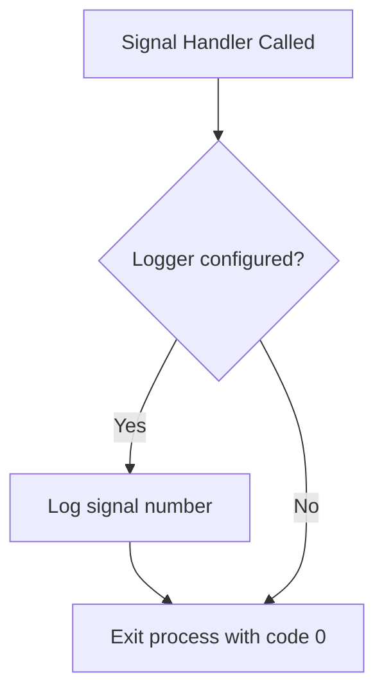
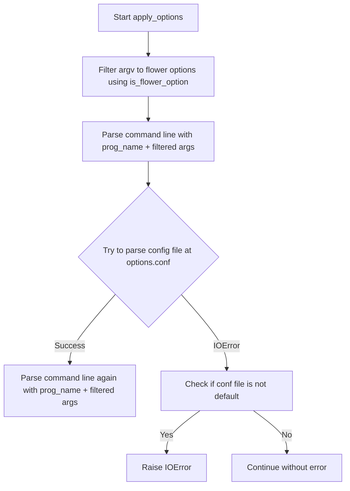
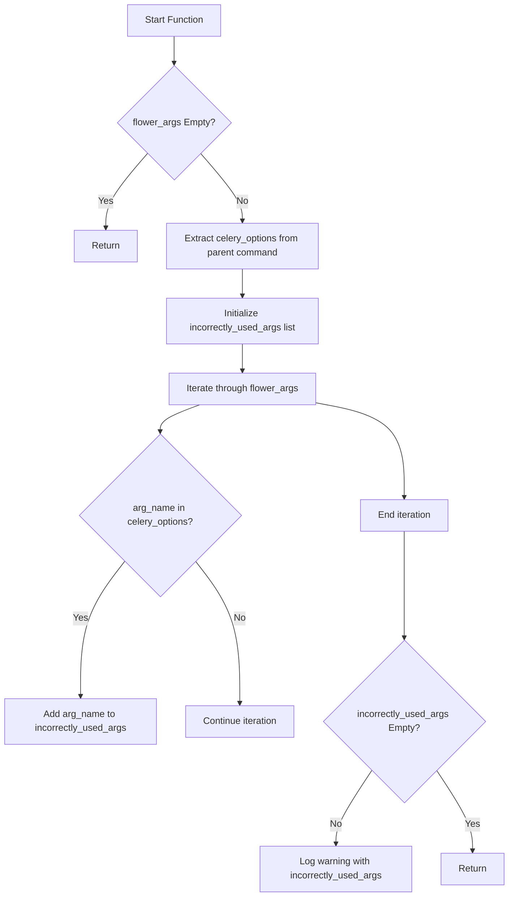

# `command.py`

## `flower.command.sigterm_handler` · *function*

## Summary:
Handles SIGTERM signals by logging the event and gracefully shutting down the application.

## Description:
This function serves as a signal handler for SIGTERM (termination signal) that logs the received signal number and exits the process with status code 0. It is registered with the Python signal module to respond to termination requests from the operating system or process managers.

The function is extracted into its own dedicated handler to separate signal handling logic from the main application flow, ensuring clean separation of concerns and making the shutdown process predictable and testable.

## Args:
    signum (int): The signal number received (typically 15 for SIGTERM).
    _ (Any): Placeholder for the frame argument required by signal handlers, not used in this implementation.

## Returns:
    None: This function does not return a value as it terminates the process via sys.exit().

## Raises:
    SystemExit: Raised internally by sys.exit(0) when the signal is processed.

## Constraints:
    Preconditions:
        - The function must be registered with signal.signal() to handle SIGTERM.
        - A logger instance must be available in the module scope for logging purposes.
    Postconditions:
        - The application process will terminate with exit code 0.
        - A log message containing the signal number will be written to the configured logger.

## Side Effects:
    - Writes a log message to the configured logger instance.
    - Terminates the current process with exit code 0 via sys.exit().

## Control Flow:


## Examples:
```python
import signal
import sys

# Register the signal handler
signal.signal(signal.SIGTERM, sigterm_handler)

# Application runs...
# When SIGTERM is sent:
# INFO: SIGTERM detected, shutting down
# Process exits with code 0
```

## `flower.command.flower` · *function*

## Summary:
Initializes and starts the Flower web application with configured options, logging, and signal handling.

## Description:
The flower function serves as the main entry point for launching the Flower monitoring web interface. It orchestrates the complete initialization sequence including argument parsing, environment variable processing, configuration extraction, logging setup, and application startup. The function creates a Flower application instance with the specified Celery app and configuration options, registers cleanup handlers for graceful shutdown, and begins serving HTTP requests.

This function is extracted from inline code to provide a centralized control flow for the application lifecycle, separating concerns between configuration management, application instantiation, and runtime execution. It ensures proper resource cleanup through atexit registration and signal handling while maintaining a clean startup sequence.

## Args:
    ctx (click.Context): The Click context object containing command-line context and application state.
    tornado_argv (list[str]): List of command-line arguments to be processed by Tornado's option parser.

## Returns:
    None: This function does not return any value.

## Raises:
    KeyboardInterrupt: Raised when the user interrupts the application with Ctrl+C.
    SystemExit: Raised when the application receives a system exit signal or encounters a fatal error during startup.

## Constraints:
    Preconditions:
        - The ctx parameter must be a valid Click context with obj attribute containing app and quiet properties.
        - The tornado_argv parameter must be a list of strings representing command-line arguments.
        - All required dependency functions (warn_about_celery_args_used_in_flower_command, apply_env_options, apply_options, extract_settings, setup_logging) must be available.
        - The Flower class must be importable and properly initialized.
        - The global options object from tornado.options must be available.
        - The settings dictionary must be populated by extract_settings().
    
    Postconditions:
        - All configuration options are parsed and applied.
        - The Flower application instance is created with proper dependencies.
        - Signal handlers are registered for graceful shutdown.
        - The application begins serving HTTP requests or exits cleanly.

## Side Effects:
    - Modifies global state through Tornado option parsing and logging configuration.
    - Registers atexit handler and signal handlers for application lifecycle management.
    - Prints startup banner to console when not in quiet mode.
    - Starts the Flower web server and associated background services.
    - May write to standard output when printing banner information.
    - May write to application log files during startup and operation.

## Control Flow:
```mermaid
flowchart TD
    A[flower(ctx, tornado_argv)] --> B[Validate Celery args]
    B --> C[Apply environment options]
    C --> D[Apply command-line options]
    D --> E[Extract application settings]
    E --> F[Setup logging configuration]
    F --> G[Create Flower app instance]
    G --> H[Register atexit handler]
    H --> I[Register SIGTERM handler]
    I --> J{ctx.obj.quiet}
    J -- False --> K[Print startup banner]
    J -- True --> L[Skip banner]
    K --> M[Start Flower application]
    L --> M
    M --> N{Tornado start succeeds?}
    N -- Yes --> O[Application running]
    N -- No --> P[Handle exceptions]
    P --> Q{KeyboardInterrupt/SystemExit?}
    Q -- Yes --> R[Exit gracefully]
    Q -- No --> S[Re-raise exception]
```

## Examples:
    Typical usage in command-line interface:
    ```bash
    # Start Flower with default settings
    flower
    
    # Start Flower with custom port and broker URL
    flower --port=5555 --broker=redis://localhost:6379/0
    
    # Start Flower with configuration file
    flower --conf=myconfig.cfg
    ```

## `flower.command.apply_env_options` · *function*

## Summary:
Applies environment variables prefixed with FLOWER_ to configure Tornado options dynamically.

## Description:
Processes all environment variables that match the Flower naming convention (starting with "FLOWER_") and sets corresponding Tornado options. This function enables runtime configuration of Flower through environment variables, providing flexibility for deployment scenarios where command-line arguments are not feasible.

The function filters environment variables using `is_flower_envvar`, extracts the configuration key by removing the prefix, and applies appropriate type conversion before setting the value on the global `options` object. It handles both single-value and multiple-value options, including boolean conversion via `strtobool`.

## Args:
    None

## Returns:
    None

## Raises:
    None explicitly raised.

## Constraints:
    Preconditions:
        - The global constant `ENV_VAR_PREFIX` must be defined (typically "FLOWER_").
        - The global variable `options` must be initialized with `_options` attribute containing valid configuration options.
        - The global function `is_flower_envvar` must be defined to filter valid environment variables.
        - The global function `strtobool` must be available for boolean conversion.
    
    Postconditions:
        - All matching environment variables are processed and applied to the global `options` object.
        - Environment variables that don't correspond to valid options are silently ignored.

## Side Effects:
    - Mutates the global `options` object by setting attributes.
    - May modify application configuration state at runtime.

## Control Flow:
```mermaid
flowchart TD
    A[apply_env_options()] --> B[Filter env vars with is_flower_envvar]
    B --> C{Any matching vars?}
    C -- No --> D[Return]
    C -- Yes --> E[Process each var]
    E --> F[Extract option name]
    F --> G[Get option from options._options]
    G --> H{KeyError?}
    H -- Yes --> I[Try hyphenated name variant]
    H -- No --> J[Proceed with original name]
    I --> J
    J --> K{option.multiple?}
    K -- Yes --> L[Split by comma and convert types]
    K -- No --> M{option.type is bool?}
    M -- Yes --> N[Convert with strtobool]
    M -- No --> O[Convert with option.type]
    L --> P[Set attribute on options]
    N --> P
    O --> P
    P --> Q[Loop to next var]
    Q --> C
```

## Examples:
    Given environment variables:
    - FLOWER_PORT=5555
    - FLOWER_BROKER_URL=redis://localhost:6379/0
    - FLOWER_QS=queue1,queue2,queue3
    
    After calling apply_env_options():
    - options.port will be set to 5555
    - options.broker_url will be set to "redis://localhost:6379/0"
    - options.qs will be set to ["queue1", "queue2", "queue3"]

## `flower.command.apply_options` · *function*

## Summary:
Processes and applies command-line arguments and configuration files for the Flower web application.

## Description:
Parses command-line arguments to configure the Flower application, including loading configuration from files. This function filters command-line arguments to only process valid Flower options, parses them using Tornado's option parsing utilities, and attempts to load a configuration file if specified. It handles cases where the configuration file might not exist by raising an exception only if a non-default config file was explicitly specified.

## Args:
    prog_name (str): The name of the program being executed, used for command-line argument parsing.
    argv (list[str]): A list of command-line arguments to be processed.

## Returns:
    None: This function does not return any value.

## Raises:
    IOError: Raised when a configuration file specified via the --conf option cannot be found, but only if the file is not the default configuration file.

## Constraints:
    Preconditions:
        - The prog_name must be a valid string representing the program name.
        - The argv must be a list of strings representing command-line arguments.
        - The tornado.options module must be properly initialized with available options.
    
    Postconditions:
        - Command-line arguments are filtered to only include valid Flower options.
        - Configuration options are parsed and applied to the global options object.
        - If a configuration file is specified, it is parsed and its options are applied.

## Side Effects:
    - Modifies the global tornado.options object with parsed command-line arguments.
    - May read from the file system when parsing configuration files.
    - May raise IOError if configuration file is not found and is not the default.

## Control Flow:


## Examples:
    >>> apply_options('flower', ['--port=5555', '--conf=myconfig.cfg'])
    # Parses command-line arguments and loads configuration from myconfig.cfg
    
    >>> apply_options('flower', ['--invalid-option'])
    # Filters out invalid options and processes valid ones

## `flower.command.warn_about_celery_args_used_in_flower_command` · *function*

## Summary:
Validates that Celery command-line arguments are not incorrectly specified after the flower command and logs a warning if detected.

## Description:
This function serves as a validation utility to detect when Celery command-line arguments are mistakenly placed after the flower command in the command-line interface. It compares the provided flower arguments against known Celery command options and issues a warning message when mismatches are detected. This logic is extracted into a separate function to enforce a clear separation between Flower-specific argument parsing and Celery argument validation, preventing user confusion about proper command structure.

## Args:
    ctx (click.Context): The Click context object containing command information and parent command parameters.
    flower_args (list[str]): A list of string arguments that were passed to the flower command.

## Returns:
    None: This function does not return any value.

## Raises:
    None: This function does not explicitly raise any exceptions.

## Constraints:
    Preconditions:
        - The ctx parameter must be a valid Click context object with a parent command.
        - The parent command must have a params attribute containing command parameters.
        - Each parameter in the parent command must have an opts attribute listing available options.
        - The flower_args parameter must be iterable.
    Postconditions:
        - If incorrectly used Celery arguments are detected, a warning message is logged to the logger.
        - No modification is made to the input arguments or context objects.

## Side Effects:
    - Writes a warning message to the logger if incorrectly used Celery arguments are detected.
    - No other I/O operations or external state mutations occur.

## Control Flow:


## Examples:
    Example usage within a Click command context:
    ```python
    # When user runs: celery flower --broker=redis://localhost:6379 --port=5555
    # And --broker is a Celery option, this would warn about --broker being used incorrectly
    # The correct usage would be: celery --broker=redis://localhost:6379 flower --port=5555
    ```

## `flower.command.setup_logging` · *function*

## Summary:
Configures logging settings for the Flower application based on debug and logging level options.

## Description:
This function adjusts the logging configuration for the Flower web application. It specifically handles the case where debug mode is enabled but logging is set to 'info' level, upgrading it to 'debug' level and enabling pretty logging. In all other cases, it configures the tornado.access logger to use a NullHandler to suppress access log messages.

## Args:
    None

## Returns:
    None

## Raises:
    None

## Constraints:
    Preconditions:
        - The `options` object from `tornado.options` must be properly initialized with `debug` and `logging` attributes
        - The `tornado.options` module must be imported and configured before calling this function

    Postconditions:
        - If debug is True and logging is 'info', then logging level is set to 'debug' and pretty logging is enabled
        - Otherwise, the tornado.access logger is configured with a NullHandler and propagation disabled

## Side Effects:
    - Modifies global logging configuration via `logging.getLogger()` calls
    - May enable pretty logging through `enable_pretty_logging()` function
    - Configures the tornado.access logger to suppress access logs

## Control Flow:
```mermaid
flowchart TD
    A[setup_logging called] --> B{options.debug AND options.logging == 'info'}
    B -- True --> C[options.logging = 'debug']
    C --> D[enable_pretty_logging()]
    B -- False --> E[Get tornado.access logger]
    E --> F[Add NullHandler]
    F --> G[Set propagate = False]
```

## Examples:
    Typical usage within Flower command execution:
    ```python
    # Called during startup after options parsing
    setup_logging()
    # When debug=True and logging='info', enables debug logging with pretty formatting
    # When debug=False or logging!='info', suppresses tornado access logs
    ```

## `flower.command.extract_settings` · *function*

## Summary:
Extracts and configures application settings from command-line options and environment variables.

## Description:
This function processes command-line options and environment variables to configure various application settings. It handles debug mode, cookie secrets, URL prefixes, OAuth authentication, SSL configuration, and validates authentication options. The function centralizes setting extraction logic to avoid duplication and ensure consistent configuration handling throughout the application.

## Args:
    None

## Returns:
    None

## Raises:
    SystemExit: When an invalid '--auth' option is provided, causing the application to terminate with exit code 1.

## Constraints:
    Preconditions:
    - The global `options` object from `tornado.options` must be properly initialized with parsed command-line arguments
    - The global `settings` dictionary must be available for modification
    - The `validate_auth_option` function must be importable and functional
    - Environment variables must be accessible if used for OAuth configuration

    Postconditions:
    - The global `settings` dictionary will be updated with appropriate values based on command-line options
    - If authentication is enabled, the OAuth configuration will be set in `settings['oauth']`
    - If SSL options are provided, `settings['ssl_options']` will be populated
    - If authentication validation fails, the application will exit with code 1

## Side Effects:
    - Modifies the global `settings` dictionary in-place
    - Writes log messages to stderr via `logger.error()` when authentication validation fails
    - Calls `sys.exit(1)` when authentication validation fails
    - Calls `prepend_url()` to modify URL settings
    - Calls `abs_path()` to resolve file paths for SSL certificates

## Control Flow:
```mermaid
flowchart TD
    A[Start extract_settings] --> B{options.debug}
    B -- True --> C[settings['debug'] = options.debug]
    B -- False --> D[Skip debug setting]
    C --> E{options.cookie_secret}
    E -- True --> F[settings['cookie_secret'] = options.cookie_secret]
    E -- False --> G[Skip cookie secret]
    F --> H{options.url_prefix}
    H -- True --> I[Loop over login_url, static_url_prefix]
    I --> J[prepend_url(settings[name], options.url_prefix)]
    H -- False --> K[Skip URL prefix processing]
    J --> L{options.auth}
    L -- True --> M[Set settings['oauth'] with OAuth config]
    L -- False --> N[Skip OAuth processing]
    M --> O{options.certfile AND options.keyfile}
    O -- True --> P[Set settings['ssl_options']]
    O -- False --> Q[Skip SSL processing]
    P --> R{options.ca_certs}
    R -- True --> S[Add ca_certs to ssl_options]
    R -- False --> T[Continue]
    Q --> U{options.auth AND NOT validate_auth_option(options.auth)}
    U -- True --> V[logger.error("Invalid '--auth' option")]
    V --> W[sys.exit(1)]
    U -- False --> X[End]
```

## Examples:
    # Typical usage in a command-line interface
    extract_settings()
    # This would configure settings based on parsed command-line options
    
    # Example with authentication enabled
    # Command: flower --auth=user@example.com
    # Result: settings['oauth'] populated with OAuth credentials from options or environment

## `flower.command.is_flower_option` · *function*

## Summary:
Determines whether a command-line argument corresponds to a valid Flower configuration option.

## Description:
Checks if a given command-line argument matches a known configuration option defined in the tornado.options module. This function is used to filter and validate command-line arguments before processing them as Flower-specific options. It helps distinguish between valid Flower configuration flags and other command-line arguments that should be passed through to underlying systems.

## Args:
    arg (str): A command-line argument string that may represent a Flower configuration option.

## Returns:
    bool: True if the argument corresponds to a valid Flower option, False otherwise.

## Raises:
    None explicitly raised.

## Constraints:
    Preconditions:
        - The argument must be a string starting with one or more dashes (-).
        - The tornado.options module must be properly initialized with available options.
    
    Postconditions:
        - The function returns a boolean value indicating option validity.
        - No side effects occur during execution.

## Side Effects:
    None.

## Control Flow:
```mermaid
flowchart TD
    A[Start is_flower_option] --> B{arg starts with '-'}
    B -- No --> C[Return False]
    B -- Yes --> D[Remove leading '-' from arg]
    D --> E[Split arg at '=' to get name part]
    E --> F[Replace '-' with '_' in name]
    F --> G[Check if options has attribute name]
    G --> H{hasattr(options, name)}
    H -- No --> I[Return False]
    H -- Yes --> J[Return True]
```

## Examples:
    >>> is_flower_option("--port=5555")
    True
    >>> is_flower_option("--invalid-option")
    False
    >>> is_flower_option("port=5555")
    True
    >>> is_flower_option("invalid-option")
    False
```

## `flower.command.is_flower_envvar` · *function*

## Summary:
Determines whether a given environment variable name corresponds to a valid Flower configuration option.

## Description:
This function checks if an environment variable name starts with the Flower-specific prefix and if the remainder of the name (after removing the prefix) matches one of the predefined default configuration options. It serves as a filter to identify which environment variables should be processed as Flower configuration parameters.

The function is typically used during environment variable parsing to distinguish Flower-specific configuration variables from other environment variables.

## Args:
    name (str): The full name of the environment variable to check.

## Returns:
    bool: True if the environment variable name starts with the Flower prefix and the suffix matches a valid configuration option; False otherwise.

## Raises:
    None explicitly raised.

## Constraints:
    Preconditions:
        - The `name` parameter must be a string.
        - The global constant `ENV_VAR_PREFIX` must be defined (typically "FLOWER_" in Flower applications).
        - The global variable `default_options` must be defined and contain valid configuration option names.
    
    Postconditions:
        - The returned boolean value accurately reflects whether the environment variable name conforms to the Flower configuration naming convention.

## Side Effects:
    None.

## Control Flow:
```mermaid
flowchart TD
    A[is_flower_envvar(name)] --> B{name.startswith(ENV_VAR_PREFIX)?}
    B -- Yes --> C{[name[len(ENV_VAR_PREFIX):].lower()] in default_options?}
    C -- Yes --> D[return True]
    C -- No --> E[return False]
    B -- No --> F[return False]
```

## Examples:
    >>> is_flower_envvar("FLOWER_QUEUES")
    True
    >>> is_flower_envvar("NON_FLOWER_VAR")
    False
    >>> is_flower_envvar("FLOWER_INVALID_OPTION")
    False
```

## `flower.command.print_banner` · *function*

## Summary:
Displays application startup information including connection details, registered tasks, and access URLs.

## Description:
Prints banner information to the log when the Flower application starts, showing the broker connection URI, list of registered tasks, and the URL where the application can be accessed. This function centralizes the logging of startup information to ensure consistent formatting and visibility of important operational details.

## Args:
    app (Flower): The Flower application instance containing task registry and connection information
    ssl (bool): Flag indicating whether SSL is enabled for the web interface

## Returns:
    None: This function does not return any value

## Raises:
    None: This function does not explicitly raise exceptions

## Constraints:
    Preconditions:
        - The `app` parameter must be a valid Flower instance with a working connection
        - The `options` global variable must be properly initialized with configuration values
        - Logging must be configured to capture INFO level messages

    Postconditions:
        - Log messages are written to the application logger at appropriate levels (INFO, DEBUG)
        - All configuration options (address, port, url_prefix, unix_socket) are properly handled
        - Broker connection URI is formatted correctly using the app's connection method

## Side Effects:
    - Writes to application log at INFO and DEBUG levels
    - Outputs formatted connection information including:
      * HTTP/S URL with address, port, and optional prefix
      * Unix socket file path (when applicable)
      * Broker URI from app connection
      * Sorted list of registered task names
      * Application settings dictionary

## Control Flow:
```mermaid
flowchart TD
    A[Start print_banner] --> B{unix_socket set?}
    B -- Yes --> C[Log unix socket path]
    B -- No --> D[Check url_prefix]
    D -- Set --> E[Create prefix_str with slash]
    D -- Not set --> F[Set prefix_str empty]
    E --> G[Log HTTP/S URL with prefix]
    F --> G
    G --> H[Log Broker URI]
    H --> I[Log Registered tasks]
    I --> J[Log Settings (DEBUG)]
    J --> K[End]
```

## Examples:
    Typical usage during application startup:
    ```python
    # Assuming app is a valid Flower instance and ssl is boolean
    print_banner(app, ssl=True)
    # Logs:
    # Visit me at https://0.0.0.0:5555/
    # Broker: redis://localhost:6379/0
    # Registered tasks: 
    # ['task1', 'task2', 'task3']
    # Settings: {...}
    ```

