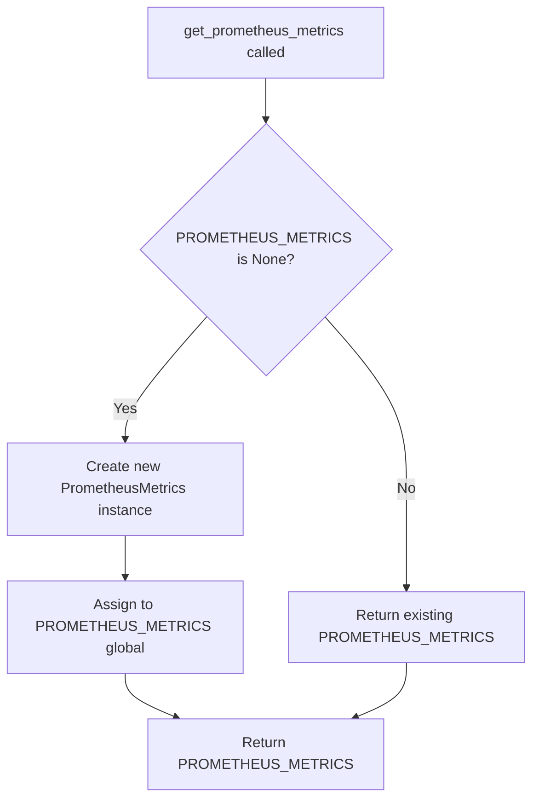
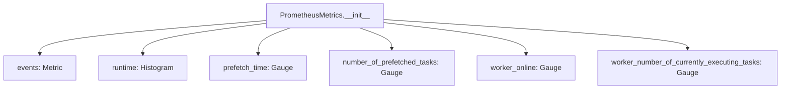

# `events.py`

## `flower.events.get_prometheus_metrics` · *function*

## Summary:
Returns the singleton instance of PrometheusMetrics for collecting Celery event-based metrics.

## Description:
This function implements a lazy initialization pattern for the PrometheusMetrics singleton. It ensures that exactly one instance of PrometheusMetrics is created and reused throughout the Flower application lifecycle. The function is called by various components within the Flower system that need access to the central metrics collection mechanism.

The function was extracted to enforce a clear responsibility boundary between metrics creation and usage, ensuring that all parts of the system access the same metrics instance without duplicating instantiation logic.

## Args:
    None

## Returns:
    PrometheusMetrics: A singleton instance of the PrometheusMetrics class that provides access to all Celery-related Prometheus metrics.

## Raises:
    None

## Constraints:
    Preconditions:
    - The global variable PROMETHEUS_METRICS must be declared at module level and initially set to None
    - The PrometheusMetrics class must be properly defined in the same module
    - The class should be instantiable with no arguments
    
    Postconditions:
    - The returned instance is always the same object (singleton guarantee)
    - The first call initializes the singleton instance
    - Subsequent calls return the existing instance

## Side Effects:
    None

## Control Flow:


## Examples:
```python
# Typical usage in a Flower component
metrics = get_prometheus_metrics()
# Use metrics to update task execution statistics
metrics.events.labels(worker='worker1', type='task', task='task1').inc()
```

## `flower.events.PrometheusMetrics` · *class*

## Summary:
A class that manages Prometheus metrics for Flower's Celery event monitoring system.

## Description:
The PrometheusMetrics class serves as a centralized collector and reporter of various metrics related to Celery task execution and worker status. It provides a structured interface for tracking task performance, worker availability, and queue behavior through Prometheus-compatible metric types. This class is designed to be instantiated once within the Flower application to monitor and expose metrics about the underlying Celery infrastructure.

## State:
- events: Metric object tracking total number of events received, with labels for worker, type, and task
- runtime: Histogram tracking task runtime in seconds, with labels for worker and task
- prefetch_time: Gauge measuring time tasks spend waiting to be executed, labeled by worker and task
- number_of_prefetched_tasks: Gauge tracking number of prefetched tasks per worker and task type
- worker_online: Gauge indicating worker online status (1.0 for online, 0.0 for offline), labeled by worker
- worker_number_of_currently_executing_tasks: Gauge tracking currently executing tasks per worker

All attributes are initialized in __init__ and are Prometheus metric objects that automatically handle labeling and aggregation.

## Lifecycle:
- Creation: Instantiated once during application startup with no constructor arguments
- Usage: Metrics are updated by other components in the Flower system through direct attribute access
- Destruction: No explicit cleanup required; relies on Prometheus client library's automatic management

## Method Map:


## Raises:
None explicitly raised by __init__, though instantiation may fail if Prometheus client library is improperly configured or if options.task_runtime_metric_buckets is invalid.

## Example:
```python
# Instantiation (typically done once at application startup)
metrics = PrometheusMetrics()

# Usage would involve updating metrics through direct attribute access
# e.g., metrics.events.labels(worker='worker1', type='task', task='task1').inc()
# e.g., metrics.runtime.labels(worker='worker1', task='task1').observe(0.5)
```

### `flower.events.PrometheusMetrics.__init__` · *method*

## Summary:
Initializes Prometheus metrics for monitoring Flower events and task execution statistics.

## Description:
This method initializes various Prometheus client metrics used by the PrometheusMetrics class to monitor Flower's event processing and Celery task execution data. It creates counters, histograms, and gauges for tracking different aspects of task execution including event counts, task runtimes, prefetch times, and worker states.

## Args:
    None

## Returns:
    None

## Raises:
    None

## State Changes:
    Attributes READ: None
    Attributes WRITTEN: 
    - self.events: Prometheus Counter for tracking total events with labels ['worker', 'type', 'task']
    - self.runtime: Prometheus Histogram for tracking task runtime with labels ['worker', 'task'] and buckets from options.task_runtime_metric_buckets
    - self.prefetch_time: Prometheus Gauge for tracking task prefetch time with labels ['worker', 'task']
    - self.number_of_prefetched_tasks: Prometheus Gauge for tracking number of prefetched tasks with labels ['worker', 'task']
    - self.worker_online: Prometheus Gauge for tracking worker online status with label ['worker']
    - self.worker_number_of_currently_executing_tasks: Prometheus Gauge for tracking currently executing tasks with label ['worker']

## Constraints:
    Preconditions:
    - The Prometheus client library must be properly installed and available
    - The tornado.options.options must contain the task_runtime_metric_buckets configuration
    - This method should only be called during object initialization
    - The class must inherit from or be compatible with the PrometheusMetrics class
    
    Postconditions:
    - All metric instances are properly initialized with appropriate names, descriptions, and label dimensions
    - Each metric is configured with the correct metric type (Counter, Histogram, Gauge)
    - The metrics are ready to be updated by other methods in the class

## Side Effects:
    None

## `flower.events.EventsState` · *class*

## Summary:
A specialized state manager for Celery events that tracks task and worker metrics using Prometheus.

## Description:
The EventsState class extends Celery's built-in State class to provide enhanced monitoring capabilities for Celery task execution and worker status. It maintains counters for event types per worker and integrates with Prometheus metrics to track task performance, prefetching behavior, and worker availability.

This class processes incoming event data from Celery workers and updates internal state and metrics accordingly. It serves as the core component for collecting and aggregating Celery event information within the Flower monitoring system.

## State:
- counter: collections.defaultdict(Counter) - Tracks event counts per worker and event type
- metrics: PrometheusMetrics - Singleton instance providing access to all monitored metrics
- Inherited from State: tasks, workers, etc. - Standard Celery state tracking attributes

## Lifecycle:
- Creation: Instantiated by the Flower application when setting up event processing
- Usage: Called via event() method when Celery events are received
- Destruction: Managed by Python garbage collection; no explicit cleanup required

## Method Map:
```mermaid
graph TD
    A[Event received] --> B[event method]
    B --> C[super().event(event)]
    B --> D[counter increment]
    B --> E[Task-specific processing]
    B --> F[Worker-specific processing]
    E --> G[task-received handling]
    E --> H[task-started handling]
    E --> I[task-succeeded/failed handling]
    F --> J[worker-online handling]
    F --> K[worker-heartbeat handling]
    F --> L[worker-offline handling]
```

## Raises:
- None explicitly raised by __init__
- Inherits all exceptions from parent State class constructor

## Example:
```python
# Typical usage within Flower's event processing pipeline
events_state = EventsState()
# When an event arrives:
event = {
    'type': 'task-received',
    'hostname': 'worker1@host',
    'uuid': 'task-uuid-123',
    'name': 'myapp.tasks.my_task'
}
events_state.event(event)
# Metrics are automatically updated
```

### `flower.events.EventsState.__init__` · *method*

## Summary:
Initializes the EventsState object by setting up Prometheus metrics collection and event counting structures.

## Description:
This method initializes the EventsState instance by calling the parent State class constructor and establishing the internal data structures needed for tracking Celery events. It sets up a defaultdict of Counter objects for event counting per worker and initializes the Prometheus metrics collection system through the get_prometheus_metrics() function.

The method is part of the EventsState class lifecycle and is called during object instantiation. It prepares the instance to track event metrics and integrate with the Prometheus monitoring system.

## Args:
    *args: Variable length argument list passed to the parent State constructor
    **kwargs: Arbitrary keyword arguments passed to the parent State constructor

## Returns:
    None

## Raises:
    Exception: Any exceptions raised by the parent State.__init__ method

## State Changes:
    Attributes READ: None
    Attributes WRITTEN: 
    - self.counter: Initialized as collections.defaultdict(Counter) for event counting
    - self.metrics: Assigned the singleton PrometheusMetrics instance returned by get_prometheus_metrics()

## Constraints:
    Preconditions:
    - The get_prometheus_metrics function must be available and callable
    - The parent State class constructor must accept the provided *args and **kwargs
    - Collections module must be properly imported
    
    Postconditions:
    - self.counter is initialized as a defaultdict of Counter objects
    - self.metrics is assigned the singleton PrometheusMetrics instance
    - The parent State object is properly initialized

## Side Effects:
    None

### `flower.events.EventsState.event` · *method*

## Summary:
Processes incoming event data from Celery workers and updates internal state and metrics accordingly.

## Description:
This method handles events received from Celery workers, updating counters, task tracking, and Prometheus metrics based on the event type. It extends the parent class's event handling to provide detailed monitoring capabilities for task execution and worker status.

The method is designed as a dedicated handler to centralize event processing logic, making it easier to maintain and extend monitoring features without modifying the core event receiving mechanism. It processes various event types including task-related events and worker status events.

## Args:
    event (dict): A dictionary containing event data from Celery, including keys like 'hostname', 'type', 'uuid', 'name', 'runtime', 'eta', 'active', etc.

## Returns:
    None: This method does not return any value.

## Raises:
    KeyError: If required keys ('hostname', 'type') are missing from the event dictionary.
    AttributeError: If task-related attributes (like 'started', 'received') are accessed on a task that doesn't exist or lacks these attributes.

## State Changes:
    Attributes READ:
        - self.tasks
        - self.counter
        - self.metrics
    Attributes WRITTEN:
        - self.counter[worker_name][event_type]
        - self.metrics.events
        - self.metrics.runtime
        - self.metrics.number_of_prefetched_tasks
        - self.metrics.prefetch_time
        - self.metrics.worker_online
        - self.metrics.worker_number_of_currently_executing_tasks

## Constraints:
    Preconditions:
        - The event dictionary must contain 'hostname' and 'type' keys
        - The parent class's event method must be properly initialized
        - Task objects referenced by 'uuid' must be available in self.tasks when needed
    Postconditions:
        - The counter for the worker and event type is incremented
        - Appropriate Prometheus metrics are updated based on event type and task state

## Side Effects:
    - Updates internal counters stored in self.counter
    - Modifies Prometheus metrics exposed via self.metrics
    - May trigger metric collection and reporting through Prometheus client libraries

## `flower.events.Events` · *class*

## Summary:
The Events class is a threaded service that captures and processes Celery events for monitoring and state management within the Flower application.

## Description:
The Events class extends threading.Thread to provide continuous event capture from Celery workers. It serves as the central hub for collecting real-time task and worker events, maintaining state information, and enabling event-based monitoring. The class handles connection management, event reception, state persistence, and periodic operations like enabling events and saving state.

This class is instantiated by the Flower application to establish event monitoring capabilities. It creates a dedicated thread that continuously listens for Celery events and processes them through the EventsState handler, which provides enhanced monitoring capabilities including Prometheus metrics integration.

## State:
- capp: Celery application instance - Required for connection and control operations
- io_loop: Tornado IOLoop instance - Used for asynchronous event processing
- db: str - Optional file path for persistent state storage
- persistent: bool - Flag indicating whether to load/save state from/to disk
- enable_events: bool - Flag controlling whether to periodically enable events
- state: EventsState instance - Manages event tracking and metrics (extends Celery's State)
- state_save_timer: PeriodicCallback - Timer for periodic state saving
- timer: PeriodicCallback - Timer for periodic event enabling
- daemon: bool - Set to True to make thread a daemon thread

## Lifecycle:
- Creation: Instantiate with capp, io_loop, and optional configuration parameters
- Usage: Call start() to begin event capture in background thread, stop() to halt
- Destruction: Automatically cleaned up when thread terminates or process exits

## Method Map:
```mermaid
graph TD
    A[Events instantiation] --> B[__init__ setup)
    B --> C[Thread initialization]
    C --> D[State initialization]
    D --> E[Timer setup]
    E --> F[start() called]
    F --> G[Thread.start()]
    G --> H[timer.start()]
    H --> I[state_save_timer.start()]
    I --> J[run() loop begins]
    J --> K[Connection established]
    K --> L[EventReceiver created]
    L --> M[capture() called]
    M --> N[on_event() handler]
    N --> O[state.event() called]
    O --> P[EventsState processing]
    P --> Q[Metrics updated]
    Q --> R[Loop continues]
    R --> J
    J --> S[stop() called]
    S --> T[timer.stop()]
    T --> U[state_save_timer.stop()]
    U --> V[save_state() called]
    V --> W[Thread terminates]
```

## Raises:
- None explicitly raised by __init__
- Exceptions during event capture are caught and logged with retry logic
- Keyboard interrupt and system exit are handled gracefully

## Example:
```python
# Create Events instance
events = Events(capp=celery_app, io_loop=tornado_ioloop, db='/tmp/events.db')

# Start event capture
events.start()

# Later, stop and clean up
events.stop()
```

### `flower.events.Events.__init__` · *method*

## Summary:
Initializes the Events class with configuration parameters and sets up event state management, including optional persistent storage and periodic callbacks for event processing.

## Description:
The Events.__init__ method configures the event processing thread by initializing core attributes, setting up persistent state loading when requested, and establishing periodic callbacks for enabling events and saving state. This method serves as the primary setup routine for the Events class, preparing it to capture and process Celery events while managing state persistence and periodic maintenance tasks.

The method inherits from threading.Thread and sets the daemon flag to True, ensuring the thread terminates when the main program exits. It initializes the event state management system, optionally loads previous state from persistent storage, and configures background maintenance tasks to keep event processing active.

## Args:
    capp (Celery): The Celery application instance to monitor
    io_loop (IOLoop): Tornado IOLoop instance for asynchronous operations
    db (str, optional): Path to persistent storage database file. Defaults to None
    persistent (bool): Whether to load/save state from/to persistent storage. Defaults to False
    enable_events (bool): Whether to enable event processing initially. Defaults to True
    state_save_interval (int): Interval in milliseconds to save state. Defaults to 0 (disabled)
    **kwargs: Additional arguments passed to EventsState constructor

## Returns:
    None

## Raises:
    None explicitly raised

## State Changes:
    Attributes READ: None
    Attributes WRITTEN: 
    - self.io_loop: Assigned from the io_loop parameter
    - self.capp: Assigned from the capp parameter
    - self.db: Assigned from the db parameter
    - self.persistent: Assigned from the persistent parameter
    - self.enable_events: Assigned from the enable_events parameter
    - self.state: Initialized to None, then potentially set from persistent storage or EventsState
    - self.state_save_timer: Initialized to None, then potentially set to PeriodicCallback
    - self.timer: Initialized to PeriodicCallback for enabling events

## Constraints:
    Preconditions:
    - capp must be a valid Celery application instance
    - io_loop must be a valid Tornado IOLoop instance
    - If persistent=True, db must be a valid file path string
    - state_save_interval must be a non-negative integer if provided
    - All keyword arguments must be valid for EventsState constructor
    
    Postconditions:
    - self.daemon is set to True (thread daemon flag)
    - self.state is initialized to either loaded persistent state or new EventsState
    - Periodic callbacks are configured appropriately based on parameters

## Side Effects:
    - Initializes threading.Thread parent class
    - Sets daemon flag to True
    - May perform file I/O operations when loading persistent state
    - Creates PeriodicCallback instances for background maintenance tasks
    - May create or modify files at the path specified by db when persistent=True

### `flower.events.Events.start` · *method*

## Summary:
Starts the event processing thread and initializes associated timers for event handling and state persistence.

## Description:
This method begins the execution of the Events thread by invoking the parent threading.Thread.start() method. It also conditionally starts two timer-based components: the enable_events timer and the state_save_timer, depending on whether they are configured. This separation allows for asynchronous event processing while maintaining control over timing-based operations.

The Events class is responsible for capturing Celery events and managing their state. This start method is part of the thread lifecycle management, ensuring that background threads for event processing and state persistence are properly initiated. When enable_events is True, it starts a periodic timer that ensures Celery events processing remains enabled. When state_save_timer is configured, it starts a timer to periodically persist event state to storage.

## Args:
    None

## Returns:
    None

## Raises:
    None explicitly raised

## State Changes:
    Attributes READ: self.enable_events, self.timer, self.state_save_timer
    Attributes WRITTEN: None

## Constraints:
    Preconditions: The Events instance must be properly initialized with enable_events, timer, and state_save_timer attributes set appropriately. The thread must not have been started previously.
    Postconditions: The Events thread is running, and any enabled timers are started.

## Side Effects:
    I/O: Starts periodic callbacks via timer.start() which may involve system-level scheduling.
    External service calls: None directly, but timer.start() may schedule periodic callbacks that invoke external services.
    Mutations to objects outside self: None

### `flower.events.Events.stop` · *method*

## Summary:
Stops event processing timers and saves persistent state if enabled.

## Description:
This method halts the event processing timers and optionally saves the current state to persistent storage. It is typically called during application shutdown or when disabling event monitoring to cleanly terminate background processes. The method checks for active timers and persistent storage configuration before performing cleanup operations.

## Args:
    None

## Returns:
    None

## Raises:
    None explicitly raised

## State Changes:
    Attributes READ: self.enable_events, self.timer, self.state_save_timer, self.persistent
    Attributes WRITTEN: None

## Constraints:
    Preconditions: The Events instance must be properly initialized with the relevant timer attributes set.
    Postconditions: All active timers are stopped and persistent state is saved if configured.

## Side Effects:
    I/O operations when saving state to persistent storage (if self.persistent is True)
    Logging messages at debug level for timer stopping operations

### `flower.events.Events.run` · *method*

## Summary:
Starts and maintains a continuous event capture loop that listens for Celery events and processes them through the registered event handler.

## Description:
This method implements a robust event capturing mechanism that continuously listens for Celery events from the broker connection. It uses exponential backoff retry logic to handle connection failures and ensures that event processing continues even when temporary network issues occur. The method runs indefinitely in a loop until interrupted by a keyboard interrupt or system exit.

The event capture process creates an EventReceiver with a wildcard handler ("*": self.on_event) that routes all events to the instance's event handler method. This allows the system to monitor all Celery events flowing through the broker. The capture method is called with limit=None, timeout=None, and wakeup=True to ensure continuous event listening without timeouts or limits.

## Args:
    None

## Returns:
    None

## Raises:
    KeyboardInterrupt: When the process receives a keyboard interrupt signal (Ctrl+C)
    SystemExit: When the process receives a system exit signal
    Exception: When unexpected errors occur during event capture or connection handling

## State Changes:
    Attributes READ: self.capp, self.on_event, logger
    Attributes WRITTEN: None

## Constraints:
    Preconditions: 
    - self.capp must be a valid Celery application instance with a working connection method
    - self.on_event must be a callable that can handle Celery events
    - logger must be properly configured for debug/error logging
    
    Postconditions:
    - The method maintains continuous event capture until explicitly interrupted
    - Connection resources are properly managed through context manager usage

## Side Effects:
    - Establishes and maintains persistent connections to the Celery broker
    - Calls the registered event handler (self.on_event) for each captured event
    - Logs debug and error messages to the configured logger
    - May cause thread interruption via thread.interrupt_main() on SIGINT/SIGTERM

### `flower.events.Events.save_state` · *method*

## Summary:
Saves the current event state to a persistent storage database.

## Description:
This method serializes the current state of events and stores it in a shelf database file. It is typically called during periodic state synchronization or shutdown operations to ensure event data persistence. The method opens a new shelf database with write permissions and stores the event state under the key 'events'. This method is part of the Events class that manages Celery event capturing and state persistence.

## Args:
    None

## Returns:
    None

## Raises:
    None explicitly raised

## State Changes:
    Attributes READ: self.db, self.state
    Attributes WRITTEN: None

## Constraints:
    Preconditions: 
    - self.db must be a valid file path string
    - self.state must be serializable by the shelve module
    - The calling thread must have appropriate file system permissions to write to self.db
    Postconditions: 
    - The event data is persisted to the file specified by self.db
    - The shelf database is properly closed after writing

## Side Effects:
    - Writes to disk at the location specified by self.db
    - May create or overwrite the database file at self.db path
    - May raise IOError if file system operations fail

### `flower.events.Events.on_enable_events` · *method*

## Summary:
Enables Celery events processing by scheduling the enable_events control command to run asynchronously in the executor.

## Description:
This method is invoked periodically by a background timer to ensure that Celery events processing remains enabled. It schedules the Celery app's enable_events control command to execute asynchronously using the I/O loop's executor, preventing blocking of the main execution thread. This is crucial for maintaining continuous event monitoring in distributed systems.

The method is part of the Events class's periodic maintenance routine, ensuring that event capturing doesn't stop due to temporary connection issues or broker limitations.

## Args:
    None

## Returns:
    None

## Raises:
    None explicitly raised

## State Changes:
    Attributes READ: self.io_loop, self.capp
    Attributes WRITTEN: None

## Constraints:
    Preconditions: 
    - self.io_loop must be initialized and running
    - self.capp must be a valid Celery application instance
    - The method should only be called in the context of a periodic timer callback
    
    Postconditions:
    - The Celery events processing is scheduled to be enabled asynchronously
    - No direct return value or state modification occurs

## Side Effects:
    - Initiates an asynchronous execution of self.capp.control.enable_events
    - May cause network I/O when communicating with the Celery broker
    - Uses the I/O loop's executor for non-blocking execution

### `flower.events.Events.on_event` · *method*

## Summary:
Processes incoming event data by scheduling state updates on the I/O loop.

## Description:
This method serves as the primary event handler for Celery events captured by the EventReceiver. It schedules the processing of event data onto the Tornado I/O loop to ensure thread-safe state updates. The method is automatically registered as the handler for all events via the EventReceiver initialization in the run method.

## Args:
    event (dict): A dictionary containing event data from Celery, including keys like 'type', 'hostname', and 'uuid'.

## Returns:
    None: This method does not return any value.

## Raises:
    None: This method does not explicitly raise exceptions.

## State Changes:
    Attributes READ: self.io_loop, self.state
    Attributes WRITTEN: None

## Constraints:
    Preconditions: The Events instance must be properly initialized with a valid io_loop and state object.
    Postconditions: The event data is scheduled for processing on the I/O loop, ensuring thread-safe state updates.

## Side Effects:
    I/O: Schedules callback execution on the Tornado I/O loop.
    External service calls: Indirectly invokes the state.event method which processes the event data.

