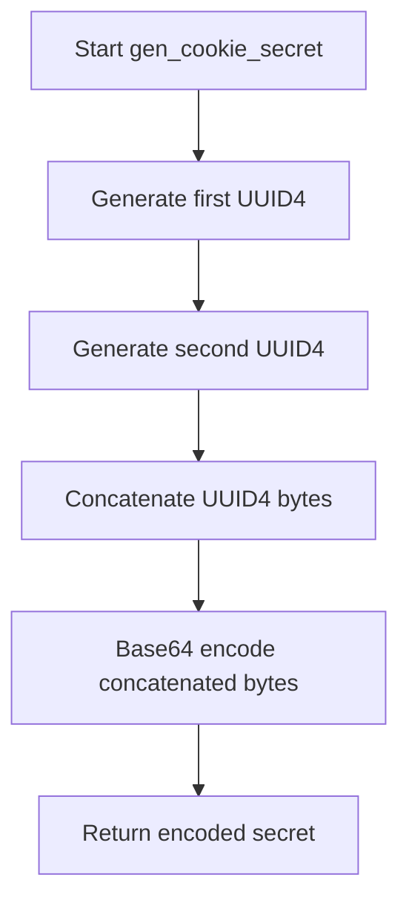

# `__init__.py`

## `flower.utils.__init__.gen_cookie_secret` · *function*

## Summary:
Generates a cryptographically secure random cookie secret using UUID4 randomness encoded in base64 format.

## Description:
Creates a unique cookie secret by combining two UUID4 random bytes and encoding them with base64. This function is used to generate secure authentication tokens for web applications. The secret is designed to be unpredictable and suitable for cryptographic purposes.

## Args:
    None

## Returns:
    bytes: A base64-encoded byte string containing 48 characters (32 bytes of random data encoded in base64 format) that serves as a secure cookie secret.

## Raises:
    None

## Constraints:
    Preconditions:
        - Python environment must have the `base64` and `uuid` modules available
        - System must have access to a cryptographically secure random number generator
    
    Postconditions:
        - The returned value is always 48 bytes long (including padding)
        - The returned value contains only base64-safe characters (A-Z, a-z, 0-9, +, /, =)
        - The value is cryptographically random and unpredictable

## Side Effects:
    None

## Control Flow:


## Examples:
```python
# Basic usage
secret = gen_cookie_secret()
print(len(secret))  # Output: 48
print(type(secret))  # Output: <class 'bytes'>

# Typical usage in web application configuration
COOKIE_SECRET = gen_cookie_secret()
```

## `flower.utils.__init__.bugreport` · *function*

## Summary:
Generates a formatted string containing version information for Flower and its dependencies, including Celery, Tornado, and Humanize.

## Description:
This function collects version information from Flower and its key dependencies to create a standardized bug report string. It is designed to help diagnose compatibility issues by providing a snapshot of the installed package versions. The function handles potential import errors gracefully by returning an informative error message.

## Args:
    app (celery.Celery, optional): A Celery application instance. If not provided, a default Celery instance is created.

## Returns:
    str: A formatted string containing version information for Flower, Tornado, Humanize, and the Celery application. In case of import errors, returns an error message indicating dependency issues.

## Raises:
    ImportError: When required packages (celery, humanize, tornado) cannot be imported.
    AttributeError: When required attributes (__version__, VERSION) are missing from the humanize module.

## Constraints:
    Preconditions:
        - The function assumes that the required packages (celery, humanize, tornado) are installed in the environment.
        - The humanize package must either have a `__version__` attribute or a `VERSION` attribute.
    Postconditions:
        - The returned string follows a consistent format regardless of whether an error occurs.
        - If successful, the string contains version information for all components.

## Side Effects:
    - No I/O operations or external state mutations occur.
    - The function does not make any network requests or modify files.

## Control Flow:
```mermaid
flowchart TD
    A[Start bugreport()] --> B{Import required packages}
    B -- Success --> C[Get Flower version]
    C --> D[Get Tornado version]
    D --> E[Get Humanize version]
    E --> F[Get Celery app bugreport]
    F --> G[Format and return result]
    B -- Failure --> H[Handle ImportError/AttributeError]
    H --> I[Return error message]
```

## Examples:
    >>> bugreport()
    'flower   -> flower:1.0.0 tornado:6.1.0 humanize:3.12.0Celery:4.4.7'
    
    >>> bugreport(celery_app_instance)
    'flower   -> flower:1.0.0 tornado:6.1.0 humanize:3.12.0Celery:4.4.7'
    
    >>> bugreport()  # With missing dependencies
    'Error when generating bug report: No module named \'celery\'. Have you installed correct versions of Flower\'s dependencies?'

## `flower.utils.__init__.abs_path` · *function*

## Summary:
Converts a given path to an absolute path by expanding user home directory and resolving relative paths against the current working directory.

## Description:
This function ensures that any provided path is converted to an absolute path. It first expands the user home directory (e.g., ~) using `os.path.expanduser()`, then checks if the resulting path is already absolute. If not, it joins the path with the current working directory to make it absolute.

## Args:
    path (str): A file path that may be relative or contain a tilde (~) representing the user's home directory.

## Returns:
    str: An absolute path string derived from the input path.

## Raises:
    None explicitly raised.

## Constraints:
    Preconditions:
        - The input `path` must be a string.
    Postconditions:
        - The returned value is always an absolute path string.
        - The function does not check if the path exists or is valid for file operations.

## Side Effects:
    None.

## Control Flow:


## Examples:
    >>> abs_path("~/documents/file.txt")
    '/home/user/documents/file.txt'
    
    >>> abs_path("relative/path/file.txt")
    '/current/working/directory/relative/path/file.txt'
    
    >>> abs_path("/absolute/path/file.txt")
    '/absolute/path/file.txt'
```

## `flower.utils.__init__.prepend_url` · *function*

## Summary:
Combines a URL path with a prefix by joining them with proper path formatting.

## Description:
This function joins a URL path with a prefix string, ensuring proper path formatting by stripping trailing slashes from the prefix and prepending it to the URL with a leading slash. It is commonly used in web frameworks to construct full URL paths from base prefixes and relative paths.

## Args:
    url (str): The URL path to be prefixed. Should not start with a forward slash to avoid double slashes in the result.
    prefix (str): The prefix string to prepend to the URL. May contain leading/trailing slashes which will be normalized.

## Returns:
    str: A combined URL path starting with a forward slash, formed by concatenating '/' + stripped_prefix + url.

## Raises:
    None

## Constraints:
    Precondition: The url argument should not start with a forward slash to prevent double slashes in the final result.
    Postcondition: The returned string always starts with a forward slash.

## Side Effects:
    None

## Control Flow:
```mermaid
flowchart TD
    A[prepend_url(url, prefix)] --> B[Strip trailing slashes from prefix]
    B --> C[Concatenate '/'+prefix+url]
    C --> D[Return result]
```

## Examples:
    >>> prepend_url('users/123', 'api/v1')
    '/api/v1/users/123'
    
    >>> prepend_url('users/123', 'api/v1/')
    '/api/v1/users/123'
    
    >>> prepend_url('users/123', '/api/v1/')
    '/api/v1/users/123'
    
    >>> prepend_url('users/123', '')
    '/users/123'

## `flower.utils.__init__.strtobool` · *function*

## Summary:
Converts a string representation of a boolean value into its integer equivalent (1 for true, 0 for false).

## Description:
This utility function provides a standardized way to parse string representations of boolean values commonly used in configuration files, environment variables, or user input. It accepts various common truthy and falsy string representations and maps them to integer 1 or 0 respectively. The function is designed to be robust and predictable, raising an exception for invalid inputs rather than making assumptions.

## Args:
    val (str): A string representing a boolean value. Expected to be one of the predefined truthy or falsy strings.

## Returns:
    int: Returns 1 if the input string represents a truthy value, 0 if it represents a falsy value.

## Raises:
    ValueError: Raised when the input string does not match any of the recognized truthy or falsy values.

## Constraints:
    - Preconditions: The input argument `val` must be a string.
    - Postconditions: The returned value is strictly either 1 or 0.

## Side Effects:
    None.

## Control Flow:
```mermaid
flowchart TD
    A[Start strtobool] --> B{val.lower()}
    B --> C{val in ('y','yes','t','true','on','1')}
    C -->|True| D[Return 1]
    C -->|False| E{val in ('n','no','f','false','off','0')}
    E -->|True| F[Return 0]
    E -->|False| G[Raise ValueError]
```

## Examples:
    >>> strtobool('yes')
    1
    >>> strtobool('false')
    0
    >>> strtobool('maybe')
    ValueError: invalid truth value 'maybe'
```

