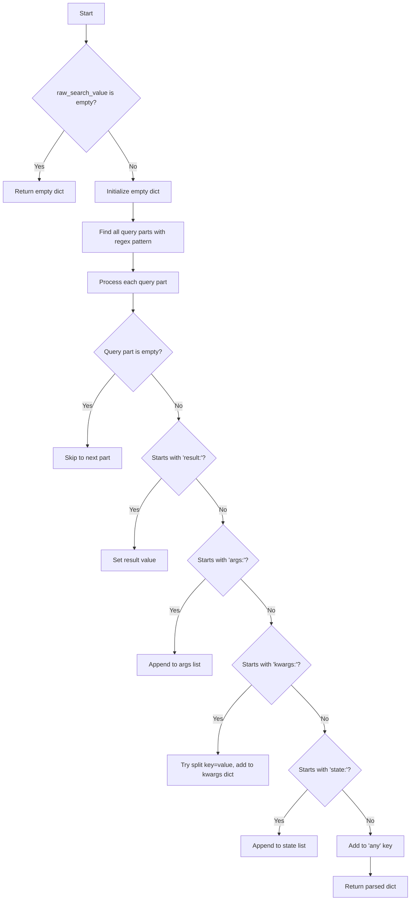
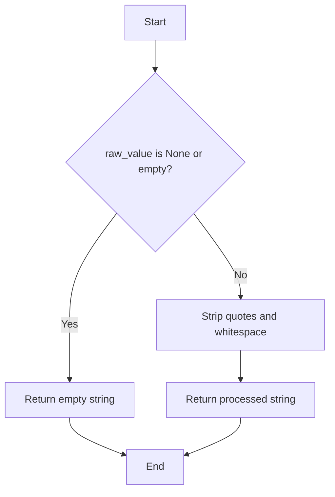
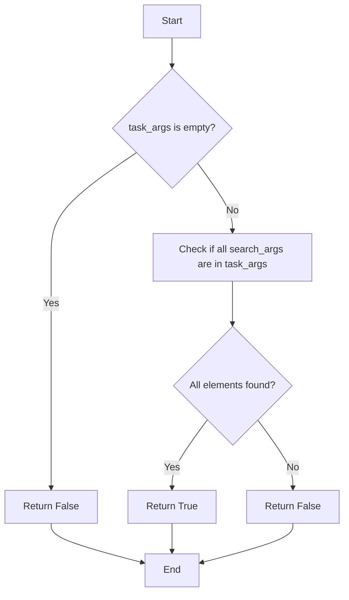

# `search.py`

## `flower.utils.search.parse_search_terms` · *function*

## Summary:
Parses raw search query strings into structured search parameters, supporting special prefixes and quoted values.

## Description:
Processes a raw search string into a dictionary of structured search parameters. Handles special prefixes like 'result:', 'args:', 'kwargs:', and 'state:' to categorize search terms appropriately. Uses a regex pattern that splits by space while respecting quoted content that may contain spaces.

## Args:
    raw_search_value (str): The raw search query string to parse. Can be empty or None.

## Returns:
    dict: A dictionary containing parsed search parameters with keys:
        - 'result': Single value for result filtering
        - 'args': List of positional argument values
        - 'kwargs': Dictionary of keyword argument values
        - 'state': List of state values
        - 'any': Single catch-all value for unclassified terms

## Raises:
    None

## Constraints:
    Precondition: Input should be a string or None.
    Postcondition: Returns a dictionary with normalized search values via preprocess_search_value.

## Side Effects:
    None

## Control Flow:


## Examples:
    >>> parse_search_terms('result:success args:1 args:2 kwargs:status=active')
    {'result': 'success', 'args': ['1', '2'], 'kwargs': {'status': 'active'}}
    
    >>> parse_search_terms('state:pending state:completed "quoted term"')
    {'state': ['pending', 'completed'], 'any': 'quoted term'}
    
    >>> parse_search_terms('')
    {}
```

## `flower.utils.search.satisfies_search_terms` · *function*

## Summary:
Determines whether a task matches specified search criteria across multiple fields including state, arguments, keyword arguments, and result values.

## Description:
This function evaluates if a given task satisfies various search terms by checking multiple attributes of the task object. It supports searching across task state, any field value, result content, keyword arguments, and positional arguments. The function is designed to be used in filtering or querying task collections based on user-defined search criteria.

Known callers within the codebase:
- This function is likely used in task filtering logic where users specify search terms to find matching tasks in a task queue or monitoring system.

This logic is extracted into its own function rather than inlined because:
- It encapsulates complex multi-field search logic that could become unwieldy if embedded directly in calling code
- It provides a reusable interface for task filtering operations
- It separates the concerns of search term interpretation from the higher-level task management logic

## Args:
    task (object): A task object containing attributes like name, uuid, state, worker, args, kwargs, and result
    search_terms (dict): A dictionary containing optional keys:
        - 'any' (str, optional): Search term that must appear in any of the task's string representations
        - 'result' (str, optional): Search term that must appear in the task's result
        - 'args' (list, optional): List of arguments that must be present in the task's args
        - 'kwargs' (dict, optional): Dictionary of key-value pairs that must be present in the task's kwargs
        - 'state' (list, optional): List of states that the task must match

## Returns:
    bool: True if the task matches any of the specified search criteria, False otherwise. Returns True when no search terms are provided.

## Raises:
    None explicitly raised.

## Constraints:
    Preconditions:
        - The task object must have attributes: name, uuid, state, worker, args, kwargs, and result
        - The search_terms dictionary should contain valid keys ('any', 'result', 'args', 'kwargs', 'state')
        - When 'args' is provided, it should be iterable
        - When 'kwargs' is provided, it should be a dictionary
        - When 'state' is provided, it should be iterable
    Postconditions:
        - The function returns a boolean value indicating whether the task matches the search criteria
        - The function handles None values gracefully in string concatenation operations

## Side Effects:
    None.

## Control Flow:
```mermaid
flowchart TD
    A[Start] --> B{No search terms provided?}
    B -- Yes --> C[Return True]
    B -- No --> D[Extract search terms]
    D --> E[Check state search terms]
    E --> F[Check any value search terms]
    F --> G[Check result search terms]
    G --> H[Check kwargs search terms]
    H --> I[Check args search terms]
    I --> J[Combine all conditions]
    J --> K[Return any(terms)]
```

## Examples:
    Example 1: Matching any field value
        Input: satisfies_search_terms(task_with_name="process_data", search_terms={'any': 'data'})
        Output: True

    Example 2: Matching result content
        Input: satisfies_search_terms(task_with_result="Success", search_terms={'result': 'Success'})
        Output: True

    Example 3: Matching keyword arguments
        Input: satisfies_search_terms(task_with_kwargs={'priority': 'high'}, search_terms={'kwargs': {'priority': 'high'}})
        Output: True

    Example 4: Matching arguments
        Input: satisfies_search_terms(task_with_args=['arg1', 'arg2'], search_terms={'args': ['arg1']})
        Output: True

    Example 5: No search terms provided
        Input: satisfies_search_terms(task_with_any_fields, search_terms={})
        Output: True
```
<DOCUMENTATION>
## Summary:
Determines whether a task matches specified search criteria across multiple fields including state, arguments, keyword arguments, and result values.

## Description:
This function evaluates if a given task satisfies various search terms by checking multiple attributes of the task object. It supports searching across task state, any field value, result content, keyword arguments, and positional arguments. The function is designed to be used in filtering or querying task collections based on user-defined search criteria.

Known callers within the codebase:
- This function is likely used in task filtering logic where users specify search terms to find matching tasks in a task queue or monitoring system.

This logic is extracted into its own function rather than inlined because:
- It encapsulates complex multi-field search logic that could become unwieldy if embedded directly in calling code
- It provides a reusable interface for task filtering operations
- It separates the concerns of search term interpretation from the higher-level task management logic

## Args:
    task (object): A task object containing attributes like name, uuid, state, worker, args, kwargs, and result
    search_terms (dict): A dictionary containing optional keys:
        - 'any' (str, optional): Search term that must appear in any of the task's string representations
        - 'result' (str, optional): Search term that must appear in the task's result
        - 'args' (list, optional): List of arguments that must be present in the task's args
        - 'kwargs' (dict, optional): Dictionary of key-value pairs that must be present in the task's kwargs
        - 'state' (list, optional): List of states that the task must match

## Returns:
    bool: True if the task matches any of the specified search criteria, False otherwise. Returns True when no search terms are provided.

## Raises:
    None explicitly raised.

## Constraints:
    Preconditions:
        - The task object must have attributes: name, uuid, state, worker, args, kwargs, and result
        - The search_terms dictionary should contain valid keys ('any', 'result', 'args', 'kwargs', 'state')
        - When 'args' is provided, it should be iterable
        - When 'kwargs' is provided, it should be a dictionary
        - When 'state' is provided, it should be iterable
    Postconditions:
        - The function returns a boolean value indicating whether the task matches the search criteria
        - The function handles None values gracefully in string concatenation operations

## Side Effects:
    None.

## Control Flow:
```mermaid
flowchart TD
    A[Start] --> B{No search terms provided?}
    B -- Yes --> C[Return True]
    B -- No --> D[Extract search terms]
    D --> E[Check state search terms]
    E --> F[Check any value search terms]
    F --> G[Check result search terms]
    G --> H[Check kwargs search terms]
    H --> I[Check args search terms]
    I --> J[Combine all conditions]
    J --> K[Return any(terms)]
```

## Examples:
    Example 1: Matching any field value
        Input: satisfies_search_terms(task_with_name="process_data", search_terms={'any': 'data'})
        Output: True

    Example 2: Matching result content
        Input: satisfies_search_terms(task_with_result="Success", search_terms={'result': 'Success'})
        Output: True

    Example 3: Matching keyword arguments
        Input: satisfies_search_terms(task_with_kwargs={'priority': 'high'}, search_terms={'kwargs': {'priority': 'high'}})
        Output: True

    Example 4: Matching arguments
        Input: satisfies_search_terms(task_with_args=['arg1', 'arg2'], search_terms={'args': ['arg1']})
        Output: True

    Example 5: No search terms provided
        Input: satisfies_search_terms(task_with_any_fields, search_terms={})
        Output: True

## `flower.utils.search.stringified_dict_contains_value` · *function*

## Summary:
Determines if a specified key-value pair exists in a JSON-like string representation of a dictionary.

## Description:
This function parses a stringified dictionary (in JSON-like format) to check if a given key exists and has the specified value. It extracts the value associated with the key and compares it with the provided value after converting both to strings. This utility is useful for parsing and validating configuration or metadata stored as strings.

## Args:
    key (str): The key to search for within the stringified dictionary.
    value (Any): The value to compare against the extracted value from the dictionary.
    str_dict (str): A string representation of a dictionary in format '{"key": "value"}' or similar.

## Returns:
    bool: True if the key exists in the stringified dictionary and its associated value matches the provided value; False otherwise.

## Raises:
    None explicitly raised.

## Constraints:
    Preconditions:
        - The `str_dict` parameter must be a valid string representation of a dictionary with key-value pairs in the format '"key": "value"'.
        - The `key` parameter must be a string.
        - The `value` parameter can be any type that can be converted to a string.
    Postconditions:
        - The function returns a boolean indicating the presence and match of the key-value pair.
        - The function handles malformed dictionaries gracefully by returning False.

## Side Effects:
    None.

## Control Flow:
```mermaid
flowchart TD
    A[Start] --> B{str_dict is empty?}
    B -- Yes --> C[Return False]
    B -- No --> D[value = str(value)]
    D --> E[Find index of key in str_dict]
    E --> F{Key found?}
    F -- No --> G[Return False]
    F -- Yes --> H[Calculate key_index = index + len(key) + 3]
    H --> I[Find comma or closing brace after key_index]
    I --> J[Extract value substring from key_index to comma/closing brace]
    J --> K[Strip surrounding quotes from extracted value]
    K --> L[Compare stripped value with str(value)]
    L --> M[Return comparison result]
```

## Examples:
    Example 1: Checking for a matching key-value pair
        Input: stringified_dict_contains_value("name", "John", '{"name": "John", "age": 30}')
        Output: True

    Example 2: Checking for a non-matching value
        Input: stringified_dict_contains_value("name", "Jane", '{"name": "John", "age": 30}')
        Output: False

    Example 3: Key not found in dictionary
        Input: stringified_dict_contains_value("height", "175cm", '{"name": "John", "age": 30}')
        Output: False

    Example 4: Empty dictionary
        Input: stringified_dict_contains_value("name", "John", "")
        Output: False

    Example 5: Numeric value comparison
        Input: stringified_dict_contains_value("age", 30, '{"name": "John", "age": 30}')
        Output: True

    Example 6: Boolean value comparison
        Input: stringified_dict_contains_value("active", True, '{"name": "John", "active": true}')
        Output: True
```

## `flower.utils.search.preprocess_search_value` · *function*

## Summary:
Strips surrounding quotes and whitespace from a search value string.

## Description:
This function processes raw search input by removing leading and trailing whitespace, as well as surrounding double quotes. It serves as a preprocessing step to normalize search terms before further processing or indexing.

## Args:
    raw_value (str or None): The raw search input string to process. May be None or empty.

## Returns:
    str: The processed search value with surrounding quotes and whitespace removed. Returns empty string if input is None or empty.

## Raises:
    None

## Constraints:
    Precondition: Input can be a string or None.
    Postcondition: Output is always a string with no leading/trailing whitespace or surrounding double quotes.

## Side Effects:
    None

## Control Flow:


## Examples:
    >>> preprocess_search_value(' "hello world" ')
    'hello world'
    >>> preprocess_search_value(None)
    ''
    >>> preprocess_search_value('')
    ''
    >>> preprocess_search_value('"test"')
    'test'
```

## `flower.utils.search.task_args_contains_search_args` · *function*

## Summary:
Checks whether all specified search arguments are contained within a collection of task arguments.

## Description:
This function determines if every element in the search_args iterable is present in the task_args collection. It serves as a utility for validating that a set of required arguments are all available in a given task argument list or tuple.

## Args:
    task_args (Iterable): A collection of arguments (e.g., list, tuple, set) to search within.
    search_args (Iterable): A collection of arguments to look for in task_args.

## Returns:
    bool: True if all elements in search_args are found in task_args, False otherwise.

## Raises:
    None

## Constraints:
    Preconditions:
        - Both task_args and search_args should be iterable objects.
        - The function does not validate the types of elements within the iterables.
    Postconditions:
        - The function returns a boolean value indicating membership of all search_args in task_args.

## Side Effects:
    None

## Control Flow:


## Examples:
    >>> task_args_contains_search_args(['a', 'b', 'c'], ['a', 'b'])
    True
    >>> task_args_contains_search_args(['a', 'b', 'c'], ['a', 'd'])
    False
    >>> task_args_contains_search_args([], ['a'])
    False
    >>> task_args_contains_search_args(['a', 'b'], [])
    True

