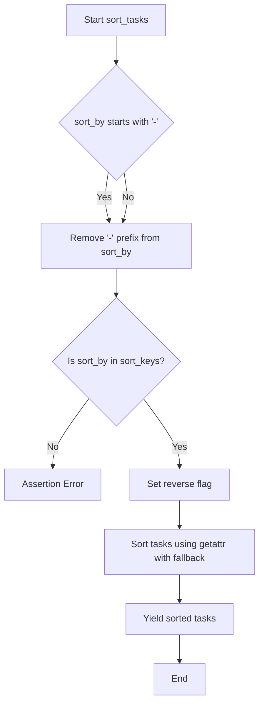
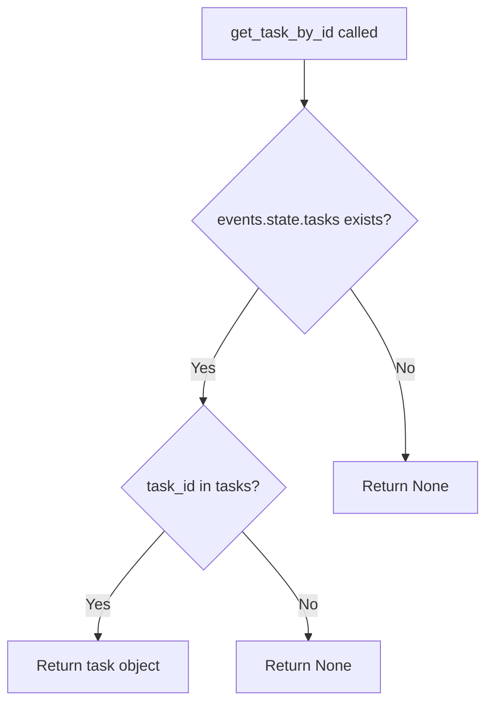

# `tasks.py`

## `flower.utils.tasks.iter_tasks` · *function*

## Summary:
Iterates over tasks with optional filtering and pagination based on various criteria.

## Description:
This function provides a flexible way to iterate over tasks from an events object, applying filters for task type, worker, state, timestamps, and search terms. It supports sorting, pagination (offset and limit), and complex filtering logic. The function is designed to be used in task monitoring and querying systems where users need to filter and paginate through large sets of tasks.

Known callers within the codebase:
- This function is likely called by UI components or API endpoints that display task lists with filtering capabilities
- It would be invoked during task listing operations where users apply filters such as task type, worker hostname, state, date ranges, or search terms

This logic is extracted into its own function rather than inlined because:
- It encapsulates complex filtering and pagination logic that would otherwise clutter calling code
- It provides a reusable interface for task iteration with multiple filter options
- It separates the concerns of task iteration from the higher-level task management or display logic
- It allows for efficient processing of large task collections by yielding results incrementally

## Args:
    events (object): An events object containing task data, with a state attribute that provides access to tasks
    limit (int, optional): Maximum number of tasks to yield. None means no limit
    offset (int): Number of tasks to skip before starting to yield. Defaults to 0
    type (str, optional): Filter tasks by task name/type
    worker (str, optional): Filter tasks by worker hostname
    state (str, optional): Filter tasks by task state
    sort_by (str, optional): Attribute to sort by (prefix with '-' for descending)
    received_start (str, optional): Filter tasks received after this timestamp (format: 'YYYY-MM-DD HH:MM')
    received_end (str, optional): Filter tasks received before this timestamp (format: 'YYYY-MM-DD HH:MM')
    started_start (str, optional): Filter tasks started after this timestamp (format: 'YYYY-MM-DD HH:MM')
    started_end (str, optional): Filter tasks started before this timestamp (format: 'YYYY-MM-DD HH:MM')
    search (dict, optional): Search terms to filter tasks by content

## Returns:
    generator: Generator yielding tuples of (uuid, task) for matching tasks

## Raises:
    None explicitly raised.

## Constraints:
    Preconditions:
        - The events object must have a state attribute with a tasks_by_timestamp() method
        - Timestamp strings must be in format 'YYYY-MM-DD HH:MM'
        - The sort_by parameter must be a valid key supported by the sort_tasks function
        - All filter parameters are optional and can be None
    Postconditions:
        - The function yields tasks in the specified order and filtered by all criteria
        - Tasks are yielded in chronological order unless overridden by sort_by parameter
        - Pagination is applied correctly with offset and limit

## Side Effects:
    None.

## Control Flow:
```mermaid
flowchart TD
    A[Start iter_tasks] --> B[Initialize counter i=0]
    B --> C[Get tasks from events.state.tasks_by_timestamp()]
    C --> D{sort_by provided?}
    D -- Yes --> E[Sort tasks using sort_tasks]
    D -- No --> E
    E --> F[Parse search terms]
    F --> G[Iterate through tasks]
    G --> H{type filter set?}
    H -- Yes --> I[type.name != type?]
    I -- Yes --> J[Continue to next task]
    H -- No --> K
    K --> L{worker filter set?}
    L -- Yes --> M[task.worker.hostname != worker?]
    M -- Yes --> N[Continue to next task]
    L -- No --> O
    O --> P{state filter set?}
    P -- Yes --> Q[task.state != state?]
    Q -- Yes --> R[Continue to next task]
    P -- No --> S
    S --> T{received_start set?}
    T -- Yes --> U[task.received < convert(received_start)?]
    U -- Yes --> V[Continue to next task]
    T -- No --> W
    W --> X{received_end set?}
    X -- Yes --> Y[task.received > convert(received_end)?]
    Y -- Yes --> Z[Continue to next task]
    X -- No --> AA
    AA --> AB{started_start set?}
    AB -- Yes --> AC[task.started < convert(started_start)?]
    AC -- Yes --> AD[Continue to next task]
    AB -- No --> AE
    AE --> AF{started_end set?}
    AF -- Yes --> AG[task.started > convert(started_end)?]
    AG -- Yes --> AH[Continue to next task]
    AF -- No --> AI
    AI --> AJ{satisfies_search_terms?}
    AJ -- No --> AK[Continue to next task]
    AJ -- Yes --> AL{i >= offset?}
    AL -- Yes --> AM[Yield (uuid, task)]
    AL -- No --> AN
    AN --> AO[i += 1]
    AO --> AP{limit set?}
    AP -- Yes --> AQ[i == limit + offset?]
    AQ -- Yes --> AR[Break loop]
    AP -- No --> AS
    AS --> AT[Loop back to G]
    AR --> AU[End]
    AT --> AU
```

## Examples:
    Example 1: Basic iteration with no filters
        Input: iter_tasks(events)
        Output: Generator yielding all tasks in chronological order

    Example 2: Iteration with pagination
        Input: iter_tasks(events, limit=10, offset=20)
        Output: Generator yielding 10 tasks starting from the 21st task

    Example 3: Filtering by task type
        Input: iter_tasks(events, type='process_image')
        Output: Generator yielding only tasks of type 'process_image'

    Example 4: Filtering by worker and state
        Input: iter_tasks(events, worker='worker1', state='SUCCESS')
        Output: Generator yielding only successful tasks from worker1

    Example 5: Filtering by date range
        Input: iter_tasks(events, received_start='2023-01-01 00:00', received_end='2023-01-01 23:59')
        Output: Generator yielding tasks received on January 1, 2023

    Example 6: Complex filtering with search terms
        Input: iter_tasks(events, type='send_email', search={'any': 'customer'})
        Output: Generator yielding email tasks containing 'customer' in any field

## `flower.utils.tasks.sort_tasks` · *function*

## Summary:
Generates a sorted sequence of tasks based on a specified attribute and sorting order.

## Description:
This function takes a collection of tasks and sorts them according to a given attribute name. It supports both ascending and descending sort orders through a prefix '-' in the sort_by parameter. The function is designed to work with task objects that have attributes accessible via getattr(). This function encapsulates the sorting logic to provide a reusable mechanism for ordering tasks in various contexts.

## Args:
    tasks (iterable): An iterable of task tuples where each tuple contains (task_id, task_object).
    sort_by (str): The attribute name to sort by. Prefix with '-' for descending order.

## Returns:
    generator: A generator yielding task tuples in the specified sort order.

## Raises:
    AssertionError: When the sort_by attribute is not in the predefined sort_keys dictionary.

## Constraints:
    Preconditions:
        - The sort_by parameter must be a valid key in the global sort_keys dictionary.
        - Each task in tasks must be a tuple of (task_id, task_object).
        - The task_object must have an attribute matching the sort_by parameter.
    Postconditions:
        - The returned generator yields tasks in sorted order.
        - The original tasks collection remains unmodified.

## Side Effects:
    None

## Control Flow:


## Examples:
    # Sort tasks by creation date (ascending)
    sorted_tasks = sort_tasks(task_list, 'created_at')
    
    # Sort tasks by priority (descending)
    sorted_tasks = sort_tasks(task_list, '-priority')
```

## `flower.utils.tasks.get_task_by_id` · *function*

## Summary:
Retrieves a specific task object from the events state using its unique identifier.

## Description:
This function provides a standardized way to access task objects stored within the events state. It serves as a wrapper around the dictionary lookup operation on the tasks collection, ensuring consistent access patterns throughout the application.

The function is typically called during task processing workflows where a specific task needs to be retrieved by its ID for further operations such as status updates, result retrieval, or task analysis.

This logic is extracted into its own function to enforce a clear separation between task data access and business logic, making the codebase more maintainable and testable.

## Args:
    events (object): An object containing state information, specifically the tasks collection
    task_id (str or int): The unique identifier of the task to retrieve

## Returns:
    Task object or None: The task object matching the provided ID, or None if no matching task is found

## Raises:
    None explicitly raised

## Constraints:
    Preconditions:
        - The events parameter must be a valid object with a state attribute
        - The events.state must contain a tasks attribute that behaves like a dictionary
        - The task_id parameter must be a valid key type for the tasks dictionary

    Postconditions:
        - The function returns either a task object or None
        - No modifications are made to the underlying data structure

## Side Effects:
    None

## Control Flow:


## Examples:
```python
# Typical usage in task processing
task = get_task_by_id(events, "task_123")
if task:
    # Process the task
    print(f"Task status: {task.status}")
else:
    # Handle missing task
    print("Task not found")
```

## `flower.utils.tasks.as_dict` · *function*

## Summary:
Converts a task object into its dictionary representation by invoking its `as_dict()` method.

## Description:
This function serves as a simple delegation wrapper that converts a task object into dictionary format by calling the task's built-in `as_dict()` method. It provides a consistent interface for extracting task data regardless of the specific task implementation, enabling uniform processing of different task types throughout the application.

## Args:
    task (object): A task object that must implement an `as_dict()` method. This method should return a dictionary representation of the task's data.

## Returns:
    dict: A dictionary containing the task's data, as returned by the task's `as_dict()` method.

## Raises:
    AttributeError: If the provided task object does not have an `as_dict()` method.

## Constraints:
    Preconditions:
        - The `task` argument must be an object that implements the `as_dict()` method.
    Postconditions:
        - The returned value is a dictionary representation of the task's data.
        - An AttributeError is raised if the task object lacks the required method.

## Side Effects:
    None

## Control Flow:
```mermaid
flowchart TD
    A[as_dict(task)] --> B{task has as_dict method?}
    B -- Yes --> C[task.as_dict()]
    B -- No --> D[AttributeError]
    C --> E[Return dict]
    D --> F[Raise AttributeError]
```

## Examples:
```python
# Example usage with a valid task object
task = SomeTaskClass()
result = as_dict(task)
print(result)  # Outputs the dictionary representation of the task

# Example showing error case
invalid_task = "not a task object"
try:
    as_dict(invalid_task)
except AttributeError:
    print("Task object must have as_dict method")
```

