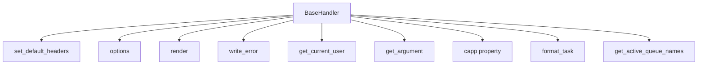

# `__init__.py`

## `flower.views.__init__.BaseHandler` · *class*

## Summary:
BaseHandler is a Tornado web request handler that provides common functionality for Flower web views, including CORS configuration, authentication, error handling, and task formatting.

## Description:
BaseHandler serves as the foundation for all web view handlers in the Flower application. It extends Tornado's RequestHandler to provide standardized behavior for HTTP requests, including CORS configuration, authentication mechanisms (basic auth and OAuth2), argument parsing with type conversion, and custom error rendering. This class centralizes common web application concerns to reduce code duplication across individual view handlers.

The class handles various HTTP methods and provides utilities for working with Celery tasks, managing authentication, and rendering templates with appropriate context.

## State:
- `application`: Reference to the Tornado application instance containing configuration and worker data
- `capp`: Property returning the Celery application object from the application instance  
- `request`: Inherited from RequestHandler, contains the HTTP request data
- `response`: Inherited from RequestHandler, contains the HTTP response data

## Lifecycle:
- Creation: Instantiated automatically by Tornado's routing mechanism when handling HTTP requests
- Usage: Methods are called in standard Tornado request lifecycle order (options, get, post, etc.)
- Destruction: Managed automatically by Tornado's request handling cycle

## Method Map:


## Raises:
- `tornado.web.HTTPError(401)`: Raised during authentication when credentials are invalid or missing
- `tornado.web.HTTPError(400)`: Raised when argument parsing fails due to invalid type conversion
- `tornado.web.HTTPError(404)`: Raised for 404 errors during error handling
- `tornado.web.HTTPError(403)`: Raised for 403 errors during error handling
- `tornado.web.HTTPError(500)`: Raised for 500 errors during error handling

## Example:
```python
# Typical usage would be through inheritance
class MyView(BaseHandler):
    def get(self):
        # Access Celery app via self.capp
        tasks = self.capp.AsyncResult('task-id')
        # Render template with context
        self.render('my_template.html', tasks=tasks)
        
# Authentication flow:
# 1. Basic Auth: Authorization header with Basic credentials
# 2. OAuth2: Secure cookie 'user' matching auth pattern  
# 3. No auth: Access granted if no auth configured

# Argument parsing with type conversion:
task_id = self.get_argument('task_id', type=str)  # Gets string argument
is_active = self.get_argument('active', type=bool)  # Gets boolean argument
```

### `flower.views.__init__.BaseHandler.set_default_headers` · *method*

## Summary:
Configures CORS headers for cross-origin requests when authentication is disabled.

## Description:
This method sets Cross-Origin Resource Sharing (CORS) headers on HTTP responses to enable web applications from different origins to make requests to the server. It is called automatically during the response preparation phase by Tornado's request handling mechanism. The CORS headers are only set when both basic authentication and custom authentication are disabled, ensuring secure API access when authentication is required.

## Args:
    self: The BaseHandler instance whose response headers will be modified.

## Returns:
    None

## Raises:
    None explicitly raised

## State Changes:
    Attributes READ: 
        - self.application.options.basic_auth
        - self.application.options.auth
    Attributes WRITTEN:
        - Response headers via self.set_header() calls

## Constraints:
    Preconditions:
        - The method must be called on a BaseHandler instance
        - The application must have options attribute with basic_auth and auth properties
    Postconditions:
        - If authentication is disabled, CORS headers are set on the response
        - If authentication is enabled, no CORS headers are set

## Side Effects:
    - Modifies HTTP response headers to include CORS configuration
    - No external service calls or I/O operations performed

### `flower.views.__init__.BaseHandler.options` · *method*

## Summary:
Sets the HTTP status code to 204 (No Content) and finishes the response.

## Description:
This method is typically invoked during CORS preflight requests or when a client sends an OPTIONS request to check supported methods. It configures the response with a 204 status code indicating no content is returned, then finalizes the HTTP response.

## Args:
    self: The BaseHandler instance
    *_: Additional positional arguments (ignored)
    **__: Additional keyword arguments (ignored)

## Returns:
    None

## Raises:
    None explicitly raised

## State Changes:
    Attributes READ: None
    Attributes WRITTEN: None

## Constraints:
    Preconditions: None
    Postconditions: Response status is set to 204 and response is finished

## Side Effects:
    I/O: Writes HTTP response headers and terminates the response stream

### `flower.views.__init__.BaseHandler.render` · *method*

## Summary:
Renders a template with injected helper functions and URL prefix context.

## Description:
This method extends the standard rendering functionality by automatically injecting template helper functions and application URL prefix into the rendering context. It prevents naming conflicts between template functions and user-provided arguments before delegating to the parent class's render method.

## Args:
    *args: Positional arguments passed to the parent render method
    *kwargs: Keyword arguments passed to the parent render method, with template helper functions and URL prefix automatically injected

## Returns:
    None: This method doesn't return a value directly, but renders content to the response

## Raises:
    AssertionError: When any template function name would conflict with existing keyword arguments

## State Changes:
    Attributes READ: self.application.options
    Attributes WRITTEN: None

## Constraints:
    Preconditions: 
    - self.application must have an options attribute with a url_prefix field
    - template module must exist and contain functions
    - No keyword argument names should conflict with template function names
    
    Postconditions:
    - The kwargs dictionary is modified to include template helper functions and url_prefix
    - The parent render method is called with the updated kwargs

## Side Effects:
    I/O: Calls the parent class's render method which likely performs HTTP response rendering

### `flower.views.__init__.BaseHandler.write_error` · *method*

## Summary:
Handles HTTP error responses by rendering appropriate templates or setting specific headers and messages based on the status code.

## Description:
This method is invoked by the Tornado web framework when an HTTP error occurs during request processing. It provides custom error handling for different HTTP status codes, rendering specific HTML templates for client errors (404, 403) and server errors (500), while handling authentication errors (401) with specific headers and plain text responses. The method leverages the Tornado framework's built-in error handling mechanism to process various HTTP status codes appropriately.

## Args:
    status_code (int): The HTTP status code that triggered this error handler.
    **kwargs: Additional keyword arguments, including 'exc_info' which contains exception information from the Tornado framework.

## Returns:
    None: This method does not return a value but modifies the HTTP response directly through Tornado's response methods.

## Raises:
    None explicitly raised: The method handles exceptions internally through the Tornado framework's error handling mechanism.

## State Changes:
    Attributes READ:
        - self.application.options.debug
    Attributes WRITTEN:
        - HTTP response headers and body via self.set_header(), self.set_status(), self.render(), self.write(), self.finish()

## Constraints:
    Preconditions:
        - The method must be called by the Tornado web framework's error handling mechanism.
        - The status_code parameter must be an integer representing a valid HTTP status code.
        - For 500 errors, kwargs must contain 'exc_info' with traceback information from the Tornado framework.
        - For 404, 403, and 401 errors, the method handles them appropriately without requiring additional validation.
        - The 'exc_info' argument in kwargs is expected to be a tuple of (exception_type, exception_instance, traceback) from Tornado's error handling.
    Postconditions:
        - For 404 and 403: Renders the '404.html' template with an optional message extracted from HTTPError's log_message attribute.
        - For 500: Renders the 'error.html' template with debugging information including stack trace and bug report.
        - For 401: Sets WWW-Authenticate header and writes 'Access denied' message.
        - For other errors: Sets the status code and finishes the response with optional plain text message extracted from HTTPError's log_message attribute.

## Side Effects:
    - Writes to HTTP response stream via self.render(), self.write(), self.finish()
    - Sets HTTP headers via self.set_header()
    - Sets HTTP status code via self.set_status()
    - May include stack trace information in the response for 500 errors

### `flower.views.__init__.BaseHandler.get_current_user` · *method*

## Summary:
Retrieves the current authenticated user by validating either Basic Authentication credentials or OAuth2-style secure cookies.

## Description:
This method implements dual authentication logic for web requests. It first attempts Basic Authentication by parsing the Authorization header and comparing credentials against stored values. If Basic Auth is disabled or fails, it falls back to OAuth2-style authentication using secure cookies. This method is typically invoked during request processing to determine user identity before accessing protected resources.

## Args:
    self: The BaseHandler instance containing request and application context

## Returns:
    str or bool or None: 
        - Returns the authenticated user identifier (str) if OAuth2 authentication succeeds
        - Returns True if Basic Authentication is enabled but no specific user is identified (e.g., valid basic auth but no user extraction)
        - Returns None if both authentication methods fail

## Raises:
    tornado.web.HTTPError: Raised with status code 401 when:
        - Basic Authentication header is malformed or missing
        - Basic Authentication credentials don't match any stored credentials
        - OAuth2 cookie validation fails

## State Changes:
    Attributes READ: 
        - self.application.options.basic_auth
        - self.application.options.auth
        - self.request.headers
        - self.get_secure_cookie()
    Attributes WRITTEN: None

## Constraints:
    Preconditions:
        - self.application.options.basic_auth must be None or a list/tuple of valid credential strings
        - self.application.options.auth must be None or a regex pattern string for user validation
        - When basic auth is enabled, Authorization header must be present in request
        - When OAuth2 is used, secure cookie 'user' must be present and valid

    Postconditions:
        - If authentication succeeds, the returned value represents a valid authenticated user
        - If authentication fails, an HTTPError with status 401 is raised
        - The method handles both string and bytes cookie values gracefully

## Side Effects:
    - Calls self.get_secure_cookie('user') which may involve I/O operations to retrieve cookies from the client
    - May raise tornado.web.HTTPError which terminates the request processing flow
    - Uses hmac.compare_digest for secure credential comparison to prevent timing attacks

### `flower.views.__init__.BaseHandler.get_argument` · *method*

## Summary:
Retrieves and processes HTTP request arguments with XSS protection and type conversion.

## Description:
Extracts an argument from the HTTP request, applies HTML escaping to prevent XSS attacks for string values, and optionally converts the argument to a specified type. This method extends the base Tornado handler's argument retrieval with additional security and type validation features.

## Args:
    name (str): The name of the argument to retrieve from the request.
    default (list, optional): Default value to return if the argument is not present. Note: Using a mutable default like [] is discouraged due to Python's mutable default argument behavior. Defaults to an empty list.
    strip (bool, optional): Whether to strip whitespace from the argument value. Defaults to True.
    type (type, optional): The type to convert the argument to. Special handling for bool type using strtobool utility. If None, no conversion occurs. Defaults to None.

## Returns:
    The argument value, potentially converted to the specified type and escaped for XSS protection. Returns the default value if the argument is not present. For boolean type conversion, returns an integer (1 or 0) rather than a Python bool.

## Raises:
    tornado.web.HTTPError: Raised when type conversion fails and the argument is not present with a None default. The error message includes the invalid argument and type information.

## State Changes:
    Attributes READ: None
    Attributes WRITTEN: None

## Constraints:
    Preconditions: The method assumes the request object is properly initialized and accessible via the parent class.
    Postconditions: The returned value is either the default, the processed argument, or raises an HTTP error for invalid conversions. For boolean arguments, returns integer 1 or 0.

## Side Effects:
    I/O: Performs HTTP request parsing operations.
    External service calls: None
    Mutations to objects outside self: None

### `flower.views.__init__.BaseHandler.capp` · *method*

## Summary:
Returns the Celery application object associated with the current request handler.

## Description:
This property provides access to the Celery application instance that manages the current Flower application. It serves as a convenient way to obtain the Celery app object without having to reference it through the application context directly. This method is typically called during request processing to interact with Celery tasks, workers, or configuration.

## Args:
    None

## Returns:
    The Celery application object (capp) from the application context.

## Raises:
    None

## State Changes:
    Attributes READ: self.application.capp
    Attributes WRITTEN: None

## Constraints:
    Preconditions: The BaseHandler instance must be properly initialized with an application that has a capp attribute.
    Postconditions: The returned object is the same Celery application instance that was configured in the application context.

## Side Effects:
    None

### `flower.views.__init__.BaseHandler.format_task` · *method*

## Summary:
Applies custom formatting to a task object using a configured formatter function, preserving the original task.

## Description:
This method enables extensible task formatting by invoking a user-configured custom formatting function if one is provided via application options. It operates on a copy of the task to ensure the original remains unmodified, providing a safe way to transform task data according to application-specific requirements.

## Args:
    task (Any): The task object to be formatted. Must have a 'uuid' attribute for logging purposes when formatting fails.

## Returns:
    Any: The formatted task object. If no custom formatter is configured, returns the original task unchanged.

## Raises:
    None explicitly raised, but exceptions from custom formatting functions are caught and logged with task UUID for debugging.

## State Changes:
    Attributes READ: self.application.options.format_task, self.application.options
    Attributes WRITTEN: None

## Constraints:
    Preconditions: 
    - The task object must have a 'uuid' attribute for proper error logging
    - The custom formatting function (if configured) must accept a single argument and return a task-like object
    
    Postconditions:
    - The returned task object maintains the same structure as the input task
    - The original task object is not modified (a copy is operated on via copy.copy())

## Side Effects:
    - Invokes external custom formatting functions if configured via self.application.options.format_task
    - Logs formatting failures to the logger with task UUID for debugging purposes

### `flower.views.__init__.BaseHandler.get_active_queue_names` · *method*

## Summary:
Retrieves and returns a sorted list of unique queue names from active workers or default queues when no active queues exist.

## Description:
This method aggregates queue names from all currently active workers in the application. When no active queues are detected, it falls back to returning the default queue name and all named queues defined in the Celery configuration. This provides a complete view of available queues for monitoring and management purposes in the Flower web interface.

## Args:
    self: The BaseHandler instance containing application and configuration state.

## Returns:
    list[str]: A sorted list of unique queue names. The list is guaranteed to contain at least one queue name (the default queue).

## Raises:
    None explicitly raised.

## State Changes:
    Attributes READ: 
        - self.application.workers: Dictionary containing worker information
        - self.capp.conf.task_default_queue: Default queue name from Celery configuration
        - self.capp.conf.task_queues: List of named queues from Celery configuration

## Constraints:
    Preconditions:
        - self.application.workers must be iterable and contain worker information dictionaries
        - Each worker info dictionary must support .get('active_queues', []) operation
        - self.capp.conf must have task_default_queue and task_queues attributes
    Postconditions:
        - Returns a sorted list of unique queue names
        - Always returns at least one queue name (the default queue)

## Side Effects:
    None.

