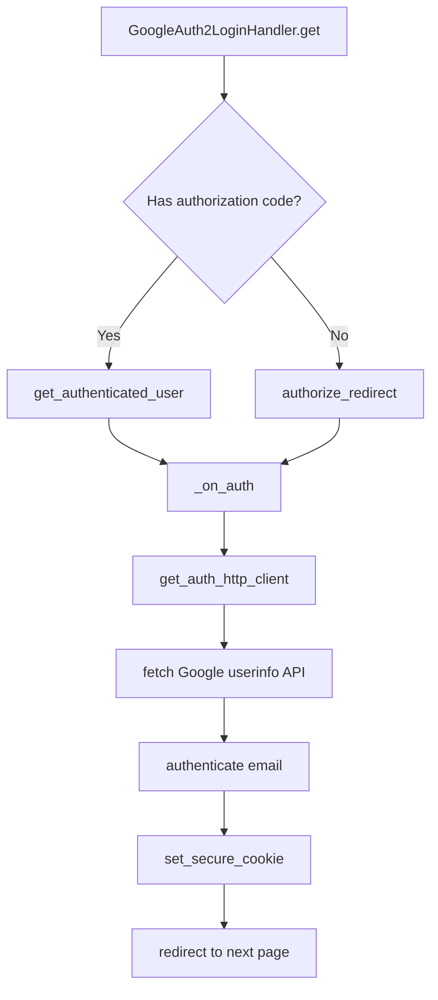
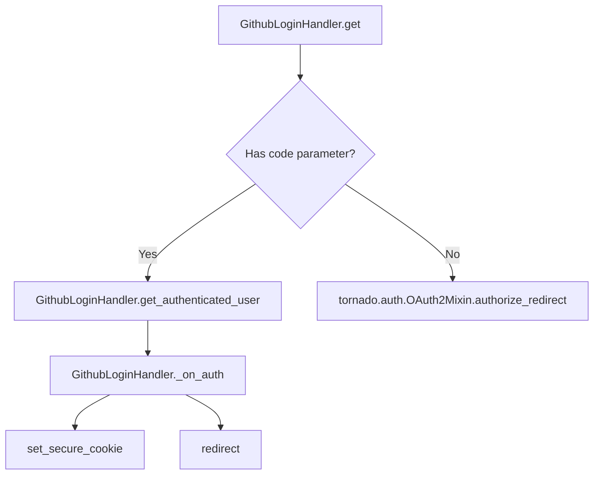
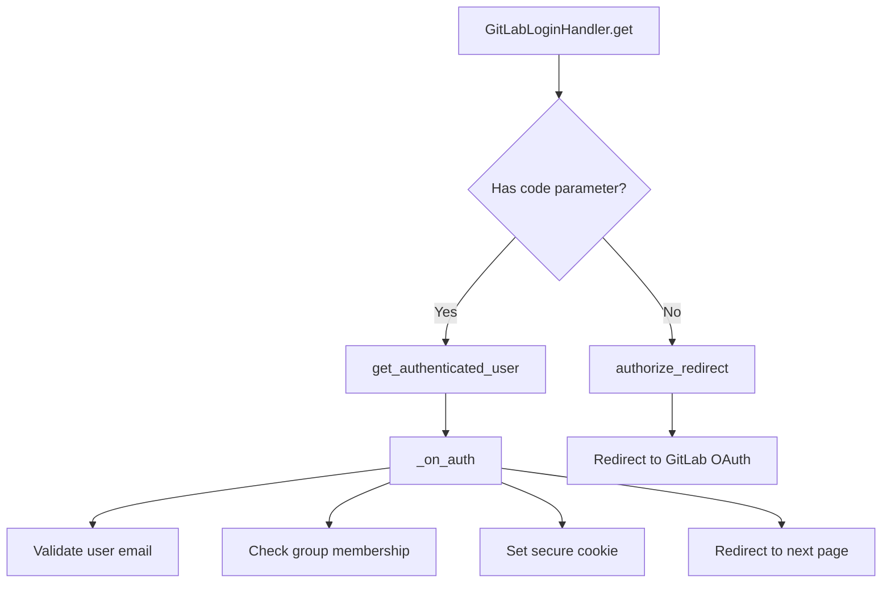
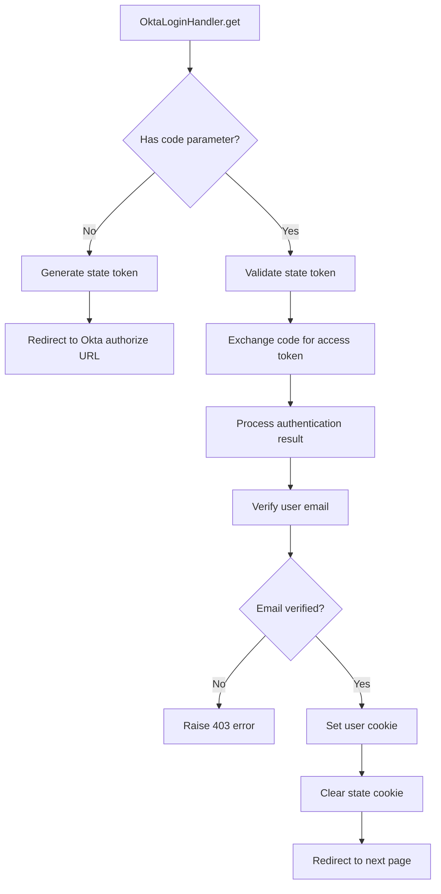

# `auth.py`

## `flower.views.auth.authenticate` · *function*

## Summary:
Authenticates an email address against a pattern that supports exact matching, OR matching with pipe delimiters, or wildcard matching with asterisks.

## Description:
This function validates whether an email address matches a given pattern. It supports three matching modes: exact string comparison, OR matching where the email can match any of several patterns separated by pipes ('|'), and wildcard matching using asterisks ('*') that match sequences of valid email characters.

## Args:
    pattern (str): The authentication pattern to match against. Can be an exact email string, a pipe-delimited list of emails, or a wildcard pattern.
    email (str): The email address to validate against the pattern.

## Returns:
    bool: True if the email matches the pattern according to the supported matching modes, False otherwise.

## Raises:
    None explicitly raised.

## Constraints:
    Preconditions:
        - Both `pattern` and `email` must be strings.
        - The `pattern` should not be empty for meaningful matching.
    Postconditions:
        - The function always returns a boolean value.
        - No side effects occur during execution.

## Side Effects:
    None.

## Control Flow:
```mermaid
flowchart TD
    A[Start authenticate] --> B{Does pattern contain '|'?}
    B -- Yes --> C[Split pattern by '|' and check if email in list]
    B -- No --> D{Does pattern contain '*'?}
    D -- Yes --> E[Escape pattern, replace '*'. with character class, match full string]
    D -- No --> F[Exact string comparison]
    C --> G[Return result]
    E --> G
    F --> G
    G[End] --> H[Return bool]
```

## Examples:
    # Exact match
    authenticate("user@example.com", "user@example.com")  # Returns True
    
    # OR matching
    authenticate("user1@example.com|user2@example.com", "user2@example.com")  # Returns True
    
    # Wildcard matching
    authenticate("user*@example.com", "user123@example.com")  # Returns True
```

## `flower.views.auth.validate_auth_option` · *function*

## Summary:
Validates that an authentication pattern string follows specific syntactic rules for wildcard usage.

## Description:
This function ensures that authentication patterns conform to expected formatting rules, particularly regarding the use of wildcards ('*') and pipe characters ('|'). It is designed to prevent malformed patterns that could lead to unexpected authentication behavior.

The validation logic extracts this function from inline checks to enforce a clear separation between pattern validation and authentication processing logic. This improves code readability and maintainability by centralizing validation concerns.

## Args:
    pattern (str): The authentication pattern string to validate. This typically contains wildcards and may include pipe separators for OR conditions.

## Returns:
    bool: True if the pattern passes all validation rules, False otherwise.

## Raises:
    None

## Constraints:
    Preconditions:
        - The input pattern must be a string.
        
    Postconditions:
        - The returned boolean accurately reflects whether the pattern satisfies all validation rules.
        - No side effects occur during validation.

## Side Effects:
    None

## Control Flow:
```mermaid
flowchart TD
    A[Start validate_auth_option] --> B{pattern.count('*') > 1?}
    B -- Yes --> C[Return False]
    B -- No --> D{'*' in pattern AND '|' in pattern?}
    D -- Yes --> E[Return False]
    D -- No --> F{'*' in pattern.rsplit('@', 1)[-1]?}
    F -- Yes --> G[Return False]
    F -- No --> H[Return True]
    C --> I[End]
    E --> I
    G --> I
    H --> I
```

## Examples:
    Example 1: validate_auth_option("user*@domain.com") returns True
    Example 2: validate_auth_option("user*domain*com") returns False (multiple wildcards)
    Example 3: validate_auth_option("user*|admin") returns False (wildcard and pipe in same pattern)
    Example 4: validate_auth_option("user@*domain.com") returns False (wildcard in domain part after @)

## `flower.views.auth.GoogleAuth2LoginHandler` · *class*

## Summary:
GoogleAuth2LoginHandler is a Tornado web handler that implements Google OAuth2 authentication for the Flower web interface, enabling users to log in using their Google accounts.

## Description:
This class handles the complete Google OAuth2 authentication flow for the Flower web application. It extends BaseHandler and Tornado's GoogleOAuth2Mixin to provide secure authentication through Google's OAuth2 service. The handler manages both the initial authorization redirect and the callback processing after successful Google authentication.

The class is designed to be used as a standalone endpoint in the web application's URL routing configuration. When accessed, it either initiates the OAuth2 authorization flow or processes the callback from Google's authentication server, validating the user's identity and setting a secure session cookie upon successful authentication.

## State:
- `_OAUTH_SETTINGS_KEY`: Class constant string 'oauth' used to access OAuth configuration from application settings
- Inherits all state from BaseHandler including application reference, request/response objects, and authentication context
- No additional instance attributes beyond those inherited from parent classes

## Lifecycle:
- Creation: Instantiated automatically by Tornado's routing mechanism when handling HTTP GET requests to the configured endpoint
- Usage: Called automatically by Tornado's request handling cycle when the endpoint is accessed
- Destruction: Managed automatically by Tornado's request handling cycle

## Method Map:


## Raises:
- `tornado.web.HTTPError(403)`: Raised when Google authentication fails or when the authenticated user's email is not authorized for access

## Example:
```python
# Typical usage in URL routing:
# app.add_handlers(r".*$", [
#     (r"/login/google", GoogleAuth2LoginHandler),
# ])

# User visits: /login/google
# 1. Redirects to Google OAuth2 authorization page
# 2. User authenticates with Google
# 3. Google redirects back to /login/google?code=...
# 4. Handler validates token and fetches user info
# 5. Email is checked against auth pattern
# 6. Secure cookie "user" set with email
# 7. Redirects to next page or default URL prefix
```

### `flower.views.auth.GoogleAuth2LoginHandler.get` · *method*

## Summary:
Handles the Google OAuth2 login flow by either initiating the authorization redirect or processing the callback with user authentication.

## Description:
This asynchronous method implements the Google OAuth2 login flow for the Flower web application. When a user accesses the Google login endpoint, this method determines whether to initiate the OAuth2 authorization process or handle the callback from Google's authentication server. If an authorization code is present in the request arguments, it exchanges that code for user authentication details and processes the authenticated user. Otherwise, it redirects the user to Google's OAuth2 authorization endpoint to begin the login flow.

The method is part of the GoogleAuth2LoginHandler class, which inherits from BaseHandler and tornado.auth.GoogleOAuth2Mixin, providing the complete Google OAuth2 authentication flow. This method orchestrates the OAuth2 authorization code flow by either redirecting users to Google for consent or processing the returned authorization code to establish user session.

## Args:
    None explicitly taken as parameters (inherits from RequestHandler)

## Returns:
    None directly returned, but may cause HTTP redirects or raise exceptions

## Raises:
    tornado.web.HTTPError(403): When Google authentication fails or when the authenticated user's email is not authorized

## State Changes:
    Attributes READ:
    - self.settings: Configuration settings including OAuth2 client credentials and redirect URI
    - self._OAUTH_SETTINGS_KEY: Key used to access OAuth2 configuration in settings
    - self.get_argument: Method to extract request arguments
    
    Attributes WRITTEN:
    - self.set_secure_cookie: Sets secure cookie for authenticated user
    - self.redirect: Redirects user to specified URL after successful authentication

## Constraints:
    Preconditions:
    - The Google OAuth2 client ID and secret must be configured in self.settings[self._OAUTH_SETTINGS_KEY]
    - The redirect URI must be properly configured and match the registered Google OAuth2 application
    - The method assumes proper initialization of parent classes (BaseHandler, GoogleOAuth2Mixin)
    
    Postconditions:
    - If authorization code is present, user authentication is processed and session cookie is set
    - If no authorization code, user is redirected to Google OAuth2 authorization endpoint
    - On successful authentication, user is redirected to the next page or default URL

## Side Effects:
    - Makes HTTP requests to Google's OAuth2 endpoints for token exchange and user info retrieval
    - Sets secure cookies to persist user authentication state
    - Performs HTTP redirects to Google authorization endpoint or application pages
    - May make external API calls to Google's userinfo endpoint

### `flower.views.auth.GoogleAuth2LoginHandler._on_auth` · *method*

## Summary:
Processes successful Google OAuth2 authentication by validating the user's email and redirecting to the appropriate page.

## Description:
Handles the completion of Google OAuth2 authentication flow by validating the authenticated user's email address against the configured authorization pattern, setting a secure session cookie, and redirecting the user to the intended destination. This method is part of the GoogleAuth2LoginHandler's authentication callback processing.

The method is called during the OAuth2 callback phase after successful Google authentication, where it exchanges the access token for user information, validates the email against authorization rules, establishes a secure session, and redirects the user to their requested location.

## Args:
    user (dict): Dictionary containing Google OAuth2 user information, including 'access_token' key. May be None if authentication fails.

## Returns:
    None: This method performs redirection and does not return a value.

## Raises:
    tornado.web.HTTPError: Raised with status code 403 in three scenarios:
        1. When user is None (authentication failed)
        2. When fetching user info from Google API fails
        3. When the user's email is not authorized for access

## State Changes:
    Attributes READ: 
        - self.application.options.auth: Used to validate email against authorization pattern
        - self.application.options.url_prefix: Used to construct default redirect URL
    Attributes WRITTEN:
        - self.set_secure_cookie: Sets 'user' cookie for session management

## Constraints:
    Preconditions:
        - The method must be called within the context of a Google OAuth2 authentication flow
        - The 'user' parameter must contain an 'access_token' key if not None
        - The application must have proper OAuth2 configuration
    Postconditions:
        - A secure 'user' cookie is set if authentication succeeds
        - The user is redirected to an appropriate URL

## Side Effects:
    I/O: Makes HTTP request to Google userinfo API endpoint using an authenticated HTTP client
    External service calls: Calls Google's userinfo v2 API to fetch user email
    Mutations to objects outside self: 
        - Sets secure cookie via self.set_secure_cookie
        - Redirects user via self.redirect

## `flower.views.auth.LoginHandler` · *class*

## Summary:
LoginHandler is a dynamic authentication provider factory that instantiates the configured authentication backend at runtime, inheriting from BaseHandler.

## Description:
LoginHandler implements a factory pattern that dynamically creates authentication provider instances based on the application's configuration. Instead of directly implementing authentication logic, it delegates to a configurable authentication provider specified via the `auth_provider` option. When no provider is configured, it defaults to NotFoundErrorHandler.

This abstraction enables flexible authentication strategies without modifying the core login handler implementation. The class serves as a bridge between the application's configuration and the actual authentication mechanism, allowing different authentication backends (OAuth2, basic auth, custom providers) to be plugged in seamlessly.

The class inherits from BaseHandler, which provides common web request handling functionality including CORS configuration, authentication mechanisms, and error handling. LoginHandler specifically overrides the `__new__` method to control object instantiation rather than using the default Python object creation process.

## State:
- `options.auth_provider`: Configuration value specifying the authentication provider class path to instantiate
- `NotFoundErrorHandler`: Default fallback class used when no authentication provider is configured

## Lifecycle:
- Creation: Instantiated by Tornado's request handling when a login request is received
- Usage: The `__new__` method is invoked during object creation to determine which authentication provider to instantiate
- Destruction: Managed automatically by Python's garbage collection

## Method Map:
```mermaid
graph TD
    A[LoginHandler.__new__] --> B[instantiate(options.auth_provider or NotFoundErrorHandler)]
    B --> C[Configured Auth Provider or NotFoundErrorHandler]
```

## Raises:
- Exception: May raise exceptions during class instantiation if the configured provider is invalid or improperly configured
- Exception: May raise exceptions during class resolution if the configured provider class path is invalid

## Example:
```python
# When options.auth_provider = "tornado.auth.OAuth2Mixin"
# LoginHandler.__new__ will return an instance of OAuth2Mixin-based handler

# When options.auth_provider = None
# LoginHandler.__new__ will return an instance of NotFoundErrorHandler

# Typical usage in Tornado routing:
# app.add_handlers(r".*", [(r"/login", LoginHandler)])
```

### `flower.views.auth.LoginHandler.__new__` · *method*

## Summary:
The `__new__` method dynamically creates an authentication provider instance using the configured `auth_provider` option, defaulting to `NotFoundErrorHandler` when none is specified.

## Description:
This method overrides Python's object creation protocol to enable dynamic instantiation of authentication providers. When a `LoginHandler` instance is created, this `__new__` method is invoked instead of the default object creation process. It leverages the `celery.utils.imports.instantiate` utility to construct an instance of the authentication provider specified in the application configuration (`options.auth_provider`).

The method acts as a factory pattern implementation that allows the application to configure different authentication mechanisms at runtime. If no authentication provider is configured (when `options.auth_provider` is None or empty), it falls back to using `NotFoundErrorHandler` as a default.

This approach enables flexible authentication strategies without requiring changes to the core login handler implementation, supporting various authentication backends through configuration.

## Args:
    cls: The class being instantiated (LoginHandler)
    *args: Variable length argument list passed to the authentication provider constructor
    **kwargs: Arbitrary keyword arguments passed to the authentication provider constructor

## Returns:
    An instance of the configured authentication provider class or NotFoundErrorHandler if none is configured

## Raises:
    Exception: May raise exceptions during class instantiation if the configured provider is invalid or improperly configured

## State Changes:
    Attributes READ: 
    - `options.auth_provider`: Configuration value determining which authentication provider to instantiate
    - `NotFoundErrorHandler`: Default fallback class when no auth provider is configured
    
    Attributes WRITTEN: None

## Constraints:
    Preconditions:
    - The `options.auth_provider` must be a valid class path that can be resolved by the import system
    - The configured authentication provider class must be compatible with the expected interface for LoginHandler usage
    - The `celery.utils.imports.instantiate` function must be able to properly construct the specified class
    
    Postconditions:
    - Returns an instance of an authentication provider class that implements the expected authentication interface
    - If `options.auth_provider` is None or empty, returns an instance of `NotFoundErrorHandler`

## Side Effects:
    - Performs dynamic class resolution and instantiation
    - May trigger module imports during the instantiation process
    - Could raise exceptions during class construction if the provider configuration is invalid

## `flower.views.auth.GithubLoginHandler` · *class*

## Summary:
GithubLoginHandler is a Tornado web handler that implements GitHub OAuth2 authentication for the Flower web interface, enabling users to log in using their GitHub accounts.

## Description:
This class handles the complete OAuth2 authentication flow with GitHub, including redirecting users to GitHub for authorization, exchanging authorization codes for access tokens, and validating user email addresses against configured authentication patterns. It extends BaseHandler for common web functionality and inherits from tornado.auth.OAuth2Mixin for OAuth2 protocol support.

The handler is designed to be used as a standalone endpoint in the Flower web application's URL routing, typically mapped to a path like `/login` to provide GitHub login functionality. It integrates with Flower's existing authentication system by setting secure cookies containing authenticated user emails.

## State:
- `_OAUTH_DOMAIN`: Class variable defining the GitHub domain (defaults to "github.com")
- `_OAUTH_AUTHORIZE_URL`: Class variable defining the OAuth2 authorization endpoint URL
- `_OAUTH_ACCESS_TOKEN_URL`: Class variable defining the OAuth2 access token endpoint URL
- `_OAUTH_NO_CALLBACKS`: Class variable indicating whether callbacks are disabled (False)
- `_OAUTH_SETTINGS_KEY`: Class variable specifying the settings key for OAuth configuration

## Lifecycle:
- Creation: Instantiated automatically by Tornado's routing mechanism when handling HTTP requests
- Usage: Called during HTTP GET requests to handle the authentication flow
- Destruction: Managed automatically by Tornado's request handling cycle

## Method Map:


## Raises:
- `tornado.auth.AuthError`: Raised when OAuth2 token exchange fails
- `tornado.web.HTTPError(500)`: Raised when OAuth2 authentication fails during user validation
- `tornado.web.HTTPError(403)`: Raised when user email doesn't match authentication patterns

## Example:
```python
# Typical usage in URL routing:
# app.add_handlers(r".*", [(r"/login", GithubLoginHandler)])

# User flow:
# 1. User visits /login
# 2. Handler redirects to GitHub OAuth authorization page
# 3. User authorizes the application
# 4. GitHub redirects back with authorization code
# 5. Handler exchanges code for access token
# 6. Handler fetches user emails and validates against auth pattern
# 7. Handler sets secure cookie and redirects to next page
```

### `flower.views.auth.GithubLoginHandler.get_authenticated_user` · *method*

## Summary:
Exchanges an OAuth authorization code for an access token from GitHub's API.

## Description:
This asynchronous method implements the second step of the OAuth 2.0 authorization code flow by exchanging an authorization code received from GitHub for an access token. It constructs a POST request to GitHub's token endpoint with the necessary OAuth parameters including client credentials and the authorization code. The method handles both successful responses and error conditions, returning the parsed token data or raising an authentication error.

This method is specifically designed for GitHub OAuth integration and is called during the OAuth callback phase when the user is redirected back to the application with an authorization code.

## Args:
    redirect_uri (str): The redirect URI that was registered with the GitHub OAuth application
    code (str): The authorization code received from GitHub after user consent

## Returns:
    dict: A dictionary containing the parsed OAuth access token response from GitHub, typically including 'access_token', 'token_type', and other OAuth metadata such as 'scope' and 'expires_in'

## Raises:
    tornado.auth.AuthError: When the OAuth token exchange fails due to network issues, invalid credentials, or GitHub API errors

## State Changes:
    Attributes READ: 
    - self.settings
    - self._OAUTH_SETTINGS_KEY
    - self._OAUTH_ACCESS_TOKEN_URL
    
    Attributes WRITTEN: None

## Constraints:
    Preconditions:
    - The method assumes that self.settings contains the OAuth configuration under the key specified by self._OAUTH_SETTINGS_KEY
    - The authorization code must be valid and not expired
    - The redirect_uri must match the one registered with the GitHub OAuth application
    - The GitHub OAuth application must be properly configured with client ID and secret
    
    Postconditions:
    - Returns a properly formatted dictionary with OAuth token data
    - Raises AuthError for any communication or validation failures

## Side Effects:
    - Makes an asynchronous HTTP POST request to GitHub's OAuth token endpoint
    - May trigger network I/O operations and external service calls

### `flower.views.auth.GithubLoginHandler.get` · *method*

## Summary:
Handles GitHub OAuth authentication flow by either initiating the authorization redirect or processing the callback from GitHub.

## Description:
This method implements the GET endpoint for GitHub OAuth authentication. When a user accesses the GitHub login endpoint, this method determines whether to redirect the user to GitHub's authorization server or process the callback from GitHub containing an authorization code. It leverages Tornado's OAuth2 mixin capabilities and integrates with the application's authentication system to establish user sessions.

The method is part of the GitHubLoginHandler class which inherits from BaseHandler and tornado.auth.OAuth2Mixin, providing the necessary OAuth2 infrastructure for GitHub authentication. It follows the standard OAuth2 authorization code flow where the user is redirected to GitHub for consent, and then back to this endpoint with an authorization code that is exchanged for an access token.

## Args:
    None explicitly taken as parameters (inherited from Tornado's RequestHandler)

## Returns:
    None directly returned, but may trigger redirects or HTTP errors

## Raises:
    tornado.web.HTTPError(403): Raised when no verified, authenticated emails are found for the user
    tornado.web.HTTPError(500): Raised when OAuth authentication fails during user retrieval or token exchange

## State Changes:
    Attributes READ:
        - self.settings
        - self._OAUTH_SETTINGS_KEY
        - self.get_argument
    Attributes WRITTEN:
        - self.set_secure_cookie (indirectly via _on_auth)
        - self.redirect (indirectly via _on_auth)

## Constraints:
    Preconditions:
        - The handler must be properly initialized with OAuth settings in self.settings
        - The OAuth settings must include 'key', 'secret', and 'redirect_uri' under the _OAUTH_SETTINGS_KEY
        - The application options must have proper authentication configuration
        - The application must have a valid OAuth client ID and secret configured
    Postconditions:
        - If authorization code is present, user session is established via secure cookie
        - If no authorization code, user is redirected to GitHub OAuth authorization URL
        - User is redirected to the appropriate next page after successful authentication

## Side Effects:
    - Initiates HTTP redirects to GitHub OAuth authorization endpoint
    - Makes outbound HTTP requests to GitHub's OAuth token endpoint and user emails endpoint
    - Sets secure cookies for user authentication
    - May trigger HTTP error responses (403, 500) for authentication failures
    - Redirects users to either the next page or the application's URL prefix after authentication

### `flower.views.auth.GithubLoginHandler._on_auth` · *method*

## Summary:
Processes successful GitHub OAuth authentication by validating user emails and setting a secure session cookie.

## Description:
This asynchronous method handles the completion of GitHub OAuth authentication flow. It retrieves the authenticated user's email addresses from GitHub's API, filters them based on configured authentication patterns, and establishes a secure session cookie for the authenticated user. The method also manages redirection to the appropriate URL after successful authentication.

This logic is separated into its own method to encapsulate the post-authentication processing and session management responsibilities, keeping the main OAuth callback handler clean and focused on the authentication flow itself.

## Args:
    user (dict): Dictionary containing OAuth user information, including 'access_token' key

## Returns:
    None: This method performs redirects and cookie setting but does not return a value

## Raises:
    tornado.web.HTTPError(500): When the OAuth authentication fails (user is None)
    tornado.web.HTTPError(403): When no verified and authenticated emails are found for the user

## State Changes:
    Attributes READ:
        - self._OAUTH_DOMAIN: Domain used for constructing GitHub API URLs
        - self.application.options.auth: Authentication pattern for email validation
        - self.application.options.url_prefix: URL prefix for redirect destination
    Attributes WRITTEN:
        - None: This method doesn't modify instance attributes directly

## Constraints:
    Preconditions:
        - The user parameter must be a dictionary containing an 'access_token' key
        - The GitHub OAuth flow must have completed successfully
        - The method must be called within a Tornado request context
    Postconditions:
        - A secure cookie named "user" will be set with the authenticated email
        - The client will be redirected to either the 'next' parameter or the application's URL prefix

## Side Effects:
    - Makes an asynchronous HTTP request to GitHub's user emails API endpoint
    - Sets a secure cookie on the HTTP response
    - Performs an HTTP redirect to a new URL

## `flower.views.auth.GitLabLoginHandler` · *class*

## Summary:
GitLabLoginHandler is a Tornado web handler that implements GitLab OAuth2 authentication for the Flower web interface, enabling users to log in using their GitLab accounts.

## Description:
This class handles the complete GitLab OAuth2 authentication flow for Flower's web interface. It extends BaseHandler for common web functionality and inherits from tornado.auth.OAuth2Mixin for OAuth2 protocol support. The handler manages the OAuth2 authorization code flow, exchanges authorization codes for access tokens, validates user permissions against GitLab groups and email patterns, and sets secure cookies for authenticated sessions.

The class is designed to be used as a route endpoint in Tornado applications and integrates with Flower's existing authentication infrastructure through the authenticate function and configuration-based access controls. It supports configurable GitLab domains, group-based access control, and email pattern matching.

## State:
- `_OAUTH_GITLAB_DOMAIN`: Class variable storing GitLab domain (defaults to "gitlab.com")
- `_OAUTH_AUTHORIZE_URL`: Class variable storing OAuth2 authorization endpoint URL
- `_OAUTH_ACCESS_TOKEN_URL`: Class variable storing OAuth2 token endpoint URL
- `_OAUTH_NO_CALLBACKS`: Class variable indicating OAuth2 callback handling behavior (False)

## Lifecycle:
- Creation: Instantiated automatically by Tornado's routing mechanism when handling HTTP requests
- Usage: Called through Tornado's request lifecycle when accessing the configured route
- Destruction: Managed automatically by Tornado's request handling cycle

## Method Map:


## Raises:
- `tornado.auth.AuthError`: Raised when OAuth2 token exchange fails during get_authenticated_user
- `tornado.web.HTTPError(500)`: Raised when OAuth2 authentication fails during user validation in _on_auth
- `tornado.web.HTTPError(403)`: Raised when GitLab authentication fails or user lacks required permissions in _on_auth
- `tornado.web.HTTPError(403)`: Raised when user email doesn't match authentication pattern or group restrictions aren't met in _on_auth

## Example:
```python
# Typical usage in Tornado application:
# Configure OAuth settings in application settings:
# settings = {
#     'oauth': {
#         'key': 'your-gitlab-client-id',
#         'secret': 'your-gitlab-client-secret',
#         'redirect_uri': 'http://localhost:5555/login'
#     }
# }

# Route configuration:
# app.add_handlers(r'.*', [
#     (r'/login', GitLabLoginHandler),
# ])

# Environment variables for access control:
# FLOWER_GITLAB_AUTH_ALLOWED_GROUPS="group1,group2"  # Optional group restriction
# FLOWER_GITLAB_MIN_ACCESS_LEVEL="20"  # Optional minimum access level (default: 20)
# FLOWER_GITLAB_OAUTH_DOMAIN="gitlab.example.com"  # Optional custom GitLab domain

# User flow:
# 1. User visits /login
# 2. Handler redirects to GitLab OAuth authorization page
# 3. User authorizes the application
# 4. GitLab redirects back with authorization code
# 5. Handler exchanges code for access token
# 6. Handler validates user email against FLOWER_AUTH pattern
# 7. Handler optionally checks group membership if FLOWER_GITLAB_AUTH_ALLOWED_GROUPS is set
# 8. Handler sets secure cookie and redirects to next page
```

### `flower.views.auth.GitLabLoginHandler.get_authenticated_user` · *method*

## Summary:
Exchanges an OAuth2 authorization code for user authentication tokens from GitLab.

## Description:
This asynchronous method implements the second leg of the OAuth2 authorization code flow. After a user consents to the application's access permissions on GitLab, they are redirected back with an authorization code. This method exchanges that code for an access token and other authentication details needed to interact with GitLab's API on behalf of the user.

The method is part of GitLabLoginHandler, which inherits from BaseHandler and tornado.auth.OAuth2Mixin, providing the complete GitLab OAuth2 authentication flow. It constructs and sends a POST request to GitLab's token endpoint with the required OAuth2 parameters including client credentials and the authorization code.

## Args:
    redirect_uri (str): The redirect URI that was registered with the GitLab OAuth2 application
    code (str): The authorization code received from GitLab after successful user consent

## Returns:
    dict: JSON-decoded response containing OAuth2 token information including access_token, token_type, expires_in, refresh_token, and scope

## Raises:
    tornado.auth.AuthError: When the OAuth2 token exchange fails, typically due to invalid authorization code, expired code, or invalid client credentials

## State Changes:
    Attributes READ: 
    - self.settings['oauth']['key']: Client ID for GitLab OAuth2 application
    - self.settings['oauth']['secret']: Client secret for GitLab OAuth2 application
    - self._OAUTH_ACCESS_TOKEN_URL: GitLab OAuth2 token endpoint URL
    
    Attributes WRITTEN: None

## Constraints:
    Preconditions:
    - The redirect_uri must match the one registered with the GitLab OAuth2 application
    - The authorization code must be valid and not expired
    - Client credentials (key and secret) must be properly configured in self.settings['oauth']
    - self._OAUTH_ACCESS_TOKEN_URL must be a valid URL
    
    Postconditions:
    - On success, returns a dictionary with complete OAuth2 token information
    - On failure, raises tornado.auth.AuthError with detailed error information

## Side Effects:
    - Makes an asynchronous HTTP POST request to GitLab's OAuth2 token endpoint
    - Uses self.get_auth_http_client() for making the HTTP request
    - May raise network-related exceptions if GitLab service is unavailable

### `flower.views.auth.GitLabLoginHandler.get` · *method*

## Summary:
Handles GitLab OAuth2 authentication flow by either initiating authorization or processing callback responses.

## Description:
This method implements the GitLab OAuth2 login flow for the Flower web interface. When a user accesses the GitLab login endpoint, this method determines whether to redirect the user to GitLab for authorization or process an incoming OAuth2 callback with an authorization code. It leverages Tornado's built-in OAuth2 support and integrates with the application's authentication system to validate users against configured groups and email policies.

The method follows a standard OAuth2 authorization code flow:
1. If no 'code' parameter is present, it redirects the user to GitLab's authorization endpoint
2. If a 'code' parameter is present, it exchanges the code for an access token and validates the user

## Args:
    None

## Returns:
    None

## Raises:
    tornado.web.HTTPError(403): When GitLab authentication fails or user lacks proper permissions
    tornado.web.HTTPError(500): When OAuth authentication fails during token exchange

## State Changes:
    Attributes READ: 
    - self.settings['oauth']['redirect_uri']
    - self.settings['oauth']['key']
    - self.settings['oauth']['secret']
    - self.get_argument('code')
    - self.application.options.auth
    - self.application.options.url_prefix
    
    Attributes WRITTEN:
    - self.set_secure_cookie('user') when authentication succeeds

## Constraints:
    Preconditions:
    - Application must be configured with GitLab OAuth settings in self.settings['oauth']
    - OAuth redirect URI must be properly configured
    - Required environment variables for GitLab domain and authentication policies must be set
    
    Postconditions:
    - On successful authentication, user cookie is set for subsequent requests
    - On failed authentication, appropriate HTTP error is raised
    - Redirect occurs to either GitLab authorization URL or application's next page

## Side Effects:
    - Initiates HTTP requests to GitLab OAuth endpoints for token exchange and user info retrieval
    - Sets secure cookies for user authentication persistence
    - Performs redirects to external OAuth provider or internal application pages
    - Makes network calls to GitLab API for user validation and group membership checking

### `flower.views.auth.GitLabLoginHandler._on_auth` · *method*

## Summary:
Processes GitLab OAuth authentication callback and establishes user session with email validation and group membership checks.

## Description:
Handles the completion of GitLab OAuth authentication flow by validating the authenticated user, checking email permissions, and verifying group memberships if configured. This method serves as the final step in the GitLab authentication process, setting up the user session and redirecting to the intended destination.

The method performs these key functions:
1. Validates the OAuth response and extracts access token
2. Fetches user email from GitLab API
3. Authenticates the email against configured patterns
4. Checks group membership if allowed groups are specified
5. Sets secure session cookie and redirects user

This logic is separated into its own method to encapsulate the complete GitLab OAuth post-authentication workflow, making it reusable and testable while maintaining clean separation of concerns in the authentication flow.

## Args:
    user (dict): OAuth user information containing access_token and other authentication data from GitLab

## Returns:
    None: This method performs redirection and does not return a value

## Raises:
    tornado.web.HTTPError(500): When OAuth authentication fails (user is None)
    tornado.web.HTTPError(403): When GitLab API access fails or user lacks proper email/group permissions

## State Changes:
    Attributes READ: 
        - self._OAUTH_GITLAB_DOMAIN
        - self.application.options.auth
        - self.application.options.url_prefix
    Attributes WRITTEN: 
        - None directly modified, but indirectly affects session state through cookie setting

## Constraints:
    Preconditions:
        - The method must be called as part of a GitLab OAuth callback flow
        - User parameter must contain valid OAuth response data with access_token
        - GitLab OAuth domain must be configured via _OAUTH_GITLAB_DOMAIN attribute
        - Environment variables FLOWER_GITLAB_AUTH_ALLOWED_GROUPS and FLOWER_GITLAB_MIN_ACCESS_LEVEL may be set for group-based access control
    Postconditions:
        - If successful, a secure 'user' cookie is set with the user's email
        - User is redirected to the intended destination URL
        - If authentication fails, appropriate HTTP error is raised

## Side Effects:
    I/O: Makes asynchronous HTTP requests to GitLab API endpoints using get_auth_http_client
    External service calls: Calls GitLab API to fetch user info and group memberships
    Mutations to objects outside self: 
        - Sets secure cookie 'user' via set_secure_cookie method
        - Redirects user via redirect method

## `flower.views.auth.OktaLoginHandler` · *class*

## Summary:
OktaLoginHandler is a Tornado web handler that implements OAuth2 authentication flow with Okta, enabling secure user login through the Okta identity provider.

## Description:
This class handles the complete OAuth2 authorization code flow for Okta authentication. It extends BaseHandler for common web functionality and inherits from tornado.auth.OAuth2Mixin for OAuth2-specific utilities. The handler manages the redirect to Okta for authentication, processes the callback with authorization code, exchanges the code for access tokens, verifies user information, and establishes secure session cookies for authenticated users.

The class is designed to integrate with Flower's authentication system, ensuring that only users with verified email addresses (matching configured patterns) can access the application. It follows standard OAuth2 security practices including state parameter validation and secure cookie management.

## State:
- `base_url`: Property that retrieves the Okta base URL from environment variable FLOWER_OAUTH2_OKTA_BASE_URL
- `_OAUTH_NO_CALLBACKS`: Class attribute set to False, indicating callbacks are expected
- `_OAUTH_SETTINGS_KEY`: Class attribute set to 'oauth', used to identify OAuth configuration in settings

## Lifecycle:
- Creation: Instantiated automatically by Tornado's routing mechanism when handling HTTP requests to the authentication endpoint
- Usage: The get() method is invoked for all HTTP GET requests to this handler, triggering either the initial redirect to Okta or processing of the OAuth2 callback
- Destruction: Managed automatically by Tornado's request handling cycle

## Method Map:


## Raises:
- `tornado.auth.AuthError`: Raised when OAuth2 state tokens don't match or when HTTP requests fail during token exchange
- `tornado.web.HTTPError(403)`: Raised when email verification fails during authentication process
- `tornado.web.HTTPError(500)`: Raised when OAuth authentication fails due to missing access token response

## Example:
```python
# Typical usage through Tornado routing:
# When user visits /login/okta, they are redirected to Okta for authentication
# After successful Okta login, they're redirected back to this handler with code parameter
# The handler validates the code, exchanges it for tokens, verifies the user, and sets secure cookie

# Configuration required in settings:
# {
#     'oauth': {
#         'key': 'your-okta-client-id',
#         'secret': 'your-okta-client-secret',
#         'redirect_uri': 'https://your-app.com/login/okta'
#     }
# }

# Environment variable required:
# FLOWER_OAUTH2_OKTA_BASE_URL=https://your-okta-domain.okta.com
```

### `flower.views.auth.OktaLoginHandler.base_url` · *method*

## Summary:
Returns the base URL for Okta OAuth2 authentication from environment configuration.

## Description:
This property retrieves the Okta base URL from the FLOWER_OAUTH2_OKTA_BASE_URL environment variable. It serves as a configuration point for the Okta OAuth2 integration, allowing the application to dynamically configure the Okta authorization server endpoint without hardcoding values.

## Args:
    None

## Returns:
    str: The Okta base URL configured via environment variable, or None if the environment variable is not set.

## Raises:
    None

## State Changes:
    Attributes READ: None
    Attributes WRITTEN: None

## Constraints:
    Preconditions: None
    Postconditions: The returned value is either a string containing the base URL or None if not configured.

## Side Effects:
    None

### `flower.views.auth.OktaLoginHandler._OAUTH_AUTHORIZE_URL` · *method*

## Summary:
Returns the OAuth2 authorize URL endpoint for Okta authentication by combining the base URL with the v1/authorize path.

## Description:
This property method constructs and returns the full OAuth2 authorization endpoint URL by appending "/v1/authorize" to the configured base URL. It is used during the OAuth2 authorization code flow to redirect users to the Okta login page. This method is part of the OktaLoginHandler class which implements OAuth2 authentication for the Flower web application.

## Args:
    None

## Returns:
    str: Full OAuth2 authorize URL in the format "{base_url}/v1/authorize"

## Raises:
    None

## State Changes:
    Attributes READ: self.base_url
    Attributes WRITTEN: None

## Constraints:
    Preconditions: The base_url property must return a valid string URL
    Postconditions: The returned URL is properly formatted with the authorize endpoint

## Side Effects:
    None

### `flower.views.auth.OktaLoginHandler._OAUTH_ACCESS_TOKEN_URL` · *method*

## Summary:
Returns the OAuth 2.0 access token endpoint URL for Okta authentication.

## Description:
This property method constructs and returns the full URL for the OAuth 2.0 token endpoint by appending "/v1/token" to the base URL configured for Okta authentication. It is part of the OAuth 2.0 flow implementation for authenticating users via Okta.

The method is designed as a property to ensure consistent access to the token endpoint URL throughout the authentication process, particularly when making HTTP requests to exchange authorization codes for access tokens.

## Args:
    None

## Returns:
    str: The complete URL for the Okta OAuth 2.0 access token endpoint, formatted as "{base_url}/v1/token"

## Raises:
    None

## State Changes:
    Attributes READ: self.base_url
    Attributes WRITTEN: None

## Constraints:
    Preconditions:
        - The Okta base URL must be configured via the FLOWER_OAUTH2_OKTA_BASE_URL environment variable
        - The base_url property must return a valid string (non-empty)
    
    Postconditions:
        - Returns a properly formatted URL string ending with "/v1/token"
        - The returned URL is suitable for making HTTP POST requests to obtain OAuth access tokens

## Side Effects:
    None

### `flower.views.auth.OktaLoginHandler._OAUTH_USER_INFO_URL` · *method*

## Summary:
Returns the OAuth user info endpoint URL by appending "/v1/userinfo" to the base URL.

## Description:
This property method constructs and returns the full URL for the OAuth user information endpoint. It is used during the authentication flow to fetch user profile details after obtaining an access token. The method relies on the `base_url` property which retrieves the Okta base URL from environment variables.

## Args:
    None

## Returns:
    str: The complete OAuth user info endpoint URL in the format "{base_url}/v1/userinfo"

## Raises:
    None

## State Changes:
    Attributes READ: self.base_url
    Attributes WRITTEN: None

## Constraints:
    Preconditions: The `base_url` property must return a valid string URL
    Postconditions: The returned URL is always in the format "{base_url}/v1/userinfo"

## Side Effects:
    None

### `flower.views.auth.OktaLoginHandler.get_access_token` · *method*

## Summary:
Retrieves an OAuth access token from the Okta authorization server using an authorization code.

## Description:
This asynchronous method exchanges an authorization code received from the Okta OAuth provider for an access token by making a POST request to the token endpoint. It follows the OAuth2 authorization code flow by constructing a form-encoded request body with the authorization code, client credentials, and grant type, then sending it to the Okta token endpoint.

The method is called during the OAuth2 authentication process when the user has been redirected back from Okta with an authorization code. It's part of the OktaLoginHandler class that implements OAuth2 authentication for the Flower web application.

## Args:
    redirect_uri (str): The redirect URI that was used during the authorization request to Okta
    code (str): The authorization code received from Okta after successful user authorization

## Returns:
    dict: A dictionary containing the parsed JSON response from Okta's token endpoint, typically including 'access_token', 'token_type', and potentially 'expires_in' and 'refresh_token'

## Raises:
    tornado.auth.AuthError: When the HTTP request to Okta's token endpoint fails or returns an error response

## State Changes:
    Attributes READ: 
    - self.settings
    - self._OAUTH_SETTINGS_KEY
    - self._OAUTH_ACCESS_TOKEN_URL
    
    Attributes WRITTEN: None

## Constraints:
    Preconditions:
    - The OAuth settings must be properly configured in self.settings under the key specified by self._OAUTH_SETTINGS_KEY
    - The redirect_uri must match the one registered with Okta
    - The authorization code must be valid and not yet expired
    - The Okta base URL must be configured via FLOWER_OAUTH2_OKTA_BASE_URL environment variable
    
    Postconditions:
    - The returned dictionary contains valid OAuth token information from Okta
    - The method will raise an exception if the HTTP request fails

## Side Effects:
    - Makes an asynchronous HTTP POST request to Okta's token endpoint
    - Uses the authentication HTTP client managed by the parent BaseHandler class
    - Decodes and parses JSON response from Okta service

### `flower.views.auth.OktaLoginHandler.get` · *method*

## Summary:
Handles OAuth2 authentication flow with Okta, managing both authorization redirects and token exchange callbacks.

## Description:
This method implements the complete OAuth2 authorization code flow for Okta authentication. When a user accesses the login endpoint, it either initiates the authorization process by redirecting to Okta or processes the callback from Okta after successful authentication. The method validates state tokens to prevent CSRF attacks, exchanges authorization codes for access tokens, and completes the authentication process by setting secure cookies and redirecting users to their intended destination.

The method is part of the OktaLoginHandler class which inherits from BaseHandler and tornado.auth.OAuth2Mixin, providing OAuth2 authentication capabilities for Flower's web interface.

## Args:
    None

## Returns:
    None

## Raises:
    tornado.auth.AuthError: When OAuth state tokens don't match during callback processing
    tornado.web.HTTPError: When authentication fails due to email verification issues (403) or general failures (500)

## State Changes:
    Attributes READ:
        - self.settings
        - self._OAUTH_SETTINGS_KEY
        - self.get_argument
        - self.get_secure_cookie
        - self.get_auth_http_client
        - self._OAUTH_ACCESS_TOKEN_URL
        - self._OAUTH_USER_INFO_URL
        - self.application.options.auth
        - self.application.options.url_prefix
    
    Attributes WRITTEN:
        - self.set_secure_cookie (for 'oauth_state' and 'user')
        - self.clear_cookie (for 'oauth_state')
        - self.redirect (implicit state change through browser redirect)

## Constraints:
    Preconditions:
        - The handler must be properly initialized with OAuth settings in self.settings
        - OAuth2 configuration must include required keys: 'key', 'secret', 'redirect_uri'
        - Okta base URL must be configured via environment variable FLOWER_OAUTH2_OKTA_BASE_URL
        - The method must be called as part of a GET request to the authentication endpoint
        
    Postconditions:
        - On successful authentication: sets 'user' secure cookie with email, clears 'oauth_state' cookie, and redirects to intended location
        - On authorization redirect: sets 'oauth_state' secure cookie and performs HTTP redirect to Okta

## Side Effects:
    - Makes HTTP requests to Okta's authorization and token endpoints
    - Sets secure cookies ('oauth_state' and 'user') in the HTTP response
    - Clears cookies from the HTTP response
    - Performs HTTP redirects to external services (Okta) and internal paths

### `flower.views.auth.OktaLoginHandler._on_auth` · *method*

## Summary:
Processes OAuth authentication response to verify user identity and establish secure session.

## Description:
Handles the completion of OAuth authentication flow by validating the access token, fetching user information from the identity provider, verifying email authenticity against configured patterns, setting secure session cookies, and redirecting to the intended destination.

This method serves as the final step in the OAuth callback process, ensuring proper authentication before granting access to the application. It's designed as a separate method to encapsulate the complete post-authentication workflow and maintain clean separation of concerns in the authentication flow.

## Args:
    access_token_response (dict): Dictionary containing OAuth access token information with 'access_token' key

## Returns:
    None: This method performs redirection and cookie operations but does not return a value

## Raises:
    tornado.web.HTTPError: Raised with status 500 when access_token_response is invalid/missing
    tornado.web.HTTPError: Raised with status 403 when email verification fails

## State Changes:
    Attributes READ:
        - self._OAUTH_USER_INFO_URL
        - self.application.options.auth
        - self.application.options.url_prefix
    Attributes WRITTEN:
        - self.set_secure_cookie() modifies session cookie
        - self.clear_cookie() removes OAuth state cookie

## Constraints:
    Preconditions:
        - access_token_response must be a dictionary containing 'access_token' key
        - self._OAUTH_USER_INFO_URL must be properly initialized
        - Authentication configuration must be available via self.application.options.auth
    Postconditions:
        - Secure session cookie named "user" is set with email value
        - OAuth state cookie is cleared
        - User is redirected to appropriate URL

## Side Effects:
    - Makes HTTP request to external OAuth user info endpoint
    - Sets secure cookie in HTTP response
    - Clears cookie in HTTP response
    - Performs HTTP redirect to client browser

