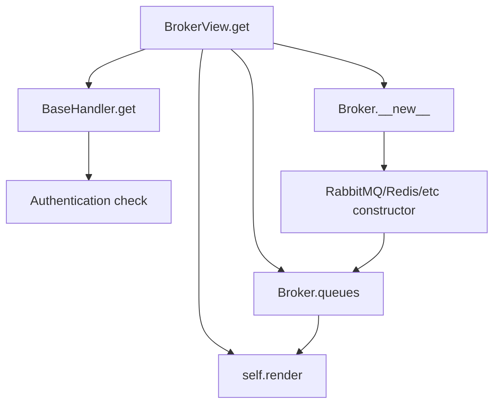

# `broker.py`

## `flower.views.broker.BrokerView` · *class*

## Summary:
BrokerView is a Tornado web handler that displays broker queue information in the Flower web interface.

## Description:
BrokerView handles GET requests to retrieve and display queue information from a message broker. It integrates with the Flower monitoring system to show active queue details from brokers like RabbitMQ. The view constructs a Broker instance based on the application's transport configuration, fetches queue data, and renders it using the broker.html template.

This class serves as a user-facing interface for monitoring broker queues and is part of the Flower web application's monitoring capabilities. It requires authentication and specifically supports AMQP brokers with HTTP API access.

## State:
- `application`: Reference to the Tornado application instance containing Celery configuration and worker data
- `capp`: Property inherited from BaseHandler returning the Celery application object
- All other attributes are inherited from BaseHandler

## Lifecycle:
- Creation: Instantiated automatically by Tornado's routing mechanism when handling HTTP GET requests
- Usage: The `get()` method is invoked when a user accesses the broker monitoring page
- Destruction: Managed automatically by Tornado's request handling cycle

## Method Map:


## Raises:
- `web.HTTPError(404)`: When the configured broker transport is not supported (NotImplementedError raised by Broker constructor)

## Example:
```python
# Accessing the broker view URL triggers:
# 1. Authentication check (requires @web.authenticated decorator)
# 2. Broker instance creation for AMQP transport with HTTP API
# 3. Queue data retrieval from broker
# 4. Rendering of broker.html template with queue information

# Typical URL pattern: /broker
# Response: HTML page showing broker connection info and queue details
```

### `flower.views.broker.BrokerView.get` · *method*

## Summary:
Retrieves and displays broker queue information for the Flower web interface.

## Description:
Handles GET requests to display broker queue information in the Flower web UI. This method constructs a broker instance based on the application's transport configuration, fetches queue details from the message broker, and renders them in the broker.html template. It specifically supports AMQP brokers with HTTP API access and provides fallback error handling for unsupported brokers or connection issues.

The method is part of the BrokerView class and is decorated with @web.authenticated, ensuring that only authenticated users can access broker information. It integrates with the broader Flower monitoring system by leveraging the application's Celery configuration and worker state to determine which queues to inspect.

## Args:
    self: The BrokerView instance handling the HTTP request

## Returns:
    None: This method doesn't return a value directly, but renders HTML content to the HTTP response

## Raises:
    web.HTTPError(404): When the configured broker transport is not supported (NotImplementedError raised by Broker constructor)

## State Changes:
    Attributes READ: 
        - self.application: Application configuration and state
        - self.capp.conf: Celery configuration settings
        - self.application.transport: Broker transport type (e.g., 'amqp')
        - self.application.options.broker_api: HTTP API endpoint for AMQP brokers
        - self.capp.conf.broker_transport_options: Transport-specific broker options
        - self.capp.conf.broker_use_ssl: SSL configuration for broker connections
        - self.get_active_queue_names(): Method that returns list of active queue names
    Attributes WRITTEN: None

## Constraints:
    Preconditions:
        - self.application must have transport and options attributes
        - self.capp must have a valid connection method and conf attribute
        - self.get_active_queue_names() must return a list of queue names
    Postconditions:
        - Renders broker.html template with broker_url and queues context variables
        - If queue retrieval fails, queues will be None or empty
        - The broker connection is established with proper timeout and SSL settings

## Side Effects:
    I/O: Creates broker connection and potentially makes HTTP requests to broker API
    External service calls: Connects to message broker and optionally to broker HTTP API
    Template rendering: Calls self.render() which performs HTTP response generation
    Logging: Logs errors when queue retrieval fails

