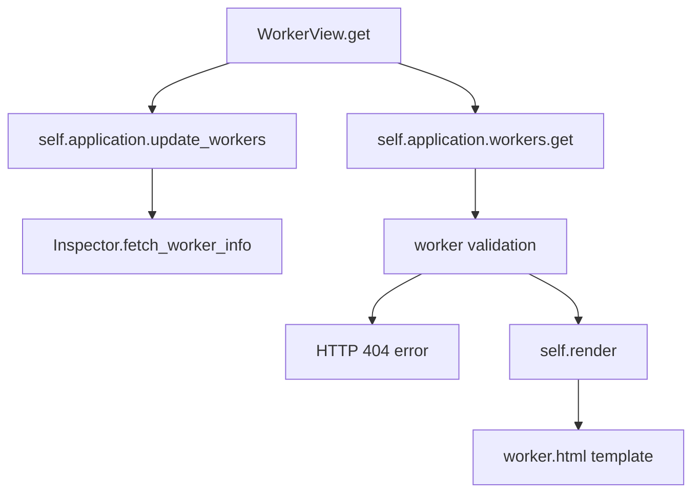

# `workers.py`

## `flower.views.workers.WorkerView` · *class*

## Summary:
A Tornado web handler for retrieving and displaying detailed information about a specific Celery worker.

## Description:
WorkerView is an asynchronous HTTP GET handler that serves as an endpoint for accessing detailed statistics and status information for individual Celery workers. It integrates with the Flower monitoring interface to provide worker-specific insights including task statistics, queue information, and worker configuration details.

This handler acts as a dedicated interface for worker inspection, separating the concerns of data retrieval, validation, and presentation. It leverages the authentication decorator to ensure secure access and follows standard Tornado request handling patterns.

## State:
- `application`: Reference to the Tornado application instance containing worker data and inspection capabilities
- `request`: Inherited from BaseHandler, contains HTTP request data
- `response`: Inherited from BaseHandler, contains HTTP response data

## Lifecycle:
- Creation: Automatically instantiated by Tornado's routing mechanism when handling HTTP GET requests to worker endpoints
- Usage: Called during normal HTTP request processing when a client accesses a worker detail page
- Destruction: Managed automatically by Tornado's request lifecycle

## Method Map:


## Raises:
- `tornado.web.HTTPError(404)`: Raised when the specified worker name is unknown or when worker statistics are unavailable

## Example:
```python
# Accessing worker details via HTTP GET
# Request: GET /worker/my-worker-name
# Response: Renders worker.html template with worker data

# Typical workflow:
# 1. Client makes GET request to /worker/<worker_name>
# 2. WorkerView.get() is invoked with worker name parameter
# 3. Application updates worker data via update_workers()
# 4. Worker data is retrieved from application.workers dictionary
# 5. Validation checks ensure worker exists and has stats
# 6. worker.html template is rendered with worker information
```

### `flower.views.workers.WorkerView.get` · *method*

## Summary:
Retrieves and renders detailed information for a specific Celery worker by name.

## Description:
This asynchronous method fetches the latest inspection data for a specified Celery worker, validates its existence and availability, and renders the worker's detailed statistics in a HTML template. It first updates the worker data through the application's inspection mechanism, then retrieves the worker information and performs validation checks before rendering the template.

The method is designed as a dedicated endpoint for retrieving individual worker details and exists separately from inline logic to provide a clear separation of concerns between data fetching, validation, and presentation layers.

Known callers:
- Tornado web framework routing: Automatically invoked when HTTP GET requests are made to worker-specific endpoints (e.g., /worker/<worker_name>)

## Args:
    name (str): The unique identifier/name of the target Celery worker to retrieve information for

## Returns:
    None: This method doesn't return a value directly, but renders an HTTP response

## Raises:
    tornado.web.HTTPError(404): Raised when the specified worker name is unknown or when worker statistics are unavailable

## State Changes:
    Attributes READ: self.application.workers, self.application.update_workers
    Attributes WRITTEN: None directly modified by this method

## Constraints:
    Preconditions:
    - The worker name must be a valid string identifier
    - The application must have initialized worker inspection data
    - The worker must exist in the application's worker registry
    
    Postconditions:
    - The worker data is refreshed via update_workers() call
    - If successful, the worker information is rendered in the worker.html template
    - If unsuccessful, appropriate HTTP 404 errors are raised

## Side Effects:
    I/O: Makes asynchronous calls to Celery workers for inspection data
    External service calls: Invokes the application's update_workers method which communicates with Celery workers
    Template rendering: Calls self.render() which generates HTML response content

## `flower.views.workers.WorkersView` · *class*

## Summary:
WorkersView is a Tornado web handler that displays information about Celery workers in the Flower monitoring interface.

## Description:
WorkersView handles HTTP GET requests to retrieve and display information about Celery workers. It provides both HTML and JSON representations of worker data, with options to refresh worker status and purge offline workers based on configuration. The view integrates with the Flower application's event system to gather real-time worker information and inherits authentication and request handling capabilities from BaseHandler.

## State:
- `application`: Reference to the Tornado application instance containing Celery configuration and worker data
- `request`: Inherited from BaseHandler, contains the HTTP request data
- `response`: Inherited from BaseHandler, contains the HTTP response data

## Lifecycle:
- Creation: Instantiated automatically by Tornado's routing mechanism when handling HTTP GET requests to the /workers endpoint
- Usage: Called via HTTP GET requests to the /workers endpoint, typically accessed through the web UI or API calls
- Destruction: Managed automatically by Tornado's request handling cycle

## Method Map:
```mermaid
graph TD
    A[WorkersView.get] --> B[get_argument(refresh)]
    A --> C[get_argument(json)]
    A --> D[update_workers()]
    A --> E[events.counter.items()]
    A --> F[_as_dict(worker)]
    A --> G[purge_offline_workers check]
    A --> H[render("workers.html")] or I[write({"data": ...})]
    B --> D
    E --> F
    F --> G
    G --> H
    G --> I
```

## Raises:
- `tornado.web.HTTPError`: May be raised by inherited methods during authentication or argument processing
- `Exception`: Caught and logged during worker updates but does not propagate to client

## Example:
```python
# Access via browser or API call:
# GET /workers?refresh=true&json=true
# Returns JSON data of active workers
# GET /workers
# Renders HTML page with worker information
```

### `flower.views.workers.WorkersView.get` · *method*

## Summary:
Retrieves and processes worker information for display or JSON serialization, with optional refresh and cleanup of offline workers.

## Description:
This method handles HTTP GET requests to retrieve worker status information. It supports refreshing worker data from the application, filtering out offline workers based on configured thresholds, and returning data either as HTML template context or JSON format. The method is part of the WorkersView class and integrates with the application's event system to gather worker statistics.

Known callers:
- Tornado framework during HTTP GET request handling for /workers endpoint
- Called during web page load or manual refresh requests

This logic is separated into its own method to encapsulate the complex workflow of gathering worker data, applying filters, and formatting responses for different output modes (HTML vs JSON).

## Args:
    None directly - relies on HTTP request arguments:
    - refresh (bool): When True, forces refresh of worker data via application.update_workers()
    - json (bool): When True, returns data as JSON instead of rendering HTML template

## Returns:
    None - writes response directly via self.write() or self.render()

## Raises:
    Exception - caught and logged when updating workers fails via logger.exception()

## State Changes:
    Attributes READ: self.application.events.state, self.application.options, self.application.capp, self.application.update_workers
    Attributes WRITTEN: None

## Constraints:
    Preconditions: 
    - self.application must have events.state attribute with counter and workers properties
    - self.application must have capp attribute with connection() method
    - self.application must have update_workers method
    - options.purge_offline_workers must be None or numeric value
    
    Postconditions:
    - If refresh=True, worker data is updated via self.application.update_workers()
    - If json=True, response contains serialized worker data
    - If json=False, renders workers.html template with worker data

## Side Effects:
    - I/O operations: calls self.application.update_workers() which likely makes network calls
    - External service calls: self.application.capp.connection().as_uri() may involve broker connection
    - Template rendering: calls self.render() which may involve filesystem I/O
    - Logging: logs exceptions when worker updates fail

### `flower.views.workers.WorkersView._as_dict` · *method*

## Summary:
Converts a worker object into a dictionary representation by extracting fields or falling back to detailed info extraction.

## Description:
This method serves as a utility for transforming worker objects into dictionary format for serialization or display purposes. It first attempts to extract fields from the worker object using the `_fields` attribute, and if that fails, falls back to a more comprehensive information extraction via the `_info` class method. This approach allows for flexible handling of different worker object types while maintaining consistent output format.

The method is called from the `get` method of `WorkersView` class during worker information processing, specifically when updating worker information dictionaries for display or JSON responses. It's designed to handle various worker object representations gracefully.

## Args:
    cls: The class reference (WorkersView) that this method belongs to
    worker: An object representing a worker, expected to either have a `_fields` attribute or support attribute access for standard worker properties

## Returns:
    dict: A dictionary containing worker information, either extracted from `_fields` or via the `_info` method fallback

## Raises:
    AttributeError: If worker object lacks both `_fields` attribute and required attributes for `_info` method fallback

## State Changes:
    Attributes READ: None - this method doesn't modify any instance attributes
    Attributes WRITTEN: None - this method doesn't modify any instance attributes

## Constraints:
    Preconditions: 
    - Worker object must be provided as second argument
    - Worker object must either have `_fields` attribute or support attribute access for standard worker properties
    - Class must have `_info` method available
    
    Postconditions:
    - Returns a dictionary with worker information
    - Dictionary keys are either from worker's `_fields` or standard worker property names

## Side Effects:
    None - this method performs no I/O operations or external service calls

### `flower.views.workers.WorkersView._info` · *method*

## Summary:
Extracts and returns selected attributes from a worker object as a dictionary.

## Description:
This method serves as a utility for serializing worker metadata by extracting specific fields from a worker instance. It is designed to be called by the WorkersView class to prepare worker information for API responses or logging purposes. The method filters out None values to ensure clean serialization.

The method is typically invoked during HTTP GET requests to the workers endpoint, where worker information needs to be formatted for JSON responses. It acts as a data transformation layer that extracts relevant metadata from worker objects without modifying them.

This method is part of the WorkersView class and is specifically used when a worker object doesn't have a `_fields` attribute, falling back to extracting predefined fields. It's called by the `_as_dict` classmethod of WorkersView.

## Args:
    cls: The class reference (typically WorkersView) - not used in implementation
    worker: An object representing a worker instance with various attributes

## Returns:
    dict: A dictionary containing key-value pairs of worker attributes that are not None

## Raises:
    AttributeError: If worker object lacks any of the expected attributes

## State Changes:
    Attributes READ: hostname, pid, freq, heartbeats, clock, active, processed, loadavg, sw_ident, sw_ver, sw_sys
    Attributes WRITTEN: None

## Constraints:
    Preconditions: worker must be an object with the defined attributes
    Postconditions: Returned dictionary contains only non-None values from the worker object

## Side Effects:
    None

