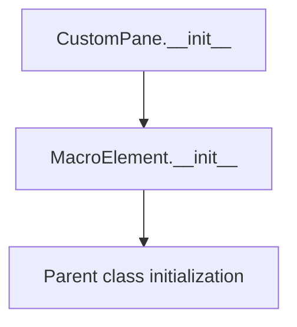

# `map.py`

## `folium.map.Layer` · *class*

## Summary:
Base class for map layers in Folium that provides common properties for layer management.

## Description:
The Layer class is an abstract base class that defines common attributes and behavior for all map layer types in Folium. It manages fundamental layer properties such as naming, overlay status, control visibility, and initial display state. Subclasses inherit these properties to implement specific layer types like tile layers, markers, and clusters.

## State:
- layer_name (str): Unique identifier for the layer. If not provided during initialization, it defaults to the result of get_name() method.
- overlay (bool): Indicates whether this layer is an overlay (True) or base layer (False). Default is False.
- control (bool): Controls whether this layer appears in the map's layer control interface. Default is True.
- show (bool): Determines initial visibility of the layer on the map. Default is True.

## Lifecycle:
- Creation: Instantiated with optional parameters for name, overlay status, control visibility, and show state
- Usage: Typically added to a Map instance using the add_child() method
- Destruction: Managed by the parent Map object's lifecycle management

## Method Map:
```mermaid
graph TD
    A[Layer.__init__] --> B[super().__init__()]
    B --> C[layer_name = name if name is not None else self.get_name()]
    C --> D[self.overlay = overlay]
    D --> E[self.control = control]
    E --> F[self.show = show]
```

## Raises:
- None explicitly raised in __init__
- May propagate exceptions from parent class initialization

## Example:
```python
# Create a layer with explicit name
layer = Layer(name="custom_layer", overlay=True, control=True, show=True)

# Create a layer with default settings
basic_layer = Layer()

# Create an overlay layer
overlay_layer = Layer(overlay=True, control=True)
```

### `folium.map.Layer.__init__` · *method*

## Summary:
Initializes a Layer object with configurable display properties and layer identification.

## Description:
This method sets up the foundational configuration for a map layer, defining its identification name, display behavior, and control visibility. It is called during the instantiation of Layer objects to establish their initial state. The method leverages the parent class's initialization and sets key attributes that govern how the layer behaves within a Folium map.

## Args:
    name (str, optional): Unique identifier for the layer. If None, defaults to the result of self.get_name(). Defaults to None.
    overlay (bool): Indicates if the layer is an overlay. Defaults to False.
    control (bool): Determines if the layer appears in the map controls. Defaults to True.
    show (bool): Controls whether the layer is initially visible. Defaults to True.

## Returns:
    None: This method does not return a value.

## Raises:
    None: This method does not explicitly raise exceptions.

## State Changes:
    Attributes READ: self.get_name()
    Attributes WRITTEN: self.layer_name, self.overlay, self.control, self.show

## Constraints:
    Preconditions: The object must be an instance of Layer or a subclass.
    Postconditions: The layer's identification name, overlay status, control visibility, and show status are set according to the provided arguments or defaults.

## Side Effects:
    None: This method does not perform I/O operations or mutate external objects.

## `folium.map.FeatureGroup` · *class*

## Summary:
A FeatureGroup is a container layer that groups multiple map elements together for collective management and display control.

## Description:
The FeatureGroup class serves as a logical grouping mechanism for map elements in Folium. It allows users to organize related map features (such as markers, lines, polygons) into a single unit that can be controlled as a whole. This abstraction enables easier management of complex maps where multiple elements need to be shown, hidden, or toggled together.

FeatureGroups are particularly useful for creating overlays that can be managed through the map's layer control interface. They inherit from Layer and extend its functionality by providing a container for other map elements.

## State:
- _name (str): Fixed string value "FeatureGroup" that identifies this layer type
- tile_name (str): The name used for this feature group, either explicitly provided via the name parameter or automatically generated via get_name() method
- options (dict): Dictionary of parsed options with camelCase keys, containing additional configuration parameters passed through **kwargs

## Lifecycle:
- Creation: Instantiate with optional name, overlay, control, show parameters, and additional keyword arguments
- Usage: Add child elements using add_child() method, then add the FeatureGroup to a Map instance
- Destruction: Managed by the parent Map object's lifecycle management

## Method Map:
```mermaid
graph TD
    A[FeatureGroup.__init__] --> B[super().__init__()]
    B --> C[_name = "FeatureGroup"]
    C --> D[tile_name = name if name is not None else self.get_name()]
    D --> E[self.options = parse_options(**kwargs)]
```

## Raises:
- None explicitly raised in __init__
- May propagate exceptions from parent Layer class initialization or parse_options function

## Example:
```python
import folium

# Create a FeatureGroup with custom name
fg = folium.FeatureGroup(name="Custom Features", overlay=True)

# Add markers to the feature group
marker1 = folium.Marker([40.7128, -74.0060], popup="New York")
marker2 = folium.Marker([34.0522, -118.2437], popup="Los Angeles")

fg.add_child(marker1)
fg.add_child(marker2)

# Add the feature group to a map
m = folium.Map(location=[40.7128, -74.0060], zoom_start=5)
m.add_child(fg)
```

### `folium.map.FeatureGroup.__init__` · *method*

## Summary:
Initializes a FeatureGroup instance with configurable naming, overlay status, control visibility, and additional options.

## Description:
The FeatureGroup.__init__ method sets up a FeatureGroup object by initializing its core properties and preparing it for use as a container for map elements. It extends the Layer base class initialization with specific FeatureGroup behaviors including fixed naming, automatic tile name generation, and option parsing.

This method is called during FeatureGroup instantiation and establishes the foundational state for managing grouped map elements. It ensures proper inheritance from Layer while setting FeatureGroup-specific attributes.

## Args:
    name (str, optional): Unique identifier for the feature group. If None, uses auto-generated name via get_name(). Defaults to None.
    overlay (bool): Whether this feature group acts as an overlay layer. Defaults to True.
    control (bool): Whether this feature group appears in the map's layer control. Defaults to True.
    show (bool): Initial visibility state of the feature group. Defaults to True.
    **kwargs: Additional configuration options that are converted to camelCase keys and filtered for None values.

## Returns:
    None: This method initializes the object's state and does not return a value.

## Raises:
    None explicitly raised in this method.
    May propagate exceptions from parent Layer.__init__ or parse_options functions.

## State Changes:
    Attributes READ: 
    - self.get_name() (method call)
    Attributes WRITTEN:
    - self._name (set to "FeatureGroup")
    - self.tile_name (set to name or result of self.get_name())
    - self.options (set to parsed kwargs)

## Constraints:
    Precondition: The parent Layer class must successfully initialize.
    Precondition: The FeatureGroup class must properly inherit from Layer.
    Postcondition: self._name is always set to "FeatureGroup".
    Postcondition: self.tile_name is always set to either the provided name or auto-generated name.
    Postcondition: self.options is always a dictionary with camelCase keys.

## Side Effects:
    None: This method performs no I/O operations or external service calls.
    The method modifies internal object state but does not affect external objects.

## `folium.map.LayerControl` · *class*

## Summary:
LayerControl is a UI element that manages the visibility and organization of map layers in a Folium map, providing a toggle interface for base layers and overlays.

## Description:
The LayerControl class creates a user interface element that enables users to manage the visibility of different map layers. It automatically detects and organizes layers added to a map into base layers (which are mutually exclusive) and overlays (which can be toggled independently). This class integrates with the Folium map rendering system to provide interactive layer management capabilities.

## State:
- base_layers (OrderedDict): Maps layer names to their JavaScript identifiers for base layers, which are mutually exclusive
- overlays (OrderedDict): Maps layer names to their JavaScript identifiers for overlay layers, which can be toggled independently  
- layers_untoggle (OrderedDict): Tracks layers that should be untoggled when multiple base layers exist
- options (dict): Configuration options for the layer control, including position, collapsed state, and autoZIndex behavior
- _name (str): Fixed value "LayerControl" identifying this element type

## Lifecycle:
- Creation: Instantiated with optional positioning and behavior parameters; typically created internally by Folium
- Usage: Automatically invoked during map rendering to collect and organize child layers
- Destruction: Managed by the parent Map's lifecycle management

## Method Map:
```mermaid
graph TD
    A[LayerControl.__init__] --> B[super().__init__()]
    B --> C[self._name = "LayerControl"]
    C --> D[self.options = parse_options(...)]
    D --> E[self.base_layers = OrderedDict()]
    E --> F[self.overlays = OrderedDict()]
    F --> G[self.layers_untoggle = OrderedDict()]

    A --> H[LayerControl.render]
    H --> I[LayerControl.reset]
    I --> J[Iterate parent children]
    J --> K{Is Layer & control?}
    K -- Yes --> L[Process layer]
    L --> M{Is base layer?}
    M -- Yes --> N[Add to base_layers]
    N --> O{Multiple base layers?}
    O -- Yes --> P[Add to layers_untoggle]
    M -- No --> Q[Add to overlays]
    Q --> R{Not shown?}
    R -- Yes --> S[Add to layers_untoggle]
    K -- No --> T[Continue]

    T --> U[super().render()]
```

## Raises:
- None explicitly raised in __init__ or render methods
- May propagate exceptions from parent class initialization or parse_options

## Example:
```python
# LayerControl is typically created automatically by Folium
# when a map is constructed with layers

# Typical usage pattern:
# 1. Create a map with various layers
# 2. Add base layers and overlays
# 3. The LayerControl is automatically managed by Folium
# 4. Users can interact with the layer control UI in the rendered map

# Manual instantiation (rare):
control = LayerControl(position="topleft", collapsed=False)
```

### `folium.map.LayerControl.__init__` · *method*

## Summary:
Initializes a LayerControl object with configurable positioning and layer management capabilities.

## Description:
Configures the LayerControl instance by setting its name, parsing initialization options, and initializing internal data structures for managing base layers, overlays, and untoggleable layers. This method establishes the foundational state required for controlling map layers in a Folium visualization.

## Args:
    position (str): Position of the layer control on the map. Defaults to "topright".
    collapsed (bool): Whether the layer control is initially collapsed. Defaults to True.
    autoZIndex (bool): Whether to automatically manage z-index of layers. Defaults to True.
    **kwargs: Additional options passed to the parse_options utility function.

## Returns:
    None

## Raises:
    None

## State Changes:
    Attributes READ: None
    Attributes WRITTEN: _name, options, base_layers, overlays, layers_untoggle

## Constraints:
    - Precondition: The parent class constructor must be callable and compatible with the super() call.
    - Postcondition: The instance will have _name set to "LayerControl", options populated with parsed configuration, and all layer collections initialized as empty OrderedDict instances.

## Side Effects:
    None

### `folium.map.LayerControl.reset` · *method*

## Summary:
Resets the LayerControl's base layers, overlays, and layers_untoggle collections to empty OrderedDict instances.

## Description:
This method clears all layer definitions stored in the LayerControl instance by resetting three internal OrderedDict attributes to empty collections. It is typically called during map initialization or when rebuilding the layer control structure to ensure a clean state before adding new layers.

## Args:
    None

## Returns:
    None

## Raises:
    None

## State Changes:
    Attributes READ: None
    Attributes WRITTEN: 
    - self.base_layers: Reset to empty OrderedDict
    - self.overlays: Reset to empty OrderedDict  
    - self.layers_untoggle: Reset to empty OrderedDict

## Constraints:
    Preconditions: None
    Postconditions: All three OrderedDict attributes are replaced with new empty OrderedDict instances

## Side Effects:
    None

### `folium.map.LayerControl.render` · *method*

## Summary:
Rebuilds the layer control's internal state by scanning parent map children and organizing them into base layers and overlays.

## Description:
This method updates the LayerControl's internal dictionaries (base_layers, overlays, and layers_untoggle) by examining all child elements of the parent map. It filters children to include only those that are instances of Layer with control enabled, then categorizes them as base layers or overlays based on their overlay property. Layers that should be initially hidden (overlays with show=False or base layers with multiple entries) are tracked in layers_untoggle.

## Args:
    **kwargs: Additional keyword arguments passed to the parent render method

## Returns:
    None: This method does not return a value

## Raises:
    None explicitly raised

## State Changes:
    Attributes READ: self._parent._children, self._parent, item.layer_name, item.overlay, item.control, item.show
    Attributes WRITTEN: self.base_layers, self.overlays, self.layers_untoggle

## Constraints:
    Preconditions:
    - self._parent must be a valid map object with a _children attribute containing child elements
    - Each child in self._parent._children must be an instance of Layer or subclass
    - self must be properly initialized as a LayerControl instance
    
    Postconditions:
    - self.base_layers contains all base layers from parent map children
    - self.overlays contains all overlay layers from parent map children
    - self.layers_untoggle contains keys for layers that should be hidden (overlays with show=False or base layers with multiple entries)

## Side Effects:
    None: This method performs no I/O operations or external service calls

## `folium.map.Icon` · *class*

## Summary:
Represents an icon element for map markers with customizable color, icon, and rotation properties.

## Description:
The Icon class is used to create styled icons for map markers in folium maps. It inherits from MacroElement and provides a standardized interface for configuring marker icons with various visual properties including color, icon type, and rotation angle. The class validates color inputs against a predefined set of supported colors and issues warnings for invalid color values.

## State:
- color (str): Background color of the icon, defaults to "blue". Must be one of: {"red", "darkred", "lightred", "orange", "beige", "green", "darkgreen", "lightgreen", "blue", "darkblue", "cadetblue", "lightblue", "purple", "darkpurple", "pink", "white", "gray", "lightgray", "black"}
- icon_color (str): Text/icon color, defaults to "white"
- icon (str): Icon name, defaults to "info-sign"
- angle (int): Rotation angle in degrees, defaults to 0
- prefix (str): Icon prefix, defaults to "glyphicon"
- options (dict): Processed configuration options containing camelCase keys
- _name (str): Class identifier, hardcoded to "Icon"

## Lifecycle:
Creation: Instantiate with optional color, icon_color, icon, angle, and prefix parameters. The constructor validates the color parameter and processes all options through parse_options.
Usage: Typically used as part of Marker elements to customize their appearance on maps.
Destruction: Inherits standard Python object lifecycle management from MacroElement parent class.

## Method Map:
```mermaid
graph TD
    A[Icon.__init__] --> B[super().__init__()]
    B --> C[Validate color against color_options]
    C --> D[Call parse_options with marker_color, icon_color, icon, prefix, extra_classes]
    D --> E[Set self.options]
```

## Raises:
- UserWarning: When the color parameter is not in the predefined color_options set

## Example:
```python
# Create a red icon with a star symbol
icon = Icon(color='red', icon='star', icon_color='yellow')

# Create a blue icon rotated 45 degrees
icon = Icon(color='blue', icon='home', angle=45)
```

### `folium.map.Icon.__init__` · *method*

## Summary:
Initializes an Icon object with customizable color, icon, and rotation properties for map markers.

## Description:
Configures an icon element for map markers with validation of color parameters and processing of styling options. This method sets up the basic configuration for icon appearance including background color, icon symbol, text color, rotation angle, and icon library prefix.

## Args:
    color (str): Background color of the icon, defaults to "blue". Must be one of: {"red", "darkred", "lightred", "orange", "beige", "green", "darkgreen", "lightgreen", "blue", "darkblue", "cadetblue", "lightblue", "purple", "darkpurple", "pink", "white", "gray", "lightgray", "black"}
    icon_color (str): Text/icon color, defaults to "white"
    icon (str): Icon name, defaults to "info-sign"
    angle (int): Rotation angle in degrees, defaults to 0
    prefix (str): Icon prefix, defaults to "glyphicon"
    **kwargs: Additional keyword arguments passed to option processing

## Returns:
    None

## Raises:
    UserWarning: When the color argument is not in the predefined color_options set

## State Changes:
    Attributes READ: None
    Attributes WRITTEN: 
    - self._name: Set to "Icon"
    - self.options: Set to processed options dictionary

## Constraints:
    - Precondition: The color argument must be one of the predefined valid color options, or a warning will be issued
    - Postcondition: The self.options dictionary will contain properly formatted camelCase keys with validated values

## Side Effects:
    - Issues a UserWarning via the warnings module when color is not in valid color_options
    - Calls parse_options function to process and validate configuration parameters

## `folium.map.Marker` · *class*

## Summary:
A Marker class that represents an interactive marker element for folium maps, capable of displaying icons, popups, and tooltips at specific geographic locations.

## Description:
The Marker class extends the MacroElement base class to create interactive marker elements that can be displayed on folium maps. It serves as a fundamental building block for adding geographic points with customizable visual elements and interactive behaviors. Markers are commonly used to highlight specific locations on maps and can be enhanced with popups for detailed information and tooltips for contextual hints.

## State:
- location (list[float] or None): Geographic coordinates [latitude, longitude] validated through validate_location, or None if not yet assigned
- _name (str): Class identifier set to "Marker" for internal Folium processing
- icon (Icon or None): Optional icon element to display at the marker location
- options (dict): Configuration options for marker behavior, processed via parse_options including draggable and autoPan settings
- _template (Template): Jinja2 template used for rendering the marker HTML (currently empty in implementation)

## Lifecycle:
- Creation: Instantiate with optional location, icon, popup, tooltip, and draggable settings
- Usage: Add to a map using add_child() method, then render within a Figure context (which internally calls render())
- Destruction: Managed automatically through the Element parent-child relationship system

## Method Map:
```mermaid
graph TD
    A[Marker.__init__] --> B[super().__init__()]
    B --> C[self._name = "Marker"]
    C --> D[self.location = validate_location(location)]
    D --> E[self.options = parse_options(draggable=draggable, autoPan=draggable, **kwargs)]
    E --> F{icon is not None?}
    F -- Yes --> G[add_child(icon)]
    G --> H[self.icon = icon]
    F -- No --> I[Continue]
    I --> J{popup is not None?}
    J -- Yes --> K[add_child(popup)]
    K --> L[Continue]
    J -- No --> M[Continue]
    M --> N{tooltip is not None?}
    N -- Yes --> O[add_child(tooltip)]
    O --> P[End]
    N -- No --> P
    
    P --> Q[Marker.render]
    Q --> R{location is None?}
    R -- Yes --> S[raise ValueError]
    R -- No --> T[super().render()]
```

## Raises:
- ValueError: When render() is called and location has not been assigned
- AssertionError: When trying to render the marker outside of a Figure context (inherited from parent class)

## Example:
```python
# Create a basic marker at a location
marker = Marker(
    location=[40.7128, -74.0060],
    popup="New York City",
    tooltip="NYC"
)

# Create a draggable marker with custom icon
from folium.features import Icon
icon = Icon(color='red', icon='info-sign')
draggable_marker = Marker(
    location=[37.7749, 122.4194],
    icon=icon,
    draggable=True
)

# Add markers to a map
map_instance.add_child(marker)
map_instance.add_child(draggable_marker)
```

### `folium.map.Marker.__init__` · *method*

## Summary:
Initializes a Marker element with location, popup, tooltip, and icon properties, setting up the marker's configuration and establishing relationships with child elements.

## Description:
The Marker.__init__ method constructs a map marker element by initializing its core properties including location validation, draggable options, and child elements such as popups, tooltips, and icons. This method serves as the primary constructor for creating marker instances that can be added to folium maps. It processes input parameters through validation functions and establishes the proper parent-child relationships with associated UI elements through the add_child() method.

## Args:
    location (array-like, optional): Geographic coordinates as [latitude, longitude]. Defaults to None.
    popup (Popup or str, optional): Popup element or HTML string to display on marker click. Defaults to None.
    tooltip (Tooltip or str, optional): Tooltip element or text to display on hover. Defaults to None.
    icon (Icon, optional): Custom icon for the marker. Defaults to None.
    draggable (bool): Whether the marker can be dragged by the user. Defaults to False.
    **kwargs: Additional options passed to the marker's configuration.

## Returns:
    None

## Raises:
    None

## State Changes:
    Attributes READ: None
    Attributes WRITTEN: 
    - self._name: Set to "Marker"
    - self.location: Set to validated location or None
    - self.options: Set to parsed options dictionary
    - self.icon: Set to icon instance if provided

## Constraints:
    Preconditions:
    - If location is provided, it must be a valid coordinate pair
    - If popup is provided, it must be either a Popup instance or convertible to string
    - If tooltip is provided, it must be either a Tooltip instance or convertible to string
    - If icon is provided, it must be a valid Icon instance
    
    Postconditions:
    - self._name is always set to "Marker"
    - self.location is either None or a validated list of two floats
    - self.options is always a dictionary with camelCase keys
    - Child elements (popup, tooltip, icon) are registered with the parent-child relationship system

## Side Effects:
    - Calls validate_location() to process location input
    - Calls parse_options() to process draggable/autoPan settings and additional options
    - Invokes add_child() method to register child elements with the marker's parent-child hierarchy

### `folium.map.Marker._get_self_bounds` · *method*

## Summary:
Returns the bounding box coordinates for the marker's location by duplicating the location twice.

## Description:
This method provides a standardized way to retrieve the bounds of a marker element, which is particularly useful for map view calculations and zoom operations. It is called during the rendering process when the map needs to determine the geographical extent occupied by the marker.

The method exists as a separate function to maintain consistency with other map elements that also implement `_get_self_bounds()` methods, enabling uniform handling of bounds calculation across different element types in the folium framework.

## Args:
    None

## Returns:
    list[list[float]]: A list containing two identical coordinate pairs representing the marker's location as a bounding box [[lat, lng], [lat, lng]]. Both entries are identical since a single point has no width or height.

## Raises:
    None

## State Changes:
    Attributes READ: self.location
    Attributes WRITTEN: None

## Constraints:
    Preconditions: The marker must have a valid location assigned (not None)
    Postconditions: The returned list always contains exactly two identical coordinate entries

## Side Effects:
    None

### `folium.map.Marker.render` · *method*

## Summary:
Validates that the marker has a location assigned before rendering and delegates rendering to the parent class.

## Description:
This method ensures that a Marker object has a valid location assigned before proceeding with the rendering process. It's called during the map rendering lifecycle when the marker needs to be included in the final HTML output. The validation prevents rendering markers that would cause issues in the frontend visualization due to missing location data. This validation is crucial because markers without locations cannot be properly displayed on maps.

## Args:
    None

## Returns:
    None

## Raises:
    ValueError: When the marker's location attribute is None, indicating that the location was not properly assigned during initialization or has been unset.

## State Changes:
    Attributes READ: self.location, self._name
    Attributes WRITTEN: None

## Constraints:
    Preconditions:
    - The Marker instance must have been initialized with a valid _name attribute
    - The Marker instance must have a location assigned (not None) before calling this method
    
    Postconditions:
    - The method raises a ValueError if location is None
    - If location is valid, the parent class's render method is called successfully

## Side Effects:
    None

## `folium.map.Popup` · *class*

## Summary:
A Popup class that represents an interactive popup element for folium maps, capable of displaying HTML content with various styling and behavior options.

## Description:
The Popup class extends the Element base class to create interactive popup elements that can be displayed on folium maps. It handles rendering HTML content, managing popup properties like maximum width and visibility, and integrates with the map's rendering system. Popups are commonly used to display additional information when users interact with map markers or other map elements.

## State:
- _name (str): Set to "Popup" to identify the element type
- header (Element): Container for popup header content
- html (Element): Container for popup HTML content
- script (Element): Container for popup JavaScript code
- show (bool): Controls whether the popup is initially visible
- lazy (bool): Controls lazy loading behavior for the popup
- options (dict): Configuration options for popup behavior, processed via parse_options

## Lifecycle:
- Creation: Instantiate with optional HTML content, styling options, and behavior flags
- Usage: Add to a map or marker using add_child() method, then render within a Figure context (which internally calls render())
- Destruction: Managed automatically through the Element parent-child relationship system

## Method Map:
```mermaid
graph TD
    A[Popup.__init__] --> B[super().__init__()]
    B --> C[Initialize header/html/script Elements]
    C --> D{html is Element?}
    D -- Yes --> E[Add html as child to self.html]
    D -- No --> F{html is str?}
    F -- Yes --> G[Escape backticks and wrap in Html Element]
    G --> H[Add Html to self.html]
    H --> I[Process options with parse_options]
    I --> J[Popup.render]
    J --> K[Render children]
    K --> L[Get root Figure]
    L --> M[Assert Figure type]
    M --> N[Add rendered template to Figure script]
```

## Raises:
- AssertionError: When trying to render the popup outside of a Figure context

## Example:
```python
# Create a popup with HTML content
popup = Popup(
    html="<h3>Hello World!</h3><p>This is a popup</p>",
    max_width="200px",
    show=True,
    sticky=True
)

# Add to a marker - this will eventually trigger rendering when the map is rendered
marker.add_child(popup)
```

### `folium.map.Popup.__init__` · *method*

## Summary:
Initializes a Popup object with HTML content, styling options, and display properties for map annotations.

## Description:
Configures a Popup instance by setting up its internal HTML structure, parsing input HTML content, and establishing display options. This method initializes the popup's parent-child relationships with its header, HTML content, and script elements, and prepares the configuration options for rendering in map interfaces.

## Args:
    html (str or Element, optional): HTML content to display in the popup. Can be a string or an Element object. Defaults to None.
    parse_html (bool): Whether to parse HTML content for scripting. If True, scripts are not executed. Defaults to False.
    max_width (str): Maximum width of the popup element. Defaults to "100%".
    show (bool): Whether to display the popup immediately upon creation. Defaults to False.
    sticky (bool): Whether the popup stays visible when clicking elsewhere. Defaults to False.
    lazy (bool): Whether to delay popup rendering. Defaults to False.
    **kwargs: Additional options passed to the underlying JavaScript library for popup configuration.

## Returns:
    None: This method initializes the object's state and does not return a value.

## Raises:
    None explicitly raised.

## State Changes:
    Attributes READ: None
    Attributes WRITTEN: 
    - self._name: Set to "Popup"
    - self.header: Initialized as Element() and assigned as child of self
    - self.html: Initialized as Element() and assigned as child of self  
    - self.script: Initialized as Element() and assigned as child of self
    - self.show: Set to provided show parameter
    - self.lazy: Set to provided lazy parameter
    - self.options: Set by parsing options with parse_options()

## Constraints:
    Preconditions:
    - self must be an instance of Popup class
    - html parameter, if provided, must be either None, str, or Element type
    - parse_html parameter must be boolean
    - max_width parameter must be a string
    - show, sticky, and lazy parameters must be boolean
    
    Postconditions:
    - self._name is set to "Popup"
    - Header, HTML, and script elements are initialized and linked to parent
    - HTML content is properly processed and added as child to self.html
    - Options dictionary is constructed with appropriate camelCase keys

## Side Effects:
    None

### `folium.map.Popup.render` · *method*

## Summary:
Renders the popup element by recursively rendering child elements and embedding the final template into the figure's script container.

## Description:
This method implements the rendering logic for Popup elements by first recursively rendering all child elements, then generating the final HTML template representation and adding it to the figure's script container. This approach allows for hierarchical rendering of map components where child elements are processed before their parent.

## Args:
    **kwargs: Additional keyword arguments passed through to child rendering processes.

## Returns:
    None

## Raises:
    AssertionError: When the popup element is not contained within a Figure instance.

## State Changes:
    Attributes READ: self._children, self._template, self.get_root(), self.get_name()
    Attributes WRITTEN: None

## Constraints:
    Precondition: The popup element must be contained within a Figure instance.
    Postcondition: The rendered template is added to the figure's script container with the popup's name as identifier.

## Side Effects:
    I/O: Adds rendered HTML content to the figure's script container.
    External service calls: None
    Mutations to objects outside self: Modifies the figure's script container by adding a new Element.

## `folium.map.Tooltip` · *class*

## Summary:
A Tooltip class that creates interactive tooltips for map elements in Folium, extending the MacroElement base class.

## Description:
The Tooltip class provides a mechanism to add interactive tooltips to map markers, polygons, and other geographical elements in Folium maps. It extends MacroElement to integrate seamlessly with Folium's rendering system and allows customization of tooltip appearance and behavior through various configuration options. Tooltips are typically used to display additional information when users hover over or click on map features.

## State:
- text (str): The tooltip text content, converted to string during initialization
- style (str, optional): Inline HTML style properties for customizing tooltip appearance
- options (dict): Configuration options for the tooltip, processed through parse_options method
- _name (str): Class identifier set to "Tooltip" for internal Folium processing
- _template (Template): Jinja2 template used for rendering the tooltip HTML (empty in current implementation)

## Lifecycle:
- Creation: Instantiate with text content, optional style, and configuration options
- Usage: Tooltips are automatically rendered when added to a Folium map and associated with map elements
- Destruction: Managed automatically by Folium's element lifecycle management

## Method Map:
```mermaid
flowchart TD
    A[Tooltip.__init__] --> B[super().__init__()]
    B --> C[self._name = "Tooltip"]
    C --> D[self.text = str(text)]
    D --> E[kwargs.update({"sticky": sticky})]
    E --> F[self.parse_options(kwargs)]
    F --> G[return]
    
    A --> H[parse_options validation]
    H --> I[camelize keys]
    I --> J[Validate option types]
    J --> K[Return processed options]
```

## Raises:
- AssertionError: Raised in __init__ when style parameter is not a string
- AssertionError: Raised in parse_options when an option key is not in valid_options or when an option value doesn't match the expected type

## Example:
```python
# Create a basic tooltip
tooltip = Tooltip('Hello World')

# Create a styled tooltip with options
styled_tooltip = Tooltip(
    'Click me!',
    style='background-color: red; color: white;',
    permanent=True,
    direction='top'
)

# Add to a marker
marker.add_child(tooltip)
```

### `folium.map.Tooltip.__init__` · *method*

## Summary:
Initializes a Tooltip object with text content, optional styling, and configuration options for map interactivity.

## Description:
Configures a Tooltip instance by setting its text content, processing configuration options, and applying optional CSS styling. This constructor establishes the fundamental properties needed for tooltip rendering in Folium maps, ensuring proper integration with the underlying JavaScript-based visualization system. The method handles conversion of snake_case option names to camelCase format and validates option types against the class's valid_options list.

## Args:
    text (Any): The tooltip text content, converted to string format during initialization
    style (str, optional): Valid inline HTML style property string for customizing tooltip appearance. Defaults to None
    sticky (bool): Whether the tooltip should remain visible when hovering over it. Defaults to True
    **kwargs: Additional configuration options that will be processed through parse_options method

## Returns:
    None: This method initializes the object's state but does not return a value

## Raises:
    AssertionError: When style parameter is provided but is not a string type
    AssertionError: When parse_options method encounters invalid option keys or types (inherited from parse_options)

## State Changes:
    Attributes READ: None
    Attributes WRITTEN: 
    - self._name: Set to "Tooltip" for internal identification
    - self.text: Set to string representation of the input text parameter
    - self.options: Set to processed dictionary of configuration options via parse_options
    - self.style: Set to the provided style string (when provided)

## Constraints:
    Preconditions:
    - text parameter must be convertible to string
    - style parameter (if provided) must be a string type
    - All kwargs must be valid option keys and types for the Tooltip class
    - All kwargs keys must be present in the class's valid_options list
    
    Postconditions:
    - self._name is set to "Tooltip"
    - self.text is stored as a string
    - self.options contains processed configuration options with camelCase keys
    - self.style is set only when a valid style string is provided

## Side Effects:
    None: This method performs no I/O operations or external service calls

### `folium.map.Tooltip.parse_options` · *method*

## Summary:
Converts and validates keyword arguments into a dictionary of camelCase options for tooltip configuration.

## Description:
Processes incoming keyword arguments by converting them from snake_case to camelCase format and validating that each option is both present in the allowed options list and of the correct type. This method ensures consistent option handling across different tooltip configurations while maintaining type safety.

## Args:
    kwargs (dict): Dictionary of keyword arguments containing tooltip configuration options in snake_case format.

## Returns:
    dict: A dictionary with camelCase keys and validated values that conform to the expected types for tooltip options.

## Raises:
    AssertionError: When an option key is not in the valid_options list or when an option value doesn't match the expected type.

## State Changes:
    Attributes READ: self.valid_options
    Attributes WRITTEN: None

## Constraints:
    Preconditions: 
    - All keys in kwargs must be strings
    - All values in kwargs must be of the correct type according to self.valid_options
    - All keys in kwargs must be present in self.valid_options
    
    Postconditions:
    - Returned dictionary has all keys converted to camelCase format
    - All values in returned dictionary match their expected types
    - All keys in returned dictionary are present in self.valid_options

## Side Effects:
    None

## `folium.map.FitBounds` · *class*

## Summary:
A Folium map component that adjusts the view to fit specified geographical bounds.

## Description:
The FitBounds class is responsible for programmatically adjusting a Leaflet map's viewport to encompass a given set of geographical coordinates. It is typically used to automatically center and zoom a map to display a specific area or set of markers. This class inherits from MacroElement, making it a standard component that can be added to Folium maps.

## State:
- bounds: list or tuple of two coordinate pairs [[lat1, lng1], [lat2, lng2]] representing the geographical boundaries to fit
- options: dict containing configuration options for the fit bounds operation, including:
  - max_zoom: int, optional maximum zoom level to use when fitting bounds
  - padding_top_left: list of two ints [x, y], optional padding for top-left corner
  - padding_bottom_right: list of two ints [x, y], optional padding for bottom-right corner
  - padding: list of two ints [x, y], optional padding for all sides

## Lifecycle:
- Creation: Instantiate with bounds and optional padding/max_zoom parameters
- Usage: Add to a Folium map using the add_child() method or similar
- Destruction: Managed automatically by the map's lifecycle

## Method Map:
```mermaid
flowchart TD
    A[FitBounds.__init__] --> B[super().__init__()]
    B --> C[Set _name = "FitBounds"]
    C --> D[Set bounds attribute]
    D --> E[Call parse_options]
    E --> F[Store options dict]
```

## Raises:
- None explicitly raised by FitBounds.__init__
- May raise exceptions from parent MacroElement.__init__ if invalid parameters are passed
- May raise exceptions from parse_options if invalid parameters are passed

## Example:
```python
import folium

# Create a map
m = folium.Map(location=[40.7128, -74.0060], zoom_start=10)

# Define bounds to fit
bounds = [[40.70, -74.01], [40.72, -73.99]]

# Add FitBounds to adjust map view
fit_bounds = folium.FitBounds(bounds)
m.add_child(fit_bounds)

# The map will now be centered and zoomed to fit the specified bounds
```

### `folium.map.FitBounds.__init__` · *method*

## Summary:
Initializes a FitBounds object that configures map bounds fitting with optional padding and zoom constraints.

## Description:
Configures the FitBounds functionality for a map by setting up the bounding coordinates and associated options. This method is part of the initialization process for map view control elements that adjust the map viewport to fit specified geographical bounds.

## Args:
    bounds (list): A list containing two coordinate pairs representing the southwest and northeast corners of the bounding box in [latitude, longitude] format.
    padding_top_left (tuple, optional): Top-left padding as (x, y) tuple in pixels. Defaults to None.
    padding_bottom_right (tuple, optional): Bottom-right padding as (x, y) tuple in pixels. Defaults to None.
    padding (tuple, optional): Uniform padding as (x, y) tuple in pixels applied to all sides. Defaults to None.
    max_zoom (int, optional): Maximum zoom level to constrain the fitting operation. Defaults to None.

## Returns:
    None: This method does not return a value.

## Raises:
    None explicitly raised.

## State Changes:
    Attributes READ: None
    Attributes WRITTEN: 
    - self._name: Set to "FitBounds" string identifier
    - self.bounds: Assigned the input bounds parameter
    - self.options: Assigned result from parse_options function call

## Constraints:
    - Precondition: The bounds parameter must be a valid list of coordinate pairs
    - Precondition: All padding parameters must be tuples of two integers or None
    - Postcondition: The self._name attribute is set to "FitBounds"
    - Postcondition: The self.bounds attribute contains the provided bounds
    - Postcondition: The self.options attribute contains processed options dictionary

## Side Effects:
    None

## `folium.map.CustomPane` · *class*

## Summary:
A CustomPane class that represents a custom pane element for use in folium maps, extending MacroElement for map layer management.

## Description:
The CustomPane class provides a mechanism to create custom panes within folium maps that can control the stacking order and pointer event behavior of map elements. It inherits from MacroElement and is designed to be added to folium maps as child elements. This allows developers to organize map components into distinct layers with specific rendering and interaction properties.

## State:
- name (str): The identifier name for this pane. Must be a string that uniquely identifies the pane within the map context.
- z_index (int): Controls the stacking order of the pane. Higher values appear on top. Default is 625.
- pointer_events (bool): Determines whether pointer events (clicks, hovers) are enabled for this pane. Default is False.
- _name (str): Internal identifier set to "Pane" for class recognition and template processing.

## Lifecycle:
- Creation: Instantiate with a name parameter, optionally specifying z_index and pointer_events.
- Usage: Typically used as part of a map's pane system, where panes define layering behavior for map elements.
- Destruction: No explicit cleanup required; relies on parent class lifecycle management.

## Method Map:


## Raises:
- None explicitly raised by __init__ in the provided code.
- May raise exceptions from parent MacroElement.__init__() if invalid arguments are passed.

## Example:
```python
# Create a custom pane
pane = CustomPane(name="custom-overlay", z_index=700, pointer_events=True)

# Add to a folium map
map.add_child(pane)
```

### `folium.map.CustomPane.__init__` · *method*

## Summary:
Initializes a CustomPane instance with configurable name, z-index, and pointer event handling.

## Description:
This constructor method initializes a CustomPane object, setting up its fundamental properties for map layer management. It inherits from the base Element class and configures key pane attributes that control rendering order and interaction behavior in map visualizations. The method ensures proper initialization of pane-specific properties while maintaining compatibility with the parent Element class.

## Args:
    name (str): Unique identifier for the pane, used to reference this pane in the map's layer management system.
    z_index (int, optional): CSS z-index value determining the stacking order of the pane. Defaults to 625.
    pointer_events (bool, optional): Whether the pane should receive pointer events (clicks, hovers, etc.). Defaults to False.

## Returns:
    None: This method does not return any value.

## Raises:
    None: This method does not explicitly raise exceptions.

## State Changes:
    Attributes READ: None
    Attributes WRITTEN: 
        - self._name: Set to the literal string "Pane" (hardcoded)
        - self.name: Set to the provided name parameter
        - self.z_index: Set to the provided z_index parameter
        - self.pointer_events: Set to the provided pointer_events parameter

## Constraints:
    Preconditions:
        - The name parameter must be a string
        - The z_index parameter must be an integer
        - The pointer_events parameter must be a boolean
    Postconditions:
        - The instance will have its _name attribute set to "Pane"
        - The instance will have its name attribute set to the provided name
        - The instance will have its z_index attribute set to the provided z_index
        - The instance will have its pointer_events attribute set to the provided pointer_events

## Side Effects:
    None: This method performs no I/O operations or external service calls. It only modifies internal object attributes.

