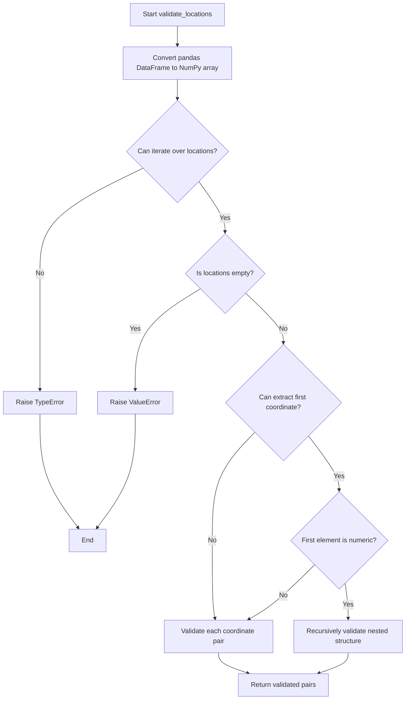
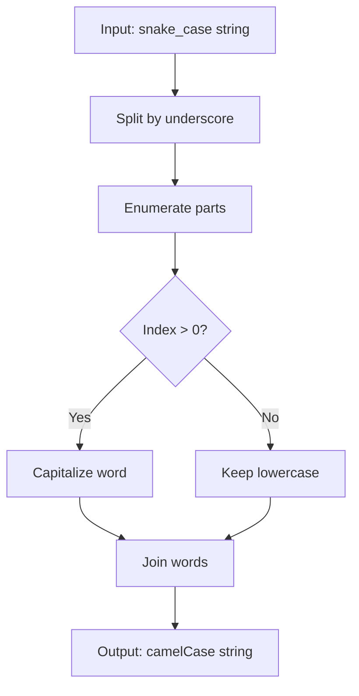
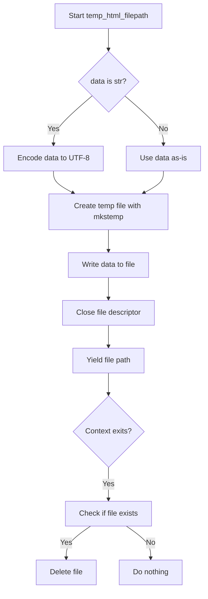
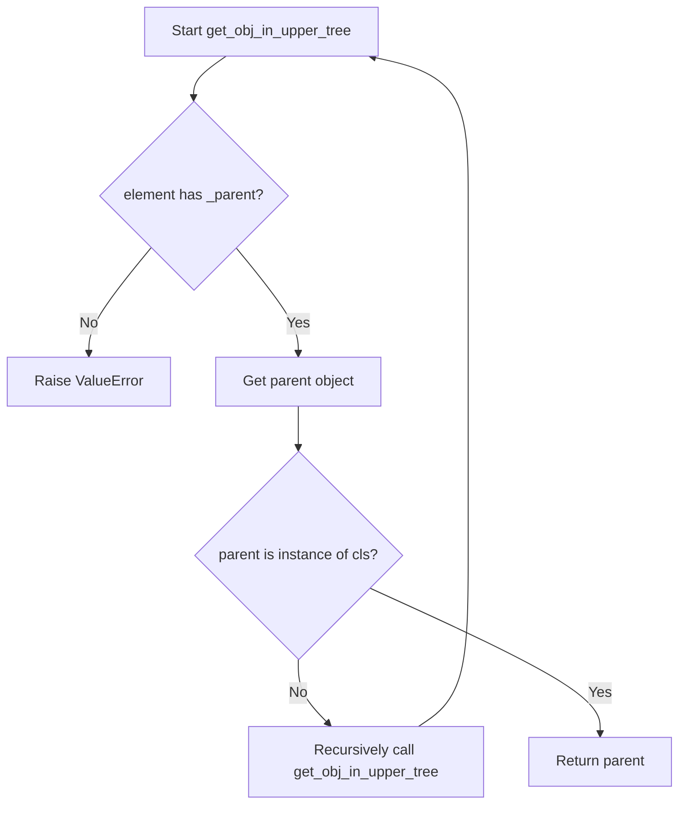
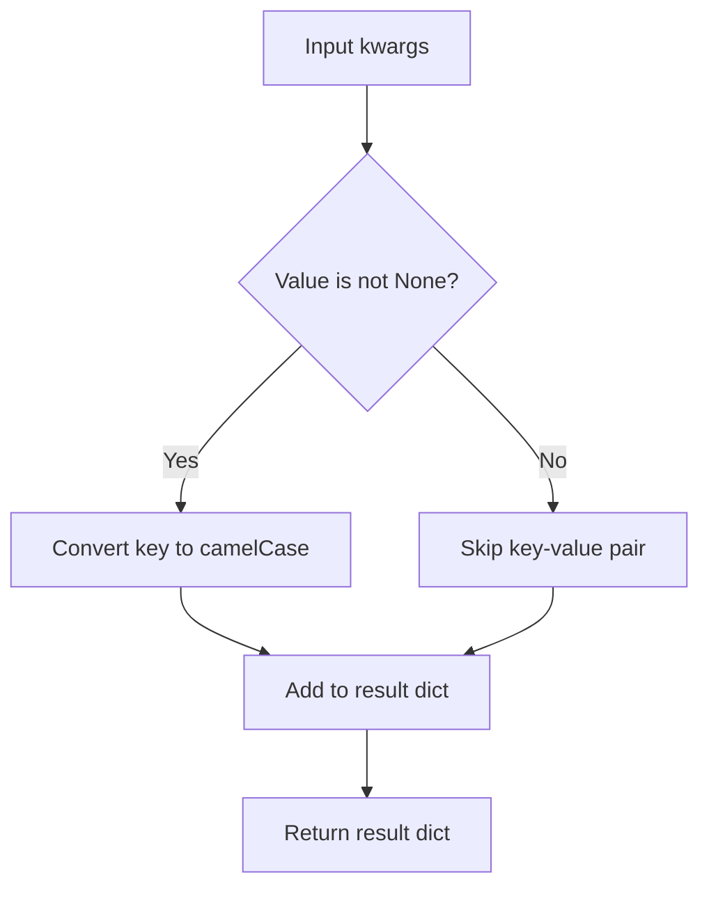
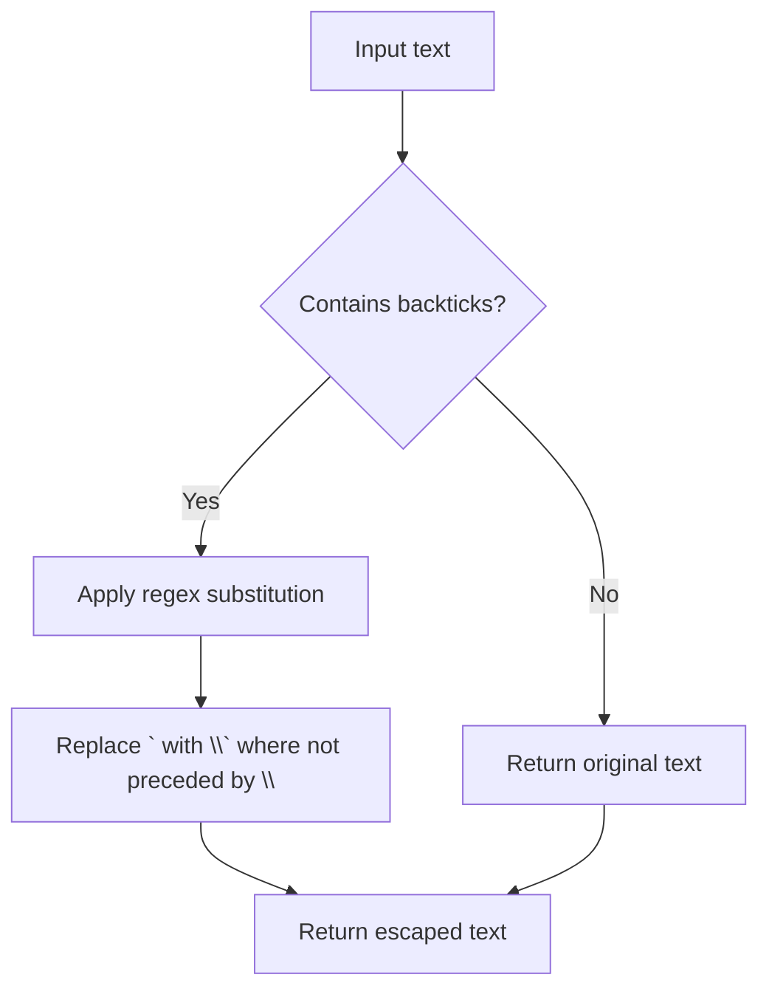

# `utilities.py`

## `folium.utilities.validate_location` · *function*

## Summary:
Validates and converts location coordinates into a standardized list of two floating-point numbers representing latitude and longitude.

## Description:
This function ensures that location data conforms to the expected format of two numerical values (latitude and longitude) and performs necessary type conversions. It handles various input types including NumPy arrays, Pandas DataFrames, lists, tuples, and other iterable objects. The validation process checks for proper length, indexing capability, numerical convertibility, and absence of NaN values.

## Args:
    location (array-like): A sequence containing location coordinates. Can be a list, tuple, NumPy array, or Pandas DataFrame. Expected to contain exactly two elements representing latitude and longitude.

## Returns:
    list[float]: A list containing exactly two floating-point numbers representing validated latitude and longitude values.

## Raises:
    TypeError: If location is not a sized variable or doesn't support indexing.
    ValueError: If location doesn't contain exactly two values or contains non-numerical values.

## Constraints:
    Precondition: The input must be a sequence-like object with at least two elements.
    Postcondition: The returned list contains exactly two float values that represent valid geographic coordinates.

## Side Effects:
    None

## Control Flow:
```mermaid
flowchart TD
    A[Start validate_location] --> B{Is NumPy array?}
    B -- Yes --> C[Convert to list using np.squeeze()]
    B -- No --> D{Has __len__?}
    C --> D
    D -- No --> E[Raise TypeError]
    D -- Yes --> F{Length == 2?}
    E --> G[End]
    F -- No --> H[Raise ValueError]
    F -- Yes --> I[Try indexing location[0], location[1]]
    H --> J[End]
    I -- TypeError/KeyError --> K[Raise TypeError]
    K --> L[End]
    I --> M{Can convert to float?}
    L --> M
    M -- No --> N[Raise ValueError]
    N --> O[End]
    M -- Yes --> P{Is NaN?}
    O --> P
    P -- Yes --> Q[Raise ValueError]
    P -- No --> R[Return [float(location[0]), float(location[1])]]
    Q --> R
```

## Examples:
    >>> validate_location([40.7128, -74.0060])
    [40.7128, -74.006]
    
    >>> validate_location((37.7749, 122.4194))
    [37.7749, 122.4194]
    
    >>> validate_location(np.array([51.5074, 0.1278]))
    [51.5074, 0.1278]
    
    >>> validate_location([40.7128, -74.0060, 100])
    ValueError: Expected two (lat, lon) values for location, instead got: [40.7128, -74.006, 100].
    
    >>> validate_location([40.7128, "invalid"])
    ValueError: Location should consist of two numerical values, but 'invalid' of type <class 'str'> is not convertible to float.

## `folium.utilities.validate_locations` · *function*

## Summary:
Validates nested geographic coordinate data structures and ensures they conform to expected formats for mapping applications.

## Description:
This function recursively validates and processes nested geographic coordinate data, converting pandas DataFrames to NumPy arrays before validation. It handles both flat lists of coordinate pairs and deeply nested structures, ensuring each coordinate pair is properly formatted with latitude and longitude values. The function distinguishes between simple coordinate pairs and nested arrays by attempting to extract numeric values from the deepest level.

The validation logic is extracted into its own function to separate data conversion from validation concerns, enabling reuse across different geographic plotting components in folium while maintaining clean separation of responsibilities.

## Args:
    locations (array-like): A potentially nested structure containing geographic coordinates. Can be a list, tuple, NumPy array, or pandas DataFrame of coordinate pairs. Supports both flat lists like [[lat, lon], [lat, lon]] and nested structures like [[[lat, lon]], [[lat, lon]]].

## Returns:
    list[list[float]]: A list of validated coordinate pairs, where each pair consists of two floating-point numbers representing latitude and longitude. For nested structures, returns the same nesting pattern with validated coordinates.

## Raises:
    TypeError: If locations is not an iterable with coordinate pairs, or if coordinate values cannot be indexed.
    ValueError: If locations is empty or contains invalid coordinate data such as non-numeric values or improperly formatted coordinate pairs.

## Constraints:
    Precondition: Input must be an iterable structure that can contain coordinate pairs.
    Postcondition: All returned coordinate pairs are validated and converted to lists of two floats, preserving the original nesting structure.

## Side Effects:
    None

## Control Flow:


## Examples:
    >>> validate_locations([[40.7128, -74.0060], [37.7749, 122.4194]])
    [[40.7128, -74.006], [37.7749, 122.4194]]
    
    >>> validate_locations([[[40.7128, -74.0060]], [[37.7749, 122.4194]]])
    [[[40.7128, -74.006]], [[37.7749, 122.4194]]]
    
    >>> validate_locations([])
    ValueError: Locations is empty.
    
    >>> validate_locations("invalid")
    TypeError: Locations should be an iterable with coordinate pairs, but instead got 'invalid'.
```

## `folium.utilities.if_pandas_df_convert_to_numpy` · *function*

## Summary:
Converts a pandas DataFrame to its NumPy array representation while leaving other objects unchanged.

## Description:
This utility function checks if the input object is a pandas DataFrame and converts it to its underlying NumPy array representation using the `.values` attribute. If the input is not a DataFrame, it returns the object unchanged. This function is commonly used in folium to ensure compatibility with libraries that expect NumPy arrays rather than pandas DataFrames.

The function performs a safe check for pandas DataFrame instances by verifying that the `pd` module reference is available and that the object is an instance of `pd.DataFrame`.

## Args:
    obj (Any): The input object that may be a pandas DataFrame or any other type.

## Returns:
    Any: If the input is a pandas DataFrame, returns the underlying NumPy array via `.values`. Otherwise, returns the input object unchanged.

## Raises:
    None explicitly raised.

## Constraints:
    - Preconditions: The function assumes that `pd` (pandas) module reference is available in the namespace where this function is called. This is typically satisfied when the function is used within the folium utilities module where pandas is imported as `pd`.
    - Postconditions: The returned value will either be a NumPy array (when input was a DataFrame) or the original input object (when it wasn't a DataFrame).

## Side Effects:
    None.

## Control Flow:
```mermaid
flowchart TD
    A[Input obj] --> B{Is pd not None AND isinstance(obj, pd.DataFrame)?}
    B -- Yes --> C[obj.values]
    B -- No --> D[obj]
    C --> E[Return NumPy array]
    D --> E
```

## Examples:
```python
# Example 1: Converting a DataFrame to NumPy array
import pandas as pd
df = pd.DataFrame([[1, 2], [3, 4]])
result = if_pandas_df_convert_to_numpy(df)
# result is now a NumPy array [[1, 2], [3, 4]]

# Example 2: Passing a non-DataFrame object
data = [1, 2, 3]
result = if_pandas_df_convert_to_numpy(data)
# result remains [1, 2, 3]

# Example 3: Handling None input
result = if_pandas_df_convert_to_numpy(None)
# result remains None
```

## `folium.utilities.image_to_url` · *function*

## Summary:
Converts image data into a base64-encoded data URL for embedding in HTML documents.

## Description:
Transforms various image input formats (file paths, NumPy arrays, or existing data URLs) into a base64-encoded data URL that can be embedded directly in HTML. This enables images to be displayed without requiring separate file storage or network requests. The function handles three distinct input types: file paths to image files, NumPy arrays representing image data, and existing JSON-serializable data structures.

## Args:
    image (str or array-like): Input image data. Can be a file path string, a NumPy array, or a JSON-serializable object.
    colormap (callable, optional): Function that maps scalar values to RGBA tuples for grayscale array conversion. Defaults to None.
    origin (str): Specifies the image origin for array processing. Either "upper" (default) or "lower". If "lower", the image is flipped vertically.

## Returns:
    str: A base64-encoded data URL string suitable for embedding in HTML. Format varies based on input type:
         - File paths: data:image/{format};base64,{base64_encoded_content}
         - NumPy arrays: data:image/png;base64,{base64_encoded_png_content}
         - Other objects: JSON-serialized version of the input with newlines replaced by spaces

## Raises:
    None explicitly raised, though underlying operations may raise exceptions during file I/O or JSON processing.

## Constraints:
    Preconditions:
        - If image is a string, it must either be a valid file path or a valid URL
        - If image is a NumPy array, it must be compatible with write_png function requirements
        - If image is a JSON-serializable object, it must be valid JSON
    Postconditions:
        - Always returns a string
        - Returned string contains no newline characters

## Side Effects:
    - Reads image files from disk when image is a file path string
    - May create temporary files during PNG generation when image is a NumPy array

## Control Flow:
```mermaid
flowchart TD
    A[Start image_to_url] --> B{image is str AND not URL?}
    B -- Yes --> C[Extract file extension]
    C --> D[Open file in binary mode]
    D --> E[Read file content]
    E --> F[Base64 encode content]
    F --> G[Construct data URL with file format]
    B -- No --> H{image class name contains "ndarray"?}
    H -- Yes --> I[Call write_png with params]
    I --> J[Base64 encode PNG bytes]
    J --> K[Construct data URL with PNG format]
    H -- No --> L[JSON serialize then parse image]
    L --> M[Remove newlines from result]
    G --> N[Return URL]
    K --> N
    M --> N
```

## Examples:
    # Convert file path to data URL
    url = image_to_url("path/to/image.png")
    
    # Convert NumPy array to data URL
    import numpy as np
    data = np.array([[0, 128, 255], [255, 128, 0]])
    url = image_to_url(data)
    
    # Convert with custom colormap
    def custom_colormap(x):
        return (x, x, x, 1)
    url = image_to_url(data, colormap=custom_colormap)
    
    # Pass existing data structure
    data_struct = {"type": "image", "url": "existing_url"}
    url = image_to_url(data_struct)

## `folium.utilities._is_url` · *function*

## Summary:
Determines whether a given string is a valid URL by checking if its scheme is in the set of recognized URL schemes.

## Description:
This utility function validates whether a provided string conforms to a URL format by examining its scheme component. It is designed to be a lightweight validation check that handles malformed URLs gracefully by returning False.

## Args:
    url (str): The string to validate as a URL.

## Returns:
    bool: True if the URL has a valid scheme according to _VALID_URLS, False otherwise.

## Raises:
    None explicitly raised, though exceptions during parsing are caught and result in False return.

## Constraints:
    Preconditions:
        - Input must be a string
    Postconditions:
        - Always returns a boolean value
        - Does not modify the input string

## Side Effects:
    None

## Control Flow:
```mermaid
flowchart TD
    A[Input url] --> B{urlparse(url) succeeds?}
    B -- Yes --> C[Get scheme]
    C --> D{scheme in _VALID_URLS?}
    D -- Yes --> E[Return True]
    D -- No --> F[Return False]
    B -- No --> G[Return False]
```

## Examples:
    >>> _is_url("https://example.com")
    True
    >>> _is_url("http://example.com")
    True
    >>> _is_url("ftp://files.example.com")
    True
    >>> _is_url("file:///path/to/file")
    True
    >>> _is_url("not_a_url")
    False
    >>> _is_url("")
    False
```

## `folium.utilities.write_png` · *function*

## Summary:
Converts multi-dimensional array data into a PNG image byte string with optional color mapping and origin adjustment.

## Description:
This function transforms numerical array data into a portable network graphic (PNG) format byte string. It handles various input data formats including grayscale, RGB, and RGBA arrays, applies optional color mapping for grayscale data, normalizes data values to 0-255 range, and supports flipping the image vertically based on the origin parameter. The function is designed to be used internally by folium for creating PNG representations of data visualizations.

## Args:
    data (array-like): Input data that can be 2D (NxM), 3D (NxMx1), NxMx3 (RGB), or NxMx4 (RGBA) representing image pixels.
    origin (str): Specifies the image origin. Either "upper" (default) or "lower". If "lower", the image is flipped vertically.
    colormap (callable, optional): Function that maps scalar values to RGBA tuples. If None, a default grayscale colormap is used.

## Returns:
    bytes: A PNG formatted byte string containing the image data.

## Raises:
    ValueError: If data dimensions are invalid (not NxM, NxMx3, or NxMx4) or if colormap produces invalid color values.

## Constraints:
    Preconditions:
        - Data must be convertible to a numpy array with at least 2 dimensions
        - If colormap is provided, it must map scalar values to sequences of length 3 (RGB) or 4 (RGBA)
        - Data values must be finite numbers for normalization to work properly
    Postconditions:
        - Output is a valid PNG byte string
        - All pixel values are in uint8 format (0-255 range)
        - Image dimensions match the input data dimensions

## Side Effects:
    None

## Control Flow:
```mermaid
flowchart TD
    A[Start write_png] --> B{colormap None?}
    B -- Yes --> C[Set default grayscale colormap]
    B -- No --> D[Use provided colormap]
    C --> E[arr = np.atleast_3d(data)]
    D --> E
    E --> F{data shape validation}
    F -- Invalid --> G[ValueError]
    F -- Valid --> H{nblayers == 1?}
    H -- Yes --> I[Apply colormap to flattened data]
    H -- No --> J[Skip colormap]
    I --> K{colormap result length in [3,4]?}
    K -- No --> L[ValueError]
    K -- Yes --> M[Reshape array]
    J --> M
    M --> N{nblayers == 3?}
    N -- Yes --> O[Add alpha channel with ones]
    N -- No --> P[Skip alpha addition]
    O --> Q[Update nblayers to 4]
    P --> Q
    Q --> R{dtype != uint8?}
    R -- Yes --> S[Normalize data to 0-255 range]
    R -- No --> T[Skip normalization]
    S --> U[Replace inf/nan with 0, cast to uint8]
    T --> U
    U --> V{origin == "lower"?}
    V -- Yes --> W[Flip array vertically]
    V -- No --> X[Keep array as-is]
    W --> Y[Prepare raw data bytes with filter byte]
    X --> Y
    Y --> Z[Pack PNG chunks (IHDR, IDAT, IEND)]
    Z --> AA[Return PNG byte string]
```

## Examples:
    # Create a simple grayscale image
    data = [[0, 128, 255], [255, 128, 0]]
    png_bytes = write_png(data)
    
    # Create an RGB image with custom origin
    rgb_data = [[[255, 0, 0], [0, 255, 0]], [[0, 0, 255], [255, 255, 0]]]
    png_bytes = write_png(rgb_data, origin="lower")
    
    # Create image with custom colormap
    def red_colormap(x):
        return (x, 0, 0, 1)
    data = [[0, 0.5, 1.0]]
    png_bytes = write_png(data, colormap=red_colormap)

## `folium.utilities.mercator_transform` · *function*

## Summary:
Transforms geographic data from latitude-longitude coordinates to Mercator projection coordinates while preserving spatial relationships.

## Description:
This function performs a coordinate transformation that maps geographic data from standard latitude-longitude coordinates to the Mercator projection, which is commonly used in web mapping applications. It handles the non-linear transformation required to convert between these two coordinate systems while maintaining the spatial relationships within the data.

The function is designed to work with multi-dimensional arrays representing geographic data, such as elevation maps, temperature grids, or other spatial datasets. It ensures proper handling of latitude bounds and can adjust the output height to maintain aspect ratio consistency.

## Args:
    data (array-like): Input geographic data that can be converted to a 3D numpy array. This typically represents spatial data with latitude and longitude dimensions.
    lat_bounds (tuple): A tuple containing minimum and maximum latitude values (lat_min, lat_max). These bounds are clamped to the valid Mercator projection range [-85.051128779806589, 85.051128779806589].
    origin (str, optional): Specifies the origin of the coordinate system. If "upper", the data is flipped vertically before processing and restored afterward. Defaults to "upper".
    height_out (int, optional): The desired output height for the transformed data. If None, it defaults to the input height. This allows for resizing the output while maintaining the Mercator projection properties.

## Returns:
    numpy.ndarray: A 3D numpy array containing the transformed data in Mercator projection coordinates. The shape is (height_out, width, nblayers) where height_out is determined by the height_out parameter or defaults to the input height.

## Raises:
    None explicitly raised in the function body.

## Constraints:
    Preconditions:
    - The input data must be convertible to a 3D numpy array
    - Latitude bounds must be valid (within the Mercator projection limits)
    - The origin parameter must be either "upper" or another value that doesn't trigger the flip operation
    
    Postconditions:
    - The returned array has the same number of layers as the input data
    - All latitude values in the output are properly transformed using the Mercator projection formula
    - The spatial relationships within the data are preserved according to the Mercator projection
    - The output maintains the same width and number of layers as the input

## Side Effects:
    None.

## Control Flow:
    ```mermaid
    flowchart TD
        A[Start mercator_transform] --> B{data to 3D array}
        B --> C{origin == "upper"}
        C -->|True| D[Flip array vertically]
        D --> E[Calculate lat_min, lat_max with clamping]
        E --> F{height_out is None}
        F -->|True| G[Set height_out = height]
        F -->|False| H[Use height_out as-is]
        H --> I[Calculate lats and latslats using Mercator transform]
        I --> J[Initialize output array]
        J --> K[Loop over width dimension]
        K --> L[Loop over nblayers]
        L --> M[Interpolate data using Mercator transformation]
        M --> N[Restore vertical orientation if needed]
        N --> O[Return transformed data]
    ```

## Examples:
    # Transform elevation data with specific latitude bounds
    elevation_data = [[100, 150, 200], [120, 180, 220], [140, 200, 240]]
    result = mercator_transform(elevation_data, (-45, 45))
    
    # Transform with custom output height
    result = mercator_transform(elevation_data, (-60, 60), height_out=100)
    
    # Transform with different origin
    result = mercator_transform(elevation_data, (-30, 30), origin="lower")

## `folium.utilities.none_min` · *function*

## Summary:
Returns the minimum of two values, treating None as a special case that defaults to the other value.

## Description:
This utility function computes the minimum of two comparable values while handling None values gracefully. When one of the inputs is None, it returns the other value instead of raising an error. This is particularly useful in scenarios where data might be missing or undefined, allowing for safe comparisons without explicit None checks elsewhere in the code.

## Args:
    x (Any): First value to compare, can be None
    y (Any): Second value to compare, can be None

## Returns:
    Any: The smaller of the two values, or the non-None value if one is None. If both are None, returns None.

## Raises:
    TypeError: If both values are non-None but not comparable (e.g., comparing str and int)

## Constraints:
    Preconditions: Both arguments must be comparable if neither is None
    Postconditions: Returns either x, y, or min(x, y) depending on None status

## Side Effects:
    None

## Control Flow:
```mermaid
flowchart TD
    A[none_min(x,y)] --> B{x is None?}
    B -->|Yes| C{y is None?}
    C -->|Yes| D[Return None]
    C -->|No| E[Return y]
    B -->|No| F{y is None?}
    F -->|Yes| G[Return x]
    F -->|No| H[Return min(x,y)]
```

## Examples:
    >>> none_min(5, 3)
    3
    >>> none_min(None, 5)
    5
    >>> none_min(5, None)
    5
    >>> none_min(None, None)
    None
    >>> none_min('a', 'b')
    'a'

## `folium.utilities.none_max` · *function*

## Summary:
Returns the maximum of two values, treating None as less than any non-None value.

## Description:
This function compares two values and returns the larger one, with special handling for None values. When one argument is None, it returns the other argument. When both arguments are None, it returns None. This utility is commonly used in scenarios where numerical comparisons need to account for missing or undefined values.

## Args:
    x (Any): First value to compare, can be None or any comparable type
    y (Any): Second value to compare, can be None or any comparable type

## Returns:
    Any: The maximum of x and y, or the non-None value if one is None, or None if both are None

## Raises:
    TypeError: If both x and y are non-None but not comparable (e.g., int vs str)

## Constraints:
    Preconditions: Both arguments must be comparable if neither is None
    Postconditions: Returns the mathematical maximum when both values are non-None, or the non-None value when one is None

## Side Effects:
    None

## Control Flow:
```mermaid
flowchart TD
    A[none_max(x,y)] --> B{x is None?}
    B -->|Yes| C{y is None?}
    C -->|Yes| D[Return None]
    C -->|No| E[Return y]
    B -->|No| F{y is None?}
    F -->|Yes| G[Return x]
    F -->|No| H[Return max(x,y)]
```

## Examples:
    >>> none_max(5, 3)
    5
    >>> none_max(None, 3)
    3
    >>> none_max(5, None)
    5
    >>> none_max(None, None)
    None
    >>> none_max('a', 'b')
    'b'

## `folium.utilities.iter_coords` · *function*

## Summary:
Generates coordinate tuples from GeoJSON-like objects by recursively traversing nested coordinate structures.

## Description:
Extracts coordinate data from various GeoJSON formats and yields individual coordinate tuples. This function serves as a utility for processing geographic data structures, normalizing different coordinate representations into a consistent iterable format. It handles multiple GeoJSON object types including FeatureCollections, Features, and Geometry objects, making it suitable for mapping and visualization applications.

## Args:
    obj (any): A GeoJSON-like object that may contain coordinates in various formats. Can be a list/tuple of coordinates, a dictionary with geometry information, or a raw coordinates array.

## Returns:
    generator: A generator yielding coordinate tuples representing geographic points. Each yielded item is a tuple of numeric coordinate values. For simple coordinate lists, it yields each coordinate pair as a tuple. For nested structures, it recursively processes elements.

## Raises:
    None explicitly raised, though underlying operations may raise standard Python exceptions like TypeError or KeyError if the input structure is malformed.

## Constraints:
    Preconditions:
    - Input object must be a valid GeoJSON-like structure or compatible coordinate container
    - Coordinate values must be numeric (int or float) for proper tuple generation
    
    Postconditions:
    - Generator will yield only coordinate tuples (tuples of numbers)
    - Function handles nested structures recursively
    - Returns empty generator for invalid or empty coordinate structures

## Side Effects:
    None

## Control Flow:
```mermaid
flowchart TD
    A[Start iter_coords] --> B{isinstance(obj, (tuple,list))?}
    B -- Yes --> C[coords = obj]
    B -- No --> D{features in obj?}
    D -- Yes --> E[coords = [geom["geometry"]["coordinates"] for geom in obj["features"]]]
    D -- No --> F{geometry in obj?}
    F -- Yes --> G[coords = obj["geometry"]["coordinates"]]
    F -- No --> H{geometries in obj AND coordinates in obj["geometries"][0]?}
    H -- Yes --> I[coords = obj["geometries"][0]["coordinates"]]
    H -- No --> J[coords = obj.get("coordinates", obj)]
    J --> K[for coord in coords:]
    K --> L{isinstance(coord, (float,int))?}
    L -- Yes --> M[yield tuple(coords); break]
    L -- No --> N[yield from iter_coords(coord)]
```

## Examples:
    >>> list(iter_coords([[1, 2], [3, 4]]))
    [(1, 2), (3, 4)]
    
    >>> list(iter_coords({"geometry": {"coordinates": [[1, 2], [3, 4]]}}))
    [(1, 2), (3, 4)]
    
    >>> list(iter_coords({"features": [{"geometry": {"coordinates": [[1, 2], [3, 4]]}}]}))
    [(1, 2), (3, 4)]
    
    >>> list(iter_coords([[[1, 2], [3, 4]], [[5, 6], [7, 8]]]))
    [(1, 2), (3, 4), (5, 6), (7, 8)]

## `folium.utilities._locations_mirror` · *function*

## Summary:
Reverses the order of elements in nested iterable structures, commonly used for coordinate transformations between [latitude, longitude] and [longitude, latitude] formats.

## Description:
This utility function reverses the order of elements in iterable objects, particularly useful for geographic coordinate transformations. It recursively processes nested data structures to swap the order of elements at the deepest level while maintaining the overall structure. The function is designed to handle mixed data types and nested iterables gracefully.

## Args:
    x: Any object that may be iterable. Can be a scalar value, list, tuple, or nested structure of these types.

## Returns:
    - If x is not iterable: returns x unchanged
    - If x is iterable but x[0] is not iterable: returns list(x[::-1]) (reversed copy)
    - If x is iterable and x[0] is iterable: recursively applies _locations_mirror to each element and returns list of results

## Raises:
    IndexError: When x is an empty iterable or when accessing x[0] on an empty iterable

## Constraints:
    - Preconditions: x must be hashable or iterable
    - Postconditions: The returned structure maintains the same nesting levels as input, but innermost iterables are reversed

## Side Effects:
    None

## Control Flow:
```mermaid
flowchart TD
    A[Input x] --> B{hasattr(x,"__iter__")}?
    B -- Yes --> C{hasattr(x[0],"__iter__")}?
    C -- Yes --> D[map(_locations_mirror, x)]
    D --> E[return list(...)]
    C -- No --> F[x[::-1]]
    F --> G[return list(...)]
    B -- No --> H[return x]
```

## Examples:
    >>> _locations_mirror([1, 2, 3])
    [3, 2, 1]
    
    >>> _locations_mirror([[1, 2], [3, 4]])
    [[2, 1], [4, 3]]
    
    >>> _locations_mirror(42)
    42
    
    >>> _locations_mirror([])
    []
    
    # Typical geographic coordinate use case
    >>> _locations_mirror([[40.7128, -74.0060], [34.0522, -118.2437]])
    [[-74.0060, 40.7128], [-118.2437, 34.0522]]
```

## `folium.utilities.get_bounds` · *function*

## Summary:
Computes the bounding box coordinates that encompass all provided geographic points.

## Description:
Calculates the minimum and maximum latitude/longitude values from a collection of geographic coordinates to determine the spatial extent. This function is used to establish map view boundaries or determine the geographic scope of a set of locations. The function handles various input formats through the `iter_coords` utility and provides optional coordinate system transformation.

## Args:
    locations (any): A GeoJSON-like object containing geographic coordinates. Can be a list of coordinate pairs, a dictionary with geometry information, or other supported coordinate structures.
    lonlat (bool): Flag indicating whether to transform coordinates from [latitude, longitude] to [longitude, latitude] format. Defaults to False.

## Returns:
    list[list[float | None]]: A nested list representing the bounding box with format [[min_lat, min_lon], [max_lat, max_lon]]. Each coordinate can be None if no valid coordinates are provided.

## Raises:
    None explicitly raised, though underlying functions may raise standard Python exceptions for malformed inputs.

## Constraints:
    Preconditions:
    - Input locations must be a valid GeoJSON-like structure or compatible coordinate container
    - Coordinate values must be numeric (int or float) for proper bounding box calculation
    
    Postconditions:
    - Returns a list of exactly two lists, each containing two numeric values or None
    - The result represents a valid bounding box with min/max coordinates

## Side Effects:
    None

## Control Flow:
```mermaid
flowchart TD
    A[get_bounds(locations, lonlat=False)] --> B[Initialize bounds = [[None, None], [None, None]]]
    B --> C[for point in iter_coords(locations):]
    C --> D[Update bounds with none_min/none_max]
    D --> E{lonlat?}
    E -- Yes --> F[_locations_mirror(bounds)]
    E -- No --> G[Return bounds]
    F --> G
```

## Examples:
    >>> get_bounds([[1, 2], [3, 4]])
    [[1, 2], [3, 4]]
    
    >>> get_bounds([[1, 2], [3, 4], [0, 1]])
    [[0, 1], [3, 4]]
    
    >>> get_bounds({"geometry": {"coordinates": [[1, 2], [3, 4]]}}, lonlat=True)
    [[[2, 1], [4, 3]]]
```

## `folium.utilities.camelize` · *function*

## Summary:
Converts a snake_case string to camelCase format by capitalizing words after the first word and removing underscores.

## Description:
This function transforms identifiers from snake_case convention (words separated by underscores) to camelCase convention (first word lowercase, subsequent words capitalized). It is commonly used in JavaScript/JSON contexts where camelCase naming is preferred over snake_case.

## Args:
    key (str): A string in snake_case format that needs to be converted to camelCase.

## Returns:
    str: The input string converted to camelCase format.

## Raises:
    None

## Constraints:
    - Precondition: The input must be a string.
    - Postcondition: The returned string will have the first letter of the first word in lowercase and subsequent words capitalized, with all underscores removed.

## Side Effects:
    None

## Control Flow:


## Examples:
    >>> camelize("foo_bar_baz")
    'fooBarBaz'
    
    >>> camelize("hello_world")
    'helloWorld'
    
    >>> camelize("single")
    'single'
    
    >>> camelize("a_b_c_d_e")
    'aBCDE'
    
    >>> camelize("")
    ''
```

## `folium.utilities._parse_size` · *function*

## Summary:
Parses a size value into a numeric amount and its unit type (pixels or percentage).

## Description:
Converts a size specification into a standardized tuple of (value, unit_type) where the unit type is either "px" for pixels or "%" for percentages. This utility function handles both numeric inputs (interpreted as pixels) and string inputs with percentage suffixes.

## Args:
    value (int, float, or str): Size specification that can be either a numeric value (interpreted as pixels) or a string ending with '%' (interpreted as percentage).

## Returns:
    tuple[float, str]: A tuple containing the parsed numeric value and its unit type ('px' or '%').

## Raises:
    ValueError: When the input value cannot be parsed according to the expected format.

## Constraints:
    - Precondition: Input must be either a numeric type (int or float) or a string ending with '%' character.
    - Postcondition: Returned value is always a positive number for pixel units and a number between 0 and 100 for percentage units.

## Side Effects:
    None

## Control Flow:
```mermaid
flowchart TD
    A[Start _parse_size] --> B{Is value numeric?}
    B -- Yes --> C[Set value_type = "px"]
    C --> D[Convert value to float]
    D --> E[Assert value > 0]
    E --> F[Return (value, "px")]
    B -- No --> G[Set value_type = "%"]
    G --> H[Strip '%' from value]
    H --> I[Convert stripped value to float]
    I --> J[Assert 0 <= value <= 100]
    J --> K[Return (value, "%")]
    K --> L[End]
    E --> L
    J --> L
    B -- Exception --> M[Raise ValueError]
```

## Examples:
    >>> _parse_size(100)
    (100.0, 'px')
    
    >>> _parse_size("50%")
    (50.0, '%')
    
    >>> _parse_size("100%")
    (100.0, '%')
    
    >>> _parse_size(0)
    ValueError: Cannot parse value 0 as 'px'
    
    >>> _parse_size("-10")
    ValueError: Cannot parse value -10 as 'px'
    
    >>> _parse_size("150%")
    ValueError: Cannot parse value 150.0 as '%'
    
    >>> _parse_size("abc%")
    ValueError: Cannot parse value 'abc' as '%'

## `folium.utilities.compare_rendered` · *function*

## Summary:
Compares two objects for equality after normalizing their string representations.

## Description:
This function performs a deep comparison of two objects by first normalizing their string representations using the normalize utility function, then comparing the normalized results for equality. It is primarily used to compare rendered map elements that may have different string formatting but represent the same content.

The function is called by various testing and validation components within the folium library that need to verify the consistency of rendered map elements. It ensures that differences in whitespace, punctuation, or other formatting artifacts don't cause false negatives in equality comparisons.

## Args:
    obj1 (Any): First object to compare. Typically a string or object that can be converted to a string.
    obj2 (Any): Second object to compare. Typically a string or object that can be converted to a string.

## Returns:
    bool: True if the normalized representations of both objects are equal, False otherwise.

## Raises:
    None explicitly raised.

## Constraints:
    Preconditions:
        - Both arguments can be converted to strings for normalization
        - The normalize function handles falsy values appropriately
    
    Postconditions:
        - The comparison is order-independent for string representations
        - Formatting differences in whitespace and punctuation are normalized out

## Side Effects:
    None.

## Control Flow:
```mermaid
flowchart TD
    A[Start compare_rendered] --> B[Call normalize(obj1)]
    B --> C[Call normalize(obj2)]
    C --> D[Compare normalized results]
    D --> E{Equal?}
    E -- Yes --> F[Return True]
    E -- No --> G[Return False]
```

## Examples:
    >>> compare_rendered("Hello   world", "Hello world")
    True
    
    >>> compare_rendered("It's a beautiful day...", "It's a beautiful day.")
    True
    
    >>> compare_rendered("Price: $100 – $200", "Price: $100 - $200")
    True
    
    >>> compare_rendered("Different", "Content")
    False
```

## `folium.utilities.normalize` · *function*

## Summary:
Normalizes whitespace and punctuation in text strings for consistent formatting.

## Description:
This function processes text input to standardize spacing and punctuation, removing extra whitespace and normalizing various Unicode punctuation characters to ASCII equivalents. It is designed to clean up text that may have inconsistent formatting, particularly when dealing with HTML or markdown content that has been rendered.

The function is called by various components in the folium library that process text content for display in maps, such as popup content, tooltips, and labels. It helps ensure consistent rendering regardless of the source format of the text.

## Args:
    rendered (str or None): The text string to normalize. May be None or empty string.

## Returns:
    str or None: The normalized text string, or the original value if it was falsy (None, empty string, etc.). Whitespace is collapsed and punctuation is standardized.

## Raises:
    None explicitly raised.

## Constraints:
    Preconditions:
        - Input should be a string or None
        - Function handles falsy values gracefully
    
    Postconditions:
        - All consecutive whitespace characters are reduced to single spaces
        - Unicode dashes (–, —) are converted to ASCII hyphens (-)
        - Ellipsis (...) is converted to single period (.)
        - Punctuation marks (.,:;!?}) followed by whitespace are stripped of the preceding space
        - Punctuation marks preceded by whitespace are stripped of the following space
        - Punctuation marks followed by letters have a space inserted between them

## Side Effects:
    None.

## Control Flow:
```mermaid
flowchart TD
    A[Start normalize] --> B{rendered is falsy?}
    B -- Yes --> C[Return rendered]
    B -- No --> D[Join whitespace]
    D --> E[Replace "" with "]
    E --> F[Replace '' with ']
    F --> G[Replace – with -]
    G --> H[Replace — with -]
    H --> I[Replace ... with .]
    I --> J[Remove extra spaces before punctuation]
    J --> K[Remove extra spaces after punctuation]
    K --> L[Insert space before letter after punctuation]
    L --> M[Strip leading/trailing whitespace]
    M --> N[Return result]
```

## Examples:
    >>> normalize("Hello   world")
    'Hello world'
    
    >>> normalize("It's a beautiful day...")
    "It's a beautiful day."
    
    >>> normalize("Price: $100 – $200")
    "Price: $100 - $200"
    
    >>> normalize(None)
    None

## `folium.utilities.temp_html_filepath` · *function*

## Summary:
Creates a temporary HTML file with specified content and provides its path within a context manager for safe temporary file handling.

## Description:
This function generates a temporary HTML file using Python's `tempfile.mkstemp()` to create a unique file path. It writes either string or binary data to this file and yields the file path for use within a context manager. The file is automatically cleaned up after use, ensuring no temporary files remain on the filesystem. This function is designed to be used as a context manager with a `with` statement and follows the pattern of a generator-based context manager.

## Args:
    data (str or bytes): The HTML content to write to the temporary file. If a string is provided, it will be encoded to UTF-8 before writing.

## Returns:
    Generator[str]: A context manager that yields the absolute path to the created temporary HTML file.

## Raises:
    OSError: Raised by underlying OS operations during file creation or writing processes.

## Constraints:
    Precondition: The `data` argument must be either a string or bytes object.
    Postcondition: The returned file path points to a valid temporary HTML file that will be deleted upon exiting the context.

## Side Effects:
    - Creates a temporary file on the filesystem
    - Writes data to the temporary file
    - Deletes the temporary file when exiting the context

## Control Flow:


## Examples:
```python
# Basic usage with string data
html_content = "<html><body>Hello World</body></html>"
with temp_html_filepath(html_content) as filepath:
    print(f"Temporary file created at: {filepath}")
    # File is automatically deleted after this block

# Usage with binary data
binary_html = b"<html><body>Hello Binary</body></html>"
with temp_html_filepath(binary_html) as filepath:
    # Process the temporary file
    pass
```

## `folium.utilities.deep_copy` · *function*

## Summary:
Creates a shallow copy of an object and recursively copies its child elements while maintaining parent-child relationships.

## Description:
This function performs a deep copy operation on objects that have a `_children` attribute, ensuring that all nested child objects are also duplicated. It assigns a new unique identifier to the copied object and properly establishes parent-child relationships in the copied hierarchy. This function is particularly useful for creating independent copies of map objects and their components in the Folium library.

## Args:
    item_original (Any): The original object to be copied. Must support `copy.copy()` and have a `_children` attribute that is either None, empty, or contains child objects.

## Returns:
    Any: A copy of the original object with a new UUID assigned to its `_id` attribute and properly linked child objects.

## Raises:
    AttributeError: If the item_original does not have a `_children` attribute and the hasattr check fails, or if child objects don't have a `get_name()` method.

## Constraints:
    Preconditions:
        - The item_original must be an object that supports the `copy.copy()` operation.
        - The item_original must have a `_children` attribute that is either None, empty, or a dictionary-like structure.
        - The item_original must have a `get_name()` method if it has children.
        
    Postconditions:
        - The returned object is a copy of the original with a new `_id` value.
        - All child objects are recursively copied with proper parent references.
        - Parent-child relationships are maintained in the copied hierarchy.

## Side Effects:
    - Generates a new UUID for the copied object via `uuid.uuid4().hex`.
    - Modifies the `_children` attribute of the copied object to contain new instances of child objects.
    - Sets the `_parent` attribute of each child object to point to the copied parent object.

## Control Flow:
```mermaid
flowchart TD
    A[Start deep_copy] --> B{item_original has _children?}
    B -- Yes --> C{len(_children) > 0?}
    C -- Yes --> D[Initialize children_new]
    D --> E[Iterate through _children.values()]
    E --> F[deep_copy(subitem_original)]
    F --> G[Set subitem._parent = item]
    G --> H[Add to children_new with get_name()]
    H --> I[Assign children_new to item._children]
    I --> J[Return item]
    C -- No --> J
    B -- No --> J
```

## Examples:
    # Basic usage with an object that has children
    original_obj = SomeMapObject()
    copied_obj = deep_copy(original_obj)
    
    # The copied object has a new ID
    assert copied_obj._id != original_obj._id
    
    # Child objects are also copied with proper parent references
    assert copied_obj._children['child_name']._parent == copied_obj

## `folium.utilities.get_obj_in_upper_tree` · *function*

## Summary:
Finds and returns the nearest ancestor object of a specified type in the object hierarchy tree.

## Description:
This function traverses upward through the parent-child relationship in a hierarchical object structure to locate the first ancestor that matches the specified class type. It is commonly used in folium's map rendering system to find container objects like Map, Layer, or Feature objects from nested child elements.

## Args:
    element: The starting object in the hierarchy tree
    cls: The class type to search for among parent objects

## Returns:
    The first parent object in the hierarchy that is an instance of the specified class, or raises a ValueError if no such parent exists.

## Raises:
    ValueError: When reaching the top of the tree without finding an ancestor of the specified class type

## Constraints:
    Precondition: The element must have a `_parent` attribute to begin traversal
    Postcondition: Either returns a parent object of the specified class type, or raises ValueError

## Side Effects:
    None

## Control Flow:


## Examples:
```python
# Find the Map object containing a marker
marker = folium.Marker([0, 0])
map_obj = get_obj_in_upper_tree(marker, folium.Map)

# Find the Layer object containing a feature
feature = folium.GeoJson(data)
layer_obj = get_obj_in_upper_tree(feature, folium.Layer)
```

## `folium.utilities.parse_options` · *function*

## Summary:
Converts keyword arguments to a dictionary with camelCase keys while filtering out None values.

## Description:
Processes keyword arguments by converting their keys from snake_case to camelCase format using the camelize utility function, and excludes any key-value pairs where the value is None. This function serves as a standardized way to prepare options for JavaScript-based libraries that expect camelCase property names.

## Args:
    **kwargs: Arbitrary keyword arguments with snake_case keys that may have None values.

## Returns:
    dict: A dictionary with camelCase keys and their corresponding non-None values.

## Raises:
    None

## Constraints:
    - Precondition: All keyword argument keys must be strings.
    - Postcondition: The returned dictionary will only contain entries where the original value was not None.

## Side Effects:
    None

## Control Flow:


## Examples:
    >>> parse_options(title="My Map", zoom_start=10, control_scale=True)
    {'title': 'My Map', 'zoomStart': 10, 'controlScale': True}
    
    >>> parse_options(lat=40.7128, lng=-74.0060, popup=None)
    {'lat': 40.7128, 'lng': -74.006}
    
    >>> parse_options()
    {}

## `folium.utilities.escape_backticks` · *function*

## Summary:
Escapes backtick characters in text by prepending a backslash, except for those already escaped with a backslash.

## Description:
This function processes a string to escape backtick characters (`) that are not already preceded by a backslash. It is designed to prepare text for contexts where backticks have special meaning, such as Markdown formatting or code blocks. The function ensures that backticks are properly escaped while preserving existing escaped backticks.

## Args:
    text (str): The input string containing backtick characters to be escaped.

## Returns:
    str: A new string with unescaped backticks escaped by prepending a backslash.

## Raises:
    None

## Constraints:
    - Preconditions: The input must be a string.
    - Postconditions: The returned string will have all unescaped backticks escaped.

## Side Effects:
    None

## Control Flow:


## Examples:
    >>> escape_backticks("This is `code`")
    'This is \\`code\\`'
    
    >>> escape_backticks("Already \\`escaped\\`")
    'Already \\`escaped\\`'
    
    >>> escape_backticks("No backticks here")
    'No backticks here'
    
    >>> escape_backticks("`start` and `end`")
    '\\`start\\` and \\`end\\`'
    
    >>> escape_backticks("Mixed `back` and \\`escaped\\` backticks")
    '\\`Mixed \\`back\\` and \\`escaped\\` backticks\\`'

## `folium.utilities.escape_double_quotes` · *function*

## Summary:
Escapes double quotation marks in text by replacing them with backslash-escaped versions.

## Description:
This function takes a string input and replaces all occurrences of double quotation marks (`"`) with their escaped version (`\"`). It is commonly used when preparing text for inclusion in HTML attributes or JSON strings where unescaped quotes could break parsing.

The function is extracted into its own utility to provide a reusable mechanism for quote escaping across different parts of the folium codebase, ensuring consistent handling of string escaping without duplicating the replacement logic.

## Args:
    text (str): The input string that may contain unescaped double quotation marks.

## Returns:
    str: A new string with all double quotation marks replaced by backslash-escaped versions.

## Raises:
    None: This function does not raise any exceptions.

## Constraints:
    Preconditions:
        - The input `text` must be a string type.
    Postconditions:
        - The returned string will have all `"` characters replaced with `\"`.
        - The original input string remains unchanged (immutable operation).

## Side Effects:
    None: This function has no side effects beyond returning a transformed string.

## Control Flow:
```mermaid
flowchart TD
    A[Start escape_double_quotes] --> B{Input text is str?}
    B -- No --> C[Return text unchanged]
    B -- Yes --> D[Replace " with \\"]
    D --> E[Return escaped string]
```

## Examples:
    >>> escape_double_quotes('He said "Hello"')
    'He said \\"Hello\\"'
    
    >>> escape_double_quotes('A "quote" in text')
    'A \\"quote\\" in text'
    
    >>> escape_double_quotes("No quotes here")
    'No quotes here'
```

## `folium.utilities.javascript_identifier_path_to_array_notation` · *function*

## Summary:
Converts a JavaScript dot-notation path into array bracket notation with proper escaping.

## Description:
Transforms a string path using dot notation (e.g., "property.subproperty") into JavaScript array notation (e.g., ["property"]["subproperty"]) while properly escaping any double quotes in the identifiers. This conversion is useful for generating valid JavaScript expressions that can safely reference nested object properties.

The function is extracted into its own utility to provide a reusable mechanism for converting path notation, ensuring consistent transformation across different parts of the folium codebase without duplicating the conversion logic.

## Args:
    path (str): A dot-notation string representing a path to a nested property (e.g., "foo.bar.baz").

## Returns:
    str: A JavaScript expression using bracket notation for accessing nested properties, with proper escaping of identifiers.

## Raises:
    None: This function does not raise any exceptions.

## Constraints:
    Preconditions:
        - The input `path` must be a string type.
    Postconditions:
        - The returned string will be a valid JavaScript expression using bracket notation.
        - All identifiers in the path will have double quotes properly escaped.

## Side Effects:
    None: This function has no side effects beyond returning a transformed string.

## Control Flow:
```mermaid
flowchart TD
    A[Start javascript_identifier_path_to_array_notation] --> B[Split path by "."]
    B --> C[For each identifier x in split path]
    C --> D{Escape double quotes in x}
    D --> E[Format as ["{escaped_x}"]
    E --> F[Join all formatted elements]
    F --> G[Return joined result]
```

## Examples:
    >>> javascript_identifier_path_to_array_notation("foo.bar")
    '["foo"]["bar"]'
    
    >>> javascript_identifier_path_to_array_notation("a.b.c")
    '["a"]["b"]["c"]'
    
    >>> javascript_identifier_path_to_array_notation('foo."bar".baz')
    '["foo"][\\"bar\\"]["baz"]'

