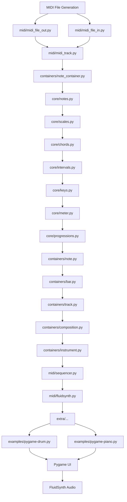

# `mingus`

## Repository-Level Documentation

### Tree
```
mingus/
├── mingus/                 # Core music processing library
│   ├── containers/         # Musical data structures (notes, bars, tracks, compositions)
│   ├── core/               # Musical theory concepts (notes, scales, chords, intervals, meters)
│   ├── midi/               # MIDI sequencing, playback, and file I/O with platform-specific implementations
│   └── extra/              # Additional utilities and experimental features
├── mingus_examples/        # Example interactive musical applications
│   ├── pygame-drum/        # Visual drum sequencer with audio playback
│   └── pygame-piano/       # Piano keyboard with chord detection and visualization
└── scripts/                # Documentation generation tools
    └── api_doc_generator.py # Auto-generates Sphinx-compatible API documentation
```

### Purpose
The mingus repository provides a comprehensive music processing framework that enables the creation, manipulation, and playback of musical compositions. It serves as a foundation for building music-related applications, from simple MIDI file generators to complex composition tools and educational software.

Target users include:
- Music software developers building MIDI-based applications
- Educational institutions teaching music theory and composition
- Researchers working with musical data structures and algorithms
- Interactive music application creators using Pygame and similar frameworks

The system is positioned as a standalone Python library that can be integrated into larger applications or used independently for music processing tasks.

### Architecture


Key architectural patterns:
- **Modular Design**: Clear separation between musical theory (core), data structures (containers), and MIDI operations (midi)
- **Cross-Platform MIDI**: Platform-specific implementations in midi/ directory with unified interface
- **Data Flow Pipeline**: Musical data flows from basic notes → containers → tracks → compositions
- **Plugin Architecture**: Extra module allows extension of core functionality

### Entry Points
#### CLI Commands
- `python scripts/api_doc_generator.py <output_dir>`: Generates Sphinx-compatible API documentation for all core modules

#### Importable APIs
- `mingus.containers.*`: Musical data structures and their manipulation
- `mingus.core.*`: Musical theory computations and representations  
- `mingus.midi.*`: MIDI playback and file handling interfaces
- `mingus.extra.*`: Additional utility functions and experimental features

#### Service Endpoints
None directly exposed; intended for library integration in larger applications

### Core Features
1. **Musical Data Structures**: Notes, bars, tracks, compositions with proper ordering and validation
2. **Music Theory Concepts**: Scales, chords, intervals, keys, meters, and progressions
3. **MIDI Playback & File I/O**: Cross-platform MIDI sequencing and file handling
4. **Interactive Examples**: Pygame-based drum sequencer and piano keyboard applications
5. **Documentation Generation**: Automated API documentation for library maintenance

### Dependencies
- **Internal**: Cross-module references between containers, core, and midi
- **External**: Standard Python libraries, platform-specific MIDI libraries (fluidsynth, win32midi)
- **Version Requirements**: Python 3.x compatible, specific MIDI libraries for platform support

### Configuration
No configuration files or environment variables required for basic operation. Runtime parameters are passed through function arguments.

### Extension Points
- **Plugins**: Add new modules to `mingus.extra/` for experimental features
- **MIDI Backends**: Implement new platform-specific MIDI drivers in `mingus.midi/`
- **Data Structures**: Extend container classes to add new musical data types
- **Theory Extensions**: Add new core modules for additional music theory concepts

---

## Modules

- [`mingus`](mingus.md)
- [`mingus/containers`](mingus/containers.md)
- [`mingus/core`](mingus/core.md)
- [`mingus/extra`](mingus/extra.md)
- [`mingus/midi`](mingus/midi.md)
- [`mingus_examples`](mingus_examples.md)
- [`mingus_examples/pygame-drum`](mingus_examples/pygame-drum.md)
- [`mingus_examples/pygame-piano`](mingus_examples/pygame-piano.md)
- [`scripts`](scripts.md)

