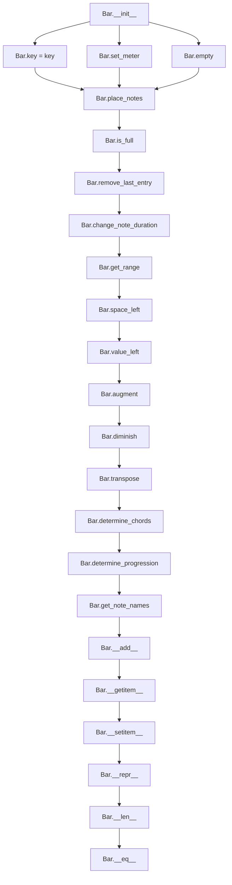

# `bar.py`

## `mingus.containers.bar.Bar` · *class*

## Summary:
Represents a musical bar (measure) with a specific key and meter, capable of holding musical notes and managing rhythmic placement.

## Description:
The Bar class serves as a container for musical notes arranged within a specific rhythmic framework defined by key and meter. It manages the placement of notes according to beat durations, maintains a record of musical events, and provides methods for manipulating and analyzing the musical content within the bar. This abstraction allows for structured musical composition and analysis by enforcing rhythmic constraints and providing convenient methods for musical operations.

## State:
- key (keys.Key): The musical key of the bar, determining the tonal context for note interpretation. Default is "C".
- meter (tuple): The meter of the bar represented as (beats_per_measure, beat_unit). Default is (4, 4).
- current_beat (float): The current position within the bar in beat units. Starts at 0.0.
- length (float): The total length of the bar in beat units. Calculated from meter as beats_per_measure * (1.0 / beat_unit).
- bar (list): A list of musical entries, each entry being [beat_position, duration, note_container].

## Lifecycle:
- Creation: Instantiate with optional key and meter parameters. The constructor initializes the key as a keys.Key object, sets the meter, and empties the bar.
- Usage: Place notes using various methods like place_notes(), place_rest(), or the + operator. Access and modify entries using indexing. Check if the bar is full with is_full().
- Destruction: Standard Python garbage collection handles cleanup.

## Method Map:


## Raises:
- MeterFormatError: Raised in set_meter() when the provided meter is not a valid tuple representation of a meter, specifically when the beat unit is not a valid beat duration (power of two) and not (0, 0).

## Example:
```python
# Create a bar with default settings
bar = Bar()

# Place notes in the bar
bar.place_notes("C-E-G", 4)  # Place a chord for one beat
bar.place_notes("D-F-A", 4)  # Place another chord for one beat

# Check if bar is full
if bar.is_full():
    print("Bar is filled")

# Get musical information
chords = bar.determine_chords()
note_names = bar.get_note_names()
```

### `mingus.containers.bar.Bar.__init__` · *method*

## Summary:
Initializes a Bar object with a specified key and meter, setting up the musical context and empty note container.

## Description:
This method serves as the constructor for the Bar class, establishing the musical key and meter for the bar. It handles conversion of string key representations to Key objects and initializes the bar's musical context. The method is separated from the class initialization logic to allow for clean setup of the bar's musical properties and ensure proper state initialization. The bar is initialized with an empty note container and the current beat position reset to zero.

## Args:
    key (str or Key): Musical key for the bar, defaults to "C". If a string is provided, it gets converted to a Key object.
    meter (tuple): Meter specification as (beats_per_measure, beat_unit), defaults to (4, 4).

## Returns:
    None: This method does not return a value.

## Raises:
    MeterFormatError: Raised when the meter argument is not a valid representation of a meter.

## State Changes:
    Attributes READ: None
    Attributes WRITTEN: self.key, self.meter, self.current_beat, self.length, self.bar

## Constraints:
    Preconditions: The key parameter must be either a string representation of a key or a Key object. The meter parameter must be a valid tuple representing a musical meter.
    Postconditions: The Bar object will have its key properly set, meter configured, and the note container emptied with current_beat reset to 0.0.

## Side Effects:
    None

### `mingus.containers.bar.Bar.empty` · *method*

## Summary:
Clears all notes from the bar and resets the current beat position to zero.

## Description:
This method empties the internal note container of the bar and resets the current beat counter. It is typically called during bar construction or reset operations when a clean slate is needed for note placement. The method serves as a dedicated cleanup utility rather than being inlined to maintain code clarity and reusability.

## Args:
    None

## Returns:
    list: An empty list representing the cleared bar container.

## Raises:
    None

## State Changes:
    Attributes READ: None
    Attributes WRITTEN: 
        - self.bar: Set to an empty list
        - self.current_beat: Set to 0.0

## Constraints:
    Preconditions: The Bar instance must be properly initialized.
    Postconditions: The bar will contain no notes and current_beat will be reset to 0.0.

## Side Effects:
    None

### `mingus.containers.bar.Bar.set_meter` · *method*

## Summary:
Configures the meter for a bar object by validating the meter tuple and calculating the bar length.

## Description:
This method sets the meter of a Bar object by validating the provided meter tuple and updating internal state variables. It accepts standard meter representations and handles special cases like zero-length meters. The method ensures that meter values are properly formatted and calculates the corresponding bar length.

## Args:
    meter (tuple): A tuple representing the meter in the form (beats_per_measure, beat_value) where beats_per_measure is the number of beats in a measure and beat_value is the note value that represents one beat. Special case: (0, 0) represents a zero-length meter.

## Returns:
    None: This method does not return any value.

## Raises:
    MeterFormatError: When the meter argument is not a valid representation of a meter. This occurs when:
        - The meter is not a tuple
        - The beat value is not a valid beat duration (as determined by internal validation)
        - The meter tuple doesn't match expected formats

## State Changes:
    Attributes READ: None
    Attributes WRITTEN: 
        - self.meter: Updated to the validated meter tuple
        - self.length: Recalculated based on the meter values

## Constraints:
    Preconditions:
        - The meter argument must be a tuple
        - For valid meters, the second element (beat_value) must represent a valid beat duration
        - The meter tuple must either be a valid (beats_per_measure, beat_value) pair or (0, 0) for a zero-length meter
    Postconditions:
        - self.meter is updated to the provided meter tuple or (0, 0)
        - self.length is calculated as beats_per_measure * (1.0 / beat_value) for valid meters, or 0.0 for (0, 0) meter

## Side Effects:
    None: This method does not perform any I/O operations or mutate external objects.

### `mingus.containers.bar.Bar.place_notes` · *method*

## Summary:
Places musical notes onto a bar at the current beat position, advancing the beat counter if successful.

## Description:
This method adds notes to a musical bar at the current beat position, handling various input formats for notes and ensuring proper placement within the bar's duration constraints. It's designed to be part of the bar construction process where musical elements are sequentially added to form a complete measure. The method checks if there's sufficient space in the bar before placing notes, and advances the internal beat counter upon successful placement.

## Args:
    notes: Musical notes to be placed, which can be a NoteContainer, Note object, string representation, or list of notes
    duration: The duration of the notes being placed, used to calculate beat advancement

## Returns:
    bool: True if notes were successfully placed, False if there's insufficient space in the bar

## Raises:
    None explicitly raised

## State Changes:
    Attributes READ: self.current_beat, self.length, self.bar
    Attributes WRITTEN: self.current_beat, self.bar

## Constraints:
    Preconditions: The bar object must have initialized self.current_beat, self.length, and self.bar attributes. The duration must be a valid beat duration.
    Postconditions: If successful, self.bar contains the new note entry and self.current_beat is advanced by 1.0/duration. If unsuccessful, no changes are made to the bar state.

## Side Effects:
    None

### `mingus.containers.bar.Bar.place_notes_at` · *method*

## Summary:
Adds notes to an existing note container at a specified position within the bar's internal structure.

## Description:
This method searches through the bar's internal note container list and attempts to add the specified number of notes to an existing note container located at the given position. It operates on the bar's internal structure where each entry is a list containing [position, duration, note_container]. The method finds the entry matching the specified position and increments the note container's note count by the specified amount. This method is used to modify existing note containers rather than creating new ones.

## Args:
    notes (int): The number of notes to add to the existing note container.
    at (float or int): The position identifier used to locate the target note container within the bar's internal structure.

## Returns:
    None: This method does not return any value.

## Raises:
    None: This method does not explicitly raise any exceptions.

## State Changes:
    Attributes READ: self.bar
    Attributes WRITTEN: self.bar

## Constraints:
    Preconditions: The bar must contain note containers with positions matching the 'at' parameter. The note container at the specified position must support the '+=' operation for note addition.
    Postconditions: If a matching position is found, the note count of the matching note container is incremented by the specified number of notes; otherwise, no changes occur.

## Side Effects:
    None: This method does not perform any I/O operations or mutate external objects.

### `mingus.containers.bar.Bar.place_rest` · *method*

## Summary:
Places a rest of specified duration at the current beat position in the bar.

## Description:
This method creates a rest by delegating to the place_notes method with None as the note parameter. It allows for inserting rests into musical bars at the current beat position, maintaining the bar's timing structure. The method is part of the bar construction process where musical elements are sequentially added to form a complete measure.

## Args:
    duration: The duration of the rest to be placed, used to calculate beat advancement

## Returns:
    bool: True if the rest was successfully placed, False if there's insufficient space in the bar

## Raises:
    None explicitly raised

## State Changes:
    Attributes READ: self.current_beat, self.length, self.bar
    Attributes WRITTEN: self.current_beat, self.bar

## Constraints:
    Preconditions: The bar object must have initialized self.current_beat, self.length, and self.bar attributes. The duration must be a valid beat duration.
    Postconditions: If successful, self.bar contains the new rest entry and self.current_beat is advanced by 1.0/duration. If unsuccessful, no changes are made to the bar state.

## Side Effects:
    None

### `mingus.containers.bar.Bar.remove_last_entry` · *method*

## Summary:
Removes the last musical entry from the bar and adjusts the current beat position accordingly.

## Description:
This method removes the final entry from the bar's internal representation and updates the current beat counter to reflect the removal. It is typically called during music composition or playback when entries need to be backtracked or corrected. The method ensures that the bar's timing remains consistent after removing the last element.

The bar attribute stores musical entries as lists where each entry contains [start_beat_position, duration, note_container]. When removing the last entry, the method decrements the current_beat by the duration of the removed entry (1.0 / self.bar[-1][1]) and slices the bar list to exclude the last element.

This method is specifically designed to complement the `place_notes` method, allowing for undo operations or corrections in musical composition workflows. It maintains the integrity of the bar's timing system by properly adjusting the beat counter.

## Args:
    None

## Returns:
    float: The updated current beat position after removing the last entry.

## Raises:
    IndexError: If the bar is empty when attempting to remove an entry.

## State Changes:
    Attributes READ: self.current_beat, self.bar
    Attributes WRITTEN: self.bar, self.current_beat

## Constraints:
    Preconditions: The bar must contain at least one entry (self.bar must not be empty).
    Postconditions: The bar will have one fewer entry, and current_beat will be decremented by the duration of the removed entry.

## Side Effects:
    None

### `mingus.containers.bar.Bar.is_full` · *method*

## Summary:
Determines whether a musical bar has reached its maximum duration based on current beat position.

## Description:
This method evaluates whether the current bar has completed its designated duration by comparing the current beat position against the bar's total length. It accounts for floating-point precision issues by using a small epsilon (0.001) margin. This check is essential for determining when a bar is ready for processing, display, or when to begin a new bar in a musical composition.

## Args:
    None

## Returns:
    bool: True if the bar is considered full (current beat >= length - 0.001), False otherwise.

## Raises:
    None

## State Changes:
    Attributes READ: self.length, self.bar, self.current_beat
    Attributes WRITTEN: None

## Constraints:
    Preconditions: The bar object must have valid numeric values for self.length and self.current_beat attributes.
    Postconditions: The method returns a boolean value indicating completion status without modifying any object state.

## Side Effects:
    None

### `mingus.containers.bar.Bar.change_note_duration` · *method*

## Summary:
Changes the duration of a note at a specific time position within the bar's note sequence while adjusting subsequent notes to maintain rhythmic alignment.

## Description:
This method modifies the duration of a note located at a specific time position within the bar's internal note container structure. When a note's duration is changed, the method calculates the rhythmic difference and adjusts the time positions of all subsequent notes to preserve the overall musical structure. This is particularly important for maintaining proper timing in musical compositions where notes must align with the bar's meter.

## Args:
    at (float): The time position (beat offset) of the note whose duration needs to be changed.
    to (int): The new duration value to assign to the note. Must be a valid beat duration (power of two).

## Returns:
    None: This method does not return any value.

## Raises:
    None explicitly raised: The method relies on `_meter.valid_beat_duration()` to validate the `to` parameter, but does not handle invalid durations itself.

## State Changes:
    Attributes READ: 
        - self.bar: The internal list containing note entries with [time_position, duration, notes] structure
    Attributes WRITTEN:
        - self.bar: Modifies the duration field (index 1) of matching note entries

## Constraints:
    Preconditions:
        - The `at` parameter must correspond to an existing note's time position in `self.bar`
        - The `to` parameter must be a valid beat duration (power of two)
    Postconditions:
        - The duration of the note at position `at` is updated to `to`
        - Subsequent notes in the bar have their time positions adjusted to maintain rhythmic integrity
        - If no note exists at position `at`, no changes occur to the bar structure

## Side Effects:
    None: This method only modifies the internal state of the Bar object and does not perform any I/O operations or external service calls.

## Implementation Details:
The method works by iterating through all notes in `self.bar`. When it encounters a note at the target position (`at`), it updates that note's duration and calculates a rhythmic difference (`diff = 1 / cur - 1 / to`). This difference is then applied to adjust the time positions of all subsequent notes in the bar to maintain proper musical timing.

### `mingus.containers.bar.Bar.get_range` · *method*

## Summary:
Returns the minimum and maximum note values contained within the bar's note containers.

## Description:
This method analyzes all note containers stored in the bar's internal collection to determine the lowest and highest note values present. It iterates through each note container in the bar's internal storage structure and examines the individual notes to find the range of pitches.

The method is typically called during musical analysis or display operations where understanding the pitch range of a bar is necessary. It provides a quick way to determine the musical range of notes contained within the bar.

This logic is encapsulated in its own method because it performs a specific analytical operation that could be reused in multiple contexts, keeping the bar class focused on its primary responsibility of containing musical elements.

## Args:
    None

## Returns:
    tuple[int, int]: A tuple containing two integers representing the minimum and maximum note values found in the bar's note containers. The first element is the minimum note value, and the second is the maximum note value. If no notes are present, returns (100000, -1) as initial placeholder values.

## Raises:
    None explicitly raised

## State Changes:
    Attributes READ: self.bar
    Attributes WRITTEN: None

## Constraints:
    Preconditions: The bar must contain note containers with valid note data in the third element (index 2) of each container. Each note in the container must be convertible to an integer.
    Postconditions: The returned tuple contains integer values representing the minimum and maximum notes found in the bar's note containers. If no notes exist, returns the initial values (100000, -1) which indicate no valid notes were found.

## Side Effects:
    None

### `mingus.containers.bar.Bar.space_left` · *method*

## Summary:
Calculates the remaining musical space in the bar by subtracting the current beat position from the total bar length.

## Description:
This method provides a convenient way to determine how much musical time remains in the bar. It's typically called during music composition or playback to check available space for adding notes or chords. The method serves as a clean abstraction that encapsulates the calculation logic, making the intent clearer than directly accessing the underlying attributes.

## Args:
    None

## Returns:
    float: The difference between the bar's total length and current beat position, representing remaining musical space.

## Raises:
    None

## State Changes:
    Attributes READ: self.length, self.current_beat
    Attributes WRITTEN: None

## Constraints:
    Preconditions: The bar object must have valid numeric values for both self.length and self.current_beat attributes.
    Postconditions: The returned value represents a valid musical space measurement that should be non-negative when the bar is properly initialized.

## Side Effects:
    None

### `mingus.containers.bar.Bar.value_left` · *method*

## Summary:
Returns the reciprocal of the remaining musical space in the bar, providing a normalized measure of available space.

## Description:
This method calculates the inverse of the remaining space in the bar by taking the reciprocal of the value returned by `space_left()`. It's commonly used in musical composition systems to normalize space measurements for calculations involving note durations or rhythmic proportions. The method serves as a convenience wrapper that abstracts away the mathematical operation of taking a reciprocal.

## Args:
    None

## Returns:
    float: The reciprocal of the remaining musical space, calculated as 1.0 divided by the result of `space_left()`. When the bar is full (no space left), this returns infinity. When the bar is empty (full space available), this returns 1.0.

## Raises:
    ZeroDivisionError: When `space_left()` returns 0.0, indicating no space remains in the bar, causing division by zero.

## State Changes:
    Attributes READ: None
    Attributes WRITTEN: None

## Constraints:
    Preconditions: The bar object must be properly initialized with valid numeric values for its length and current beat attributes. The `space_left()` method must return a positive value to avoid division by zero.
    Postconditions: The returned value represents a normalized measure of available space that will approach infinity when no space remains, and 1.0 when the bar is completely empty.

## Side Effects:
    None

### `mingus.containers.bar.Bar.augment` · *method*

## Summary:
Applies the augment() method to all note containers within the bar, raising the pitch of notes by a semitone.

## Description:
This method iterates through all entries in the bar's container list and applies the augment() method to the third element (index 2) of each entry. Each entry in the bar follows the structure [beat_position, duration, note_container], where the note_container holds musical notes that are to be augmented (raised by a semitone). This method is typically called during musical composition processing when notes need to be modified to their augmented form.

## Args:
    None

## Returns:
    None

## Raises:
    AttributeError: If any container in self.bar does not have an element at index 2, or if that element does not have an augment() method.

## State Changes:
    Attributes READ: self.bar
    Attributes WRITTEN: None

## Constraints:
    Preconditions: 
    - self.bar must be iterable
    - Each item in self.bar must be indexable with integer 2
    - Element at index 2 of each container must have an augment() method
    Postconditions: 
    - The third element (note_container) of each entry in self.bar will have its augment() method called, modifying the pitch of contained notes by raising them one semitone

## Side Effects:
    None

### `mingus.containers.bar.Bar.diminish` · *method*

## Summary:
Reduces the dynamic level (volume/intensity) of all note containers within the bar by calling diminish on each contained note container.

## Description:
This method iterates through all entries in the bar's internal collection and invokes the diminish method on the third element of each entry (index 2). Each entry in the bar is expected to be a list where the third element is a NoteContainer object. This operation decreases the dynamic level of all musical notes contained within the bar.

## Args:
    None

## Returns:
    None

## Raises:
    AttributeError: If any item in self.bar does not have a third element (index 2) that supports the diminish method.
    AttributeError: If the third element of any item in self.bar does not have a diminish method.

## State Changes:
    Attributes READ: self.bar
    Attributes WRITTEN: None

## Constraints:
    Preconditions: 
    - self.bar must be iterable
    - Each item in self.bar must support indexing with index 2
    - The third element of each item in self.bar must have a diminish method
    Postconditions: 
    - All note containers in self.bar will have their dynamic level reduced

## Side Effects:
    None

### `mingus.containers.bar.Bar.transpose` · *method*

## Summary:
Transposes all notes in the bar by a specified interval either up or down.

## Description:
This method applies a transposition operation to all note containers within the bar. It iterates through each container in the bar and calls the transpose method on the third element of each container (assumed to be a NoteContainer object). This allows for bulk transposition of all musical notes in the bar with a single method call.

The method is part of the Bar class and operates on the internal bar structure, which stores musical entries as lists where the third element contains note information. This approach enables efficient transposition of entire musical phrases or measures.

This logic is implemented as a separate method rather than being inlined because it provides a clean interface for transposing entire bars while delegating the actual transposition work to the individual NoteContainer objects. This promotes code reuse and maintains consistency across musical elements.

## Args:
    interval (int): The number of semitones to transpose by. Positive values transpose up, negative values transpose down.
    up (bool): Direction of transposition. True for upward transposition, False for downward. Defaults to True.

## Returns:
    None: This method does not return a value.

## Raises:
    AttributeError: If any container in self.bar does not have a third element (index 2) that supports the transpose method.
    TypeError: If the interval parameter is not an integer or compatible numeric type.

## State Changes:
    Attributes READ: self.bar
    Attributes WRITTEN: None

## Constraints:
    Preconditions: 
    - self.bar must be iterable
    - Each element in self.bar must have at least three elements (index 0, 1, 2)
    - The third element of each container (cont[2]) must support a transpose(interval, up) method
    - The interval parameter must be a numeric type
    Postconditions: 
    - All notes contained in self.bar will be transposed by the specified interval in the specified direction

## Side Effects:
    Mutates the individual Note objects contained within the NoteContainer objects accessed via self.bar by calling their transpose method.

### `mingus.containers.bar.Bar.determine_chords` · *method*

## Summary:
Determines chord names for notes in the bar by analyzing the note container's chord determination logic.

## Description:
This method processes each element in the bar's note container to extract chord information. It iterates through the bar's contents and applies the chord determination logic to each note container, returning a structured list of chord information. The method is designed to work with the bar's internal structure where each element is a list containing [beat_position, duration, note_container]. It leverages the NoteContainer's built-in determine method to identify chords from the contained notes.

## Args:
    shorthand (bool): Flag indicating whether to use shorthand notation for chord determination. Defaults to False.

## Returns:
    list[list]: A list of chord information where each element contains [beat_position, determined_chord].

## Raises:
    None explicitly raised.

## State Changes:
    Attributes READ: self.bar
    Attributes WRITTEN: None

## Constraints:
    Preconditions: The bar must contain elements that support indexing and have a note container with a determine method.
    Postconditions: Returns a list of chord determinations corresponding to the notes in the bar.

## Side Effects:
    None.

### `mingus.containers.bar.Bar.determine_progression` · *method*

## Summary:
Determines the harmonic progression of chords within the bar by analyzing each chord's function in the context of the bar's key.

## Description:
Analyzes each chord entry in the bar's internal structure to identify its harmonic function (tonic, dominant, etc.) within the context of the bar's key. This method processes each note container in the bar, extracts the note names, and uses the progressions.determine function to map these chords to their respective harmonic functions.

Known callers:
- Called by external code that needs to analyze the harmonic progression of a musical bar
- Used in music theory applications where understanding chord functions is important

This logic is extracted into its own method to provide a clean interface for harmonic progression analysis. Separating this functionality allows for reuse in various music theory applications without duplicating the chord analysis and progression mapping logic.

## Args:
    shorthand (bool): When True, returns abbreviated progression labels (e.g., 'I', 'V7'). When False, returns full descriptive labels (e.g., 'tonic', 'dominant seventh'). Defaults to False.

## Returns:
    list[list]: A list of chord progression entries, where each entry is a list containing:
        - The beat position (float) of the chord entry
        - The progression label(s) (list of strings) identifying the harmonic function(s) of that chord

## Raises:
    None explicitly raised

## State Changes:
    Attributes READ: self.bar, self.key.key
    Attributes WRITTEN: None

## Constraints:
    Preconditions:
        - The bar must contain valid chord entries in its internal structure
        - Each chord entry must have a note container with valid note names
        - The key attribute must be properly initialized
    Postconditions:
        - Returns a list of progression labels matching the structure of the bar's chords
        - Each progression label corresponds to a harmonic function in the context of the bar's key

## Side Effects:
    None

### `mingus.containers.bar.Bar.get_note_names` · *method*

## Summary:
Returns a list of unique note names contained within the bar's note containers.

## Description:
This method extracts all unique note names from the note containers stored in the bar's internal structure. It iterates through each container in the bar and collects note names, ensuring no duplicates in the returned list. This method is designed to provide a clean view of all musical notes present in the bar without repetition.

The method is called during chord and progression analysis operations to determine the set of notes available in the bar for harmonic analysis. It's particularly useful when building musical progressions or analyzing the tonal content of a bar. The method delegates to the underlying NoteContainer's get_note_names() method to extract individual note names.

## Args:
    None

## Returns:
    list[str]: A list of unique note names (as strings) found in the bar's note containers. The order of note names in the result is determined by the order they appear in the containers and the first occurrence in the iteration process.

## Raises:
    None explicitly raised

## State Changes:
    - Attributes READ: self.bar
    - Attributes WRITTEN: None

## Constraints:
    - Preconditions: The bar must have a valid internal structure where self.bar contains iterable elements, and each element's index 2 must be an object with a get_note_names() method that returns an iterable of note names.
    - Postconditions: The returned list contains only unique note names from the bar's note containers, with duplicates removed while preserving the order of first appearance.

## Side Effects:
    None

### `mingus.containers.bar.Bar.__add__` · *method*

## Summary:
Implements the `+` operator for Bar objects, adding note containers to the bar based on meter specifications.

## Description:
This method implements the `__add__` magic method, enabling Bar objects to be combined with note containers using the `+` operator. It determines the appropriate duration for note placement based on the bar's meter configuration. If the meter's second element is non-zero, it uses that as the duration; otherwise, it defaults to a duration of 4. The actual placement logic is delegated to the `place_notes` method, which handles the validation of available space and updates the bar's internal state.

## Args:
    note_container (NoteContainer or compatible type): The note container or note-like object to be added to the bar.

## Returns:
    bool: True if the notes were successfully placed in the bar, False if there was insufficient space.

## Raises:
    None explicitly raised by this method.

## State Changes:
    Attributes READ: self.meter, self.current_beat, self.length
    Attributes WRITTEN: self.bar, self.current_beat (via place_notes)

## Constraints:
    Preconditions: The bar object must have a valid meter attribute where meter[1] represents the duration unit.
    Postconditions: If successful, the note container is added to the bar's internal structure and the current beat position is updated.

## Side Effects:
    None beyond modifying the internal state of the bar object.

### `mingus.containers.bar.Bar.__getitem__` · *method*

## Summary:
Retrieves an item from the internal bar storage structure at the specified index position.

## Description:
This method implements Python's magic `__getitem__` protocol, enabling bracket notation access (e.g., `bar[index]`) to elements stored internally within the Bar object. The internal storage (`self.bar`) is a list of lists, where each inner list represents a musical event containing [beat_position, duration, NoteContainer].

## Args:
    index (int): The zero-based index position of the element to retrieve from the internal bar storage.

## Returns:
    list: A list representing a musical event with format [beat_position, duration, NoteContainer], or raises IndexError if index is out of bounds.

## Raises:
    IndexError: When the provided index is negative or exceeds the length of the internal bar storage.

## State Changes:
    Attributes READ: self.bar
    Attributes WRITTEN: None

## Constraints:
    Preconditions: The internal `self.bar` attribute must be initialized as a list structure.
    Postconditions: The returned element is a reference to the actual data structure stored in `self.bar`.

## Side Effects:
    None

### `mingus.containers.bar.Bar.__setitem__` · *method*

## Summary:
Sets a value at the specified index in the bar's internal structure, converting various input types to NoteContainer objects before assignment.

## Description:
This method provides indexed assignment functionality for the Bar class, enabling assignment of musical elements to specific positions within a bar's internal data structure. It automatically processes different input types (objects with "notes" attribute, objects with "name" attribute, strings, or lists) by converting them to NoteContainer objects before storing them in the bar's structure. This ensures consistent internal representation while providing flexible input handling for musical elements.

## Args:
    index (int): The position in the bar where the value should be set
    value (any): The value to assign, which can be a NoteContainer, object with a "name" attribute, string, or list

## Returns:
    None: This method does not return a value

## Raises:
    None explicitly raised: The method does not raise any exceptions directly

## State Changes:
    Attributes READ: self.bar
    Attributes WRITTEN: self.bar[index][2]

## Constraints:
    Preconditions: 
    - The bar must have an internal structure accessible via self.bar
    - The index must be valid for the bar's internal structure
    - The bar's internal structure must support indexing at [index][2]
    
    Postconditions:
    - The value at self.bar[index][2] will be updated to the processed value
    - Input values that are strings, lists, or objects with a "name" attribute will be converted to NoteContainer objects through the NoteContainer constructor

## Side Effects:
    None: This method does not perform any I/O operations or mutate external objects

### `mingus.containers.bar.Bar.__repr__` · *method*

## Summary:
Returns a string representation of the bar's internal note container structure.

## Description:
This method provides a standard string representation for Bar objects by converting the internal bar attribute (which stores note containers and their timing information) to a string. It is invoked when the built-in repr() function is called on a Bar instance or when the object is displayed in interactive environments. The method serves as a debugging aid and enables developers to quickly inspect the contents of a bar's note container structure.

## Args:
    None

## Returns:
    str: A string representation of the internal bar attribute, which contains lists of [beat_position, duration, note_container] entries

## Raises:
    None

## State Changes:
    Attributes READ: self.bar
    Attributes WRITTEN: None

## Constraints:
    Preconditions: The internal bar attribute must be a valid Python data structure that can be converted to a string via str()
    Postconditions: The returned string accurately represents the internal bar structure containing note timing and container information

## Side Effects:
    None

### `mingus.containers.bar.Bar.__len__` · *method*

## Summary:
Returns the number of musical events (notes or rests) contained within the bar.

## Description:
This method provides a standard interface for determining the size of a Bar object by returning the count of musical events stored in its internal bar container. It is typically called during musical composition analysis, rendering, or serialization processes where the bar's content size needs to be known. The method delegates to Python's built-in len() function applied to the internal bar list.

## Args:
    None

## Returns:
    int: The number of musical events (note containers) stored in the bar.

## Raises:
    None

## State Changes:
    Attributes READ: self.bar
    Attributes WRITTEN: None

## Constraints:
    Preconditions: The self.bar attribute must be initialized as a list-like object that supports the len() operation.
    Postconditions: The returned integer represents the exact count of musical events in the bar container.

## Side Effects:
    None

### `mingus.containers.bar.Bar.__eq__` · *method*

## Summary:
Compares two Bar objects for equality by checking if their note sequences are identical.

## Description:
This method implements the equality comparison operator (`==`) for Bar objects. It iterates through the note containers in each bar and returns False if any corresponding elements differ, otherwise returns True. This method is essential for comparing musical bars in sequence analysis and composition validation workflows. The comparison stops at the second-to-last element of the bar, potentially missing the last element in comparison.

## Args:
    other (Bar): Another Bar instance to compare against this instance

## Returns:
    bool: True if all note containers in both bars are equal, False otherwise

## Raises:
    None explicitly raised

## State Changes:
    Attributes READ: self.bar
    Attributes WRITTEN: None

## Constraints:
    Preconditions: 
    - The 'other' parameter must be a Bar instance
    - Both bars must have the same length (or at least the same number of elements to compare)
    - The bar attribute of both instances must be iterable and indexable
    Postconditions: 
    - Returns a boolean value indicating equality of the bar contents
    - Does not modify either bar's state

## Side Effects:
    None

