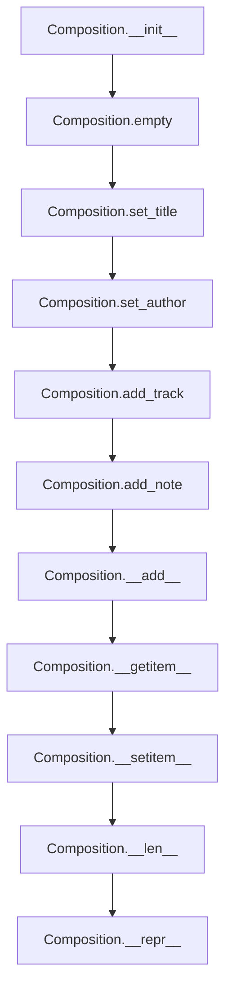

# `composition.py`

## `mingus.containers.composition.Composition` · *class*

## Summary:
Represents a musical composition containing multiple tracks and metadata such as title, author, and description.

## Description:
The Composition class serves as a container for organizing musical content composed of multiple tracks. It manages metadata like title, author, and description, while providing methods to add tracks and notes, select tracks for operations, and manage the collection of tracks. This abstraction allows for structured representation and manipulation of musical compositions.

## State:
- title (str): The main title of the composition, defaults to "Untitled"
- subtitle (str): Secondary title information, defaults to empty string
- author (str): Name of the composition's author, defaults to empty string
- email (str): Author's email address, defaults to empty string
- description (str): Detailed description of the composition, defaults to empty string
- tracks (list): Collection of Track objects contained in this composition
- selected_tracks (list): Indices of currently selected tracks for operations, defaults to empty list

## Lifecycle:
- Creation: Instantiate with `Composition()` which initializes empty tracks
- Usage: Add tracks using `add_track()`, which automatically selects the added track for subsequent operations; add notes to selected tracks using `add_note()` or `__add__()`
- Destruction: No explicit cleanup required; Python handles garbage collection

## Method Map:


## Raises:
- UnexpectedObjectError: When attempting to add a non-Track object via `add_track()`

## Example:
```python
# Create a new composition
comp = Composition()
comp.set_title("My Song", "A beautiful melody")
comp.set_author("John Doe", "john@example.com")

# Add tracks to the composition
track1 = Track()
track2 = Track()
comp.add_track(track1)
comp.add_track(track2)

# Add notes to selected tracks
comp.add_note(note)

# Access tracks
first_track = comp[0]
```

### `mingus.containers.composition.Composition.__init__` · *method*

## Summary:
Initializes a Composition object by clearing all tracks and resetting its state.

## Description:
The `__init__` method serves as the constructor for the Composition class, ensuring that every new instance starts with a clean state containing no tracks. It delegates the initialization logic to the `empty()` method, which resets the internal tracks list.

This method is called automatically when a new Composition object is instantiated, making it part of the object's construction lifecycle. It ensures that all Composition instances begin with consistent initial state regardless of previous usage.

## Args:
    None

## Returns:
    None

## Raises:
    None

## State Changes:
    Attributes READ: None
    Attributes WRITTEN: 
        - self.tracks: Set to an empty list []

## Constraints:
    Preconditions: None
    Postconditions: 
        - The Composition object has an empty tracks list
        - All other attributes retain their default values

## Side Effects:
    None

### `mingus.containers.composition.Composition.empty` · *method*

## Summary:
Clears all tracks from the composition, leaving it empty.

## Description:
This method removes all tracks from the composition by setting the tracks attribute to an empty list. It is designed to provide a clean slate for the composition object, allowing users to reset or clear the current track collection.

## Args:
    None

## Returns:
    None

## Raises:
    None

## State Changes:
    Attributes READ: None
    Attributes WRITTEN: self.tracks

## Constraints:
    Preconditions: The composition object must be properly initialized with a tracks attribute.
    Postconditions: The tracks attribute will be an empty list.

## Side Effects:
    None

### `mingus.containers.composition.Composition.reset` · *method*

## Summary:
Resets the composition to its default empty state with default title and author information.

## Description:
This method provides a convenient way to completely reset a Composition object to its initial state. It clears all tracks from the composition and resets the title and author metadata to their default values. The method is designed to be a single-point interface for resetting the entire composition state, making it easier to reuse composition objects or start fresh with a clean slate.

This method is typically called during initialization or when a composition needs to be completely reset before populating it with new content. It's particularly useful in scenarios where the same composition object is reused multiple times in an application lifecycle. The reset operation mirrors the initialization process, ensuring consistent state restoration.

## Args:
    None

## Returns:
    None

## Raises:
    None

## State Changes:
    Attributes READ: None
    Attributes WRITTEN: 
    - self.tracks: Set to empty list
    - self.title: Set to "Untitled"
    - self.subtitle: Set to ""
    - self.author: Set to ""
    - self.email: Set to ""

## Constraints:
    Preconditions: The Composition object must be properly initialized with all required attributes (tracks, title, subtitle, author, email).
    Postconditions: The composition will have no tracks and default metadata values.

## Side Effects:
    None

### `mingus.containers.composition.Composition.add_track` · *method*

## Summary:
Adds a track to the composition and selects it as the currently active track.

## Description:
This method appends a track to the composition's tracks list and sets it as the sole selected track. It validates that the provided object is a proper Track instance by checking for the presence of a 'bars' attribute. This validation ensures type safety and prevents invalid objects from being added to the composition.

## Args:
    track: A track object to be added to the composition. Must have a 'bars' attribute.

## Returns:
    None

## Raises:
    UnexpectedObjectError: When the provided track object does not have a 'bars' attribute, indicating it is not a valid Track instance.

## State Changes:
    Attributes READ: self.tracks, self.selected_tracks
    Attributes WRITTEN: self.tracks, self.selected_tracks

## Constraints:
    Preconditions: The track argument must be an object with a 'bars' attribute.
    Postconditions: The track is appended to self.tracks and self.selected_tracks contains only the index of the newly added track.

## Side Effects:
    None

### `mingus.containers.composition.Composition.add_note` · *method*

## Summary:
Adds a note to all selected tracks in the composition.

## Description:
This method appends a note to each track that is currently marked as selected within the composition. It operates on the selected tracks list and applies the note addition operation to each track in sequence. This method is part of the composition's interface for building musical content incrementally, allowing users to add notes to multiple tracks simultaneously.

## Args:
    note: The note object to be added to each selected track. The note must be compatible with the track's `+` operator, typically a Note or NoteContainer object.

## Returns:
    None

## Raises:
    None explicitly raised

## State Changes:
    Attributes READ: self.selected_tracks, self.tracks
    Attributes WRITTEN: self.tracks (via the += operation on individual tracks)

## Constraints:
    Preconditions: 
    - self.selected_tracks must be iterable
    - self.tracks must be a collection that supports indexing with elements from self.selected_tracks
    - Each track referenced by self.selected_tracks must support the `+` operator with the note argument
    - The note parameter must be compatible with the track's addition operation
    
    Postconditions:
    - Each track in self.selected_tracks will have the note appended to it
    - No changes to self.selected_tracks or self.tracks reference itself

## Side Effects:
    None

### `mingus.containers.composition.Composition.set_title` · *method*

## Summary:
Sets the title and subtitle attributes of a composition object.

## Description:
This method provides a clean interface for setting the title and subtitle of a composition. Rather than allowing direct attribute assignment, this dedicated method ensures consistent handling of composition metadata and makes future modifications easier to implement. It is typically called during composition initialization or when updating metadata.

## Args:
    title (str): The main title of the composition. Defaults to "Untitled".
    subtitle (str): The subtitle of the composition. Defaults to "".

## Returns:
    None: This method does not return any value.

## Raises:
    None: This method does not explicitly raise any exceptions.

## State Changes:
    Attributes READ: None
    Attributes WRITTEN: self.title, self.subtitle

## Constraints:
    Preconditions: The composition object must be properly initialized with title and subtitle attributes available for assignment.
    Postconditions: The composition's title and subtitle attributes will be updated to the provided values.

## Side Effects:
    None: This method does not produce any side effects beyond modifying the object's attributes.

### `mingus.containers.composition.Composition.set_author` · *method*

## Summary:
Sets the author and email properties of a Composition object.

## Description:
This method assigns the provided author name and email to the Composition instance, allowing users to track the creator of the musical composition. It serves as a dedicated interface for updating these metadata fields rather than modifying them directly.

## Args:
    author (str): The name of the author. Defaults to an empty string.
    email (str): The email address of the author. Defaults to an empty string.

## Returns:
    None: This method does not return any value.

## Raises:
    None: This method does not raise any exceptions.

## State Changes:
    Attributes READ: None
    Attributes WRITTEN: self.author, self.email

## Constraints:
    Preconditions: The Composition object must be properly initialized.
    Postconditions: The self.author and self.email attributes will be updated to the provided values.

## Side Effects:
    None: This method does not produce any side effects beyond modifying the object's attributes.

### `mingus.containers.composition.Composition.__add__` · *method*

## Summary:
Adds a Track or Note object to the composition, dynamically dispatching to the appropriate method based on object type.

## Description:
This method serves as a unified interface for adding musical elements to a Composition. It determines whether the provided value is a Track (by checking for a "bars" attribute) or a Note, and delegates to the appropriate specialized method. This approach allows users to add musical components without needing to know the specific type beforehand.

## Args:
    value (object): Either a Track object (with a "bars" attribute) or a Note object.

## Returns:
    The return value depends on the dispatched method:
    - If adding a Track: returns the result of add_track() which typically modifies the composition in-place
    - If adding a Note: returns the result of add_note() which typically returns a list of notes

## Raises:
    UnexpectedObjectError: When attempting to add a Track object that doesn't have a "bars" attribute, or when attempting to add a Note object that is not recognized as a valid Note.

## State Changes:
    Attributes READ: self.selected_tracks
    Attributes WRITTEN: self.tracks, self.selected_tracks

## Constraints:
    Preconditions: The value must either be a Track object with a "bars" attribute or a Note object.
    Postconditions: The value is added to the composition's tracks or notes collection, and the selected_tracks is updated appropriately.

## Side Effects:
    None

### `mingus.containers.composition.Composition.__getitem__` · *method*

## Summary:
Retrieves a track from the composition by index.

## Description:
Provides indexed access to tracks stored within the composition object. This method enables users to access individual tracks using standard bracket notation, making the composition behave like a sequence of tracks. It is part of the standard Python sequence protocol implementation for the Composition class, allowing compositions to be treated as ordered collections of tracks.

## Args:
    index (int): The zero-based index of the track to retrieve.

## Returns:
    Track: The track object at the specified index position.

## Raises:
    IndexError: When the index is out of bounds for the tracks collection.

## State Changes:
    Attributes READ: self.tracks
    Attributes WRITTEN: None

## Constraints:
    Preconditions: The index must be a valid integer within the bounds of the tracks collection (0 <= index < len(self.tracks)).
    Postconditions: The returned track object maintains its original state and is not modified by this operation.

## Side Effects:
    None

### `mingus.containers.composition.Composition.__setitem__` · *method*

## Summary:
Sets a track at the specified index in the composition's track list, replacing the existing track at that position.

## Description:
This method implements the `__setitem__` magic method for the Composition class, enabling dictionary-style assignment syntax for modifying tracks in a composition. It allows replacing a track at a specific index with a new track object. This method is part of the container protocol implementation for the Composition class.

## Args:
    index (int): The zero-based index position in the tracks list where the track should be replaced
    value: The track object to store at the specified index

## Returns:
    None

## Raises:
    IndexError: When the index is negative or greater than or equal to the length of the tracks list
    UnexpectedObjectError: When attempting to set a value that does not have a 'bars' attribute (indicating it's not a valid track object)

## State Changes:
    Attributes READ: self.tracks
    Attributes WRITTEN: self.tracks

## Constraints:
    Preconditions: 
    - The index must be a valid integer within the range [0, len(self.tracks))
    - The value must be a track object with a 'bars' attribute (validated through list assignment behavior)
    Postconditions:
    - The track at the specified index is replaced with the new value
    - The tracks list maintains its internal consistency

## Side Effects:
    None

### `mingus.containers.composition.Composition.__len__` · *method*

## Summary:
Returns the number of tracks contained in the composition.

## Description:
This method provides a standard interface for determining the size of a Composition object by returning the count of tracks it contains. It is typically called during serialization, iteration, or size-based operations on compositions.

## Args:
    None

## Returns:
    int: The number of tracks in the composition.

## Raises:
    None

## State Changes:
    Attributes READ: self.tracks
    Attributes WRITTEN: None

## Constraints:
    Preconditions: The composition object must have a tracks attribute that supports the len() function.
    Postconditions: The returned integer represents the exact count of tracks in the composition.

## Side Effects:
    None

### `mingus.containers.composition.Composition.__repr__` · *method*

## Summary:
Returns a string representation of the composition by concatenating string representations of all tracks.

## Description:
This method provides a human-readable string representation of a Composition object by iterating through its tracks and concatenating their string representations. It serves as the official string representation for Composition instances, enabling debugging, logging, and display of composition contents.

## Args:
    None

## Returns:
    str: A concatenated string containing the string representations of all tracks in the composition, in order.

## Raises:
    None

## State Changes:
    Attributes READ: self.tracks
    Attributes WRITTEN: None

## Constraints:
    Preconditions: The Composition object must have a tracks attribute that is iterable.
    Postconditions: The returned string contains all track representations in the same order as they appear in self.tracks.

## Side Effects:
    None

