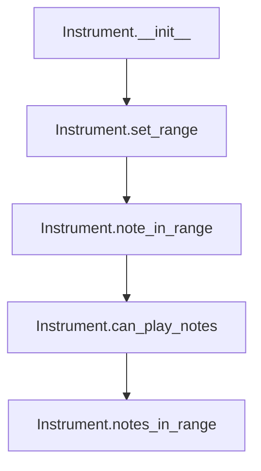
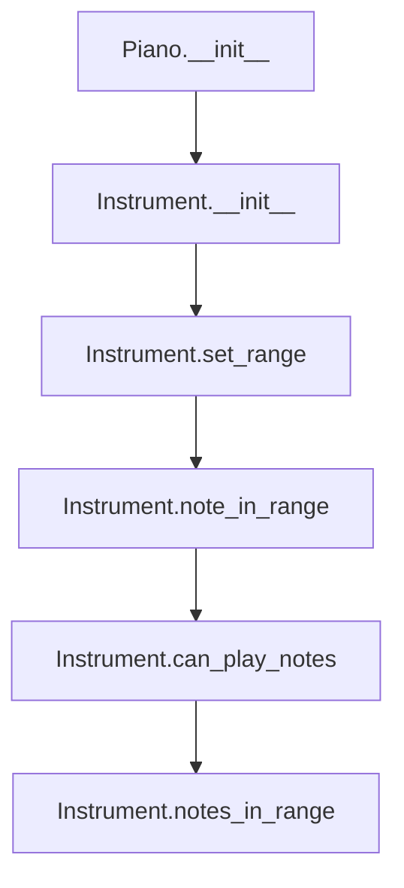
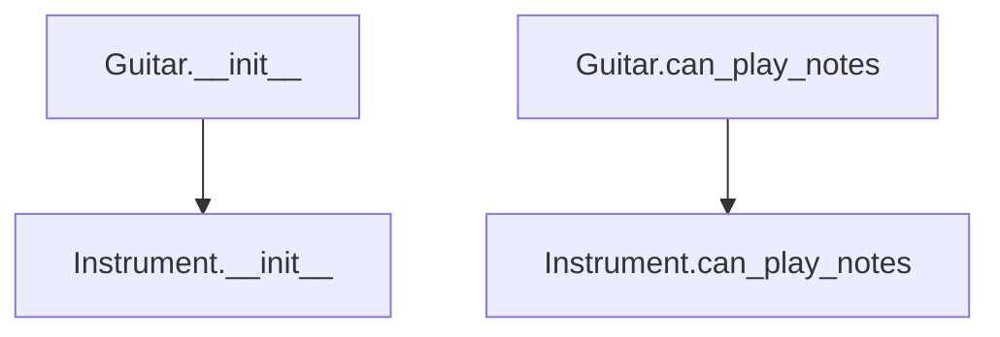
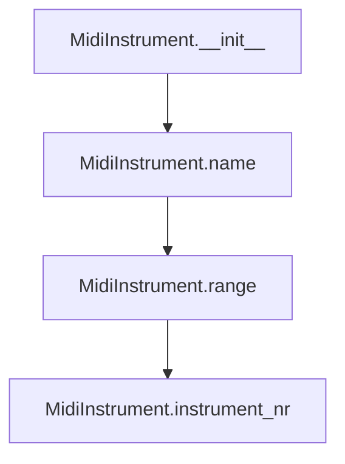

```mermaid
graph TD
    A[MidiPercussionInstrument.__init__] --> B[MidiPercussionInstrument.acoustic_bass_drum]
    B --> C[MidiPercussionInstrument.bass_drum_1]
    C --> D[MidiPercussionInstrument.side_stick]
    D --> E[MidiPercussionInstrument.acoustic_snare]
    E --> F[MidiPercussionInstrument.hand_clap]
    F --> G[MidiPercussionInstrument.electric_snare]
    G --> H[MidiPercussionInstrument.low_floor_tom]
    H --> I[MidiPercussionInstrument.closed_hi_hat]
    I --> J[MidiPercussionInstrument.high_floor_tom]
    J --> K[MidiPercussionInstrument.pedal_hi_hat]
    K --> L[MidiPercussionInstrument.low_tom]
    L --> M[MidiPercussionInstrument.open_hi_hat]
    M --> N[MidiPercussionInstrument.low_mid_tom]
    N --> O[MidiPercussionInstrument.hi_mid_tom]
    O --> P[MidiPercussionInstrument.crash_cymbal_1]
    P --> Q[MidiPercussionInstrument.high_tom]
    Q --> R[MidiPercussionInstrument.ride_cymbal_1]
    R --> S[MidiPercussionInstrument.chinese_cymbal]
    S --> T[MidiPercussionInstrument.ride_bell]
    T --> U[MidiPercussionInstrument.tambourine]
    U --> V[MidiPercussionInstrument.splash_cymbal]
    V --> W[MidiPercussionInstrument.cowbell]
    W --> X[MidiPercussionInstrument.crash_cymbal_2]
    X --> Y[MidiPercussionInstrument.vibraslap]
    Y --> Z[MidiPercussionInstrument.ride_cymbal_2]
    Z --> AA[MidiPercussionInstrument.hi_bongo]
    AA --> AB[MidiPercussionInstrument.low_bongo]
    AB --> AC[MidiPercussionInstrument.mute_hi_conga]
    AC --> AD[MidiPercussionInstrument.open_hi_conga]
    AD --> AE[MidiPercussionInstrument.low_conga]
    AE --> AF[MidiPercussionInstrument.high_timbale]
    AF --> AG[MidiPercussionInstrument.low_timbale]
    AG --> AH[MidiPercussionInstrument.high_agogo]
    AH --> AI[MidiPercussionInstrument.low_agogo]
    AI --> AJ[MidiPercussionInstrument.cabasa]
    AJ --> AK[MidiPercussionInstrument.maracas]
    AK --> AL[MidiPercussionInstrument.short_whistle]
    AL --> AM[MidiPercussionInstrument.long_whistle]
    AM --> AN[MidiPercussionInstrument.short_guiro]
    AN --> AO[MidiPercussionInstrument.long_guiro]
    AO --> AP[MidiPercussionInstrument.claves]
    AP --> AQ[MidiPercussionInstrument.hi_wood_block]
    AQ --> AR[MidiPercussionInstrument.low_wood_block]
    AR --> AS[MidiPercussionInstrument.mute_cuica]
    AS --> AT[MidiPercussionInstrument.open_cuica]
    AT --> AU[MidiPercussionInstrument.mute_triangle]
    AU --> AV[MidiPercussionInstrument.open_triangle]
```

# `instrument.py`

## `mingus.containers.instrument.Instrument` · *class*

## Summary:
Represents a musical instrument with defined pitch range, clef, and optional tuning information.

## Description:
The Instrument class serves as an abstract base class for musical instruments in the mingus system, defining common properties and behaviors such as pitch range limitations, clef designation, and note validation capabilities. It provides methods for determining whether specific notes or collections of notes fall within the instrument's playable range, making it useful for music composition analysis and validation. This class is designed to be subclassed for specific instrument types.

## State:
- name (str): Human-readable identifier for the instrument, defaults to "Instrument"
- range (tuple): Pair of Note objects defining the minimum and maximum playable pitches, defaults to (Note("C", 0), Note("C", 8))
- clef (str): Musical clef designation, defaults to "bass and treble"
- tuning (StringTuning or None): Optional tuning specification for stringed instruments, defaults to None

## Lifecycle:
- Creation: Instantiate with default constructor or subclass with specific instrument characteristics
- Usage: Call methods like note_in_range() or can_play_notes() to validate musical content against instrument capabilities
- Destruction: Standard Python garbage collection handles cleanup

## Method Map:


## Raises:
- UnexpectedObjectError: Raised by set_range() and note_in_range() when non-Note objects are provided as input

## Example:
```python
# Create an instrument instance
instrument = Instrument()

# Set custom range
instrument.set_range(("C3", "C5"))

# Check if notes are in range
print(instrument.note_in_range("G4"))  # True
print(instrument.note_in_range("C2"))  # False

# Validate collections of notes
notes_list = ["C4", "D4", "E4"]
print(instrument.can_play_notes(notes_list))  # True

# Check range representation
print(instrument)  # Instrument [C-0 - C-8] (before custom range)
```

### `mingus.containers.instrument.Instrument.__init__` · *method*

## Summary:
Initializes an Instrument object with default attributes including name, pitch range, clef, and tuning information.

## Description:
This method serves as the constructor for the Instrument class, initializing the fundamental attributes that define an instrument's characteristics. It sets up the basic state of an instrument instance with sensible defaults for name, pitch range, clef, and tuning, enabling the instrument to participate in musical composition and validation workflows. The method is designed to be overridden by subclasses that provide specific instrument implementations.

## Args:
    None

## Returns:
    None

## Raises:
    None

## State Changes:
    Attributes READ: None
    Attributes WRITTEN: 
    - name (str): Sets the instrument's human-readable identifier to "Instrument"
    - range (tuple): Initializes the pitch range with default notes (Note("C", 0), Note("C", 8))
    - clef (str): Sets the musical clef to "bass and treble"
    - tuning (StringTuning or None): Sets the tuning to None

## Constraints:
    Preconditions: None
    Postconditions: An Instrument instance is created with initialized default attributes

## Side Effects:
    None

### `mingus.containers.instrument.Instrument.set_range` · *method*

## Summary:
Sets the playable range of notes for an instrument by assigning a range tuple containing two Note objects.

## Description:
This method configures the minimum and maximum playable notes for an instrument. It accepts either Note objects or string representations of notes and converts string inputs to Note objects. The method ensures that the range is properly formatted with valid Note objects before assignment to the instrument's range attribute. This method is typically called during instrument initialization or configuration to define the playable range.

## Args:
    range (tuple): A tuple containing two elements representing the minimum and maximum playable notes. Each element can be either a Note object or a string representation of a note (e.g., "C", "D#4"). The tuple must contain exactly two elements.

## Returns:
    None: This method does not return any value.

## Raises:
    UnexpectedObjectError: Raised when the first element of the range tuple does not have a 'name' attribute, indicating it is not a valid Note object after processing.

## State Changes:
    Attributes READ: None
    Attributes WRITTEN: self.range

## Constraints:
    Preconditions:
        - The range argument must be a tuple-like object with exactly two elements
        - The first element must either be a Note object or a string that can be converted to a Note object
        - The second element must either be a Note object or a string that can be converted to a Note object
    
    Postconditions:
        - The self.range attribute is assigned the validated range tuple
        - Both elements of the range tuple are Note objects

## Side Effects:
    None: This method does not perform any I/O operations or mutate external objects.

### `mingus.containers.instrument.Instrument.note_in_range` · *method*

## Summary:
Determines whether a given note falls within the instrument's designated pitch range.

## Description:
This method checks if a musical note, either provided as a Note object or string representation, lies within the instrument's defined pitch range. It serves as a validation utility to ensure notes are appropriate for the instrument's capabilities.

## Args:
    note (Note or str): A musical note represented either as a Note object or a string (e.g., "C-4").

## Returns:
    bool: True if the note is within the instrument's range, False otherwise.

## Raises:
    UnexpectedObjectError: When the input note is neither a string nor a Note object with a 'name' attribute.

## State Changes:
    Attributes READ: self.range
    Attributes WRITTEN: None

## Constraints:
    Preconditions: The instrument must have a properly initialized range attribute containing two Note objects representing the minimum and maximum pitches.
    Postconditions: The method returns a boolean value indicating range inclusion without modifying any object state.

## Side Effects:
    None

### `mingus.containers.instrument.Instrument.notes_in_range` · *method*

## Summary:
Determines whether a given set of notes falls within the instrument's playable pitch range.

## Description:
This method serves as a wrapper around the can_play_notes method, providing a convenient way to check if notes can be played by this instrument. It is typically called during music composition or playback validation phases to ensure that notes being scheduled for performance are within the instrument's capabilities. The method delegates the actual range checking to the can_play_notes method, which handles various input formats including individual notes, lists of notes, or objects containing note collections.

## Args:
    notes: A note object, list of notes, or object with a notes attribute containing notes to validate.

## Returns:
    bool: True if all notes are within the instrument's range, False otherwise.

## Raises:
    UnexpectedObjectError: When a note object doesn't have a name attribute or when a string note cannot be converted to a Note object. This exception is propagated from the underlying can_play_notes method.

## State Changes:
    Attributes READ: self.range
    Attributes WRITTEN: None

## Constraints:
    Preconditions: The instrument must have a defined range attribute (self.range) containing two Note objects representing the minimum and maximum playable pitches. The range attribute is initialized to (Note("C", 0), Note("C", 8)) by default.
    Postconditions: The method returns a boolean indicating whether all notes are within the instrument's playable range.

## Side Effects:
    None

### `mingus.containers.instrument.Instrument.can_play_notes` · *method*

## Summary:
Determines whether a given set of notes can be played by this instrument based on the instrument's pitch range.

## Description:
This method evaluates whether all notes in a provided collection fall within the instrument's playable pitch range. It handles various input formats including individual notes, lists of notes, or objects containing note collections (like chords). The method serves as a validation check before attempting to play notes with this instrument. It is called internally by the notes_in_range method.

## Args:
    notes: A note object, list of notes, or object with a notes attribute containing notes to validate.

## Returns:
    bool: True if all notes are within the instrument's range, False otherwise.

## Raises:
    UnexpectedObjectError: When a note object doesn't have a name attribute or when a string note cannot be converted to a Note object.

## State Changes:
    Attributes READ: self.range
    Attributes WRITTEN: None

## Constraints:
    Preconditions: The instrument must have a defined range attribute (self.range) containing two Note objects representing the minimum and maximum playable pitches. The range attribute is initialized to (Note("C", 0), Note("C", 8)) by default.
    Postconditions: The method returns a boolean indicating whether all notes are within the instrument's playable range.

## Side Effects:
    None

### `mingus.containers.instrument.Instrument.__repr__` · *method*

## Summary:
Returns a string representation of the instrument showing its name and pitch range.

## Description:
This method provides a human-readable string representation of an Instrument object, displaying the instrument's name followed by its pitch range in bracket notation. It is called during debugging or when the instrument object needs to be displayed in a string context. This method is part of Python's standard object protocol for representing objects as strings.

## Args:
    None

## Returns:
    str: A formatted string containing the instrument name and its pitch range, e.g., "Piano [C3 - C8]"

## Raises:
    None

## State Changes:
    Attributes READ: self.name, self.range
    Attributes WRITTEN: None

## Constraints:
    Preconditions: The instrument object must have a valid name attribute (expected to be a string) and a range attribute that is a sequence (list or tuple) with at least two elements representing the pitch range.
    Postconditions: The returned string follows the format "%s [%s - %s]" where the first %s is the name and the second and third %s are the first and second elements of the range respectively.

## Side Effects:
    None

## `mingus.containers.instrument.Piano` · *class*

## Summary:
Represents a piano instrument with a predefined pitch range from F0 to B8, inheriting core instrument functionality.

## Description:
The Piano class is a concrete subclass of the Instrument base class, specifically designed for piano instruments. It inherits all core instrument functionality including pitch range validation, clef designation, and note validation capabilities. While the Instrument base class defines a default range of (Note("C", 0), Note("C", 8)), the Piano class overrides this with a fixed range appropriate for pianos. This class enables validation of musical content against piano capabilities and facilitates representation of piano-specific musical elements in compositions.

## State:
- name (str): Fixed class attribute with value "Piano"
- range (tuple): Fixed class attribute containing two Note objects defining the piano's playable range as (Note("F", 0), Note("B", 8))
- clef (str): Inherited from Instrument base class, defaults to "bass and treble" 
- tuning (StringTuning or None): Inherited from Instrument base class, defaults to None

## Lifecycle:
- Creation: Instantiate using the default constructor with no arguments, which calls the parent Instrument.__init__() method
- Usage: Can be used with all inherited methods from Instrument class such as note_in_range(), can_play_notes(), and notes_in_range() to validate musical content against piano capabilities
- Destruction: Standard Python garbage collection handles cleanup

## Method Map:


## Raises:
- UnexpectedObjectError: May be raised by parent Instrument class methods if invalid objects are passed to range validation functions

## Example:
```python
# Create a piano instance
piano = Piano()

# Check if notes are in piano range
print(piano.note_in_range("C4"))  # True
print(piano.note_in_range("C2"))  # True (within F0-B8 range)
print(piano.note_in_range("C9"))  # False (above B8)

# Validate collections of notes
notes_list = ["C4", "D4", "E4"]
print(piano.can_play_notes(notes_list))  # True

# Check range representation
print(piano.range)  # (Note("F", 0), Note("B", 8))
```

### `mingus.containers.instrument.Piano.__init__` · *method*

## Summary:
Initializes a Piano instance by calling the parent Instrument class constructor.

## Description:
This method serves as the constructor for the Piano class, initializing the instrument's basic properties by delegating to its parent Instrument class. The Piano class is a concrete subclass of Instrument specifically designed for piano instruments. When called, it invokes the parent Instrument.__init__() method to establish the fundamental instrument characteristics, including setting up the default pitch range, clef, and tuning support that are inherited from the base Instrument class.

## Args:
    None

## Returns:
    None

## Raises:
    None

## State Changes:
    Attributes READ: None
    Attributes WRITTEN: None

## Constraints:
    Preconditions: The Piano class must be properly defined and inherit from Instrument
    Postconditions: The Piano instance will have all default Instrument properties initialized through parent constructor call

## Side Effects:
    None

## `mingus.containers.instrument.Guitar` · *class*

## Summary:
Represents a guitar instrument with a specific pitch range and note-playing capability.

## Description:
The Guitar class is a concrete implementation of the Instrument base class, specifically designed to model a guitar instrument. It defines the standard pitch range for guitars (E3 to E7) and implements note validation logic that respects the physical limitations of guitar playing, particularly the constraint that guitars can typically play at most six notes simultaneously. This class serves as a specialized instrument type for music composition and analysis within the mingus framework.

## State:
- name (str): Fixed value "Guitar" identifying this instrument type
- range (tuple): Fixed tuple of two Note objects representing the guitar's playable pitch range (Note("E", 3), Note("E", 7))
- clef (str): Fixed value "Treble" indicating the musical clef associated with guitar notation

## Lifecycle:
- Creation: Instantiated using the default constructor with no arguments
- Usage: Typically used to validate musical notes or collections of notes against guitar capabilities
- Destruction: Handled by Python's garbage collection

## Method Map:


## Raises:
- None explicitly raised by Guitar.__init__
- May raise UnexpectedObjectError from parent Instrument.can_play_notes if invalid note objects are passed

## Example:
```python
# Create a guitar instance
guitar = Guitar()

# Validate single note within range
print(guitar.note_in_range("E4"))  # True

# Validate multiple notes (up to 6)
notes = ["E4", "F4", "G4", "A4", "B4", "C5"]
print(guitar.can_play_notes(notes))  # True

# Validate too many notes (more than 6)
many_notes = ["E4", "F4", "G4", "A4", "B4", "C5", "D5"]
print(guitar.can_play_notes(many_notes))  # False
```

### `mingus.containers.instrument.Guitar.__init__` · *method*

## Summary:
Initializes a Guitar instrument instance by calling the parent Instrument class constructor.

## Description:
This method serves as the constructor for the Guitar class, initializing the instrument's basic properties by delegating to its parent Instrument class. It ensures proper setup of the instrument's fundamental characteristics such as pitch range, clef, and tuning information, while maintaining consistency with the Instrument base class interface. The Guitar class inherits all Instrument properties and behaviors, including note validation capabilities.

## Args:
    None

## Returns:
    None

## Raises:
    None

## State Changes:
    Attributes READ: None
    Attributes WRITTEN: None

## Constraints:
    Preconditions: The Guitar class must be properly defined as a subclass of Instrument
    Postconditions: The Guitar instance will have inherited all Instrument properties and behaviors

## Side Effects:
    None

### `mingus.containers.instrument.Guitar.can_play_notes` · *method*

## Summary:
Determines whether a collection of notes can be played by this guitar, with a maximum limit of six notes.

## Description:
This method validates whether a given set of notes falls within the playable range of the guitar while enforcing a constraint that guitars can handle at most six notes simultaneously. It first checks if the number of notes exceeds six, returning False immediately if so. Otherwise, it delegates to the parent Instrument class's can_play_notes method for range validation. This override adds a specific constraint for guitar instruments to prevent validation of overly large note collections.

## Args:
    notes: An iterable collection of notes (typically a list of Note objects or note representations) to validate.

## Returns:
    bool: True if all notes are within the guitar's playable range and there are no more than six notes; False otherwise.

## Raises:
    None

## State Changes:
    Attributes READ: self.range
    Attributes WRITTEN: None

## Constraints:
    Preconditions: The guitar instance must have a properly initialized range attribute (self.range) containing two Note objects representing the minimum and maximum playable pitches. The notes parameter must be iterable.
    Postconditions: Returns a boolean indicating whether the notes can be played by this guitar, considering both range and count constraints (maximum 6 notes).

## Side Effects:
    None

## `mingus.containers.instrument.MidiInstrument` · *class*

## Summary:
Represents a MIDI instrument with predefined instrument types and pitch range capabilities.

## Description:
The MidiInstrument class extends the base Instrument class to provide specific MIDI instrument functionality. It defines a standard pitch range from C0 to B8 and maintains a collection of valid MIDI instrument names. This class is intended to represent specific MIDI synthesizer instruments that can play notes within the defined range.

## State:
- range (tuple): Fixed pitch range from Note("C", 0) to Note("B", 8) representing the playable note range
- instrument_nr (int): MIDI instrument number, defaults to 1 (Acoustic Grand Piano)
- name (str): Human-readable name of the instrument, defaults to empty string
- names (list[str]): Complete list of valid MIDI instrument names in standard order

## Lifecycle:
- Creation: Instantiate with optional name parameter; defaults to unnamed instrument
- Usage: Typically used for MIDI playback or composition validation within the defined range
- Destruction: Standard Python garbage collection handles cleanup

## Method Map:


## Raises:
- None explicitly raised by __init__

## Example:
```python
# Create a MidiInstrument instance
instrument = MidiInstrument("Piano")

# Access instrument properties
print(instrument.name)  # "Piano"
print(instrument.range)  # (Note("C", 0), Note("B", 8))

# Default unnamed instrument
default_instrument = MidiInstrument()
print(default_instrument.name)  # ""
```

### `mingus.containers.instrument.MidiInstrument.__init__` · *method*

## Summary:
Initializes a MidiInstrument object with an optional name attribute.

## Description:
This method sets up the basic state of a MidiInstrument instance by assigning a name to the instrument. It serves as the constructor for the MidiInstrument class, establishing the initial configuration of the object's name property.

## Args:
    name (str): The name to assign to the instrument. Defaults to an empty string.

## Returns:
    None: This method does not return any value.

## Raises:
    None: This method does not raise any exceptions.

## State Changes:
    Attributes READ: None
    Attributes WRITTEN: self.name

## Constraints:
    Preconditions: None
    Postconditions: The self.name attribute will be set to the provided name parameter or an empty string if none was provided.

## Side Effects:
    None: This method does not perform any I/O operations or mutate external objects.

## `mingus.containers.instrument.MidiPercussionInstrument` · *class*

## Summary:
A specialized musical instrument class representing MIDI percussion sounds mapped to specific MIDI note numbers.

## Description:
The MidiPercussionInstrument class extends the base Instrument class to represent a MIDI percussion instrument that maps specific percussion sounds to MIDI note numbers. This class provides dedicated methods for accessing individual percussion sounds, each returning a Note object that represents the corresponding MIDI note. It serves as a concrete implementation for working with MIDI percussion instruments in musical compositions.

## State:
- name (str): Fixed value "Midi Percussion" inherited from parent class
- mapping (dict): Dictionary mapping MIDI note numbers (integers) to percussion sound names (strings), containing 47 percussion sounds from Acoustic Bass Drum to Open Triangle

## Lifecycle:
- Creation: Instantiated with default constructor, automatically initializes with predefined percussion mappings
- Usage: Call specific percussion methods (like acoustic_bass_drum()) to retrieve Note objects representing MIDI notes
- Destruction: Standard Python garbage collection handles cleanup

## Method Map:


## Raises:
- No explicit exceptions raised by __init__
- All percussion methods raise UnexpectedObjectError if Note() construction fails (inherited from Note class)

## Example:
```python
# Create a MIDI percussion instrument
percussion = MidiPercussionInstrument()

# Access specific percussion sounds
bass_drum = percussion.acoustic_bass_drum()
snare = percussion.acoustic_snare()
hi_hat = percussion.closed_hi_hat()

# The returned objects are Note instances representing MIDI notes
print(bass_drum)  # Note at MIDI note 23 (35 - 12)
print(snare)      # Note at MIDI note 26 (38 - 12)
print(hi_hat)     # Note at MIDI note 30 (42 - 12)
```

### `mingus.containers.instrument.MidiPercussionInstrument.__init__` · *method*

## Summary:
Initializes a MidiPercussionInstrument instance with a fixed name and comprehensive MIDI note mapping for percussion sounds.

## Description:
This method sets up the MidiPercussionInstrument object by calling its parent class constructor and initializing the instrument's name and mapping dictionary. The mapping associates MIDI note numbers (35-81) with specific percussion sound names, enabling the instrument to represent standard MIDI percussion sounds.

## Args:
    None

## Returns:
    None

## Raises:
    None

## State Changes:
    Attributes READ: None
    Attributes WRITTEN: 
    - self.name: Set to "Midi Percussion"
    - self.mapping: Set to a dictionary mapping MIDI note numbers to percussion sound names

## Constraints:
    Preconditions: None
    Postconditions: 
    - self.name is set to "Midi Percussion"
    - self.mapping contains 47 key-value pairs mapping MIDI note numbers to percussion sound names

## Side Effects:
    None

### `mingus.containers.instrument.MidiPercussionInstrument.acoustic_bass_drum` · *method*

## Summary:
Returns a Note object representing the acoustic bass drum sound at MIDI note 23.

## Description:
This method provides access to the acoustic bass drum sound in the MIDI percussion instrument set. It creates and returns a Note object with MIDI pitch value 23 (which corresponds to the standard acoustic bass drum note). This method serves as a convenient accessor for the common acoustic bass drum sound without requiring manual calculation or knowledge of the MIDI note mapping.

## Args:
    None

## Returns:
    Note: A Note object representing the acoustic bass drum sound at MIDI pitch 23.

## Raises:
    None

## State Changes:
    Attributes READ: None
    Attributes WRITTEN: None

## Constraints:
    Preconditions: None
    Postconditions: None

## Side Effects:
    None

### `mingus.containers.instrument.MidiPercussionInstrument.bass_drum_1` · *method*

## Summary:
Returns a Note object representing the bass drum sound in MIDI percussion instrument notation.

## Description:
This method returns a Note object initialized with MIDI note number 24, which corresponds to the standard MIDI percussion note for a bass drum sound (MIDI note 36 minus 12). This method serves as a convenient accessor for the bass drum note value within the MidiPercussionInstrument class.

## Args:
    None

## Returns:
    Note: A Note object representing the bass drum sound with MIDI note number 24.

## Raises:
    None

## State Changes:
    Attributes READ: None
    Attributes WRITTEN: None

## Constraints:
    Preconditions: None
    Postconditions: The returned Note object will have a MIDI note number of 24.

## Side Effects:
    None

### `mingus.containers.instrument.MidiPercussionInstrument.side_stick` · *method*

## Summary:
Returns a Note object representing the side stick percussion sound at MIDI note 25.

## Description:
This method returns a Note object initialized with MIDI note number 25, which corresponds to the side stick percussion sound in MIDI specifications. The side stick is a percussion technique that produces a distinctive snare-like sound by striking the rim of a drum with the stick tip.

## Args:
    None

## Returns:
    Note: A Note object representing the side stick sound at MIDI note 25 (37 - 12 = 25).

## Raises:
    None

## State Changes:
    Attributes READ: None
    Attributes WRITTEN: None

## Constraints:
    Preconditions: None
    Postconditions: The returned Note object will have a MIDI note number of 25.

## Side Effects:
    None

### `mingus.containers.instrument.MidiPercussionInstrument.acoustic_snare` · *method*

## Summary:
Returns a Note object representing the acoustic snare drum sound at MIDI note 26.

## Description:
This method provides access to the acoustic snare drum sound by returning a Note object initialized with MIDI note number 26 (which is 38 - 12). It serves as a convenient accessor for the standard acoustic snare drum sound in percussion instruments.

## Args:
    None

## Returns:
    Note: A Note object representing the acoustic snare drum sound at MIDI note 26.

## Raises:
    None

## State Changes:
    Attributes READ: None
    Attributes WRITTEN: None

## Constraints:
    Preconditions: None
    Postconditions: None

## Side Effects:
    None

### `mingus.containers.instrument.MidiPercussionInstrument.hand_clap` · *method*

## Summary:
Returns a Note object representing a hand clap sound using a specific MIDI note value.

## Description:
This method creates and returns a Note object representing a hand clap sound by using MIDI note number 27 (39 - 12). The method is designed to provide a standardized way to generate hand clap sounds within the percussion instrument framework. It's called during the initialization or setup phase of percussion instruments to define specific sound mappings.

## Args:
    None

## Returns:
    Note: A Note object initialized with MIDI note number 27, which corresponds to a hand clap sound in standard MIDI percussion mappings.

## Raises:
    None

## State Changes:
    Attributes READ: None
    Attributes WRITTEN: None

## Constraints:
    Preconditions: None
    Postconditions: Always returns a valid Note object with MIDI note number 27

## Side Effects:
    None

### `mingus.containers.instrument.MidiPercussionInstrument.electric_snare` · *method*

## Summary:
Returns a Note object representing the electric snare drum sound using MIDI note number 28.

## Description:
This method provides a convenient way to obtain the musical note associated with the electric snare drum sound in MIDI percussion instruments. It creates and returns a Note object initialized with the MIDI note number 28, which corresponds to the electric snare drum sound in standard MIDI percussion mappings.

## Args:
    None

## Returns:
    Note: A Note object representing the electric snare drum sound with MIDI note number 28.

## Raises:
    None

## State Changes:
    Attributes READ: None
    Attributes WRITTEN: None

## Constraints:
    Preconditions: None
    Postconditions: The returned Note object will represent the MIDI note number 28.

## Side Effects:
    None

### `mingus.containers.instrument.MidiPercussionInstrument.low_floor_tom` · *method*

## Summary:
Returns a Note object representing the low floor tom percussion sound at MIDI note 29.

## Description:
This method provides access to the low floor tom percussion sound by returning a Note object initialized with MIDI note number 29 (41 - 12). It serves as a convenient accessor for this specific percussion instrument sound within the MidiPercussionInstrument class.

## Args:
    None

## Returns:
    Note: A Note object representing the low floor tom sound at MIDI note 29.

## Raises:
    None

## State Changes:
    Attributes READ: None
    Attributes WRITTEN: None

## Constraints:
    Preconditions: None
    Postconditions: None

## Side Effects:
    None

### `mingus.containers.instrument.MidiPercussionInstrument.closed_hi_hat` · *method*

## Summary:
Returns a Note object representing the closed hi-hat percussion sound at MIDI note 30.

## Description:
This method provides a convenient way to obtain the musical note associated with the closed hi-hat percussion instrument. It returns a Note object representing MIDI note 30, which corresponds to the closed hi-hat sound in standard MIDI percussion mappings. The method follows the pattern established by other percussion instrument methods in the MidiPercussionInstrument class, where each method maps a specific MIDI percussion sound to its corresponding Note representation.

The method is part of a series of instrument-specific methods that provide standardized access to percussion sounds, maintaining consistency with the naming convention and functionality used throughout the class.

## Args:
    None

## Returns:
    Note: A Note object representing the closed hi-hat sound at MIDI note 30.

## Raises:
    None

## State Changes:
    Attributes READ: None
    Attributes WRITTEN: None

## Constraints:
    Preconditions: The method assumes the MidiPercussionInstrument class has been properly initialized and contains the standard MIDI mapping.
    Postconditions: The returned Note object will have a pitch equivalent to MIDI note 30, which represents the closed hi-hat sound.

## Side Effects:
    None

### `mingus.containers.instrument.MidiPercussionInstrument.high_floor_tom` · *method*

## Summary:
Returns a Note object representing the high floor tom percussion sound at MIDI note 31.

## Description:
This method provides access to the high floor tom percussion sound by returning a Note object initialized with MIDI note number 31 (43 - 12). It follows the same pattern as other percussion instrument methods in the MidiPercussionInstrument class, where each method maps a specific percussion sound to its corresponding MIDI note number minus 12.

The method is part of a larger set of convenience methods that allow users to easily access specific percussion sounds without manually calculating MIDI note numbers. This approach maintains consistency with the class design where each percussion sound has its own dedicated method.

## Args:
    None

## Returns:
    Note: A Note object representing the high floor tom sound at MIDI note 31.

## Raises:
    None

## State Changes:
    Attributes READ: None
    Attributes WRITTEN: None

## Constraints:
    Preconditions: None
    Postconditions: The returned Note object will have a MIDI note number of 31.

## Side Effects:
    None

### `mingus.containers.instrument.MidiPercussionInstrument.pedal_hi_hat` · *method*

## Summary:
Returns a Note object representing the pedal hi-hat sound at MIDI note 32.

## Description:
This method provides a standardized way to access the pedal hi-hat percussion sound in the MIDI instrument system. It is designed to return a specific MIDI note value (44 - 12 = 32) that corresponds to the pedal hi-hat sound in standard MIDI specifications.

## Args:
    None

## Returns:
    Note: A Note object representing the pedal hi-hat sound at MIDI note 32.

## Raises:
    None

## State Changes:
    Attributes READ: None
    Attributes WRITTEN: None

## Constraints:
    Preconditions: None
    Postconditions: Always returns a valid Note object with MIDI value 32.

## Side Effects:
    None

### `mingus.containers.instrument.MidiPercussionInstrument.low_tom` · *method*

## Summary:
Returns a Note object representing the low tom percussion sound at MIDI note number 33.

## Description:
This method provides access to the low tom percussion sound by returning a Note object initialized with MIDI note number 33 (45 - 12). It follows the same pattern as other percussion instrument methods in the MidiPercussionInstrument class, where each method maps a specific percussion sound to its corresponding MIDI note number minus 12.

The method is part of a collection of specialized methods that provide convenient access to individual percussion sounds in the instrument's mapping. Rather than requiring users to manually calculate MIDI note numbers or remember specific mappings, these methods abstract away the complexity and provide semantic access to each sound.

## Args:
    None

## Returns:
    Note: A Note object representing the low tom percussion sound at MIDI note number 33.

## Raises:
    None

## State Changes:
    Attributes READ: None
    Attributes WRITTEN: None

## Constraints:
    Preconditions: None
    Postconditions: The returned Note object will have a MIDI note number of 33, which corresponds to the low tom percussion sound in the instrument's mapping.

## Side Effects:
    None

### `mingus.containers.instrument.MidiPercussionInstrument.open_hi_hat` · *method*

## Summary:
Returns a Note object representing the open hi-hat percussion sound at MIDI note number 34.

## Description:
This method provides a standardized way to generate the musical note corresponding to an open hi-hat percussion sound. It is part of the MidiPercussionInstrument class, which maps MIDI percussion sounds to their respective names and provides convenience methods for accessing them. The method returns a Note object initialized with the MIDI note number 34, which corresponds to the open hi-hat sound in standard MIDI conventions. This approach maintains consistency with other percussion sound methods in the class.

## Args:
    None

## Returns:
    Note: A Note object representing the open hi-hat sound at MIDI note number 34.

## Raises:
    None

## State Changes:
    Attributes READ: None
    Attributes WRITTEN: None

## Constraints:
    Preconditions: None
    Postconditions: None

## Side Effects:
    None

### `mingus.containers.instrument.MidiPercussionInstrument.low_mid_tom` · *method*

## Summary:
Returns a Note object representing the low-mid tom percussion sound at MIDI note number 35.

## Description:
This method provides access to the low-mid tom percussion sound in the MidiPercussionInstrument class. It returns a Note object initialized with the MIDI note number 35, which corresponds to the "Low-Mid Tom" percussion sound in the instrument's mapping. The method follows the same pattern as other percussion sound methods in the class, subtracting 12 from the base MIDI note number to adjust for the instrument's octave offset. This allows consistent representation of percussion sounds across different instruments in the mingus library.

## Args:
    None

## Returns:
    Note: A Note object representing the low-mid tom percussion sound with MIDI note number 35.

## Raises:
    None

## State Changes:
    Attributes READ: None
    Attributes WRITTEN: None

## Constraints:
    Preconditions: The method assumes the MidiPercussionInstrument instance is properly initialized.
    Postconditions: The returned Note object represents a musical note with the specified MIDI note number.

## Side Effects:
    None

### `mingus.containers.instrument.MidiPercussionInstrument.hi_mid_tom` · *method*

## Summary:
Returns a Note object representing the high-mid tom percussion sound at MIDI note number 36.

## Description:
This method provides a standardized way to access the high-mid tom percussion instrument sound. It is designed to return a specific MIDI note value (36) that corresponds to the high-mid tom drum sound, which is commonly used in percussion arrangements. The method encapsulates this constant value to ensure consistency and maintainability across the codebase.

## Args:
    None

## Returns:
    Note: A Note object initialized with MIDI note number 36 (48 - 12).

## Raises:
    None

## State Changes:
    Attributes READ: None
    Attributes WRITTEN: None

## Constraints:
    Preconditions: None
    Postconditions: The returned Note object will always represent MIDI note 36.

## Side Effects:
    None

### `mingus.containers.instrument.MidiPercussionInstrument.crash_cymbal_1` · *method*

## Summary:
Returns a Note object representing the Crash Cymbal 1 percussion sound at MIDI note number 37.

## Description:
This method provides a convenient way to obtain the specific musical note associated with the Crash Cymbal 1 percussion instrument in the MIDI percussion mapping. It is part of a collection of methods that map MIDI percussion instrument numbers to their corresponding musical notes. The method is called during the construction or configuration phase of percussion instruments when specific sounds need to be referenced.

This logic is implemented as its own method rather than being inlined because it follows the same pattern as other percussion instrument methods in the class, providing a consistent interface for accessing different percussion sounds.

## Args:
    None

## Returns:
    Note: A Note object representing the Crash Cymbal 1 sound at MIDI note number 37.

## Raises:
    None

## State Changes:
    Attributes READ: None
    Attributes WRITTEN: None

## Constraints:
    Preconditions: The method assumes the Note class can properly handle MIDI note number 37.
    Postconditions: The returned Note object represents a valid musical note with appropriate pitch and octave information.

## Side Effects:
    None

### `mingus.containers.instrument.MidiPercussionInstrument.high_tom` · *method*

## Summary:
Returns a Note object representing the high tom percussion sound at MIDI pitch 38.

## Description:
This method provides access to the high tom percussion instrument by returning a Note object initialized with MIDI pitch value 38 (50 - 12). The Note object represents the high tom sound in a standardized musical notation format that can be used in compositions and musical processing workflows.

## Args:
    None

## Returns:
    Note: A Note object representing the high tom sound with MIDI pitch value 38.

## Raises:
    None

## State Changes:
    Attributes READ: None
    Attributes WRITTEN: None

## Constraints:
    Preconditions: None
    Postconditions: The returned Note object will always have a MIDI pitch value of 38.

## Side Effects:
    None

### `mingus.containers.instrument.MidiPercussionInstrument.ride_cymbal_1` · *method*

## Summary:
Returns a Note object representing the Ride Cymbal 1 percussion sound at MIDI note number 39.

## Description:
This method provides access to the Ride Cymbal 1 percussion sound by returning a Note object initialized with MIDI note number 39 (51 - 12). The method is part of the MidiPercussionInstrument class which provides convenient access to various MIDI percussion sounds through dedicated methods.

## Args:
    None

## Returns:
    Note: A Note object representing the Ride Cymbal 1 sound at MIDI note number 39.

## Raises:
    None

## State Changes:
    Attributes READ: None
    Attributes WRITTEN: None

## Constraints:
    Preconditions: None
    Postconditions: The returned Note object will have a MIDI note number of 39.

## Side Effects:
    None

### `mingus.containers.instrument.MidiPercussionInstrument.chinese_cymbal` · *method*

## Summary:
Returns a Note object representing the Chinese cymbal pitch in MIDI notation.

## Description:
This method provides access to the standard MIDI pitch value for a Chinese cymbal, which is defined as MIDI note 40 (52 - 12). It serves as a convenient accessor for percussion instruments that need to reference this specific pitch value.

## Args:
    None

## Returns:
    Note: A Note object initialized with MIDI pitch value 40, representing the Chinese cymbal sound.

## Raises:
    None

## State Changes:
    Attributes READ: None
    Attributes WRITTEN: None

## Constraints:
    Preconditions: None
    Postconditions: Always returns a valid Note object with pitch 40

## Side Effects:
    None

### `mingus.containers.instrument.MidiPercussionInstrument.ride_bell` · *method*

## Summary:
Returns a Note object representing the Ride Bell percussion sound at MIDI note number 41.

## Description:
This method provides access to the Ride Bell percussion sound in the MidiPercussionInstrument class. It returns a Note object initialized with the MIDI note number 41, which corresponds to the "Ride Bell" percussion sound (MIDI program 53 minus 12 as per the instrument's mapping convention). The method follows the same pattern as other percussion sound methods in the class, maintaining consistency in how different percussion sounds are accessed.

## Args:
    None

## Returns:
    Note: A Note object representing the Ride Bell sound at MIDI note number 41.

## Raises:
    None explicitly raised

## State Changes:
    Attributes READ: None
    Attributes WRITTEN: None

## Constraints:
    Preconditions: The method assumes the MidiPercussionInstrument instance is properly initialized.
    Postconditions: The returned Note object represents the MIDI note number 41 for the Ride Bell sound.

## Side Effects:
    None

### `mingus.containers.instrument.MidiPercussionInstrument.tambourine` · *method*

## Summary:
Returns a Note object representing the musical note corresponding to a tambourine sound in MIDI percussion.

## Description:
This method provides a standardized way to obtain the MIDI note value for a tambourine sound, which is defined as MIDI note 42 (54 - 12). It serves as a convenience method for accessing percussion instrument notes without requiring manual calculation.

## Args:
    None

## Returns:
    Note: A Note object initialized with MIDI value 42, representing the tambourine sound.

## Raises:
    None

## State Changes:
    Attributes READ: None
    Attributes WRITTEN: None

## Constraints:
    Preconditions: None
    Postconditions: None

## Side Effects:
    None

### `mingus.containers.instrument.MidiPercussionInstrument.splash_cymbal` · *method*

## Summary:
Returns a Note object representing the splash cymbal sound at MIDI note number 43.

## Description:
This method provides a standardized way to access the splash cymbal note value, which corresponds to MIDI note number 43 (55 - 12). It is designed to encapsulate the specific MIDI mapping for splash cymbal sounds within the MidiPercussionInstrument class.

When called, this method creates and returns a Note object initialized with the integer value 43, which represents the splash cymbal sound in MIDI notation. The Note class internally handles the conversion of this MIDI note number into appropriate pitch and octave information.

## Args:
    None

## Returns:
    Note: A Note object initialized with MIDI note number 43, representing the splash cymbal sound.

## Raises:
    None

## State Changes:
    Attributes READ: None
    Attributes WRITTEN: None

## Constraints:
    Preconditions: None
    Postconditions: The returned Note object represents a musical note with MIDI note number 43.

## Side Effects:
    None

### `mingus.containers.instrument.MidiPercussionInstrument.cowbell` · *method*

## Summary:
Returns a Note object representing the cowbell sound at MIDI note number 44.

## Description:
This method provides a convenient way to obtain the standard MIDI note representation for a cowbell sound. It is designed to be part of the MidiPercussionInstrument class and returns a pre-defined Note object with the appropriate MIDI note value.

## Args:
    None

## Returns:
    Note: A Note object initialized with MIDI note number 44 (56 - 12).

## Raises:
    None

## State Changes:
    Attributes READ: None
    Attributes WRITTEN: None

## Constraints:
    Preconditions: None
    Postconditions: None

## Side Effects:
    None

### `mingus.containers.instrument.MidiPercussionInstrument.crash_cymbal_2` · *method*

## Summary:
Returns a Note object representing the crash cymbal 2 sound at a specific pitch.

## Description:
This method provides access to the crash cymbal 2 sound by returning a Note object with a fixed pitch value of 45 (57 - 12). It serves as a convenient accessor for percussion instruments that need to reference this specific sound.

## Args:
    None

## Returns:
    Note: A Note object representing the crash cymbal 2 sound with pitch value 45.

## Raises:
    None

## State Changes:
    Attributes READ: None
    Attributes WRITTEN: None

## Constraints:
    Preconditions: None
    Postconditions: The returned Note object will always have a pitch value of 45.

## Side Effects:
    None

### `mingus.containers.instrument.MidiPercussionInstrument.vibraslap` · *method*

## Summary:
Returns a Note object representing the vibraslap percussion sound at MIDI note number 46.

## Description:
This method provides access to the vibraslap percussion instrument sound by returning a Note object initialized with MIDI note number 46. It is part of the MidiPercussionInstrument class and follows the same pattern as other percussion sound accessors in the class. The method subtracts 12 from the base MIDI note number (58) to adjust for a specific pitch range convention used in the library.

## Args:
    None

## Returns:
    Note: A Note object representing the vibraslap sound at MIDI note number 46.

## Raises:
    None

## State Changes:
    Attributes READ: None
    Attributes WRITTEN: None

## Constraints:
    Preconditions: None
    Postconditions: None

## Side Effects:
    None

### `mingus.containers.instrument.MidiPercussionInstrument.ride_cymbal_2` · *method*

## Summary:
Returns a Note object representing the Ride Cymbal 2 percussion sound at MIDI note 47.

## Description:
This method provides access to the Ride Cymbal 2 percussion sound in the MidiPercussionInstrument class. It returns a Note object initialized with MIDI note number 47 (59 - 12), which corresponds to the Ride Cymbal 2 sound in the instrument's mapping. The method follows the same pattern as other percussion sound methods in the class, maintaining consistency in how different percussion instruments are accessed.

## Args:
    None

## Returns:
    Note: A Note object representing the Ride Cymbal 2 sound at MIDI note 47, with default channel and velocity settings.

## Raises:
    None explicitly raised

## State Changes:
    Attributes READ: None
    Attributes WRITTEN: None

## Constraints:
    Preconditions: The method assumes the MidiPercussionInstrument class is properly initialized and contains the standard MIDI percussion mappings.
    Postconditions: The returned Note object represents a musical note with the specified MIDI note number (47) and default properties.

## Side Effects:
    None

### `mingus.containers.instrument.MidiPercussionInstrument.hi_bongo` · *method*

## Summary:
Returns a Note object representing the high bongo sound at MIDI note 48.

## Description:
This method provides access to the high bongo percussion sound by returning a Note object with MIDI pitch 48. The calculation 60 - 12 = 48 maps the standard MIDI note value for high bongo sounds. This method is part of the MidiPercussionInstrument class and serves as a convenient accessor for this specific percussion instrument sound.

## Args:
    None

## Returns:
    Note: A Note object representing the high bongo sound at MIDI pitch 48.

## Raises:
    None

## State Changes:
    Attributes READ: None
    Attributes WRITTEN: None

## Constraints:
    Preconditions: None
    Postconditions: None

## Side Effects:
    None

### `mingus.containers.instrument.MidiPercussionInstrument.low_bongo` · *method*

## Summary:
Returns a Note object representing the low bongo percussion sound at MIDI note 49.

## Description:
This method provides access to the low bongo sound in the MidiPercussionInstrument class. It is designed to return a standardized Note object for the low bongo percussion instrument, which corresponds to MIDI note 49 (61 - 12). The method serves as a convenient accessor for this specific percussion sound within the instrument's capabilities.

## Args:
    None

## Returns:
    Note: A Note object representing the low bongo sound at MIDI note 49.

## Raises:
    None

## State Changes:
    Attributes READ: None
    Attributes WRITTEN: None

## Constraints:
    Preconditions: None
    Postconditions: The returned Note object will always represent MIDI note 49.

## Side Effects:
    None

### `mingus.containers.instrument.MidiPercussionInstrument.mute_hi_conga` · *method*

## Summary:
Returns a musical note representing the muted high conga percussion sound.

## Description:
This method returns a Note object representing the MIDI note number associated with the muted high conga percussion instrument. It follows the established pattern in the MidiPercussionInstrument class where each percussion sound is mapped to a specific MIDI note number, with adjustments for octave. The method subtracts 12 from the base MIDI note number 62 to produce the correct octave representation.

## Args:
    None

## Returns:
    Note: A Note object representing the muted high conga sound with MIDI note number 50.

## Raises:
    None

## State Changes:
    Attributes READ: None
    Attributes WRITTEN: None

## Constraints:
    Preconditions: The method assumes the MidiPercussionInstrument class is properly initialized with its mapping dictionary.
    Postconditions: The returned Note object contains the MIDI note number 50, which corresponds to the muted high conga sound.

## Side Effects:
    None

### `mingus.containers.instrument.MidiPercussionInstrument.open_hi_conga` · *method*

## Summary:
Returns a Note object representing the open hi conga percussion sound at MIDI note value 51.

## Description:
This method provides a standardized way to access the musical note associated with the open hi conga instrument sound. It returns a Note object initialized with the MIDI note value 51, which corresponds to the open hi conga percussion sound. The method serves as a convenient accessor for this specific percussion sound, abstracting away the underlying MIDI note value calculation.

## Args:
    None

## Returns:
    Note: A Note object representing the open hi conga sound at MIDI note value 51

## Raises:
    None

## State Changes:
    Attributes READ: None
    Attributes WRITTEN: None

## Constraints:
    Preconditions: None
    Postconditions: None

## Side Effects:
    None

### `mingus.containers.instrument.MidiPercussionInstrument.low_conga` · *method*

## Summary:
Returns a Note object representing the low conga drum sound at MIDI note 52.

## Description:
This method provides access to the low conga drum sound, which corresponds to MIDI note 52 (calculated as 64 - 12). It is a convenience method that encapsulates the specific MIDI value for low conga sounds within the MidiPercussionInstrument class, making the code more readable and maintainable.

## Args:
    None

## Returns:
    mingus.containers.note.Note: A Note object initialized with MIDI value 52, representing the low conga sound.

## Raises:
    None

## State Changes:
    Attributes READ: None
    Attributes WRITTEN: None

## Constraints:
    Preconditions: None
    Postconditions: None

## Side Effects:
    None

### `mingus.containers.instrument.MidiPercussionInstrument.high_timbale` · *method*

## Summary:
Returns a Note object representing the high timbale percussion sound at MIDI note 53.

## Description:
This method provides access to the high timbale percussion sound by returning a Note object initialized with the appropriate MIDI note number (65 - 12 = 53). The method follows the established pattern of other percussion instrument methods in the MidiPercussionInstrument class, which map specific MIDI percussion sounds to Note objects by subtracting 12 from the MIDI note number to adjust for the standard MIDI note numbering convention used in the library.

## Args:
    None

## Returns:
    Note: A Note object representing the high timbale sound at MIDI note 53.

## Raises:
    None explicitly raised, though underlying Note constructor may raise NoteFormatError or ValueError if note initialization fails.

## State Changes:
    Attributes READ: None
    Attributes WRITTEN: None

## Constraints:
    Preconditions: The method assumes proper initialization of the MidiPercussionInstrument instance.
    Postconditions: Returns a valid Note object representing the high timbale sound.

## Side Effects:
    None

### `mingus.containers.instrument.MidiPercussionInstrument.low_timbale` · *method*

## Summary:
Returns a musical note representing the low timbale percussion sound.

## Description:
This method provides access to the low timbale percussion sound by returning a Note object corresponding to MIDI note number 54 (66 - 12). It follows the same pattern as other percussion instrument methods in the MidiPercussionInstrument class, maintaining consistency in how different percussion sounds are accessed.

## Args:
    None

## Returns:
    Note: A Note object representing the low timbale sound at MIDI note number 54.

## Raises:
    None explicitly raised

## State Changes:
    Attributes READ: None
    Attributes WRITTEN: None

## Constraints:
    Preconditions: The method assumes the MidiPercussionInstrument instance is properly initialized.
    Postconditions: The returned Note object represents a musical note with the specified MIDI note number (54) and associated properties.

## Side Effects:
    None

### `mingus.containers.instrument.MidiPercussionInstrument.high_agogo` · *method*

## Summary:
Returns a Note object representing the high agogo sound pitch.

## Description:
This method provides access to the specific musical note associated with the high agogo percussion instrument sound. It is designed to encapsulate the pitch mapping for this particular instrument type, making the code more readable and maintainable by abstracting away the numeric calculation.

## Args:
    None

## Returns:
    Note: A Note object representing the high agogo sound at MIDI note number 55 (67 - 12).

## Raises:
    None

## State Changes:
    Attributes READ: None
    Attributes WRITTEN: None

## Constraints:
    Preconditions: None
    Postconditions: The returned Note object will always represent the same pitch (MIDI note 55).

## Side Effects:
    None

### `mingus.containers.instrument.MidiPercussionInstrument.low_agogo` · *method*

## Summary:
Returns a Note object representing the low agogo percussion sound at MIDI note 56.

## Description:
This method provides access to the low agogo percussion sound by returning a Note object initialized with the appropriate MIDI note value (68 - 12 = 56). It follows the same pattern as other percussion instrument methods in the MidiPercussionInstrument class, maintaining consistency in how different percussion sounds are accessed.

The method is implemented as a dedicated function rather than being inlined because it:
1. Provides a clean interface for accessing the specific percussion sound
2. Maintains consistency with other similar methods in the class
3. Allows for easy modification or extension if needed
4. Makes the code more readable and self-documenting

## Args:
    None

## Returns:
    Note: A Note object representing the low agogo sound at MIDI note 56, with the note name determined by the Note class's internal mapping.

## Raises:
    None explicitly raised, though the underlying Note constructor may raise NoteFormatError or ValueError if there are issues with note creation.

## State Changes:
    Attributes READ: None
    Attributes WRITTEN: None

## Constraints:
    Preconditions: None
    Postconditions: Returns a valid Note object representing the low agogo sound.

## Side Effects:
    None

### `mingus.containers.instrument.MidiPercussionInstrument.cabasa` · *method*

## Summary:
Returns a musical note representing the Cabasa percussion sound at MIDI note 69.

## Description:
This method provides access to the Cabasa percussion instrument by returning a Note object constructed with MIDI note number 57 (69 - 12). The method follows the established pattern of other percussion instrument methods in the MidiPercussionInstrument class, where each method returns a Note object initialized with the appropriate MIDI note number minus 12. This adjustment accounts for the difference between MIDI note numbers and the internal representation used by the Note class.

## Args:
    None

## Returns:
    Note: A Note object representing the Cabasa sound at MIDI note 57 (69 - 12).

## Raises:
    None

## State Changes:
    Attributes READ: None
    Attributes WRITTEN: None

## Constraints:
    Preconditions: The method assumes the MidiPercussionInstrument instance is properly initialized.
    Postconditions: The returned Note object represents the correct MIDI note for Cabasa (69) adjusted by subtracting 12 to create a Note object with MIDI note number 57.

## Side Effects:
    None

### `mingus.containers.instrument.MidiPercussionInstrument.maracas` · *method*

## Summary:
Returns a Note object representing the musical note produced by maracas in MIDI percussion instruments.

## Description:
This method provides a standardized representation of the maracas sound in the MIDI percussion instrument context. It is designed to return a specific musical note that corresponds to the maracas instrument's typical pitch. The method serves as a dedicated interface for accessing this note value, separating the note creation logic from other instrument-related operations.

## Args:
    None

## Returns:
    Note: A Note object initialized with MIDI pitch value 58 (70 - 12)

## Raises:
    None

## State Changes:
    Attributes READ: None
    Attributes WRITTEN: None

## Constraints:
    Preconditions: None
    Postconditions: Always returns a valid Note object with pitch 58

## Side Effects:
    None

### `mingus.containers.instrument.MidiPercussionInstrument.short_whistle` · *method*

## Summary:
Returns a Note object representing a short whistle sound at a specific pitch.

## Description:
This method generates a musical note corresponding to a short whistle sound by creating a Note object with a fixed pitch value derived from the constant 71 minus 12. It serves as a specialized method for producing whistle sounds within the MidiPercussionInstrument class.

## Args:
    self: The instance of MidiPercussionInstrument class.

## Returns:
    Note: A Note object representing the short whistle sound with pitch value 59.

## Raises:
    None explicitly raised.

## State Changes:
    Attributes READ: None
    Attributes WRITTEN: None

## Constraints:
    Preconditions: None
    Postconditions: None

## Side Effects:
    None

### `mingus.containers.instrument.MidiPercussionInstrument.long_whistle` · *method*

## Summary:
Returns a Note object representing the long whistle sound in MIDI percussion instrument context.

## Description:
This method provides access to a specific percussion sound - the long whistle - by returning a Note object initialized with a fixed MIDI note value. It serves as a convenient accessor for this particular sound in the percussion instrument's repertoire.

## Args:
    None

## Returns:
    Note: A Note object representing the long whistle sound with MIDI value 60 (72 - 12).

## Raises:
    None

## State Changes:
    Attributes READ: None
    Attributes WRITTEN: None

## Constraints:
    Preconditions: None
    Postconditions: None

## Side Effects:
    None

### `mingus.containers.instrument.MidiPercussionInstrument.short_guiro` · *method*

## Summary:
Returns a Note object representing the short guiro percussion sound at MIDI note 61.

## Description:
This method provides access to the short guiro percussion sound by returning a Note object initialized with the MIDI note number 61 (73 - 12). It follows the same pattern as other percussion instrument methods in the MidiPercussionInstrument class, which map specific MIDI note numbers to their corresponding percussion sounds.

The method is part of a set of convenience methods that allow users to easily access specific percussion sounds without manually calculating MIDI note numbers. These methods are particularly useful in music composition and sequencing applications where specific percussion sounds need to be programmatically accessed.

## Args:
    None

## Returns:
    Note: A Note object representing the short guiro sound at MIDI note 61.

## Raises:
    None

## State Changes:
    Attributes READ: None
    Attributes WRITTEN: None

## Constraints:
    Preconditions: None
    Postconditions: The returned Note object will have a MIDI note number of 61, which corresponds to the short guiro sound in the instrument mapping.

## Side Effects:
    None

### `mingus.containers.instrument.MidiPercussionInstrument.long_guiro` · *method*

## Summary:
Returns a Note object representing the MIDI note number for a long guiro sound.

## Description:
This method provides access to the specific MIDI note number associated with the long guiro percussion instrument. It's part of a series of methods that map MIDI percussion sounds to Note objects. The method is called during the construction or configuration phase of percussion instruments to establish their playable note mappings.

## Args:
    None

## Returns:
    Note: A Note object initialized with the MIDI note number 62 (74 - 12), representing the long guiro sound.

## Raises:
    None

## State Changes:
    Attributes READ: None
    Attributes WRITTEN: None

## Constraints:
    Preconditions: None
    Postconditions: Always returns a valid Note object with the correct MIDI note number.

## Side Effects:
    None

### `mingus.containers.instrument.MidiPercussionInstrument.claves` · *method*

## Summary:
Returns a Note object representing the claves percussion sound at MIDI note number 63.

## Description:
This method provides access to the claves percussion instrument sound by returning a Note object initialized with the MIDI note number 63. This follows the established pattern in the MidiPercussionInstrument class where each percussion instrument method returns a Note object with a specific MIDI note number adjusted by subtracting 12 from the standard MIDI percussion note value (75 - 12 = 63). The claves sound corresponds to MIDI note 75 in the standard percussion mapping.

## Args:
    None

## Returns:
    Note: A Note object representing the claves sound at MIDI note number 63.

## Raises:
    None explicitly raised

## State Changes:
    Attributes READ: None
    Attributes WRITTEN: None

## Constraints:
    Preconditions: The method assumes the MidiPercussionInstrument instance is properly initialized.
    Postconditions: The returned Note object represents the claves sound at MIDI note number 63.

## Side Effects:
    None

### `mingus.containers.instrument.MidiPercussionInstrument.hi_wood_block` · *method*

## Summary:
Returns a musical note representing the hi wood block percussion sound at MIDI note number 64.

## Description:
This method provides a convenient way to obtain the specific MIDI note number associated with the hi wood block percussion instrument. It returns a Note object initialized with the MIDI value 64, which corresponds to the hi wood block sound in standard MIDI percussion mappings.

The method is part of the MidiPercussionInstrument class and serves as a dedicated accessor for this specific percussion sound, improving code readability and maintainability compared to hardcoding the MIDI value 64 throughout the application.

## Args:
    None

## Returns:
    Note: A Note object representing the hi wood block sound at MIDI note number 64.

## Raises:
    None

## State Changes:
    Attributes READ: None
    Attributes WRITTEN: None

## Constraints:
    Preconditions: None
    Postconditions: The returned Note object will have a MIDI value of 64 (equivalent to Note(64)).

## Side Effects:
    None

### `mingus.containers.instrument.MidiPercussionInstrument.low_wood_block` · *method*

## Summary:
Returns a Note object representing the low wood block percussion sound at MIDI note 65.

## Description:
This method provides access to the low wood block percussion sound by returning a Note object initialized with the MIDI note number 65 (which corresponds to the low wood block sound in the instrument mapping). The method follows the same pattern as other percussion sound methods in the MidiPercussionInstrument class, where each method returns a Note object for a specific percussion sound.

## Args:
    None

## Returns:
    Note: A Note object representing the low wood block sound at MIDI note 65.

## Raises:
    None

## State Changes:
    Attributes READ: None
    Attributes WRITTEN: None

## Constraints:
    Preconditions: The method assumes the MidiPercussionInstrument class is properly initialized with its mapping dictionary.
    Postconditions: The returned Note object will have a MIDI note number of 65, which maps to "Low Wood Block" in the instrument's mapping.

## Side Effects:
    None

### `mingus.containers.instrument.MidiPercussionInstrument.mute_cuica` · *method*

## Summary:
Returns a musical note representing the muted cuica percussion sound.

## Description:
This method returns a Note object corresponding to the MIDI note number for a muted cuica sound (66), which is derived by subtracting 12 from the base MIDI note number 78. The method follows the same pattern as other percussion instrument methods in the MidiPercussionInstrument class, providing a standardized interface for accessing specific percussion sounds.

## Args:
    None

## Returns:
    Note: A Note object representing the muted cuica sound at MIDI note number 66.

## Raises:
    None

## State Changes:
    Attributes READ: None
    Attributes WRITTEN: None

## Constraints:
    Preconditions: None
    Postconditions: The returned Note object will have a MIDI note number of 66.

## Side Effects:
    None

### `mingus.containers.instrument.MidiPercussionInstrument.open_cuica` · *method*

## Summary:
Returns a musical note representing the open cuica percussion sound at MIDI note number 67.

## Description:
This method creates and returns a Note object representing the open cuica percussion sound. It is part of the MidiPercussionInstrument class which provides convenience methods for accessing specific percussion sounds by their MIDI note numbers. The method subtracts 12 from the base MIDI note number 79 to produce MIDI note number 67, which corresponds to the open cuica sound in the instrument's mapping.

## Args:
    None

## Returns:
    Note: A Note object initialized with MIDI note number 67, representing the open cuica percussion sound.

## Raises:
    None explicitly raised

## State Changes:
    Attributes READ: None
    Attributes WRITTEN: None

## Constraints:
    Preconditions: The method assumes proper initialization of the MidiPercussionInstrument class.
    Postconditions: The returned Note object represents a musical note with MIDI note number 67.

## Side Effects:
    None

### `mingus.containers.instrument.MidiPercussionInstrument.mute_triangle` · *method*

## Summary:
Returns a Note object representing the muted triangle percussion sound (MIDI note 68).

## Description:
This method returns a Note object with MIDI note number 68, which corresponds to the muted triangle percussion sound in standard MIDI mappings. The method is part of the MidiPercussionInstrument class and provides a standardized way to access this specific percussion sound.

## Args:
    None

## Returns:
    Note: A Note object representing the muted triangle sound with MIDI note number 68.

## Raises:
    None

## State Changes:
    Attributes READ: None
    Attributes WRITTEN: None

## Constraints:
    Preconditions: None
    Postconditions: None

## Side Effects:
    None

### `mingus.containers.instrument.MidiPercussionInstrument.open_triangle` · *method*

## Summary:
Returns a Note object representing the open triangle percussion sound at MIDI note number 69.

## Description:
This method provides access to the open triangle percussion sound by returning a Note object initialized with MIDI note number 69. The method follows the established pattern of other percussion instrument methods in the MidiPercussionInstrument class that map specific MIDI note numbers to Note objects.

## Args:
    None

## Returns:
    Note: A Note object representing the open triangle sound at MIDI note number 69.

## Raises:
    None

## State Changes:
    Attributes READ: None
    Attributes WRITTEN: None

## Constraints:
    Preconditions: None
    Postconditions: The returned Note object represents the open triangle sound with MIDI note number 69.

## Side Effects:
    None

