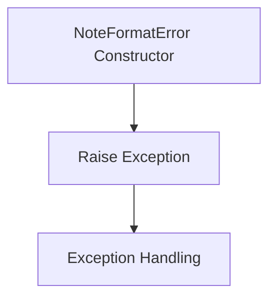
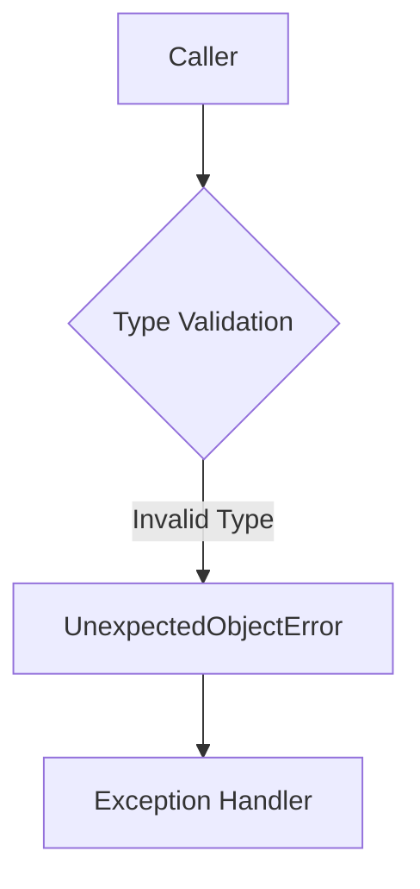
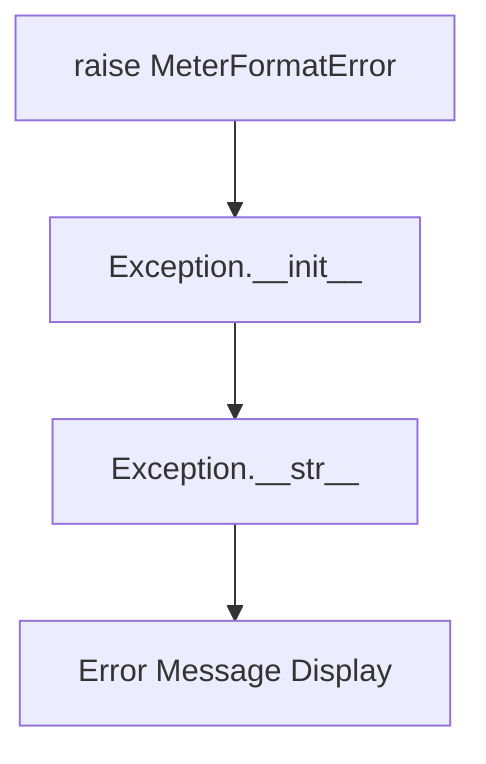
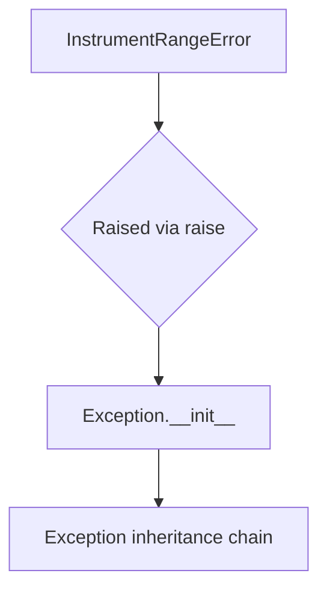

# `mt_exceptions.py`

## `mingus.containers.mt_exceptions.NoteFormatError` · *class*

## Summary:
Represents an exception raised when a musical note is formatted incorrectly.

## Description:
The NoteFormatError class is a custom exception that should be raised when a musical note fails validation due to improper formatting. It inherits from Python's built-in Exception class, making it compatible with standard exception handling mechanisms. This exception serves as a distinct error type to differentiate note formatting issues from other potential errors in musical data processing.

## State:
This class has no instance attributes or state variables. It inherits all behavior from the base Exception class.

## Lifecycle:
Creation: Instances are created by calling the class constructor with optional error message arguments, e.g., NoteFormatError("Invalid note format"). Usage: The exception is typically raised during note validation processes and caught by exception handlers. Destruction: No special cleanup is required as it follows standard Python exception lifecycle management.

## Method Map:


## Raises:
This class itself does not raise any exceptions. It is designed to be raised by other components when note formatting validation fails.

## Example:
```python
try:
    # Some operation that validates note format
    validate_note_format(invalid_note)
except NoteFormatError as e:
    print(f"Note format error occurred: {e}")
```

## `mingus.containers.mt_exceptions.UnexpectedObjectError` · *class*

## Summary:
Represents an exception raised when an unexpected object type is encountered during processing.

## Description:
This exception is raised when a function or method receives an object of an unexpected type or class, indicating a violation of expected input constraints. It serves as a clear semantic marker for type-related validation failures in the mingus music processing system.

## State:
The class inherits from Python's built-in Exception class and has no additional attributes or state. It functions purely as a semantic marker for type-related errors with no internal invariants or constraints.

## Lifecycle:
- Creation: Instantiated directly with optional message argument, e.g., `raise UnexpectedObjectError("Expected MusicObject, got string")`
- Usage: Typically raised during type checking or validation operations to indicate invalid object types
- Destruction: Handled by standard exception handling mechanisms; no special cleanup required

## Method Map:


## Raises:
- None: The constructor does not raise any exceptions as it simply inherits from Exception

## Example:
```python
def process_music_object(obj):
    if not isinstance(obj, MusicObject):
        raise UnexpectedObjectError(f"Expected MusicObject, got {type(obj).__name__}")
    
# Usage:
try:
    process_music_object("invalid_input")
except UnexpectedObjectError as e:
    print(f"Error: {e}")
```

## `mingus.containers.mt_exceptions.MeterFormatError` · *class*

## Summary:
Represents an exception raised when a meter format is invalid or improperly structured.

## Description:
The MeterFormatError class is a custom exception that should be raised when encountering malformed or invalid meter specifications in musical notation processing. This exception serves as a distinct error type to differentiate meter format issues from other potential exceptions in the system.

## State:
This class inherits from Python's built-in Exception class and does not define any additional attributes or properties beyond those inherited from Exception.

## Lifecycle:
Creation: Instances are created by raising the exception directly with `raise MeterFormatError("message")` or by calling the constructor with an optional message argument.

Usage: The exception is typically raised during validation of meter specifications in musical containers, such as when parsing or constructing time signatures.

Destruction: As a standard Python exception, no special cleanup is required; it follows normal Python exception handling semantics.

## Method Map:


## Raises:
The class itself does not raise any exceptions, but instances of this class can be raised during program execution when meter format validation fails.

## Example:
```python
# Raising the exception
raise MeterFormatError("Invalid meter format: expected '4/4' but got '4/5'")

# Catching the exception
try:
    # Some operation that validates meter format
    validate_meter("invalid_format")
except MeterFormatError as e:
    print(f"Meter format error occurred: {e}")
```

## `mingus.containers.mt_exceptions.InstrumentRangeError` · *class*

## Summary:
Represents an exception that is raised when an instrument's range is exceeded during musical operations.

## Description:
This class serves as a specialized exception type for handling cases where musical operations attempt to use notes or pitches that fall outside the playable range of a given instrument. It extends Python's built-in Exception class and provides a clear semantic signal that the error stems from instrument range limitations rather than other types of errors.

The InstrumentRangeError is typically raised by components in the mingus system when processing musical data that involves instruments with specific pitch ranges, such as when validating note frequencies or pitch classes against an instrument's capabilities.

## State:
The class has no instance attributes beyond those inherited from Exception. As a minimal exception subclass, it inherits standard exception behavior including message storage and traceback information.

## Lifecycle:
Creation: Instances are created by raising the exception directly with `raise InstrumentRangeError("message")` or by calling the constructor with an optional error message string.

Usage: The exception is typically raised during musical data validation or processing when a note or pitch exceeds the acceptable range for a particular instrument.

Destruction: Like all Python exceptions, cleanup is handled automatically by the runtime environment when the exception propagates out of scope.

## Method Map:


## Raises:
The constructor does not explicitly raise any exceptions. However, like all Exception subclasses, it can be raised during normal program execution when the system detects an instrument range violation.

## Example:
```python
# Raising the exception
raise InstrumentRangeError("Note C8 is outside the piano's playable range")

# Catching the exception
try:
    process_musical_note(note, instrument)
except InstrumentRangeError as e:
    print(f"Range violation: {e}")
```

