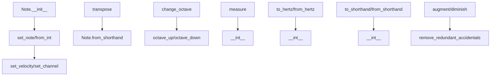

# `note.py`

## `mingus.containers.note.Note` · *class*

## Summary:
Represents a musical note with pitch, octave, and MIDI dynamics information.

## Description:
The Note class encapsulates musical note information including pitch name, octave number, and MIDI-specific attributes like channel and velocity. It provides methods for manipulating note properties such as transposition, octave changes, and conversion between different note representations. The class supports various initialization methods including string names, integers, and other Note objects, making it flexible for different use cases in music composition and processing.

## State:
- name (str): Pitch name of the note (e.g., "C", "D#", "Eb"). Must be a valid note name according to mingus.core.notes.is_valid_note().
- octave (int): Octave number (typically 0-9). Must be non-negative.
- channel (int): MIDI channel number (0-15). Default is 0.
- velocity (int): MIDI velocity value (0-127). Default is 64.

## Lifecycle:
- Creation: Notes can be created using string names ("C", "D#"), integers (MIDI note numbers), or other Note objects. The constructor handles different input types appropriately.
- Usage: Typically used for representing musical notes in compositions, performing operations like transposition, octave adjustment, and conversions between different formats.
- Destruction: No special cleanup required; uses standard Python garbage collection.

## Method Map:


## Raises:
- NoteFormatError: Raised when invalid note names are provided during initialization or when parsing note representations.
- ValueError: Raised when MIDI channel or velocity values are outside their valid ranges (0-15 for channel, 0-127 for velocity).

## Example:
```python
# Create a note
note = Note("C", 4)  # Middle C
print(note)  # 'C-4'

# Change octave
note.octave_up()
print(note)  # 'C-5'

# Transpose up a fifth
note.transpose("P5")
print(note)  # 'G-5'

# Convert to MIDI integer
midi_number = int(note)  # 79

# Convert to frequency
frequency = note.to_hertz()  # ~415.30 Hz
```

### `mingus.containers.note.Note.__init__` · *method*

## Summary:
Initializes a Note object with a name, octave, and optional dynamics parameters, supporting multiple input formats for note specification.

## Description:
The Note.__init__ method serves as the primary constructor for Note objects, accepting various input formats for note identification including string names, Note instances, or integer representations. It processes velocity and channel parameters, integrating them into the dynamics dictionary before delegating to appropriate initialization methods. This design allows for flexible construction of Note objects from different data types while maintaining consistent internal state management.

The method handles three main input patterns:
1. String names (e.g., "C", "D#") - delegates to set_note()
2. Note instances - extracts name, octave, and dynamics from the source Note
3. Integer values - delegates to from_int()

## Args:
    name (str, Note, int): The note identifier, which can be a string name (e.g., "C", "D#"), another Note instance, or an integer representing a note value. Defaults to "C".
    octave (int): The octave number, typically 0-9. Defaults to 4.
    dynamics (dict): Optional dictionary containing velocity and/or channel settings. Defaults to None.
    velocity (int): Optional direct velocity setting (0-127). Defaults to None.
    channel (int): Optional direct channel setting (0-15). Defaults to None.

## Returns:
    None: This method initializes the object in-place and does not return a value.

## Raises:
    NoteFormatError: When the name parameter is not a recognized type (string, Note instance, or integer) or when the note name is invalid.

## State Changes:
    Attributes READ: None
    Attributes WRITTEN: self.name, self.octave, self.dynamics

## Constraints:
    Preconditions: The name parameter must be either a string, Note instance, or integer; if a string, it must be a valid note name; if an integer, it must be a valid note representation.
    Postconditions: The Note object is properly initialized with name, octave, and dynamics attributes set according to the input parameters.

## Side Effects:
    Modifies the dynamics dictionary by adding velocity and channel values if provided as separate parameters.
    Calls either self.set_note() or self.from_int() methods, which may modify other attributes.

### `mingus.containers.note.Note.dynamics` · *method*

## Summary:
Returns a dictionary containing the MIDI channel and velocity dynamics of the note.

## Description:
This method provides access to the dynamic properties of a Note instance, specifically its MIDI channel and velocity values. It is implemented as a property to allow convenient access to these values without requiring explicit method calls. The method is typically used when serializing or transmitting note data that needs to preserve dynamic information.

## Args:
    None

## Returns:
    dict: A dictionary with two keys:
        - "channel" (int): The MIDI channel number (0-15)
        - "velocity" (int): The MIDI velocity value (0-127)

## Raises:
    None

## State Changes:
    - Attributes READ: self.channel, self.velocity
    - Attributes WRITTEN: None

## Constraints:
    - Preconditions: The Note instance must have valid channel and velocity attributes
    - Postconditions: The returned dictionary contains the current channel and velocity values

## Side Effects:
    None

### `mingus.containers.note.Note.set_channel` · *method*

## Summary:
Sets the MIDI channel for a note object, validating that the channel is within the valid range of 0-15.

## Description:
This method assigns a MIDI channel value to the note's channel attribute. It validates that the provided channel number falls within the standard MIDI channel range (0-15) and raises a ValueError if the constraint is violated. This validation ensures that the note object maintains valid MIDI channel data.

## Args:
    channel (int): The MIDI channel number to assign, must be between 0 and 15 inclusive.

## Returns:
    None: This method does not return any value.

## Raises:
    ValueError: Raised when the channel parameter is less than 0 or greater than or equal to 16.

## State Changes:
    Attributes READ: None
    Attributes WRITTEN: self.channel

## Constraints:
    Preconditions: The channel parameter must be an integer.
    Postconditions: After execution, self.channel will contain the validated channel value.

## Side Effects:
    None: This method only modifies the object's internal state and has no external side effects.

### `mingus.containers.note.Note.set_velocity` · *method*

## Summary:
Sets the MIDI velocity value for the note, validating that it falls within the valid MIDI velocity range.

## Description:
This method assigns a velocity value to the note's velocity attribute, ensuring it conforms to MIDI standards where velocity values must be integers between 0 and 127 (inclusive of 0, exclusive of 128). This validation prevents invalid velocity values from being assigned to notes, maintaining data integrity in musical applications.

## Args:
    velocity (int): The MIDI velocity value to assign, must be an integer between 0 and 127 inclusive.

## Returns:
    None: This method does not return any value.

## Raises:
    ValueError: Raised when the velocity parameter is outside the valid MIDI range of 0-127.

## State Changes:
    Attributes READ: None
    Attributes WRITTEN: self.velocity

## Constraints:
    Preconditions: The velocity argument must be an integer within the range [0, 127).
    Postconditions: After execution, self.velocity will hold the validated velocity value.

## Side Effects:
    None: This method only modifies the object's internal state and has no external side effects.

### `mingus.containers.note.Note.set_note` · *method*

## Summary:
Sets the note name and octave for a Note object, with optional velocity and channel configuration from parameters or dynamics dictionary.

## Description:
Configures the core note properties (name and octave) while handling dynamic parameter assignment for velocity and channel. This method serves as the primary interface for initializing or updating a Note's musical identity and associated MIDI attributes. It processes note names in various formats (standard note names like "C", "D#", or "Eb", or hyphenated format like "C-4") and validates them against the music library's note definitions.

The method prioritizes direct parameter values over those in the dynamics dictionary, enabling flexible configuration of note properties. It also handles validation of note names and proper parsing of hyphenated note-octave combinations.

## Args:
    name (str): The note name, e.g., "C", "D#", "Eb". Defaults to "C".
    octave (int): The octave number, typically 0-9. Defaults to 4.
    dynamics (dict): Optional dictionary containing velocity and/or channel settings. Defaults to None.
    velocity (int): Optional direct velocity setting (0-127). Defaults to None.
    channel (int): Optional direct channel setting (0-15). Defaults to None.

## Returns:
    self: Returns the Note instance to enable method chaining.

## Raises:
    NoteFormatError: When the note name is invalid or improperly formatted (e.g., contains unsupported characters or incorrect hyphenation).

## State Changes:
    Attributes READ: None
    Attributes WRITTEN: self.name, self.octave

## Constraints:
    Preconditions: The note name must be valid according to mingus.core.notes.is_valid_note(), and octave must be an integer.
    Postconditions: The Note object's name and octave attributes are updated, and velocity/channel are configured if provided via parameters or dynamics dict.

## Side Effects:
    Calls self.set_velocity() and self.set_channel() methods when velocity or channel parameters are provided, potentially modifying those attributes.

### `mingus.containers.note.Note.empty` · *method*

## Summary:
Resets the note object to its default empty state with no note name, octave 0, and default MIDI channel and velocity settings.

## Description:
The `empty` method clears the current note information by setting the note name to an empty string and octave to 0, while restoring the MIDI channel and velocity to their default values. This method provides a clean reset mechanism for note objects, allowing them to be reused or reinitialized without creating a new instance. It's particularly useful when a note needs to be cleared before assigning new values or when implementing note pooling strategies.

This method is part of the Note class and serves as a convenient way to reset a note's state to its initial condition without requiring the creation of a new object.

## Args:
    None

## Returns:
    None

## Raises:
    None

## State Changes:
    Attributes READ: None
    Attributes WRITTEN: 
    - self.name: Set to empty string ""
    - self.octave: Set to 0
    - self.channel: Set to _DEFAULT_CHANNEL
    - self.velocity: Set to _DEFAULT_VELOCITY

## Constraints:
    Preconditions: None
    Postconditions: The note object will have name="", octave=0, and channel/velocity set to their respective default values

## Side Effects:
    None

### `mingus.containers.note.Note.augment` · *method*

## Summary:
Increases the pitch of a musical note by one semitone by adding an accidental.

## Description:
This method applies an augmentation operation to the note, raising its pitch by one semitone. It is typically used in musical contexts where note manipulation is required, such as in composition or analysis. The method delegates the actual augmentation logic to the `notes.augment` function from the mingus.core module.

The augmentation process works as follows:
- If the note does not end with a flat symbol ("b"), it appends a sharp symbol ("#") to raise the pitch
- If the note ends with a flat symbol ("b"), it removes the flat symbol to raise the pitch

## Args:
    None

## Returns:
    None

## Raises:
    None

## State Changes:
    Attributes READ: self.name
    Attributes WRITTEN: self.name

## Constraints:
    Preconditions: The note name stored in self.name must be a valid musical note string that can be processed by the notes.augment function.
    Postconditions: The note name in self.name will be modified to represent the augmented version of the original note.

## Side Effects:
    None

### `mingus.containers.note.Note.diminish` · *method*

## Summary:
Reduces the pitch of a musical note by one semitone by applying a flat accident.

## Description:
This method modifies the note's name attribute by flattening it using the core notes.diminish function. It is typically called during musical interval or chord construction operations where note modifications are required. The method handles both natural notes and sharped notes appropriately, converting sharps to flats when needed.

## Args:
    None

## Returns:
    None

## Raises:
    None

## State Changes:
    Attributes READ: self.name
    Attributes WRITTEN: self.name

## Constraints:
    Preconditions: The note name must be a valid string representation of a musical note.
    Postconditions: The note name will be modified to represent a flattened version of the original note. If the note is already flat, it will be reduced to a natural note.

## Side Effects:
    None

### `mingus.containers.note.Note.change_octave` · *method*

## Summary:
Changes the octave of a musical note by a specified difference, ensuring the octave never goes below zero.

## Description:
This method adjusts the octave attribute of a Note object by adding the provided difference value. It is designed to be a reusable component for octave manipulation in musical applications. The method ensures that octaves never drop below zero, which prevents invalid musical note representations. This logic is encapsulated in its own method rather than being inlined because it represents a distinct musical operation that may be reused in various contexts, such as transposition or dynamic octave adjustments.

## Args:
    diff (int): The amount by which to change the octave. Can be positive or negative.

## Returns:
    None: This method modifies the object in-place and does not return a value.

## Raises:
    None: This method does not explicitly raise any exceptions.

## State Changes:
    Attributes READ: self.octave
    Attributes WRITTEN: self.octave

## Constraints:
    Preconditions: The Note object must have an octave attribute that can be added to the diff parameter.
    Postconditions: The octave attribute will be updated to the new value, but will never be less than 0.

## Side Effects:
    None: This method only modifies the internal state of the Note object and has no external side effects.

### `mingus.containers.note.Note.octave_up` · *method*

## Summary:
Increases the octave of a musical note by one octave.

## Description:
This method raises the octave of the current note by exactly one octave (12 semitones). It serves as a convenient shorthand for calling `change_octave(1)` and is part of the musical note manipulation toolkit. The method is designed to be a simple, readable interface for common octave-up operations, making the code more expressive and reducing boilerplate.

## Args:
    None: This method takes no arguments beyond the implicit `self`.

## Returns:
    None: This method modifies the object in-place and does not return a value.

## Raises:
    None: This method does not explicitly raise any exceptions.

## State Changes:
    Attributes READ: self.octave
    Attributes WRITTEN: self.octave

## Constraints:
    Preconditions: The Note object must be properly initialized with a valid octave attribute.
    Postconditions: The octave attribute will be incremented by 1, but will never be less than 0 due to the underlying `change_octave` implementation.

## Side Effects:
    None: This method only modifies the internal state of the Note object and has no external side effects.

### `mingus.containers.note.Note.octave_down` · *method*

## Summary:
Decrements the octave of a musical note by one level.

## Description:
This method reduces the octave of a musical note by one octave (equivalent to calling change_octave with -1). It is a convenience method that provides a clear, semantic way to lower the pitch of a note by one octave. The method delegates to the existing change_octave method, which handles the actual octave adjustment and ensures the octave never goes below zero.

This logic is encapsulated in its own method rather than being inlined because it provides a more readable and intuitive interface for common octave-down operations, improving code clarity and maintainability.

## Args:
    None: This method takes no arguments beyond the implicit self parameter.

## Returns:
    None: This method modifies the object in-place and does not return a value.

## Raises:
    None: This method does not explicitly raise any exceptions.

## State Changes:
    Attributes READ: self.octave
    Attributes WRITTEN: self.octave

## Constraints:
    Preconditions: The Note object must be properly initialized with an octave attribute.
    Postconditions: The octave attribute will be decremented by 1, but will never be less than 0.

## Side Effects:
    None: This method only modifies the internal state of the Note object and has no external side effects.

### `mingus.containers.note.Note.remove_redundant_accidentals` · *method*

## Summary:
Removes redundant accidentals from the note's name attribute by normalizing enharmonic equivalents to their simplest form.

## Description:
This method standardizes the representation of a note by eliminating redundant accidentals through enharmonic normalization. It transforms notes like "C##" to "D", "B#" to "C", or "Dbb" to "C" into their most basic enharmonic equivalents. This ensures consistent musical notation representation throughout the application.

The method delegates to the core `notes.remove_redundant_accidentals` function which:
1. Counts the net number of sharps and flats in the note name
2. Converts this count to the simplest enharmonic equivalent
3. Returns the normalized note name

## Args:
    None

## Returns:
    None

## Raises:
    None

## State Changes:
    Attributes READ: self.name
    Attributes WRITTEN: self.name

## Constraints:
    Preconditions: The note's name attribute must be a valid note string following standard musical notation conventions (e.g., "C", "C#", "Db", "B##", "Ebb", etc.).
    Postconditions: The self.name attribute will contain a normalized note name with redundant accidentals removed, representing the same pitch class in its simplest enharmonic form.

## Side Effects:
    None

### `mingus.containers.note.Note.transpose` · *method*

## Summary:
Transposes the note by a specified interval, potentially adjusting the octave when crossing note boundaries.

## Description:
The transpose method modifies a Note object by shifting it up or down by a specified musical interval. It updates the note's name according to the interval calculation and adjusts the octave when necessary to maintain proper musical positioning. This method handles both ascending and descending transposition while ensuring that octave changes occur appropriately when crossing note boundaries.

The method is designed as a separate component because musical transposition involves complex logic for handling octave adjustments that would be difficult to inline. It encapsulates the entire transposition process including name modification and octave adjustment, making it reusable and testable.

Known callers include:
- Direct method calls on Note instances to modify their pitch
- Musical composition or analysis pipelines that require pitch manipulation
- Internal operations in music processing systems that need to shift notes by intervals

## Args:
    interval (str): A string representing the musical interval (e.g., 'm3', 'P5') to transpose by
    up (bool): Direction of transposition, True for upward, False for downward. Defaults to True

## Returns:
    None: This method modifies the Note object in-place and does not return a value

## Raises:
    None explicitly raised

## State Changes:
    Attributes READ: self.name, self.octave
    Attributes WRITTEN: self.name, self.octave

## Constraints:
    Preconditions: The note name must be valid (passing notes.is_valid_note check) and the interval must be properly formatted
    Postconditions: The note object will have its name and possibly octave updated to reflect the transposition

## Side Effects:
    None

### `mingus.containers.note.Note.from_int` · *method*

## Summary:
Converts an integer representation of a musical note into its corresponding note name and octave.

## Description:
This method transforms an integer into a note by mapping the remainder modulo 12 to a note name and using integer division by 12 to determine the octave. It is designed to be a convenient way to initialize or update a Note object from an integer value representing MIDI note numbers or similar numeric representations. The method leverages the notes.int_to_note function to convert the modulo result into a note name.

## Args:
    integer (int): An integer representing a musical note, where 0-11 maps to C-B, and each increment of 12 increases the octave by one.

## Returns:
    Note: Returns self to enable method chaining.

## Raises:
    RangeError: If the integer modulo 12 is outside the valid range of 0-11, which would be raised by the underlying notes.int_to_note function.

## State Changes:
    Attributes READ: None
    Attributes WRITTEN: self.name, self.octave

## Constraints:
    Preconditions: The integer argument should be a valid integer that can be processed by the underlying note conversion functions.
    Postconditions: The Note object's name and octave attributes will be updated to reflect the converted note.

## Side Effects:
    None

### `mingus.containers.note.Note.measure` · *method*

## Summary:
Calculates the interval distance between this note and another note in semitone units.

## Description:
This method computes the difference in semitones between the current note and another note, returning a signed integer representing how many semitones apart they are. It's primarily used for determining musical intervals and transposition calculations.

The method leverages the Note class's __int__ method to convert both notes to their MIDI pitch integer representations, then performs simple arithmetic subtraction. This approach ensures accurate interval calculation regardless of note format (string, integer, or other Note instances). It's typically called during musical operations such as transposition, interval measurement, or chord construction where the relationship between notes needs to be quantified.

## Args:
    other: Any object that can be converted to an integer representation of a musical note (e.g., another Note instance, integer note value, or note string)

## Returns:
    int: The signed interval distance in semitones. Positive values indicate the other note is higher, negative values indicate the other note is lower.

## Raises:
    NoteFormatError: If the other object cannot be properly converted to an integer note representation

## State Changes:
    Attributes READ: None
    Attributes WRITTEN: None

## Constraints:
    Preconditions: The other parameter must be convertible to an integer note representation via int() conversion
    Postconditions: The returned value represents the semitone distance between self and other

## Side Effects:
    None

### `mingus.containers.note.Note.to_hertz` · *method*

## Summary:
Converts a musical note to its corresponding frequency in Hertz using the standard tuning pitch.

## Description:
This method calculates the frequency in Hertz for the current note based on the standard tuning pitch (default 440 Hz for A4). It uses the mathematical relationship between musical notes and frequencies, where each semitone interval corresponds to a multiplication factor of 2^(1/12). The calculation is based on the fact that A4 (note 57 in MIDI numbering) is defined as 440 Hz, and all other notes are calculated relative to this reference point. This method leverages the note's integer representation to compute the frequency difference from the reference note.

## Args:
    standard_pitch (float): The reference tuning pitch in Hertz. Defaults to 440.0 Hz, which is the standard tuning pitch for A4.

## Returns:
    float: The frequency of the note in Hertz.

## Raises:
    None explicitly raised

## State Changes:
    Attributes READ: self.__int__()
    Attributes WRITTEN: None

## Constraints:
    Preconditions: The note object must be properly initialized with valid note name and octave attributes. The note's integer representation must be valid.
    Postconditions: The returned value is a positive floating-point number representing the frequency in Hertz.

## Side Effects:
    None

### `mingus.containers.note.Note.from_hertz` · *method*

## Summary:
Converts a frequency in Hertz to a musical note by calculating the corresponding note name and octave, updating the instance attributes.

## Description:
This method transforms a frequency value in Hertz into a musical note representation using a logarithmic formula. It calculates the MIDI note number from the frequency, then maps that to a note name and octave. The calculation accounts for standard tuning (default 440Hz) and uses a specific formula that maps frequencies to musical notes with proper octave assignment. This method is intended to be used as a constructor-like initializer for Note objects from frequency data.

## Args:
    hertz (float): The frequency in Hertz to convert to a musical note. Must be positive.
    standard_pitch (float): The reference pitch in Hertz for tuning calculations. Defaults to 440.0.

## Returns:
    Note: The instance itself (self), enabling method chaining.

## Raises:
    None explicitly raised by this method, though underlying functions may raise exceptions.

## State Changes:
    Attributes READ: None
    Attributes WRITTEN: self.name, self.octave

## Constraints:
    Preconditions: The hertz argument must be a positive number.
    Postconditions: The Note instance will have its name and octave attributes set according to the frequency conversion.

## Side Effects:
    None

### `mingus.containers.note.Note.to_shorthand` · *method*

## Summary:
Converts a musical note object into its standard shorthand notation string representation.

## Description:
This method transforms a Note object into a compact string representation commonly used in music notation. The shorthand format uses uppercase letters for notes in octave 2 and below, lowercase letters for notes in octave 3 and above, with comma and apostrophe modifiers to indicate octaves above/below the reference octave 3. This method is designed to provide a standardized textual representation of musical notes for display and serialization purposes.

## Args:
    None

## Returns:
    str: A shorthand notation string representing the note, such as "C", "c", "C,", "c'", etc. The format follows these rules:
        - Notes in octave 2 and below use uppercase note names (e.g., "C", "D#")
        - Notes in octave 3 and above use lowercase note names (e.g., "c", "d#")
        - Comma (",") indicates one octave below the reference octave 3
        - Apostrophe ("'") indicates one octave above the reference octave 3

## Raises:
    None

## State Changes:
    Attributes READ: self.name, self.octave
    Attributes WRITTEN: None

## Constraints:
    Preconditions: The Note object must have valid name and octave attributes
    Postconditions: The returned string follows standard musical shorthand conventions

## Side Effects:
    None

### `mingus.containers.note.Note.from_shorthand` · *method*

## Summary:
Parses a shorthand note notation string and configures the note object with the corresponding note name and octave.

## Description:
This method converts a shorthand musical note representation into a proper note object by parsing the input string character by character. It handles lowercase and uppercase note names, accidentals (# or b), and octave indicators (comma for lower octave, apostrophe for higher octave). The parsed information is then used to configure the note's name and octave through the set_note method.

Known callers:
- This method is likely called during note initialization or parsing from string representations in musical applications.

## Args:
    shorthand (str): A string representing a musical note in shorthand format, such as "c'", "d#,,", or "Eb'".

## Returns:
    self: The note instance with updated name and octave attributes.

## Raises:
    NoteFormatError: When the note name portion of the shorthand string is invalid.

## State Changes:
    Attributes READ: None
    Attributes WRITTEN: name, octave

## Constraints:
    Preconditions: The shorthand string must contain valid note characters and proper formatting.
    Postconditions: The note object's name and octave attributes are set according to the shorthand notation.

## Side Effects:
    None

### `mingus.containers.note.Note.__int__` · *method*

## Summary:
Converts a musical note into its corresponding MIDI pitch integer value.

## Description:
This method implements the conversion from a musical note representation (name and octave) to a MIDI pitch number. It computes the MIDI value by taking the octave number multiplied by 12 (representing the 12 semitones in an octave), adding the base pitch value of the note name (using the note_to_int utility function), and then applying any accidentals (sharps or flats) to adjust the pitch accordingly.

## Args:
    None

## Returns:
    int: The MIDI pitch number representing this note, where C4 = 60, C#4 = 61, Db4 = 61, etc.

## Raises:
    NoteFormatError: If the note name contains invalid characters or the note name itself is not recognized.

## State Changes:
    Attributes READ: self.octave, self.name
    Attributes WRITTEN: None

## Constraints:
    Preconditions: The note object must have a valid name attribute containing a valid note name (like 'C', 'D#', 'Eb') followed by optional accidentals ('#' or 'b'), and a valid octave attribute.
    Postconditions: The returned integer represents a valid MIDI pitch value in the range [0, 127] for standard MIDI notes.

## Side Effects:
    None

### `mingus.containers.note.Note.__lt__` · *method*

## Summary:
Compares two Note objects for less-than ordering by converting them to integer representations.

## Description:
This method implements the less-than comparison operator (`<`) for Note objects. It enables sorting and ordering of Note instances, allowing them to be compared using standard comparison operators. The method converts both the current Note instance and the other object to integers using the `int()` conversion and compares those integer values.

The `int()` conversion for Note objects maps note names to numerical values (e.g., C=0, C#=1, D=2, etc.), enabling ordinal comparisons between musical notes. This method is part of the Note class's rich comparison protocol implementation, working alongside `__gt__`, `__eq__`, `__le__`, and `__ge__` methods to provide full ordering capabilities.

Known callers include:
- Direct usage in comparison expressions like `note1 < note2`
- Internal use by Python's sorting functions when comparing Note objects
- Usage in conditional logic that requires ordering relationships between notes

This logic is implemented as a separate method rather than being inlined because it follows Python's rich comparison protocol conventions and maintains consistency with other comparison operators in the class.

## Args:
    other (Note or None): Another Note object or None to compare against

## Returns:
    bool: True if the integer representation of self is less than the integer representation of other, False otherwise

## Raises:
    None explicitly raised

## State Changes:
    Attributes READ: None
    Attributes WRITTEN: None

## Constraints:
    Preconditions: The other object must be either a Note instance or None
    Postconditions: Returns a boolean value representing the comparison result

## Side Effects:
    None

### `mingus.containers.note.Note.__eq__` · *method*

## Summary:
Compares two Note objects for equality based on their integer representations.

## Description:
This method implements the equality comparison operator (`==`) for Note objects. It converts both the current Note instance and the compared object to their integer representations using the `__int__` method and compares these values. This approach ensures that two notes with the same pitch and octave are considered equal regardless of their internal representation or additional dynamics properties.

## Args:
    other (Note or None): Another Note object or None to compare against

## Returns:
    bool: True if both notes have the same integer representation, False otherwise

## Raises:
    None explicitly raised

## State Changes:
    Attributes READ: None
    Attributes WRITTEN: None

## Constraints:
    Preconditions: The `other` parameter can be a Note object or None
    Postconditions: Returns a boolean indicating equality based on integer values

## Side Effects:
    None

### `mingus.containers.note.Note.__ne__` · *method*

## Summary:
Implements the inequality comparison operator for Note objects by negating the equality comparison result.

## Description:
This method defines the behavior of the `!=` operator for Note instances. It leverages the existing `__eq__` method to determine inequality by returning the logical negation of the equality check. This approach ensures consistency between equality and inequality operations.

The method is called during comparison operations when the `!=` operator is used between two Note objects, such as in conditional statements or assertions that test for inequality. When comparing with None, it delegates to the `__eq__` method which properly handles None comparisons.

This logic is implemented as a separate method rather than being inlined because it follows Python's standard protocol for implementing comparison operators and maintains symmetry with the `__eq__` method, ensuring that equality and inequality operations are consistently defined.

## Args:
    other (Note or None): Another Note object or None to compare against

## Returns:
    bool: True if the notes are not equal, False if they are equal. When other is None, returns False.

## Raises:
    None explicitly raised

## State Changes:
    Attributes READ: self.name, self.octave
    Attributes WRITTEN: None

## Constraints:
    Preconditions: The `other` parameter can be a Note instance or None
    Postconditions: Returns a boolean value indicating inequality between self and other

## Side Effects:
    None

### `mingus.containers.note.Note.__gt__` · *method*

## Summary:
Compares two Note objects to determine if the current note is greater than the other note.

## Description:
This method implements the greater-than comparison operator (>) for Note objects. It determines whether the current note has a higher pitch value than another note by logically negating the result of the OR operation between less-than and equal comparisons. This approach leverages existing comparison methods (__lt__ and __eq__) to avoid duplicating comparison logic.

The method follows the mathematical principle that A > B is equivalent to NOT(A < B OR A = B), which ensures consistent ordering behavior with other comparison operators.

## Args:
    other (Note or None): Another Note object to compare against, or None

## Returns:
    bool: True if the current note is greater than the other note, False otherwise

## Raises:
    None explicitly raised

## State Changes:
    Attributes READ: self.name, self.octave
    Attributes WRITTEN: None

## Constraints:
    Preconditions: The other object must be a Note instance or None
    Postconditions: Returns a boolean value representing the comparison result

## Side Effects:
    None

### `mingus.containers.note.Note.__le__` · *method*

## Summary:
Implements the less-than-or-equal comparison operator for Note objects, determining if the current note has a pitch value less than or equal to another note.

## Description:
This method provides the implementation for the `<=` comparison operator for Note objects. It returns True if the current note is less than or equal to the compared note, based on their musical pitch values. The method leverages existing comparison logic by combining the results of the less-than (`__lt__`) and equality (`__eq__`) comparisons.

This method is part of the Note class's rich comparison protocol implementation, enabling proper ordering of musical notes for sorting and comparison operations. It follows the mathematical relationship: `a <= b` is equivalent to `a < b or a == b`.

Known callers include:
- Direct usage in comparison expressions like `note1 <= note2`
- Internal use by Python's sorting functions when comparing Note objects
- Usage in conditional logic that requires ordering relationships between notes

This logic is implemented as a separate method rather than being inlined because it follows Python's rich comparison protocol conventions and maintains consistency with other comparison operators (__lt__, __eq__, __gt__, __ge__) in the class.

## Args:
    other (Note or None): Another Note object or None to compare against

## Returns:
    bool: True if the current note's pitch value is less than or equal to the other note's pitch value; False otherwise

## Raises:
    None explicitly raised

## State Changes:
    Attributes READ: self.name, self.octave
    Attributes WRITTEN: None

## Constraints:
    Preconditions: The other parameter must be a Note instance or None
    Postconditions: Returns a boolean value representing the comparison result

## Side Effects:
    None

### `mingus.containers.note.Note.__ge__` · *method*

## Summary:
Returns whether this note is greater than or equal to another note based on their musical pitch values.

## Description:
This method implements the greater-than-or-equal comparison operator (>=) for Note objects. It leverages the existing less-than comparison (__lt__) method to determine the result, making it consistent with Python's rich comparison protocol. This method is part of the Note class's implementation of ordered comparisons and is used primarily in sorting and ordering operations involving musical notes.

The implementation follows the mathematical relationship: `a >= b` is equivalent to `not (a < b)`. This approach ensures consistency with other comparison operators in the class and avoids redundant logic.

## Args:
    other (Note or None): Another Note object to compare against, or None

## Returns:
    bool: True if this note's pitch value is greater than or equal to the other note's pitch value; False otherwise

## Raises:
    None explicitly raised

## State Changes:
    Attributes READ: self.name, self.octave
    Attributes WRITTEN: None

## Constraints:
    Preconditions: The other object must be either a Note instance or None
    Postconditions: Returns a boolean value representing the comparison result

## Side Effects:
    None

### `mingus.containers.note.Note.__repr__` · *method*

## Summary:
Returns a string representation of the note in the format "'note-octave'" for debugging and display purposes.

## Description:
This method provides a standardized string representation of a Note object, primarily intended for debugging and logging. It is automatically called when the built-in repr() function is applied to a Note instance, or when the object is displayed in interactive environments. The method formats the note's name and octave into a readable string format.

## Args:
    None

## Returns:
    str: A string in the format "'note-octave'" where note is the note name (e.g., "C", "D#") and octave is the octave number (integer).

## Raises:
    None

## State Changes:
    Attributes READ: self.name, self.octave
    Attributes WRITTEN: None

## Constraints:
    Preconditions: The Note object must have valid name and octave attributes that are accessible.
    Postconditions: The returned string follows the format "'note-octave'" with proper quoting and formatting.

## Side Effects:
    None

