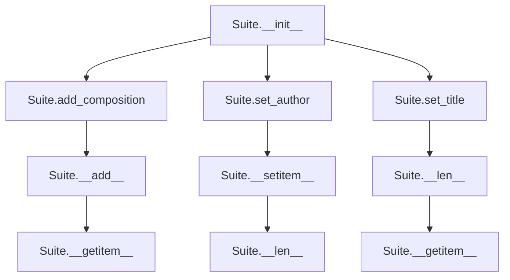

# `suite.py`

## `mingus.containers.suite.Suite` · *class*

## Summary:
A Suite is a container class that groups multiple musical compositions together, providing metadata management and collection operations.

## Description:
The Suite class serves as a logical grouping mechanism for musical compositions, allowing users to organize multiple compositions under a common title, author, and other metadata. It acts as a container that maintains a list of compositions while providing methods to manage the collection and associated metadata. The class is designed to work with mingus.containers.Composition objects specifically, ensuring type safety through validation checks.

## State:
- title (str): The main title of the suite, defaults to "Untitled"
- subtitle (str): An optional subtitle for the suite
- author (str): The author name of the suite, defaults to empty string
- email (str): The author's email address, defaults to empty string
- description (str): A description of the suite, defaults to empty string
- compositions (list): A list of Composition objects contained in this suite

## Lifecycle:
- Creation: Instantiate with `Suite()` constructor, which initializes empty metadata fields and an empty compositions list
- Usage: Add compositions using `add_composition()`, `__add__()`, or direct assignment via `__setitem__()`. Access compositions via `__getitem__()`
- Destruction: No explicit cleanup required; relies on Python's garbage collection

## Method Map:


## Raises:
- UnexpectedObjectError: Raised when attempting to add or assign a non-Composition object to the suite's compositions list

## Example:
```python
# Create a suite
suite = Suite()
suite.set_title("Classical Masterpieces", "A Collection of Famous Works")
suite.set_author("John Doe", "john@example.com")

# Add compositions
composition1 = Composition()  # Assuming Composition exists
composition2 = Composition()
suite.add_composition(composition1)
suite + composition2  # Using __add__ operator

# Access compositions
print(len(suite))  # Length of compositions list
first_comp = suite[0]  # Get first composition
suite[1] = composition1  # Replace second composition
```

### `mingus.containers.suite.Suite.__init__` · *method*

## Summary:
Initializes a Suite instance with default metadata fields and empty compositions list.

## Description:
The `__init__` method initializes a new Suite object with default metadata values and an empty compositions list. This constructor establishes the fundamental structure of a Suite, ensuring all metadata fields are properly initialized with their default values and providing an empty collection for storing compositions.

This method serves as the primary entry point for creating Suite instances and guarantees that every Suite object begins with a consistent, valid state. The initialization process sets up:
- title: defaults to "Untitled"
- subtitle: defaults to empty string  
- author: defaults to empty string
- email: defaults to empty string
- description: defaults to empty string
- compositions: initialized as an empty list

This dedicated initialization method separates object creation logic from other operational methods, making the class design more maintainable and testable.

## Args:
    None

## Returns:
    None

## Raises:
    None

## State Changes:
    Attributes READ: None
    Attributes WRITTEN: 
    - self.title (str): Set to "Untitled"
    - self.subtitle (str): Set to ""
    - self.author (str): Set to ""
    - self.email (str): Set to ""
    - self.description (str): Set to ""
    - self.compositions (list): Set to []

## Constraints:
    Preconditions: None
    Postconditions: 
    - All metadata fields are initialized with their default values
    - self.compositions is initialized as an empty list
    - Suite object is in a valid, ready-to-use state for subsequent operations

## Side Effects:
    None

### `mingus.containers.suite.Suite.add_composition` · *method*

## Summary:
Adds a composition object to the suite's collection of compositions.

## Description:
This method validates that the provided object is a valid composition (has a tracks attribute) and appends it to the suite's compositions list. It follows a fluent interface pattern by returning self to enable method chaining.

## Args:
    composition (object): The composition object to add. Must have a 'tracks' attribute.

## Returns:
    Suite: Returns the suite instance itself to support method chaining.

## Raises:
    UnexpectedObjectError: When the provided object does not have a 'tracks' attribute, indicating it is not a valid composition object.

## State Changes:
    Attributes READ: self.compositions
    Attributes WRITTEN: self.compositions

## Constraints:
    Preconditions: The composition argument must have a 'tracks' attribute.
    Postconditions: The composition is appended to self.compositions list.

## Side Effects:
    None

### `mingus.containers.suite.Suite.set_author` · *method*

## Summary:
Sets the author and email properties of a Suite instance.

## Description:
Configures the author information for a Suite object by assigning the provided author name and optional email address to the instance's author and email attributes. This method provides a clean interface for updating these metadata fields.

## Args:
    author (str): The name of the author to set.
    email (str): Optional email address of the author. Defaults to an empty string.

## Returns:
    None: This method does not return any value.

## Raises:
    None: This method does not explicitly raise any exceptions.

## State Changes:
    Attributes READ: None
    Attributes WRITTEN: self.author, self.email

## Constraints:
    Preconditions: The Suite instance must be properly initialized and accessible.
    Postconditions: The self.author and self.email attributes will be updated to the provided values.

## Side Effects:
    None: This method does not perform any I/O operations or mutate external objects.

### `mingus.containers.suite.Suite.set_title` · *method*

## Summary:
Sets the title and optional subtitle of a Suite object.

## Description:
This method assigns a main title and optional subtitle to the Suite instance. It is designed to encapsulate the logic for updating these two related attributes in a single operation, making the code more readable and maintainable.

## Args:
    title (str): The main title for the suite.
    subtitle (str, optional): The subtitle for the suite. Defaults to an empty string.

## Returns:
    None: This method does not return any value.

## Raises:
    None: This method does not explicitly raise any exceptions.

## State Changes:
    Attributes READ: None
    Attributes WRITTEN: self.title, self.subtitle

## Constraints:
    Preconditions: The Suite instance must be properly initialized.
    Postconditions: The Suite's title and subtitle attributes will be updated to the provided values.

## Side Effects:
    None: This method only modifies the internal state of the Suite instance and has no external side effects.

### `mingus.containers.suite.Suite.__len__` · *method*

## Summary:
Returns the number of compositions contained in the suite.

## Description:
This method provides the length of the suite by returning the count of compositions stored in the suite's compositions list. It serves as a standard Python magic method that enables the use of the built-in `len()` function on Suite instances.

## Args:
    None

## Returns:
    int: The number of compositions in the suite's compositions list.

## Raises:
    None

## State Changes:
    Attributes READ: self.compositions
    Attributes WRITTEN: None

## Constraints:
    Preconditions: The self.compositions attribute must be a list-like object that supports the built-in `len()` function.
    Postconditions: The method returns an integer representing the count of compositions in the suite.

## Side Effects:
    None

### `mingus.containers.suite.Suite.__getitem__` · *method*

## Summary:
Retrieves a composition from the suite by index position.

## Description:
Provides indexed access to compositions stored within the suite container. This method enables iteration over compositions and direct access to specific compositions by their position in the internal list. It implements Python's sequence protocol, allowing the suite to be used with standard indexing operations like `suite[index]`.

## Args:
    index (int): The zero-based index position of the composition to retrieve.

## Returns:
    Composition: The composition object at the specified index position.

## Raises:
    IndexError: When the index is out of bounds for the compositions list.
    TypeError: When the index is not an integer type.

## State Changes:
    Attributes READ: self.compositions
    Attributes WRITTEN: None

## Constraints:
    Preconditions: The index must be a valid integer within the range [0, len(self.compositions)) or [-len(self.compositions), -1] for negative indices.
    Postconditions: The returned composition object maintains its original state and is not modified by this operation.

## Side Effects:
    None

### `mingus.containers.suite.Suite.__setitem__` · *method*

## Summary:
Sets a composition object at the specified index in the suite's compositions collection, validating that the object has a tracks attribute.

## Description:
This method serves as the indexed assignment operator for the Suite class, enabling users to replace or insert Composition objects at specific positions within the suite's internal compositions list. It validates that the assigned object has a tracks attribute, ensuring type safety and maintaining the integrity of the suite's composition collection.

## Args:
    index (int): The position in the compositions list where the value should be set
    value (object): The object to be stored at the specified index, which must have a tracks attribute

## Returns:
    None: This method does not return a value

## Raises:
    UnexpectedObjectError: When the provided value does not have a tracks attribute, indicating it is not a valid Composition object

## State Changes:
    Attributes READ: self.compositions
    Attributes WRITTEN: self.compositions

## Constraints:
    Preconditions: 
    - The index must be a valid integer index for the compositions list
    - The value must have a tracks attribute to be considered a valid Composition object
    - The compositions list must be initialized and accessible
    
    Postconditions:
    - The compositions list will contain the provided value at the specified index
    - The value at the specified index will have the tracks attribute

## Side Effects:
    None: This method performs no I/O operations or external service calls

### `mingus.containers.suite.Suite.__add__` · *method*

## Summary:
Adds a Composition object to the Suite's collection of compositions.

## Description:
This method serves as the implementation of the Python magic method `__add__`, enabling the use of the `+` operator to add Composition objects to a Suite. It delegates the actual addition logic to the `add_composition` method, which performs validation and appends the composition to the internal list.

## Args:
    composition (Composition): A Composition object to be added to the Suite.

## Returns:
    Suite: The Suite instance itself, allowing for method chaining.

## Raises:
    UnexpectedObjectError: If the provided object does not have a 'tracks' attribute, indicating it is not a valid Composition object.

## State Changes:
    Attributes READ: None
    Attributes WRITTEN: self.compositions

## Constraints:
    Preconditions: The composition argument must be an object with a 'tracks' attribute.
    Postconditions: The composition is appended to the self.compositions list, and the Suite instance is returned.

## Side Effects:
    None

