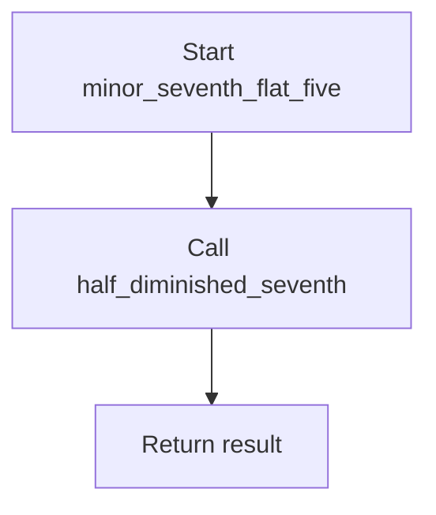
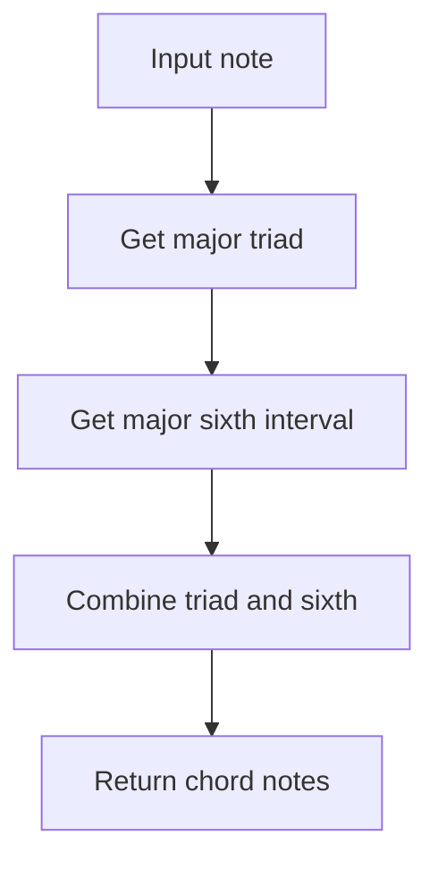
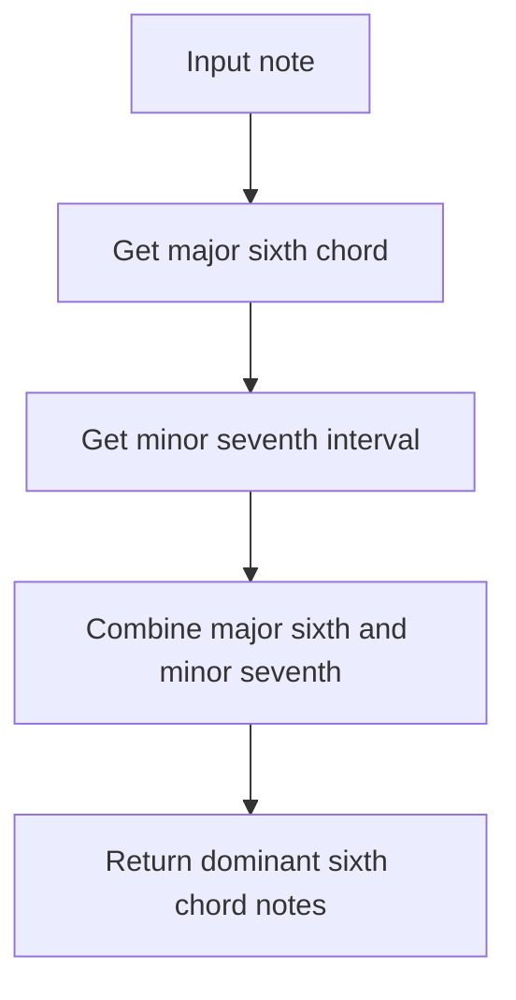
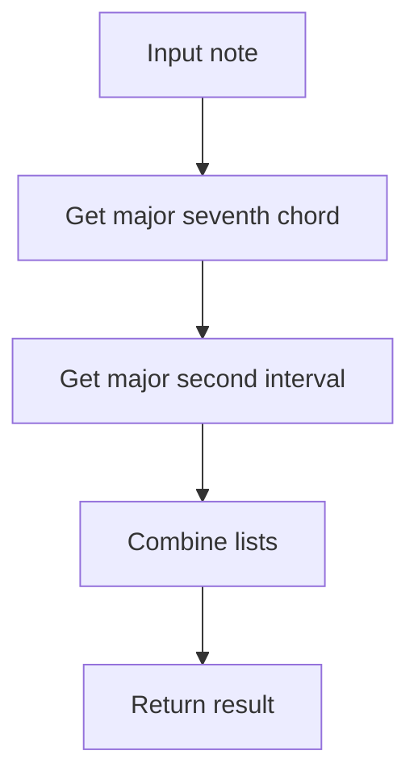

# `chords.py`

## `mingus.core.chords.triad` · *function*

## Summary:
Generates a musical triad by calculating the root note, third, and fifth intervals from a given note and key.

## Description:
Creates a list containing the root note, major third, and perfect fifth of a chord based on the specified note and key. This function encapsulates the logic for constructing basic triads in music theory, allowing for consistent chord construction regardless of the starting note or key. It leverages the intervals module to compute the appropriate notes in the specified key.

## Args:
    note (str): The root note of the triad (e.g., 'C', 'D#'). Must be a valid note string.
    key (str): The musical key from which to derive the triad intervals (e.g., 'C', 'G'). Must be a valid key string.

## Returns:
    list[str]: A list containing three note strings representing the triad: [root, third, fifth].

## Raises:
    KeyError: When the provided note is not a valid note string according to the notes module validation.
    NoteFormatError: When the provided key is not a valid key string according to the keys module validation.

## Constraints:
    Preconditions:
        - The note parameter must be a valid note string recognized by the notes module.
        - The key parameter must be a valid key string recognized by the keys module.
    Postconditions:
        - The returned list will always contain exactly three elements.
        - All elements in the returned list will be valid note strings.

## Side Effects:
    None

## Control Flow:
```mermaid
flowchart TD
    A[triad(note, key)] --> B{Validate note}
    B --> C{note is valid?}
    C -->|No| D[raise KeyError]
    C -->|Yes| E[Get third interval]
    E --> F[Get fifth interval]
    F --> G[Return [note, third, fifth]]
```

## Examples:
    >>> triad('C', 'C')
    ['C', 'E', 'G']
    >>> triad('D', 'G')
    ['D', 'F#', 'A']

## `mingus.core.chords.triads` · *function*

## Summary:
Generates all triads for the given musical key by computing the triad for each note in that key.

## Description:
This function computes all possible triads that can be formed using the notes of a specified musical key. It serves as a factory function that creates a collection of triads, one for each note in the key. The function implements caching to avoid recomputing the same set of triads multiple times, improving performance for repeated queries on the same key.

The function leverages the existing `triad()` function to construct individual triads and uses the `keys.get_notes()` function to obtain all notes in the specified key. This modular approach separates concerns between generating individual triads and generating all triads for a key.

## Args:
    key (str): The musical key for which to generate all triads (e.g., 'C', 'G', 'D#'). Must be a valid key string.

## Returns:
    list[list[str]]: A list of triads, where each triad is represented as a list of three note strings [root, third, fifth].

## Raises:
    NoteFormatError: When the provided key is not a valid key string according to the keys module validation.

## Constraints:
    Preconditions:
        - The key parameter must be a valid key string recognized by the keys module.
    Postconditions:
        - The returned list will contain exactly one triad for each note in the specified key.
        - Each triad in the returned list will be a list of exactly three valid note strings.

## Side Effects:
    - Modifies the global `_triads_cache` dictionary by storing computed triads for the given key.
    - May perform I/O operations when accessing or updating the `_triads_cache`.

## Control Flow:
```mermaid
flowchart TD
    A[triads(key)] --> B{Is key cached?}
    B -->|Yes| C[Return cached triads]
    B -->|No| D[Get all notes in key]
    D --> E[Compute triad for each note]
    E --> F[Cache results]
    F --> G[Return triads]
```

## Examples:
    >>> triads('C')
    [['C', 'E', 'G'], ['D', 'F#', 'A'], ['E', 'G#', 'B'], ['F', 'A', 'C'], ['G', 'B', 'D'], ['A', 'C#', 'E'], ['B', 'D#', 'F#']]
    >>> triads('G')
    [['G', 'B', 'D'], ['A', 'C#', 'E'], ['B', 'D#', 'F#'], ['C', 'E', 'G'], ['D', 'F#', 'A'], ['E', 'G#', 'B'], ['F#', 'A#', 'C#']]

## `mingus.core.chords.major_triad` · *function*

## Summary:
Generates a major triad chord by calculating the root note, major third, and perfect fifth intervals from a given note.

## Description:
This function constructs a major triad by taking a root note and computing the notes that form a major chord. It leverages interval calculation functions to determine the major third and perfect fifth intervals from the provided note. The function is designed to be a building block for chord construction and harmony analysis.

## Args:
    note (str): A musical note represented as a string (e.g., 'C', 'D#', 'Bb'). Must be a valid note format according to the mingus library conventions.

## Returns:
    list[str]: A list containing three notes representing the major triad: [root note, major third, perfect fifth]. All notes are returned in the same format as the input note.

## Raises:
    NoteFormatError: If the input note is not in a valid format recognized by the mingus library's note parsing system. This occurs when the note cannot be parsed by the underlying note handling functions.

## Constraints:
    Preconditions:
        - The input note must be a valid note string that can be parsed by the mingus library's note handling system.
        - The note should be in standard musical notation (e.g., 'C', 'C#', 'Db', 'Bb').
    
    Postconditions:
        - The returned list always contains exactly three notes.
        - The notes in the returned list represent a proper major triad structure.
        - The order of notes in the returned list follows the pattern: root, major third, perfect fifth.

## Side Effects:
    None: This function does not perform any I/O operations or mutate external state. It operates purely on the input note and returns computed results.

## Control Flow:
```mermaid
flowchart TD
    A[Input note] --> B{Valid note format?}
    B -- Yes --> C[Get major third]
    B -- No --> D[Raise NoteFormatError]
    C --> E[Get perfect fifth]
    E --> F[Return [note, major_third, perfect_fifth]]
```

## Examples:
    >>> major_triad('C')
    ['C', 'E', 'G']
    
    >>> major_triad('A')
    ['A', 'C#', 'E']

## `mingus.core.chords.minor_triad` · *function*

## Summary:
Generates a minor triad chord by calculating the root note, minor third, and perfect fifth intervals from a given note.

## Description:
This function constructs a minor triad by taking a root note and computing the corresponding minor third and perfect fifth intervals. It serves as a building block for chord construction in musical applications, encapsulating the logic for creating standard minor triads.

The function is extracted into its own component to separate the concern of triad generation from other chord processing logic, making the code more modular and reusable.

## Args:
    note (str): A musical note represented as a string (e.g., 'C', 'D#', 'Bb'). Must be a valid note format that can be processed by the notes module.

## Returns:
    list[str]: A list containing three notes representing the minor triad in the order [root, minor third, perfect fifth]. The notes are returned in proper musical notation format.

## Raises:
    NoteFormatError: If the input note is not in a valid format recognized by the notes module. This occurs when the note string cannot be parsed or is malformed.

## Constraints:
    Preconditions:
        - The input note must be a valid note string that can be processed by the underlying intervals and notes modules.
        - The note string must conform to the expected musical notation format (letter followed by optional accidentals).
    Postconditions:
        - The returned list always contains exactly three notes.
        - The notes in the returned list are properly formatted according to the mingus conventions.
        - All returned notes are valid musical notes.

## Side Effects:
    None

## Control Flow:
```mermaid
flowchart TD
    A[minor_triad(note)] --> B{Input validation}
    B --> C[intervals.minor_third(note)]
    C --> D[intervals.perfect_fifth(note)]
    D --> E[Return [note, minor_third, perfect_fifth]]
```

## Examples:
```python
# Basic usage
result = minor_triad('C')
# Returns ['C', 'Eb', 'G']

# With sharps
result = minor_triad('A#')
# Returns ['A#', 'C##', 'F#']

# With flats
result = minor_triad('Bb')
# Returns ['Bb', 'D', 'F']
```

## `mingus.core.chords.diminished_triad` · *function*

## Summary:
Generates a diminished triad chord by constructing a sequence of notes starting with a root note, followed by a minor third and a minor fifth interval.

## Description:
This function creates a diminished triad, which is a three-note chord consisting of a root note, a minor third above that note, and a diminished fifth (also known as a minor fifth) above the root. The function leverages existing interval calculation utilities from the mingus.core.intervals module to determine the appropriate notes for the triad.

## Args:
    note (str): A string representation of a musical note (e.g., 'C', 'D#', 'Bb') that serves as the root of the diminished triad.

## Returns:
    list[str]: A list containing three note strings representing the diminished triad: [root_note, minor_third, minor_fifth].

## Raises:
    NoteFormatError: If the input note string is not recognized by the mingus library's note parsing system.
    FormatError: If the input note string has an invalid format that cannot be processed.

## Constraints:
    Preconditions:
        - The input note must be a valid note string recognized by the mingus library.
    Postconditions:
        - The returned list will always contain exactly three elements.
        - All elements in the returned list will be valid note strings.

## Side Effects:
    None

## Control Flow:
    ```mermaid
    flowchart TD
        A[Start diminished_triad] --> B[Get root note]
        B --> C[Calculate minor third]
        C --> D[Calculate minor fifth]
        D --> E[Return [root, minor_third, minor_fifth]]
    ```

## Examples:
    - Input: 'C'
      Output: ['C', 'Eb', 'Gb']
    - Input: 'A'
      Output: ['A', 'C', 'Eb']

## `mingus.core.chords.augmented_triad` · *function*

## Summary:
Generates an augmented triad chord by constructing a chord with a root note, major third interval, and augmented fifth interval.

## Description:
Creates an augmented triad by taking a root note and building the chord with a major third above it and an augmented fifth (a semitone higher than a perfect fifth). This function encapsulates the logic for generating the specific interval relationships that define an augmented triad.

## Args:
    note (str): A valid musical note string (e.g., 'C', 'D#', 'Bb') representing the root of the triad.

## Returns:
    list[str]: A list containing three note strings forming the augmented triad: [root, major third, augmented fifth].

## Raises:
    NoteFormatError: If the input note string is invalid or cannot be processed by underlying note manipulation functions.
    FormatError: If the input note string does not conform to expected formatting requirements in the underlying interval calculation functions.

## Constraints:
    Preconditions:
        - The input note must be a valid note string recognized by the mingus.core.notes module.
        - The note string should follow standard musical notation conventions.
    
    Postconditions:
        - The returned list always contains exactly three elements.
        - All elements in the returned list are valid note strings.

## Side Effects:
    None.

## Control Flow:
```mermaid
flowchart TD
    A[Input note] --> B{Valid note?}
    B -- Yes --> C[Get major third]
    B -- No --> D[Raise NoteFormatError]
    C --> E[Get major fifth]
    E --> F[Augment fifth]
    F --> G[Return [note, major_third, augmented_fifth]]
```

## Examples:
    >>> augmented_triad('C')
    ['C', 'E', 'G#']
    
    >>> augmented_triad('A')
    ['A', 'C#', 'F#']

## `mingus.core.chords.seventh` · *function*

## Summary:
Generates a musical seventh chord by combining a triad with a seventh interval.

## Description:
Constructs a seventh chord by taking the notes of a triad and appending the seventh interval derived from the same note and key. This function serves as a building block for creating extended chords in music theory applications. It relies on the existing triad function to establish the foundational three-note structure and then adds the seventh note using the intervals module.

## Args:
    note (str): The root note of the seventh chord (e.g., 'C', 'D#'). Must be a valid note string.
    key (str): The musical key from which to derive the seventh chord intervals (e.g., 'C', 'G'). Must be a valid key string.

## Returns:
    list[str]: A list containing four note strings representing the seventh chord: [root, third, fifth, seventh].

## Raises:
    KeyError: When the provided note is not a valid note string according to the notes module validation.
    NoteFormatError: When the provided key is not a valid key string according to the keys module validation.

## Constraints:
    Preconditions:
        - The note parameter must be a valid note string recognized by the notes module.
        - The key parameter must be a valid key string recognized by the keys module.
    Postconditions:
        - The returned list will always contain exactly four elements.
        - All elements in the returned list will be valid note strings.

## Side Effects:
    None

## Control Flow:
```mermaid
flowchart TD
    A[seventh(note, key)] --> B{Validate note and key}
    B --> C{note is valid?}
    C -->|No| D[raise KeyError]
    C -->|Yes| E[Get triad notes]
    E --> F[Get seventh interval]
    F --> G[Return triad + [seventh]]
```

## Examples:
    >>> seventh('C', 'C')
    ['C', 'E', 'G', 'B']
    >>> seventh('D', 'G')
    ['D', 'F#', 'A', 'C#']
```

## `mingus.core.chords.sevenths` · *function*

## Summary:
Generates all seventh chords for a given musical key by caching results for efficiency.

## Description:
Constructs a list of seventh chords for each note in the specified key. This function implements a caching mechanism to avoid recomputing the same chord sets repeatedly. It leverages the `seventh` function to build individual seventh chords and uses `keys.get_notes` to retrieve all notes in the key. The function is designed to support music theory applications requiring systematic chord generation.

## Args:
    key (str): The musical key for which to generate seventh chords (e.g., 'C', 'G'). Must be a valid key string.

## Returns:
    list[list[str]]: A list of seventh chords, where each chord is represented as a list of four note strings [root, third, fifth, seventh].

## Raises:
    NoteFormatError: When the provided key is not a valid key string according to the keys module validation.

## Constraints:
    Preconditions:
        - The key parameter must be a valid key string recognized by the keys module.
    Postconditions:
        - The returned list contains one seventh chord for each note in the key.
        - Each chord in the returned list will contain exactly four note strings.

## Side Effects:
    - Modifies the global `_sevenths_cache` dictionary by storing computed results.
    - Calls `keys.get_notes` which may modify the `_key_cache` dictionary.

## Control Flow:
```mermaid
flowchart TD
    A[sevenths(key)] --> B{key in _sevenths_cache?}
    B -->|Yes| C[Return cached result]
    B -->|No| D[Get notes in key]
    D --> E[Generate seventh chords]
    E --> F[Cache results]
    F --> G[Return results]
```

## Examples:
    >>> sevenths('C')
    [['C', 'E', 'G', 'B'], ['D', 'F#', 'A', 'C#'], ['E', 'G#', 'B', 'D#'], ['F', 'A', 'C', 'E'], ['G', 'B', 'D', 'F#'], ['A', 'C#', 'E', 'G#'], ['B', 'D#', 'F#', 'A#']]
    >>> sevenths('G')
    [['G', 'B', 'D', 'F#'], ['A', 'C#', 'E', 'G#'], ['B', 'D#', 'F#', 'A#'], ['C', 'E', 'G', 'B'], ['D', 'F#', 'A', 'C#'], ['E', 'G#', 'B', 'D#'], ['F#', 'A#', 'C#', 'E#']]
```

## `mingus.core.chords.major_seventh` · *function*

## Summary:
Generates a major seventh chord by combining a major triad with a major seventh interval.

## Description:
Constructs a major seventh chord by taking the notes of a major triad and appending the major seventh interval derived from the same note. This function serves as a building block for creating extended chords in music theory applications. It leverages the existing major_triad function to establish the foundational three-note structure and then adds the seventh note using interval calculations.

The function is extracted into its own component to enforce a clear responsibility boundary between triad construction and seventh chord construction, promoting modularity and reusability in chord generation logic.

## Args:
    note (str): The root note of the major seventh chord (e.g., 'C', 'D#'). Must be a valid note string that can be processed by the mingus library's note handling system.

## Returns:
    list[str]: A list containing four note strings representing the major seventh chord: [root, major third, perfect fifth, major seventh].

## Raises:
    NoteFormatError: If the input note is not in a valid format recognized by the mingus library's note parsing system. This occurs when the note cannot be parsed by the underlying note handling functions.

## Constraints:
    Preconditions:
        - The input note must be a valid note string that can be parsed by the mingus library's note handling system.
        - The note should be in standard musical notation (e.g., 'C', 'C#', 'Db', 'Bb').
    
    Postconditions:
        - The returned list always contains exactly four notes.
        - The notes in the returned list represent a proper major seventh chord structure.
        - The order of notes in the returned list follows the pattern: root, major third, perfect fifth, major seventh.

## Side Effects:
    None: This function does not perform any I/O operations or mutate external state. It operates purely on the input note and returns computed results.

## Control Flow:
```mermaid
flowchart TD
    A[Input note] --> B{Valid note format?}
    B -- Yes --> C[Get major triad]
    B -- No --> D[Raise NoteFormatError]
    C --> E[Get major seventh interval]
    E --> F[Return major_triad + [major_seventh]]
```

## Examples:
    >>> major_seventh('C')
    ['C', 'E', 'G', 'B']
    
    >>> major_seventh('A')
    ['A', 'C#', 'E', 'G#']

## `mingus.core.chords.minor_seventh` · *function*

## Summary:
Generates a minor seventh chord by combining a minor triad with a minor seventh interval.

## Description:
Creates a four-note minor seventh chord by first generating a minor triad from the input note and then appending the minor seventh interval of that same note. This function serves as a specialized chord construction utility for creating minor seventh chords commonly used in jazz and blues music theory applications.

The function is extracted into its own component to encapsulate the specific logic for minor seventh chord formation, separating it from general chord construction logic and enabling reuse across different musical contexts.

## Args:
    note (str): A musical note represented as a string (e.g., 'C', 'D#', 'Bb') that serves as the root note for the minor seventh chord. Must be a valid note format that can be processed by the notes module.

## Returns:
    list[str]: A list containing four notes representing the minor seventh chord in the order [root, minor third, perfect fifth, minor seventh]. The notes are returned in proper musical notation format.

## Raises:
    NoteFormatError: If the input note is not in a valid format recognized by the notes module. This occurs when the note string cannot be parsed or is malformed.

## Constraints:
    Preconditions:
        - The input note must be a valid note string that can be processed by the underlying intervals and notes modules.
        - The note string must conform to the expected musical notation format (letter followed by optional accidentals).
    Postconditions:
        - The returned list always contains exactly four notes.
        - The notes in the returned list are properly formatted according to the mingus conventions.
        - All returned notes are valid musical notes.

## Side Effects:
    None

## Control Flow:
```mermaid
flowchart TD
    A[minor_seventh(note)] --> B{Input validation}
    B --> C[minor_triad(note)]
    C --> D[intervals.minor_seventh(note)]
    D --> E[Return [minor_triad + [minor_seventh]]]
```

## Examples:
```python
# Basic usage
result = minor_seventh('C')
# Returns ['C', 'Eb', 'G', 'Bb']

# With sharps
result = minor_seventh('A#')
# Returns ['A#', 'C##', 'F#', 'A']

# With flats
result = minor_seventh('Bb')
# Returns ['Bb', 'D', 'F', 'Ab']
```

## `mingus.core.chords.dominant_seventh` · *function*

## Summary:
Creates a dominant seventh chord by combining a major triad with a minor seventh interval.

## Description:
Generates a dominant seventh chord by taking a major triad built on the given note and appending the minor seventh interval of that same note. This function serves as a specialized chord construction utility for creating the common dominant seventh harmony used extensively in jazz, blues, and popular music. The function leverages the existing major_triad function to build the foundational triad structure and then adds the appropriate seventh interval.

## Args:
    note (str): A musical note represented as a string (e.g., 'C', 'D#', 'Bb') that serves as the root of the dominant seventh chord. Must be a valid note format according to the mingus library conventions.

## Returns:
    list[str]: A list containing four notes representing the dominant seventh chord: [root note, major third, perfect fifth, minor seventh]. All notes are returned in the same format as the input note.

## Raises:
    NoteFormatError: If the input note is not in a valid format recognized by the mingus library's note parsing system. This occurs when the note cannot be parsed by the underlying note handling functions in either the major_triad or intervals modules.

## Constraints:
    Preconditions:
        - The input note must be a valid note string that can be parsed by the mingus library's note handling system.
        - The note should be in standard musical notation (e.g., 'C', 'C#', 'Db', 'Bb').
    
    Postconditions:
        - The returned list always contains exactly four notes.
        - The notes in the returned list represent a proper dominant seventh chord structure.
        - The order of notes in the returned list follows the pattern: root, major third, perfect fifth, minor seventh.

## Side Effects:
    None: This function does not perform any I/O operations or mutate external state. It operates purely on the input note and returns computed results.

## Control Flow:
```mermaid
flowchart TD
    A[Input note] --> B{Valid note format?}
    B -- Yes --> C[Get major triad]
    B -- No --> D[Raise NoteFormatError]
    C --> E[Get minor seventh]
    E --> F[Return [major_triad + [minor_seventh]]]
```

## Examples:
    >>> dominant_seventh('C')
    ['C', 'E', 'G', 'Bb']
    
    >>> dominant_seventh('A')
    ['A', 'C#', 'E', 'G']

## `mingus.core.chords.half_diminished_seventh` · *function*

## Summary:
Generates a half-diminished seventh chord (also known as a minor seventh flat five) by combining a diminished triad with a minor seventh interval.

## Description:
This function constructs a half-diminished seventh chord, which consists of a root note, a minor third, a diminished fifth, and a minor seventh. It leverages the existing `diminished_triad` function to create the foundational three-note structure and then appends the minor seventh interval using the `intervals.minor_seventh` utility. This function encapsulates the specific music theory concept of a half-diminished seventh chord, making it reusable across different musical applications.

## Args:
    note (str): A string representation of a musical note (e.g., 'C', 'D#', 'Bb') that serves as the root of the half-diminished seventh chord.

## Returns:
    list[str]: A list containing four note strings representing the half-diminished seventh chord: [root_note, minor_third, diminished_fifth, minor_seventh].

## Raises:
    NoteFormatError: If the input note string is not recognized by the mingus library's note parsing system.
    FormatError: If the input note string has an invalid format that cannot be processed.

## Constraints:
    Preconditions:
        - The input note must be a valid note string recognized by the mingus library.
    Postconditions:
        - The returned list will always contain exactly four elements.
        - All elements in the returned list will be valid note strings.

## Side Effects:
    None

## Control Flow:
```mermaid
flowchart TD
    A[Start half_diminished_seventh] --> B[Get diminished triad]
    B --> C[Get minor seventh]
    C --> D[Combine triad and seventh]
    D --> E[Return [triad + [minor_seventh]]]
```

## Examples:
    - Input: 'C'
      Output: ['C', 'Eb', 'Gb', 'Bb']
    - Input: 'A'
      Output: ['A', 'C', 'Eb', 'G']

## `mingus.core.chords.minor_seventh_flat_five` · *function*

## Summary:
Returns a half-diminished seventh chord (also known as a minor seventh flat five) for a given root note.

## Description:
This function serves as an alias for the `half_diminished_seventh` function, providing a more descriptive name that explicitly indicates the chord's structure. It generates a chord consisting of a root note, minor third, diminished fifth, and minor seventh interval. The function delegates the actual chord construction to the underlying `half_diminished_seventh` implementation.

## Args:
    note (str): A string representation of a musical note (e.g., 'C', 'D#', 'Bb') that serves as the root of the half-diminished seventh chord.

## Returns:
    list[str]: A list containing four note strings representing the half-diminished seventh chord: [root_note, minor_third, diminished_fifth, minor_seventh].

## Raises:
    NoteFormatError: If the input note string is not recognized by the mingus library's note parsing system.
    FormatError: If the input note string has an invalid format that cannot be processed.

## Constraints:
    Preconditions:
        - The input note must be a valid note string recognized by the mingus library.
    Postconditions:
        - The returned list will always contain exactly four elements.
        - All elements in the returned list will be valid note strings.

## Side Effects:
    None

## Control Flow:


## Examples:
    - Input: 'C'
      Output: ['C', 'Eb', 'Gb', 'Bb']
    - Input: 'A'
      Output: ['A', 'C', 'Eb', 'G']

## `mingus.core.chords.diminished_seventh` · *function*

## Summary:
Generates a diminished seventh chord by combining a diminished triad with a diminished minor seventh interval.

## Description:
This function constructs a diminished seventh chord, which is a four-note chord consisting of a root note, a minor third, a diminished fifth, and a diminished minor seventh. It leverages the existing `diminished_triad` function to obtain the first three notes of the chord, then calculates the fourth note by applying a diminishment operation to the minor seventh interval of the root note.

## Args:
    note (str): A string representation of a musical note (e.g., 'C', 'D#', 'Bb') that serves as the root of the diminished seventh chord.

## Returns:
    list[str]: A list containing four note strings representing the diminished seventh chord: [root_note, minor_third, diminished_fifth, diminished_minor_seventh].

## Raises:
    NoteFormatError: If the input note string is not recognized by the mingus library's note parsing system.
    FormatError: If the input note string has an invalid format that cannot be processed.

## Constraints:
    Preconditions:
        - The input note must be a valid note string recognized by the mingus library.
    Postconditions:
        - The returned list will always contain exactly four elements.
        - All elements in the returned list will be valid note strings.

## Side Effects:
    None

## Control Flow:
    ```mermaid
    flowchart TD
        A[Start diminished_seventh] --> B[Get diminished_triad]
        B --> C[Calculate minor_seventh]
        C --> D[Diminish minor_seventh]
        D --> E[Combine triad and diminished seventh]
        E --> F[Return result]
    ```

## Examples:
    - Input: 'C'
      Output: ['C', 'Eb', 'Gb', 'Bbb']
    - Input: 'A'
      Output: ['A', 'C', 'Eb', 'Gbb']

## `mingus.core.chords.minor_major_seventh` · *function*

## Summary:
Creates a minor-major seventh chord by combining a minor triad with a major seventh interval.

## Description:
Generates a four-note chord consisting of a root note, minor third, perfect fifth, and major seventh interval. This function builds upon the existing minor_triad function to create a chord that combines the melancholic sound of a minor triad with the bright, extended harmony of a major seventh.

The function is extracted into its own component to encapsulate the specific logic for constructing minor-major seventh chords, separating this chord type from other chord construction methods and promoting code reuse.

## Args:
    note (str): A musical note represented as a string (e.g., 'C', 'D#', 'Bb') that serves as the root of the chord. Must be a valid note format.

## Returns:
    list[str]: A list containing four note strings representing the minor-major seventh chord in the order [root, minor third, perfect fifth, major seventh]. All notes are in proper musical notation format.

## Raises:
    NoteFormatError: If the input note is not in a valid format recognized by the notes module. This occurs when the note string cannot be parsed or is malformed.

## Constraints:
    Preconditions:
        - The input note must be a valid note string that can be processed by the underlying intervals and notes modules.
        - The note string must conform to the expected musical notation format (letter followed by optional accidentals).
    Postconditions:
        - The returned list always contains exactly four notes.
        - All returned notes are properly formatted according to the mingus conventions.
        - The fourth note is specifically the major seventh interval from the root note.

## Side Effects:
    None

## Control Flow:
```mermaid
flowchart TD
    A[minor_major_seventh(note)] --> B[minor_triad(note)]
    B --> C[Get minor triad notes]
    C --> D[intervals.major_seventh(note)]
    D --> E[Get major seventh note]
    E --> F[Combine triad + [major_seventh]]
    F --> G[Return result]
```

## Examples:
    >>> minor_major_seventh('C')
    ['C', 'Eb', 'G', 'B']
    
    >>> minor_major_seventh('A#')
    ['A#', 'C##', 'F#', 'B#']
```

## `mingus.core.chords.minor_sixth` · *function*

## Summary:
Constructs a minor sixth chord by combining a minor triad with a major sixth interval.

## Description:
Generates a minor sixth chord by taking a root note and returning the notes that form the chord. This function combines a minor triad (root, minor third, perfect fifth) with a major sixth interval above the root, creating a chord with the interval pattern of minor third + perfect fifth + major sixth.

The function is extracted into its own component to encapsulate the specific logic for constructing minor sixth chords, separating this chord type from other chord construction methods. This promotes code reuse and modularity in musical chord generation.

## Args:
    note (str): A musical note represented as a string (e.g., 'C', 'D#', 'Bb'). Must be a valid note format that can be processed by the notes module.

## Returns:
    list[str]: A list containing four notes representing the minor sixth chord in the order [root, minor third, perfect fifth, major sixth]. The notes are returned in proper musical notation format.

## Raises:
    NoteFormatError: If the input note is not in a valid format recognized by the notes module. This occurs when the note string cannot be parsed or is malformed.

## Constraints:
    Preconditions:
        - The input note must be a valid note string that can be processed by the underlying intervals and notes modules.
        - The note string must conform to the expected musical notation format (letter followed by optional accidentals).
    Postconditions:
        - The returned list always contains exactly four notes.
        - All returned notes are valid musical notes in proper formatting.
        - The chord follows the interval pattern of minor third + perfect fifth + major sixth above the root.

## Side Effects:
    None

## Control Flow:
```mermaid
flowchart TD
    A[minor_sixth(note)] --> B{Get minor triad}
    B --> C[Get major sixth interval]
    C --> D[Combine triad and sixth]
    D --> E[Return chord notes]
```

## Examples:
```python
# Basic usage
result = minor_sixth('C')
# Returns ['C', 'Eb', 'G', 'A']

# With sharps
result = minor_sixth('A#')
# Returns ['A#', 'C##', 'F#', 'G#']

# With flats
result = minor_sixth('Bb')
# Returns ['Bb', 'D', 'F', 'G']
```

## `mingus.core.chords.major_sixth` · *function*

## Summary:
Constructs a major sixth chord by combining a major triad with a major sixth interval above the root note.

## Description:
This function generates a major sixth chord by first creating a major triad from the input note and then appending the major sixth interval built on that same root note. The resulting chord consists of four notes forming a major sixth chord structure. This function serves as a specialized chord construction utility within the mingus music theory library.

Known callers within the codebase:
- This function is likely called by higher-level chord construction methods or chord analysis functions that require specific major sixth chord generation.
- It may be used in harmony analysis or chord progression composition tools within the library.

This logic is extracted into its own function rather than being inlined because:
- It provides a clean abstraction for major sixth chord construction, separating the concern of chord formation from other harmonic operations.
- It enables reuse across different contexts where major sixth chords are needed.
- It maintains consistency with the modular design approach used throughout the mingus library's chord module.

## Args:
    note (str): A musical note represented as a string (e.g., 'C', 'D#', 'Bb'). Must be a valid note format according to the mingus library conventions.

## Returns:
    list[str]: A list containing four notes representing the major sixth chord: [root note, major third, perfect fifth, major sixth]. All notes are returned in the same format as the input note.

## Raises:
    NoteFormatError: If the input note is not in a valid format recognized by the mingus library's note parsing system. This occurs when the note cannot be parsed by the underlying note handling functions in either major_triad or intervals.major_sixth.

## Constraints:
    Preconditions:
        - The input note must be a valid note string that can be parsed by the mingus library's note handling system.
        - The note should be in standard musical notation (e.g., 'C', 'C#', 'Db', 'Bb').
    
    Postconditions:
        - The returned list always contains exactly four notes.
        - The notes in the returned list represent a proper major sixth chord structure.
        - The order of notes in the returned list follows the pattern: root, major third, perfect fifth, major sixth.

## Side Effects:
    None: This function does not perform any I/O operations or mutate external state. It operates purely on the input note and returns computed results.

## Control Flow:


## Examples:
    >>> major_sixth('C')
    ['C', 'E', 'G', 'A']
    
    >>> major_sixth('A')
    ['A', 'C#', 'E', 'F#']

## `mingus.core.chords.dominant_sixth` · *function*

## Summary:
Constructs a dominant sixth chord by combining a major sixth chord with a minor seventh interval.

## Description:
This function generates a dominant sixth chord by taking the notes of a major sixth chord and appending a minor seventh interval built on the same root note. The resulting chord consists of four notes forming a dominant sixth chord structure, commonly used in jazz and popular music. This function serves as a specialized chord construction utility within the mingus music theory library.

Known callers within the codebase:
- This function is likely called by higher-level chord analysis or composition functions that require specific dominant sixth chord generation.
- It may be used in harmony analysis tools or chord progression composition within the library.

This logic is extracted into its own function rather than being inlined because:
- It provides a clean abstraction for dominant sixth chord construction, separating the concern of chord formation from other harmonic operations.
- It enables reuse across different contexts where dominant sixth chords are needed.
- It maintains consistency with the modular design approach used throughout the mingus library's chord module.

## Args:
    note (str): A musical note represented as a string (e.g., 'C', 'D#', 'Bb'). Must be a valid note format according to the mingus library conventions.

## Returns:
    list[str]: A list containing four notes representing the dominant sixth chord: [root note, major third, perfect fifth, minor seventh]. All notes are returned in the same format as the input note.

## Raises:
    NoteFormatError: If the input note is not in a valid format recognized by the mingus library's note parsing system. This occurs when the note cannot be parsed by the underlying note handling functions in either major_sixth or intervals.minor_seventh.

## Constraints:
    Preconditions:
        - The input note must be a valid note string that can be parsed by the mingus library's note handling system.
        - The note should be in standard musical notation (e.g., 'C', 'C#', 'Db', 'Bb').
    
    Postconditions:
        - The returned list always contains exactly four notes.
        - The notes in the returned list represent a proper dominant sixth chord structure.
        - The order of notes in the returned list follows the pattern: root, major third, perfect fifth, minor seventh.

## Side Effects:
    None: This function does not perform any I/O operations or mutate external state. It operates purely on the input note and returns computed results.

## Control Flow:


## Examples:
    >>> dominant_sixth('C')
    ['C', 'E', 'G', 'Bb']
    
    >>> dominant_sixth('A')
    ['A', 'C#', 'E', 'G']

## `mingus.core.chords.sixth_ninth` · *function*

## Summary:
Generates a sixth-ninth chord by combining a major sixth chord with a major second interval.

## Description:
This function constructs a sixth-ninth chord by taking the notes of a major sixth chord and adding a major second interval above the root note. The resulting chord contains five notes forming a sixth-ninth chord structure. This function serves as a specialized chord construction utility within the mingus music theory library.

Known callers within the codebase:
- This function is likely called by higher-level chord construction methods or chord analysis functions that require specific sixth-ninth chord generation.
- It may be used in harmony analysis or chord progression composition tools within the library.

This logic is extracted into its own function rather than being inlined because:
- It provides a clean abstraction for sixth-ninth chord construction, separating the concern of chord formation from other harmonic operations.
- It enables reuse across different contexts where sixth-ninth chords are needed.
- It maintains consistency with the modular design approach used throughout the mingus library's chord module.

## Args:
    note (str): A musical note represented as a string (e.g., 'C', 'D#', 'Bb'). Must be a valid note format according to the mingus library conventions.

## Returns:
    list[str]: A list containing five notes representing the sixth-ninth chord: [root note, major third, perfect fifth, major sixth, major second]. All notes are returned in the same format as the input note.

## Raises:
    NoteFormatError: If the input note is not in a valid format recognized by the mingus library's note parsing system. This occurs when the note cannot be parsed by the underlying note handling functions in either major_sixth or intervals.major_second.

## Constraints:
    Preconditions:
        - The input note must be a valid note string that can be parsed by the mingus library's note handling system.
        - The note should be in standard musical notation (e.g., 'C', 'C#', 'Db', 'Bb').
    
    Postconditions:
        - The returned list always contains exactly five notes.
        - The notes in the returned list represent a proper sixth-ninth chord structure.
        - The order of notes in the returned list follows the pattern: root, major third, perfect fifth, major sixth, major second.

## Side Effects:
    None: This function does not perform any I/O operations or mutate external state. It operates purely on the input note and returns computed results.

## Control Flow:
```mermaid
flowchart TD
    A[Input note] --> B[major_sixth(note)]
    B --> C[intervals.major_second(note)]
    C --> D[Concatenate results]
    D --> E[Return chord notes]
```

## Examples:
    >>> sixth_ninth('C')
    ['C', 'E', 'G', 'A', 'D']
    
    >>> sixth_ninth('A')
    ['A', 'C#', 'E', 'F#', 'B']

## `mingus.core.chords.minor_ninth` · *function*

## Summary:
Generates a minor ninth chord by extending a minor seventh chord with a major second interval.

## Description:
Creates a five-note minor ninth chord by taking the result of the minor_seventh function and appending a major second interval built on the same root note. This function implements the standard musical theory for constructing minor ninth chords, which are commonly used in jazz harmony and extended chord progressions.

The function is extracted into its own component to encapsulate the specific logic for minor ninth chord formation, maintaining consistency with the modular approach used throughout the chords module where individual chord types are built from simpler constituent intervals and chords.

## Args:
    note (str): A musical note represented as a string (e.g., 'C', 'D#', 'Bb') that serves as the root note for the minor ninth chord. Must be a valid note format that can be processed by the notes module.

## Returns:
    list[str]: A list containing five notes representing the minor ninth chord in the order [root, minor third, perfect fifth, minor seventh, major second]. The notes are returned in proper musical notation format.

## Raises:
    NoteFormatError: If the input note is not in a valid format recognized by the notes module. This occurs when the note string cannot be parsed or is malformed, as the underlying minor_seventh function may raise this exception.

## Constraints:
    Preconditions:
        - The input note must be a valid note string that can be processed by the underlying intervals and notes modules.
        - The note string must conform to the expected musical notation format (letter followed by optional accidentals).
    Postconditions:
        - The returned list always contains exactly five notes.
        - The notes in the returned list are properly formatted according to the mingus conventions.
        - All returned notes are valid musical notes.

## Side Effects:
    None

## Control Flow:
```mermaid
flowchart TD
    A[minor_ninth(note)] --> B{Input validation}
    B --> C[minor_seventh(note)]
    C --> D[intervals.major_second(note)]
    D --> E[Return [minor_seventh + [major_second]]]
```

## Examples:
```python
# Basic usage
result = minor_ninth('C')
# Returns ['C', 'Eb', 'G', 'Bb', 'D']

# With sharps
result = minor_ninth('A#')
# Returns ['A#', 'C##', 'F#', 'A', 'B#']

# With flats
result = minor_ninth('Bb')
# Returns ['Bb', 'D', 'F', 'Ab', 'C']
```

## `mingus.core.chords.major_ninth` · *function*

## Summary:
Generates a major ninth chord by extending a major seventh chord with a major second interval.

## Description:
Creates a major ninth chord by taking the notes of a major seventh chord and appending a major second interval above the root note. This function builds upon the existing major_seventh function to construct extended harmonic structures commonly used in jazz and contemporary music theory. The function is extracted to maintain clear separation between seventh chord construction and ninth chord extension, enabling modular chord generation logic.

## Args:
    note (str): The root note of the major ninth chord (e.g., 'C', 'D#'). Must be a valid note string that can be processed by the mingus library's note handling system.

## Returns:
    list[str]: A list containing five note strings representing the major ninth chord: [root, major third, perfect fifth, major seventh, major ninth].

## Raises:
    NoteFormatError: If the input note is not in a valid format recognized by the mingus library's note parsing system. This occurs when the note cannot be parsed by the underlying note handling functions in the major_seventh dependency.

## Constraints:
    Preconditions:
        - The input note must be a valid note string that can be parsed by the mingus library's note handling system.
        - The note should be in standard musical notation (e.g., 'C', 'C#', 'Db', 'Bb').
    
    Postconditions:
        - The returned list always contains exactly five notes.
        - The notes in the returned list represent a proper major ninth chord structure.
        - The order of notes in the returned list follows the pattern: root, major third, perfect fifth, major seventh, major ninth.

## Side Effects:
    None: This function does not perform any I/O operations or mutate external state. It operates purely on the input note and returns computed results.

## Control Flow:


## Examples:
    >>> major_ninth('C')
    ['C', 'E', 'G', 'B', 'D']
    
    >>> major_ninth('A')
    ['A', 'C#', 'E', 'G#', 'B']

## `mingus.core.chords.dominant_ninth` · *function*

## Summary:
Constructs a dominant ninth chord by extending a dominant seventh chord with a major second interval.

## Description:
Generates a dominant ninth chord by taking the result of the dominant_seventh function for the given note and appending a major second interval built on the same note. This function serves as a specialized chord construction utility for creating the extended dominant ninth harmony commonly used in jazz and contemporary music. The function leverages the existing dominant_seventh function to build the foundational dominant seventh structure and then adds the appropriate major second interval.

## Args:
    note (str): A musical note represented as a string (e.g., 'C', 'D#', 'Bb') that serves as the root of the dominant ninth chord. Must be a valid note format according to the mingus library conventions.

## Returns:
    list[str]: A list containing five notes representing the dominant ninth chord: [root note, major third, perfect fifth, minor seventh, major second]. All notes are returned in the same format as the input note.

## Raises:
    NoteFormatError: If the input note is not in a valid format recognized by the mingus library's note parsing system. This occurs when the note cannot be parsed by the underlying note handling functions in either the dominant_seventh or intervals modules.

## Constraints:
    Preconditions:
        - The input note must be a valid note string that can be parsed by the mingus library's note handling system.
        - The note should be in standard musical notation (e.g., 'C', 'C#', 'Db', 'Bb').
    
    Postconditions:
        - The returned list always contains exactly five notes.
        - The notes in the returned list represent a proper dominant ninth chord structure.
        - The order of notes in the returned list follows the pattern: root, major third, perfect fifth, minor seventh, major second.

## Side Effects:
    None: This function does not perform any I/O operations or mutate external state. It operates purely on the input note and returns computed results.

## Control Flow:
```mermaid
flowchart TD
    A[Input note] --> B{Valid note format?}
    B -- Yes --> C[Get dominant seventh]
    B -- No --> D[Raise NoteFormatError]
    C --> E[Get major second]
    E --> F[Return [dominant_seventh + [major_second]]]
```

## Examples:
    >>> dominant_ninth('C')
    ['C', 'E', 'G', 'Bb', 'D']
    
    >>> dominant_ninth('A')
    ['A', 'C#', 'E', 'G', 'B']
```

## `mingus.core.chords.dominant_flat_ninth` · *function*

## Summary:
Constructs a dominant flat ninth chord by modifying a dominant ninth chord to replace the major second with a minor second interval.

## Description:
Generates a dominant flat ninth chord by first constructing a dominant ninth chord using the dominant_ninth function, then replacing the major second interval (the fifth element) with a minor second interval. This function creates the characteristic sound of a dominant flat ninth chord, which is commonly used in jazz and contemporary harmony. The modification specifically alters the ninth degree of the chord to be a semitone lower than the standard dominant ninth.

## Args:
    note (str): A musical note represented as a string (e.g., 'C', 'D#', 'Bb') that serves as the root of the dominant flat ninth chord. Must be a valid note format according to the mingus library conventions.

## Returns:
    list[str]: A list containing five notes representing the dominant flat ninth chord: [root note, major third, perfect fifth, minor seventh, minor second]. All notes are returned in the same format as the input note.

## Raises:
    NoteFormatError: If the input note is not in a valid format recognized by the mingus library's note parsing system. This occurs when the note cannot be parsed by the underlying note handling functions in either the dominant_ninth or intervals modules.

## Constraints:
    Preconditions:
        - The input note must be a valid note string that can be parsed by the mingus library's note handling system.
        - The note should be in standard musical notation (e.g., 'C', 'C#', 'Db', 'Bb').
    
    Postconditions:
        - The returned list always contains exactly five notes.
        - The notes in the returned list represent a proper dominant flat ninth chord structure.
        - The order of notes in the returned list follows the pattern: root, major third, perfect fifth, minor seventh, minor second.

## Side Effects:
    None: This function does not perform any I/O operations or mutate external state. It operates purely on the input note and returns computed results.

## Control Flow:
```mermaid
flowchart TD
    A[Input note] --> B{Valid note format?}
    B -- Yes --> C[Get dominant ninth]
    B -- No --> D[Raise NoteFormatError]
    C --> E[Replace fifth element with minor second]
    E --> F[Return modified chord]
```

## Examples:
    >>> dominant_flat_ninth('C')
    ['C', 'E', 'G', 'Bb', 'Db']
    
    >>> dominant_flat_ninth('A')
    ['A', 'C#', 'E', 'G', 'Bb']

## `mingus.core.chords.dominant_sharp_ninth` · *function*

## Summary:
Constructs a dominant sharp ninth chord by modifying the ninth interval of a dominant ninth chord to be augmented.

## Description:
Generates a dominant sharp ninth chord by first constructing a standard dominant ninth chord using the dominant_ninth function, then replacing the ninth interval (which is normally a major second) with an augmented major second. This creates a chord with a sharpened ninth interval, commonly used in jazz and contemporary harmony. The function leverages the existing dominant_ninth implementation to establish the base structure and then applies an augmentation to the ninth degree.

## Args:
    note (str): A musical note represented as a string (e.g., 'C', 'D#', 'Bb') that serves as the root of the dominant sharp ninth chord. Must be a valid note format according to the mingus library conventions.

## Returns:
    list[str]: A list containing five notes representing the dominant sharp ninth chord: [root note, major third, perfect fifth, minor seventh, augmented second]. All notes are returned in the same format as the input note.

## Raises:
    NoteFormatError: If the input note is not in a valid format recognized by the mingus library's note parsing system. This occurs when the note cannot be parsed by the underlying note handling functions in either the dominant_ninth or intervals modules.

## Constraints:
    Preconditions:
        - The input note must be a valid note string that can be parsed by the mingus library's note handling system.
        - The note should be in standard musical notation (e.g., 'C', 'C#', 'Db', 'Bb').
    
    Postconditions:
        - The returned list always contains exactly five notes.
        - The notes in the returned list represent a proper dominant sharp ninth chord structure.
        - The order of notes in the returned list follows the pattern: root, major third, perfect fifth, minor seventh, augmented second.

## Side Effects:
    None: This function does not perform any I/O operations or mutate external state. It operates purely on the input note and returns computed results.

## Control Flow:
```mermaid
flowchart TD
    A[Input note] --> B{Valid note format?}
    B -- Yes --> C[Get dominant ninth]
    B -- No --> D[Raise NoteFormatError]
    C --> E[Get major second interval]
    E --> F[Augment the major second]
    F --> G[Replace ninth position with augmented second]
    G --> H[Return modified chord]
```

## Examples:
    >>> dominant_sharp_ninth('C')
    ['C', 'E', 'G', 'Bb', 'D#']
    
    >>> dominant_sharp_ninth('A')
    ['A', 'C#', 'E', 'G', 'B#']

## `mingus.core.chords.eleventh` · *function*

## Summary:
Generates the notes of an eleventh chord built on a given root note.

## Description:
This function constructs an eleventh chord by combining the root note with specific intervals: perfect fifth, minor seventh, and perfect fourth. It serves as a utility for chord construction in music theory applications, allowing users to quickly generate the constituent notes of an eleventh chord without manually calculating each interval.

## Args:
    note (str): A valid musical note string (e.g., 'C', 'D#', 'Bb') representing the root of the chord.

## Returns:
    list[str]: A list containing four note strings representing the eleventh chord: root note, perfect fifth, minor seventh, and perfect fourth.

## Raises:
    KeyError: If the input note is not a valid musical note.

## Constraints:
    Preconditions:
        - The input note must be a valid musical note string recognized by the notes module.
    Postconditions:
        - The returned list always contains exactly four elements.
        - All returned notes are valid musical note strings.

## Side Effects:
    None.

## Control Flow:
```mermaid
flowchart TD
    A[Start eleventh()] --> B{Input note valid?}
    B -- No --> C[Raise KeyError]
    B -- Yes --> D[Get perfect fifth]
    D --> E[Get minor seventh]
    E --> F[Get perfect fourth]
    F --> G[Return [note, fifth, seventh, fourth]]
```

## Examples:
```python
# Basic usage
result = eleventh('C')
# Returns ['C', 'G', 'Bb', 'F']

# With sharps
result = eleventh('A#')
# Returns ['A#', 'E#', 'G', 'D#']

# With flats
result = eleventh('Bb')
# Returns ['Bb', 'F', 'Ab', 'Eb']
```

## `mingus.core.chords.minor_eleventh` · *function*

## Summary:
Generates a minor eleventh chord by combining a minor seventh chord with a perfect fourth interval.

## Description:
Creates a six-note minor eleventh chord by taking the result of the minor_seventh function and appending a perfect fourth interval built on the same root note. This function implements a specific chord voicing commonly used in jazz harmony, extending the minor seventh chord with an added fourth to create a richer harmonic texture.

The function is extracted into its own component to encapsulate the specific logic for minor eleventh chord formation, separating it from general chord construction logic and enabling reuse across different musical contexts. It leverages existing chord construction utilities to build upon established musical foundations.

## Args:
    note (str): A musical note represented as a string (e.g., 'C', 'D#', 'Bb') that serves as the root note for the minor eleventh chord. Must be a valid note format that can be processed by the notes module.

## Returns:
    list[str]: A list containing six notes representing the minor eleventh chord in the order [root, minor third, perfect fifth, minor seventh, perfect octave, perfect fourth]. The notes are returned in proper musical notation format.

## Raises:
    NoteFormatError: If the input note is not in a valid format recognized by the notes module. This occurs when the note string cannot be parsed or is malformed.

## Constraints:
    Preconditions:
        - The input note must be a valid note string that can be processed by the underlying intervals and notes modules.
        - The note string must conform to the expected musical notation format (letter followed by optional accidentals).
    Postconditions:
        - The returned list always contains exactly six notes.
        - The notes in the returned list are properly formatted according to the mingus conventions.
        - All returned notes are valid musical notes.

## Side Effects:
    None

## Control Flow:
```mermaid
flowchart TD
    A[minor_eleventh(note)] --> B{Input validation}
    B --> C[minor_seventh(note)]
    C --> D[intervals.perfect_fourth(note)]
    D --> E[Return [minor_seventh + [perfect_fourth]]]
```

## Examples:
```python
# Basic usage
result = minor_eleventh('C')
# Returns ['C', 'Eb', 'G', 'Bb', 'C', 'F']

# With sharps
result = minor_eleventh('A#')
# Returns ['A#', 'C##', 'F#', 'A', 'A#', 'D#']

# With flats
result = minor_eleventh('Bb')
# Returns ['Bb', 'D', 'F', 'Ab', 'Bb', 'Eb']
```

## `mingus.core.chords.minor_thirteenth` · *function*

## Summary:
Generates a minor thirteenth chord by extending a minor ninth chord with a major sixth interval.

## Description:
Creates a seven-note minor thirteenth chord by taking the result of the minor_ninth function and appending a major sixth interval built on the same root note. This function implements the standard musical theory for constructing minor thirteenth chords, which are commonly used in jazz harmony and extended chord progressions.

The function is extracted into its own component to encapsulate the specific logic for minor thirteenth chord formation, maintaining consistency with the modular approach used throughout the chords module where individual chord types are built from simpler constituent intervals and chords.

## Args:
    note (str): A musical note represented as a string (e.g., 'C', 'D#', 'Bb') that serves as the root note for the minor thirteenth chord. Must be a valid note format that can be processed by the notes module.

## Returns:
    list[str]: A list containing seven notes representing the minor thirteenth chord in the order [root, minor third, perfect fifth, minor seventh, major second, major sixth]. The notes are returned in proper musical notation format.

## Raises:
    NoteFormatError: If the input note is not in a valid format recognized by the notes module. This occurs when the note string cannot be parsed or is malformed, as the underlying minor_ninth and intervals.major_sixth functions may raise this exception.

## Constraints:
    Preconditions:
        - The input note must be a valid note string that can be processed by the underlying intervals and notes modules.
        - The note string must conform to the expected musical notation format (letter followed by optional accidentals).
    Postconditions:
        - The returned list always contains exactly seven notes.
        - The notes in the returned list are properly formatted according to the mingus conventions.
        - All returned notes are valid musical notes.

## Side Effects:
    None

## Control Flow:
```mermaid
flowchart TD
    A[minor_thirteenth(note)] --> B{Input validation}
    B --> C[minor_ninth(note)]
    C --> D[intervals.major_sixth(note)]
    D --> E[Return [minor_ninth + [major_sixth]]]
```

## Examples:
```python
# Basic usage
result = minor_thirteenth('C')
# Returns ['C', 'Eb', 'G', 'Bb', 'D', 'A']

# With sharps
result = minor_thirteenth('A#')
# Returns ['A#', 'C##', 'F#', 'A', 'B#', 'F##']

# With flats
result = minor_thirteenth('Bb')
# Returns ['Bb', 'D', 'F', 'Ab', 'C', 'G']
```

## `mingus.core.chords.major_thirteenth` · *function*

## Summary:
Generates a major thirteenth chord by extending a major ninth chord with a major sixth interval.

## Description:
Creates a major thirteenth chord by taking the notes of a major ninth chord and appending a major sixth interval above the root note. This function builds upon the existing major_ninth function to construct extended harmonic structures commonly used in jazz and contemporary music theory. The function is extracted to maintain clear separation between ninth chord construction and thirteenth chord extension, enabling modular chord generation logic.

## Args:
    note (str): The root note of the major thirteenth chord (e.g., 'C', 'D#'). Must be a valid note string that can be processed by the mingus library's note handling system.

## Returns:
    list[str]: A list containing seven note strings representing the major thirteenth chord: [root, major third, perfect fifth, major seventh, major ninth, major tenth, major thirteenth].

## Raises:
    NoteFormatError: If the input note is not in a valid format recognized by the mingus library's note parsing system. This occurs when the note cannot be parsed by the underlying note handling functions in the major_ninth dependency.

## Constraints:
    Preconditions:
        - The input note must be a valid note string that can be parsed by the mingus library's note handling system.
        - The note should be in standard musical notation (e.g., 'C', 'C#', 'Db', 'Bb').
    
    Postconditions:
        - The returned list always contains exactly seven notes.
        - The notes in the returned list represent a proper major thirteenth chord structure.
        - The order of notes in the returned list follows the pattern: root, major third, perfect fifth, major seventh, major ninth, major tenth, major thirteenth.

## Side Effects:
    None: This function does not perform any I/O operations or mutate external state. It operates purely on the input note and returns computed results.

## Control Flow:
```mermaid
flowchart TD
    A[Input note] --> B[Get major ninth chord]
    B --> C[Get major sixth interval]
    C --> D[Wrap major sixth in list]
    D --> E[Concatenate lists]
    E --> F[Return result]
```

## Examples:
    >>> major_thirteenth('C')
    ['C', 'E', 'G', 'B', 'D', 'F#', 'A']
    
    >>> major_thirteenth('A')
    ['A', 'C#', 'E', 'G#', 'B', 'D', 'F#']

## `mingus.core.chords.dominant_thirteenth` · *function*

## Summary:
Constructs a dominant thirteenth chord by extending a dominant ninth chord with a major sixth interval.

## Description:
Generates a dominant thirteenth chord by taking the result of the dominant ninth function for the given note and appending a major sixth interval built on the same note. This function serves as a specialized chord construction utility for creating the extended dominant thirteenth harmony commonly used in jazz and contemporary music. The function leverages the existing dominant ninth function to build the foundational dominant ninth structure and then adds the appropriate major sixth interval.

## Args:
    note (str): A musical note represented as a string (e.g., 'C', 'D#', 'Bb') that serves as the root of the dominant thirteenth chord. Must be a valid note format according to the mingus library conventions.

## Returns:
    list[str]: A list containing seven notes representing the dominant thirteenth chord: [root note, major third, perfect fifth, minor seventh, major second, major sixth]. All notes are returned in the same format as the input note.

## Raises:
    NoteFormatError: If the input note is not in a valid format recognized by the mingus library's note parsing system. This occurs when the note cannot be parsed by the underlying note handling functions in either the dominant_ninth or intervals modules.

## Constraints:
    Preconditions:
        - The input note must be a valid note string that can be parsed by the mingus library's note handling system.
        - The note should be in standard musical notation (e.g., 'C', 'C#', 'Db', 'Bb').
    
    Postconditions:
        - The returned list always contains exactly seven notes.
        - The notes in the returned list represent a proper dominant thirteenth chord structure.
        - The order of notes in the returned list follows the pattern: root, major third, perfect fifth, minor seventh, major second, major sixth.

## Side Effects:
    None: This function does not perform any I/O operations or mutate external state. It operates purely on the input note and returns computed results.

## Control Flow:
```mermaid
flowchart TD
    A[Input note] --> B{Valid note format?}
    B -- Yes --> C[Get dominant ninth]
    B -- No --> D[Raise NoteFormatError]
    C --> E[Get major sixth]
    E --> F[Return [dominant_ninth + [major_sixth]]]
```

## Examples:
    >>> dominant_thirteenth('C')
    ['C', 'E', 'G', 'Bb', 'D', 'A']
    
    >>> dominant_thirteenth('A')
    ['A', 'C#', 'E', 'G', 'B', 'F#']

## `mingus.core.chords.suspended_triad` · *function*

## Summary:
Generates a suspended fourth triad chord by combining a root note with its perfect fourth and perfect fifth intervals.

## Description:
Creates a musical triad consisting of a root note, its perfect fourth interval, and its perfect fifth interval. This function serves as an alias for the suspended_fourth_triad function, providing a more intuitive name for users familiar with suspended triad terminology. The suspended fourth triad is commonly used in jazz and contemporary music to create tension that resolves to other chord types.

## Args:
    note (str): A valid musical note string (e.g., 'C', 'D#', 'Bb') representing the root of the triad.

## Returns:
    list[str]: A list containing three note strings forming the suspended fourth triad: [root_note, perfect_fourth, perfect_fifth]

## Raises:
    NoteFormatError: If the input note string is invalid or cannot be processed by underlying note parsing functions.

## Constraints:
    Preconditions:
        - The input note must be a valid note string recognized by the mingus library's note parsing system
        - The note must be compatible with the interval calculation functions
    
    Postconditions:
        - The returned list always contains exactly three elements
        - All elements in the returned list are valid note strings
        - The second element is always the perfect fourth of the input note
        - The third element is always the perfect fifth of the input note

## Side Effects:
    None

## Control Flow:
```mermaid
flowchart TD
    A[Input note] --> B{Validate note}
    B -->|Valid| C[Get perfect fourth]
    B -->|Invalid| D[Raise NoteFormatError]
    C --> E[Get perfect fifth]
    E --> F[Return [note, fourth, fifth]]
    D --> G[Exit]
```

## Examples:
    >>> suspended_triad('C')
    ['C', 'F', 'G']
    
    >>> suspended_triad('A')
    ['A', 'D', 'E']
    
    >>> suspended_triad('Eb')
    ['Eb', 'Ab', 'Bb']
```

## `mingus.core.chords.suspended_second_triad` · *function*

## Summary:
Generates a suspended second triad chord by combining a root note with its major second and perfect fifth intervals.

## Description:
This function creates a musical suspended second triad, which is a chord that replaces the third note of a major or minor triad with a second interval. It's commonly used in jazz and popular music to create tension that resolves to a standard major or minor triad. The function extracts this chord construction logic into a reusable component to avoid duplication in chord generation code.

## Args:
    note (str): A valid musical note string (e.g., 'C', 'D#', 'Bb') representing the root note of the triad. The note must be in a format recognized by the notes module.

## Returns:
    list[str]: A list containing three note strings representing the suspended second triad: [root note, major second, perfect fifth]. All notes are in the same octave as the input note.

## Raises:
    NoteFormatError: If the input note string is not in a recognized format.

## Constraints:
    Preconditions:
        - The input note must be a valid musical note string that can be processed by the notes module.
    Postconditions:
        - The returned list always contains exactly three note strings.
        - All returned notes are in the same octave as the input note.

## Side Effects:
    None

## Control Flow:
```mermaid
flowchart TD
    A[Input note] --> B{Is valid note?}
    B -- Yes --> C[Get major second]
    B -- No --> D[Throw NoteFormatError]
    C --> E[Get perfect fifth]
    E --> F[Return [note, major_second, perfect_fifth]]
```

## Examples:
    >>> suspended_second_triad('C')
    ['C', 'D', 'G']
    
    >>> suspended_second_triad('A#')
    ['A#', 'B#', 'E#']

## `mingus.core.chords.suspended_fourth_triad` · *function*

## Summary:
Generates a suspended fourth triad chord by combining a root note with its perfect fourth and perfect fifth intervals.

## Description:
Creates a musical triad consisting of a root note, its perfect fourth interval, and its perfect fifth interval. This function extracts the logic for generating suspended fourth triads into a reusable component, separating the chord construction logic from other musical operations. The suspended fourth triad is commonly used in jazz and contemporary music to create tension that resolves to other chord types.

## Args:
    note (str): A valid musical note string (e.g., 'C', 'D#', 'Bb') representing the root of the triad.

## Returns:
    list[str]: A list containing three note strings forming the suspended fourth triad: [root_note, perfect_fourth, perfect_fifth]

## Raises:
    NoteFormatError: If the input note string is invalid or cannot be processed by underlying note parsing functions.

## Constraints:
    Preconditions:
        - The input note must be a valid note string recognized by the mingus library's note parsing system
        - The note must be compatible with the interval calculation functions
    
    Postconditions:
        - The returned list always contains exactly three elements
        - All elements in the returned list are valid note strings
        - The second element is always the perfect fourth of the input note
        - The third element is always the perfect fifth of the input note

## Side Effects:
    None

## Control Flow:
```mermaid
flowchart TD
    A[Input note] --> B{Validate note}
    B -->|Valid| C[Get perfect fourth]
    B -->|Invalid| D[Raise NoteFormatError]
    C --> E[Get perfect fifth]
    E --> F[Return [note, fourth, fifth]]
    D --> G[Exit]
```

## Examples:
    >>> suspended_fourth_triad('C')
    ['C', 'F', 'G']
    
    >>> suspended_fourth_triad('A')
    ['A', 'D', 'E']
    
    >>> suspended_fourth_triad('Eb')
    ['Eb', 'Ab', 'Bb']

## `mingus.core.chords.suspended_seventh` · *function*

## Summary:
Generates a suspended seventh chord by combining a suspended fourth triad with a minor seventh interval.

## Description:
Creates a musical suspended seventh chord by first generating a suspended fourth triad (root, perfect fourth, perfect fifth) and then appending the minor seventh interval of the same root note. This function encapsulates the logic for constructing suspended seventh chords, which are commonly used in jazz and contemporary music to create tension that resolves to other chord types. The function separates the chord construction process into two distinct operations: triad generation and seventh interval addition.

## Args:
    note (str): A valid musical note string (e.g., 'C', 'D#', 'Bb') representing the root of the suspended seventh chord.

## Returns:
    list[str]: A list containing four note strings forming the suspended seventh chord: [root_note, perfect_fourth, perfect_fifth, minor_seventh]

## Raises:
    NoteFormatError: If the input note string is invalid or cannot be processed by underlying note parsing functions in suspended_fourth_triad or intervals.minor_seventh.

## Constraints:
    Preconditions:
        - The input note must be a valid note string recognized by the mingus library's note parsing system
        - The note must be compatible with the interval calculation functions
    
    Postconditions:
        - The returned list always contains exactly four elements
        - All elements in the returned list are valid note strings
        - The second element is always the perfect fourth of the input note
        - The third element is always the perfect fifth of the input note
        - The fourth element is always the minor seventh of the input note

## Side Effects:
    None

## Control Flow:
```mermaid
flowchart TD
    A[Input note] --> B{Validate note}
    B -->|Valid| C[Generate suspended fourth triad]
    B -->|Invalid| D[Raise NoteFormatError]
    C --> E[Get minor seventh]
    E --> F[Return [triad + [minor_seventh]]]
    D --> G[Exit]
```

## Examples:
    >>> suspended_seventh('C')
    ['C', 'F', 'G', 'Bb']
    
    >>> suspended_seventh('A')
    ['A', 'D', 'E', 'Gb']
    
    >>> suspended_seventh('Eb')
    ['Eb', 'Ab', 'Bb', 'Db']
```

## `mingus.core.chords.suspended_fourth_ninth` · *function*

## Summary:
Constructs a suspended fourth ninth chord by extending a suspended fourth triad with a minor second interval.

## Description:
Generates a musical chord that consists of a suspended fourth triad augmented with a minor second interval. This function builds upon the existing suspended fourth triad logic by adding an additional note that forms a minor second interval with the root note. The resulting chord is commonly used in jazz and contemporary harmony to create extended harmonic colors.

This function was extracted from inline logic to provide a clean separation between triad construction and chord extension operations, allowing for reuse of the suspended fourth triad component while enabling easy modification of the ninth extension.

## Args:
    note (str): A valid musical note string (e.g., 'C', 'D#', 'Bb') representing the root of the chord.

## Returns:
    list[str]: A list containing four note strings forming the suspended fourth ninth chord: [root_note, perfect_fourth, perfect_fifth, minor_second]

## Raises:
    NoteFormatError: If the input note string is invalid or cannot be processed by underlying note parsing functions.

## Constraints:
    Preconditions:
        - The input note must be a valid note string recognized by the mingus library's note parsing system
        - The note must be compatible with the interval calculation functions
    
    Postconditions:
        - The returned list always contains exactly four elements
        - All elements in the returned list are valid note strings
        - The second element is always the perfect fourth of the input note
        - The third element is always the perfect fifth of the input note
        - The fourth element is always the minor second of the input note

## Side Effects:
    None

## Control Flow:
```mermaid
flowchart TD
    A[Input note] --> B{Validate note}
    B -->|Valid| C[Get suspended fourth triad]
    B -->|Invalid| D[Raise NoteFormatError]
    C --> E[Get minor second]
    E --> F[Combine triad and minor second]
    F --> G[Return chord notes]
    D --> H[Exit]
```

## Examples:
    >>> suspended_fourth_ninth('C')
    ['C', 'F', 'G', 'D']

    >>> suspended_fourth_ninth('A')
    ['A', 'D', 'E', 'B']

    >>> suspended_fourth_ninth('Eb')
    ['Eb', 'Ab', 'Bb', 'F']

## `mingus.core.chords.augmented_major_seventh` · *function*

## Summary:
Generates an augmented major seventh chord by combining an augmented triad with a major seventh interval.

## Description:
Creates a four-note augmented major seventh chord by first generating an augmented triad from the input note and then appending the major seventh interval built from the same note. This function serves as a specialized chord construction utility for music theory applications, specifically for generating augmented major seventh chords which consist of a root note, major third, augmented fifth, and major seventh.

The logic is extracted into its own function to provide a clean abstraction for building augmented major seventh chords, separating the concerns of triad construction from seventh interval addition. This modular approach allows for reuse of the augmented triad logic and makes the chord construction process more readable and maintainable.

## Args:
    note (str): A valid musical note string (e.g., 'C', 'D#', 'Bb') representing the root of the augmented major seventh chord.

## Returns:
    list[str]: A list containing four note strings forming the augmented major seventh chord: [root, major third, augmented fifth, major seventh].

## Raises:
    NoteFormatError: If the input note string is invalid or cannot be processed by underlying note manipulation functions in augmented_triad or intervals.major_seventh.
    FormatError: If the input note string does not conform to expected formatting requirements in the underlying interval calculation functions.

## Constraints:
    Preconditions:
        - The input note must be a valid note string recognized by the mingus.core.notes module.
        - The note string should follow standard musical notation conventions.
    
    Postconditions:
        - The returned list always contains exactly four elements.
        - All elements in the returned list are valid note strings.

## Side Effects:
    None.

## Control Flow:
```mermaid
flowchart TD
    A[Input note] --> B[Get augmented triad]
    B --> C[Get major seventh]
    C --> D[Combine results]
    D --> E[Return [augmented_triad + [major_seventh]]]
```

## Examples:
    >>> augmented_major_seventh('C')
    ['C', 'E', 'G#', 'B']
    
    >>> augmented_major_seventh('A')
    ['A', 'C#', 'F#', 'B#']

## `mingus.core.chords.augmented_minor_seventh` · *function*

## Summary:
Generates an augmented minor seventh chord by combining an augmented triad with a minor seventh interval.

## Description:
Constructs an augmented minor seventh chord by first generating an augmented triad from the input note and then appending a minor seventh interval built from the same note. This function serves as a specialized chord generator for creating augmented minor seventh chords (e.g., C+7, D#+7) commonly used in jazz and contemporary harmony.

The function encapsulates the logic for combining two distinct chord-building operations: creating an augmented triad structure and adding a minor seventh extension. This modular approach allows for reuse of the underlying chord construction utilities while providing a clean interface for augmented minor seventh chord creation.

## Args:
    note (str): A valid musical note string (e.g., 'C', 'D#', 'Bb') representing the root of the augmented minor seventh chord.

## Returns:
    list[str]: A list containing four note strings forming the augmented minor seventh chord: [root, major third, augmented fifth, minor seventh].

## Raises:
    NoteFormatError: If the input note string is invalid or cannot be processed by underlying note manipulation functions in the augmented_triad or intervals modules.
    FormatError: If the input note string does not conform to expected formatting requirements in the underlying interval calculation functions.

## Constraints:
    Preconditions:
        - The input note must be a valid note string recognized by the mingus.core.notes module.
        - The note string should follow standard musical notation conventions.
    
    Postconditions:
        - The returned list always contains exactly four elements.
        - All elements in the returned list are valid note strings.

## Side Effects:
    None.

## Control Flow:
```mermaid
flowchart TD
    A[Input note] --> B[Generate augmented triad]
    B --> C[Get minor seventh interval]
    C --> D[Combine results]
    D --> E[Return [augmented_triad + [minor_seventh]]]
```

## Examples:
    >>> augmented_minor_seventh('C')
    ['C', 'E', 'G#', 'Bb']
    
    >>> augmented_minor_seventh('A')
    ['A', 'C#', 'F#', 'Eb']

## `mingus.core.chords.dominant_flat_five` · *function*

## Summary:
Creates a dominant flat five chord by modifying a dominant seventh chord to flatten the fifth degree.

## Description:
Constructs a dominant flat five chord by taking a dominant seventh chord and flattening its fifth degree. This function is designed to generate the characteristic sound of a dominant flat five chord, commonly used in jazz and contemporary harmony. The resulting chord features a diminished fifth interval, creating a distinctive dissonant quality often resolved through voice leading.

## Args:
    note (str): A musical note represented as a string (e.g., 'C', 'D#', 'Bb') that serves as the root of the dominant flat five chord. Must be a valid note format according to the mingus library conventions.

## Returns:
    list[str]: A list containing four notes representing the dominant flat five chord: [root note, major third, flattened fifth, minor seventh]. All notes are returned in the same format as the input note.

## Raises:
    NoteFormatError: If the input note is not in a valid format recognized by the mingus library's note parsing system. This occurs when the note cannot be parsed by the underlying note handling functions in either the dominant_seventh or notes modules.

## Constraints:
    Preconditions:
        - The input note must be a valid note string that can be parsed by the mingus library's note handling system.
        - The note should be in standard musical notation (e.g., 'C', 'C#', 'Db', 'Bb').
    
    Postconditions:
        - The returned list always contains exactly four notes.
        - The notes in the returned list represent a proper dominant flat five chord structure.
        - The order of notes in the returned list follows the pattern: root, major third, flattened fifth, minor seventh.

## Side Effects:
    None: This function does not perform any I/O operations or mutate external state. It operates purely on the input note and returns computed results.

## Control Flow:
```mermaid
flowchart TD
    A[Input note] --> B[Get dominant seventh chord]
    B --> C[Flatten the fifth degree]
    C --> D[Return modified chord]
```

## Examples:
    >>> dominant_flat_five('C')
    ['C', 'E', 'Gb', 'Bb']
    
    >>> dominant_flat_five('A')
    ['A', 'C#', 'Eb', 'G']

## `mingus.core.chords.lydian_dominant_seventh` · *function*

## Summary:
Constructs a lydian dominant seventh chord by extending a dominant seventh chord with an augmented fourth interval.

## Description:
Generates a lydian dominant seventh chord by taking a dominant seventh chord built on the given note and adding an augmented fourth interval (also known as a tritone) to create the distinctive sound of this chord. This function serves as a specialized chord construction utility for creating the lydian dominant seventh harmony, which combines elements of both the dominant seventh and lydian modes. The function leverages the existing dominant_seventh function to build the foundational chord structure and then appends the augmented fourth interval.

## Args:
    note (str): A musical note represented as a string (e.g., 'C', 'D#', 'Bb') that serves as the root of the lydian dominant seventh chord. Must be a valid note format according to the mingus library conventions.

## Returns:
    list[str]: A list containing five notes representing the lydian dominant seventh chord: [root note, major third, perfect fifth, minor seventh, augmented fourth]. All notes are returned in the same format as the input note.

## Raises:
    NoteFormatError: If the input note is not in a valid format recognized by the mingus library's note parsing system. This occurs when the note cannot be parsed by the underlying note handling functions in the intervals or notes modules.

## Constraints:
    Preconditions:
        - The input note must be a valid note string that can be parsed by the mingus library's note handling system.
        - The note should be in standard musical notation (e.g., 'C', 'C#', 'Db', 'Bb').
    
    Postconditions:
        - The returned list always contains exactly five notes.
        - The notes in the returned list represent a proper lydian dominant seventh chord structure.
        - The order of notes in the returned list follows the pattern: root, major third, perfect fifth, minor seventh, augmented fourth.

## Side Effects:
    None: This function does not perform any I/O operations or mutate external state. It operates purely on the input note and returns computed results.

## Control Flow:
```mermaid
flowchart TD
    A[Input note] --> B{Valid note format?}
    B -- Yes --> C[Get dominant seventh]
    B -- No --> D[Raise NoteFormatError]
    C --> E[Get perfect fourth]
    E --> F[Augment perfect fourth]
    F --> G[Return [dominant_seventh + [augmented_fourth]]]
```

## Examples:
    >>> lydian_dominant_seventh('C')
    ['C', 'E', 'G', 'Bb', 'F#']
    
    >>> lydian_dominant_seventh('A')
    ['A', 'C#', 'E', 'G', 'D#']

## `mingus.core.chords.hendrix_chord` · *function*

## Summary:
Creates a Hendrix chord by combining a dominant seventh chord with a minor third interval.

## Description:
Generates a unique chord voicing by taking a dominant seventh chord built on the specified note and adding a minor third interval above the root note. This creates a distinctive harmonic sound often associated with Jimi Hendrix's guitar playing style. The function leverages the existing dominant_seventh function to construct the foundational chord structure and then appends the minor third interval to create this specialized voicing.

## Args:
    note (str): A musical note represented as a string (e.g., 'C', 'D#', 'Bb') that serves as the root of the Hendrix chord. Must be a valid note format according to the mingus library conventions.

## Returns:
    list[str]: A list containing five notes representing the Hendrix chord: [root note, major third, perfect fifth, minor seventh, minor third]. All notes are returned in the same format as the input note.

## Raises:
    NoteFormatError: If the input note is not in a valid format recognized by the mingus library's note parsing system. This occurs when the note cannot be parsed by the underlying note handling functions in either the dominant_seventh or intervals modules.

## Constraints:
    Preconditions:
        - The input note must be a valid note string that can be parsed by the mingus library's note handling system.
        - The note should be in standard musical notation (e.g., 'C', 'C#', 'Db', 'Bb').
    
    Postconditions:
        - The returned list always contains exactly five notes.
        - The notes in the returned list represent a proper Hendrix chord structure.
        - The order of notes in the returned list follows the pattern: root, major third, perfect fifth, minor seventh, minor third.

## Side Effects:
    None: This function does not perform any I/O operations or mutate external state. It operates purely on the input note and returns computed results.

## Control Flow:
```mermaid
flowchart TD
    A[Input note] --> B{Valid note format?}
    B -- Yes --> C[Get dominant seventh chord]
    B -- No --> D[Raise NoteFormatError]
    C --> E[Get minor third interval]
    E --> F[Return [dominant_seventh + [minor_third]]]
```

## Examples:
    >>> hendrix_chord('C')
    ['C', 'E', 'G', 'Bb', 'Eb']
    
    >>> hendrix_chord('A')
    ['A', 'C#', 'E', 'G', 'C']

## `mingus.core.chords.tonic` · *function*

## Summary:
Returns the tonic triad for a given musical key by extracting the first triad from the complete set of triads in that key.

## Description:
This function retrieves the tonic triad (the first triad) from the complete set of triads available in a specified musical key. It serves as a convenience function that provides direct access to the fundamental triad of a key without requiring the caller to manually extract it from the full triad collection.

The function is designed to work with the existing `triads()` function, which generates all triads for a given key. By calling `triads(key)[0]`, this function efficiently provides access to the tonic triad while maintaining consistency with the broader chord generation framework.

## Args:
    key (str): The musical key for which to retrieve the tonic triad (e.g., 'C', 'G', 'D#'). Must be a valid key string.

## Returns:
    list[str]: A list containing three note strings representing the tonic triad [root, third, fifth] for the specified key.

## Raises:
    NoteFormatError: When the provided key is not a valid key string according to the keys module validation, which is propagated from the underlying `triads()` function.

## Constraints:
    Preconditions:
        - The key parameter must be a valid key string recognized by the keys module.
    Postconditions:
        - The returned list will contain exactly three valid note strings forming a triad.
        - The root note of the returned triad will be the tonic note of the specified key.

## Side Effects:
    - May perform I/O operations when accessing or updating the `_triads_cache` through the underlying `triads()` function.
    - Modifies the global `_triads_cache` dictionary by potentially storing computed triads for the given key.

## Control Flow:
```mermaid
flowchart TD
    A[tonic(key)] --> B[Call triads(key)]
    B --> C[Extract first triad triads(key)[0]]
    C --> D[Return tonic triad]
```

## Examples:
    >>> tonic('C')
    ['C', 'E', 'G']
    >>> tonic('G')
    ['G', 'B', 'D']

## `mingus.core.chords.tonic7` · *function*

## Summary:
Returns the tonic seventh chord for a given musical key.

## Description:
This function provides access to the tonic seventh chord within the set of all seventh chords for the specified key. It internally calls the `sevenths` function to generate the complete list of seventh chords and extracts the first (tonic) chord from that list.

## Args:
    key (str): The musical key for which to retrieve the tonic seventh chord (e.g., 'C', 'G'). Must be a valid key string.

## Returns:
    list[str]: A list of four note strings representing the tonic seventh chord [root, third, fifth, seventh].

## Raises:
    NoteFormatError: When the provided key is not a valid key string according to the keys module validation.

## Constraints:
    Preconditions:
        - The key parameter must be a valid key string recognized by the keys module.
    Postconditions:
        - The returned list contains exactly four note strings forming the tonic seventh chord.

## Side Effects:
    - May modify the global `_sevenths_cache` dictionary by invoking `sevenths` which implements caching.
    - Calls `keys.get_notes` which may modify the `_key_cache` dictionary.

## Control Flow:
```mermaid
flowchart TD
    A[tonic7(key)] --> B[Call sevenths(key)]
    B --> C[Return sevenths(key)[0]]
```

## Examples:
    >>> tonic7('C')
    ['C', 'E', 'G', 'B']
    >>> tonic7('G')
    ['G', 'B', 'D', 'F#']

## `mingus.core.chords.supertonic` · *function*

## Summary:
Returns the supertonic triad (second degree) of a given musical key.

## Description:
This function extracts the supertonic triad from the complete set of triads generated for a specified musical key. The supertonic is the second degree of the diatonic scale and forms a fundamental harmonic relationship in Western music theory. The function delegates the computation of all triads to the `triads()` helper function and simply indexes into the resulting list to retrieve the second triad (index 1).

## Args:
    key (str): The musical key for which to retrieve the supertonic triad (e.g., 'C', 'G', 'D#'). Must be a valid key string.

## Returns:
    list[str]: A list containing exactly three note strings representing the supertonic triad [root, third, fifth].

## Raises:
    NoteFormatError: When the provided key is not a valid key string according to the keys module validation.

## Constraints:
    Preconditions:
        - The key parameter must be a valid key string recognized by the keys module.
    Postconditions:
        - The returned list will contain exactly three valid note strings forming a triad.
        - The triad returned corresponds to the second degree of the diatonic scale in the specified key.

## Side Effects:
    - May perform I/O operations when accessing or updating the `_triads_cache` via the `triads()` function.

## Control Flow:
```mermaid
flowchart TD
    A[supertonic(key)] --> B[Call triads(key)]
    B --> C[Retrieve index 1 from result]
    C --> D[Return supertonic triad]
```

## `mingus.core.chords.supertonic7` · *function*

## Summary:
Returns the supertonic seventh chord (second degree) for a given musical key.

## Description:
This function extracts the supertonic seventh chord from the complete set of seventh chords generated for the specified key. The supertonic seventh chord is built on the second note of the diatonic scale and consists of a root, major third, perfect fifth, and minor seventh. This function serves as a convenient accessor for the second chord in the seventh chord progression of any key.

## Args:
    key (str): The musical key for which to retrieve the supertonic seventh chord (e.g., 'C', 'G'). Must be a valid key string.

## Returns:
    list[str]: A list of four note strings representing the supertonic seventh chord [root, third, fifth, seventh].

## Raises:
    NoteFormatError: When the provided key is not a valid key string according to the keys module validation.

## Constraints:
    Preconditions:
        - The key parameter must be a valid key string recognized by the keys module.
    Postconditions:
        - The returned list contains exactly four note strings forming a seventh chord.
        - The chord is built on the second note of the specified key's diatonic scale.

## Side Effects:
    - Calls the `sevenths` function which may modify global caches.
    - May trigger computation and caching of seventh chords for the key if not previously computed.

## Control Flow:
```mermaid
flowchart TD
    A[supertonic7(key)] --> B[Call sevenths(key)]
    B --> C[Return sevenths(key)[1]]
```

## Examples:
    >>> supertonic7('C')
    ['D', 'F#', 'A', 'C#']
    >>> supertonic7('G')
    ['A', 'C#', 'E', 'G#']
```

## `mingus.core.chords.mediant` · *function*

## Summary:
Returns the mediant triad from the set of all triads in a given musical key.

## Description:
The mediant triad is the third triad in the sequence of all triads derived from a musical key. This function provides a convenient way to extract the mediant triad without manually indexing into the full list of triads. It relies on the `triads()` function to compute all triads for the specified key and then selects the third one (index 2).

This logic is extracted into its own function to encapsulate the specific musical concept of the "mediant" and provide a clean interface for accessing this particular triad. It abstracts away the indexing operation and makes the intent clearer to developers working with chord progressions or harmonic analysis.

## Args:
    key (str): The musical key for which to retrieve the mediant triad (e.g., 'C', 'G', 'D#'). Must be a valid key string.

## Returns:
    list[str]: A list containing three note strings representing the mediant triad [root, third, fifth]. Returns an empty list if the key has fewer than three triads (though this would be unusual for standard keys).

## Raises:
    NoteFormatError: When the provided key is not a valid key string according to the keys module validation, which can occur when calling the underlying `triads()` function.

## Constraints:
    Preconditions:
        - The key parameter must be a valid key string recognized by the keys module.
    Postconditions:
        - The returned list will contain exactly three note strings forming a valid triad.
        - The triad returned corresponds to the third triad in the sequence of all triads for the given key.

## Side Effects:
    - May perform I/O operations when accessing or updating the `_triads_cache` via the `triads()` function.
    - Modifies the global `_triads_cache` dictionary by potentially storing computed triads for the given key.

## Control Flow:
```mermaid
flowchart TD
    A[mediant(key)] --> B[Call triads(key)]
    B --> C[Get triads list]
    C --> D[Return triads[key][2]]
```

## Examples:
    >>> mediant('C')
    ['E', 'G#', 'B']
    >>> mediant('G')
    ['B', 'D#', 'F#']

## `mingus.core.chords.mediant7` · *function*

## Summary:
Returns the third seventh chord from the complete set of seventh chords for a given musical key.

## Description:
This function retrieves the mediant seventh chord (the third chord in the sequence of seventh chords) from the complete set of seventh chords generated for a specified musical key. It internally calls the `sevenths` function to compute the full chord set and returns the element at index 2, which corresponds to the mediant chord in the key's harmonic structure.

## Args:
    key (str): The musical key for which to retrieve the mediant seventh chord (e.g., 'C', 'G'). Must be a valid key string.

## Returns:
    list[str]: A list of four note strings representing the mediant seventh chord [root, third, fifth, seventh].

## Raises:
    NoteFormatError: When the provided key is not a valid key string according to the keys module validation.

## Constraints:
    Preconditions:
        - The key parameter must be a valid key string recognized by the keys module.
    Postconditions:
        - The returned list contains exactly four note strings forming a seventh chord.

## Side Effects:
    - May modify the global `_sevenths_cache` dictionary through calls to `sevenths`.
    - Calls `keys.get_notes` which may modify the `_key_cache` dictionary.

## Control Flow:
```mermaid
flowchart TD
    A[mediant7(key)] --> B[Call sevenths(key)]
    B --> C[Return sevenths(key)[2]]
```

## Examples:
    >>> mediant7('C')
    ['E', 'G#', 'B', 'D#']
    >>> mediant7('G')
    ['B', 'D#', 'F#', 'A#']

## `mingus.core.chords.subdominant` · *function*

## Summary:
Returns the subdominant triad of a given musical key by selecting the fourth triad from the complete set of triads in that key.

## Description:
This function extracts the subdominant triad from a musical key by leveraging the existing `triads()` function to compute all triads for the key, then returning the fourth triad (index 3) from the resulting list. The subdominant triad is a fundamental harmonic element in music theory, built on the fourth degree of the scale.

The function encapsulates the logic for identifying the subdominant triad, separating this specific musical concept from the general triad generation process. This design promotes code reuse and clarity by allowing other parts of the system to easily access the subdominant triad without reimplementing the selection logic.

## Args:
    key (str): The musical key for which to retrieve the subdominant triad (e.g., 'C', 'G', 'D#'). Must be a valid key string.

## Returns:
    list[str]: A list containing three note strings representing the subdominant triad [root, third, fifth].

## Raises:
    NoteFormatError: When the provided key is not a valid key string according to the keys module validation.

## Constraints:
    Preconditions:
        - The key parameter must be a valid key string recognized by the keys module.
    Postconditions:
        - The returned list will contain exactly three valid note strings forming a triad.
        - The triad returned corresponds to the fourth note in the scale of the given key.

## Side Effects:
    - May perform I/O operations when accessing or updating the `_triads_cache` via the `triads()` function.

## Control Flow:
```mermaid
flowchart TD
    A[subdominant(key)] --> B[Call triads(key)]
    B --> C[Get list of all triads for key]
    C --> D[Select triad at index 3]
    D --> E[Return subdominant triad]
```

## Examples:
    >>> subdominant('C')
    ['F', 'A', 'C']
    >>> subdominant('G')
    ['C', 'E', 'G']

## `mingus.core.chords.subdominant7` · *function*

## Summary:
Returns the subdominant seventh chord for a given musical key.

## Description:
This function retrieves the fourth seventh chord from the list of all seventh chords in the specified key. It serves as a convenience function to quickly access the subdominant seventh chord (the IV chord in seventh form) without manually indexing into the full seventh chord list.

## Args:
    key (str): The musical key for which to retrieve the subdominant seventh chord (e.g., 'C', 'G'). Must be a valid key string.

## Returns:
    list[str]: A list of four note strings representing the subdominant seventh chord [root, third, fifth, seventh].

## Raises:
    NoteFormatError: When the provided key is not a valid key string according to the keys module validation.

## Constraints:
    Preconditions:
        - The key parameter must be a valid key string recognized by the keys module.
    Postconditions:
        - The returned list contains exactly four note strings forming the subdominant seventh chord.

## Side Effects:
    - May modify the global `_sevenths_cache` dictionary through the `sevenths` function call.
    - Calls `keys.get_notes` which may modify the `_key_cache` dictionary.

## Control Flow:
```mermaid
flowchart TD
    A[subdominant7(key)] --> B[Call sevenths(key)]
    B --> C[Return sevenths(key)[3]]
```

## Examples:
    >>> subdominant7('C')
    ['F', 'A', 'C', 'E']
    >>> subdominant7('G')
    ['C', 'E', 'G', 'B']

## `mingus.core.chords.dominant` · *function*

## Summary:
Returns the dominant triad of a given musical key by selecting the fifth triad from the complete set of triads for that key.

## Description:
This function extracts the dominant triad from the complete set of triads generated for a specified musical key. The dominant triad is the fifth triad in the diatonic scale of the key, commonly used in music theory and composition. It serves as a utility function that provides convenient access to the dominant chord without requiring manual indexing of the full triad set.

The function leverages the `triads()` function to compute all triads for the given key and then selects the fifth triad (index 4) from the resulting list. This design promotes code reuse and maintains consistency with standard music theory conventions.

## Args:
    key (str): The musical key for which to retrieve the dominant triad (e.g., 'C', 'G', 'D#'). Must be a valid key string.

## Returns:
    list[str]: A list containing three note strings representing the dominant triad [root, third, fifth]. Returns an empty list if the key has no triads.

## Raises:
    NoteFormatError: When the provided key is not a valid key string according to the keys module validation.

## Constraints:
    Preconditions:
        - The key parameter must be a valid key string recognized by the keys module.
    Postconditions:
        - The returned list will contain exactly three valid note strings forming a triad.
        - The triad returned represents the dominant chord of the specified key.

## Side Effects:
    - May perform I/O operations when accessing or updating the `_triads_cache` via the `triads()` function.
    - No direct side effects beyond potential cache modifications in the underlying `triads()` function.

## Control Flow:
```mermaid
flowchart TD
    A[dominant(key)] --> B[Call triads(key)]
    B --> C[Select triad at index 4]
    C --> D[Return dominant triad]
```

## Examples:
    >>> dominant('C')
    ['G', 'B', 'D']
    >>> dominant('G')
    ['D', 'F#', 'A']

## `mingus.core.chords.dominant7` · *function*

## Summary:
Returns the dominant seventh chord for a given musical key by selecting the fifth chord from the complete set of seventh chords.

## Description:
This function extracts the dominant seventh chord (the fifth degree of the scale) from the complete set of seventh chords generated for the specified key. It serves as a convenience function to quickly access the dominant seventh chord without manually indexing into the full chord list. The dominant seventh chord is fundamental in jazz and popular music theory, often used as a secondary dominant or for creating tension and resolution.

## Args:
    key (str): The musical key for which to generate the dominant seventh chord (e.g., 'C', 'G'). Must be a valid key string.

## Returns:
    list[str]: A list of four note strings representing the dominant seventh chord [root, third, fifth, seventh].

## Raises:
    NoteFormatError: When the provided key is not a valid key string according to the keys module validation.

## Constraints:
    Preconditions:
        - The key parameter must be a valid key string recognized by the keys module.
    Postconditions:
        - The returned list contains exactly four note strings forming the dominant seventh chord.

## Side Effects:
    - Calls the `sevenths` function which may modify the global `_sevenths_cache` dictionary.
    - Calls `keys.get_notes` which may modify the `_key_cache` dictionary.

## Control Flow:
```mermaid
flowchart TD
    A[dominant7(key)] --> B[Call sevenths(key)]
    B --> C[Return sevenths(key)[4]]
```

## Examples:
    >>> dominant7('C')
    ['G', 'B', 'D', 'F#']
    >>> dominant7('G')
    ['D', 'F#', 'A', 'C#']
```

## `mingus.core.chords.submediant` · *function*

## Summary:
Returns the submediant triad from the set of all triads in a given musical key.

## Description:
The submediant triad is the sixth triad in the sequence of all triads derived from a musical key. This function provides a convenient way to extract the submediant triad without manually indexing into the full list of triads. It relies on the `triads()` function to compute all triads for the specified key and then selects the one at index 5 (zero-based indexing).

This function encapsulates the logic for accessing a specific triad position, promoting code reuse and clarity in musical analysis applications where the submediant triad is frequently needed.

## Args:
    key (str): The musical key for which to retrieve the submediant triad (e.g., 'C', 'G', 'D#'). Must be a valid key string.

## Returns:
    list[str]: A list containing three note strings representing the submediant triad [root, third, fifth].

## Raises:
    NoteFormatError: When the provided key is not a valid key string according to the keys module validation.

## Constraints:
    Preconditions:
        - The key parameter must be a valid key string recognized by the keys module.
    Postconditions:
        - The returned list will contain exactly three valid note strings forming a triad.
        - The triad returned corresponds to the sixth triad in the sequence of all triads for the given key.

## Side Effects:
    - May perform I/O operations when accessing or updating the `_triads_cache` via the `triads()` function.

## Control Flow:
```mermaid
flowchart TD
    A[submediant(key)] --> B[Call triads(key)]
    B --> C[Access element at index 5]
    C --> D[Return submediant triad]
```

## Examples:
    >>> submediant('C')
    ['A', 'C#', 'E']
    >>> submediant('G')
    ['E', 'G#', 'B']

## `mingus.core.chords.submediant7` · *function*

## Summary:
Returns the submediant seventh chord for a given musical key.

## Description:
This function retrieves the seventh chord built on the submediant scale degree (the 6th degree) of the specified musical key. It utilizes the `sevenths` function to obtain all seventh chords for the key and returns the chord at index 5, which corresponds to the submediant (6th scale degree) seventh chord.

## Args:
    key (str): The musical key for which to retrieve the submediant seventh chord (e.g., 'C', 'G'). Must be a valid key string.

## Returns:
    list[str]: A list of four note strings representing the submediant seventh chord [root, third, fifth, seventh].

## Raises:
    NoteFormatError: When the provided key is not a valid key string according to the keys module validation.

## Constraints:
    Preconditions:
        - The key parameter must be a valid key string recognized by the keys module.
    Postconditions:
        - The returned list contains exactly four note strings forming a seventh chord.
        - The chord corresponds to the 6th degree of the specified key's scale.

## Side Effects:
    - May modify the global `_sevenths_cache` dictionary by calling `sevenths` which implements caching.
    - Calls `keys.get_notes` indirectly through `sevenths` which may modify the `_key_cache` dictionary.

## Control Flow:
```mermaid
flowchart TD
    A[submediant7(key)] --> B[sevenths(key)]
    B --> C[Return sevenths[key][5]]
```

## Examples:
    >>> submediant7('C')
    ['A', 'C#', 'E', 'G#']
    >>> submediant7('G')
    ['E', 'G#', 'B', 'D#']

## `mingus.core.chords.subtonic` · *function*

## Summary:
Returns the subtonic triad of a given musical key by indexing into the list of all triads for that key.

## Description:
The subtonic triad represents the seventh chord built on the subtonic degree (the seventh scale degree) of a musical key. This function extracts the subtonic triad from the complete set of triads generated for the specified key. It serves as a convenience function to quickly access the subtonic triad without manually indexing into the full triad list.

This logic is extracted into its own function to provide a clean, semantic interface for accessing the subtonic triad specifically, rather than requiring callers to know that the subtonic triad corresponds to index 6 in the triad list.

## Args:
    key (str): The musical key for which to retrieve the subtonic triad (e.g., 'C', 'G', 'D#'). Must be a valid key string.

## Returns:
    list[str]: A list containing three note strings representing the subtonic triad [root, third, fifth].

## Raises:
    NoteFormatError: When the provided key is not a valid key string according to the keys module validation.

## Constraints:
    Preconditions:
        - The key parameter must be a valid key string recognized by the keys module.
        - The key must contain at least 7 notes to have a subtonic degree.
    Postconditions:
        - The returned list will contain exactly three valid note strings forming a triad.
        - The triad will represent the seventh scale degree of the specified key.

## Side Effects:
    - May perform I/O operations when accessing or updating the `_triads_cache` in the `triads()` function.

## Control Flow:
```mermaid
flowchart TD
    A[subtonic(key)] --> B[triads(key)]
    B --> C[Return triads[6]]
```

## Examples:
    >>> subtonic('C')
    ['B', 'D#', 'F#']
    >>> subtonic('G')
    ['F#', 'A#', 'C#']

## `mingus.core.chords.subtonic7` · *function*

## Summary:
Returns the subtonic seventh chord for a given musical key.

## Description:
This function extracts the seventh chord built on the subtonic degree (the 7th scale degree) of the specified musical key. It relies on the `sevenths` function to compute all seventh chords for the key and returns the seventh chord in the resulting list. The subtonic seventh chord is commonly used in music theory and composition analysis.

## Args:
    key (str): The musical key for which to retrieve the subtonic seventh chord (e.g., 'C', 'G'). Must be a valid key string.

## Returns:
    list[str]: A list of four note strings representing the subtonic seventh chord [root, third, fifth, seventh].

## Raises:
    NoteFormatError: When the provided key is not a valid key string according to the keys module validation.

## Constraints:
    Preconditions:
        - The key parameter must be a valid key string recognized by the keys module.
    Postconditions:
        - The returned list contains exactly four note strings representing the subtonic seventh chord.

## Side Effects:
    - Calls the `sevenths` function which may modify global caches.
    - May indirectly affect the `_sevenths_cache` and `_key_cache` dictionaries through the `sevenths` function.

## Control Flow:
```mermaid
flowchart TD
    A[subtonic7(key)] --> B[Call sevenths(key)]
    B --> C[Return sevenths(key)[6]]
```

## Examples:
    >>> subtonic7('C')
    ['B', 'D#', 'F#', 'A#']
    >>> subtonic7('G')
    ['F#', 'A#', 'C#', 'E#']
```

## `mingus.core.chords.I` · *function*

## Summary:
Returns the tonic triad for a given musical key by delegating to the tonic function.

## Description:
This function serves as a convenience wrapper that directly returns the tonic triad for a specified musical key. It delegates the actual computation to the `tonic()` function, which retrieves the first triad from the complete set of triads in that key. This function provides a simplified interface for accessing the fundamental triad of a key without requiring explicit extraction from a collection of triads.

The function is designed to maintain consistency with the broader chord generation framework while offering a straightforward way to obtain the tonic triad.

## Args:
    key (str): The musical key for which to retrieve the tonic triad (e.g., 'C', 'G', 'D#'). Must be a valid key string.

## Returns:
    list[str]: A list containing three note strings representing the tonic triad [root, third, fifth] for the specified key.

## Raises:
    NoteFormatError: When the provided key is not a valid key string according to the keys module validation, which is propagated from the underlying `tonic()` function.

## Constraints:
    Preconditions:
        - The key parameter must be a valid key string recognized by the keys module.
    Postconditions:
        - The returned list will contain exactly three valid note strings forming a triad.
        - The root note of the returned triad will be the tonic note of the specified key.

## Side Effects:
    - May perform I/O operations when accessing or updating the `_triads_cache` through the underlying `tonic()` function.
    - Modifies the global `_triads_cache` dictionary by potentially storing computed triads for the given key.

## Control Flow:
```mermaid
flowchart TD
    A[I(key)] --> B[Call tonic(key)]
    B --> C[Return tonic triad]
```

## Examples:
    >>> I('C')
    ['C', 'E', 'G']
    >>> I('G')
    ['G', 'B', 'D']
```

## `mingus.core.chords.I7` · *function*

## Summary:
Returns the tonic seventh chord for a given musical key.

## Description:
This function serves as a convenience wrapper that retrieves the tonic seventh chord from the complete set of seventh chords available in the specified key. It delegates the actual computation to the `tonic7` function, which internally handles the generation and caching of seventh chords.

## Args:
    key (str): The musical key for which to retrieve the tonic seventh chord (e.g., 'C', 'G'). Must be a valid key string.

## Returns:
    list[str]: A list of four note strings representing the tonic seventh chord [root, third, fifth, seventh].

## Raises:
    NoteFormatError: When the provided key is not a valid key string according to the keys module validation.

## Constraints:
    Preconditions:
        - The key parameter must be a valid key string recognized by the keys module.
    Postconditions:
        - The returned list contains exactly four note strings forming the tonic seventh chord.

## Side Effects:
    - May modify the global `_sevenths_cache` dictionary by invoking `sevenths` which implements caching.
    - Calls `keys.get_notes` which may modify the `_key_cache` dictionary.

## Control Flow:
```mermaid
flowchart TD
    A[I7(key)] --> B[Call tonic7(key)]
    B --> C[Return tonic7(key)]
```

## `mingus.core.chords.ii` · *function*

## Summary:
Returns the supertonic triad (second degree) of a given musical key.

## Description:
This function serves as an alias for the `supertonic()` function, returning the supertonic triad (second degree) of a specified musical key. The supertonic is the second degree of the diatonic scale and forms a fundamental harmonic relationship in Western music theory. It delegates the computation of all triads to the `supertonic()` helper function and simply returns the second triad in the sequence (index 1).

## Args:
    key (str): The musical key for which to retrieve the supertonic triad (e.g., 'C', 'G', 'D#'). Must be a valid key string.

## Returns:
    list[str]: A list containing exactly three note strings representing the supertonic triad [root, third, fifth].

## Raises:
    NoteFormatError: When the provided key is not a valid key string according to the keys module validation.

## Constraints:
    Preconditions:
        - The key parameter must be a valid key string recognized by the keys module.
    Postconditions:
        - The returned list will contain exactly three valid note strings forming a triad.
        - The triad returned corresponds to the second degree of the diatonic scale in the specified key.

## Side Effects:
    - May perform I/O operations when accessing or updating the `_triads_cache` via the `triads()` function.

## Control Flow:
```mermaid
flowchart TD
    A[ii(key)] --> B[Call supertonic(key)]
    B --> C[Return supertonic triad]
```

## `mingus.core.chords.II` · *function*

## Summary:
Returns the supertonic triad (second degree) of a given musical key.

## Description:
This function retrieves the supertonic triad from a specified musical key. The supertonic is the second degree of the diatonic scale and forms a fundamental harmonic relationship in Western music theory. It serves as a convenient alias for the `supertonic` function, providing a more intuitive interface for accessing the second degree triad.

## Args:
    key (str): The musical key for which to retrieve the supertonic triad (e.g., 'C', 'G', 'D#'). Must be a valid key string.

## Returns:
    list[str]: A list containing exactly three note strings representing the supertonic triad [root, third, fifth].

## Raises:
    NoteFormatError: When the provided key is not a valid key string according to the keys module validation.

## Constraints:
    Preconditions:
        - The key parameter must be a valid key string recognized by the keys module.
    Postconditions:
        - The returned list will contain exactly three valid note strings forming a triad.
        - The triad returned corresponds to the second degree of the diatonic scale in the specified key.

## Side Effects:
    - May perform I/O operations when accessing or updating the `_triads_cache` via the `triads()` function.

## Control Flow:
```mermaid
flowchart TD
    A[II(key)] --> B[Call supertonic(key)]
    B --> C[Return supertonic triad]
```

## `mingus.core.chords.ii7` · *function*

## Summary:
Returns the supertonic seventh chord (ii7) for a given musical key.

## Description:
This function provides a convenient accessor for the supertonic seventh chord (also known as the ii7 chord) in any musical key. It delegates to the `supertonic7` function to retrieve the chord built on the second degree of the diatonic scale. The supertonic seventh chord consists of a root, major third, perfect fifth, and minor seventh.

## Args:
    key (str): The musical key for which to retrieve the supertonic seventh chord (e.g., 'C', 'G'). Must be a valid key string.

## Returns:
    list[str]: A list of four note strings representing the supertonic seventh chord [root, third, fifth, seventh].

## Raises:
    NoteFormatError: When the provided key is not a valid key string according to the keys module validation.

## Constraints:
    Preconditions:
        - The key parameter must be a valid key string recognized by the keys module.
    Postconditions:
        - The returned list contains exactly four note strings forming a seventh chord.
        - The chord is built on the second note of the specified key's diatonic scale.

## Side Effects:
    - Calls the `sevenths` function which may modify global caches.
    - May trigger computation and caching of seventh chords for the key if not previously computed.

## Control Flow:
```mermaid
flowchart TD
    A[ii7(key)] --> B[Call supertonic7(key)]
    B --> C[Return supertonic7(key)]
```

## Examples:
    >>> ii7('C')
    ['D', 'F#', 'A', 'C#']
    >>> ii7('G')
    ['A', 'C#', 'E', 'G#']
```

## `mingus.core.chords.II7` · *function*

## Summary:
Returns the supertonic seventh chord (II7) for a given musical key.

## Description:
This function provides a convenient accessor for the supertonic seventh chord, which is the second chord in the diatonic seventh chord progression of any musical key. It delegates to the `supertonic7` function to compute and return the chord built on the second degree of the specified key's diatonic scale.

## Args:
    key (str): The musical key for which to retrieve the supertonic seventh chord (e.g., 'C', 'G'). Must be a valid key string.

## Returns:
    list[str]: A list of four note strings representing the supertonic seventh chord [root, third, fifth, seventh].

## Raises:
    NoteFormatError: When the provided key is not a valid key string according to the keys module validation.

## Constraints:
    Preconditions:
        - The key parameter must be a valid key string recognized by the keys module.
    Postconditions:
        - The returned list contains exactly four note strings forming a seventh chord.
        - The chord is built on the second note of the specified key's diatonic scale.

## Side Effects:
    - Calls the `supertonic7` function which may modify global caches.
    - May trigger computation and caching of seventh chords for the key if not previously computed.

## Control Flow:
```mermaid
flowchart TD
    A[II7(key)] --> B[Return supertonic7(key)]
```

## `mingus.core.chords.iii` · *function*

## Summary:
Returns the mediant triad (iii chord) from a given musical key.

## Description:
This function retrieves the mediant triad, also known as the iii chord, from the set of all triads in a given musical key. In music theory, the mediant triad is the third triad in the sequence of all triads derived from a key. This function directly accesses the third triad (index 2) from the complete list of triads generated for the specified key.

The function is part of the chord manipulation utilities in the mingus library and provides a standardized way to access the mediant triad without manually indexing into the full triad collection. It relies on the `triads()` function to compute all triads for the key and then extracts the third one.

## Args:
    key (str): The musical key for which to retrieve the mediant triad (e.g., 'C', 'G', 'D#'). Must be a valid key string.

## Returns:
    list[str]: A list containing three note strings representing the mediant triad [root, third, fifth]. Returns an empty list if the key has fewer than three triads (though this would be unusual for standard keys).

## Raises:
    NoteFormatError: When the provided key is not a valid key string according to the keys module validation.

## Constraints:
    Preconditions:
        - The key parameter must be a valid key string recognized by the keys module.
    Postconditions:
        - The returned list will contain exactly three note strings forming a valid triad.
        - The triad returned corresponds to the third triad in the sequence of all triads for the given key.

## Side Effects:
    - May perform I/O operations when accessing or updating the `_triads_cache` via the `triads()` function.
    - Modifies the global `_triads_cache` dictionary by potentially storing computed triads for the given key.

## Control Flow:
```mermaid
flowchart TD
    A[iii(key)] --> B[Call triads(key)]
    B --> C[Get triads list]
    C --> D[Return triads[key][2]]
```

## `mingus.core.chords.III` · *function*

## Summary:
Returns the mediant triad from a given musical key.

## Description:
The III function provides a convenient accessor for the mediant triad (the third triad in the sequence of all triads derived from a musical key). This function delegates to the `mediant()` helper function to compute and return the specific triad.

This logic is extracted into its own function to provide a clean, semantic interface for accessing the mediant triad while maintaining consistency with the broader chord manipulation framework. It allows developers to directly reference the mediant triad by its Roman numeral designation (III) without needing to manually index into triad sequences.

## Args:
    key (str): The musical key for which to retrieve the mediant triad (e.g., 'C', 'G', 'D#'). Must be a valid key string.

## Returns:
    list[str]: A list containing three note strings representing the mediant triad [root, third, fifth]. Returns an empty list if the key has fewer than three triads (though this would be unusual for standard keys).

## Raises:
    NoteFormatError: When the provided key is not a valid key string according to the keys module validation, which can occur when calling the underlying `triads()` function through `mediant()`.

## Constraints:
    Preconditions:
        - The key parameter must be a valid key string recognized by the keys module.
    Postconditions:
        - The returned list will contain exactly three note strings forming a valid triad.
        - The triad returned corresponds to the third triad in the sequence of all triads for the given key.

## Side Effects:
    - May perform I/O operations when accessing or updating the `_triads_cache` via the `triads()` function.
    - Modifies the global `_triads_cache` dictionary by potentially storing computed triads for the given key.

## Control Flow:
```mermaid
flowchart TD
    A[III(key)] --> B[Call mediant(key)]
    B --> C[Return mediant result]
```

## Examples:
    >>> III('C')
    ['E', 'G#', 'B']
    >>> III('G')
    ['B', 'D#', 'F#']

## `mingus.core.chords.iii7` · *function*

## Summary:
Returns the mediant seventh chord for a given musical key.

## Description:
This function retrieves the third seventh chord (mediant seventh chord) from the complete set of seventh chords for a specified musical key. It serves as a convenience wrapper that delegates to the `mediant7` function, which computes the full chord set and returns the element at index 2.

## Args:
    key (str): The musical key for which to retrieve the mediant seventh chord (e.g., 'C', 'G'). Must be a valid key string.

## Returns:
    list[str]: A list of four note strings representing the mediant seventh chord [root, third, fifth, seventh].

## Raises:
    NoteFormatError: When the provided key is not a valid key string according to the keys module validation.

## Constraints:
    Preconditions:
        - The key parameter must be a valid key string recognized by the keys module.
    Postconditions:
        - The returned list contains exactly four note strings forming a seventh chord.

## Side Effects:
    - May modify the global `_sevenths_cache` dictionary through calls to `sevenths`.
    - Calls `keys.get_notes` which may modify the `_key_cache` dictionary.

## Control Flow:
```mermaid
flowchart TD
    A[iii7(key)] --> B[Call mediant7(key)]
    B --> C[Return mediant7(key)]
```

## Examples:
    >>> iii7('C')
    ['E', 'G#', 'B', 'D#']
    >>> iii7('G')
    ['B', 'D#', 'F#', 'A#']

## `mingus.core.chords.III7` · *function*

## Summary:
Returns the mediant seventh chord for a given musical key.

## Description:
This function serves as a convenience wrapper that retrieves the third seventh chord (mediant seventh chord) from the complete set of seventh chords for a specified musical key. It delegates the computation to the `mediant7` function, which internally generates the full chord set and extracts the mediant chord at index 2.

## Args:
    key (str): The musical key for which to retrieve the mediant seventh chord (e.g., 'C', 'G'). Must be a valid key string.

## Returns:
    list[str]: A list of four note strings representing the mediant seventh chord [root, third, fifth, seventh].

## Raises:
    NoteFormatError: When the provided key is not a valid key string according to the keys module validation.

## Constraints:
    Preconditions:
        - The key parameter must be a valid key string recognized by the keys module.
    Postconditions:
        - The returned list contains exactly four note strings forming a seventh chord.

## Side Effects:
    - May modify the global `_sevenths_cache` dictionary through calls to `sevenths`.
    - Calls `keys.get_notes` which may modify the `_key_cache` dictionary.

## Control Flow:
```mermaid
flowchart TD
    A[III7(key)] --> B[Call mediant7(key)]
    B --> C[Return mediant7(key)]
```

## `mingus.core.chords.IV` · *function*

## Summary:
Returns the subdominant triad of a given musical key by selecting the fourth triad from the complete set of triads in that key.

## Description:
This function extracts the subdominant triad from a musical key by leveraging the existing `triads()` function to compute all triads for the key, then returning the fourth triad (index 3) from the resulting list. The subdominant triad is a fundamental harmonic element in music theory, built on the fourth degree of the scale.

The function encapsulates the logic for identifying the subdominant triad, separating this specific musical concept from the general triad generation process. This design promotes code reuse and clarity by allowing other parts of the system to easily access the subdominant triad without reimplementing the selection logic.

## Args:
    key (str): The musical key for which to retrieve the subdominant triad (e.g., 'C', 'G', 'D#'). Must be a valid key string.

## Returns:
    list[str]: A list containing three note strings representing the subdominant triad [root, third, fifth].

## Raises:
    NoteFormatError: When the provided key is not a valid key string according to the keys module validation.

## Constraints:
    Preconditions:
        - The key parameter must be a valid key string recognized by the keys module.
    Postconditions:
        - The returned list will contain exactly three valid note strings forming a triad.
        - The triad returned corresponds to the fourth note in the scale of the given key.

## Side Effects:
    - May perform I/O operations when accessing or updating the `_triads_cache` via the `triads()` function.

## Control Flow:
```mermaid
flowchart TD
    A[IV(key)] --> B[Call triads(key)]
    B --> C[Get list of all triads for key]
    C --> D[Select triad at index 3]
    D --> E[Return subdominant triad]
```

## Examples:
    >>> IV('C')
    ['F', 'A', 'C']
    >>> IV('G')
    ['C', 'E', 'G']

## `mingus.core.chords.IV7` · *function*

## Summary:
Returns the subdominant seventh chord for a given musical key.

## Description:
This function serves as a convenience wrapper that retrieves the IV7 (fourth seventh) chord from the list of all seventh chords in the specified key. It provides a clean interface for accessing the subdominant seventh chord without requiring manual indexing.

## Args:
    key (str): The musical key for which to retrieve the subdominant seventh chord (e.g., 'C', 'G'). Must be a valid key string.

## Returns:
    list[str]: A list of four note strings representing the subdominant seventh chord [root, third, fifth, seventh].

## Raises:
    NoteFormatError: When the provided key is not a valid key string according to the keys module validation.

## Constraints:
    Preconditions:
        - The key parameter must be a valid key string recognized by the keys module.
    Postconditions:
        - The returned list contains exactly four note strings forming the subdominant seventh chord.

## Side Effects:
    - May modify the global `_sevenths_cache` dictionary through the `sevenths` function call.
    - Calls `keys.get_notes` which may modify the `_key_cache` dictionary.

## Control Flow:
```mermaid
flowchart TD
    A[IV7(key)] --> B[subdominant7(key)]
    B --> C[Return sevenths(key)[3]]
```

## Examples:
    >>> IV7('C')
    ['F', 'A', 'C', 'E']
    >>> IV7('G')
    ['C', 'E', 'G', 'B']
```

## `mingus.core.chords.V` · *function*

## Summary:
Returns the dominant triad of a given musical key by delegating to the dominant triad calculation function.

## Description:
This function serves as a convenience wrapper that retrieves the dominant triad for a specified musical key. It delegates the actual computation to the `dominant` function, which calculates the fifth triad from the complete set of triads for the given key. This design promotes code clarity and provides a direct interface for accessing the dominant chord without requiring knowledge of the underlying triad indexing mechanism.

The function is part of the chords module and aligns with standard music theory practices where the dominant triad plays a crucial role in harmonic analysis and composition.

## Args:
    key (str): The musical key for which to retrieve the dominant triad (e.g., 'C', 'G', 'D#'). Must be a valid key string.

## Returns:
    list[str]: A list containing three note strings representing the dominant triad [root, third, fifth]. Returns an empty list if the key has no triads.

## Raises:
    NoteFormatError: When the provided key is not a valid key string according to the keys module validation.

## Constraints:
    Preconditions:
        - The key parameter must be a valid key string recognized by the keys module.
    Postconditions:
        - The returned list will contain exactly three valid note strings forming a triad.
        - The triad returned represents the dominant chord of the specified key.

## Side Effects:
    - May perform I/O operations when accessing or updating the `_triads_cache` via the `triads()` function.
    - No direct side effects beyond potential cache modifications in the underlying `triads()` function.

## Control Flow:
```mermaid
flowchart TD
    A[V(key)] --> B[Call dominant(key)]
    B --> C[Return dominant triad]
```

## Examples:
    >>> V('C')
    ['G', 'B', 'D']
    >>> V('G')
    ['D', 'F#', 'A']
```

## `mingus.core.chords.V7` · *function*

## Summary:
Returns the dominant seventh chord for a given musical key by selecting the fifth chord from the complete set of seventh chords.

## Description:
This function extracts the dominant seventh chord (the fifth degree of the scale) from the complete set of seventh chords generated for the specified key. It serves as a convenience function to quickly access the dominant seventh chord without manually indexing into the full chord list. The dominant seventh chord is fundamental in jazz and popular music theory, often used as a secondary dominant or for creating tension and resolution.

## Args:
    key (str): The musical key for which to generate the dominant seventh chord (e.g., 'C', 'G'). Must be a valid key string.

## Returns:
    list[str]: A list of four note strings representing the dominant seventh chord [root, third, fifth, seventh].

## Raises:
    NoteFormatError: When the provided key is not a valid key string according to the keys module validation.

## Constraints:
    Preconditions:
        - The key parameter must be a valid key string recognized by the keys module.
    Postconditions:
        - The returned list contains exactly four note strings forming the dominant seventh chord.

## Side Effects:
    - Calls the `sevenths` function which may modify the global `_sevenths_cache` dictionary.
    - Calls `keys.get_notes` which may modify the `_key_cache` dictionary.

## Control Flow:
```mermaid
flowchart TD
    A[V7(key)] --> B[Call sevenths(key)]
    B --> C[Return sevenths(key)[4]]
```

## Examples:
    >>> V7('C')
    ['G', 'B', 'D', 'F#']
    >>> V7('G')
    ['D', 'F#', 'A', 'C#']
```

## `mingus.core.chords.vi` · *function*

## Summary:
Returns the submediant triad for a given musical key.

## Description:
This function serves as a convenience wrapper that retrieves the submediant triad (the sixth triad in a key's diatonic scale) by delegating to the `submediant` function. It provides a clean interface for accessing the submediant triad without requiring manual indexing into the full triad sequence.

The function is part of the chord manipulation utilities in the mingus library, specifically designed to support musical analysis and composition workflows where the submediant triad is frequently referenced.

## Args:
    key (str): The musical key for which to retrieve the submediant triad (e.g., 'C', 'G', 'D#'). Must be a valid key string.

## Returns:
    list[str]: A list containing three note strings representing the submediant triad [root, third, fifth].

## Raises:
    NoteFormatError: When the provided key is not a valid key string according to the keys module validation.

## Constraints:
    Preconditions:
        - The key parameter must be a valid key string recognized by the keys module.
    Postconditions:
        - The returned list will contain exactly three valid note strings forming a triad.
        - The triad returned corresponds to the sixth triad in the sequence of all triads for the given key.

## Side Effects:
    - May perform I/O operations when accessing or updating the `_triads_cache` via the `triads()` function.

## Control Flow:
```mermaid
flowchart TD
    A[vi(key)] --> B[Call submediant(key)]
    B --> C[Return submediant triad]
```

## Examples:
    >>> vi('C')
    ['A', 'C#', 'E']
    >>> vi('G')
    ['E', 'G#', 'B']
```

## `mingus.core.chords.VI` · *function*

## Summary:
Returns the submediant triad from a given musical key.

## Description:
This function serves as an alias for the `submediant` function, providing a convenient way to retrieve the sixth triad in the sequence of all triads derived from a musical key. It encapsulates the logic for accessing the submediant triad position, promoting code reuse and clarity in musical analysis applications.

The function is typically called when analyzing chord progressions or harmonic structures where the submediant triad is specifically needed. It is part of the chords module that provides utilities for musical chord analysis and manipulation.

## Args:
    key (str): The musical key for which to retrieve the submediant triad (e.g., 'C', 'G', 'D#'). Must be a valid key string.

## Returns:
    list[str]: A list containing three note strings representing the submediant triad [root, third, fifth].

## Raises:
    NoteFormatError: When the provided key is not a valid key string according to the keys module validation.

## Constraints:
    Preconditions:
        - The key parameter must be a valid key string recognized by the keys module.
    Postconditions:
        - The returned list will contain exactly three valid note strings forming a triad.
        - The triad returned corresponds to the sixth triad in the sequence of all triads for the given key.

## Side Effects:
    - May perform I/O operations when accessing or updating the `_triads_cache` via the `triads()` function.

## Control Flow:
```mermaid
flowchart TD
    A[VI(key)] --> B[Call submediant(key)]
    B --> C[Return submediant triad]
```

## `mingus.core.chords.vi7` · *function*

## Summary:
Returns the submediant seventh chord for a given musical key.

## Description:
This function serves as a convenience wrapper that retrieves the seventh chord built on the submediant scale degree (the 6th degree) of the specified musical key. It delegates the actual computation to the `submediant7` function, which internally uses the `sevenths` function to obtain all seventh chords for the key and returns the chord at index 5, which corresponds to the submediant (6th scale degree) seventh chord.

## Args:
    key (str): The musical key for which to retrieve the submediant seventh chord (e.g., 'C', 'G'). Must be a valid key string.

## Returns:
    list[str]: A list of four note strings representing the submediant seventh chord [root, third, fifth, seventh].

## Raises:
    NoteFormatError: When the provided key is not a valid key string according to the keys module validation.

## Constraints:
    Preconditions:
        - The key parameter must be a valid key string recognized by the keys module.
    Postconditions:
        - The returned list contains exactly four note strings forming a seventh chord.
        - The chord corresponds to the 6th degree of the specified key's scale.

## Side Effects:
    - May modify the global `_sevenths_cache` dictionary by calling `sevenths` which implements caching.
    - Calls `keys.get_notes` indirectly through `sevenths` which may modify the `_key_cache` dictionary.

## Control Flow:
```mermaid
flowchart TD
    A[vi7(key)] --> B[submediant7(key)]
    B --> C[sevenths(key)]
    C --> D[Return sevenths[key][5]]
```

## Examples:
    >>> vi7('C')
    ['A', 'C#', 'E', 'G#']
    >>> vi7('G')
    ['E', 'G#', 'B', 'D#']

## `mingus.core.chords.VI7` · *function*

## Summary:
Returns the submediant seventh chord for a given musical key.

## Description:
This function serves as a convenience wrapper that retrieves the seventh chord built on the submediant scale degree (the 6th degree) of the specified musical key. It delegates the actual computation to the `submediant7` function, which handles the underlying logic of constructing the chord.

## Args:
    key (str): The musical key for which to retrieve the submediant seventh chord (e.g., 'C', 'G'). Must be a valid key string.

## Returns:
    list[str]: A list of four note strings representing the submediant seventh chord [root, third, fifth, seventh].

## Raises:
    NoteFormatError: When the provided key is not a valid key string according to the keys module validation.

## Constraints:
    Preconditions:
        - The key parameter must be a valid key string recognized by the keys module.
    Postconditions:
        - The returned list contains exactly four note strings forming a seventh chord.
        - The chord corresponds to the 6th degree of the specified key's scale.

## Side Effects:
    - May modify the global `_sevenths_cache` dictionary by calling `sevenths` which implements caching.
    - Calls `keys.get_notes` indirectly through `sevenths` which may modify the `_key_cache` dictionary.

## Control Flow:
```mermaid
flowchart TD
    A[VI7(key)] --> B[submediant7(key)]
    B --> C[Return sevenths[key][5]]
```

## `mingus.core.chords.vii` · *function*

## Summary:
Returns the subtonic triad of a given musical key by retrieving the seventh chord built on the subtonic degree.

## Description:
The vii function provides a semantic interface for accessing the subtonic triad (the seventh chord) of a musical key. It delegates to the subtonic helper function to retrieve the triad built on the subtonic degree (the seventh scale degree) of the specified key. This function serves as a convenient alias for accessing the subtonic triad without requiring callers to understand the internal indexing structure.

This logic is extracted into its own function to provide a clean, semantically meaningful interface for accessing the subtonic triad, aligning with standard musical notation conventions where the vii chord represents the subtonic triad.

## Args:
    key (str): The musical key for which to retrieve the subtonic triad (e.g., 'C', 'G', 'D#'). Must be a valid key string.

## Returns:
    list[str]: A list containing three note strings representing the subtonic triad [root, third, fifth].

## Raises:
    NoteFormatError: When the provided key is not a valid key string according to the keys module validation.

## Constraints:
    Preconditions:
        - The key parameter must be a valid key string recognized by the keys module.
        - The key must contain at least 7 notes to have a subtonic degree.
    Postconditions:
        - The returned list will contain exactly three valid note strings forming a triad.
        - The triad will represent the seventh scale degree of the specified key.

## Side Effects:
    - May perform I/O operations when accessing or updating the `_triads_cache` in the `triads()` function.

## Control Flow:
```mermaid
flowchart TD
    A[vii(key)] --> B[subtonic(key)]
    B --> C[Return triads[6]]
```

## Examples:
    >>> vii('C')
    ['B', 'D#', 'F#']
    >>> vii('G')
    ['F#', 'A#', 'C#']
```

## `mingus.core.chords.VII` · *function*

## Summary:
Returns the subtonic triad of a given musical key by retrieving the seventh chord built on the subtonic degree.

## Description:
The VII function provides a convenient accessor for the subtonic triad (the seventh chord) of a specified musical key. It delegates to the subtonic() helper function to retrieve the appropriate triad from the complete set of triads for that key. This function serves as a semantic interface for accessing the subtonic triad specifically, encapsulating the knowledge that the subtonic triad corresponds to index 6 in the triad list.

## Args:
    key (str): The musical key for which to retrieve the subtonic triad (e.g., 'C', 'G', 'D#'). Must be a valid key string.

## Returns:
    list[str]: A list containing three note strings representing the subtonic triad [root, third, fifth].

## Raises:
    NoteFormatError: When the provided key is not a valid key string according to the keys module validation.

## Constraints:
    Preconditions:
        - The key parameter must be a valid key string recognized by the keys module.
        - The key must contain at least 7 notes to have a subtonic degree.
    Postconditions:
        - The returned list will contain exactly three valid note strings forming a triad.
        - The triad will represent the seventh scale degree of the specified key.

## Side Effects:
    - May perform I/O operations when accessing or updating the `_triads_cache` in the `triads()` function.

## Control Flow:
```mermaid
flowchart TD
    A[VII(key)] --> B[subtonic(key)]
    B --> C[Return triads[6]]
```

## `mingus.core.chords.vii7` · *function*

## Summary:
Returns the vii°7 (diminished seventh) chord for a given musical key by retrieving the subtonic triad.

## Description:
The vii°7 chord represents the diminished seventh chord built on the subtonic degree (the seventh scale degree) of a musical key. This function serves as a semantic alias for the subtonic() function, providing a clear indication that it returns the vii°7 chord specifically. It delegates to the subtonic() function to obtain the actual chord notes.

This logic is extracted into its own function to provide a clean, semantically meaningful interface for accessing the vii°7 chord, making the code more readable and expressive for musicians and developers familiar with chord notation.

## Args:
    key (str): The musical key for which to retrieve the vii°7 chord (e.g., 'C', 'G', 'D#'). Must be a valid key string.

## Returns:
    list[str]: A list containing three note strings representing the vii°7 chord [root, third, fifth].

## Raises:
    NoteFormatError: When the provided key is not a valid key string according to the keys module validation.

## Constraints:
    Preconditions:
        - The key parameter must be a valid key string recognized by the keys module.
        - The key must contain at least 7 notes to have a subtonic degree.
    Postconditions:
        - The returned list will contain exactly three valid note strings forming a diminished seventh chord.
        - The chord will represent the seventh scale degree of the specified key.

## Side Effects:
    - May perform I/O operations when accessing or updating the `_triads_cache` in the `triads()` function.

## Control Flow:
```mermaid
flowchart TD
    A[vii7(key)] --> B[subtonic(key)]
    B --> C[Return triads[6]]
```

## Examples:
    >>> vii7('C')
    ['B', 'D#', 'F#']
    >>> vii7('G')
    ['F#', 'A#', 'C#']
```

## `mingus.core.chords.VII7` · *function*

## Summary:
Returns the subtonic seventh chord for a given musical key.

## Description:
This function serves as a convenience wrapper that retrieves the seventh chord built on the subtonic degree (the 7th scale degree) of the specified musical key. It delegates the computation to the `subtonic7` function, which handles the underlying logic of extracting the appropriate seventh chord from all seventh chords in the key. This function provides a clean interface for accessing the subtonic seventh chord specifically.

## Args:
    key (str): The musical key for which to retrieve the subtonic seventh chord (e.g., 'C', 'G'). Must be a valid key string.

## Returns:
    list[str]: A list of four note strings representing the subtonic seventh chord [root, third, fifth, seventh].

## Raises:
    NoteFormatError: When the provided key is not a valid key string according to the keys module validation.

## Constraints:
    Preconditions:
        - The key parameter must be a valid key string recognized by the keys module.
    Postconditions:
        - The returned list contains exactly four note strings representing the subtonic seventh chord.

## Side Effects:
    - Calls the `subtonic7` function which may modify global caches.
    - May indirectly affect the `_sevenths_cache` and `_key_cache` dictionaries through the `subtonic7` function.

## Control Flow:
```mermaid
flowchart TD
    A[VII7(key)] --> B[Return subtonic7(key)]
```

## Examples:
    >>> VII7('C')
    ['B', 'D#', 'F#', 'A#']
    >>> VII7('G')
    ['F#', 'A#', 'C#', 'E#']
```

## `mingus.core.chords.invert` · *function*

## Summary:
Transforms a chord by moving its root note to the highest octave while maintaining the relative intervals between notes.

## Description:
This function implements chord inversion by taking the first note of the chord and moving it to the end, effectively raising it by one octave. It's commonly used in music theory to create different voicings of the same chord.

## Args:
    chord (list): A list representing a chord, where each element is a note in the chord

## Returns:
    list: A new list representing the inverted chord with the original root note moved to the highest position

## Raises:
    None explicitly raised

## Constraints:
    - Precondition: The input must be a list-like object containing at least one element
    - Postcondition: The returned list will have the same length as the input, with the first element moved to the last position

## Side Effects:
    None

## Control Flow:
```mermaid
flowchart TD
    A[Input chord] --> B[Return chord[1:] + [chord[0]]]
```

## Examples:
    >>> invert(['C', 'E', 'G'])
    ['E', 'G', 'C']
    
    >>> invert(['A', 'C', 'E', 'G'])
    ['C', 'E', 'G', 'A']
    
    >>> invert(['F#'])
    ['F#']
    
    >>> invert(['Bb', 'D', 'F'])
    ['D', 'F', 'Bb']
```

## `mingus.core.chords.first_inversion` · *function*

## Summary:
Returns the first inversion of a chord by moving its root note to the highest position while preserving interval relationships.

## Description:
This function serves as a wrapper around the core `invert` function to compute the first inversion of a musical chord. It takes a chord represented as a list of notes and returns a new list with the root note moved to the highest octave. This operation is fundamental in music theory for creating different voicings of the same chord.

The function is extracted into its own component to provide a clear, dedicated interface specifically for first inversion operations, separating the conceptual operation from the underlying implementation details.

## Args:
    chord (list): A list of notes representing a musical chord

## Returns:
    list: A new list representing the first inversion of the input chord, where the original root note has been moved to the highest position

## Raises:
    None explicitly raised

## Constraints:
    - Precondition: The input must be a list-like object containing at least one element
    - Postcondition: The returned list will have the same length as the input, with the first element moved to the last position

## Side Effects:
    None

## Control Flow:
```mermaid
flowchart TD
    A[Input chord] --> B[Call invert(chord)]
    B --> C[Return inverted chord]
```

## Examples:
    >>> first_inversion(['C', 'E', 'G'])
    ['E', 'G', 'C']
    
    >>> first_inversion(['A', 'C', 'E', 'G'])
    ['C', 'E', 'G', 'A']
    
    >>> first_inversion(['F#'])
    ['F#']
    
    >>> first_inversion(['Bb', 'D', 'F'])
    ['D', 'F', 'Bb']
```

## `mingus.core.chords.second_inversion` · *function*

## Summary:
Computes the second inversion of a musical chord by applying the invert function twice.

## Description:
This function calculates the second inversion of a chord by applying the invert operation twice. In music theory, the second inversion is achieved by moving the root note up two octaves, which is equivalent to applying the inversion operation twice. This function serves as a convenience wrapper around the invert function to specifically handle second inversions.

## Args:
    chord (list): A list representing a chord, where each element is a note in the chord

## Returns:
    list: A new list representing the second inversion of the input chord

## Raises:
    None explicitly raised

## Constraints:
    - Precondition: The input must be a list-like object containing at least one element
    - Postcondition: The returned list will have the same length as the input, with the root note positioned appropriately for second inversion

## Side Effects:
    None

## Control Flow:
```mermaid
flowchart TD
    A[Input chord] --> B[Call invert(chord)]
    B --> C[Call invert(result)]
    C --> D[Return result]
```

## Examples:
    >>> second_inversion(['C', 'E', 'G'])
    ['G', 'C', 'E']
    
    >>> second_inversion(['A', 'C', 'E', 'G'])
    ['G', 'A', 'C', 'E']
    
    >>> second_inversion(['F#'])
    ['F#']

## `mingus.core.chords.third_inversion` · *function*

## Summary:
Computes the third inversion of a chord by applying the invert function three times sequentially.

## Description:
This function calculates the third inversion of a musical chord by repeatedly applying the invert operation. In music theory, a third inversion refers to a specific arrangement where the chord's root note appears in the highest voice, creating a particular harmonic voicing. The function leverages the existing invert() utility to achieve this transformation through composition.

## Args:
    chord (list): A list representing a chord, where each element is a note in the chord

## Returns:
    list: A new list representing the third inversion of the input chord, with the original root note moved to the highest position

## Raises:
    None explicitly raised

## Constraints:
    - Precondition: The input must be a list-like object containing at least one element
    - Postcondition: The returned list will have the same length as the input, with the original root note moved to the highest position

## Side Effects:
    None

## Control Flow:
```mermaid
flowchart TD
    A[Input chord] --> B[invert(chord)]
    B --> C[invert(invert(chord))]
    C --> D[invert(invert(invert(chord)))]
    D --> E[Return result]
```

## Examples:
    >>> third_inversion(['C', 'E', 'G'])
    ['G', 'C', 'E']
    
    >>> third_inversion(['A', 'C', 'E', 'G'])
    ['G', 'A', 'C', 'E']
    
    >>> third_inversion(['F#'])
    ['F#']
```

## `mingus.core.chords.from_shorthand` · *function*

## Summary:
Converts a chord shorthand string into a list of note names representing the chord.

## Description:
Parses chord shorthand notation (like "Cmaj", "Am", "G7") and converts it into a list of note names that make up the chord. Handles various shorthand formats including major, minor, diminished, augmented, and seventh chords, as well as slash chords. This function is extracted to encapsulate the complex parsing logic for chord notation, separating it from the core chord generation logic and making it reusable across different parts of the music processing pipeline.

## Args:
    shorthand_string (str or list): A chord shorthand string (e.g., "Cmaj", "Am7") or a list of such strings to convert to note lists.
    slash (str or list, optional): A note name or list of notes to use as the bass note in a slash chord. Defaults to None.

## Returns:
    list[str]: A list of note names that form the chord. Returns an empty list for "NC" or "N.C." shorthand strings.

## Raises:
    NoteFormatError: When the first character of the shorthand string is not a recognized note.
    FormatError: When the shorthand string contains an unrecognized chord type.

## Constraints:
    Preconditions:
        - The shorthand_string must be a string or list of strings
        - If a string, it must start with a valid note letter (A-G) followed by optional accidentals (# or b)
        - If slash is provided, it must be a valid note name or list of notes
    Postconditions:
        - Returns a list of note names in standard format (e.g., "C", "D#", "Eb")
        - The returned list represents the notes in the chord in proper order

## Side Effects:
    None

## Control Flow:
```mermaid
flowchart TD
    A[Start from_shorthand] --> B{shorthand_string is list?}
    B -- Yes --> C[Process each item recursively]
    B -- No --> D{shorthand_string is NC/N.C.?}
    D -- Yes --> E[Return empty list]
    D -- No --> F[Normalize shorthand abbreviations]
    F --> G[Validate first note character]
    G --> H{Invalid note?}
    H -- Yes --> I[raise NoteFormatError]
    H -- No --> J[Extract note name with accidentals]
    J --> K[Parse rest of string for slash and pipe characters]
    K --> L{Slash detected?}
    L -- Yes --> M{Special slash cases?}
    M -- Yes --> N[Process slash normally]
    M -- No --> O[Process special slash case]
    L -- No --> P[Extract chord type]
    P --> Q{Chord type in shorthand dict?}
    Q -- Yes --> R[Generate chord notes]
    Q -- No --> S[raise FormatError]
```

## Examples:
    >>> from_shorthand("C")
    ['C']
    >>> from_shorthand("Am")
    ['A', 'C', 'E']
    >>> from_shorthand("G7")
    ['G', 'B', 'D', 'F']
    >>> from_shorthand("C/E")
    ['E', 'G', 'C']
```

## `mingus.core.chords.determine` · *function*

## Summary:
Determines the chord name or shorthand representation for a given list of musical notes by delegating to specialized functions based on the number of notes in the chord.

## Description:
This function serves as the main entry point for chord identification in the mingus library, routing input chords of varying lengths to appropriate specialized determination functions. It handles chords with 1 to 7 notes by delegating to specific functions for triads, seventh chords, and extended chords, while managing chords with more than 7 notes through polychord detection. The function supports options for shorthand notation, inversion testing, and polychord detection.

Known callers within the codebase:
- Called by determine_extended_chord5 when analyzing 5-note chords with polychord detection enabled
- Called by determine_extended_chord6 when analyzing 6-note chords with polychord detection enabled
- Called by determine_extended_chord7 when analyzing 7-note chords with polychord detection enabled
- Called by determine_polychords when analyzing chords with 4 to 14 notes

This logic is extracted into its own function to provide a unified interface for chord determination that can handle chords of varying complexity. By delegating to specialized functions based on chord size, it maintains clean separation of concerns and allows for modular development of chord identification algorithms.

## Args:
    chord (list): A list of musical note names representing the chord to be identified
    shorthand (bool): When True, returns abbreviated chord names like 'C7' or 'Dm'. When False, returns full names with inversion descriptions. Defaults to False
    no_inversions (bool): When True, prevents testing of different inversions and only considers the original order of notes. Defaults to False
    no_polychords (bool): When True, disables detection of polychord combinations. Defaults to False

## Returns:
    list: A list of possible chord representations (as strings) when successful. Returns an empty list for empty input chords, or the original chord for single-note chords. Each entry in the list represents a possible chord name based on different inversions or polychord combinations of the input notes.

## Raises:
    None explicitly raised

## Constraints:
    Preconditions: The chord parameter must be a list of musical note names
    Postconditions: If successful, returns a list of chord representations with at least one entry (except for empty chords)

## Side Effects:
    None

## Control Flow:
```mermaid
flowchart TD
    A[Start determine] --> B{chord == []?}
    B -- Yes --> C[Return []]
    B -- No --> D{len(chord) == 1?}
    D -- Yes --> E[Return chord]
    D -- No --> F{len(chord) == 2?}
    F -- Yes --> G[Return [intervals.determine(chord[0], chord[1])]]
    F -- No --> H{len(chord) == 3?}
    H -- Yes --> I[Call determine_triad(chord, shorthand, no_inversions, no_polychords)]
    H -- No --> J{len(chord) == 4?}
    J -- Yes --> K[Call determine_seventh(chord, shorthand, no_inversions, no_polychords)]
    J -- No --> L{len(chord) == 5?}
    L -- Yes --> M[Call determine_extended_chord5(chord, shorthand, no_inversions, no_polychords)]
    L -- No --> N{len(chord) == 6?}
    N -- Yes --> O[Call determine_extended_chord6(chord, shorthand, no_inversions, no_polychords)]
    N -- No --> P{len(chord) == 7?}
    P -- Yes --> Q[Call determine_extended_chord7(chord, shorthand, no_inversions, no_polychords)]
    P -- No --> R[Call determine_polychords(chord, shorthand)]
    R --> S[Return results]
    Q --> S
    O --> S
    M --> S
    K --> S
    I --> S
    G --> S
    E --> S
    C --> S
```

## Examples:
    >>> determine(['C', 'E', 'G'])
    ['C major']
    
    >>> determine(['C', 'E', 'G'], shorthand=True)
    ['CM']
    
    >>> determine(['C', 'E', 'G', 'B'])
    ['C7', 'E7b5', 'G7#5', 'Bm7b5']
    
    >>> determine(['C', 'E', 'G', 'B'], shorthand=True)
    ['C7', 'Eb5', 'G#5', 'Bb7']

## `mingus.core.chords.determine_triad` · *function*

## Summary:
Determines the chord type and inversion for a given set of three notes, returning standardized chord names or shorthands.

## Description:
This function analyzes a triad (three-note chord) to identify its fundamental type (major, minor, diminished, etc.) and inversion. It systematically tests all possible inversions of the input notes to find the most appropriate chord representation. The function is designed to handle various chord types including major, minor, augmented, diminished, seventh chords, and suspended chords.

The logic is extracted into a separate function to encapsulate the complex chord identification and inversion testing process, allowing callers to easily determine chord qualities without implementing the detailed analysis themselves. This promotes code reuse and maintains clean separation between chord analysis and other musical processing logic.

## Args:
    triad (list): A list containing exactly three musical note names (e.g., ['C', 'E', 'G'])
    shorthand (bool): When True, returns abbreviated chord names like 'CM' or 'Dm'. When False, returns full names like 'C major' or 'D minor'. Defaults to False.
    no_inversions (bool): When True, prevents testing of different inversions and only considers the original order of notes. Defaults to False.
    placeholder (None): Unused parameter, likely maintained for API compatibility. Defaults to None.

## Returns:
    list or bool: Returns a list of possible chord representations (as strings) when successful, or False when the input doesn't contain exactly three notes. Each entry in the list represents a possible chord name based on different inversions of the input notes.

## Raises:
    None explicitly raised - though the function may raise exceptions from underlying functions like intervals.determine()

## Constraints:
    Preconditions: The triad parameter must be a list with exactly three elements
    Postconditions: If successful, returns a list of chord representations with at least one entry

## Side Effects:
    None

## Control Flow:
```mermaid
flowchart TD
    A[Start determine_triad] --> B{len(triad) != 3?}
    B -- Yes --> C[Return False]
    B -- No --> D[Call inversion_exhauster]
    D --> E[Calculate intval1 = intervals.determine(note1,note2)]
    E --> F[Calculate intval2 = intervals.determine(note1,note3)]
    F --> G[Combine intval1 + intval2]
    G --> H{Check intval against known patterns}
    H --> I[Add matching chord type to result]
    I --> J{tries != 3 AND not no_inversions?}
    J -- Yes --> K[Recursively call inversion_exhauster with rotated triad]
    J -- No --> L[Process results into final format]
    L --> M[Return formatted chord names]
```

## Examples:
    >>> determine_triad(['C', 'E', 'G'])
    ['C major']
    
    >>> determine_triad(['C', 'E', 'G'], shorthand=True)
    ['CM']
    
    >>> determine_triad(['D', 'F', 'A'])
    ['D minor']
    
    >>> determine_triad(['C', 'E', 'G'], no_inversions=True)
    ['C major']
```

## `mingus.core.chords.determine_seventh` · *function*

## Summary:
Determines the chord shorthand representation for a four-note chord, including all possible inversions and polychord combinations.

## Description:
Analyzes a four-note chord to identify its standard shorthand notation, considering all possible inversions and optionally detecting polychord combinations. This function serves as the core logic for converting a set of four musical notes into their conventional chord symbols, such as 'C7', 'Am7', or 'Dm/M7'. It systematically tests different inversions of the input notes and applies specific rules based on the underlying triad type and the interval between the root and seventh note.

Known callers within the codebase:
- Called by determine_extended_chord7 when analyzing 7-note chords with seventh extensions
- Called by determine_extended_chord6 when analyzing 6-note chords with seventh extensions
- Called by determine_extended_chord5 when analyzing 5-note chords with seventh extensions

This logic is extracted into its own function to encapsulate the complex process of determining seventh chord shorthands, including inversion testing and polychord detection. This allows higher-level chord determination functions to reuse this core functionality without duplicating the intricate logic for handling seventh chord variations.

## Args:
    seventh (list): A list of exactly four musical note names (e.g., ['C', 'E', 'G', 'B'])
    shorthand (bool): When True, returns abbreviated chord names like 'C7' or 'Am7'. When False, returns full names with inversion descriptions. Defaults to False.
    no_inversion (bool): When True, prevents testing of different inversions and only considers the original order of notes. Defaults to False.
    no_polychords (bool): When True, disables detection of polychord combinations. Defaults to False.

## Returns:
    list or bool: Returns a list of possible chord representations (as strings) when successful, or False when the input doesn't contain exactly four notes. Each entry in the list represents a possible chord name based on different inversions or polychord combinations of the input notes.

## Raises:
    None explicitly raised

## Constraints:
    Preconditions: The seventh parameter must be a list with exactly four elements
    Postconditions: If successful, returns a list of chord representations with at least one entry

## Side Effects:
    None

## Control Flow:
```mermaid
flowchart TD
    A[Start determine_seventh] --> B{len(seventh) != 4?}
    B -- Yes --> C[Return False]
    B -- No --> D[Call inversion_exhauster]
    D --> E[Get triads from determine_triad(seventh[:3], True, True)]
    E --> F[Get intval3 = intervals.determine(seventh[0], seventh[3])]
    F --> G{tries == 1 AND not no_polychords?}
    G -- Yes --> H[Call determine_polychords(seventh, shorthand)]
    G -- No --> I[Skip polychord detection]
    H --> J[Add polychords to result]
    I --> K[Loop through triads]
    K --> L{triad == "m"?}
    L -- Yes --> M{intval3 == "minor seventh"?}
    M -- Yes --> N[Add "m7" to result]
    M -- No --> O{intval3 == "major seventh"?}
    O -- Yes --> P[Add "m/M7" to result]
    O -- No --> Q{intval3 == "major sixth"?}
    Q -- Yes --> R[Add "m6" to result]
    L -- No --> S{triad == "M"?}
    S -- Yes --> T{intval3 == "major seventh"?}
    T -- Yes --> U[Add "M7" to result]
    T -- No --> V{intval3 == "minor seventh"?}
    V -- Yes --> W[Add "7" to result]
    V -- No --> X{intval3 == "major sixth"?}
    X -- Yes --> Y[Add "M6" to result]
    S -- No --> Z{triad == "dim"?}
    Z -- Yes --> AA{intval3 == "minor seventh"?}
    AA -- Yes --> AB[Add "m7b5" to result]
    AA -- No --> AC{intval3 == "diminished seventh"?}
    AC -- Yes --> AD[Add "dim7" to result]
    Z -- No --> AE{triad == "aug"?}
    AE -- Yes --> AF{intval3 == "minor seventh"?}
    AF -- Yes --> AG[Add "m7+" to result]
    AF -- No --> AH{intval3 == "major seventh"?}
    AH -- Yes --> AI[Add "M7+" to result]
    AE -- No --> AJ{triad == "sus4"?}
    AJ -- Yes --> AK{intval3 == "minor seventh"?}
    AK -- Yes --> AL[Add "sus47" to result]
    AK -- No --> AM{intval3 == "minor second"?}
    AM -- Yes --> AN[Add "sus4b9" to result]
    AJ -- No --> AO{triad == "m7"?}
    AO -- Yes --> AP{intval3 == "perfect fourth"?}
    AP -- Yes --> AQ[Add "11" to result]
    AO -- No --> AR{triad == "7b5"?}
    AR -- Yes --> AS{intval3 == "minor seventh"?}
    AS -- Yes --> AT[Add "7b5" to result]
    AR -- No --> AU[Continue to next triad]
    AU --> AV{tries != 4 AND not no_inversion?}
    AV -- Yes --> AW[Recursively call inversion_exhauster with rotated notes]
    AV -- No --> AX[Process results into final format]
    AW --> AY[Return results + polychords]
    AX --> AZ[Format results based on shorthand flag]
    AZ --> BA[Return formatted chord names + polychords]
```

## Examples:
    >>> determine_seventh(['C', 'E', 'G', 'B'])
    ['C7', 'E7b5', 'G7#5', 'Bm7b5']
    
    >>> determine_seventh(['C', 'E', 'G', 'B'], shorthand=True)
    ['C7', 'Eb5', 'G#5', 'Bb7']
    
    >>> determine_seventh(['C', 'E', 'G', 'B'], no_inversion=True)
    ['C7']
```

## `mingus.core.chords.determine_extended_chord5` · *function*

## Summary:
Determines the shorthand notation for five-note extended chords by analyzing all possible inversions and identifying specific chord extensions.

## Description:
Analyzes a five-note chord to identify its standard shorthand notation, including extended chords like ninth, eleventh, and thirteenth chords. This function systematically tests all possible inversions of the input notes and applies specific rules based on the underlying triad type and the interval between the root and fifth note to determine appropriate chord extensions.

Known callers within the codebase:
- Called by determine_extended_chord7 when analyzing 7-note chords with fifth extensions
- Called by determine_extended_chord6 when analyzing 6-note chords with fifth extensions

This logic is extracted into its own function to encapsulate the complex process of determining fifth extension chord shorthands for five-note chords. This allows higher-level chord determination functions to reuse this core functionality without duplicating the intricate logic for handling fifth extension variations.

## Args:
    chord (list): A list of exactly five musical note names (e.g., ['C', 'E', 'G', 'B', 'D'])
    shorthand (bool): When True, returns abbreviated chord names like 'C9' or 'Dm11'. When False, returns full names with inversion descriptions. Defaults to False.
    no_inversions (bool): When True, prevents testing of different inversions and only considers the original order of notes. Defaults to False.
    no_polychords (bool): When True, disables detection of polychord combinations. Defaults to False.

## Returns:
    list or bool: Returns a list of possible chord representations (as strings) when successful, or False when the input doesn't contain exactly five notes. Each entry in the list represents a possible chord name based on different inversions or polychord combinations of the input notes. The format depends on the shorthand parameter:
    - When shorthand=True: Returns chord root + extension (e.g., 'C9', 'Dm11')
    - When shorthand=False: Returns chord root + full extension name + inversion description (e.g., 'C9, first inversion')

## Raises:
    None explicitly raised

## Constraints:
    Preconditions: The chord parameter must be a list with exactly five elements
    Postconditions: If successful, returns a list of chord representations with at least one entry

## Side Effects:
    None

## Control Flow:
```mermaid
flowchart TD
    A[Start determine_extended_chord5] --> B{len(chord) != 5?}
    B -- Yes --> C[Return False]
    B -- No --> D[Call inversion_exhauster]
    D --> E[Get triads from determine_triad(chord[:3], True, True)]
    E --> F[Get sevenths from determine_seventh(chord[:4], True, True, True)]
    F --> G{tries == 1 AND not no_polychords?}
    G -- Yes --> H[Call determine_polychords(chord, shorthand)]
    G -- No --> I[Skip polychord detection]
    H --> J[Add polychords to result]
    I --> K[Get intval4 = intervals.determine(chord[0], chord[4])]
    K --> L[Loop through sevenths]
    L --> M{seventh == "M7"?}
    M -- Yes --> N{intval4 == "major second"?}
    N -- Yes --> O[Add "M9" to result]
    M -- No --> P{seventh == "m7"?}
    P -- Yes --> Q{intval4 == "major second"?}
    Q -- Yes --> R[Add "m9" to result]
    Q -- No --> S{intval4 == "perfect fourth"?}
    S -- Yes --> T[Add "m11" to result]
    P -- No --> U{seventh == "7"?}
    U -- Yes --> V{intval4 == "major second"?}
    V -- Yes --> W[Add "9" to result]
    V -- No --> X{intval4 == "minor second"?}
    X -- Yes --> Y[Add "7b9" to result]
    X -- No --> Z{intval4 == "augmented second"?}
    Z -- Yes --> AA[Add "7#9" to result]
    Z -- No --> AB{intval4 == "minor third"?}
    AB -- Yes --> AC[Add "7b12" to result]
    AB -- No --> AD{intval4 == "augmented fourth"?}
    AD -- Yes --> AE[Add "7#11" to result]
    AD -- No --> AF{intval4 == "major sixth"?}
    AF -- Yes --> AG[Add "13" to result]
    U -- No --> AH{seventh == "M6"?}
    AH -- Yes --> AI{intval4 == "major second"?}
    AI -- Yes --> AJ[Add "6/9" to result]
    AI -- No --> AK{intval4 == "minor seventh"?}
    AK -- Yes --> AL[Add "6/7" to result]
    AH -- No --> AM[Continue to next seventh]
    AM --> AN{tries != 5 AND not no_inversions?}
    AN -- Yes --> AO[Recursively call inversion_exhauster with rotated chord]
    AN -- No --> AP[Process results into final format]
    AO --> AQ[Return results + polychords]
    AP --> AR[Format results based on shorthand flag]
    AR --> AS[Return formatted chord names + polychords]
```

## Examples:
    >>> determine_extended_chord5(['C', 'E', 'G', 'B', 'D'])
    ['C9', 'E9b5', 'G9#5', 'Bm9b5']
    
    >>> determine_extended_chord5(['C', 'E', 'G', 'B', 'D'], shorthand=True)
    ['C9', 'Eb5', 'G#5', 'Bb9']
    
    >>> determine_extended_chord5(['C', 'E', 'G', 'B', 'D'], no_inversions=True)
    ['C9']
```

## `mingus.core.chords.determine_extended_chord6` · *function*

## Summary:
Determines extended chord names for six-note chords by analyzing the relationship between the first and sixth notes and combining them with results from determining five-note extended chords.

## Description:
This function processes a six-note chord to identify extended chord types (11th, 13th, etc.) by examining the interval between the root note and the sixth note, then combining these findings with extended chord analysis of the first five notes. It handles chord inversions recursively and can optionally include polychord analysis. The function is part of a hierarchy of chord determination functions that progressively handle chords with increasing numbers of notes.

Known callers within the codebase:
- Called by determine_polychords when analyzing chords with 6 notes
- Called by determine_extended_chord7 when processing 7-note chords

This logic is extracted into its own function to maintain modularity in the chord identification system. It separates the concerns of handling six-note chords from the general inversion handling and polychord detection logic, making the code more maintainable and testable.

## Args:
    chord (list): A list of six musical notes representing the chord
    shorthand (bool): When True, returns abbreviated chord names (e.g., "C11"). When False, returns full names with inversion descriptions (e.g., "C11, first inversion"). Defaults to False
    no_inversions (bool): When True, disables inversion analysis and returns only root position results. Defaults to False
    no_polychords (bool): When True, disables polychord detection. Defaults to False

## Returns:
    list or bool: A list of possible chord names matching the input chord, or False if the input chord doesn't contain exactly 6 notes

## Raises:
    None explicitly raised

## Constraints:
    Preconditions: The input chord must contain exactly 6 notes
    Postconditions: If successful, returns a list of chord name strings that represent valid interpretations of the input chord

## Side Effects:
    None

## Control Flow:
```mermaid
flowchart TD
    A[Start determine_extended_chord6] --> B{len(chord) != 6?}
    B -- Yes --> C[Return False]
    B -- No --> D[Initialize inversion_exhauster]
    D --> E[Call inversion_exhauster with initial parameters]
    E --> F{tries == 1 AND not no_polychords?}
    F -- Yes --> G[Call determine_polychords]
    F -- No --> H[Skip polychord detection]
    G --> I[Add polychords to result]
    H --> I
    I --> J[Call determine_extended_chord5 on first 5 notes]
    J --> K[Calculate interval between first and sixth notes]
    K --> L[Process each extended chord from determine_extended_chord5]
    L --> M{Extended chord type?}
    M --> N{c == "9"?}
    N --> O{intval5 == "perfect fourth"?}
    O -- Yes --> P[Add "11" to result]
    O -- No --> Q{intval5 == "augmented fourth"?}
    Q -- Yes --> R[Add "7#11" to result]
    Q -- No --> S{intval5 == "major sixth"?}
    S -- Yes --> T[Add "13" to result]
    N --> U{c == "m9"?}
    U --> V{intval5 == "perfect fourth"?}
    V -- Yes --> W[Add "m11" to result]
    V -- No --> X{intval5 == "major sixth"?}
    X -- Yes --> Y[Add "m13" to result]
    U --> Z{c == "M9"?}
    Z --> AA{intval5 == "perfect fourth"?}
    AA -- Yes --> AB[Add "M11" to result]
    AA -- No --> AC{intval5 == "major sixth"?}
    AC -- Yes --> AD[Add "M13" to result]
    M --> AE[Continue to next extended chord]
    AE --> AF{tries != 6 AND not no_inversions?}
    AF -- Yes --> AG[Recursively call inversion_exhauster with rotated chord]
    AF -- No --> AH[Build final result strings]
    AG --> AH
    AH --> AI[Return combined results (extended chords + polychords)]
```

## Examples:
    >>> determine_extended_chord6(['C', 'E', 'G', 'B', 'D', 'F'])
    ['C11', 'Cm11', 'CM11']
    
    >>> determine_extended_chord6(['C', 'E', 'G', 'B', 'D', 'F'], shorthand=True)
    ['C11', 'Cm11', 'CM11']

## `mingus.core.chords.determine_extended_chord7` · *function*

## Summary:
Determines extended chord names for seven-note chords by analyzing the relationship between the first and seventh notes and combining them with results from determining six-note extended chords.

## Description:
This function processes a seven-note chord to identify extended chord types (13th, etc.) by examining the interval between the root note and the seventh note, then combining these findings with extended chord analysis of the first six notes. It handles chord inversions recursively and can optionally include polychord analysis. The function is part of a hierarchy of chord determination functions that progressively handle chords with increasing numbers of notes.

Known callers within the codebase:
- Called by determine_polychords when analyzing chords with 7 notes
- Called by determine_extended_chord7 when processing 7-note chords

This logic is extracted into its own function to maintain modularity in the chord identification system. It separates the concerns of handling seven-note chords from the general inversion handling and polychord detection logic, making the code more maintainable and testable.

## Args:
    chord (list): A list of seven musical notes representing the chord
    shorthand (bool): When True, returns abbreviated chord names (e.g., "C13"). When False, returns full names with inversion descriptions (e.g., "C13, first inversion"). Defaults to False
    no_inversions (bool): When True, disables inversion analysis and returns only root position results. Defaults to False
    no_polychords (bool): When True, disables polychord detection. Defaults to False

## Returns:
    list or bool: A list of possible chord names matching the input chord, or False if the input chord doesn't contain exactly 7 notes

## Raises:
    None explicitly raised

## Constraints:
    Preconditions: The input chord must contain exactly 7 notes
    Postconditions: If successful, returns a list of chord name strings that represent valid interpretations of the input chord

## Side Effects:
    None

## Control Flow:
```mermaid
flowchart TD
    A[Start determine_extended_chord7] --> B{len(chord) != 7?}
    B -- Yes --> C[Return False]
    B -- No --> D[Initialize inversion_exhauster]
    D --> E[Call inversion_exhauster with initial parameters]
    E --> F{tries == 1 AND not no_polychords?}
    F -- Yes --> G[Call determine_polychords]
    F -- No --> H[Skip polychord detection]
    G --> I[Add polychords to result]
    H --> I
    I --> J[Call determine_extended_chord6 on first 6 notes]
    J --> K[Calculate interval between first and seventh notes]
    K --> L[Process each extended chord from determine_extended_chord6]
    L --> M{Extended chord type?}
    M --> N{c == "11"?}
    N --> O{intval6 == "major sixth"?}
    O -- Yes --> P[Add "13" to result]
    O -- No --> Q[Continue]
    N --> R{c == "m11"?}
    R --> S{intval6 == "major sixth"?}
    S -- Yes --> T[Add "m13" to result]
    S -- No --> U[Continue]
    R --> V{c == "M11"?}
    V --> W{intval6 == "major sixth"?}
    W -- Yes --> X[Add "M13" to result]
    W -- No --> Y[Continue]
    M --> Z[Continue to next extended chord]
    Z --> AA{tries != 6 AND not no_inversions?}
    AA -- Yes --> AB[Recursively call inversion_exhauster with rotated chord]
    AA -- No --> AC[Build final result strings]
    AB --> AC
    AC --> AD[Return combined results (extended chords + polychords)]
```

## Examples:
    >>> determine_extended_chord7(['C', 'E', 'G', 'B', 'D', 'F', 'A'])
    ['C13', 'Cm13', 'CM13']
    
    >>> determine_extended_chord7(['C', 'E', 'G', 'B', 'D', 'F', 'A'], shorthand=True)
    ['C13', 'Cm13', 'CM13']
```

## `mingus.core.chords.int_desc` · *function*

## Summary:
Maps chord inversion numbers to descriptive strings for display purposes.

## Description:
Converts numeric inversion indicators (1-4) into human-readable descriptive strings. This function is used internally to format chord representations with proper inversion descriptions. It is typically invoked when generating textual representations of chords that include inversion information.

## Args:
    tries (int): The inversion level of a chord, where 1 represents root position, 2 represents first inversion, 3 represents second inversion, and 4 represents third inversion.

## Returns:
    str: A descriptive string indicating the inversion level. Returns an empty string for root position (tries=1), and descriptive strings for first (tries=2), second (tries=3), and third (tries=4) inversions.

## Raises:
    None

## Constraints:
    Preconditions: The input 'tries' must be an integer in the range [1, 4].
    Postconditions: The returned string will be one of the predefined values based on the input.

## Side Effects:
    None

## Control Flow:
```mermaid
flowchart TD
    A[Start int_desc] --> B{tries == 1?}
    B -- Yes --> C[Return ""]
    B -- No --> D{tries == 2?}
    D -- Yes --> E[Return ", first inversion"]
    D -- No --> F{tries == 3?}
    F -- Yes --> G[Return ", second inversion"]
    F -- No --> H{tries == 4?}
    H -- Yes --> I[Return ", third inversion"]
    H -- No --> J[End]
    C --> J
    E --> J
    G --> J
    I --> J
```

## Examples:
    >>> int_desc(1)
    ''
    >>> int_desc(2)
    ', first inversion'
    >>> int_desc(3)
    ', second inversion'
    >>> int_desc(4)
    ', third inversion'

## `mingus.core.chords.determine_polychords` · *function*

## Summary:
Determines all possible polychord combinations for a given chord by analyzing overlapping triads and extended chords from different sections of the input chord.

## Description:
This function identifies polychords - chords formed by combining two or more simpler chords - from input chords with 4 to 14 notes. It systematically examines all possible ways to split the chord into two parts and determines valid chord names for each part using existing chord determination functions. The function is designed to work with chords that have 4 or more notes but no more than 14 notes, as longer chords would be computationally expensive to process.

Known callers within the codebase:
- Called by determine_extended_chord5 when analyzing 5-note chords with polychord detection enabled
- Called by determine_extended_chord6 when analyzing 6-note chords with polychord detection enabled  
- Called by determine_extended_chord7 when analyzing 7-note chords with polychord detection enabled

This logic is extracted into its own function to encapsulate the complex combinatorial process of finding polychord combinations. It separates the polychord detection algorithm from the specific chord identification logic, allowing the same polychord-finding approach to work with different chord types and sizes while maintaining clean code organization.

## Args:
    chord (list): A list of musical notes representing the chord to analyze
    shorthand (bool): When True, returns abbreviated chord names (e.g., "CM|m7"). When False, returns full names with inversion descriptions. Defaults to False

## Returns:
    list: A list of polychord string representations in the format "chord1|chord2" where each chord is represented by its determined name. Returns an empty list for chords with 3 or fewer notes or more than 14 notes.

## Raises:
    None explicitly raised

## Constraints:
    Preconditions: The input chord must be a list of musical notes with length between 4 and 14 (inclusive)
    Postconditions: If successful, returns a list of valid polychord combinations that can be formed from the input chord

## Side Effects:
    None

## Control Flow:
```mermaid
flowchart TD
    A[Start determine_polychords] --> B{len(chord) <= 3?}
    B -- Yes --> C[Return []]
    B -- No --> D{len(chord) > 14?}
    D -- Yes --> E[Return []]
    D -- No --> F{len(chord) - 3 <= 5?}
    F -- Yes --> G[function_nr = range(0, len(chord) - 3)]
    F -- No --> H[function_nr = range(0, 5)]
    G --> I[Iterate f in function_nr]
    H --> I
    I --> J[Iterate f2 in function_nr]
    J --> K[Call function_list[f] on last (3+f) notes]
    K --> L[For each chord1 from function_list[f]]
    L --> M[Call function_list[f2] on first (f2+3) notes]
    M --> N[For each chord2 from function_list[f2]]
    N --> O[Append "%s|%s" % (chord1, chord2) to polychords]
    O --> P{shorthand?}
    P -- Yes --> Q[Modify each polychord to append " polychord"]
    P -- No --> R[Skip]
    Q --> S[Return polychords]
    R --> S
```

## Examples:
    >>> determine_polychords(['C', 'E', 'G', 'B', 'D'])
    ['CM|m7', 'CM|M7', 'Cm|m7', 'Cm|M7', 'CM|7', 'Cm|7']
    
    >>> determine_polychords(['C', 'E', 'G', 'B', 'D'], shorthand=True)
    ['CM|m7 polychord', 'CM|M7 polychord', 'Cm|m7 polychord', 'Cm|M7 polychord', 'CM|7 polychord', 'Cm|7 polychord']
```

