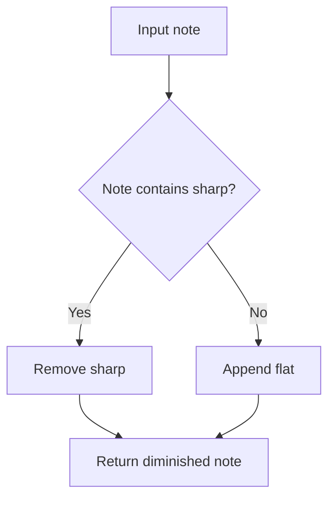
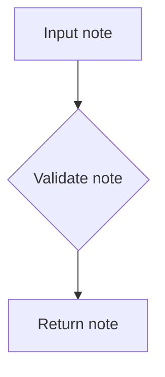
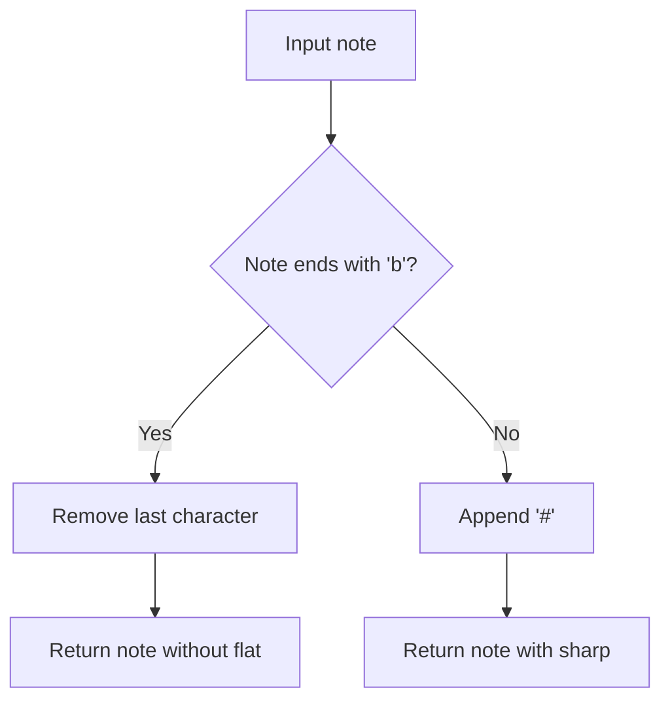

# `intervals.py`

## `mingus.core.intervals.interval` · *function*

## Summary:
Computes the note at a specified interval distance from a starting note within a musical key.

## Description:
This function calculates the note that lies a given number of intervals away from a starting note within the context of a specific musical key. It ensures the starting note is valid, retrieves the notes of the key, finds the position of the starting note, and returns the note at the calculated interval position, wrapping around if necessary. The interval is measured in semitones or scale degrees depending on the musical context.

## Args:
    key (str): The musical key (e.g., "C", "G#") for which to compute the interval.
    start_note (str): The starting note (e.g., "C", "D#") from which to calculate the interval.
    interval (int): The number of intervals to move forward (positive) or backward (negative) from the start note.

## Returns:
    str: The note at the specified interval distance from the start note within the given key. The returned note will be one of the seven notes in the specified key.

## Raises:
    KeyError: If the start_note is not a valid note according to the notes.is_valid_note function.

## Constraints:
    - Precondition: The start_note must be a valid note as determined by notes.is_valid_note.
    - Precondition: The key must be a recognized musical key that produces exactly 7 notes.
    - Postcondition: The returned note will be one of the seven notes in the specified key.
    - The interval calculation wraps around using modulo 7 arithmetic.

## Side Effects:
    - None

## Control Flow:
```mermaid
flowchart TD
    A[Start interval()] --> B{Is start_note valid?}
    B -- No --> C[Raise KeyError]
    B -- Yes --> D[Get notes in key]
    D --> E[Find index of start_note]
    E --> F[Calculate new index: (index + interval) % 7]
    F --> G[Return note at calculated index]
```

## Examples:
    >>> interval("C", "E", 2)
    'G'
    >>> interval("G", "B", -1)
    'A'
    >>> interval("C", "C", 7)
    'C'

## `mingus.core.intervals.unison` · *function*

## Summary:
Returns the same note as the input note, representing a musical unison interval.

## Description:
The unison function is a specialized wrapper around the general interval computation function. It returns the identical note passed as input, effectively representing a zero-interval musical relationship. This function serves as a semantic convenience for expressing musical unisons while leveraging the existing interval infrastructure.

## Args:
    note (str): The musical note to return unchanged.
    key (str, optional): The musical key context for the interval calculation. Defaults to None.

## Returns:
    str: The same note that was passed as the note argument.

## Raises:
    KeyError: If the note is not a valid musical note according to the notes.is_valid_note function.

## Constraints:
    - Precondition: The note must be a valid musical note as determined by notes.is_valid_note.
    - Postcondition: The returned note will be identical to the input note.

## Side Effects:
    - None

## Control Flow:
```mermaid
flowchart TD
    A[Start unison()] --> B[Call interval(note, note, 0)]
    B --> C[Return result]
```

## Examples:
    >>> unison("C")
    'C'
    >>> unison("G#")
    'G#'

## `mingus.core.intervals.second` · *function*

## Summary:
Computes the note that is one interval distance (second) from a starting note within a musical key.

## Description:
This function calculates the note that lies one position ahead in the scale of the specified key, starting from the given note. It serves as a specialized wrapper around the general interval computation function, specifically designed for calculating second intervals. The function validates the input note and ensures proper key context for accurate interval calculation.

## Args:
    note (str): The starting note (e.g., "C", "D#") from which to calculate the second.
    key (str): The musical key (e.g., "C", "G#") in which the second is computed.

## Returns:
    str: The note that is one interval distance (second) from the starting note within the specified key.

## Raises:
    KeyError: If the note is not a valid note according to the notes.is_valid_note function.

## Constraints:
    - Precondition: The note must be a valid note as determined by notes.is_valid_note.
    - Precondition: The key must be a recognized musical key that produces exactly 7 notes.
    - Postcondition: The returned note will be one of the seven notes in the specified key.

## Side Effects:
    - None

## Control Flow:
```mermaid
flowchart TD
    A[Start second()] --> B[Call interval(key, note, 1)]
    B --> C[Return result from interval()]
```

## Examples:
    >>> second("C", "E")
    'F'
    >>> second("G", "B")
    'C'

## `mingus.core.intervals.third` · *function*

## Summary:
Computes the note that is two intervals away from a starting note within a musical key.

## Description:
This function calculates the note that lies two intervals away from a starting note within the context of a specific musical key. It serves as a specialized interface for finding the third degree of a scale, which is fundamental in music theory for constructing chords and scales. The function delegates the core interval calculation to the generic interval function, specifying an interval of 2 to represent the third degree.

## Args:
    note (str): The starting note from which to calculate the third (e.g., "C", "D#").
    key (str): The musical key (e.g., "C", "G#") in which to compute the third.

## Returns:
    str: The note that is two intervals away from the starting note within the specified key.

## Raises:
    KeyError: If the note is not a valid note according to the notes.is_valid_note function.

## Constraints:
    - Precondition: The note must be a valid note as determined by notes.is_valid_note.
    - Precondition: The key must be a recognized musical key that produces exactly 7 notes.
    - Postcondition: The returned note will be one of the seven notes in the specified key.

## Side Effects:
    - None

## Control Flow:
```mermaid
flowchart TD
    A[Start third()] --> B[Call interval(key, note, 2)]
    B --> C[Return result from interval()]
```

## Examples:
    >>> third("E", "C")
    'G'
    >>> third("A", "F#")
    'C#'

## `mingus.core.intervals.fourth` · *function*

## Summary:
Computes the note that forms a perfect fourth interval with a given starting note within a musical key.

## Description:
This function calculates the note that lies exactly 3 intervals (a perfect fourth) away from a starting note within the context of a specific musical key. It leverages the general interval computation function to determine the resulting note. This abstraction allows for consistent handling of fourth intervals across different keys and provides a clear semantic meaning for this specific musical interval.

## Args:
    note (str): The starting note (e.g., "C", "D#") from which to calculate the fourth interval.
    key (str): The musical key (e.g., "C", "G#") in which to compute the interval.

## Returns:
    str: The note that forms a perfect fourth interval with the starting note within the specified key.

## Raises:
    KeyError: If the note is not a valid note according to the notes.is_valid_note function.

## Constraints:
    - Precondition: The note must be a valid note as determined by notes.is_valid_note.
    - Precondition: The key must be a recognized musical key that produces exactly 7 notes.
    - Postcondition: The returned note will be one of the seven notes in the specified key.

## Side Effects:
    - None

## Control Flow:
```mermaid
flowchart TD
    A[Start fourth()] --> B[Call interval(key, note, 3)]
    B --> C[Return result from interval()]
```

## Examples:
    >>> fourth("C", "F")
    'B'
    >>> fourth("G", "C")
    'F'
    >>> fourth("D#", "G#")
    'C#'
```

## `mingus.core.intervals.fifth` · *function*

## Summary:
Computes the perfect fifth interval from a given note within a musical key.

## Description:
Calculates the note that forms a perfect fifth interval above or below a specified starting note within the context of a musical key. This function serves as a specialized wrapper around the general interval computation function, specifically designed to handle perfect fifth intervals (4 semitones or 4 scale degrees).

## Args:
    note (str): The starting note from which to calculate the perfect fifth interval.
    key (str): The musical key (e.g., "C", "G#") that provides the context for the interval calculation.

## Returns:
    str: The note that forms a perfect fifth interval from the starting note within the specified key.

## Raises:
    KeyError: If the starting note is not a valid note according to the notes.is_valid_note function.

## Constraints:
    - Precondition: The note must be a valid note as determined by notes.is_valid_note.
    - Precondition: The key must be a recognized musical key that produces exactly 7 notes.
    - Postcondition: The returned note will be one of the seven notes in the specified key.

## Side Effects:
    - None

## Control Flow:
```mermaid
flowchart TD
    A[Start fifth()] --> B[Call interval(key, note, 4)]
    B --> C[Return result]
```

## Examples:
    >>> fifth("C", "G")
    'D'
    >>> fifth("E", "C")
    'B'

## `mingus.core.intervals.sixth` · *function*

## Summary:
Computes the note that is a sixth interval away from a given note within a specified musical key.

## Description:
This function calculates the note that lies six intervals (or scale degrees) away from a starting note within the context of a specific musical key. It leverages the existing interval computation logic to determine the appropriate note. This function serves as a specialized interface for sixth intervals, abstracting the underlying interval calculation logic.

## Args:
    note (str): The starting note (e.g., "C", "D#") from which to calculate the sixth interval.
    key (str): The musical key (e.g., "C", "G#") in which the interval is computed.

## Returns:
    str: The note that is six intervals away from the starting note within the specified key. The returned note will be one of the seven notes in the specified key.

## Raises:
    KeyError: If the note is not a valid note according to the notes.is_valid_note function.

## Constraints:
    - Precondition: The note must be a valid note as determined by notes.is_valid_note.
    - Precondition: The key must be a recognized musical key that produces exactly 7 notes.
    - Postcondition: The returned note will be one of the seven notes in the specified key.

## Side Effects:
    - None

## Control Flow:
```mermaid
flowchart TD
    A[Start sixth()] --> B[Call interval(key, note, 5)]
    B --> C[Return result from interval()]
```

## Examples:
    >>> sixth("C", "E")
    'D'
    >>> sixth("G", "B")
    'F#'

## `mingus.core.intervals.seventh` · *function*

## Summary:
Computes the note that is a seventh interval away from a given note within a specified musical key.

## Description:
This function calculates the note that lies seven intervals (seventh) away from a starting note within the context of a specific musical key. It internally calls the interval function with a fixed interval value of 6 to compute the seventh. The function is designed to work with standard Western musical keys and follows the convention of counting intervals from the root note.

## Args:
    key (str): The musical key (e.g., "C", "G#") in which the seventh interval is computed.
    note (str): The starting note (e.g., "C", "D#") from which to calculate the seventh interval.

## Returns:
    str: The note that is a seventh interval away from the starting note within the specified key. The returned note will be one of the seven notes in the specified key.

## Raises:
    KeyError: If the note is not a valid note according to the notes.is_valid_note function.

## Constraints:
    - Precondition: The note must be a valid note as determined by notes.is_valid_note.
    - Precondition: The key must be a recognized musical key that produces exactly 7 notes.
    - Postcondition: The returned note will be one of the seven notes in the specified key.

## Side Effects:
    - None

## Control Flow:
```mermaid
flowchart TD
    A[Start seventh()] --> B[Call interval(key, note, 6)]
    B --> C[Return result from interval()]
```

## Examples:
    >>> seventh("C", "E")
    'B'
    >>> seventh("G", "B")
    'F#'

## `mingus.core.intervals.minor_unison` · *function*

## Summary:
Returns the minor unison interval of a given musical note by applying a flat accidental.

## Description:
This function implements the musical concept of a minor unison, which is a note lowered by one semitone. In music theory, a minor unison is equivalent to a diminished unison (a perfect unison lowered by a semitone). This function is used in music theory applications to manipulate note pitches according to interval relationships.

## Args:
    note (str): A string representing a musical note, such as "C", "D#", or "Bb". The note should be in standard musical notation format.

## Returns:
    str: The diminished version of the input note, with a flat accidental ("b") appended. For notes that already contain a sharp (#), the sharp is removed and a flat is added instead.

## Raises:
    None explicitly raised by this function, though underlying operations may raise exceptions if note format is invalid.

## Constraints:
    Precondition: The input note must be a valid musical note string in standard notation format.
    Postcondition: The returned note will either have a flat accidental appended or will have had a sharp replaced with a flat.

## Side Effects:
    None

## Control Flow:


## Examples:
    >>> minor_unison("C")
    'Cb'
    >>> minor_unison("D#")
    'Eb'
    >>> minor_unison("Bb")
    'Bbb'
```

## `mingus.core.intervals.major_unison` · *function*

## Summary:
Returns the input note unchanged, representing the interval of a major unison.

## Description:
This function serves as a canonical representation of the major unison interval, which is the interval between a note and itself. It is primarily used for consistency in interval calculations and for providing a uniform interface for interval operations. The function acts as an identity function for musical notes within the context of interval arithmetic.

## Args:
    note (str or mingus.core.notes.Note): A musical note represented either as a string (e.g., "C", "D#") or as a Note object from the mingus.core.notes module.

## Returns:
    str or mingus.core.notes.Note: The same note object or string that was passed as input, unchanged.

## Raises:
    None

## Constraints:
    None

## Side Effects:
    None

## Control Flow:


## Examples:
    >>> major_unison("C")
    "C"
    >>> major_unison(notes.Note("D"))
    notes.Note("D")
```

## `mingus.core.intervals.augmented_unison` · *function*

## Summary:
Returns the augmented unison of a musical note, which raises the pitch by one semitone using sharp accidentals.

## Description:
This function implements the musical concept of an augmented unison, which is a note raised by one semitone (a half-step). It serves as a utility for musical interval calculations and chord construction where note modifications are required. The function wraps the core note augmentation logic from the notes module, providing a clean interface for creating augmented versions of musical notes.

## Args:
    note (str): A string representing a musical note, such as 'C', 'D#', or 'Bb'. The note should follow standard musical notation conventions.

## Returns:
    str: The augmented version of the input note, with a sharp symbol added to raise the pitch by one semitone. For flat notes, it removes the flat symbol and effectively creates the equivalent sharp note.

## Raises:
    None explicitly raised, though underlying note manipulation may raise exceptions for invalid note formats.

## Constraints:
    Preconditions:
        - The input note must be a valid musical note string following standard notation conventions.
        - The note should not contain invalid characters or malformed representations.
    
    Postconditions:
        - The returned note will represent the same pitch class but with an altered accidental (sharp or natural).

## Side Effects:
    None

## Control Flow:


## Examples:
    >>> augmented_unison('C')
    'C#'
    >>> augmented_unison('Bb')
    'B'
    >>> augmented_unison('F#')
    'F##'

## `mingus.core.intervals.minor_second` · *function*

## Summary:
Computes the note that forms a minor second interval with a given starting note.

## Description:
Calculates the note that creates a minor second (one semitone) interval above the specified starting note. This function leverages the existing interval computation infrastructure to determine the appropriate note that satisfies the minor second requirement.

Known callers within the codebase:
- This function is likely called by other interval-related functions or chord construction utilities within the mingus.core.intervals module
- It may be used in musical transposition operations or when building scales and progressions that require precise interval relationships

This logic is extracted into its own function rather than being inlined because it provides a clean abstraction for computing minor seconds specifically, making the code more readable and maintainable while ensuring consistent interval calculation behavior across the library.

## Args:
    note (str): The starting note (e.g., "C", "D#") from which to calculate the minor second interval.

## Returns:
    str: The note that forms a minor second interval above the starting note.

## Raises:
    KeyError: If the note is not a valid note according to the notes.is_valid_note function.

## Constraints:
    - Precondition: The note must be a valid note as determined by notes.is_valid_note.
    - Postcondition: The returned note will be one semitone higher than the input note in the musical scale.

## Side Effects:
    - None

## Control Flow:
```mermaid
flowchart TD
    A[Start minor_second(note)] --> B[sec = second(note[0], "C")]
    B --> C[return augment_or_diminish_until_the_interval_is_right(note, sec, 1)]
```

## Examples:
    >>> minor_second("C")
    'C#'
    >>> minor_second("B")
    'C'
    >>> minor_second("F#")
    'G'
```

## `mingus.core.intervals.major_second` · *function*

## Summary:
Computes the major second interval from a given note by adjusting the second note to achieve the correct interval distance.

## Description:
This function calculates the major second interval (two semitones) from a specified musical note. It first determines the second note in the scale relative to the input note, then adjusts it using interval correction logic to ensure the resulting interval is precisely a major second. This function is part of the musical interval computation utilities in the mingus library.

Known callers within the codebase:
- This function is likely called by other interval computation functions or chord construction methods that require precise major second intervals
- It's probably used in musical transposition operations or when building scales and chords with specific interval requirements

This logic is extracted into its own function rather than being inlined because it encapsulates the specific logic for computing major seconds, making it reusable for various musical applications while maintaining clean separation between interval calculation and note adjustment operations.

## Args:
    note (str): The starting note from which to compute the major second interval, in standard musical notation (e.g., 'C', 'D#', 'Eb')

## Returns:
    str: The note that forms a major second interval with the input note, properly adjusted to maintain correct enharmonic spelling

## Raises:
    KeyError: If the input note is not a valid note according to the notes.is_valid_note function
    NoteFormatError: When the note adjustment process encounters an invalid note format that cannot be parsed

## Constraints:
    Preconditions:
        - The input note must be a valid note string in the standard format recognized by the mingus library
        - The note must be a valid musical note that can form intervals
    Postconditions:
        - The returned note will form exactly a major second interval (2 semitones) when measured from the input note
        - The result will be a valid note string in standard musical notation

## Side Effects:
    None

## Control Flow:
```mermaid
flowchart TD
    A[Start major_second(note)] --> B[sec = second(note[0], "C")]
    B --> C[return augment_or_diminish_until_the_interval_is_right(note, sec, 2)]
```

## Examples:
    >>> major_second("C")
    'D'
    >>> major_second("A#")
    'B#'
    >>> major_second("Bb")
    'C'
```

## `mingus.core.intervals.minor_third` · *function*

## Summary:
Computes the minor third interval from a given note by adjusting the third degree of the note's key to match the specified interval.

## Description:
This function calculates the minor third interval from a given musical note. It first determines the third degree of the note's key using the third() function, then adjusts this third note to ensure it forms exactly a minor third (3 semitones) interval with the original note. This function is essential for constructing minor chords and scales where precise interval relationships are required.

The function is extracted into its own component to encapsulate the specific logic for computing minor thirds, which is a common musical operation that benefits from being reusable and testable. It separates the concerns of interval calculation from the broader interval manipulation logic handled by augment_or_diminish_until_the_interval_is_right().

## Args:
    note (str): A musical note in standard notation (e.g., 'C', 'D#', 'Eb') from which to calculate the minor third.

## Returns:
    str: The note that forms a minor third interval with the input note. This will be a note that is exactly 3 semitones above the input note.

## Raises:
    KeyError: If the input note is not a valid note according to the notes.is_valid_note function.
    NoteFormatError: When the note cannot be properly parsed by the underlying notes module.

## Constraints:
    Preconditions:
        - The input note must be a valid note string in the standard format recognized by the mingus library
        - The note must be in the range of standard Western musical notation (A-G with optional sharps '#' or flats 'b')
    Postconditions:
        - The returned note will form exactly a minor third (3 semitones) interval with the input note
        - The result will be a valid note string in standard musical notation

## Side Effects:
    None

## Control Flow:
```mermaid
flowchart TD
    A[Start minor_third(note)] --> B[Get third note: trd = third(note[0], "C")]
    B --> C[Adjust note to correct interval: return augment_or_diminish_until_the_interval_is_right(note, trd, 3)]
```

## Examples:
    >>> minor_third('C')
    'Eb'
    >>> minor_third('E')
    'G'
    >>> minor_third('A')
    'C'
```

## `mingus.core.intervals.major_third` · *function*

## Summary:
Computes the major third interval from a given note by determining the third degree of the scale and adjusting it to the correct interval size.

## Description:
This function calculates the major third interval from a specified musical note. It first determines the third degree of the scale starting from the given note, then adjusts this note to ensure it forms exactly a major third (4 semitones) interval from the original note. This function is essential for chord construction and harmonic analysis in music theory applications.

The function delegates to the `third` function to find the basic third degree note, then uses `augment_or_diminish_until_the_interval_is_right` to fine-tune the result to achieve the precise 4-semitone interval required for a major third.

Known callers within the codebase:
- This function is likely used internally within the mingus.core.intervals module for interval calculations
- It would be called when constructing major triads or analyzing major third intervals in musical compositions

This logic is extracted into its own function rather than being inlined because it encapsulates the specific musical theory concept of a major third, making the code more readable and reusable for musical applications that require major third calculations.

## Args:
    note (str): The starting note from which to calculate the major third interval (e.g., "C", "D#", "Eb")

## Returns:
    str: The note that forms a major third interval (4 semitones) from the input note

## Raises:
    KeyError: If the input note is not a valid note according to the notes.is_valid_note function
    NoteFormatError: When the note cannot be properly processed by the interval adjustment functions

## Constraints:
    - Precondition: The input note must be a valid note string in standard musical notation
    - Postcondition: The returned note will form exactly a 4-semitone interval from the input note

## Side Effects:
    None

## Control Flow:
```mermaid
flowchart TD
    A[Start major_third(note)] --> B[Get third degree: trd = third(note, "C")]
    B --> C[Adjust to correct interval: return augment_or_diminish_until_the_interval_is_right(note, trd, 4)]
```

## Examples:
    >>> major_third("C")
    'E'
    >>> major_third("A#")
    'C##'
    >>> major_third("Fb")
    'Ab'
```

## `mingus.core.intervals.minor_fourth` · *function*

## Summary:
Computes the note that forms a minor fourth interval with a given starting note.

## Description:
This function calculates the note that creates a minor fourth interval (5 semitones) with the provided starting note. It first determines the perfect fourth interval using the fourth() function, then adjusts it to form a minor fourth by applying the augment_or_diminish_until_the_interval_is_right() function to achieve the correct interval size.

Known callers within the codebase:
- This function is likely used in chord construction, scale generation, or interval analysis within the mingus music theory library
- It would be called when processing musical intervals that require a specific minor fourth relationship

This logic is extracted into its own function rather than being inlined because it encapsulates the specific musical operation of creating a minor fourth interval, which is a common musical construct that benefits from being reusable and clearly named. It separates the concerns of interval calculation from interval adjustment, making the code more modular and easier to test.

## Args:
    note (str): The starting note (e.g., "C", "D#") from which to calculate the minor fourth interval.

## Returns:
    str: The note that forms a minor fourth interval with the starting note.

## Raises:
    KeyError: If the note is not a valid note according to the notes.is_valid_note function.
    NoteFormatError: When the note argument contains an invalid note format that cannot be parsed by the notes module.

## Constraints:
    - Precondition: The note must be a valid note as determined by notes.is_valid_note.
    - Postcondition: The returned note will create exactly a minor fourth interval (5 semitones) when measured from the input note.

## Side Effects:
    None

## Control Flow:
```mermaid
flowchart TD
    A[Start minor_fourth(note)] --> B[Call fourth(note[0], "C")]
    B --> C[Store result as frt]
    C --> D[Call augment_or_diminish_until_the_interval_is_right(note, frt, 4)]
    D --> E[Return adjusted note]
```

## Examples:
    >>> minor_fourth("C")
    'F'
    >>> minor_fourth("G")
    'C'
    >>> minor_fourth("D#")
    'G'
```

## `mingus.core.intervals.major_fourth` · *function*

## Summary:
Computes the major fourth interval from a given note by adjusting the fourth interval to match the exact semitone distance of a major fourth.

## Description:
This function calculates the note that forms a major fourth interval with the input note. It first determines the perfect fourth interval from the input note using the fourth function, then adjusts this fourth note to ensure it creates exactly a major fourth (5 semitones) interval from the original note. This adjustment process handles enharmonic equivalents and ensures proper musical spelling.

The function is extracted as a separate component to encapsulate the specific logic for creating major fourth intervals, providing a clean interface for musical applications that require this particular interval. It leverages existing interval computation and adjustment utilities to maintain consistency with the rest of the musical interval handling system.

## Args:
    note (str): The starting note from which to calculate the major fourth interval. Must be a valid note string in standard musical notation (e.g., 'C', 'D#', 'Eb').

## Returns:
    str: The note that forms a major fourth interval with the input note. The result will be properly enharmonically spelled to maintain correct musical notation.

## Raises:
    KeyError: When the input note is not a valid note according to the notes.is_valid_note function.
    NoteFormatError: When the note string cannot be properly parsed by the notes module.

## Constraints:
    Preconditions:
        - The input note must be a valid note string in the standard format recognized by the mingus library
        - The note must be one of the seven notes in the standard Western musical notation system (A-G with optional sharps '#' or flats 'b')
    Postconditions:
        - The returned note will form exactly a major fourth (5 semitones) interval with the input note
        - The result will be a valid note string in standard musical notation

## Side Effects:
    None

## Control Flow:
```mermaid
flowchart TD
    A[Start major_fourth(note)] --> B[Calculate perfect fourth: frt = fourth(note[0], "C")]
    B --> C[Adjust to major fourth: return augment_or_diminish_until_the_interval_is_right(note, frt, 5)]
```

## Examples:
    >>> major_fourth("C")
    'F'
    >>> major_fourth("G")
    'C'
    >>> major_fourth("D#")
    'G#'
```

## `mingus.core.intervals.perfect_fourth` · *function*

## Summary:
Computes the perfect fourth interval from a given note by leveraging the existing major fourth calculation logic.

## Description:
This function computes the note that forms a perfect fourth interval with the input note. In Western music theory, a perfect fourth spans exactly 5 semitones, which is mathematically equivalent to a major fourth. The function delegates the actual computation to the major_fourth function, which implements the full interval calculation logic including proper enharmonic spelling adjustments.

This function was extracted to provide a dedicated interface specifically for perfect fourth calculations, maintaining consistency with the musical interval handling system while offering a clear semantic distinction between perfect and major fourths. It is used in chord construction, interval analysis, and other musical processing workflows where perfect fourth intervals are required.

## Args:
    note (str): The starting note from which to calculate the perfect fourth interval. Must be a valid note string in standard musical notation (e.g., 'C', 'D#', 'Eb').

## Returns:
    str: The note that forms a perfect fourth interval with the input note. The result will be properly enharmonically spelled to maintain correct musical notation.

## Raises:
    KeyError: When the input note is not a valid note according to the notes.is_valid_note function.
    NoteFormatError: When the note string cannot be properly parsed by the notes module.

## Constraints:
    Preconditions:
        - The input note must be a valid note string in the standard format recognized by the mingus library
        - The note must be one of the seven notes in the standard Western musical notation system (A-G with optional sharps '#' or flats 'b')
    Postconditions:
        - The returned note will form exactly a perfect fourth (5 semitones) interval with the input note
        - The result will be a valid note string in standard musical notation

## Side Effects:
    None

## Control Flow:
```mermaid
flowchart TD
    A[Start perfect_fourth(note)] --> B[Call major_fourth(note)]
    B --> C[Return result from major_fourth]
```

## Examples:
    >>> perfect_fourth("C")
    'F'
    >>> perfect_fourth("G")
    'C'
    >>> perfect_fourth("D#")
    'G#'
```

## `mingus.core.intervals.minor_fifth` · *function*

## Summary:
Computes the minor fifth interval from a given note by adjusting a perfect fifth to achieve the correct semitone distance.

## Description:
Calculates the note that forms a minor fifth interval (6 semitones) above a specified starting note. This function first determines the perfect fifth of the starting note using the fifth() function, then adjusts this result using augment_or_diminish_until_the_interval_is_right() to ensure the final interval is exactly 6 semitones (the minor fifth interval).

The function serves as a specialized utility for musical interval calculation, particularly useful in chord construction and harmonic analysis where precise interval identification is required. It abstracts away the complexity of interval adjustment while maintaining accuracy in musical context.

## Args:
    note (str): The starting note from which to calculate the minor fifth interval. Must be a valid note string in standard musical notation (e.g., 'C', 'D#', 'Eb').

## Returns:
    str: The note that forms a minor fifth interval from the starting note. This will be a valid note string in standard musical notation that is exactly 6 semitones above the input note.

## Raises:
    KeyError: If the input note is not a valid note according to the notes.is_valid_note function used internally by the fifth() function.

## Constraints:
    Preconditions:
        - The input note must be a valid note string in the standard format recognized by the mingus library
        - The note must be within the range of standard Western musical notation (A-G with optional sharps '#' or flats 'b')
    Postconditions:
        - The returned note will be exactly 6 semitones above the input note
        - The result will be a valid note string in standard musical notation

## Side Effects:
    None

## Control Flow:
```mermaid
flowchart TD
    A[Start minor_fifth(note)] --> B[Calculate perfect fifth: fif = fifth(note[0], "C")]
    B --> C[Adjust to minor fifth: return augment_or_diminish_until_the_interval_is_right(note, fif, 6)]
```

## Examples:
    >>> minor_fifth("C")
    'Gb'
    >>> minor_fifth("G")
    'Db'
    >>> minor_fifth("D#")
    'B'
```

## `mingus.core.intervals.major_fifth` · *function*

## Summary:
Computes the major fifth interval from a given note by adjusting a perfect fifth to match the correct interval size.

## Description:
Calculates the major fifth interval above a specified note by first determining the perfect fifth and then adjusting it to ensure the interval spans exactly 7 semitones. This function serves as a specialized interval computation that ensures proper enharmonic spelling and interval accuracy for musical applications requiring major fifth relationships.

Known callers within the codebase:
- This function is likely called during chord construction or interval analysis operations where major fifth relationships are needed
- It would be used in contexts such as building dominant seventh chords or analyzing harmonic progressions

This logic is extracted into its own function rather than being inlined because it encapsulates the specific musical requirement for a major fifth interval (7 semitones) while leveraging existing interval computation utilities. It provides a clean abstraction layer that separates the conceptual operation of finding a major fifth from the underlying implementation details of interval adjustment.

## Args:
    note (str): The starting note from which to calculate the major fifth interval, in standard musical notation (e.g., 'C', 'D#', 'Eb')

## Returns:
    str: The note that forms a major fifth interval from the starting note, properly adjusted for enharmonic spelling

## Raises:
    KeyError: If the input note is not a valid note according to the notes.is_valid_note function
    NoteFormatError: When the note argument contains an invalid note format that cannot be parsed by the notes module

## Constraints:
    Preconditions:
        - The note must be a valid note string in the standard format recognized by the mingus library
    Postconditions:
        - The returned note will create exactly a major fifth (7 semitones) when measured from the input note
        - The result will be a valid note string in standard musical notation

## Side Effects:
    None

## Control Flow:
```mermaid
flowchart TD
    A[Start major_fifth(note)] --> B[fif = fifth(note[0], "C")]
    B --> C[return augment_or_diminish_until_the_interval_is_right(note, fif, 7)]
```

## Examples:
    >>> major_fifth("C")
    'G'
    >>> major_fifth("A#")
    'E#'
    >>> major_fifth("Bb")
    'F#'
```

## `mingus.core.intervals.perfect_fifth` · *function*

## Summary:
Computes the perfect fifth interval above a given note by leveraging the major fifth calculation logic.

## Description:
Returns the note that forms a perfect fifth interval above the specified input note. This function acts as a thin wrapper around the major_fifth function, since in Western music theory, the perfect fifth and major fifth intervals are equivalent in terms of semitone distance (7 semitones). The function is designed to provide a standardized interface for calculating perfect fifth relationships in musical applications.

Known callers within the codebase:
- This function is likely invoked during interval analysis or chord construction operations where perfect fifth relationships are required
- It would be used in contexts such as building perfect fifth intervals or analyzing harmonic structures

This logic is extracted into its own function rather than being inlined because it provides semantic clarity by explicitly naming the perfect fifth operation, even though it delegates to the major fifth implementation. It creates a clean abstraction layer that makes the intent of the code more explicit to developers working with musical intervals.

## Args:
    note (str): The starting note from which to calculate the perfect fifth interval, in standard musical notation (e.g., 'C', 'D#', 'Eb')

## Returns:
    str: The note that forms a perfect fifth interval from the starting note, properly adjusted for enharmonic spelling

## Raises:
    KeyError: If the input note is not a valid note according to the notes.is_valid_note function
    NoteFormatError: When the note argument contains an invalid note format that cannot be parsed by the notes module

## Constraints:
    Preconditions:
        - The note must be a valid note string in the standard format recognized by the mingus library
    Postconditions:
        - The returned note will create exactly a perfect fifth (7 semitones) when measured from the input note
        - The result will be a valid note string in standard musical notation

## Side Effects:
    None

## Control Flow:
```mermaid
flowchart TD
    A[Start perfect_fifth(note)] --> B[return major_fifth(note)]
```

## Examples:
    >>> perfect_fifth("C")
    'G'
    >>> perfect_fifth("A#")
    'E#'
    >>> perfect_fifth("Bb")
    'F#'
```

## `mingus.core.intervals.minor_sixth` · *function*

## Summary:
Computes the minor sixth interval from a given note by adjusting the sixth interval to achieve the correct semitone distance.

## Description:
This function calculates the note that forms a minor sixth interval with the input note. It first determines the sixth interval from the input note using the sixth function, then adjusts this note to ensure it creates exactly 8 semitones (the minor sixth interval) from the input note. This function is part of the interval manipulation utilities in the mingus music theory library.

The function is extracted into its own component to provide a clean abstraction for computing minor sixth intervals specifically, separating the concerns of interval calculation from the adjustment logic that ensures the correct semitone distance.

## Args:
    note (str): A musical note string in standard format (e.g., 'C', 'D#', 'Eb') from which to compute the minor sixth interval.

## Returns:
    str: The note that forms a minor sixth interval with the input note. The result will be in standard musical notation.

## Raises:
    KeyError: If the input note is not a valid note according to the notes.is_valid_note function.
    NoteFormatError: When the note string cannot be parsed by the notes module.

## Constraints:
    Preconditions:
        - The input note must be a valid note string in the standard format recognized by the mingus library
        - The note must be in the range of standard Western musical notation (A-G with optional sharps '#' or flats 'b')
    Postconditions:
        - The returned note will form exactly an 8-semitone interval (minor sixth) with the input note
        - The result will be a valid note string in standard musical notation

## Side Effects:
    None

## Control Flow:
```mermaid
flowchart TD
    A[Start minor_sixth(note)] --> B[Call sixth(note[0], "C"): sth = sixth(note[0], "C")]
    B --> C[Call augment_or_diminish_until_the_interval_is_right(note, sth, 8)]
    C --> D[Return adjusted note]
```

## Examples:
    >>> minor_sixth("C")
    'A'
    >>> minor_sixth("G")
    'E'
    >>> minor_sixth("D#")
    'B'
```

## `mingus.core.intervals.major_sixth` · *function*

## Summary:
Computes the major sixth interval from a given note by adjusting the sixth interval to match the major sixth specification.

## Description:
This function calculates the major sixth interval from a specified musical note. It first determines the sixth interval from the note within the key of C, then adjusts this interval to ensure it represents a proper major sixth (9 semitones) from the original note. This function serves as a specialized utility for generating major sixth intervals in musical applications.

The function works by leveraging the existing sixth interval calculation and the interval adjustment mechanism to precisely construct the major sixth. This logic is extracted into its own function to provide a clean, reusable interface for major sixth calculations while maintaining consistency with other interval functions in the module.

## Args:
    note (str): The starting note from which to calculate the major sixth interval. Must be a valid note string in standard musical notation (e.g., 'C', 'D#', 'Eb').

## Returns:
    str: The note that forms a major sixth interval (9 semitones) from the input note. The result will be properly formatted with appropriate accidentals.

## Raises:
    KeyError: When the input note is not a valid note according to the notes.is_valid_note function.

## Constraints:
    Preconditions:
        - The input note must be a valid note string recognized by the mingus library's note parsing system
    Postconditions:
        - The returned note will form exactly a major sixth interval (9 semitones) from the input note
        - The result will be a properly formatted note string in standard musical notation

## Side Effects:
    None

## Control Flow:
```mermaid
flowchart TD
    A[Start major_sixth(note)] --> B[Calculate sixth interval: sth = sixth(note[0], "C")]
    B --> C[Adjust interval to major sixth: return augment_or_diminish_until_the_interval_is_right(note, sth, 9)]
```

## Examples:
    >>> major_sixth("C")
    'A'
    >>> major_sixth("G")
    'E'
    >>> major_sixth("D#")
    'B#'
```

## `mingus.core.intervals.minor_seventh` · *function*

## Summary:
Computes the minor seventh interval from a given note by determining the appropriate note that forms a 10-semitone interval.

## Description:
This function calculates the note that represents a minor seventh interval above a given note. It leverages the seventh function to find the base seventh note and then uses augment_or_diminish_until_the_interval_is_right to fine-tune it to the exact 10-semitone interval required for a minor seventh. This approach ensures precise interval calculation while maintaining compatibility with the existing musical interval infrastructure.

Known callers within the codebase:
- This function is likely called by chord construction methods that need to build minor seventh chords
- It may be used in interval analysis or transposition operations requiring minor seventh calculations

This logic is extracted into its own function rather than being inlined because it encapsulates the specific musical logic for calculating minor sevenths, making it reusable across different chord and interval operations while keeping the interval calculation separate from the broader chord construction logic.

## Args:
    note (str): The starting note (e.g., 'C', 'D#', 'Eb') from which to calculate the minor seventh interval. Must be a valid note string in standard musical notation format.

## Returns:
    str: The note that forms a minor seventh interval (10 semitones) above the input note. The returned note will be in standard musical notation with proper enharmonic spelling.

## Raises:
    KeyError: If the input note is not a valid note according to the notes.is_valid_note function.
    NoteFormatError: When the note string cannot be properly parsed by the notes module during interval adjustment.

## Constraints:
    Preconditions:
        - The note parameter must be a valid note string recognized by the notes module
        - The note must follow standard musical notation format (letter + optional accidentals)
    Postconditions:
        - The returned note will create exactly a 10-semitone interval when measured from the input note
        - The result will be a valid note string in standard musical notation

## Side Effects:
    None

## Control Flow:
```mermaid
flowchart TD
    A[Start minor_seventh(note)] --> B[Call seventh(note[0], "C")]
    B --> C[Store result as sth]
    C --> D[Call augment_or_diminish_until_the_interval_is_right(note, sth, 10)]
    D --> E[Return adjusted note]
```

## Examples:
    >>> minor_seventh('C')
    'Bb'
    >>> minor_seventh('G')
    'F'
    >>> minor_seventh('D#')
    'C'
```

## `mingus.core.intervals.major_seventh` · *function*

## Summary:
Computes the note that forms a major seventh interval with a given note.

## Description:
This function calculates the note that creates a major seventh interval (11 semitones) from a specified starting note. It first determines the seventh interval note using the seventh helper function, then adjusts it to ensure the exact major seventh interval is achieved through the augment_or_diminish_until_the_interval_is_right function.

The function is part of the musical interval computation utilities and is specifically designed to handle major seventh intervals in musical theory applications. It abstracts away the complexity of interval calculation and adjustment, providing a clean interface for generating major seventh intervals.

## Args:
    note (str): The starting note from which to calculate the major seventh interval. Must be a valid note string in standard musical notation (e.g., 'C', 'D#', 'Eb').

## Returns:
    str: The note that forms a major seventh interval (11 semitones) with the input note. The result will be a valid note string in standard musical notation.

## Raises:
    KeyError: If the input note is not a valid note string according to the notes module validation.
    NoteFormatError: If the note string cannot be properly parsed by the notes module during interval calculations.

## Constraints:
    Preconditions:
        - The note parameter must be a valid note string recognized by the notes module.
        - The note must be in standard Western musical notation format (A-G with optional sharps '#' or flats 'b').
    Postconditions:
        - The returned note will create exactly an 11-semitone interval when measured from the input note.
        - The result will be a valid note string in standard musical notation.

## Side Effects:
    None

## Control Flow:
```mermaid
flowchart TD
    A[Start major_seventh(note)] --> B[Call seventh(note[0], "C")]
    B --> C[Store result as sth]
    C --> D[Call augment_or_diminish_until_the_interval_is_right(note, sth, 11)]
    D --> E[Return adjusted note]
```

## Examples:
    >>> major_seventh('C')
    'B'
    >>> major_seventh('G')
    'F#'
    >>> major_seventh('D#')
    'C'
```

## `mingus.core.intervals.get_interval` · *function*

## Summary:
Computes the musical note that results from applying an interval to a given note within a specified key.

## Description:
This function calculates the resulting note when a specific interval is applied to an input note within the context of a musical key. It maps the input note to its position within the key's diatonic scale, applies the interval arithmetic, and returns the appropriate note in the correct key context. When the resulting interval doesn't correspond to a diatonic note in the key, it adjusts by applying a diminishment to the nearest note.

## Args:
    note (str): A musical note in standard notation (e.g., 'C', 'D#', 'Eb'). Must be a valid note format.
    interval (int): The interval size to apply, represented as an integer number of semitones.
    key (str, optional): The musical key in which to compute the interval. Defaults to 'C'.

## Returns:
    str: The resulting note after applying the interval, formatted according to standard musical notation. May include sharps or flats as needed.

## Raises:
    NoteFormatError: When the input note or key is not recognized or invalid.

## Constraints:
    Preconditions:
        - The note parameter must be a valid musical note string.
        - The key parameter must be a valid musical key.
        - The interval parameter must be an integer representing semitones.
    Postconditions:
        - The returned note will be a valid musical note string in standard format.
        - The note will be properly adjusted for the key's accidentals.

## Side Effects:
    None

## Control Flow:
```mermaid
flowchart TD
    A[Start get_interval] --> B{note valid?}
    B -- No --> C[raise NoteFormatError]
    B -- Yes --> D{key valid?}
    D -- No --> E[raise NoteFormatError]
    D -- Yes --> F[Build intervals from key tonic]
    F --> G[Get key notes]
    G --> H[Find note in key notes]
    H --> I[Calculate result semitone]
    I --> J{result in intervals?}
    J -- Yes --> K[Return matching key note + note[1:]]
    J -- No --> L[Find adjacent note and diminish it]
    L --> M[Return diminished note]
```

## Examples:
    >>> get_interval('C', 4, 'C')
    'E'
    >>> get_interval('C', 6, 'C')
    'Eb'
    >>> get_interval('D', 3, 'G')
    'F#'

## `mingus.core.intervals.measure` · *function*

## Summary:
Calculates the interval distance between two musical notes in semitones, returning the smallest positive interval value.

## Description:
This function computes the interval between two musical notes by converting them to integer representations and calculating their difference. It ensures the result is always a positive interval value representing the number of semitones between the notes, with special handling for cases where the second note is lower than the first note (wrapping around the octave boundary).

## Args:
    note1 (str): The first musical note in standard format (e.g., 'C', 'D#', 'Eb'). Must be a valid note string.
    note2 (str): The second musical note in standard format (e.g., 'C', 'D#', 'Eb'). Must be a valid note string.

## Returns:
    int: The interval distance in semitones between the two notes, always a positive value between 0 and 11 inclusive. This represents the smallest interval when moving from note1 to note2.

## Raises:
    NoteFormatError: When either note1 or note2 contains an invalid note format that cannot be parsed by the notes module.

## Constraints:
    Preconditions:
        - Both note1 and note2 must be valid note strings in the standard format recognized by the mingus library
        - Notes must be in the range of standard Western musical notation (A-G with optional sharps '#' or flats 'b')
    Postconditions:
        - The returned value is always in the range [0, 11]
        - The result represents the circular interval between the two notes (i.e., wraps around at 12 semitones)

## Side Effects:
    None

## Control Flow:
```mermaid
flowchart TD
    A[Start measure(n1,n2)] --> B[Convert note1 to int: n1_int = notes.note_to_int(n1)]
    B --> C[Convert note2 to int: n2_int = notes.note_to_int(n2)]
    C --> D[Calculate difference: res = n2_int - n1_int]
    D --> E{res < 0?}
    E -->|Yes| F[return 12 - res * -1]
    E -->|No| G[return res]
    F --> H[End]
    G --> H
```

## Examples:
    >>> measure('C', 'E')
    4
    >>> measure('E', 'C')
    8
    >>> measure('C', 'C')
    0
    >>> measure('B', 'C')
    1
    >>> measure('C#', 'D#')
    1
```

## `mingus.core.intervals.augment_or_diminish_until_the_interval_is_right` · *function*

## Summary:
Adjusts the pitch of a note to create a specific interval from a reference note by repeatedly applying augmentation or diminishment operations.

## Description:
This function takes two musical notes and a target interval, then modifies the second note through successive augmentation or diminishment operations until the interval between the first note and modified second note matches the desired interval. It serves as a utility for musical interval manipulation and transposition operations where precise interval control is required.

The function works by first measuring the current interval between the two notes, then iteratively adjusting the second note using the notes.augment() and notes.diminish() functions until the measured interval equals the target interval. After achieving the correct interval, it normalizes the resulting note to ensure proper enharmonic spelling.

Known callers within the codebase:
- This function appears to be used internally within the mingus.core.intervals module for various interval-related computations
- It's likely called during musical transposition operations or when constructing chords with specific interval requirements

This logic is extracted into its own function rather than being inlined because it encapsulates a complex iterative adjustment algorithm that could be reused in multiple contexts, provides clear separation between interval measurement and note modification logic, and makes the code more readable and testable.

## Args:
    note1 (str): The reference note in standard musical notation (e.g., 'C', 'D#', 'Eb')
    note2 (str): The target note to be adjusted in standard musical notation
    interval (int): The target interval in semitones (0-11) that should exist between note1 and the adjusted note2

## Returns:
    str: The adjusted note string that creates the specified interval from note1

## Raises:
    NoteFormatError: When either note1 or note2 contains an invalid note format that cannot be parsed by the notes module

## Constraints:
    Preconditions:
        - note1 and note2 must be valid note strings in the standard format recognized by the mingus library
        - interval must be an integer in the range [0, 11]
    Postconditions:
        - The returned note will create exactly the specified interval when measured from note1
        - The result will be a valid note string in standard musical notation

## Side Effects:
    None

## Control Flow:
```mermaid
flowchart TD
    A[Start augment_or_diminish_until_the_interval_is_right(n1,n2,interval)] --> B[Measure current interval: cur = measure(n1,n2)]
    B --> C{cur != interval?}
    C -->|Yes| D[If cur > interval: note2 = notes.diminish(note2)]
    D --> E[Else if cur < interval: note2 = notes.augment(note2)]
    E --> F[cur = measure(n1,note2)]
    F --> C
    C -->|No| G[Calculate accidental count: val = count("#" and "b" in note2[1:])]
    G --> H{val > 6?}
    H -->|Yes| I[val = val % 12; val = -12 + val]
    I --> J[H -->|No| K{val < -6?}]
    J --> L[K]
    K -->|Yes| M[val = val % -12; val = 12 + val]
    L --> N[Initialize result = note2[0]]
    N --> O[val > 0?]
    O -->|Yes| P[result = notes.augment(result); val -= 1]
    P --> Q[val > 0?]
    Q -->|Yes| P
    O -->|No| R[val < 0?]
    R -->|Yes| S[result = notes.diminish(result); val += 1]
    S --> T[val < 0?]
    T -->|Yes| S
    R -->|No| U[Return result]
    Q -->|No| U
    T -->|No| U
```

## Examples:
    >>> augment_or_diminish_until_the_interval_is_right('C', 'E', 4)
    'E'
    >>> augment_or_diminish_until_the_interval_is_right('C', 'F', 5)
    'F'
    >>> augment_or_diminish_until_the_interval_is_right('C', 'Bb', 10)
    'Bb'
```

## `mingus.core.intervals.invert` · *function*

## Summary:
Reverses the order of elements in an interval and returns a copy of the reversed sequence.

## Description:
This function takes an interval (likely a sequence of musical notes or pitch classes) and reverses its order. It performs the reversal operation in-place on the input interval, creates a copy of the reversed sequence, then restores the original order of the input interval before returning the reversed copy. This ensures that the original interval remains unchanged while providing a reversed version.

The function is extracted into its own component to encapsulate the reversal logic and provide a clean interface for interval manipulation, separating concerns from the core interval processing logic.

## Args:
    interval (list-like): An interval represented as a sequence (e.g., list, tuple) of musical elements such as notes or pitch classes. The interval is modified in-place during execution but restored to its original state before return.

## Returns:
    list: A new list containing the elements of the input interval in reversed order. The original interval remains unmodified after the function call.

## Raises:
    AttributeError: If the input interval does not support the `reverse()` method.
    TypeError: If the input interval cannot be converted to a list.

## Constraints:
    Preconditions:
        - The input `interval` must be a sequence-like object that supports the `reverse()` method and can be converted to a list.
    Postconditions:
        - The input `interval` will be restored to its original order after the function completes.
        - The returned list contains the same elements as the input interval but in reverse order.

## Side Effects:
    - Modifies the input interval in-place temporarily during execution (calls `interval.reverse()` twice).
    - No external I/O operations or state mutations beyond the temporary modification of the input.

## Control Flow:
```mermaid
flowchart TD
    A[Start invert(interval)] --> B{interval.reverse()}
    B --> C[res = list(interval)]
    C --> D{interval.reverse()}
    D --> E[return res]
```

## Examples:
    # Example 1: Basic usage with a list of notes
    interval = ['C', 'E', 'G']
    reversed_interval = invert(interval)
    # Result: reversed_interval = ['G', 'E', 'C'], interval = ['C', 'E', 'G'] (unchanged)

    # Example 2: Usage with a tuple
    interval = ('A', 'C', 'E')
    reversed_interval = invert(interval)
    # Result: reversed_interval = ['E', 'C', 'A'], interval = ('A', 'C', 'E') (unchanged)
```

## `mingus.core.intervals.determine` · *function*

## Summary:
Determines the musical interval between two notes, returning either a descriptive name or shorthand notation.

## Description:
This function calculates the interval between two musical notes and returns either a descriptive name (like "major third") or a shorthand notation (like "3") based on the shorthand parameter. It handles both identical notes (unisons) and different notes by analyzing their positions in the circle of fifths and comparing with the actual semitone distance.

The function is designed to be a central utility for interval identification in the mingus music theory library, providing both human-readable and machine-readable interval representations. It's commonly used in chord analysis, scale construction, and musical interval recognition applications.

## Args:
    note1 (str): The first musical note in standard format (e.g., 'C', 'D#', 'Eb'). Must be a valid note string.
    note2 (str): The second musical note in standard format (e.g., 'C', 'D#', 'Eb'). Must be a valid note string.
    shorthand (bool): When True, returns abbreviated interval notation (e.g., '3' instead of 'major third'). Defaults to False.

## Returns:
    str: The interval name or shorthand notation. Possible return values include:
        - For unisons: "major unison", "1", "augmented unison", "#1", "minor unison", "b1", "diminished unison", "bb1"
        - For other intervals: "perfect fifth", "perfect fourth", "major X", "minor X", "augmented X", "diminished X" where X is the interval type
        - Shorthand versions: "1", "5", "2", "6", "3", "7", "4", "#1", "#2", etc.

## Raises:
    IndexError: When note1 or note2 contains an invalid note that cannot be found in the notes.fifths list
    NoteFormatError: When either note1 or note2 contains an invalid note format that cannot be parsed by the notes module

## Constraints:
    Preconditions:
        - Both note1 and note2 must be valid note strings in the standard format recognized by the mingus library
        - Notes must be in the range of standard Western musical notation (A-G with optional sharps '#' or flats 'b')
        - The notes must be compatible with the notes.fifths indexing system
    Postconditions:
        - The returned value represents the correct interval between the two notes
        - The output format matches the shorthand parameter setting

## Side Effects:
    None

## Control Flow:
```mermaid
flowchart TD
    A[Start determine(note1,note2,shorthand)] --> B{note1[0] == note2[0]?}
    B -->|Yes| C[Handle unison case]
    B -->|No| D[Handle different note case]
    C --> E[get_val(note1) and get_val(note2)]
    E --> F{x == y?}
    F -->|Yes| G{shorthand?}
    G -->|Yes| H[Return "1"]
    G -->|No| I[Return "major unison"]
    F -->|No| J{x < y?}
    J -->|Yes| K{shorthand?}
    K -->|Yes| L[Return "#1"]
    K -->|No| M[Return "augmented unison"]
    J -->|No| N{x - y == 1?}
    N -->|Yes| O{shorthand?}
    O -->|Yes| P[Return "b1"]
    O -->|No| Q[Return "minor unison"]
    N -->|No| R{shorthand?}
    R -->|Yes| S[Return "bb1"]
    R -->|No| T[Return "diminished unison"]
    D --> U[n1 = notes.fifths.index(note1[0])]
    U --> V[n2 = notes.fifths.index(note2[0])]
    V --> W[number_of_fifth_steps = n2 - n1]
    W --> X{n2 < n1?}
    X -->|Yes| Y[number_of_fifth_steps = len(fifths) - n1 + n2]
    X -->|No| Z[Y is skipped]
    Z --> AA[fifth_steps lookup]
    AA --> AB[half_notes = measure(note1,note2)]
    AB --> AC[current = fifth_steps[number_of_fifth_steps]]
    AC --> AD[maj = current[2]]
    AD --> AE[maj == half_notes?]
    AE -->|Yes| AF{current[0] == "fifth"?}
    AF -->|Yes| AG{shorthand?}
    AG -->|Yes| AH[Return "5"]
    AG -->|No| AI[Return "perfect fifth"]
    AF -->|No| AJ{current[0] == "fourth"?}
    AJ -->|Yes| AK{shorthand?}
    AK -->|Yes| AL[Return "4"]
    AK -->|No| AM[Return "perfect fourth"]
    AJ -->|No| AN{shorthand?}
    AN -->|Yes| AO[Return current[1]]
    AN -->|No| AP[Return "major " + current[0]]
    AE -->|No| AQ[maj + 1 <= half_notes?]
    AQ -->|Yes| AR{shorthand?}
    AR -->|Yes| AS[Return "#" * (half_notes - maj) + current[1]]
    AR -->|No| AT[Return "augmented " + current[0]]
    AQ -->|No| AU[maj - 1 == half_notes?]
    AU -->|Yes| AV{shorthand?}
    AV -->|Yes| AW[Return "b" + current[1]]
    AV -->|No| AX[Return "minor " + current[0]]
    AU -->|No| AY[maj - 2 >= half_notes?]
    AY -->|Yes| AZ{shorthand?}
    AZ -->|Yes| BA[Return "b" * (maj - half_notes) + current[1]]
    AZ -->|No| BB[Return "diminished " + current[0]]
```

## Examples:
    >>> determine('C', 'E')
    'major third'
    >>> determine('C', 'E', shorthand=True)
    '3'
    >>> determine('C', 'Eb')
    'minor third'
    >>> determine('C', 'C')
    'major unison'
    >>> determine('C', 'Cb')
    'diminished unison'

## `mingus.core.intervals.from_shorthand` · *function*

## Summary:
Converts a shorthand interval notation into a specific musical note by applying interval arithmetic and accidentals.

## Description:
Transforms a shorthand interval specification (like "2", "3", "b5") into a concrete musical note by first identifying the base interval type and then applying any accidentals. This function serves as the core mechanism for interpreting interval shorthand notation in musical applications.

Known callers within the codebase:
- This function is likely called by chord construction utilities that need to build chords from interval specifications
- It may be used in musical transposition systems or when converting interval-based musical descriptions to concrete note lists
- It could be invoked by higher-level music theory processing functions that work with interval notation

This logic is extracted into its own function rather than being inlined because it encapsulates the complex parsing and application of interval shorthand notation, separating the concerns of interval interpretation from other musical operations. It provides a reusable interface for converting human-readable interval notation into computable musical values.

## Args:
    note (str): The starting note from which to apply the interval, in standard musical notation (e.g., 'C', 'D#', 'Eb')
    interval (str): Shorthand interval notation specifying the interval type and any accidentals (e.g., '1', '2', '3', 'b5', '#4')
    up (bool): Direction flag indicating whether to move upward (True) or downward (False) through the interval. Defaults to True.

## Returns:
    str or bool: The resulting note after applying the interval, or False if the input note is invalid or the interval cannot be processed.

## Raises:
    None explicitly raised, though invalid inputs may cause early returns with False

## Constraints:
    Preconditions:
        - The note parameter must be a valid note string according to the notes.is_valid_note function
        - The interval parameter must be a valid shorthand interval string ending with a number (1-7) and optionally followed by accidentals ('#' or 'b')
    Postconditions:
        - If the note is invalid, returns False immediately
        - If the interval cannot be matched to a base interval, returns False
        - If successful, returns a valid note string that represents the interval application

## Side Effects:
    None

## Control Flow:
```mermaid
flowchart TD
    A[Start from_shorthand(note, interval, up)] --> B{Is note valid?}
    B -- No --> C[Return False]
    B -- Yes --> D[Find matching base interval]
    D --> E{Match found?}
    E -- No --> F[Return False]
    E -- Yes --> G[Apply base interval]
    G --> H{Any accidentals?}
    H -- Yes --> I[Apply accidentals]
    H -- No --> J[Return result]
    I --> J
```

## Examples:
    >>> from_shorthand("C", "2")
    "D"
    >>> from_shorthand("A", "7", up=False)
    "G"
    >>> from_shorthand("F#", "b5")
    "Cb"
```

## `mingus.core.intervals.is_consonant` · *function*

## Summary:
Determines whether the interval between two musical notes constitutes a consonant, including both perfect and imperfect consonances.

## Description:
This function evaluates whether the interval between two musical notes qualifies as a consonant according to Western music theory. It combines checks for both perfect consonances (unisons, octaves, and optionally fourths) and imperfect consonances (thirds and sixths) to provide a comprehensive consonance classification. This function serves as a central interface for consonance detection in musical analysis and composition applications.

The function is extracted from the core interval processing logic to provide a clean, unified interface for checking consonant intervals. This abstraction allows callers to determine consonance without needing to understand the underlying distinctions between perfect and imperfect consonances, while still supporting the flexibility to exclude fourths when needed.

## Args:
    note1 (str): The first musical note in standard format (e.g., 'C', 'D#', 'Eb'). Must be a valid note string.
    note2 (str): The second musical note in standard format (e.g., 'C', 'D#', 'Eb'). Must be a valid note string.
    include_fourths (bool): Flag indicating whether perfect fourths (5 semitones) should be considered as perfect consonances. Defaults to True.

## Returns:
    bool: True if the interval between note1 and note2 is a consonant (either perfect or imperfect), False otherwise.

## Raises:
    NoteFormatError: When either note1 or note2 contains an invalid note format that cannot be parsed by the notes module.

## Constraints:
    Preconditions:
        - Both note1 and note2 must be valid note strings in the standard format recognized by the mingus library
        - Notes must be in the range of standard Western musical notation (A-G with optional sharps '#' or flats 'b')
    Postconditions:
        - The function always returns a boolean value
        - The interval calculation follows the circular interval convention (wraps around at 12 semitones)

## Side Effects:
    None

## Control Flow:
```mermaid
flowchart TD
    A[Start is_consonant(n1,n2,include_fourths)] --> B[Call is_perfect_consonant(n1,n2,include_fourths)]
    B --> C{is_perfect_consonant returns True?}
    C -->|Yes| D[Return True]
    C -->|No| E[Call is_imperfect_consonant(n1,n2)]
    E --> F{is_imperfect_consonant returns True?}
    F -->|Yes| G[Return True]
    F -->|No| H[Return False]
    D --> I[End]
    G --> I
    H --> I
```

## Examples:
    >>> is_consonant('C', 'E')
    True
    >>> is_consonant('C', 'F')
    True
    >>> is_consonant('C', 'F', include_fourths=False)
    False
    >>> is_consonant('C', 'G')
    True
    >>> is_consonant('C', 'C')
    True
```
<DOCUMENTATION>
## Summary:
Determines whether the interval between two musical notes constitutes a consonant, including both perfect and imperfect consonances.

## Description:
This function evaluates whether the interval between two musical notes qualifies as a consonant according to Western music theory. It combines checks for both perfect consonances (unisons, octaves, and optionally fourths) and imperfect consonances (thirds and sixths) to provide a comprehensive consonance classification. This function serves as a central interface for consonance detection in musical analysis and composition applications.

The function is extracted from the core interval processing logic to provide a clean, unified interface for checking consonant intervals. This abstraction allows callers to determine consonance without needing to understand the underlying distinctions between perfect and imperfect consonances, while still supporting the flexibility to exclude fourths when needed.

## Args:
    note1 (str): The first musical note in standard format (e.g., 'C', 'D#', 'Eb'). Must be a valid note string.
    note2 (str): The second musical note in standard format (e.g., 'C', 'D#', 'Eb'). Must be a valid note string.
    include_fourths (bool): Flag indicating whether perfect fourths (5 semitones) should be considered as perfect consonances. Defaults to True.

## Returns:
    bool: True if the interval between note1 and note2 is a consonant (either perfect or imperfect), False otherwise.

## Raises:
    NoteFormatError: When either note1 or note2 contains an invalid note format that cannot be parsed by the notes module.

## Constraints:
    Preconditions:
        - Both note1 and note2 must be valid note strings in the standard format recognized by the mingus library
        - Notes must be in the range of standard Western musical notation (A-G with optional sharps '#' or flats 'b')
    Postconditions:
        - The function always returns a boolean value
        - The interval calculation follows the circular interval convention (wraps around at 12 semitones)

## Side Effects:
    None

## Control Flow:
```mermaid
flowchart TD
    A[Start is_consonant(n1,n2,include_fourths)] --> B[Call is_perfect_consonant(n1,n2,include_fourths)]
    B --> C{is_perfect_consonant returns True?}
    C -->|Yes| D[Return True]
    C -->|No| E[Call is_imperfect_consonant(n1,n2)]
    E --> F{is_imperfect_consonant returns True?}
    F -->|Yes| G[Return True]
    F -->|No| H[Return False]
    D --> I[End]
    G --> I
    H --> I
```

## Examples:
    >>> is_consonant('C', 'E')
    True
    >>> is_consonant('C', 'F')
    True
    >>> is_consonant('C', 'F', include_fourths=False)
    False
    >>> is_consonant('C', 'G')
    True
    >>> is_consonant('C', 'C')
    True

## `mingus.core.intervals.is_perfect_consonant` · *function*

## Summary:
Determines whether the interval between two musical notes constitutes a perfect consonance, including optional fourths.

## Description:
This function evaluates whether the interval between two musical notes qualifies as a perfect consonance according to Western music theory. It considers perfect unisons (0 semitones), perfect octaves (12 semitones, represented as 0 in the interval calculation), and optionally perfect fourths (5 semitones) as perfect consonances. The function is designed to support musical analysis and composition applications where identifying consonant intervals is important.

The logic is extracted into a separate function to encapsulate the interval classification rules, making the code more readable and reusable. This allows other parts of the music processing pipeline to easily check for perfect consonances without duplicating the interval validation logic.

## Args:
    note1 (str): The first musical note in standard format (e.g., 'C', 'D#', 'Eb'). Must be a valid note string.
    note2 (str): The second musical note in standard format (e.g., 'C', 'D#', 'Eb'). Must be a valid note string.
    include_fourths (bool): Flag indicating whether perfect fourths (5 semitones) should be considered as perfect consonances. Defaults to True.

## Returns:
    bool: True if the interval between note1 and note2 is a perfect consonance (0, 5, or 7 semitones), False otherwise.

## Raises:
    NoteFormatError: When either note1 or note2 contains an invalid note format that cannot be parsed by the notes module.

## Constraints:
    Preconditions:
        - Both note1 and note2 must be valid note strings in the standard format recognized by the mingus library
        - Notes must be in the range of standard Western musical notation (A-G with optional sharps '#' or flats 'b')
    Postconditions:
        - The function always returns a boolean value
        - The interval calculation uses the circular nature of musical octaves (mod 12)

## Side Effects:
    None

## Control Flow:
```mermaid
flowchart TD
    A[Start is_perfect_consonant(n1,n2,include_fourths)] --> B[Call measure(n1,n2) to get interval in semitones]
    B --> C[dhalf = interval value (0-11)]
    C --> D{dhalf in [0,7]?}
    D -->|Yes| E[Return True]
    D -->|No| F{include_fourths AND dhalf == 5?}
    F -->|Yes| G[Return True]
    F -->|No| H[Return False]
    E --> I[End]
    G --> I
    H --> I
```

## Examples:
    >>> is_perfect_consonant('C', 'C')
    True
    >>> is_perfect_consonant('C', 'G')
    True
    >>> is_perfect_consonant('C', 'F', include_fourths=False)
    False
    >>> is_perfect_consonant('C', 'F', include_fourths=True)
    True
```

## `mingus.core.intervals.is_imperfect_consonant` · *function*

## Summary:
Determines whether the interval between two musical notes constitutes an imperfect consonant.

## Description:
This function evaluates whether the interval distance between two musical notes corresponds to one of the four imperfect consonant intervals (major third, minor third, major sixth, or minor sixth). It serves as a utility for musical analysis and composition by identifying specific harmonic relationships between notes.

The function leverages the existing `measure` function to calculate the interval in semitones and then checks if that value matches any of the predefined imperfect consonant intervals. This extraction provides a clean abstraction for musical interval classification while maintaining consistency with standard Western music theory.

## Args:
    note1 (str): The first musical note in standard format (e.g., 'C', 'D#', 'Eb'). Must be a valid note string.
    note2 (str): The second musical note in standard format (e.g., 'C', 'D#', 'Eb'). Must be a valid note string.

## Returns:
    bool: True if the interval between note1 and note2 is an imperfect consonant (3, 4, 8, or 9 semitones), False otherwise.

## Raises:
    NoteFormatError: When either note1 or note2 contains an invalid note format that cannot be parsed by the notes module.

## Constraints:
    Preconditions:
        - Both note1 and note2 must be valid note strings in the standard format recognized by the mingus library
        - Notes must be in the range of standard Western musical notation (A-G with optional sharps '#' or flats 'b')
    Postconditions:
        - The function always returns a boolean value
        - The interval calculation follows the circular interval convention (wraps around at 12 semitones)

## Side Effects:
    None

## Control Flow:
```mermaid
flowchart TD
    A[Start is_imperfect_consonant(n1,n2)] --> B[Call measure(n1,n2)]
    B --> C[Get interval value]
    C --> D{Interval in [3,4,8,9]?}
    D -->|Yes| E[Return True]
    D -->|No| F[Return False]
    E --> G[End]
    F --> G
```

## Examples:
    >>> is_imperfect_consonant('C', 'E')
    True
    >>> is_imperfect_consonant('C', 'F')
    False
    >>> is_imperfect_consonant('E', 'C')
    True
    >>> is_imperfect_consonant('C', 'C')
    False
```

## `mingus.core.intervals.is_dissonant` · *function*

## Summary:
Determines whether the interval between two musical notes constitutes a dissonant interval.

## Description:
This function evaluates whether the interval between two musical notes qualifies as a dissonant according to Western music theory. It is implemented as the logical negation of the `is_consonant` function, returning True when the interval is not consonant. This function provides a convenient way to identify dissonant intervals without having to manually negate the result of `is_consonant`.

The function is extracted from the core interval processing logic to provide a clean, unified interface for checking dissonant intervals. This abstraction allows callers to determine dissonance without needing to understand the underlying consonance logic, while maintaining consistency with the existing consonance detection framework.

## Args:
    note1 (str): The first musical note in standard format (e.g., 'C', 'D#', 'Eb'). Must be a valid note string.
    note2 (str): The second musical note in standard format (e.g., 'C', 'D#', 'Eb'). Must be a valid note string.
    include_fourths (bool): Flag indicating whether perfect fourths (5 semitones) should be considered as perfect consonances. Defaults to False. When False, fourths are treated as dissonant; when True, they are treated as consonant.

## Returns:
    bool: True if the interval between note1 and note2 is a dissonant interval, False otherwise.

## Raises:
    NoteFormatError: When either note1 or note2 contains an invalid note format that cannot be parsed by the notes module.

## Constraints:
    Preconditions:
        - Both note1 and note2 must be valid note strings in the standard format recognized by the mingus library
        - Notes must be in the range of standard Western musical notation (A-G with optional sharps '#' or flats 'b')
    Postconditions:
        - The function always returns a boolean value
        - The interval calculation follows the circular interval convention (wraps around at 12 semitones)

## Side Effects:
    None

## Control Flow:
```mermaid
flowchart TD
    A[Start is_dissonant(n1,n2,include_fourths)] --> B[Call is_consonant(n1,n2,not include_fourths)]
    B --> C{is_consonant returns True?}
    C -->|Yes| D[Return False]
    C -->|No| E[Return True]
    D --> F[End]
    E --> F
```

## Examples:
    >>> is_dissonant('C', 'B')
    True
    >>> is_dissonant('C', 'F')
    False
    >>> is_dissonant('C', 'F', include_fourths=True)
    False
    >>> is_dissonant('C', 'F', include_fourths=False)
    True
    >>> is_dissonant('C', 'D#')
    True
```

