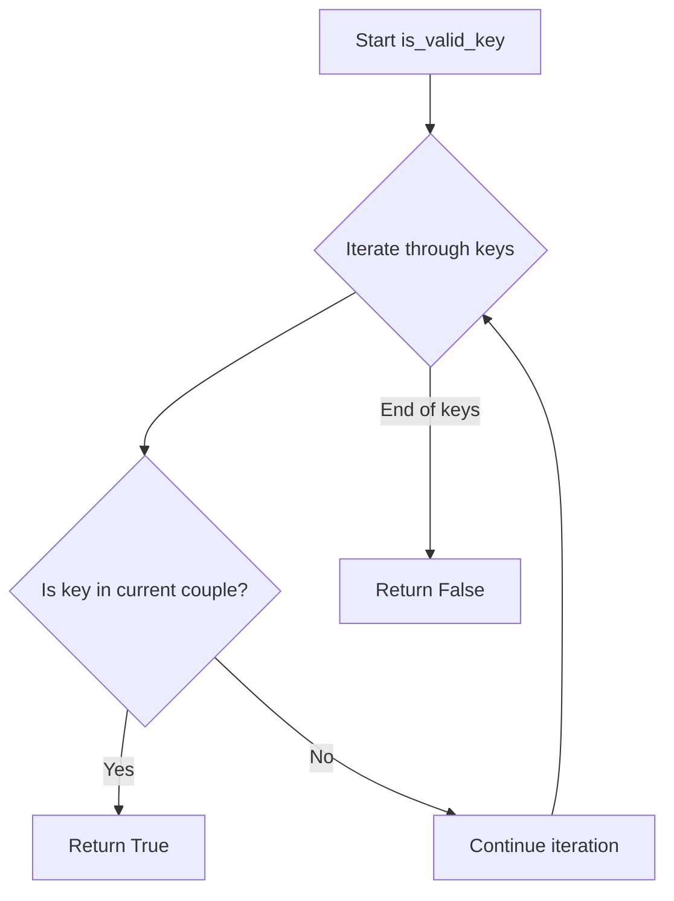
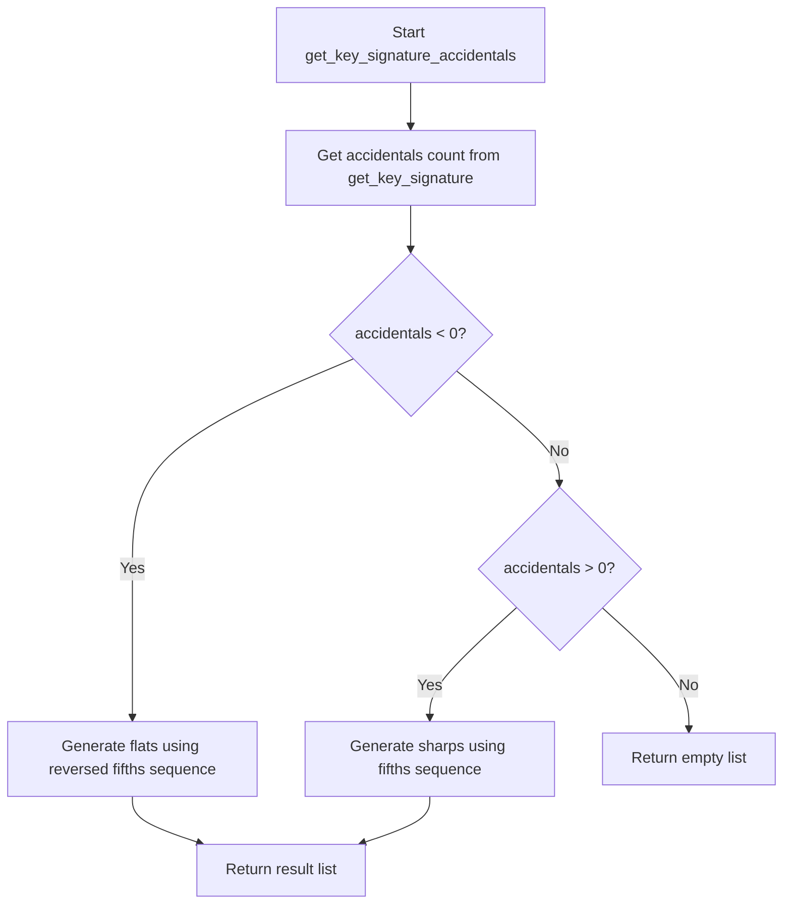
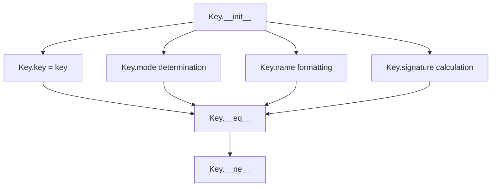

# `keys.py`

## `mingus.core.keys.is_valid_key` · *function*

## Summary:
Validates whether a given key exists within a predefined collection of key couples.

## Description:
This function performs membership testing to determine if a specified key is present in any of the key couples defined in the global `keys` variable. It provides a simple interface for key validation within the music theory module.

## Args:
    key (any): The key value to check for validity. This value is tested for membership in each tuple/list within the global `keys` collection.

## Returns:
    bool: True if the key is found in any of the key couples in the global `keys` collection; False otherwise.

## Raises:
    None explicitly raised by this function.

## Constraints:
    Preconditions:
        - The global variable `keys` must be defined and contain iterable collections (tuples, lists, etc.) of key values.
        - The `key` argument must support membership testing with the elements in `keys`.
        
    Postconditions:
        - The function returns a boolean value indicating key validity.
        - No modifications are made to input arguments or global state.

## Side Effects:
    None.

## Control Flow:


## Examples:
    # Example usage (assuming keys is defined as a list of tuples):
    # keys = [('C', 'D'), ('E', 'F')]
    # print(is_valid_key('C'))  # Output: True
    # print(is_valid_key('G'))  # Output: False
```

## `mingus.core.keys.get_key` · *function*

## Summary:
Returns the musical key corresponding to a specified number of accidentals.

## Description:
This function maps an integer representing the number of accidentals (sharps or flats) to a musical key. It serves as a lookup utility for retrieving key names based on accidental counts, enforcing a strict range constraint on the input parameter.

## Args:
    accidentals (int): Number of accidentals, ranging from -7 to +7. Negative values represent flats, positive values represent sharps. Defaults to 0.

## Returns:
    str: The musical key name associated with the specified number of accidentals.

## Raises:
    RangeError: When the accidentals parameter is outside the valid range of -7 to +7.

## Constraints:
    Preconditions:
        - The accidentals parameter must be an integer
        - The accidentals parameter must be within the inclusive range [-7, 7]
    Postconditions:
        - Returns a string representing a valid musical key
        - The returned key corresponds to the input accidentals count

## Side Effects:
    None

## Control Flow:
```mermaid
flowchart TD
    A[get_key called] --> B{accidentals in range [-7,7]?}
    B -- No --> C[Raise RangeError]
    B -- Yes --> D[Return keys[accidentals+7]]
```

## Examples:
    >>> get_key(0)
    'C'
    >>> get_key(2)
    'D#'
    >>> get_key(-3)
    'Bb'
    >>> get_key(8)
    Traceback (most recent call last):
        ...
    RangeError: integer not in range (-7)-(+7).

## `mingus.core.keys.get_key_signature` · *function*

## Summary:
Calculates the number of accidentals (sharps or flats) for a given musical key.

## Description:
This function determines the key signature for a specified musical key by calculating how many sharps or flats are required. It validates the input key format and maps it to a position in a predefined sequence of keys to compute the accidental count. The function is part of the music theory utilities in the mingus library.

Known callers within the codebase:
- This function is likely called by other components in the mingus.core.keys module that need to determine key signatures for musical analysis or composition tasks.
- It may be invoked during note or chord processing when key context is required.

The logic is extracted into its own function to encapsulate the key signature calculation algorithm, promoting reuse and testability while maintaining clean separation between key validation and signature computation.

## Args:
    key (str): The musical key to calculate the signature for. Defaults to "C". Must be a valid key format recognized by the is_valid_key function.

## Returns:
    int: The number of accidentals for the specified key. Positive values indicate sharps, negative values indicate flats. The calculation is based on the position of the key in an internal sequence where index 7 corresponds to no accidentals (C major/A minor).

## Raises:
    NoteFormatError: When the provided key string is not in a recognized format according to the is_valid_key validation.

## Constraints:
    Preconditions:
        - The key parameter must be a valid key string that can be validated by the is_valid_key function.
        - The global keys variable must be properly defined with the expected structure of key couples.
        
    Postconditions:
        - The function returns an integer representing the number of accidentals for the given key.
        - No side effects occur during execution.

## Side Effects:
    None.

## Control Flow:
```mermaid
flowchart TD
    A[Start get_key_signature] --> B{Validate key format}
    B -->|Invalid key| C[Raise NoteFormatError]
    B -->|Valid key| D[Iterate through keys couples]
    D --> E{Is key in current couple?}
    E -->|Yes| F[accidentals = keys.index(couple) - 7]
    F --> G[Return accidentals]
    E -->|No| H[Continue iteration]
    H --> D
    D -->|End of iteration| I[Should not happen due to validation]
```

## Examples:
    # Calculate key signature for C major (no accidentals)
    accidentals = get_key_signature("C")
    # Returns: 0 (no sharps or flats)
    
    # Calculate key signature for G major (one sharp)
    accidentals = get_key_signature("G")
    # Returns: 1 (one sharp)
    
    # Calculate key signature for F major (one flat)
    accidentals = get_key_signature("F")
    # Returns: -1 (one flat)
```

## `mingus.core.keys.get_key_signature_accidentals` · *function*

## Summary:
Returns a list of accidental note names (sharps or flats) required for a given musical key.

## Description:
This function calculates the key signature for a specified musical key and returns the corresponding accidental notes. It determines whether the key requires sharps or flats and generates the appropriate note names with accidentals. This function is a utility for music theory applications that need to display or work with key signatures.

Known callers within the codebase:
- This function is likely called by UI components or music analysis tools that need to display key signatures for musical keys.
- It may be used in chord progression generators or music notation systems.

The logic is extracted into its own function to separate the calculation of key signature accidentals from the core key signature computation, allowing for cleaner modularization and easier testing of the accidental generation logic.

## Args:
    key (str): The musical key to calculate the signature for. Defaults to "C". Must be a valid key string recognized by the system.

## Returns:
    list[str]: A list of note names with accidentals (either "#" for sharps or "b" for flats) required for the specified key. Empty list is returned for keys with no accidentals (like C major or A minor).

## Raises:
    None explicitly raised by this function, though underlying functions may raise NoteFormatError.

## Constraints:
    Preconditions:
        - The key parameter must be a valid key string that can be processed by the get_key_signature function.
        - The notes.fifths variable must be properly initialized with the expected sequence of notes arranged in perfect fifth order.
        
    Postconditions:
        - The function returns a list of strings representing the accidental notes for the key.
        - No side effects occur during execution.

## Side Effects:
    None.

## Control Flow:


## Examples:
    # Get accidentals for C major (no accidentals)
    accidentals = get_key_signature_accidentals("C")
    # Returns: [] (empty list)
    
    # Get accidentals for G major (one sharp)
    accidentals = get_key_signature_accidentals("G")
    # Returns: ['F#']
    
    # Get accidentals for F major (one flat)
    accidentals = get_key_signature_accidentals("F")
    # Returns: ['Bb']
```

## `mingus.core.keys.get_notes` · *function*

## Summary:
Returns the seven-note scale for a given musical key, including appropriate accidentals.

## Description:
Generates the complete diatonic scale for a specified musical key by combining the base scale notes with any required sharps or flats based on the key's signature. This function serves as the primary interface for retrieving the note sequence associated with a particular key, caching results for performance optimization.

Known callers within the codebase:
- This function is likely called by music theory components that need to determine the notes available in a specific key context.
- It may be used in chord generation, scale analysis, or musical composition tools that require key-specific note information.

The logic is extracted into its own function to encapsulate the complex process of combining base scale notes with key-specific accidentals, providing a clean abstraction for accessing key scales while enabling efficient caching of computed results.

## Args:
    key (str): The musical key for which to retrieve the scale. Defaults to "C". Must be a valid key string recognized by the system.

## Returns:
    list[str]: A list of seven note names representing the diatonic scale for the specified key. Notes may include accidentals ("#" or "b") when required by the key signature.

## Raises:
    NoteFormatError: When the provided key string is not in a recognized format according to the is_valid_key validation.

## Constraints:
    Preconditions:
        - The key parameter must be a valid key string that can be validated by the is_valid_key function.
        - The global base_scale variable must be properly defined with the expected sequence of notes.
        - The _key_cache variable must be initialized as a dictionary for memoization.
        
    Postconditions:
        - The function returns a list of seven note names in proper musical order.
        - The result is cached in _key_cache for subsequent calls with the same key.

## Side Effects:
    - Modifies the global _key_cache dictionary by storing computed results.
    - Accesses global variables: base_scale, _key_cache, and keys-related functions.

## Control Flow:
```mermaid
flowchart TD
    A[Start get_notes] --> B{Key in cache?}
    B -->|Yes| C[Return cached result]
    B -->|No| D{Is valid key?}
    D -->|No| E[Raise NoteFormatError]
    D -->|Yes| F[Get altered notes]
    F --> G{Key signature < 0?}
    G -->|Yes| H[Set symbol = "b"]
    G -->|No| I{Key signature > 0?}
    I -->|Yes| J[Set symbol = "#"]
    I -->|No| K[Set symbol = ""]
    J --> L[Get tonic index]
    L --> M[Generate scale notes]
    M --> N[Add to cache]
    N --> O[Return result]
```

## Examples:
    # Get the C major scale (no accidentals)
    notes = get_notes("C")
    # Returns: ['C', 'D', 'E', 'F', 'G', 'A', 'B']
    
    # Get the G major scale (one sharp)
    notes = get_notes("G")
    # Returns: ['G', 'A', 'B', 'C#', 'D', 'E', 'F#']
    
    # Get the F major scale (one flat)
    notes = get_notes("F")
    # Returns: ['F', 'G', 'A', 'Bb', 'C', 'D', 'Eb']
```

## `mingus.core.keys.relative_major` · *function*

## Summary:
Returns the relative major key for a given minor key.

## Description:
This function maps a minor key to its corresponding relative major key by searching through a predefined collection of key pairs. It is used in music theory applications to convert between minor and major key representations.

The function is extracted into its own component to encapsulate the key mapping logic and provide a clean interface for relative major key calculations, separating this domain-specific transformation from other key processing operations.

## Args:
    key (str): A string representing a minor key (e.g., "a", "c#", "eb"). Must be a valid minor key format.

## Returns:
    str: The relative major key corresponding to the input minor key. For example, the relative major of "a" minor is "c".

## Raises:
    NoteFormatError: When the input key is not recognized as a valid minor key in the keys collection.

## Constraints:
    Preconditions:
        - The input key must be a valid minor key string that exists in the keys collection
        - The keys collection must be properly initialized and contain valid key mappings
    
    Postconditions:
        - Returns a valid major key string that corresponds to the relative major of the input minor key
        - Raises NoteFormatError if the key is not found in the keys collection

## Side Effects:
    None

## Control Flow:
```mermaid
flowchart TD
    A[relative_major(key)] --> B{Iterate through keys collection}
    B --> C{Is key equal to couple[1]?}
    C -->|Yes| D[Return couple[0]]
    C -->|No| E[Continue iteration]
    E --> F{End of keys collection?}
    F -->|Yes| G[raise NoteFormatError]
    F -->|No| B
```

## Examples:
    # Valid usage
    result = relative_major("a")  # Returns "c"
    result = relative_major("c#")  # Returns "e"
    
    # Error case
    try:
        relative_major("invalid_key")
    except NoteFormatError as e:
        print(e)  # Prints "'invalid_key' is not a minor key"
```

## `mingus.core.keys.relative_minor` · *function*

## Summary:
Returns the relative minor key associated with a given major key.

## Description:
This function maps a major key to its corresponding relative minor key by searching through a predefined collection of key pairs. It is used in music theory applications to determine the relative minor relationship between major and minor keys.

The function is extracted into its own component to encapsulate the key mapping logic and provide a clean interface for retrieving relative minor keys, separating this domain-specific knowledge from other musical operations.

## Args:
    key (str): A string representing a major key (e.g., 'C', 'G', 'D'). Must be a valid major key identifier.

## Returns:
    str: The relative minor key corresponding to the input major key (e.g., 'A' for 'C', 'E' for 'G').

## Raises:
    NoteFormatError: When the input key is not recognized as a valid major key.

## Constraints:
    Preconditions:
        - The input key must be a string representing a valid major key
        - The global variable 'keys' must be properly initialized with key mapping pairs
    
    Postconditions:
        - If successful, returns the corresponding relative minor key as a string
        - If unsuccessful, raises NoteFormatError with descriptive message

## Side Effects:
    None

## Control Flow:
```mermaid
flowchart TD
    A[relative_minor(key)] --> B{key in keys?}
    B -->|Yes| C[Return couple[1]]
    B -->|No| D[Raise NoteFormatError]
```

## Examples:
    >>> relative_minor('C')
    'A'
    >>> relative_minor('G')
    'E'
    >>> relative_minor('invalid_key')
    Traceback (most recent call last):
        ...
    NoteFormatError: 'invalid_key' is not a major key

## `mingus.core.keys.Key` · *class*

## Summary:
Represents a musical key with its mode, name, and signature information.

## Description:
The Key class encapsulates the properties of a musical key including its base note, mode (major or minor), full name display, and key signature. It serves as a fundamental abstraction for musical key operations within the mingus library, providing standardized representation and comparison of musical keys.

## State:
- key (str): The base key identifier (e.g., "C", "a", "G#", "Bb"). Valid values are those recognized by the is_valid_key function.
- mode (str): Either "major" or "minor", determined by the case of the first character of the key string. If the first character is lowercase, the mode is minor; otherwise, it's major.
- name (str): A formatted string representation of the key including the base note, accidental symbol (if applicable), and mode (e.g., "C major", "A flat minor").
- signature (int): The key signature value representing the number of sharps or flats for this key. Positive values indicate sharps, negative values indicate flats.

## Lifecycle:
- Creation: Instantiate with a key string (default "C"). The constructor processes the key to determine mode, format the name, and calculate the signature.
- Usage: Typically used for comparing keys via equality operators (__eq__, __ne__) and accessing key properties.
- Destruction: No special cleanup required; standard Python garbage collection applies.

## Method Map:


## Raises:
- NoteFormatError: Raised by get_key_signature() during initialization when the key string is not in a recognized format.

## Example:
```python
# Create a major key
c_major = Key("C")
print(c_major.name)  # Output: "C major"
print(c_major.signature)  # Output: 0

# Create a minor key
a_minor = Key("a")
print(a_minor.mode)  # Output: "minor"

# Compare keys
key1 = Key("G")
key2 = Key("G")
print(key1 == key2)  # Output: True
```

### `mingus.core.keys.Key.__init__` · *method*

## Summary:
Initializes a Key object with a specified musical key and computes its mode, name, and signature.

## Description:
The `__init__` method sets up a Key object by parsing the provided key string to determine its mode (major or minor), constructing a human-readable name, and calculating the key's signature. This method serves as the constructor for the Key class, preparing the object's internal state for subsequent musical operations.

This logic is encapsulated in its own method rather than being inlined because it performs multiple related initialization steps that need to be executed in a specific order. Separating this functionality makes the code more readable, testable, and reusable.

## Args:
    key (str): The musical key to initialize the object with. Defaults to "C". Should be a valid key string that follows standard musical notation conventions (e.g., "C", "G#", "Ab").

## Returns:
    None: This method initializes the object's attributes but does not return a value.

## Raises:
    NoteFormatError: When the provided key string is not in a recognized format according to the is_valid_key validation (raised indirectly via get_key_signature).

## State Changes:
    Attributes READ: 
        - self.key (used to determine mode and construct name)
    Attributes WRITTEN:
        - self.key (set to the provided key)
        - self.mode (set to "minor" if first character is lowercase, otherwise "major")
        - self.name (constructed from key, symbol, and mode)
        - self.signature (computed using get_key_signature function)

## Constraints:
    Preconditions:
        - The key parameter must be a string that can be processed by the key parsing logic
        - The key string should be valid according to the musical notation standards expected by the library
        
    Postconditions:
        - The object's key attribute is set to the provided key string
        - The object's mode attribute is correctly determined (either "major" or "minor")
        - The object's name attribute is properly formatted
        - The object's signature attribute contains the calculated key signature

## Side Effects:
    None: This method does not perform any I/O operations or mutate external objects. It only modifies the instance's internal state.

### `mingus.core.keys.Key.__eq__` · *method*

## Summary:
Compares two Key objects for equality based solely on their musical key names.

## Description:
This method implements the equality comparison operator (==) for Key objects, determining if two keys represent the same musical key. It is automatically called during equality checks between Key instances, such as when using `key1 == key2`. The method provides a clean interface for comparing keys without exposing internal implementation details.

## Args:
    other (Key): Another Key object to compare against this instance

## Returns:
    bool: True if both keys have identical key names, False otherwise

## Raises:
    AttributeError: If the other object does not have a key attribute, which occurs when comparing with non-Key objects

## State Changes:
    Attributes READ: self.key, other.key
    Attributes WRITTEN: None

## Constraints:
    Preconditions: 
    - The other object must be a Key instance or have a key attribute
    - Both self.key and other.key must be comparable (typically strings)
    
    Postconditions:
    - Returns a boolean value indicating key equality
    - Does not modify either Key object's state

## Side Effects:
    None

### `mingus.core.keys.Key.__ne__` · *method*

## Summary:
Implements the inequality comparison operator for Key objects, returning True when two keys are not equal.

## Description:
This method provides the implementation for the `!=` operator between Key instances. It leverages the existing `__eq__` method to determine inequality by negating its result. This approach ensures consistency between equality and inequality comparisons and follows Python's standard protocol for implementing comparison operators.

Known callers:
- This method is automatically invoked during inequality checks between Key objects, such as when using `key1 != key2`
- It is part of the standard comparison protocol that Python uses for object equality testing

The logic is implemented as a separate method rather than being inlined because it maintains consistency with Python's data model and allows for clear separation of concerns. By delegating to `__eq__`, it ensures that the same comparison logic is used for both equality and inequality operations.

## Args:
    other (Key): Another Key instance to compare against

## Returns:
    bool: True if the keys are not equal, False otherwise

## Raises:
    AttributeError: If the other object does not have a key attribute, which occurs when comparing with non-Key objects

## State Changes:
    Attributes READ: self.key, other.key
    Attributes WRITTEN: None

## Constraints:
    Preconditions: 
    - The other object must be a Key instance or have a key attribute
    - Both self.key and other.key must be comparable (typically strings)
    
    Postconditions:
    - Returns a boolean value indicating key inequality
    - Does not modify either Key object's state

## Side Effects:
    None

