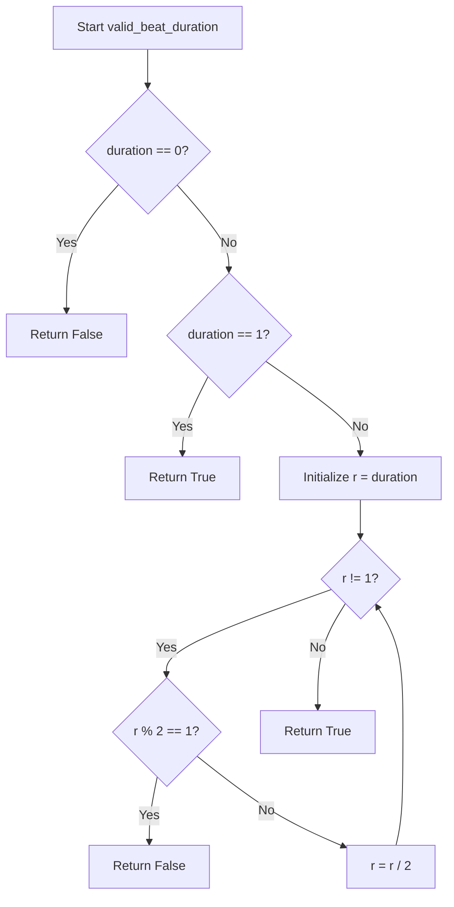

# `meter.py`

## `mingus.core.meter.valid_beat_duration` · *function*

## Summary:
Determines whether a given beat duration is valid according to musical meter constraints, specifically checking if it's a power of two.

## Description:
This function validates if a beat duration is a power of two, which is a fundamental requirement for valid musical meter signatures. In music theory, beat durations must be expressible as powers of two (1, 2, 4, 8, 16...) to maintain proper rhythmic subdivision. This function is used internally by the meter module to ensure that beat durations conform to standard musical notation where beats are typically subdivided by powers of two.

## Args:
    duration (int): The beat duration to validate. Must be a non-negative integer representing the duration in terms of beat subdivisions.

## Returns:
    bool: True if the duration is a valid beat duration (i.e., a power of two), False otherwise.

## Raises:
    None explicitly raised.

## Constraints:
    Preconditions:
        - The input duration must be a non-negative integer.
    Postconditions:
        - Returns a boolean value indicating validity of the beat duration.

## Side Effects:
    None.

## Control Flow:


## Examples:
    >>> valid_beat_duration(1)
    True
    >>> valid_beat_duration(2)
    True
    >>> valid_beat_duration(4)
    True
    >>> valid_beat_duration(3)
    False
    >>> valid_beat_duration(0)
    False
```

## `mingus.core.meter.is_valid` · *function*

## Summary:
Validates whether a musical meter signature is structurally sound by checking that the number of beats is positive and the beat duration is a valid power of two.

## Description:
This function serves as a structural validator for musical meter signatures, ensuring they meet basic requirements for rhythmic representation. It is called by various components within the meter module when processing or validating meter specifications. The function extracts the numerator (number of beats) and denominator (beat duration) from the meter tuple and applies two validation checks: the numerator must be greater than zero, and the denominator must be a valid beat duration (a power of two).

## Args:
    meter (tuple[int, int]): A musical meter signature represented as a tuple of (numerator, denominator) where:
        - numerator (int): Number of beats per measure, must be > 0
        - denominator (int): Beat duration in terms of subdivisions, must be a power of two

## Returns:
    bool: True if the meter is valid (numerator > 0 and denominator is a valid beat duration), False otherwise

## Raises:
    None explicitly raised.

## Constraints:
    Preconditions:
        - The meter argument must be a tuple containing exactly two integers
        - The first element (numerator) must be a positive integer
        - The second element (denominator) must be an integer representing a beat duration
    Postconditions:
        - Returns a boolean value indicating whether the meter satisfies structural requirements

## Side Effects:
    None.

## Control Flow:
```mermaid
flowchart TD
    A[Start is_valid] --> B[meter[0] > 0?]
    B -- No --> C[Return False]
    B -- Yes --> D[valid_beat_duration(meter[1])?]
    D -- No --> E[Return False]
    D -- Yes --> F[Return True]
```

## Examples:
    >>> is_valid((4, 4))
    True
    >>> is_valid((3, 8))
    True
    >>> is_valid((0, 4))
    False
    >>> is_valid((4, 3))
    False
```

## `mingus.core.meter.is_compound` · *function*

## Summary:
Determines whether a musical meter signature represents a compound meter by checking if the number of beats is divisible by 3 and at least 6.

## Description:
This function identifies compound meters in musical notation, which are meters where the beat is subdivided into three equal parts rather than two. It builds upon the structural validation provided by `is_valid` to ensure the meter is properly formed before applying compound-specific criteria. The function is typically called during meter analysis or classification processes within the music theory module.

## Args:
    meter (tuple[int, int]): A musical meter signature represented as a tuple of (numerator, denominator) where:
        - numerator (int): Number of beats per measure, must be > 0
        - denominator (int): Beat duration in terms of subdivisions, must be a power of two

## Returns:
    bool: True if the meter is a compound meter (valid meter with numerator divisible by 3 and >= 6), False otherwise

## Raises:
    None explicitly raised.

## Constraints:
    Preconditions:
        - The meter argument must be a tuple containing exactly two integers
        - The first element (numerator) must be a positive integer
        - The second element (denominator) must be an integer representing a beat duration
    Postconditions:
        - Returns a boolean value indicating whether the meter qualifies as compound

## Side Effects:
    None.

## Control Flow:
```mermaid
flowchart TD
    A[Start is_compound] --> B[is_valid(meter)?]
    B -- No --> C[Return False]
    B -- Yes --> D[meter[0] % 3 == 0?]
    D -- No --> E[Return False]
    D -- Yes --> F[meter[0] >= 6?]
    F -- No --> G[Return False]
    F -- Yes --> H[Return True]
```

## Examples:
    >>> is_compound((6, 8))
    True
    >>> is_compound((9, 8))
    True
    >>> is_compound((4, 4))
    False
    >>> is_compound((3, 4))
    False
    >>> is_compound((6, 4))
    False
```

## `mingus.core.meter.is_simple` · *function*

## Summary:
Determines whether a musical meter signature is structurally valid by delegating to the validation function.

## Description:
This function acts as a simple wrapper that checks if a musical meter signature conforms to basic structural requirements. It is called by various components within the meter module when determining if a meter can be considered valid for further processing. The function extracts the numerator (number of beats) and denominator (beat duration) from the meter tuple and applies validation checks to ensure they meet basic rhythmic representation criteria.

## Args:
    meter (tuple[int, int]): A musical meter signature represented as a tuple of (numerator, denominator) where:
        - numerator (int): Number of beats per measure, must be > 0
        - denominator (int): Beat duration in terms of subdivisions, must be a power of two

## Returns:
    bool: True if the meter is valid according to structural requirements, False otherwise

## Raises:
    None explicitly raised.

## Constraints:
    Preconditions:
        - The meter argument must be a tuple containing exactly two integers
        - The first element (numerator) must be a positive integer
        - The second element (denominator) must be an integer representing a beat duration
    Postconditions:
        - Returns a boolean value indicating whether the meter satisfies structural requirements

## Side Effects:
    None.

## Control Flow:
```mermaid
flowchart TD
    A[Start is_simple] --> B[is_valid(meter)?]
    B --> C[Return is_valid result]
```

## Examples:
    >>> is_simple((4, 4))
    True
    >>> is_simple((3, 8))
    True
    >>> is_simple((0, 4))
    False
    >>> is_simple((4, 3))
    False
```

## `mingus.core.meter.is_asymmetrical` · *function*

## Summary:
Determines whether a musical meter signature is asymmetrical by checking if it is valid and has an odd number of beats.

## Description:
This function evaluates whether a given musical meter signature represents an asymmetrical rhythm pattern. It is called by various components within the meter module when analyzing meter properties for rhythmic classification. The function ensures that the meter is structurally valid before determining if it has an odd number of beats, which is a key characteristic of asymmetrical meters.

## Args:
    meter (tuple[int, int]): A musical meter signature represented as a tuple of (numerator, denominator) where:
        - numerator (int): Number of beats per measure, must be > 0
        - denominator (int): Beat duration in terms of subdivisions, must be a power of two

## Returns:
    bool: True if the meter is valid and has an odd number of beats, False otherwise

## Raises:
    None explicitly raised.

## Constraints:
    Preconditions:
        - The meter argument must be a tuple containing exactly two integers
        - The first element (numerator) must be a positive integer
        - The second element (denominator) must be an integer representing a beat duration
    Postconditions:
        - Returns a boolean value indicating whether the meter is asymmetrical

## Side Effects:
    None.

## Control Flow:
```mermaid
flowchart TD
    A[Start is_asymmetrical] --> B[is_valid(meter)?]
    B -- No --> C[Return False]
    B -- Yes --> D[meter[0] % 2 == 1?]
    D -- No --> E[Return False]
    D -- Yes --> F[Return True]
```

## Examples:
    >>> is_asymmetrical((3, 4))
    True
    >>> is_asymmetrical((4, 4))
    False
    >>> is_asymmetrical((0, 4))
    False
    >>> is_asymmetrical((5, 8))
    True
```

