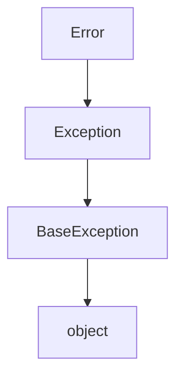
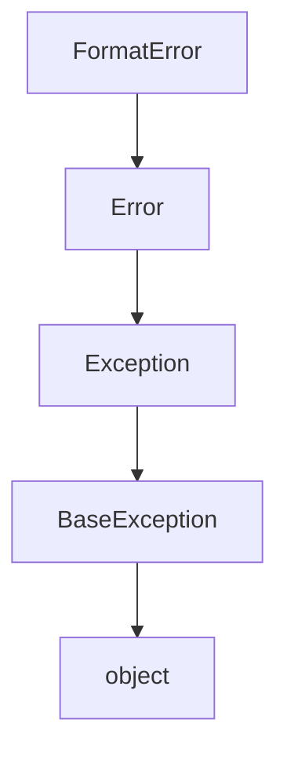
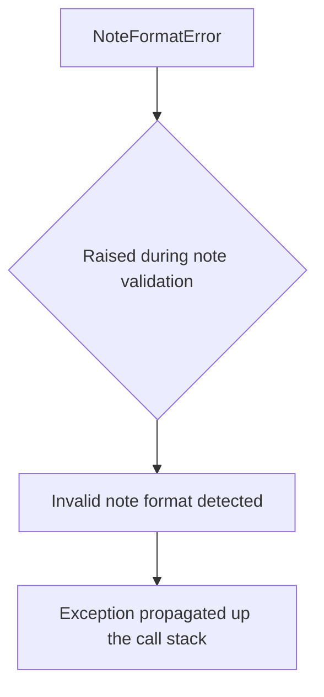
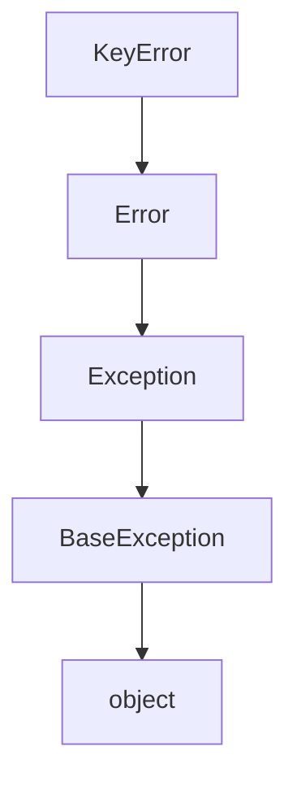
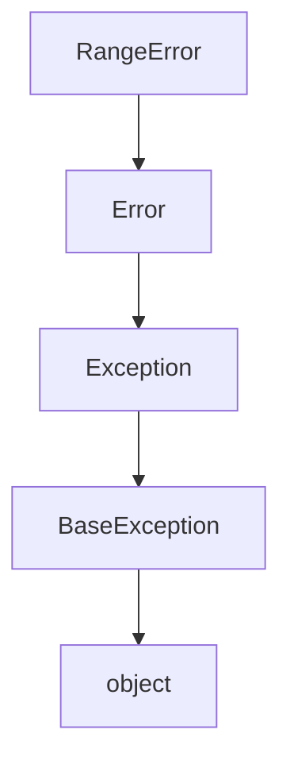
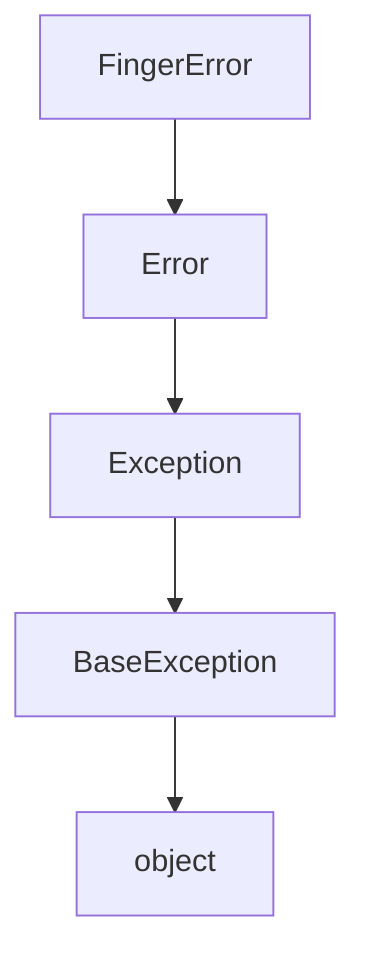

# `mt_exceptions.py`

## `mingus.core.mt_exceptions.Error` · *class*

## Summary:
Base exception class for the mingus music theory library.

## Description:
The Error class serves as the root exception type for all custom exceptions within the mingus core module. It extends Python's built-in Exception class and provides a common base for more specific exception types in the music theory domain. This abstraction allows for consistent error handling throughout the library while maintaining compatibility with standard Python exception mechanisms.

## State:
- No instance attributes are defined beyond those inherited from Exception
- The class inherits all standard Exception properties including message, args, and traceback handling
- No constructor parameters required as it's a simple inheritance extension

## Lifecycle:
- Creation: Instantiated like any standard Exception subclass, typically via direct instantiation or inheritance by more specific exception types
- Usage: Used in try/except blocks to catch music theory-related errors within the mingus library
- Destruction: Managed automatically by Python's garbage collector when no longer referenced

## Method Map:


## Raises:
- No exceptions raised by __init__ as it's a minimal extension of Exception
- Any exceptions raised would come from the standard Exception initialization process

## Example:
```python
try:
    # Some music theory operation that raises an Error
    raise Error("Invalid note specification")
except Error as e:
    print(f"Caught music theory error: {e}")
```

## `mingus.core.mt_exceptions.FormatError` · *class*

## Summary:
Custom exception class representing formatting errors in the mingus music theory library.

## Description:
The FormatError class is a specialized exception type that extends the base Error class to represent issues related to incorrect formatting of musical data within the mingus library. This exception is raised when musical elements such as notes, chords, or scales are provided in an invalid or unexpected format that prevents proper processing.

## State:
- Inherits all attributes from the parent Error class (which itself extends Exception)
- No additional instance attributes are defined beyond those inherited from Exception
- The exception message and arguments are handled through the standard Exception inheritance

## Lifecycle:
- Creation: Instantiated by raising the exception directly or through inheritance by more specific exception types
- Usage: Caught in try/except blocks to handle formatting violations in musical data processing
- Destruction: Automatically managed by Python's garbage collection when no longer referenced

## Method Map:


## Raises:
- No exceptions raised by __init__ as it inherits from Error which inherits from Exception
- Standard Exception initialization behavior applies

## Example:
```python
try:
    # Attempt to process a malformed musical expression
    raise FormatError("Note specification contains invalid characters")
except FormatError as e:
    print(f"Formatting error caught: {e}")
```

## `mingus.core.mt_exceptions.NoteFormatError` · *class*

## Summary:
Represents an error that occurs when a musical note is formatted incorrectly in the mingus music theory library.

## Description:
The NoteFormatError class is a custom exception that extends Python's built-in Error class. It is specifically designed to handle situations where musical notes are provided in an invalid format within the mingus core module. This exception serves as a distinct error type to differentiate note formatting issues from other potential errors in the music theory processing pipeline.

## State:
This class has no instance attributes or state variables beyond what is inherited from the base Error class. It functions purely as an exception type marker.

## Lifecycle:
Creation: Instances are created by raising the exception directly when note formatting validation fails. No special instantiation methods exist beyond standard exception construction.

Usage: Typically raised during note parsing or validation operations within the mingus core module when a note string or representation doesn't conform to expected formats.

Destruction: As a standard Python exception, cleanup is handled automatically by Python's exception handling mechanism.

## Method Map:


## Raises:
This class itself does not raise any exceptions. It is raised by other components in the mingus core module when note formatting validation fails.

## Example:
```python
# Raising the exception when encountering invalid note format
try:
    # Some operation that validates note format
    if not is_valid_note_format(note_string):
        raise NoteFormatError(f"Invalid note format: {note_string}")
except NoteFormatError as e:
    print(f"Caught note format error: {e}")
```

## `mingus.core.mt_exceptions.KeyError` · *class*

## Summary:
Custom exception class for key-related errors in the mingus music theory library.

## Description:
The KeyError class represents exceptions that occur when invalid or unexpected key specifications are encountered within the mingus library. It extends the base Error class, which serves as the foundation for all custom exceptions in the mingus core module. This specialized exception type enables precise error handling for key-related operations while maintaining consistency with the broader error hierarchy.

## State:
- Inherits all attributes from the parent Error class (which itself inherits from Exception)
- No additional instance attributes are defined
- The exception message and arguments are handled through the standard Exception inheritance

## Lifecycle:
- Creation: Instantiated like any standard Exception subclass, typically by passing an error message string to the constructor
- Usage: Caught in try/except blocks when key validation fails or invalid key operations are attempted
- Destruction: Managed automatically by Python's garbage collector when no longer referenced

## Method Map:


## Raises:
- No exceptions raised by __init__ as it inherits standard Exception behavior
- Standard Exception initialization may raise TypeError if invalid arguments are passed

## Example:
```python
try:
    # Attempting to create an invalid key specification
    raise KeyError("Invalid key signature: C# major")
except KeyError as e:
    print(f"Key error occurred: {e}")
```

## `mingus.core.mt_exceptions.RangeError` · *class*

## Summary:
Custom exception class representing range-related errors in the mingus music theory library.

## Description:
The RangeError class is a specialized exception type that extends the base Error class. It is used within the mingus library to indicate when musical computations encounter values outside acceptable numerical ranges. As a subclass of Error, it follows the same pattern as other custom exceptions in the library for consistent error handling.

## State:
- Inherits all attributes from the parent Error class (which itself inherits from Exception)
- No additional instance attributes are defined beyond those inherited from Exception
- Maintains standard Exception behavior including message storage and traceback handling

## Lifecycle:
- Creation: Instantiated like any standard Python exception, typically by calling `RangeError(message)` or inheriting from this class
- Usage: Caught in try/except blocks to handle range violations in music theory computations
- Destruction: Automatically managed by Python's garbage collection when no longer referenced

## Method Map:


## Raises:
- No exceptions raised by __init__ as it inherits standard Exception construction behavior
- Standard Exception initialization may raise TypeError if invalid arguments are passed

## Example:
```python
try:
    # Attempting to create a note outside valid range
    raise RangeError("Frequency value 20000 Hz exceeds maximum allowed 10000 Hz")
except RangeError as e:
    print(f"Range violation detected: {e}")
```

## `mingus.core.mt_exceptions.FingerError` · *class*

## Summary:
Custom exception class representing finger-related errors in music theory operations.

## Description:
The FingerError class is a specialized exception type that extends the base Error class to handle errors specifically related to finger positioning and movement in musical contexts. This exception is raised when operations involving finger placement, fingering patterns, or hand positioning in music theory computations encounter invalid states or impossible configurations.

## State:
- Inherits all attributes from the parent Error class (which itself inherits from Exception)
- No additional instance attributes are defined
- Maintains standard Exception behavior including message storage and traceback handling

## Lifecycle:
- Creation: Instantiated like any standard Python exception, typically by direct construction or through inheritance by more specific finger-related exception types
- Usage: Caught in try/except blocks to handle finger-specific errors in music theory processing
- Destruction: Automatically managed by Python's garbage collection when no longer referenced

## Method Map:


## Raises:
- No exceptions raised by __init__ as it's a minimal extension of the Error class
- Standard Exception initialization behavior applies

## Example:
```python
try:
    # Simulate a finger positioning error
    raise FingerError("Invalid finger assignment for current note")
except FingerError as e:
    print(f"Caught finger error: {e}")
```

