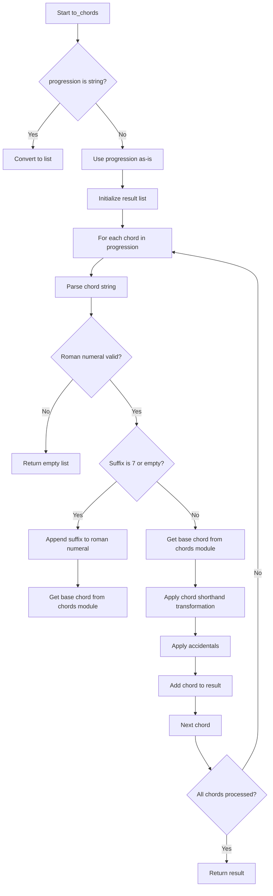

# `progressions.py`

## `mingus.core.progressions.to_chords` · *function*

## Summary:
Converts a musical progression represented as Roman numerals into actual chord objects.

## Description:
Transforms a musical progression string or list of strings into a list of chord objects by parsing Roman numerals, applying accidentals, and resolving chord types. This function serves as the core converter for translating harmonic progressions expressed in Roman numeral notation into playable musical chords.

## Args:
    progression (str or list[str]): A single Roman numeral string or list of Roman numeral strings representing a musical progression. Each string typically starts with a Roman numeral (I, II, III, IV, V, VI, VII) optionally followed by accidentals (# or b) and chord suffixes (like maj7, min, etc.).
    key (str): The musical key in which to interpret the Roman numerals. Defaults to "C".

## Returns:
    list[list[str]]: A list of chord objects, where each chord is represented as a list of note strings. Returns an empty list if an invalid Roman numeral is encountered.

## Raises:
    None explicitly raised

## Constraints:
    - Preconditions: The progression argument must be either a string or a list of strings. The key must be a valid musical key.
    - Postconditions: The returned list contains chord representations as lists of note strings, or an empty list if invalid input is detected.

## Side Effects:
    None

## Control Flow:


## Examples:
    >>> to_chords("I")
    [['C', 'E', 'G']]
    >>> to_chords(["I", "V"])
    [['C', 'E', 'G'], ['G', 'B', 'D']]
    >>> to_chords("IV#")
    [['F#', 'A#', 'C#']]
    >>> to_chords("Ib")
    [['Bb', 'Db', 'F']]
    >>> to_chords("IVmaj7")
    [['F', 'A', 'C', 'E']]
```

## `mingus.core.progressions.determine` · *function*

## Summary:
Determines the functional role and quality of a chord within a given key, returning either descriptive names or shorthand notations.

## Description:
Analyzes a musical chord in the context of a specific key to identify its functional harmony role (tonic, dominant, etc.) and chord quality. The function supports both descriptive naming (e.g., "dominant seventh") and shorthand notation (e.g., "V7"). It handles both single chords and lists of chords, recursively processing nested structures.

This logic is extracted into its own function to encapsulate the complex mapping between chord intervals, key contexts, and functional harmony terminology. Separating this functionality allows for clean reuse in various musical analysis contexts while maintaining a consistent interface for chord functional identification.

## Args:
    chord (list or list[list]): A musical chord represented as a list of note names, or a list of such chords for batch processing
    key (str): The musical key (e.g., "C", "G#") against which the chord's functional role is determined
    shorthand (bool): When True, returns abbreviated forms like "V7" or "iim7". When False, returns full descriptive names like "subdominant seventh". Defaults to False

## Returns:
    list: A list of functional chord descriptions. For single chords, returns a list with one or more functional names. For lists of chords, returns a nested list structure preserving the original hierarchy. Each entry represents the functional role and quality of the input chord within the specified key.

## Raises:
    None explicitly raised

## Constraints:
    Preconditions:
        - The chord parameter must be a list of valid musical note names
        - The key parameter must be a valid musical key string
        - For nested chord lists, all inner lists must also contain valid note names
    Postconditions:
        - Returns a list of functional chord descriptions matching the input structure
        - Each description accurately reflects the chord's role and quality within the specified key

## Side Effects:
    None

## Control Flow:
```mermaid
flowchart TD
    A[Start determine(chord, key, shorthand)] --> B{isinstance(chord[0], list)?}
    B -- Yes --> C[Process each chord in list recursively]
    B -- No --> D[Process single chord]
    C --> E[Return result list]
    D --> F[Get chord type with chords.determine]
    F --> G[Iterate through chord types]
    G --> H[Extract note name and accidentals]
    H --> I[Determine interval with intervals.determine]
    I --> J[Map interval to functional role]
    J --> K[Match chord type with expected types]
    K --> L[Select appropriate functional name]
    L --> M[Apply interval quality prefix]
    M --> N[Append to result]
    N --> O[Return result list]
```

## Examples:
    >>> determine(['C', 'E', 'G'], 'C')
    ['tonic']
    
    >>> determine(['C', 'E', 'G'], 'C', shorthand=True)
    ['I']
    
    >>> determine(['C', 'E', 'G', 'B'], 'C')
    ['dominant seventh']
    
    >>> determine([['C', 'E', 'G'], ['F', 'A', 'C']], 'C')
    [['tonic'], ['subdominant']]
```

## `mingus.core.progressions.parse_string` · *function*

## Summary:
Parses a musical progression string into its Roman numeral, accidental, and suffix components.

## Description:
This function extracts the Roman numeral portion and any accidentals (sharps or flats) from the beginning of a progression string, returning the remaining portion as a suffix. It is designed to handle musical notation where progressions begin with Roman numerals followed by optional accidentals and potentially additional characters.

## Args:
    progression (str): A string representing a musical progression, typically starting with a Roman numeral followed by optional accidentals.

## Returns:
    tuple[str, int, str]: A tuple containing:
        - roman_numeral (str): The extracted Roman numeral (uppercase I or V)
        - acc (int): The number of sharps (positive) or flats (negative) applied to the numeral
        - suffix (str): The remainder of the progression string after the Roman numeral and accidentals

## Raises:
    None explicitly raised

## Constraints:
    - Preconditions: The input must be a string
    - Postconditions: The returned tuple will always contain exactly three elements: a string, an integer, and a string

## Side Effects:
    None

## Control Flow:
```mermaid
flowchart TD
    A[Start parse_string] --> B{Character is #}
    B -- Yes --> C[acc += 1]
    C --> G[Continue loop]
    B -- No --> D{Character is b}
    D -- Yes --> E[acc -= 1]
    E --> G
    D -- No --> F{Character is I or V}
    F -- Yes --> H[roman_numeral += c.upper()]
    H --> G
    F -- No --> I[Break loop]
    G --> J{End of string?}
    J -- No --> A
    J -- Yes --> K[Set suffix = progression[i:]]
    K --> L[Return (roman_numeral, acc, suffix)]
```

## Examples:
    >>> parse_string("IV#")
    ('IV', 1, '')
    >>> parse_string("Vb")
    ('V', -1, '')
    >>> parse_string("I")
    ('I', 0, '')
    >>> parse_string("IVmaj7")
    ('IV', 0, 'maj7')
    >>> parse_string("Ib#")
    ('I', 0, '')
    >>> parse_string("XYZ")
    ('', 0, 'XYZ')
```

## `mingus.core.progressions.tuple_to_string` · *function*

## Summary:
Converts a progression tuple into a string representation with proper accidentals.

## Description:
Transforms a progression tuple containing Roman numeral, accidental count, and suffix into a formatted string. This function handles the conversion of accidental values into proper sharps (#) and flats (b) notation, ensuring the resulting string accurately represents the musical progression. The function normalizes extreme accidental values using modulo arithmetic and applies the appropriate accidentals through prefixing.

## Args:
    prog_tuple (tuple): A tuple containing three elements:
        - roman (str): Roman numeral representation (e.g., "I", "IV")
        - acc (int): Accidental count indicating number of sharps or flats
        - suff (str): Suffix to append to the roman numeral (e.g., "maj", "min")

## Returns:
    str: Formatted string representing the progression with proper accidentals applied

## Raises:
    None explicitly raised

## Constraints:
    - Preconditions: The input must be a tuple with exactly three elements
    - Postconditions: The returned string will contain the roman numeral with appropriate sharps/flats and the suffix appended

## Side Effects:
    None

## Control Flow:
```mermaid
flowchart TD
    A[Start tuple_to_string] --> B[(roman, acc, suff) = prog_tuple]
    B --> C{acc > 6?}
    C -- Yes --> D[acc = 0 - (acc % 6)]
    C -- No --> E{acc < -6?}
    E -- Yes --> F[acc = acc % 6]
    E -- No --> G[Skip adjustment]
    G --> H{acc < 0?}
    H -- Yes --> I[roman = "b" + roman, acc += 1]
    I --> J{acc < 0?}
    J -- Yes --> I
    J -- No --> K{acc > 0?}
    K -- Yes --> L[roman = "#" + roman, acc -= 1]
    L --> M{acc > 0?}
    M -- Yes --> L
    M -- No --> N[Return roman + suff]
```

## Examples:
    >>> tuple_to_string(("I", 2, "maj"))
    "#Imaj"
    >>> tuple_to_string(("V", -3, "min"))
    "bbbVmin"
    >>> tuple_to_string(("IV", 0, "maj"))
    "IVmaj"
    >>> tuple_to_string(("VII", 7, "dim"))
    "bVII(dim)"  # Note: This example assumes suff contains parentheses
    >>> tuple_to_string(("II", -7, "maj"))
    "bIImaj"
```

## `mingus.core.progressions.substitute_harmonic` · *function*

## Summary:
Performs harmonic substitutions on a Roman numeral in a musical progression by replacing it with equivalent harmonic forms.

## Description:
Given a musical progression represented as a list of Roman numeral strings, this function identifies the Roman numeral at the specified index and returns all valid harmonic substitutions according to predefined rules. It supports both forward and reverse substitutions, enabling exploration of harmonic alternatives in musical analysis and composition.

## Args:
    progression (list[str]): A list of Roman numeral strings representing a musical progression
    substitute_index (int): Index of the progression element to substitute
    ignore_suffix (bool): When True, performs substitutions regardless of suffix presence. Defaults to False

## Returns:
    list[str]: A list of possible substituted Roman numeral strings, each representing a valid harmonic replacement. Returns an empty list if no substitutions are applicable.

## Raises:
    None explicitly raised

## Constraints:
    - Preconditions: The progression must be a list of strings, and substitute_index must be a valid index within the list bounds
    - Postconditions: The returned list will contain zero or more valid harmonic substitution strings

## Side Effects:
    None

## Control Flow:
```mermaid
flowchart TD
    A[Start substitute_harmonic] --> B[Initialize simple_substitutions]
    B --> C[Create empty result list res]
    C --> D[Parse progression[substitute_index]]
    D --> E{suffix is empty or "7" or ignore_suffix?}
    E -- No --> F[Return empty list]
    E -- Yes --> G[Iterate through simple_substitutions]
    G --> H{roman equals first element of subs?}
    H -- Yes --> I[r = second element of subs]
    H -- No --> J{roman equals second element of subs?}
    J -- Yes --> K[r = first element of subs]
    J -- No --> L[r = None]
    L --> M{r is not None?}
    M -- Yes --> N[suff = "7" if suff was "7" else ""]
    N --> O[Append tuple_to_string((r, acc, suff)) to res]
    O --> P[Continue iteration]
    P --> Q[Return res]
```

## Examples:
    >>> progression = ["I", "IV", "V"]
    >>> substitute_harmonic(progression, 0)
    ['#III', '#VI']
    
    >>> progression = ["IV", "V", "I"]
    >>> substitute_harmonic(progression, 0)
    ['II', 'VI']
    
    >>> progression = ["I7", "IV", "V"]
    >>> substitute_harmonic(progression, 0, ignore_suffix=True)
    ['#III', '#VI']
    
    >>> progression = ["V", "I", "IV"]
    >>> substitute_harmonic(progression, 0)
    ['VII']
```

## `mingus.core.progressions.substitute_minor_for_major` · *function*

## Summary:
Transforms minor chords into their major equivalents within a musical progression by advancing the diatonic scale position.

## Description:
This function converts minor chords (notated with "m" or "m7" suffixes) or specific diatonic scale degrees (II, III, VI without suffix) into their major counterparts. It operates by calculating the major equivalent through a two-position advancement in the diatonic scale and adjusting the accidental accordingly. This is commonly used in music theory to analyze harmonic progressions or generate alternative chord sequences.

## Args:
    progression (list[str]): A list of musical progression strings, each representing a chord in Roman numeral notation.
    substitute_index (int): Index of the chord in the progression list to potentially substitute.
    ignore_suffix (bool): When True, forces substitution regardless of the chord's suffix. Defaults to False.

## Returns:
    list[str]: A list containing the substituted major chord string, or an empty list if no substitution occurs. The returned string follows the format of the original chord but with a major quality (capital letter) and adjusted accidentals.

## Raises:
    None explicitly raised

## Constraints:
    Preconditions:
        - The progression list must contain at least one element at substitute_index.
        - The progression element at substitute_index must be a valid Roman numeral string.
    Postconditions:
        - If substitution occurs, the returned list contains exactly one string representing the major equivalent.
        - If no substitution occurs, the returned list is empty.
        - The function preserves the original suffix pattern when applicable.

## Side Effects:
    None

## Control Flow:
```mermaid
flowchart TD
    A[Start substitute_minor_for_major] --> B[Parse progression[substitute_index]]
    B --> C{suffix is "m" OR "m7" OR ("" AND roman in [II,III,VI]) OR ignore_suffix?}
    C -- No --> D[Return empty list]
    C -- Yes --> E[Calculate new roman numeral with skip(roman, 2)]
    E --> F[Calculate accidental adjustment with interval_diff]
    F --> G{suffix is "m" OR ignore_suffix?}
    G -- Yes --> H[Append "M" suffix]
    G -- No --> I{suffix is "m7" OR ignore_suffix?}
    I -- Yes --> J[Append "M7" suffix]
    I -- No --> K{suffix is "" OR ignore_suffix?}
    K -- Yes --> L[Append empty suffix]
    H --> M[Return result list]
    J --> M
    L --> M
```

## Examples:
    >>> progression = ["I", "ii", "iii", "IV", "V", "vi", "vii"]
    >>> substitute_minor_for_major(progression, 1)
    ['#I']  # ii (minor) becomes #I (major) - advances 2 positions in diatonic scale
    
    >>> progression = ["I", "iii", "IV", "V"]
    >>> substitute_minor_for_major(progression, 1)
    ['I']  # iii (minor) becomes I (major) - advances 2 positions in diatonic scale
    
    >>> progression = ["I", "ii", "iii", "IV"]
    >>> substitute_minor_for_major(progression, 1, ignore_suffix=True)
    ['#I']  # Forces substitution even though it's a minor chord
    
    >>> progression = ["I", "ii", "iii", "IV"]
    >>> substitute_minor_for_major(progression, 2)
    []  # iii has no suffix, but not in [II,III,VI], so no substitution
```

## `mingus.core.progressions.substitute_major_for_minor` · *function*

## Summary:
Replaces major chord progressions with their minor equivalents in a musical progression at a specified index.

## Description:
This function transforms major chords (indicated by suffix "M", "M7", or empty suffix for I, IV, V) into their minor counterparts by calculating the appropriate diatonic scale degree and applying the necessary semitone adjustments. It's designed to facilitate harmonic modifications in musical progressions, particularly when converting major tonalities to minor ones.

The function operates on a progression list and modifies only the element at the specified index, returning a list containing the transformed progression. It's commonly used in music theory applications where chord substitutions are needed.

## Args:
    progression (list[str]): A list of progression strings representing musical chords in Roman numeral notation.
    substitute_index (int): Index of the progression element to be substituted.
    ignore_suffix (bool): When True, treats all chords as major for substitution purposes. Defaults to False.

## Returns:
    list[str]: A list containing the transformed progression string if substitution occurred, otherwise an empty list.

## Raises:
    None explicitly raised

## Constraints:
    - Preconditions:
        - The progression list must contain at least one element at substitute_index
        - The progression element at substitute_index must be parseable by parse_string
        - The progression element at substitute_index must be a valid Roman numeral with optional accidentals
    - Postconditions:
        - The returned list will contain at most one element
        - The returned element will be properly formatted with accidentals and suffixes

## Side Effects:
    None

## Control Flow:
```mermaid
flowchart TD
    A[Start substitute_major_for_minor] --> B[Parse progression element at substitute_index]
    B --> C{Sufficient conditions for substitution?}
    C -- No --> D[Return empty list]
    C -- Yes --> E[Calculate minor equivalent using skip(roman, 5)]
    E --> F[Calculate semitone adjustment using interval_diff]
    F --> G{Determine suffix type}
    G -- "M" or ignore_suffix --> H[Create "m" suffix]
    G -- "M7" or ignore_suffix --> I[Create "m7" suffix]
    G -- "" or ignore_suffix --> J[Create empty suffix]
    H --> K[Format result with tuple_to_string]
    I --> K
    J --> K
    K --> L[Return list with transformed element]
```

## Examples:
    >>> progression = ["I", "IV", "V"]
    >>> substitute_major_for_minor(progression, 0)
    ['i']
    
    >>> progression = ["IM", "IV", "V"]
    >>> substitute_major_for_minor(progression, 0)
    ['im']
    
    >>> progression = ["I", "IV", "V"]
    >>> substitute_major_for_minor(progression, 0, ignore_suffix=True)
    ['i']
    
    >>> progression = ["IVM7", "V", "I"]
    >>> substitute_major_for_minor(progression, 0)
    ['ivm7']
```

## `mingus.core.progressions.substitute_diminished_for_diminished` · *function*

## Summary:
Replaces a diminished chord in a musical progression with a sequence of three consecutive diminished chords.

## Description:
This function takes a musical progression and substitutes a specific diminished chord (identified by its index) with a sequence of three consecutive diminished chords. It specifically targets chords marked as "dim", "dim7", or "VII" (when no suffix is present) and generates a series of related diminished chords by advancing through the diatonic scale. This is commonly used in music theory to expand a single diminished chord into a sequence of related chords.

## Args:
    progression (list[str]): A list of musical progression strings, where each string represents a chord in the progression.
    substitute_index (int): The index in the progression list of the chord to be substituted.
    ignore_suffix (bool): When True, treats any chord with no suffix as a diminished chord. Defaults to False.

## Returns:
    list[str]: A list of three strings representing the substituted diminished chords. Each string follows the same format as the input progression strings.

## Raises:
    None explicitly raised

## Constraints:
    - Preconditions: The progression list must contain at least one element, and substitute_index must be a valid index within the list.
    - Postconditions: The returned list will always contain exactly three strings representing diminished chords.

## Side Effects:
    None

## Control Flow:
```mermaid
flowchart TD
    A[Start substitute_diminished_for_diminished] --> B[Parse progression[substitute_index]]
    B --> C{Is diminished chord?}
    C -- No --> D[Return empty list]
    C -- Yes --> E[Set suff = "dim" if empty]
    E --> F[Initialize last = roman]
    F --> G[Loop 3 times]
    G --> H[Calculate next = skip(last, 2)]
    H --> I[Adjust acc += interval_diff(last, next, 3)]
    I --> J[Append tuple_to_string((next, acc, suff)) to res]
    J --> K[Set last = next]
    K --> L[Loop counter < 3?]
    L -- Yes --> G
    L -- No --> M[Return res]
```

## Examples:
    >>> progression = ["I", "VII", "IV"]
    >>> substitute_diminished_for_diminished(progression, 1)
    ['bVII', 'bbVIII', 'bbbIX']
    
    >>> progression = ["I", "VIIdim", "IV"]
    >>> substitute_diminished_for_diminished(progression, 1)
    ['bVII', 'bbVIII', 'bbbIX']
    
    >>> progression = ["I", "VII", "IV"]
    >>> substitute_diminished_for_diminished(progression, 1, ignore_suffix=True)
    ['bVII', 'bbVIII', 'bbbIX']
```

## `mingus.core.progressions.substitute_diminished_for_dominant` · *function*

## Summary:
Replaces diminished chords with a series of dominant seventh chords in a musical progression.

## Description:
This function transforms diminished chords (specifically dim7, dim, or VII chords with no suffix) into a sequence of four dominant seventh chords that maintain harmonic function. The substitution leverages diatonic scale relationships to create musically coherent replacements.

The function is typically used in musical analysis or composition tools where diminished chords need to be converted to more conventional dominant seventh forms for compatibility with certain analysis methods or musical contexts.

## Args:
    progression (list[str]): A list of musical progression strings representing chord symbols.
    substitute_index (int): Index in the progression list identifying which chord to potentially substitute.
    ignore_suffix (bool): When True, treats any chord with no suffix as a candidate for substitution. Defaults to False.

## Returns:
    list[str]: A list of four strings representing dominant seventh chords that substitute the original diminished chord. Returns an empty list if the chord at substitute_index is not a diminished chord.

## Raises:
    None explicitly raised

## Constraints:
    - Preconditions: 
        - The progression list must contain at least substitute_index + 1 elements
        - The chord at progression[substitute_index] must be a valid musical progression string
    - Postconditions:
        - If substitution occurs, exactly 4 dominant seventh chords are returned
        - If no substitution occurs, an empty list is returned

## Side Effects:
    None

## Control Flow:
```mermaid
flowchart TD
    A[Start substitute_diminished_for_dominant] --> B[Parse chord at substitute_index]
    B --> C{Is diminished chord?}
    C -- No --> D[Return empty list]
    C -- Yes --> E[Set suffix = "dim" if empty]
    E --> F[Initialize last = roman]
    F --> G[Loop 4 times]
    G --> H[Calculate next = skip(last, 2)]
    H --> I[Calculate dom = skip(last, 5)]
    I --> J[Calculate acc adjustment = interval_diff(last, dom, 8)]
    J --> K[Append tuple_to_string((dom, acc + adjustment, "dom7"))]
    K --> L[Set last = next]
    L --> M{Loop counter < 4?}
    M -- Yes --> G
    M -- No --> N[Return result list]
```

## Examples:
    >>> progression = ["I", "VII", "IV", "V"]
    >>> substitute_diminished_for_dominant(progression, 1)
    ['III(dom7)', 'V(dom7)', 'vii(dom7)', 'ii(dom7)']
    
    >>> progression = ["I", "VIIdim", "IV", "V"]
    >>> substitute_diminished_for_dominant(progression, 1)
    ['III(dom7)', 'V(dom7)', 'vii(dom7)', 'ii(dom7)']
    
    >>> progression = ["I", "VIIdim7", "IV", "V"]
    >>> substitute_diminished_for_dominant(progression, 1)
    ['III(dom7)', 'V(dom7)', 'vii(dom7)', 'ii(dom7)']
    
    >>> progression = ["I", "IV", "V", "VII"]
    >>> substitute_diminished_for_dominant(progression, 3)
    []
```

## `mingus.core.progressions.substitute` · *function*

## Summary:
Generates alternative musical progressions by substituting a Roman numeral with harmonically related options based on music theory.

## Description:
This function performs harmonic substitution on a musical progression by replacing a specified Roman numeral with various alternative harmonies that maintain harmonic coherence. It implements substitution rules based on common harmonic practices, such as replacing dominant seventh chords with their related triads or secondary dominants, and generates both direct substitutions and recursive variations.

The function is typically used in harmonic analysis or composition tools where exploring alternative progressions is needed. It works with musical progressions expressed in Roman numeral notation, making it suitable for applications involving chord progression generation or analysis.

## Args:
    progression (list[str]): A list of Roman numeral strings representing a musical progression (e.g., ["I", "V", "vi"]).
    substitute_index (int): Index of the progression element to be substituted.
    depth (int): Recursion depth for generating nested substitutions. Defaults to 0.

## Returns:
    list[str]: A list of alternative progression strings that can replace the original progression at the specified index.

## Raises:
    None explicitly raised

## Constraints:
    - Preconditions: 
        - The progression must be a list of strings
        - The substitute_index must be a valid index within the progression list
        - The progression elements must be valid Roman numeral strings that can be parsed by parse_string
    - Postconditions:
        - The returned list will contain valid Roman numeral strings in proper musical notation
        - All returned strings will be properly formatted with accidentals and suffixes

## Side Effects:
    None

## Control Flow:
```mermaid
flowchart TD
    A[Start substitute] --> B[Parse progression element]
    B --> C{Suffix type}
    C -->|"" or "7"| D[Apply simple substitutions]
    C -->|"" or "M" or "m"| E[Add seventh chord variant]
    C -->|"m" or "m7"| F[Add major seventh variants]
    C -->|"M" or "M7"| G[Add minor seventh variants]
    C -->|"dim7" or "dim"| H[Add diminished variants]
    H --> I[Generate 4-step diminished chain]
    D --> J[Combine all substitutions]
    J --> K{Depth > 0?}
    K -->|Yes| L[Recursively substitute each result]
    K -->|No| M[Return results]
    L --> M
```

## Examples:
    >>> progression = ["I", "V", "vi"]
    >>> substitute(progression, 1)
    ['I', 'VII', 'IIdim7', 'IVdim7', 'bVIIdim7', 'V', 'vi', 'V7', 'Vmin7', 'Vmaj7', 'Vmin', 'Vmaj']

    >>> progression = ["I", "V7", "vi"]
    >>> substitute(progression, 1, depth=1)
    ['I', 'VII', 'IIdim7', 'IVdim7', 'bVIIdim7', 'V', 'vi', 'V7', 'Vmin7', 'Vmaj7', 'Vmin', 'Vmaj', ...]

## `mingus.core.progressions.interval_diff` · *function*

## Summary:
Computes the semitone adjustment needed to transform one musical progression interval into another based on numeral representations.

## Description:
This function calculates the difference in semitones between two musical progressions represented as numerals. It's used in musical progression analysis to determine how many semitone adjustments are required to move from one progression to another while maintaining a specific interval relationship.

## Args:
    progression1 (str): The first musical progression numeral (e.g., 'I', 'IV', 'V') that must exist in the global numerals list.
    progression2 (str): The second musical progression numeral (e.g., 'I', 'IV', 'V') that must exist in the global numerals list.
    interval (int): The target interval in semitones to reach.

## Returns:
    int: The number of semitone adjustments needed (positive or negative) to achieve the target interval.

## Raises:
    ValueError: When either progression1 or progression2 is not found in the global numerals list.

## Constraints:
    Preconditions:
        - Both progression1 and progression2 must be valid elements in the global numerals list.
        - The interval argument must be a valid integer representing semitones.
        - The global variables 'numerals' and 'numeral_intervals' must be defined in the module scope.
    Postconditions:
        - The returned value represents the adjustment needed to reach the target interval.
        - The function handles circular interval arithmetic by adding 12 to j when j < i.

## Side Effects:
    None.

## Control Flow:
```mermaid
flowchart TD
    A[Start] --> B{progression1 in numerals?}
    B -- No --> C[ValueError]
    B -- Yes --> D{progression2 in numerals?}
    D -- No --> C[ValueError]
    D -- Yes --> E[i = numeral_intervals[numerals.index(progression1)]]
    E --> F[j = numeral_intervals[numerals.index(progression2)]]
    F --> G[acc = 0]
    G --> H{j < i?}
    H -- Yes --> I[j += 12]
    I --> J[while j - i > interval]
    J --> K[acc -= 1]
    K --> L[j -= 1]
    L --> M[J]
    M --> N[while j - i < interval]
    N --> O[acc += 1]
    O --> P[j += 1]
    P --> Q[N]
    Q --> R[Return acc]
```

## Examples:
    # Example 1: Basic usage
    # Assuming numerals = ['I', 'ii', 'iii', 'IV', 'V', 'vi', 'vii°']
    # Assuming numeral_intervals = [0, 2, 4, 5, 7, 9, 11]
    result = interval_diff('I', 'V', 7)
    # Returns the adjustment needed to get from I to V with a 7-semitone interval
    
    # Example 2: With descending progression
    result = interval_diff('V', 'I', 7)
    # Handles circular arithmetic when j < i by adding 12 to j

## `mingus.core.progressions.skip` · *function*

## Summary:
Calculates the Roman numeral at a specified offset from the input numeral in a diatonic scale sequence.

## Description:
This function advances through a diatonic scale by skipping a specified number of positions forward from the given Roman numeral. It uses modular arithmetic to ensure the result wraps around the diatonic scale sequence.

The function assumes the existence of a predefined sequence of Roman numerals representing diatonic scale degrees, and computes the new position by adding the skip count to the index of the input numeral.

## Args:
    roman_numeral (str): A Roman numeral representing a degree in a diatonic scale sequence. Must be a valid member of the internal numerals sequence.
    skip_count (int): Number of positions to advance in the diatonic scale. Defaults to 1.

## Returns:
    str: The Roman numeral at the calculated position in the diatonic scale sequence. Wraps around using modular arithmetic when exceeding sequence bounds.

## Raises:
    ValueError: When the roman_numeral is not found in the internal numerals sequence.

## Constraints:
    Preconditions:
        - The roman_numeral must be a valid Roman numeral from the internal sequence.
        - The internal numerals sequence must contain at least 7 elements.
    Postconditions:
        - The returned value will always be a valid Roman numeral from the internal sequence.
        - The result wraps around the sequence using modulo 7 arithmetic.

## Side Effects:
    None

## Control Flow:
```mermaid
flowchart TD
    A[Input roman_numeral] --> B{Find index in numerals}
    B --> C[Add skip_count]
    C --> D[Apply modulo 7]
    D --> E[Return numerals[result]]
```

## Examples:
    >>> skip('I', 2)
    'iii'  # Assuming standard diatonic sequence
    >>> skip('V', 1)
    'vi'   # Assuming standard diatonic sequence
    >>> skip('vii', 2)
    'ii'   # Assuming standard diatonic sequence
```

