# `scales.py`

## `mingus.core.scales.determine` · *function*

## Summary:
Identifies all major and minor scales that could contain a given set of musical notes by performing set-based comparisons against scale patterns.

## Description:
This function takes a collection of musical notes and determines which major and minor scales could potentially encompass all of those notes. It systematically tests each key and scale combination by comparing the input notes against the ascending and descending patterns of all available scale types. The function is particularly useful for music theory applications where one needs to identify possible scale relationships from a set of pitches.

The logic is extracted into its own function to encapsulate the complex process of scale matching and comparison, providing a clean interface for identifying scale possibilities from arbitrary note sets while maintaining separation between the matching algorithm and the underlying scale implementations.

## Args:
    notes (list[str]): A list of musical note names to analyze. Each note should be represented as a string (e.g., 'C', 'D#', 'Eb'). The function converts this to a set internally for efficient comparison.

## Returns:
    list[str]: A list of scale names that could potentially contain all the input notes. Each scale name corresponds to a major or minor scale that matches the note set. The list may contain duplicates if multiple keys produce the same scale.

## Raises:
    None explicitly raised by this function. However, underlying operations may raise exceptions from the scale classes or key processing functions.

## Constraints:
    Preconditions:
        - Input notes must be valid musical note names that can be processed by the scale classes.
        - The global `keys` variable must contain valid key definitions.
        - Scale classes must be properly implemented with `type`, `ascending()`, `descending()`, and `name` attributes.
        - The `get_notes` function must work correctly for extracting key-specific notes.
        
    Postconditions:
        - The returned list contains only scale names that match the input note set.
        - The function performs subset comparisons using set operations to ensure all input notes are contained within the scale patterns.

## Side Effects:
    - None directly observable from the function interface.
    - May indirectly cause side effects through calls to scale classes and their methods.
    - Accesses global variables including `keys` and scale subclasses via `_Scale.__subclasses__()`.

## Control Flow:
```mermaid
flowchart TD
    A[Start determine] --> B[Convert notes to set]
    B --> C[Initialize result list]
    C --> D[Iterate through keys]
    D --> E[Iterate through scale subclasses]
    E --> F{Scale type is major?}
    F -->|Yes| G[Create major scale with key[0]]
    F -->|No| H[Create minor scale with get_notes(key[1])[0]]
    G --> I[Check major scale match]
    H --> J[Check minor scale match]
    I --> K{Notes subset of ascending?}
    K -->|Yes| L[Add scale name to result]
    K -->|No| M{Notes subset of descending?}
    M -->|Yes| L
    M -->|No| N[Continue]
    J --> O{Notes subset of ascending?}
    O -->|Yes| L
    O -->|No| P{Notes subset of descending?}
    P -->|Yes| L
    P -->|No| N
    N --> Q[Continue iteration]
    Q --> R{More keys?}
    R -->|Yes| D
    R -->|No| S[Return result]
```

## Examples:
    # Find scales containing C, E, G notes (C major)
    scales = determine(['C', 'E', 'G'])
    # Returns: ['C major', 'E minor', 'G major', ...] (scale names matching the notes)
    
    # Find scales containing C, Eb, G notes (C minor)
    scales = determine(['C', 'Eb', 'G'])
    # Returns: ['C minor', 'Eb major', 'G minor', ...] (scale names matching the notes)

## `mingus.core.scales._Scale` · *class*

## Summary:
Abstract base class for musical scales that defines the interface for scale operations.

## Description:
The `_Scale` class is an abstract base class that provides a standardized interface for musical scale implementations. It defines the common structure and operations for scales while leaving the specific scale pattern implementation to concrete subclasses. The class manages the tonic note and octave span, and provides methods for retrieving scale degrees and sequences.

## State:
- `tonic` (str): The root note of the scale, stored as a string. Must be an uppercase letter representing a note name (e.g., 'C', 'D#'). 
- `octaves` (int): Number of octaves the scale spans. Must be a positive integer.

## Lifecycle:
- Creation: Instantiate with a tonic note (string) and number of octaves (integer). The tonic must be in uppercase format.
- Usage: Concrete subclasses must implement the `ascending()` method to define their specific scale pattern. Then methods like `degree()` can be used to retrieve specific scale degrees.
- Destruction: No special cleanup required; uses standard Python object destruction.

## Method Map:
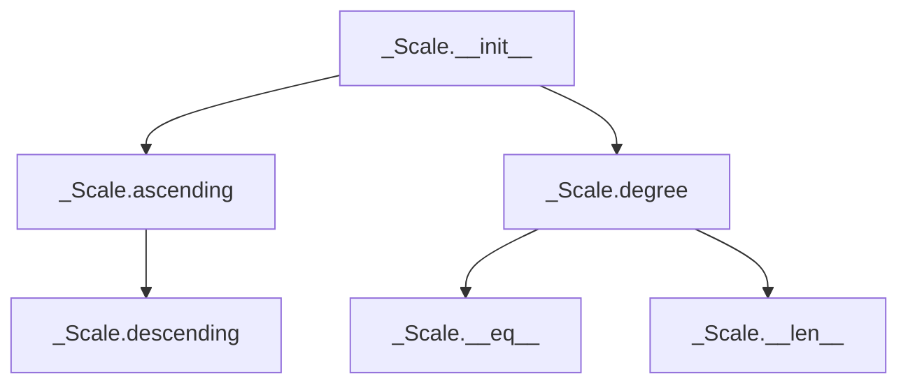

## Raises:
- `NoteFormatError`: Raised in `__init__` when the tonic note is lowercase (invalid format).
- `RangeError`: Raised in `degree()` when degree_number is less than 1.
- `FormatError`: Raised in `degree()` when direction is neither 'a' nor 'd'.
- `NotImplementedError`: Raised in `ascending()` when called on the abstract base class without implementation.

## Example:
```python
# Creating a scale instance (requires concrete subclass)
# scale = MajorScale('C', 2)  # hypothetical concrete implementation

# Accessing scale properties
# print(scale.tonic)     # 'C'
# print(scale.octaves)   # 2

# Getting scale notes (requires concrete implementation)
# ascending_notes = scale.ascending()    # ['C', 'D', 'E', 'F', 'G', 'A', 'B']
# descending_notes = scale.descending()  # ['B', 'A', 'G', 'F', 'E', 'D', 'C']

# Getting specific scale degrees
# first_degree = scale.degree(1)    # 'C'
# fifth_degree = scale.degree(5)    # 'G'
```

### `mingus.core.scales._Scale.__init__` · *method*

## Summary:
Initializes a Scale object with a tonic note and octave range.

## Description:
This method sets up the fundamental properties of a Scale object by storing the tonic note and the number of octaves. It validates that the note is properly formatted (not lowercase) and raises an exception if not. This validation ensures that scale objects are created with properly formatted musical notes.

## Args:
    note (str): The tonic note of the scale, must be a properly formatted note string (uppercase).
    octaves (int): The number of octaves the scale spans.

## Returns:
    None: This method does not return a value.

## Raises:
    NoteFormatError: When the note parameter is lowercase, indicating an unrecognized note format.

## State Changes:
    Attributes READ: None
    Attributes WRITTEN: self.tonic, self.octaves

## Constraints:
    Preconditions: The note parameter must be a string that is not all lowercase characters.
    Postconditions: The Scale object will have its tonic attribute set to the provided note and octaves attribute set to the provided octaves value.

## Side Effects:
    None: This method performs no I/O operations or external service calls.

### `mingus.core.scales._Scale.__repr__` · *method*

## Summary:
Returns a string representation of the Scale object that includes its name.

## Description:
This method provides a standardized string representation for Scale objects, primarily used for debugging and logging purposes. It is automatically invoked when the built-in repr() function is called on a Scale instance. The method formats the object's name attribute into a descriptive string that clearly identifies the object as a Scale and displays its name.

This method exists to provide a consistent and informative textual representation of Scale objects, making them easier to identify in debug output and logs. Rather than inlining this formatting logic, it's separated into its own method to maintain clean code organization and ensure consistent representation across all Scale instances.

## Args:
    None

## Returns:
    str: A formatted string in the pattern "<Scale object ('{0}')>" where '{0}' represents the value of the object's name attribute.

## Raises:
    AttributeError: If the Scale object does not have a name attribute defined.

## State Changes:
    Attributes READ: self.name
    Attributes WRITTEN: None

## Constraints:
    Preconditions: The Scale object must have a name attribute that can be formatted into a string.
    Postconditions: The returned string is always in the format "<Scale object ('{name}')>" where {name} is the actual name value.

## Side Effects:
    None

### `mingus.core.scales._Scale.__str__` · *method*

## Summary:
Returns a formatted string representation showing both ascending and descending forms of the scale.

## Description:
Provides a human-readable string representation of a scale by displaying its ascending and descending forms. This method serves as the primary visualization interface for scale objects, making it easy to inspect scale content and structure. The method is called automatically when str() is applied to a scale object or when the object is printed.

This logic is implemented as a dedicated method rather than being inlined because it provides a standardized, consistent display format for all scale types. It separates the presentation logic from the core scale generation logic, allowing different scale implementations to focus solely on generating the note sequences while this method handles formatting.

## Args:
    None

## Returns:
    str: A formatted string containing two lines - the first line shows the ascending scale notes separated by spaces, and the second line shows the descending scale notes separated by spaces.

## Raises:
    None

## State Changes:
    - Attributes READ: self.ascending(), self.descending()
    - Attributes WRITTEN: None

## Constraints:
    - Precondition: The scale object must be properly initialized with a valid tonic note and octave count
    - Postcondition: The returned string format is consistent across all scale types and always follows "Ascending: {notes}\nDescending: {notes}" structure

## Side Effects:
    - None

### `mingus.core.scales._Scale.__eq__` · *method*

## Summary:
Compares two scale objects for equality based on their ascending and descending note sequences.

## Description:
This method implements the equality comparison operator (`==`) for scale objects. It determines if two scales are equal by comparing their ascending and descending note sequences. This method is part of Python's special methods (dunder methods) that define object comparison behavior. The comparison requires both the ascending and descending forms to be identical between the two scale objects.

## Args:
    other (object): Another scale object to compare against. Must be an instance of a scale subclass that implements the ascending() and descending() methods.

## Returns:
    bool: True if both scales have identical ascending and descending note sequences, False otherwise

## Raises:
    None explicitly raised

## State Changes:
    Attributes READ: 
    - self.ascending() - retrieves the ascending note sequence
    - self.descending() - retrieves the descending note sequence  
    - other.ascending() - retrieves the other scale's ascending note sequence
    - other.descending() - retrieves the other scale's descending note sequence

## Constraints:
    Preconditions:
    - The `other` object must be a scale instance (though no explicit type check is performed)
    - Both `self.ascending()` and `self.descending()` methods must be callable and return comparable values (typically lists of note strings)
    - Both `other.ascending()` and `other.descending()` methods must be callable and return comparable values (typically lists of note strings)
    
    Postconditions:
    - Returns a boolean value indicating equality of the two scale objects
    - Does not modify either scale object's state

## Side Effects:
    None

### `mingus.core.scales._Scale.__ne__` · *method*

## Summary:
Implements the inequality comparison operator for scale objects, returning True when two scales are not equal.

## Description:
This method provides the implementation for the `!=` operator between two Scale objects. It leverages the existing equality comparison logic implemented in the `__eq__` method to determine if two scales are not identical. This method is part of the standard Python object protocol for implementing comparison operations. When called, it simply returns the logical negation of the result from `__eq__(other)`.

## Args:
    other (object): Another object to compare for inequality. Typically another Scale instance.

## Returns:
    bool: True if the scales are not equal, False if they are equal.

## Raises:
    None explicitly raised, but may propagate exceptions from `__eq__` if `other` is not a compatible type.

## State Changes:
    - Attributes READ: None
    - Attributes WRITTEN: None

## Constraints:
    - Preconditions: The `other` argument should ideally be a Scale object for meaningful comparison.
    - Postconditions: The return value is the logical negation of the result from `__eq__(other)`.

## Side Effects:
    - None

### `mingus.core.scales._Scale.__len__` · *method*

## Summary:
Returns the number of notes in the scale's ascending sequence, enabling the use of Python's built-in `len()` function on scale objects.

## Description:
This method implements Python's magic `__len__` protocol, allowing scale objects to be used with the built-in `len()` function. It delegates to the `ascending()` method to retrieve the sequence of notes and returns the count of those notes. This approach centralizes the logic for determining scale size while maintaining consistency with Python's standard interface conventions.

## Args:
    None

## Returns:
    int: The number of notes in the scale's ascending sequence. This value represents the total count of notes excluding the octave repetition.

## Raises:
    None

## State Changes:
    Attributes READ: self.ascending()
    Attributes WRITTEN: None

## Constraints:
    Preconditions: The scale object must have a valid ascending() method implementation that returns a sequence of notes.
    Postconditions: The returned integer is always non-negative and corresponds to the count of notes in the ascending sequence.

## Side Effects:
    None

### `mingus.core.scales._Scale.ascending` · *method*

## Summary:
Generates the ascending sequence of notes for a musical scale starting from the tonic.

## Description:
This method is an abstract interface that must be implemented by subclasses to generate the ascending note sequence of a specific musical scale. It is called by various methods in the `_Scale` class including `__str__` for string representation, `__eq__` for equality comparison, and `degree` for accessing specific scale degrees. The method returns a list of note names in ascending order, excluding the octave-repeated tonic, which allows for consistent scale manipulation and comparison across different scale types.

## Args:
    None

## Returns:
    list[str]: A list of note names (as strings) representing the ascending scale, excluding the octave-repeated tonic.

## Raises:
    NotImplementedError: This method is not implemented in the base class and must be overridden by subclasses to provide specific scale implementations.

## State Changes:
    Attributes READ: self.tonic, self.octaves
    Attributes WRITTEN: None

## Constraints:
    Preconditions: The method must be implemented by subclasses before being called.
    Postconditions: When implemented, returns a list of note names in ascending order.

## Side Effects:
    None

### `mingus.core.scales._Scale.descending` · *method*

## Summary:
Returns the scale notes in descending order by reversing the ascending scale sequence.

## Description:
This method provides the descending form of a musical scale by reversing the order of notes returned by the `ascending()` method. It serves as a clean abstraction to avoid repeated code when accessing descending scales. Since `_Scale` is an abstract base class, this method relies on subclasses implementing the `ascending()` method. The descending scale maintains the same notes as the ascending scale but in reverse order, with the tonic appearing as the final element.

## Args:
    None

## Returns:
    list[str]: A list of note names representing the scale in descending order, where the tonic is the last element.

## Raises:
    None

## State Changes:
    Attributes READ: self.ascending()
    Attributes WRITTEN: None

## Constraints:
    Preconditions: The `ascending()` method must be implemented by subclasses and return a valid list of note names.
    Postconditions: The returned list contains the same notes as the ascending scale but in reverse order.

## Side Effects:
    None

### `mingus.core.scales._Scale.degree` · *method*

## Summary:
Returns a specific degree (scale step) from the scale, either in ascending or descending order.

## Description:
Retrieves a particular degree from the scale by index, allowing access to individual notes in either ascending or descending order. This method provides a convenient interface for extracting specific scale degrees without having to manually construct the full scale sequence. It is primarily used by other methods in the scale class that need to access individual scale degrees for operations like chord construction or interval analysis.

The method delegates to the ascending() or descending() methods to generate the appropriate note sequence, then extracts the requested degree by index. This approach ensures consistency with the scale's underlying implementation while providing a clean interface for degree access.

## Args:
    degree_number (int): The scale degree to retrieve (1-based indexing). Must be a positive integer.
    direction (str): Direction of scale traversal. "a" for ascending, "d" for descending. Defaults to "a".

## Returns:
    str: The note name (as a string) representing the requested scale degree.

## Raises:
    RangeError: When degree_number is less than 1.
    FormatError: When direction is neither "a" nor "d".

## State Changes:
    Attributes READ: None
    Attributes WRITTEN: None

## Constraints:
    Preconditions: 
    - degree_number must be a positive integer (>= 1)
    - direction must be either "a" or "d"
    - The scale must be properly initialized with a valid tonic and octave count
    
    Postconditions:
    - Returns a valid note name string
    - The returned note corresponds to the requested degree in the specified direction

## Side Effects:
    None

## `mingus.core.scales.Diatonic` · *class*

## Summary:
Represents a diatonic scale with customizable semitone intervals, extending the abstract _Scale base class.

## Description:
The Diatonic class implements a specific type of musical scale that allows customization of which degrees contain semitones. It inherits from the abstract _Scale base class and provides a concrete implementation of the ascending() method. This class generates diatonic scales where users can specify which scale degrees (1-7) should contain semitones, creating variations of traditional diatonic patterns.

## State:
- `type` (str): Class attribute set to "diatonic" to identify this scale type.
- `semitones` (list[int]): A list of integers (1-7) indicating which scale degrees should contain semitones. This determines the specific pattern of intervals in the scale.
- `name` (str): A descriptive string identifying the scale, formatted as "{tonic} diatonic, semitones in {semitones}".
- `tonic` (str): Inherited from _Scale, represents the root note of the scale.
- `octaves` (int): Inherited from _Scale, indicates how many octaves the scale spans.

## Lifecycle:
- Creation: Instantiate with a tonic note (string), a list of semitone positions (list[int]), and optionally the number of octaves (int). The tonic must be a valid uppercase note name.
- Usage: Call the ascending() method to generate the complete scale pattern. The scale will repeat across the specified octaves, ending with the first note of the scale.
- Destruction: Standard Python object cleanup; no special resources to manage.

## Method Map:
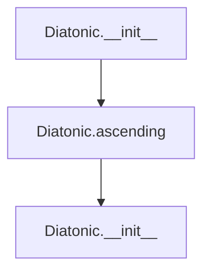

## Raises:
- `NoteFormatError`: Raised in __init__ when the tonic note is not in proper uppercase format.
- `RangeError`: Raised in degree() method inherited from _Scale when degree_number is less than 1.

## Example:
```python
# Create a diatonic scale with semitones at positions 2 and 5
scale = Diatonic('C', [2, 5], 1)

# Generate the ascending scale pattern
notes = scale.ascending()
# Returns: ['C', 'D', 'D#', 'F', 'F#', 'G', 'A', 'C']
# The scale has semitones at positions 2 (D to D#) and 5 (F to F#)
# Note: The last note ('C') matches the first note, completing the octave
```

### `mingus.core.scales.Diatonic.__init__` · *method*

## Summary:
Initializes a Diatonic scale object with a tonic note, semitone positions, and octave count.

## Description:
Configures the Diatonic scale instance by calling the parent _Scale class constructor and setting the semitone positions that define the scale's interval pattern. The name attribute is automatically generated to describe the scale's configuration.

## Args:
    note (str): The tonic note of the scale, must be an uppercase letter (e.g., 'C', 'D#').
    semitones (list[int]): List of scale degrees (1-7) that should contain semitones.
    octaves (int): Number of octaves the scale spans. Defaults to 1.

## Returns:
    None: This method initializes the object's state and does not return a value.

## Raises:
    NoteFormatError: When the note parameter is not in proper uppercase format.
    RangeError: When a degree number in semitones list is outside the valid range 1-7.

## State Changes:
    Attributes READ: self.tonic
    Attributes WRITTEN: self.semitones, self.name

## Constraints:
    Preconditions:
        - The note parameter must be a valid uppercase note name.
        - Each integer in the semitones list must be between 1 and 7 inclusive.
        - The octaves parameter must be a positive integer.
    Postconditions:
        - self.semitones is set to the provided semitones list.
        - self.name is set to a descriptive string combining the tonic and semitones.

## Side Effects:
    None: This method performs no I/O operations or external service calls.

### `mingus.core.scales.Diatonic.ascending` · *method*

## Summary:
Generates a diatonic scale in ascending order by applying minor and major second intervals based on specified semitone positions.

## Description:
Constructs a diatonic scale starting from the tonic note, applying either minor seconds or major seconds depending on whether each position falls within the defined semitone pattern. This method implements the core algorithm for building diatonic scales with configurable interval patterns.

The method is separated from other scale construction logic to provide a clean, reusable implementation for generating ascending diatonic sequences that can be extended across multiple octaves. It is an abstract method implementation that must be called on a properly initialized Diatonic object.

## Args:
    None

## Returns:
    list[str]: A list of note strings representing the ascending diatonic scale, repeated across the specified number of octaves and ending with the tonic note to complete the scale.

## Raises:
    None explicitly raised

## State Changes:
    - Attributes READ: self.tonic, self.semitones, self.octaves
    - Attributes WRITTEN: None

## Constraints:
    - Precondition: The Diatonic object must be properly initialized with a valid tonic note, semitone pattern, and octave count
    - Postcondition: The returned list contains exactly 7 notes per octave plus one additional tonic note for closure, repeated self.octaves times
    - The semitone pattern defines which positions (1-6) use minor seconds vs major seconds

## Side Effects:
    - None

## `mingus.core.scales.Ionian` · *class*

## Summary:
Represents the Ionian scale (major scale) in Western music theory, implementing the abstract _Scale base class.

## Description:
The Ionian class implements the major scale pattern, which is the most commonly used scale in Western music. It inherits from the abstract _Scale base class and provides a concrete implementation for generating ascending major scale sequences. This class specifically creates scales with semitones at the mediant (3rd degree) and leading tone (7th degree) positions, following the standard major scale interval pattern of whole, whole, half, whole, whole, whole, half.

The class is typically instantiated by musical applications, educational tools, or composition software that needs to generate complete major scale patterns. It serves as a specialized implementation of the broader scale abstraction, providing a clean interface for accessing major scale sequences.

## State:
- `type` (str): Class attribute set to "ancient" to categorize this scale type.
- `name` (str): Instance attribute formatted as "{tonic} ionian" that identifies the specific scale.
- `tonic` (str): Inherited from _Scale base class, represents the root note of the scale (must be uppercase).
- `octaves` (int): Inherited from _Scale base class, indicates how many octaves the scale spans (must be non-negative).

## Lifecycle:
- Creation: Instantiate with a tonic note (string) and optional number of octaves (int, default=1). The tonic must be a valid uppercase note name.
- Usage: Call the ascending() method to generate the complete major scale pattern across the specified octaves. The pattern repeats the standard 7-note major scale sequence and ends with the first note to complete the octave cycle.
- Destruction: Standard Python object cleanup; no special resources to manage.

## Method Map:
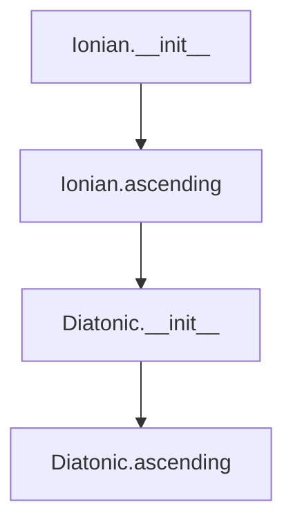

## Raises:
- `NoteFormatError`: Raised by the parent _Scale.__init__ when the tonic note is not in proper uppercase format.
- `RangeError`: Raised by the parent _Scale.__init__ when the octaves parameter is negative.

## Example:
```python
# Create an Ionian scale starting on C with 1 octave
ionian_scale = Ionian('C', 1)

# Generate the ascending major scale pattern
notes = ionian_scale.ascending()
# Returns: ['C', 'D', 'E', 'F', 'G', 'A', 'B', 'C']

# Create an Ionian scale starting on A with 2 octaves
ionian_scale = Ionian('A', 2)

# Generate the ascending major scale pattern
notes = ionian_scale.ascending()
# Returns: ['A', 'B', 'C#', 'D', 'E', 'F#', 'G#', 'A', 'B', 'C#', 'D', 'E', 'F#', 'G#', 'A']
```

### `mingus.core.scales.Ionian.__init__` · *method*

## Summary:
Initializes an Ionian scale instance by calling the parent scale constructor and setting the scale's descriptive name.

## Description:
This method serves as the constructor for the Ionian class, which implements the major scale pattern. It first calls the parent `_Scale.__init__` method to establish the basic scale properties including the tonic note and octave span, then sets the instance's name attribute to a formatted string indicating this is an Ionian scale.

The Ionian mode corresponds to the standard major scale pattern with semitones at the mediant (3rd degree) and leading tone (7th degree) positions. This method ensures proper initialization of the scale's identity while inheriting all standard scale functionality from the parent class.

## Args:
    note (str): The tonic note of the scale, represented as an uppercase letter (e.g., 'C', 'D#'). Must be a valid note name.
    octaves (int): The number of octaves the scale spans. Defaults to 1. Must be a non-negative integer.

## Returns:
    None: This method initializes the object in-place and does not return a value.

## Raises:
    NoteFormatError: Raised by the parent class when the note parameter is not in proper uppercase format.
    RangeError: Raised by the parent class when the octaves parameter is invalid (negative).

## State Changes:
    Attributes READ: 
        - self.tonic (accessed during parent initialization)
    Attributes WRITTEN:
        - self.name (set to "{tonic} ionian")
        - self.tonic (set by parent class)
        - self.octaves (set by parent class)

## Constraints:
    Preconditions:
        - The note parameter must be a valid uppercase note name string
        - The octaves parameter must be a non-negative integer
    Postconditions:
        - The Ionian scale instance is properly initialized with the specified tonic and octave span
        - The instance's name attribute reflects that this is an Ionian scale

## Side Effects:
    None: This method does not perform any I/O operations or mutate external objects.

### `mingus.core.scales.Ionian.ascending` · *method*

## Summary:
Generates the ascending notes of an Ionian scale (major scale) by creating a diatonic pattern with semitones at positions 3 and 7, repeated across specified octaves.

## Description:
This method implements the ascending() functionality for the Ionian scale class, which represents the major scale in Western music theory. It creates a diatonic scale pattern with semitones positioned at degrees 3 and 7 (the mediant and leading tone), then repeats this pattern across the specified number of octaves. The resulting sequence begins with the tonic note, progresses through the major scale pattern, and concludes with the first note of the pattern to complete the octave cycle.

The method leverages the Diatonic class with semitone positions (3, 7) to generate the standard major scale pattern, then extends it across multiple octaves as specified by the instance's octaves attribute.

Known callers:
- This method is called by user-facing APIs or musical applications that require complete ascending scale sequences for the Ionian mode.
- It would be invoked during musical composition, education, or analysis workflows where full major scale patterns are needed.

The logic is separated into its own method to provide a clean interface for retrieving the complete ascending scale pattern while maintaining the flexibility of the underlying Diatonic implementation.

## Args:
    None

## Returns:
    list[str]: A list of note names representing the ascending Ionian scale. The list contains the notes of the major scale pattern repeated across the specified octaves, with the first note of the pattern appended at the end to complete the octave cycle.

## Raises:
    None explicitly raised, though underlying Diatonic operations may raise NoteFormatError or RangeError if invalid parameters are passed.

## State Changes:
    Attributes READ: 
    - self.tonic (str): Used to initialize the Diatonic instance
    - self.octaves (int): Used to determine how many times to repeat the scale pattern
    
    Attributes WRITTEN: 
    - None

## Constraints:
    Preconditions:
    - self.tonic must be a valid uppercase note name string
    - self.octaves must be a non-negative integer
    
    Postconditions:
    - The returned list will contain exactly (7 * self.octaves + 1) notes
    - The first and last notes in the returned list will be identical
    - All notes will be valid musical note names
    - The pattern follows the standard major scale intervals: whole, whole, half, whole, whole, whole, half

## Side Effects:
    None

## `mingus.core.scales.Dorian` · *class*

## Summary:
Represents a Dorian scale, an ancient musical scale pattern characterized by semitones at the second and sixth scale degrees.

## Description:
The Dorian class implements the Dorian scale, a medieval musical scale that follows the pattern of whole and half steps characteristic of the Dorian mode. This class extends the abstract _Scale base class and provides a concrete implementation for generating Dorian scales. It leverages the Diatonic class with specific semitone positions to construct the scale pattern.

## State:
- `type` (str): Class attribute set to "ancient" to identify this scale type.
- `name` (str): A descriptive string identifying the scale, formatted as "{tonic} dorian".
- `tonic` (str): Inherited from _Scale, represents the root note of the scale.
- `octaves` (int): Inherited from _Scale, indicates how many octaves the scale spans.

## Lifecycle:
- Creation: Instantiate with a tonic note (string) and optionally the number of octaves (int). The tonic must be a valid uppercase note name.
- Usage: Call the ascending() method to generate the complete Dorian scale pattern across the specified octaves.
- Destruction: Standard Python object cleanup; no special resources to manage.

## Method Map:
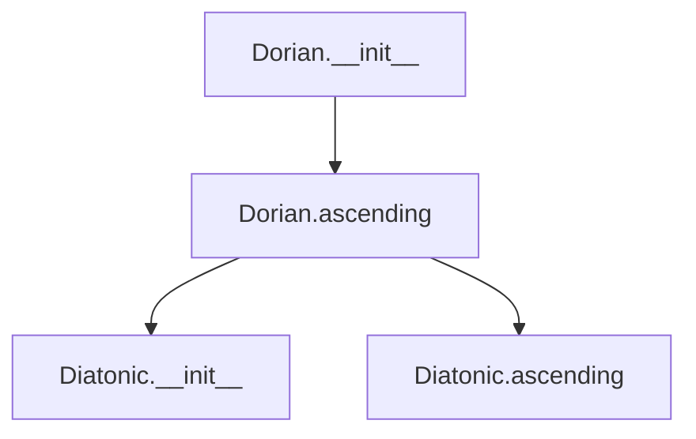

## Raises:
- `NoteFormatError`: Raised in __init__ when the tonic note is not in proper uppercase format.
- `RangeError`: Raised in degree() method inherited from _Scale when degree_number is less than 1.

## Example:
```python
# Create a Dorian scale starting on C
dorian_scale = Dorian('C', 1)

# Generate the ascending Dorian scale pattern
notes = dorian_scale.ascending()
# Returns: ['C', 'D', 'D#', 'F', 'F#', 'G', 'A', 'C']
# The scale has semitones at positions 2 (D to D#) and 6 (F to F#)
# Note: The last note ('C') matches the first note, completing the octave
```

### `mingus.core.scales.Dorian.__init__` · *method*

## Summary:
Initializes a Dorian scale instance by calling the parent scale constructor and setting the scale's name attribute.

## Description:
This method serves as the constructor for the Dorian class, which implements the Dorian mode scale pattern. It first calls the parent `_Scale.__init__` method to establish the basic scale properties including the tonic note and octave span, then sets the instance's name attribute to a formatted string indicating this is a Dorian scale.

The Dorian mode is characterized by its specific interval pattern with semitones at the 2nd and 6th degrees, creating a distinctive minor tonality often used in jazz and traditional music. This method ensures proper initialization of the scale's identity while inheriting all standard scale functionality from the parent class.

## Args:
    note (str): The tonic note of the scale, represented as an uppercase letter (e.g., 'C', 'D#'). Must be a valid note name.
    octaves (int): The number of octaves the scale spans. Defaults to 1. Must be a positive integer.

## Returns:
    None: This method initializes the object in-place and does not return a value.

## Raises:
    NoteFormatError: Raised by the parent class when the note parameter is not in proper uppercase format.
    RangeError: Raised by the parent class when the octaves parameter is invalid (negative or zero).

## State Changes:
    Attributes READ: 
        - self.tonic (accessed during parent initialization)
    Attributes WRITTEN:
        - self.name (set to "{tonic} dorian")
        - self.tonic (set by parent class)
        - self.octaves (set by parent class)

## Constraints:
    Preconditions:
        - The note parameter must be a valid uppercase note name string
        - The octaves parameter must be a positive integer
    Postconditions:
        - The Dorian scale instance is properly initialized with the specified tonic and octave span
        - The instance's name attribute reflects that this is a Dorian scale

## Side Effects:
    None: This method does not perform any I/O operations or mutate external objects.

### `mingus.core.scales.Dorian.ascending` · *method*

## Summary:
Generates the ascending form of a Dorian scale by combining a diatonic pattern with octave repetition.

## Description:
This method constructs the ascending form of a Dorian scale by leveraging the Diatonic class with specific semitone positions (2 and 6) to create the characteristic Dorian interval pattern. The resulting scale repeats across the specified octaves and concludes with the first note of the scale to complete the octave cycle. This approach ensures the Dorian scale maintains its distinctive sound with semitones at the second and sixth scale degrees.

## Args:
    None

## Returns:
    list[str]: A list of note names representing the ascending Dorian scale. The list contains the scale pattern repeated across the specified octaves, ending with the first note of the pattern to close the octave.

## Raises:
    NoteFormatError: Raised when the tonic note is not in proper uppercase format.
    RangeError: Raised when the degree number is less than 1 during internal operations.

## State Changes:
    Attributes READ: self.tonic, self.octaves
    Attributes WRITTEN: None

## Constraints:
    Preconditions: 
    - self.tonic must be a valid uppercase note name (e.g., 'C', 'D#')
    - self.octaves must be a positive integer
    Postconditions:
    - The returned list contains the correct Dorian scale pattern
    - The scale spans the specified number of octaves
    - The last note matches the first note to complete the octave

## Side Effects:
    None

## `mingus.core.scales.Phrygian` · *class*

## Summary:
Represents a Phrygian scale, an ancient musical mode characterized by semitones at the first and fifth scale degrees.

## Description:
The Phrygian class implements the Phrygian scale, one of the ancient modes in Western music theory. This class extends the abstract _Scale base class and provides a concrete implementation for generating Phrygian scale patterns. It creates scales with the characteristic intervals of the Phrygian mode, where semitones occur at the first and fifth scale degrees.

The class is typically instantiated when a user needs to work with Phrygian scales, such as for musical composition, analysis, or educational purposes. It leverages the Diatonic class internally to construct the scale pattern, making it a specialized implementation of the broader diatonic scale framework.

## State:
- `type` (str): Class attribute set to "ancient" to identify this scale type as belonging to ancient musical modes.
- `name` (str): Instance attribute formatted as "{tonic} phrygian" that identifies the specific scale.
- `tonic` (str): Inherited from _Scale, represents the root note of the scale (must be uppercase).
- `octaves` (int): Inherited from _Scale, indicates how many octaves the scale spans (must be non-negative).

## Lifecycle:
- Creation: Instantiate with a tonic note (string) and optional number of octaves (int). The tonic must be a valid uppercase note name.
- Usage: Call the ascending() method to generate the complete ascending scale pattern. The scale will repeat across the specified octaves, ending with the first note of the scale.
- Destruction: Standard Python object cleanup; no special resources to manage.

## Method Map:
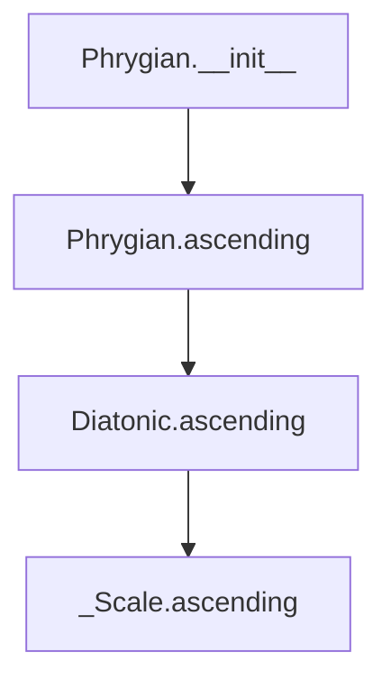

## Raises:
- `NoteFormatError`: Raised in __init__ when the tonic note is not in proper uppercase format.
- `RangeError`: Raised in degree() method inherited from _Scale when degree_number is less than 1.

## Example:
```python
# Create a Phrygian scale with tonic C and 1 octave
phrygian_scale = Phrygian('C', 1)

# Generate the ascending scale pattern
notes = phrygian_scale.ascending()
# Returns: ['C', 'C#', 'D', 'E', 'F#', 'G', 'A', 'C']
# The scale has semitones at positions 1 (C to C#) and 5 (F# to G)
# Note: The last note ('C') matches the first note, completing the octave
```

### `mingus.core.scales.Phrygian.__init__` · *method*

## Summary:
Initializes a Phrygian scale object with a specified tonic note and octave span, setting the scale's name attribute.

## Description:
The `__init__` method constructs a Phrygian scale instance by calling the parent `_Scale` class constructor to establish the basic scale properties, then sets the instance's `name` attribute to a formatted string identifying the scale type and tonic.

This method serves as the entry point for creating Phrygian scale objects and ensures proper initialization of both inherited and Phrygian-specific attributes. It leverages the parent class's validation mechanisms for note formatting and octave handling.

## Args:
    note (str): The tonic note of the scale, must be an uppercase letter representing a valid note name (e.g., 'C', 'D#').
    octaves (int): Number of octaves the scale spans, defaults to 1. Must be a non-negative integer.

## Returns:
    None: This method initializes the object's state and does not return a value.

## Raises:
    NoteFormatError: Raised when the `note` parameter is not in proper uppercase format.
    RangeError: Raised when the `octaves` parameter is negative.

## State Changes:
    Attributes READ: self.tonic
    Attributes WRITTEN: self.name

## Constraints:
    Preconditions: 
    - The `note` argument must be a valid uppercase note name (e.g., 'C', 'D#', 'Gb')
    - The `octaves` argument must be a non-negative integer
    Postconditions:
    - The `self.tonic` attribute is properly initialized from the `note` parameter
    - The `self.name` attribute is set to "{tonic} phrygian"

## Side Effects:
    None: This method performs no I/O operations or external service calls. It only manipulates internal object state.

### `mingus.core.scales.Phrygian.ascending` · *method*

## Summary:
Generates the ascending form of a Phrygian scale by creating a diatonic pattern with semitones at positions 1 and 5, then repeating it across specified octaves.

## Description:
This method implements the ascending() interface for the Phrygian scale class. It creates a Phrygian scale by generating a diatonic scale with semitones at positions 1 and 5, taking all but the last note of this pattern, repeating it across the specified octaves, and appending the first note to complete the scale cycle. This follows the traditional Phrygian scale construction where the first and fifth degrees contain semitones.

The method is called during the lifecycle of a Phrygian scale object when retrieving the ascending note sequence, typically for display, analysis, or musical processing purposes. It forms part of the standard scale interface and is used by methods like __str__ and __eq__ in the parent _Scale class.

This logic is separated into its own method to provide a clean interface for retrieving the complete ascending scale pattern while maintaining the flexibility of the underlying Diatonic implementation.

## Args:
    None

## Returns:
    list[str]: A list of note names representing the ascending Phrygian scale. The list contains exactly (7 * self.octaves + 1) notes, with the first and last notes being identical (the tonic note) to complete the octave cycle.

## Raises:
    NoteFormatError: Raised when the tonic note is not in proper uppercase format.
    RangeError: Raised when the degree number is less than 1 during internal operations in the Diatonic class.

## State Changes:
    - Attributes READ: self.tonic, self.octaves
    - Attributes WRITTEN: None

## Constraints:
    Preconditions:
    - self.tonic must be a valid uppercase note name (e.g., 'C', 'D#')
    - self.octaves must be a non-negative integer
    
    Postconditions:
    - The returned list will contain exactly (7 * self.octaves + 1) notes
    - The first and last notes in the returned list will be identical (the tonic note)
    - All intermediate notes will follow the Phrygian interval pattern (H-W-W-W-H-W-W)
    - The semitone positions (1 and 5) define the characteristic intervals of the Phrygian mode

## Side Effects:
    None

## `mingus.core.scales.Lydian` · *class*

## Summary:
Represents a Lydian scale, an ancient musical scale characterized by a raised fourth degree.

## Description:
The Lydian scale is a musical scale with a distinctive sound created by raising the fourth degree of the diatonic scale. This class implements the Lydian scale pattern by leveraging the Diatonic scale class with specific semitone positions (4 and 7) to generate the characteristic whole-step intervals followed by a sharp fourth. It inherits from the abstract _Scale base class and provides a concrete implementation of the ascending() method.

## State:
- `type` (str): Class attribute set to "ancient" to identify this scale type.
- `name` (str): Instance attribute formatted as "{tonic} lydian" that identifies the scale.
- `tonic` (str): Inherited from _Scale, represents the root note of the scale.
- `octaves` (int): Inherited from _Scale, indicates how many octaves the scale spans.

## Lifecycle:
- Creation: Instantiate with a tonic note (string) and optionally the number of octaves (int). The tonic must be a valid uppercase note name.
- Usage: Call the ascending() method to generate the complete scale pattern. The scale will repeat across the specified octaves, ending with the first note of the scale.
- Destruction: Standard Python object cleanup; no special resources to manage.

## Method Map:
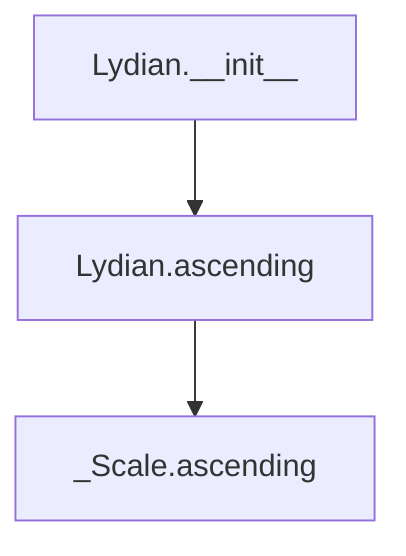

## Raises:
- `NoteFormatError`: Raised in __init__ when the tonic note is not in proper uppercase format.
- `RangeError`: Raised in degree() method inherited from _Scale when degree_number is less than 1.

## Example:
```python
# Create a Lydian scale with tonic C and 1 octave
scale = Lydian('C', 1)

# Generate the ascending scale pattern
notes = scale.ascending()
# Returns: ['C', 'D', 'E', 'F#', 'G', 'A', 'B', 'C']
# The scale has the characteristic Lydian pattern with F# (raised fourth)
```

### `mingus.core.scales.Lydian.__init__` · *method*

## Summary:
Initializes a Lydian scale instance by calling the parent scale constructor and setting the scale's descriptive name attribute.

## Description:
This method serves as the constructor for the Lydian class, which implements the Lydian scale pattern. It first calls the parent `_Scale.__init__` method to establish the basic scale properties including the tonic note and octave span, then sets the instance's name attribute to a formatted string indicating this is a Lydian scale.

The Lydian scale is characterized by raising the fourth degree of the diatonic scale by one semitone, creating a distinctive sound with a bright, major tonality. This method ensures proper initialization of the scale's identity while inheriting all standard scale functionality from the parent class.

## Args:
    note (str): The tonic note of the scale, represented as an uppercase letter (e.g., 'C', 'D#'). Must be a valid note name.
    octaves (int): The number of octaves the scale spans. Defaults to 1. Must be a positive integer.

## Returns:
    None: This method initializes the object in-place and does not return a value.

## Raises:
    NoteFormatError: Raised by the parent class when the note parameter is not in proper uppercase format.
    RangeError: Raised by the parent class when the octaves parameter is invalid (negative or zero).

## State Changes:
    Attributes READ: 
        - self.tonic (accessed during parent initialization)
    Attributes WRITTEN:
        - self.name (set to "{tonic} lydian")
        - self.tonic (set by parent class)
        - self.octaves (set by parent class)

## Constraints:
    Preconditions:
        - The note parameter must be a valid uppercase note name string
        - The octaves parameter must be a positive integer
    Postconditions:
        - The Lydian scale instance is properly initialized with the specified tonic and octave span
        - The instance's name attribute reflects that this is a Lydian scale

## Side Effects:
    None: This method does not perform any I/O operations or mutate external objects.

### `mingus.core.scales.Lydian.ascending` · *method*

## Summary:
Generates the ascending pattern for a Lydian scale by combining a diatonic pattern with the specified number of octaves.

## Description:
This method implements the ascending() behavior for the Lydian scale class. It leverages the Diatonic class to create a base pattern with semitones at positions 4 and 7, then extends this pattern across multiple octaves as specified by the instance's octaves property. The resulting scale follows the Lydian interval pattern (whole, whole, sharp, whole, whole, whole, whole) and properly closes the scale by returning to the tonic note in the highest octave.

## Args:
    None

## Returns:
    list[str]: A list of note names representing the ascending Lydian scale pattern. The list contains the notes repeated across the specified octaves, ending with the first note of the scale.

## Raises:
    None explicitly raised

## State Changes:
    Attributes READ: self.tonic, self.octaves
    Attributes WRITTEN: None

## Constraints:
    Preconditions: 
    - self.tonic must be a valid uppercase note name (e.g., 'C', 'D#')
    - self.octaves must be a positive integer
    Postconditions:
    - The returned list will contain exactly (7 * self.octaves + 1) notes
    - The first and last notes in the returned list will be identical (the tonic note)
    - All intermediate notes will follow the Lydian interval pattern

## Side Effects:
    None

## `mingus.core.scales.Mixolydian` · *class*

## Summary:
Represents a Mixolydian scale, a specific musical scale pattern characterized by semitones at the third and sixth degrees.

## Description:
The Mixolydian class implements the Mixolydian mode, a medieval musical scale pattern that is commonly used in folk and popular music. It extends the abstract _Scale base class and provides a concrete implementation of the ascending() method. This class generates the Mixolydian scale pattern where the third and sixth scale degrees contain semitones, creating the distinctive sound of this mode.

The Mixolydian scale is particularly notable for its use in blues, rock, and folk music, where it often serves as the foundation for improvisation and chord progressions. The class is typically instantiated by musical applications that need to work with this specific scale pattern.

This implementation leverages the Diatonic class to construct the scale pattern with semitones at positions 3 and 6, ensuring consistency with the broader musical scale framework.

## State:
- `type` (str): Class attribute set to "ancient" to identify this scale type.
- `name` (str): Instance attribute formatted as "{tonic} mixolydian" that identifies the scale.
- `tonic` (str): Inherited from _Scale, represents the root note of the scale (must be uppercase).
- `octaves` (int): Inherited from _Scale, indicates how many octaves the scale spans (must be non-negative).

## Lifecycle:
- Creation: Instantiate with a tonic note (string) and optional number of octaves (int). The tonic must be a valid uppercase note name.
- Usage: Call the ascending() method to generate the complete scale pattern. The scale will repeat across the specified octaves, ending with the first note of the scale.
- Destruction: Standard Python object cleanup; no special resources to manage.

## Method Map:
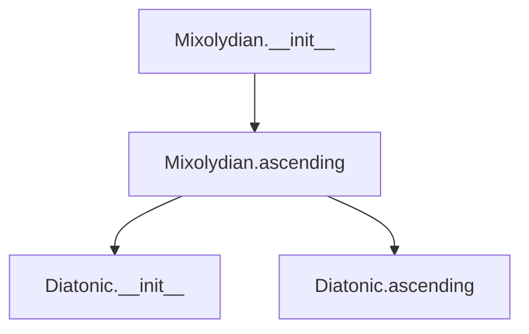

## Raises:
- `NoteFormatError`: Raised in __init__ when the tonic note is not in proper uppercase format.
- `RangeError`: Raised in degree() method inherited from _Scale when degree_number is less than 1.

## Example:
```python
# Create a Mixolydian scale starting on C with 1 octave
mixolydian_scale = Mixolydian('C', 1)

# Generate the ascending scale pattern
notes = mixolydian_scale.ascending()
# Returns: ['C', 'D', 'E', 'F', 'G', 'A', 'Bb', 'C']
# The scale has semitones at positions 3 (E to F) and 6 (A to Bb)
# Note: The last note ('C') matches the first note, completing the octave
```

### `mingus.core.scales.Mixolydian.__init__` · *method*

## Summary:
Initializes a Mixolydian scale object with a specified tonic note and octave range, setting its name attribute to reflect the scale type.

## Description:
This method constructs a Mixolydian scale instance by calling the parent class constructor and then formatting the scale's name attribute. The Mixolydian scale is a musical mode characterized by semitones at the third and sixth degrees of the diatonic scale.

The initialization process ensures that the scale inherits proper note handling and octave management from its parent class while establishing a descriptive name for the specific scale instance.

## Args:
    note (str): The tonic note of the scale, must be a valid uppercase note name (e.g., 'C', 'D', 'Bb').
    octaves (int): Number of octaves the scale spans, defaults to 1. Must be non-negative.

## Returns:
    None: This method initializes the object's state and does not return a value.

## Raises:
    NoteFormatError: When the note parameter is not in proper uppercase format.
    RangeError: When the octaves parameter is negative.

## State Changes:
    Attributes READ: self.tonic
    Attributes WRITTEN: self.name

## Constraints:
    Preconditions: The note parameter must be a valid uppercase note name string.
    Postconditions: The object's name attribute is set to "{tonic} mixolydian" format.

## Side Effects:
    None: This method performs no I/O operations or external service calls.

### `mingus.core.scales.Mixolydian.ascending` · *method*

## Summary:
Generates the ascending form of a Mixolydian scale by creating a diatonic pattern with semitones at positions 3 and 6, repeated across specified octaves.

## Description:
This method implements the ascending() interface for the Mixolydian scale class. It creates a Mixolydian scale by generating a diatonic scale with semitones at positions 3 and 6, taking all but the last note of this pattern, repeating it across the specified octaves, and appending the first note to complete the scale cycle. This follows the traditional Mixolydian scale construction where the third and sixth degrees contain semitones.

The method is called during the lifecycle of a Mixolydian scale object when retrieving the ascending note sequence, typically for display, analysis, or musical processing purposes. It forms part of the standard scale interface and is used by methods like __str__ and __eq__ in the parent _Scale class.

## Args:
    None

## Returns:
    list[str]: A list of note names representing the ascending Mixolydian scale. The list contains exactly (7 * self.octaves + 1) notes, with the first and last notes being identical (the tonic note) to complete the octave cycle.

## Raises:
    None explicitly raised

## State Changes:
    - Attributes READ: self.tonic, self.octaves
    - Attributes WRITTEN: None

## Constraints:
    Preconditions:
    - self.tonic must be a valid uppercase note name (e.g., 'C', 'D#')
    - self.octaves must be a non-negative integer
    
    Postconditions:
    - The returned list will contain exactly (7 * self.octaves + 1) notes
    - The first and last notes in the returned list will be identical (the tonic note)
    - All intermediate notes will follow the Mixolydian interval pattern (W-W-H-W-W-H-W)
    - The semitone positions (3 and 6) define the characteristic intervals of the Mixolydian mode

## Side Effects:
    None

## `mingus.core.scales.Aeolian` · *class*

## Summary:
Represents the Aeolian mode scale, a minor scale characterized by its specific interval pattern with semitones at the 2nd and 5th degrees.

## Description:
The Aeolian class is a concrete implementation of the abstract _Scale base class that implements the Aeolian mode (natural minor scale). This scale follows the interval pattern of a natural minor scale, where semitones occur between the 2nd and 5th scale degrees, creating a distinctive minor tonality. The class inherits standard scale functionality for managing tonic notes and octave spans while providing a specific implementation for the Aeolian mode's ascending sequence.

This class is typically instantiated when working with minor scales in musical applications, particularly when needing the specific interval pattern of the Aeolian mode. It serves as a specialized scale type that can be used alongside other concrete scale implementations.

## State:
- `type` (str): Class attribute set to "ancient" to categorize this scale type.
- `name` (str): Instance attribute formatted as "{tonic} aeolian", identifying the specific scale.
- `tonic` (str): Inherited from _Scale base class, represents the root note of the scale (e.g., 'C', 'D#').
- `octaves` (int): Inherited from _Scale base class, indicates how many octaves the scale spans.

## Lifecycle:
- Creation: Instantiate with a tonic note (string) and optional number of octaves (int). The tonic must be a valid uppercase note name.
- Usage: Call the `ascending()` method to generate the complete ascending scale pattern. The scale will repeat across the specified octaves, ending with the first note of the scale to complete the cycle.
- Destruction: Standard Python object cleanup; no special resources to manage.

## Method Map:
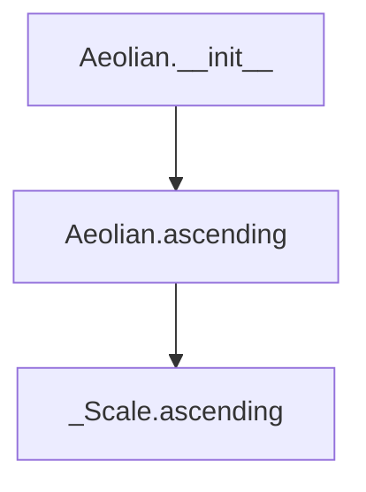

## Raises:
- `NoteFormatError`: Raised during initialization if the tonic note is not in proper uppercase format.
- `RangeError`: Raised during initialization if the octave count is invalid.

## Example:
```python
# Create an Aeolian scale with tonic C and 1 octave
aeolian_scale = Aeolian('C', 1)

# Generate the ascending scale pattern
notes = aeolian_scale.ascending()
# Returns: ['C', 'D', 'Eb', 'F', 'G', 'Ab', 'Bb', 'C']
# The scale has semitones at positions 2 (D to Eb) and 5 (F to G)
# Note: The last note ('C') matches the first note, completing the octave
```

### `mingus.core.scales.Aeolian.__init__` · *method*

## Summary:
Initializes an Aeolian scale instance by calling the parent scale constructor and setting the scale's name attribute.

## Description:
This method serves as the constructor for the Aeolian class, which implements the Aeolian mode (natural minor scale). It first calls the parent `_Scale.__init__` method to establish the basic scale properties including the tonic note and octave span, then sets the instance's name attribute to a formatted string indicating this is an Aeolian scale.

The Aeolian mode is characterized by its specific interval pattern with semitones at the 2nd and 5th degrees, creating a distinctive minor tonality. This method ensures proper initialization of the scale's identity while inheriting all standard scale functionality from the parent class.

## Args:
    note (str): The tonic note of the scale, represented as an uppercase letter (e.g., 'C', 'D#'). Must be a valid note name.
    octaves (int): The number of octaves the scale spans. Defaults to 1. Must be a positive integer.

## Returns:
    None: This method initializes the object in-place and does not return a value.

## Raises:
    NoteFormatError: Raised by the parent class when the note parameter is not in proper uppercase format.
    RangeError: Raised by the parent class when the octaves parameter is invalid (negative or zero).

## State Changes:
    Attributes READ: 
        - self.tonic (accessed during parent initialization)
    Attributes WRITTEN:
        - self.name (set to "{tonic} aeolian")
        - self.tonic (set by parent class)
        - self.octaves (set by parent class)

## Constraints:
    Preconditions:
        - The note parameter must be a valid uppercase note name string
        - The octaves parameter must be a positive integer
    Postconditions:
        - The Aeolian scale instance is properly initialized with the specified tonic and octave span
        - The instance's name attribute reflects that this is an Aeolian scale

## Side Effects:
    None: This method does not perform any I/O operations or mutate external objects.

### `mingus.core.scales.Aeolian.ascending` · *method*

## Summary:
Generates the ascending sequence of notes for an Aeolian scale by combining a diatonic pattern with the specified number of octaves.

## Description:
Implements the ascending method for the Aeolian scale class, which creates a sequence of notes following the Aeolian mode pattern. This method leverages the Diatonic class to generate the basic scale pattern with semitones at positions 2 and 5, then extends it across multiple octaves as specified by the instance's octave count.

The method is separated from other scale construction logic to provide a clean, reusable implementation specifically for Aeolian mode scales. It ensures that the returned sequence properly closes the scale by including the initial note at the end, making it suitable for musical applications requiring complete scale cycles.

This method is called during the lifecycle of an Aeolian scale object when retrieving the ascending note sequence, typically for display, analysis, or musical processing purposes. It forms part of the standard scale interface and is used by methods like __str__ and __eq__ in the parent _Scale class.

## Args:
    None

## Returns:
    list[str]: A list of note strings representing the ascending Aeolian scale, repeated across the specified number of octaves and ending with the tonic note to complete the scale cycle.

## Raises:
    None explicitly raised

## State Changes:
    - Attributes READ: self.tonic, self.octaves
    - Attributes WRITTEN: None

## Constraints:
    - Precondition: The Aeolian object must be properly initialized with a valid tonic note and octave count
    - Postcondition: The returned list contains exactly 7 notes per octave plus one additional tonic note for closure, repeated self.octaves times
    - The semitone pattern (positions 2 and 5) defines the characteristic minor third and diminished fifth intervals of the Aeolian mode

## Side Effects:
    - None

## `mingus.core.scales.Locrian` · *class*

## Summary:
Represents the Locrian scale, an ancient musical scale characterized by semitones at the first and fourth degrees.

## Description:
The Locrian scale is one of the most unusual and rarely used scales in Western music theory due to its diminished quality. This class implements the Locrian scale pattern by leveraging a diatonic scale with semitones positioned at degrees 1 and 4. It extends the abstract _Scale base class and provides a concrete implementation of the ascending() method. The scale is typically used in advanced harmonic contexts and jazz improvisation.

## State:
- `type` (str): Class attribute set to "ancient" to identify this scale type.
- `name` (str): Instance attribute formatted as "{tonic} locrian" that identifies the scale.
- `tonic` (str): Inherited from _Scale, represents the root note of the scale (must be uppercase).
- `octaves` (int): Inherited from _Scale, indicates how many octaves the scale spans (must be positive).

## Lifecycle:
- Creation: Instantiate with a tonic note (string) and optional number of octaves (int). The tonic must be a valid uppercase note name.
- Usage: Call the ascending() method to generate the complete scale pattern. The scale will repeat across the specified octaves, ending with the first note of the scale.
- Destruction: Standard Python object cleanup; no special resources to manage.

## Method Map:
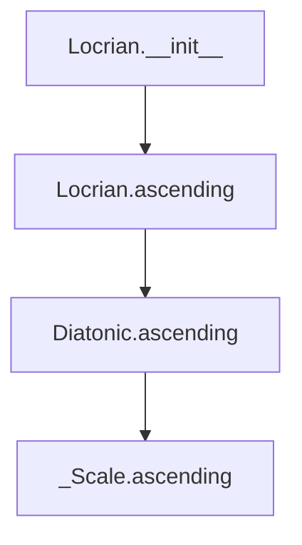

## Raises:
- `NoteFormatError`: Raised in __init__ when the tonic note is not in proper uppercase format.
- `RangeError`: Raised in degree() method inherited from _Scale when degree_number is less than 1.

## Example:
```python
# Create a Locrian scale starting on C
locrian_scale = Locrian('C', 1)

# Generate the ascending scale pattern
notes = locrian_scale.ascending()
# Returns: ['C', 'C#', 'D#', 'F', 'F#', 'G', 'A', 'C']
# The scale has semitones at positions 1 (C to C#) and 4 (F to F#)
# Note: The last note ('C') matches the first note, completing the octave

# Create a multi-octave Locrian scale
multi_octave_scale = Locrian('D', 2)
notes = multi_octave_scale.ascending()
# Returns: ['D', 'D#', 'E#', 'G', 'G#', 'A', 'B', 'D', 'D#', 'E#', 'G', 'G#', 'A', 'B', 'D']
```

### `mingus.core.scales.Locrian.__init__` · *method*

## Summary:
Initializes a Locrian scale instance by calling the parent scale constructor and setting the scale's name attribute.

## Description:
This method serves as the constructor for the Locrian class, which implements the Locrian scale pattern. It first calls the parent `_Scale.__init__` method to establish the basic scale properties including the tonic note and octave span, then sets the instance's name attribute to a formatted string indicating this is a Locrian scale.

The Locrian scale is characterized by its specific interval pattern with semitones at the 1st and 4th degrees, making it one of the rarest scales in Western music theory. This method ensures proper initialization of the scale's identity while inheriting all standard scale functionality from the parent class.

## Args:
    note (str): The tonic note of the scale, represented as an uppercase letter (e.g., 'C', 'D#'). Must be a valid note name.
    octaves (int): The number of octaves the scale spans. Defaults to 1. Must be a positive integer.

## Returns:
    None: This method initializes the object in-place and does not return a value.

## Raises:
    NoteFormatError: Raised by the parent class when the note parameter is not in proper uppercase format.
    RangeError: Raised by the parent class when the octaves parameter is invalid (negative or zero).

## State Changes:
    Attributes READ: 
        - self.tonic (accessed during parent initialization)
    Attributes WRITTEN:
        - self.name (set to "{tonic} locrian")
        - self.tonic (set by parent class)
        - self.octaves (set by parent class)

## Constraints:
    Preconditions:
        - The note parameter must be a valid uppercase note name string
        - The octaves parameter must be a positive integer
    Postconditions:
        - The Locrian scale instance is properly initialized with the specified tonic and octave span
        - The instance's name attribute reflects that this is a Locrian scale

## Side Effects:
    None: This method does not perform any I/O operations or mutate external objects.

### `mingus.core.scales.Locrian.ascending` · *method*

## Summary:
Generates the ascending form of a Locrian scale by constructing a diatonic pattern with semitones at positions 1 and 4, then repeating it across octaves.

## Description:
This method implements the ascending() interface for the Locrian scale class. It creates a Locrian scale by generating a diatonic scale with semitones at positions 1 and 4, taking all but the last note of this pattern, repeating it across the specified octaves, and appending the first note to complete the scale cycle. This follows the traditional Locrian scale construction where the first and fourth degrees contain semitones.

## Args:
    None

## Returns:
    list[str]: A list of note names representing the ascending Locrian scale. The list contains exactly (7 * self.octaves) notes plus one additional note to close the octave cycle, with notes in uppercase format.

## Raises:
    None

## State Changes:
    Attributes READ: self.tonic, self.octaves
    Attributes WRITTEN: None

## Constraints:
    Preconditions: 
    - self.tonic must be a valid uppercase note name (e.g., 'C', 'D#')
    - self.octaves must be a positive integer
    Postconditions:
    - The returned list will contain exactly (7 * self.octaves + 1) notes
    - All notes will be valid note names in uppercase format
    - The last note will match the first note to complete the octave cycle

## Side Effects:
    None

## `mingus.core.scales.Major` · *class*

## Summary:
Represents a major scale in musical theory, implementing the diatonic scale pattern with specific interval relationships.

## Description:
The Major class implements a concrete musical scale that follows the major scale pattern, which consists of seven notes with specific interval relationships (whole, whole, half, whole, whole, whole, half). This class inherits from the abstract _Scale base class and provides the specific implementation for generating major scale patterns.

This class is typically instantiated by users or other components that need to work with major scales, such as music theory applications, chord generators, or composition tools. The class serves as a distinct abstraction for major scales, enforcing the responsibility boundary of generating and managing major scale patterns while leveraging the shared infrastructure provided by the _Scale base class.

## State:
- `tonic` (str): The root note of the major scale, stored as an uppercase letter (e.g., 'C', 'D#'). This is inherited from the parent _Scale class and must be a valid musical note.
- `octaves` (int): Number of octaves the scale spans, inherited from _Scale. Must be a positive integer.
- `name` (str): The descriptive name of the scale, formatted as "{tonic} major" (e.g., "C major"). This is set during initialization.
- `type` (str): Class attribute indicating the scale type, always set to "major".

## Lifecycle:
- Creation: Instantiate with a tonic note (string) and optional number of octaves (integer, default 1). The tonic must be a valid uppercase note name.
- Usage: Call the `ascending()` method to retrieve the notes in ascending order. The class maintains state for the tonic and octaves throughout its lifetime.
- Destruction: Standard Python object destruction; no special cleanup required.

## Method Map:
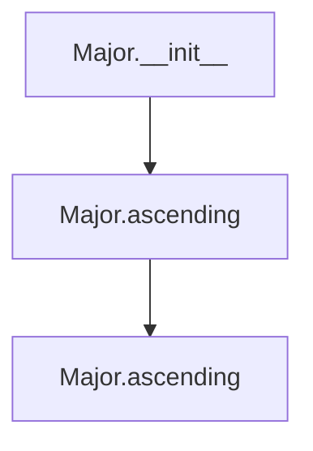

## Raises:
- `NoteFormatError`: Raised by the parent _Scale.__init__ when the tonic note is not in proper uppercase format.
- `RangeError`: Raised by the parent _Scale.__init__ when the octaves parameter is not a positive integer.

## Example:
```python
# Create a C major scale spanning one octave
scale = Major("C")

# Get the ascending notes of the scale
notes = scale.ascending()
# Returns: ['C', 'D', 'E', 'F', 'G', 'A', 'B', 'C']

# Create a G major scale spanning two octaves
scale2 = Major("G", 2)
notes2 = scale2.ascending()
# Returns: ['G', 'A', 'B', 'C#', 'D', 'E', 'F#', 'G', 'A', 'B', 'C#', 'D', 'E', 'F#', 'G']
```

### `mingus.core.scales.Major.__init__` · *method*

## Summary:
Initializes a Major scale object with a specified tonic note and octave span, setting the scale's descriptive name.

## Description:
The `__init__` method constructs a Major scale instance by calling the parent `_Scale` class constructor to establish the tonic note and octave count, then sets the instance's `name` attribute to a formatted string indicating the scale type.

This method serves as the primary constructor for Major scale objects, ensuring proper initialization of both inherited attributes from `_Scale` and the specific naming convention for major scales. It is typically called during object instantiation when creating a new Major scale.

## Args:
    note (str): The tonic note of the major scale, represented as an uppercase letter (e.g., 'C', 'D#').
    octaves (int): Number of octaves the scale spans. Defaults to 1.

## Returns:
    None: This method initializes the object's state and does not return a value.

## Raises:
    NoteFormatError: Raised by the parent `_Scale.__init__` when the tonic note is not in proper uppercase format.
    RangeError: Raised by the parent `_Scale.__init__` when the octaves parameter is not a positive integer.

## State Changes:
    Attributes READ: 
        - self.tonic (inherited from _Scale)
    Attributes WRITTEN:
        - self.name (set to "{0} major".format(self.tonic))

## Constraints:
    Preconditions:
        - The `note` argument must be a valid uppercase note name (e.g., 'C', 'D#', 'Gb').
        - The `octaves` argument must be a positive integer.
    Postconditions:
        - The `self.tonic` attribute is properly initialized from the `note` parameter.
        - The `self.octaves` attribute is properly initialized from the `octaves` parameter.
        - The `self.name` attribute is set to the formatted string "{0} major".

## Side Effects:
    None: This method performs no I/O operations or external service calls. It only manipulates internal object state.

### `mingus.core.scales.Major.ascending` · *method*

## Summary:
Generates the ascending form of a major scale by repeating the diatonic notes across specified octaves and appending the tonic note of the next octave.

## Description:
This method constructs the ascending form of a major scale by retrieving the diatonic notes for the scale's tonic, repeating them for the specified number of octaves, and then appending the tonic note of the next octave to complete the scale pattern. This follows the standard musical convention where a scale ascends through its notes and concludes with the tonic note of the subsequent octave.

The method is implemented as a separate function to encapsulate the specific logic for generating the ascending scale pattern, making it reusable and maintaining clean separation of concerns within the scale class hierarchy. It leverages the existing `get_notes` function to obtain the base diatonic notes for the scale's tonic.

## Args:
    None

## Returns:
    list[str]: A list of note names representing the ascending major scale. The list contains the diatonic notes repeated for the specified octaves plus the tonic note of the next octave. Each note is represented as a string with potential accidentals (e.g., 'C', 'C#', 'Bb').

## Raises:
    None

## State Changes:
    Attributes READ: 
        - self.tonic: Used to determine the base notes for the scale
        - self.octaves: Used to specify how many times to repeat the diatonic notes
    
    Attributes WRITTEN: 
        - None

## Constraints:
    Preconditions:
        - The `self.tonic` attribute must be a valid musical note string recognized by the system's note handling functions
        - The `self.octaves` attribute must be a positive integer specifying the number of octaves to include in the scale
        
    Postconditions:
        - The returned list contains exactly `7 * self.octaves + 1` elements
        - The first element matches `self.tonic`
        - The last element matches `self.tonic` (but in the next octave)

## Side Effects:
    - Calls the `get_notes()` function which may access global caching mechanisms
    - No direct I/O operations or external service calls

## `mingus.core.scales.HarmonicMajor` · *class*

## Summary:
Represents a harmonic major scale, which is a variation of the major scale with a flattened seventh degree.

## Description:
The HarmonicMajor class implements the harmonic major scale pattern, which differs from the standard major scale by flattening the seventh degree. This creates a distinctive sound characterized by a larger interval between the sixth and seventh degrees. The class inherits from the abstract _Scale base class and provides a concrete implementation for generating harmonic major scales.

This class is typically instantiated by users who need to work with harmonic major scales in music theory applications, composition tools, or chord generators. The class serves as a distinct abstraction for harmonic major scales, enforcing the responsibility boundary of generating and managing this specific scale pattern.

## State:
- `tonic` (str): The root note of the harmonic major scale, stored as an uppercase letter (e.g., 'C', 'D#'). Inherited from the parent _Scale class and must be a valid musical note.
- `octaves` (int): Number of octaves the scale spans, inherited from _Scale. Must be a positive integer.
- `name` (str): The descriptive name of the scale, formatted as "{tonic} harmonic major" (e.g., "C harmonic major"). Set during initialization.
- `type` (str): Class attribute indicating the scale type, always set to "major".

## Lifecycle:
- Creation: Instantiate with a tonic note (string) and optional number of octaves (integer, default 1). The tonic must be a valid uppercase note name.
- Usage: Call the `ascending()` method to retrieve the notes in ascending order. The class maintains state for the tonic and octaves throughout its lifetime.
- Destruction: Standard Python object destruction; no special cleanup required.

## Method Map:
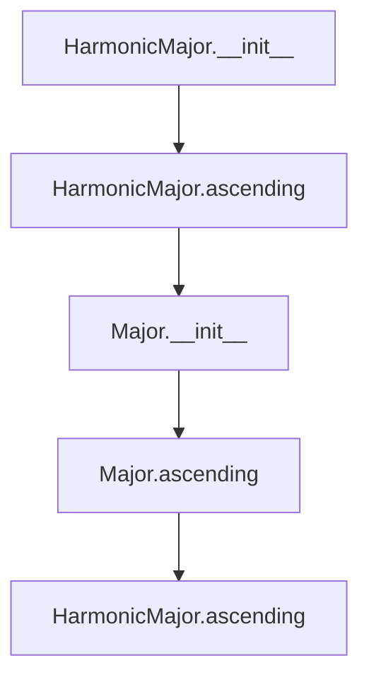

## Raises:
- `NoteFormatError`: Raised by the parent _Scale.__init__ when the tonic note is not in proper uppercase format.
- `RangeError`: Raised by the parent _Scale.__init__ when the octaves parameter is not a positive integer.

## Example:
```python
# Create a C harmonic major scale spanning one octave
scale = HarmonicMajor("C")

# Get the ascending notes of the scale
notes = scale.ascending()
# Returns: ['C', 'D', 'E', 'F', 'G', 'A', 'Bb', 'C']

# Create a G harmonic major scale spanning two octaves
scale2 = HarmonicMajor("G", 2)
notes2 = scale2.ascending()
# Returns: ['G', 'A', 'B', 'C#', 'D', 'E', 'F', 'G', 'A', 'B', 'C#', 'D', 'E', 'F', 'G']
```

### `mingus.core.scales.HarmonicMajor.__init__` · *method*

## Summary:
Initializes a HarmonicMajor scale object with a specified tonic note and octave span, setting its descriptive name.

## Description:
The `__init__` method constructs a HarmonicMajor scale instance by calling the parent `_Scale` class constructor to establish the tonic note and octave parameters, then sets the instance's `name` attribute to a descriptive string format "{tonic} harmonic major". This method ensures proper initialization of the scale's state while maintaining inheritance from the abstract base scale class.

This logic is encapsulated in its own method to separate the initialization concerns from the core scale generation logic, allowing for clean inheritance and consistent object setup across all scale types. The method serves as the entry point for creating HarmonicMajor scale instances.

## Args:
    note (str): The tonic note of the scale, represented as an uppercase letter (e.g., 'C', 'D#').
    octaves (int): Number of octaves the scale spans. Defaults to 1.

## Returns:
    None: This method does not return a value.

## Raises:
    NoteFormatError: Raised by the parent `_Scale.__init__` when the note parameter is not in proper uppercase format.
    RangeError: Raised by the parent `_Scale.__init__` when the octaves parameter is not a positive integer.

## State Changes:
    Attributes READ: self.tonic
    Attributes WRITTEN: self.name

## Constraints:
    Preconditions: The note parameter must be a valid uppercase note name, and octaves must be a positive integer.
    Postconditions: The instance will have its `tonic` and `octaves` attributes properly initialized from the arguments, and `name` will be set to "{tonic} harmonic major".

## Side Effects:
    None: This method performs no I/O operations or external service calls. It only manipulates internal object state.

### `mingus.core.scales.HarmonicMajor.ascending` · *method*

## Summary:
Generates the ascending form of a harmonic major scale by modifying the seventh degree of the scale.

## Description:
This method constructs the ascending form of a harmonic major scale by first generating a major scale, then altering the seventh degree by flattening it (diminishing it) to create the characteristic sound of the harmonic major scale. The method leverages the existing Major scale implementation and applies a specific transformation to achieve the harmonic major pattern.

The method is separated from the core scale generation logic to maintain clean abstraction boundaries and allow for easy extension or modification of the harmonic major scale behavior without affecting other scale types.

## Args:
    None

## Returns:
    list[str]: A list of note strings representing the ascending harmonic major scale. The list contains the notes repeated across the specified number of octaves, with the final note being the first note of the scale transposed up one octave.

## Raises:
    None

## State Changes:
    Attributes READ: self.tonic, self.octaves
    Attributes WRITTEN: None

## Constraints:
    Preconditions: The object must have a valid tonic note and a positive integer number of octaves (as enforced by the parent _Scale class).
    Postconditions: The returned list represents a properly constructed harmonic major scale with the seventh degree flattened.

## Side Effects:
    None

## `mingus.core.scales.NaturalMinor` · *class*

## Summary:
Represents a natural minor scale with methods to generate its ascending form.

## Description:
The NaturalMinor class implements a specific musical scale type that follows the natural minor scale pattern. It inherits from the abstract _Scale base class and provides concrete implementation for generating ascending natural minor scales. This class is used in music theory applications, educational tools, and composition software where natural minor scales need to be constructed programmatically.

The class is designed to be instantiated with a tonic note and optional octave span, then used to generate the complete ascending scale sequence. It leverages the get_notes() function to retrieve the appropriate diatonic notes for the specified key.

## State:
- `tonic` (str): The root note of the scale, stored as a string. Must be an uppercase letter representing a note name (e.g., 'C', 'D#'). 
- `octaves` (int): Number of octaves the scale spans. Must be a non-negative integer.
- `name` (str): The descriptive name of the scale, formatted as "{tonic} natural minor".
- `type` (str): Class attribute indicating this is a minor scale, always set to "minor".

## Lifecycle:
- Creation: Instantiate with a tonic note (string) and optional number of octaves (integer, default 1). The tonic must be in uppercase format.
- Usage: Call the `ascending()` method to retrieve the complete ascending scale notes.
- Destruction: Standard Python object destruction; no special cleanup required.

## Method Map:
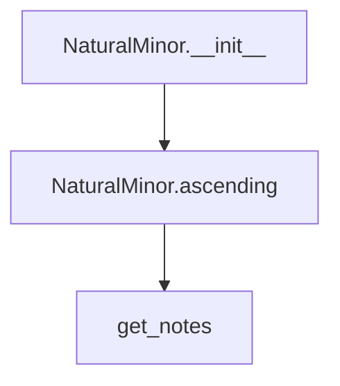

## Raises:
- `NoteFormatError`: Raised in the parent constructor when the tonic note is lowercase (invalid format).
- `RangeError`: Raised in the parent constructor when the octave count is invalid.

## Example:
```python
# Create a natural minor scale starting from C
scale = NaturalMinor("C")

# Generate the ascending scale
notes = scale.ascending()
# Returns: ['C', 'D', 'Eb', 'F', 'G', 'Ab', 'Bb', 'C']

# Create a two-octave natural minor scale
scale_2oct = NaturalMinor("A", 2)
notes_2oct = scale_2oct.ascending()
# Returns: ['A', 'B', 'C', 'D', 'E', 'F', 'G', 'A', 'B', 'C', 'D', 'E', 'F', 'G', 'A']
```

### `mingus.core.scales.NaturalMinor.__init__` · *method*

## Summary:
Initializes a NaturalMinor scale instance by calling the parent scale constructor and setting the scale's descriptive name.

## Description:
This method serves as the constructor for the NaturalMinor class, which implements the natural minor scale pattern. It first calls the parent `_Scale.__init__` method to establish the basic scale properties including the tonic note and octave span, then sets the instance's name attribute to a formatted string indicating this is a natural minor scale.

The natural minor scale is characterized by its specific interval pattern with semitones at the 2nd and 5th degrees, creating a distinctive minor tonality. This method ensures proper initialization of the scale's identity while inheriting all standard scale functionality from the parent class.

## Args:
    note (str): The tonic note of the scale, represented as an uppercase letter (e.g., 'C', 'D#'). Must be a valid note name.
    octaves (int): The number of octaves the scale spans. Defaults to 1. Must be a non-negative integer.

## Returns:
    None: This method initializes the object in-place and does not return a value.

## Raises:
    NoteFormatError: Raised by the parent class when the note parameter is not in proper uppercase format.
    RangeError: Raised by the parent class when the octaves parameter is invalid (negative).

## State Changes:
    Attributes READ: 
        - self.tonic (accessed during parent initialization)
    Attributes WRITTEN:
        - self.name (set to "{0} natural minor".format(self.tonic))
        - self.tonic (set by parent class)
        - self.octaves (set by parent class)

## Constraints:
    Preconditions:
        - The note parameter must be a valid uppercase note name string
        - The octaves parameter must be a non-negative integer
    Postconditions:
        - The NaturalMinor scale instance is properly initialized with the specified tonic and octave span
        - The instance's name attribute reflects that this is a natural minor scale

## Side Effects:
    None: This method does not perform any I/O operations or mutate external objects.

### `mingus.core.scales.NaturalMinor.ascending` · *method*

## Summary:
Returns the ascending natural minor scale notes starting from the tonic, repeated across specified octaves, with the tonic appended at the end to complete the scale.

## Description:
This method generates the ascending form of a natural minor scale by retrieving the diatonic notes for the specified tonic key, repeating them across the requested number of octaves, and appending the first note (tonic) at the end to close the scale. The method is designed to work with the NaturalMinor class instance and provides a standardized way to construct ascending natural minor scales.

Known callers:
- This method is likely called by the NaturalMinor class's public interface methods that need to generate the complete ascending scale representation.
- It may be used in musical composition tools, scale analysis applications, or educational software that requires natural minor scale construction.

The logic is separated into its own method to encapsulate the specific algorithm for constructing ascending natural minor scales, making the code more modular and reusable compared to inlining the calculation logic.

## Args:
    None

## Returns:
    list[str]: A list of note names representing the ascending natural minor scale. The list contains the base notes repeated across self.octaves octaves plus the tonic note appended at the end.

## Raises:
    None explicitly raised

## State Changes:
    Attributes READ: self.tonic, self.octaves
    Attributes WRITTEN: None

## Constraints:
    Preconditions:
        - The self.tonic attribute must be a valid musical key string that can be processed by get_notes().
        - The self.octaves attribute must be a non-negative integer representing the number of octaves to repeat.
        
    Postconditions:
        - The returned list contains at least one note (the tonic).
        - The length of the returned list equals (7 * self.octaves) + 1, where 7 represents the number of notes in a diatonic scale.

## Side Effects:
    - Calls the get_notes() function which may access global caching mechanisms.
    - Does not modify any instance attributes or external state beyond returning the computed result.

## `mingus.core.scales.HarmonicMinor` · *class*

## Summary:
Represents a harmonic minor scale that raises the seventh degree of the natural minor scale by one semitone.

## Description:
The HarmonicMinor class implements the harmonic minor scale pattern, which is a variation of the natural minor scale where the seventh degree is raised by one semitone (sharpened). This creates a distinctive sound characterized by a large interval between the sixth and seventh degrees, giving it a unique melodic quality often used in classical and romantic music. The class inherits from the abstract _Scale base class and provides a concrete implementation for generating harmonic minor scales.

This class is typically instantiated when working with harmonic minor scales in music theory applications, composition tools, or educational software. It serves as a specialized abstraction for the harmonic minor scale pattern, encapsulating the specific rule that modifies the seventh degree of the natural minor scale.

## State:
- `tonic` (str): The root note of the scale, stored as a string. Must be an uppercase letter representing a note name (e.g., 'C', 'D#'). Inherited from _Scale parent class.
- `octaves` (int): Number of octaves the scale spans. Must be a positive integer. Inherited from _Scale parent class.
- `name` (str): The descriptive name of the scale, formatted as "{tonic} harmonic minor". Set during initialization.
- `type` (str): Class attribute indicating this is a minor scale, always set to "minor".

## Lifecycle:
- Creation: Instantiate with a tonic note (string) and optional number of octaves (integer, default 1). The tonic must be in uppercase format.
- Usage: Call the `ascending()` method to retrieve the complete ascending harmonic minor scale notes.
- Destruction: Standard Python object destruction; no special cleanup required.

## Method Map:
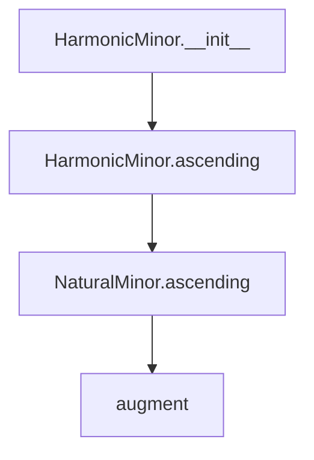

## Raises:
- `NoteFormatError`: Raised in the parent constructor when the tonic note is lowercase (invalid format).
- `RangeError`: Raised in the parent constructor when the octave count is invalid.

## Example:
```python
# Create a harmonic minor scale starting from C
scale = HarmonicMinor("C")

# Generate the ascending scale
notes = scale.ascending()
# Returns: ['C', 'D', 'Eb', 'F', 'G', 'Ab', 'B', 'C']

# Create a two-octave harmonic minor scale
scale_2oct = HarmonicMinor("A", 2)
notes_2oct = scale_2oct.ascending()
# Returns: ['A', 'B', 'C', 'D', 'E', 'F', 'G#', 'A', 'B', 'C', 'D', 'E', 'F', 'G#', 'A']
```

### `mingus.core.scales.HarmonicMinor.__init__` · *method*

## Summary:
Initializes a HarmonicMinor scale instance by calling the parent scale constructor and setting the scale's descriptive name.

## Description:
This method serves as the constructor for the HarmonicMinor class, which implements the harmonic minor scale pattern. It first calls the parent `_Scale.__init__` method to establish the basic scale properties including the tonic note and octave span, then sets the instance's name attribute to a formatted string indicating this is a harmonic minor scale.

The harmonic minor scale is characterized by raising the seventh degree of the natural minor scale by one semitone (sharpening it), creating a distinctive sound with a large interval between the sixth and seventh degrees. This method ensures proper initialization of the scale's identity while inheriting all standard scale functionality from the parent class.

## Args:
    note (str): The tonic note of the scale, represented as an uppercase letter (e.g., 'C', 'D#'). Must be a valid note name.
    octaves (int): The number of octaves the scale spans. Defaults to 1. Must be a positive integer.

## Returns:
    None: This method initializes the object in-place and does not return a value.

## Raises:
    NoteFormatError: Raised by the parent class when the note parameter is not in proper uppercase format.
    RangeError: Raised by the parent class when the octaves parameter is invalid (negative or zero).

## State Changes:
    Attributes READ: 
        - self.tonic (accessed during parent initialization)
    Attributes WRITTEN:
        - self.name (set to "{tonic} harmonic minor")
        - self.tonic (set by parent class)
        - self.octaves (set by parent class)

## Constraints:
    Preconditions:
        - The note parameter must be a valid uppercase note name string
        - The octaves parameter must be a positive integer
    Postconditions:
        - The HarmonicMinor scale instance is properly initialized with the specified tonic and octave span
        - The instance's name attribute reflects that this is a harmonic minor scale

## Side Effects:
    None: This method does not perform any I/O operations or mutate external objects.

### `mingus.core.scales.HarmonicMinor.ascending` · *method*

## Summary:
Generates the ascending form of a harmonic minor scale by modifying the seventh degree of the natural minor scale.

## Description:
This method constructs the ascending harmonic minor scale by taking the ascending form of the natural minor scale, raising the seventh degree by one semitone (adding a sharp), and then repeating the scale pattern across the specified number of octaves. The harmonic minor scale is characterized by its raised seventh degree, which creates a distinctive sound often used in classical and romantic music.

The method is part of the HarmonicMinor class and represents the specific pattern of the harmonic minor scale, which differs from the natural minor by elevating the seventh degree. This modification creates the characteristic sound of the harmonic minor scale.

## Args:
    None

## Returns:
    list[str]: A list of note strings representing the ascending harmonic minor scale. The notes follow the pattern [tonic, second, third, fourth, fifth, sixth, seventh augmented, tonic], repeated for the specified number of octaves. The returned list contains exactly 7 * self.octaves + 1 notes.

## Raises:
    None

## State Changes:
    Attributes READ: self.tonic, self.octaves
    Attributes WRITTEN: None

## Constraints:
    Preconditions:
        - The instance must have a valid tonic note stored in self.tonic
        - The instance must have a valid octaves count stored in self.octaves
    Postconditions:
        - The returned list contains exactly 7 * self.octaves + 1 notes
        - The seventh degree is properly augmented (raised by one semitone)
        - The first and last notes are identical (creating a closed scale)

## Side Effects:
    None

## `mingus.core.scales.MelodicMinor` · *class*

## Summary:
Represents a melodic minor scale that generates both ascending and descending forms with specific alterations.

## Description:
The MelodicMinor class implements the melodic minor scale pattern, which differs from the natural minor scale in its ascending form. In the ascending form, the sixth and seventh degrees are raised by one semitone (augmented), while the descending form follows the natural minor pattern. This class inherits from the abstract _Scale base class and provides concrete implementations for generating melodic minor scales.

This class is typically instantiated when working with melodic minor scales in music theory applications, composition tools, or educational software. It serves as a distinct abstraction for handling the unique characteristics of melodic minor scales, particularly their asymmetric ascending/descending forms.

## State:
- `tonic` (str): The root note of the scale, stored as a string. Must be an uppercase letter representing a note name (e.g., 'C', 'D#'). Inherited from _Scale parent class.
- `octaves` (int): Number of octaves the scale spans. Must be a positive integer. Inherited from _Scale parent class.
- `name` (str): The descriptive name of the scale, formatted as "{tonic} melodic minor". Set during initialization.
- `type` (str): Class attribute indicating this is a minor scale, always set to "minor".

## Lifecycle:
- Creation: Instantiate with a tonic note (string) and optional number of octaves (integer, default 1). The tonic must be in uppercase format.
- Usage: Call the `ascending()` method to retrieve the ascending melodic minor scale notes, or `descending()` to retrieve the descending form. The scale can also be used with methods inherited from _Scale like `degree()`.
- Destruction: Standard Python object destruction; no special cleanup required.

## Method Map:
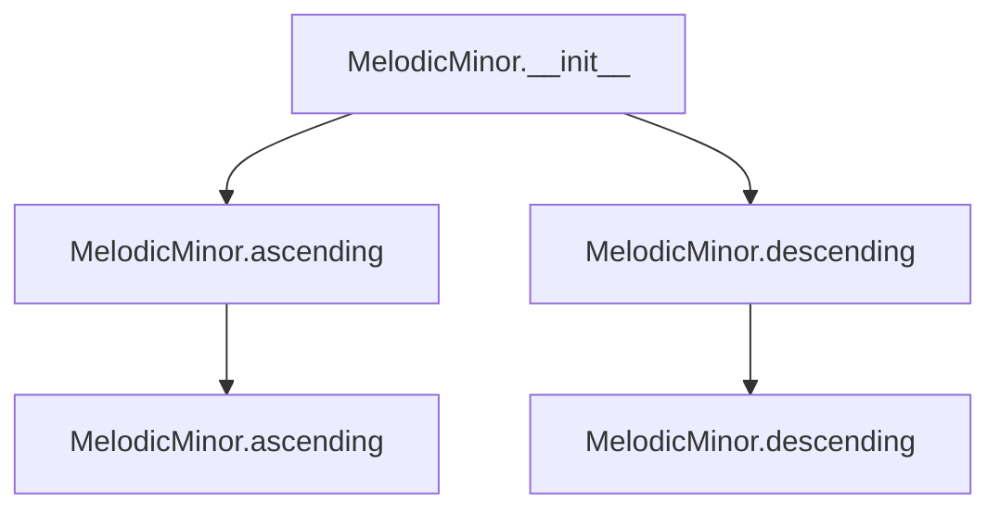

## Raises:
- `NoteFormatError`: Raised in the parent constructor when the tonic note is lowercase (invalid format).
- `RangeError`: Raised in the parent constructor when the octave count is invalid.

## Example:
```python
# Create a melodic minor scale starting from C
scale = MelodicMinor("C")

# Generate the ascending scale (with augmented 6th and 7th degrees)
ascending_notes = scale.ascending()
# Returns: ['C', 'D', 'Eb', 'F', 'G', 'A', 'B', 'C']

# Generate the descending scale (following natural minor pattern)
descending_notes = scale.descending()
# Returns: ['C', 'B', 'A', 'G', 'F', 'Eb', 'D', 'C']

# Create a two-octave melodic minor scale
scale_2oct = MelodicMinor("A", 2)
ascending_2oct = scale_2oct.ascending()
# Returns: ['A', 'B', 'C', 'D', 'E', 'F#', 'G#', 'A', 'B', 'C', 'D', 'E', 'F#', 'G#', 'A']
```

### `mingus.core.scales.MelodicMinor.__init__` · *method*

## Summary:
Initializes a MelodicMinor scale object with a specified tonic note and octave range, setting its descriptive name.

## Description:
The `__init__` method constructs a MelodicMinor scale instance by calling the parent class constructor to establish the tonic note and octave span, then sets the object's name attribute to a descriptive string indicating the scale type.

This method serves as the primary constructor for MelodicMinor objects, ensuring proper initialization of the scale's fundamental properties. It leverages inheritance from the `_Scale` base class to handle validation and storage of the tonic and octave parameters, while adding the specific naming convention for melodic minor scales.

## Args:
    note (str): The tonic note of the scale, represented as an uppercase letter (e.g., 'C', 'D#').
    octaves (int): The number of octaves the scale spans, defaults to 1.

## Returns:
    None: This method initializes the object's state and does not return a value.

## Raises:
    NoteFormatError: When the note parameter is not in uppercase format (lowercase letters are invalid).
    RangeError: When the octaves parameter is not a positive integer.

## State Changes:
    Attributes READ: self.tonic
    Attributes WRITTEN: self.name

## Constraints:
    Preconditions:
        - The note parameter must be a string containing a single uppercase letter representing a valid note name.
        - The octaves parameter must be a positive integer.
    Postconditions:
        - The object's `tonic` attribute is properly initialized from the note parameter.
        - The object's `octaves` attribute is properly initialized from the octaves parameter.
        - The object's `name` attribute is set to "{tonic} melodic minor".

## Side Effects:
    None: This method performs no I/O operations or external service calls. It only modifies the object's internal state.

### `mingus.core.scales.MelodicMinor.ascending` · *method*

## Summary:
Generates the ascending form of a melodic minor scale by modifying the sixth and seventh degrees of the natural minor scale.

## Description:
This method constructs the ascending form of a melodic minor scale by taking the ascending form of the corresponding natural minor scale and raising the sixth and seventh degrees by one semitone (adding sharps). This transformation distinguishes the melodic minor scale from the natural minor scale, creating the characteristic sound of the melodic minor mode.

The method is part of the MelodicMinor class and is called during the scale construction process when generating the ascending form of the scale. It leverages the NaturalMinor class to obtain the base notes and then applies the melodic minor modifications by augmenting the sixth and seventh degrees.

Known callers:
- This method is called internally by the MelodicMinor class when constructing the ascending form of a melodic minor scale.
- It is part of the standard scale interface and is used by methods like __str__ and __eq__ in the parent _Scale class.

The logic is separated into its own method to encapsulate the specific algorithm for constructing ascending melodic minor scales, making the code more modular and reusable compared to inlining the calculation logic.

## Args:
    None

## Returns:
    list[str]: A list of note strings representing the ascending melodic minor scale. The list contains the notes repeated across the specified octaves followed by the first note of the scale in the highest octave.

## Raises:
    None

## State Changes:
    Attributes READ: self.tonic, self.octaves
    Attributes WRITTEN: None

## Constraints:
    Preconditions: The MelodicMinor instance must have a valid tonic note and octaves count.
    Postconditions: The returned list represents a properly constructed ascending melodic minor scale with the sixth and seventh degrees augmented.

## Side Effects:
    None

### `mingus.core.scales.MelodicMinor.descending` · *method*

## Summary:
Generates the descending form of a melodic minor scale by taking the natural minor's descending notes and extending them across multiple octaves.

## Description:
This method constructs the descending version of a melodic minor scale by leveraging the natural minor scale's descending sequence. It retrieves the descending notes from a NaturalMinor instance, removes the last note to avoid duplication, then repeats the sequence across the specified number of octaves while ensuring proper octave wrapping.

The method is separated from the ascending implementation to maintain clarity in the distinct behaviors of melodic minor scales, which have different ascending and descending forms in traditional music theory. This separation allows for clean, focused implementations of each scale variant.

## Args:
    None

## Returns:
    list[str]: A list of note strings representing the descending melodic minor scale, spanning the specified number of octaves. The notes follow the natural minor pattern except for the ascending form's modifications.

## Raises:
    None explicitly raised

## State Changes:
    Attributes READ: self.tonic, self.octaves
    Attributes WRITTEN: None

## Constraints:
    Preconditions: 
    - The object must be properly initialized with a valid tonic note and positive octaves count
    - The NaturalMinor class must be available and functioning correctly
    
    Postconditions:
    - Returns a list of note strings in descending order
    - The returned list length equals (7 * self.octaves + 1) where 7 is the number of notes in a single octave of a natural minor scale
    - The first and last notes of the returned list are identical (octave wrapping)

## Side Effects:
    None

## `mingus.core.scales.Bachian` · *class*

## Summary:
Represents a Bachian scale, a specialized minor scale pattern that combines melodic minor scale notes across multiple octaves.

## Description:
The Bachian scale is a musical scale pattern that derives from the melodic minor scale. It is implemented as a concrete subclass of the abstract `_Scale` base class. This class specifically generates the ascending form of a Bachian scale by utilizing the MelodicMinor scale implementation.

The ascending form of the Bachian scale is constructed by taking the ascending melodic minor scale notes for the specified tonic, excluding the final note to avoid duplication, repeating the sequence across the requested number of octaves, and appending the first note of the sequence to complete the scale cycle. This approach ensures the Bachian scale maintains proper musical structure while spanning multiple octaves.

The Bachian scale is typically instantiated when working with specific musical scale patterns in music theory applications, composition tools, or educational software. It serves as a distinct abstraction for handling this particular scale variant, providing a standardized interface for scale operations while maintaining the unique characteristics of the Bachian pattern.

## State:
- `tonic` (str): The root note of the scale, stored as a string. Must be an uppercase letter representing a note name (e.g., 'C', 'D#'). Inherited from `_Scale` parent class.
- `octaves` (int): Number of octaves the scale spans. Must be a non-negative integer. Inherited from `_Scale` parent class.
- `name` (str): The descriptive name of the scale, formatted as "{tonic} Bachian". Set during initialization.
- `type` (str): Class attribute indicating this is a minor scale, always set to "minor".

## Lifecycle:
- Creation: Instantiate with a tonic note (string) and optional number of octaves (integer, default 1). The tonic must be in uppercase format.
- Usage: Call the `ascending()` method to retrieve the ascending Bachian scale notes. The scale can also be used with methods inherited from `_Scale` like `degree()`.
- Destruction: Standard Python object destruction; no special cleanup required.

## Method Map:
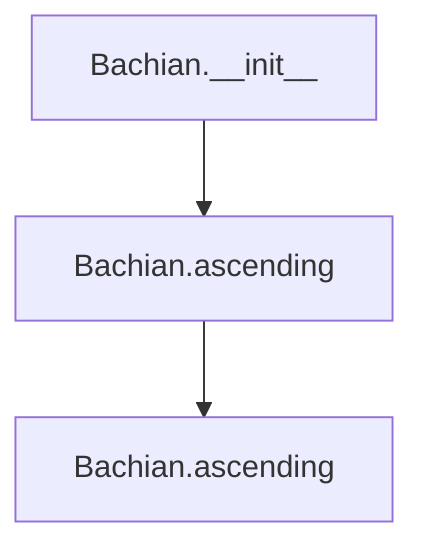

## Raises:
- `NoteFormatError`: Raised in the parent constructor when the tonic note is lowercase (invalid format).
- `RangeError`: Raised in the parent constructor when the octave count is invalid.

## Example:
```python
# Create a Bachian scale starting from C
scale = Bachian("C")

# Generate the ascending Bachian scale
ascending_notes = scale.ascending()
# Returns: ['C', 'D', 'Eb', 'F', 'G', 'A', 'B', 'C']

# Create a two-octave Bachian scale
scale_2oct = Bachian("A", 2)
ascending_2oct = scale_2oct.ascending()
# Returns: ['A', 'B', 'C', 'D', 'E', 'F#', 'G#', 'A', 'B', 'C', 'D', 'E', 'F#', 'G#', 'A']
```

### `mingus.core.scales.Bachian.__init__` · *method*

## Summary:
Initializes a Bachian scale instance by calling the parent scale constructor and setting the scale's name attribute.

## Description:
This method serves as the constructor for the Bachian class, which implements a specialized Bachian scale pattern. It first calls the parent `_Scale.__init__` method to establish the basic scale properties including the tonic note and octave span, then sets the instance's name attribute to a formatted string indicating this is a Bachian scale.

The Bachian scale is derived from the melodic minor scale pattern and is implemented as a concrete subclass of the abstract `_Scale` base class. This initialization method ensures proper setup of the scale's identity while inheriting all standard scale functionality from the parent class.

## Args:
    note (str): The tonic note of the scale, represented as an uppercase letter (e.g., 'C', 'D#'). Must be a valid note name.
    octaves (int): The number of octaves the scale spans. Defaults to 1. Must be a non-negative integer.

## Returns:
    None: This method initializes the object in-place and does not return a value.

## Raises:
    NoteFormatError: Raised by the parent class when the note parameter is not in proper uppercase format.
    RangeError: Raised by the parent class when the octaves parameter is invalid (negative).

## State Changes:
    Attributes READ: 
        - self.tonic (accessed during parent initialization)
    Attributes WRITTEN:
        - self.name (set to "{tonic} Bachian")
        - self.tonic (set by parent class)
        - self.octaves (set by parent class)

## Constraints:
    Preconditions:
        - The note parameter must be a valid uppercase note name string
        - The octaves parameter must be a non-negative integer
    Postconditions:
        - The Bachian scale instance is properly initialized with the specified tonic and octave span
        - The instance's name attribute reflects that this is a Bachian scale

## Side Effects:
    None: This method does not perform any I/O operations or mutate external objects.

### `mingus.core.scales.Bachian.ascending` · *method*

## Summary:
Generates the ascending form of a Bachian scale by combining melodic minor scale notes across multiple octaves.

## Description:
This method constructs the ascending form of a Bachian scale by leveraging the MelodicMinor scale implementation. It retrieves the ascending melodic minor scale notes for the specified tonic, excludes the final note to avoid duplication, repeats the sequence across the requested number of octaves, and appends the first note of the sequence to complete the scale cycle. This approach ensures the Bachian scale maintains proper musical structure while spanning multiple octaves.

The method is called during the lifecycle of a Bachian scale object when retrieving the ascending note sequence, typically for display, analysis, or musical processing purposes. It forms part of the standard scale interface and is used by methods like __str__ and __eq__ in the parent _Scale class.

## Args:
    None

## Returns:
    list[str]: A list of note strings representing the ascending Bachian scale, repeated across the specified number of octaves and ending with the tonic note to complete the scale cycle.

## Raises:
    None explicitly raised

## State Changes:
    Attributes READ: self.tonic, self.octaves
    Attributes WRITTEN: None

## Constraints:
    Preconditions:
        - The Bachian object must be properly initialized with a valid tonic note and octave count
        - The self.tonic attribute must be a valid musical key string that can be processed by MelodicMinor
        - The self.octaves attribute must be a non-negative integer representing the number of octaves to repeat
        
    Postconditions:
        - The returned list contains at least one note (the tonic)
        - The length of the returned list equals (7 * self.octaves) + 1, where 7 represents the number of notes in a melodic minor scale
        - The sequence properly closes the scale by including the initial note at the end

## Side Effects:
    - Calls the MelodicMinor class constructor which may involve validation of the tonic note
    - Does not modify any instance attributes or external state beyond returning the computed result

## `mingus.core.scales.MinorNeapolitan` · *class*

## Summary:
Represents a minor Neapolitan scale, a variant of the harmonic minor scale with a flattened second degree in its ascending form.

## Description:
The MinorNeapolitan class implements a specific musical scale pattern that is a variant of the harmonic minor scale. It modifies the standard harmonic minor by flattening the second degree in its ascending form, creating a distinctive melodic character. This class is typically used in music theory applications, composition tools, or educational software where specific scale patterns are required.

The class inherits from the abstract _Scale base class and provides specific implementations for generating both ascending and descending forms of the minor Neapolitan scale. The ascending form is created by taking a harmonic minor scale, removing the last note, and flattening the second note. The descending form is created by taking a natural minor scale, removing the last note, and flattening the seventh note.

## State:
- `tonic` (str): The root note of the scale, inherited from the parent _Scale class. Must be an uppercase letter representing a note name (e.g., 'C', 'D#').
- `octaves` (int): Number of octaves the scale spans, inherited from the parent _Scale class. Must be a positive integer.
- `name` (str): The descriptive name of the scale, formatted as "{tonic} minor Neapolitan". Set during initialization.
- `type` (str): Class attribute indicating this is a minor scale, always set to "minor".

## Lifecycle:
- Creation: Instantiate with a tonic note (string) and optional number of octaves (integer, default 1). The tonic must be in uppercase format.
- Usage: Call the `ascending()` method to retrieve the complete ascending minor Neapolitan scale notes, or the `descending()` method for the descending form.
- Destruction: Standard Python object destruction; no special cleanup required.

## Method Map:
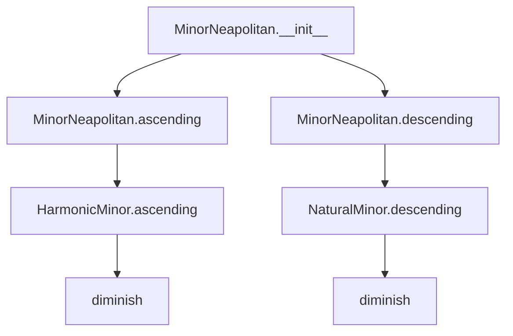

## Raises:
- `NoteFormatError`: Raised in the parent constructor when the tonic note is lowercase (invalid format).
- `RangeError`: Raised in the parent constructor when the octave count is invalid.

## Example:
```python
# Create a minor Neapolitan scale starting from C
scale = MinorNeapolitan("C")

# Generate the ascending scale
notes = scale.ascending()
# Returns: ['C', 'Db', 'E', 'F', 'G', 'A', 'Bb', 'C']

# Generate the descending scale
notes_desc = scale.descending()
# Returns: ['C', 'Bb', 'A', 'G', 'F', 'E', 'Db', 'C']

# Create a two-octave minor Neapolitan scale
scale_2oct = MinorNeapolitan("A", 2)
notes_2oct = scale_2oct.ascending()
# Returns: ['A', 'Bb', 'C', 'D', 'E', 'F', 'G', 'A', 'Bb', 'C', 'D', 'E', 'F', 'G', 'A']
```

### `mingus.core.scales.MinorNeapolitan.__init__` · *method*

## Summary:
Initializes a MinorNeapolitan scale object with a specified tonic note and octave range, setting its descriptive name.

## Description:
The `__init__` method constructs a MinorNeapolitan scale instance by calling the parent `_Scale` class constructor to establish the tonic note and octave span, then sets the object's descriptive name to "{tonic} minor Neapolitan". This method serves as the primary constructor for the MinorNeapolitan class, ensuring proper initialization of scale properties and establishing the scale's identity.

This logic is encapsulated in its own method rather than being inlined because:
1. It separates the initialization concerns from the scale generation logic
2. It allows for consistent setup across all instances of the class
3. It enables inheritance from the parent _Scale class to properly configure shared attributes
4. It provides a clear entry point for setting the scale's descriptive name

## Args:
    note (str): The tonic note of the scale, represented as an uppercase letter (e.g., 'C', 'D#'). Must be a valid note name.
    octaves (int): The number of octaves the scale spans. Defaults to 1. Must be a positive integer.

## Returns:
    None: This method initializes the object's state but does not return a value.

## Raises:
    NoteFormatError: Raised when the note parameter is not in uppercase format (invalid note representation).
    RangeError: Raised when the octaves parameter is not a positive integer.

## State Changes:
    Attributes READ: 
        - self.tonic: Used to format the descriptive name
    Attributes WRITTEN:
        - self.name: Set to "{0} minor Neapolitan".format(self.tonic)

## Constraints:
    Preconditions:
        - The note parameter must be a valid uppercase note name (e.g., 'C', 'D#', 'Gb')
        - The octaves parameter must be a positive integer
    Postconditions:
        - The object's tonic attribute is properly initialized from the note parameter
        - The object's octaves attribute is properly initialized from the octaves parameter
        - The object's name attribute is set to the formatted string "{tonic} minor Neapolitan"

## Side Effects:
    None: This method performs no I/O operations, external service calls, or mutations to objects outside self.

### `mingus.core.scales.MinorNeapolitan.ascending` · *method*

## Summary:
Returns the ascending notes of a minor Neapolitan scale by modifying the second degree of a harmonic minor scale.

## Description:
This method generates the ascending form of a minor Neapolitan scale, which is a variant of the harmonic minor scale with a flattened second degree. The implementation begins by creating a harmonic minor scale from the object's tonic, removes the final note to create a seven-note pattern, then flattens the second note in the sequence. The resulting notes are repeated for the specified number of octaves and the first note is appended to complete the scale cycle.

The minor Neapolitan scale is characterized by its distinctive pattern where the second degree is flattened compared to the standard harmonic minor scale. This method is typically called during musical scale generation or analysis workflows where specific scale patterns are required.

## Args:
    None

## Returns:
    list[str]: A list of note strings representing the ascending minor Neapolitan scale. The notes follow the pattern [tonic, flattened second, third, fourth, fifth, sixth, flattened seventh] repeated across the specified octaves with the tonic appended at the end.

## Raises:
    None

## State Changes:
    Attributes READ: self.tonic, self.octaves
    Attributes WRITTEN: None

## Constraints:
    Preconditions: The object must be properly initialized with a valid tonic note and positive octaves count.
    Postconditions: The returned list represents a complete ascending minor Neapolitan scale with proper octave repetition and the characteristic flattened second degree.

## Side Effects:
    None

### `mingus.core.scales.MinorNeapolitan.descending` · *method*

## Summary:
Generates the descending form of a minor Neapolitan scale by modifying the seventh degree of a natural minor scale.

## Description:
This method constructs the descending form of a minor Neapolitan scale by taking the descending notes of a natural minor scale, diminishing the seventh degree, and then repeating the pattern across specified octaves. The minor Neapolitan scale is a variant of the natural minor scale with specific alterations to create a distinctive melodic character.

The method is part of the MinorNeapolitan class and is specifically designed to generate the descending form of this scale type. It leverages the NaturalMinor class to obtain the base descending notes and applies a specific transformation to the seventh degree before returning the complete scale.

## Args:
    None

## Returns:
    list[str]: A list of note strings representing the descending minor Neapolitan scale. The list contains the notes repeated across the specified octaves, with the seventh degree diminished and the final note matching the first note of the scale.

## Raises:
    None

## State Changes:
    Attributes READ: self.tonic, self.octaves
    Attributes WRITTEN: None

## Constraints:
    - Preconditions: The MinorNeapolitan instance must be properly initialized with a valid tonic note and octaves count.
    - Postconditions: The returned list will contain exactly the number of notes required for the descending scale, with proper octave repetition and the seventh degree properly diminished.

## Side Effects:
    None

## `mingus.core.scales.Chromatic` · *class*

## Summary:
Represents a chromatic scale that includes all twelve notes of the Western musical system, constructed from a given key.

## Description:
The Chromatic class implements a chromatic scale generator that creates a complete sequence of all twelve notes in the chromatic scale for a specified musical key. This class extends the abstract _Scale base class and provides specific implementations for ascending and descending scale patterns. The chromatic scale includes all semitones between the tonic and the next octave, making it useful for musical analysis, composition, and practice exercises.

The class is typically instantiated by passing a musical key (e.g., "C", "G#") and optionally the number of octaves to span. It automatically determines the tonic note from the key and constructs the complete chromatic scale pattern.

## State:
- `key` (str): The musical key from which the scale is derived. Must be a valid key string recognized by the system.
- `tonic` (str): The root note of the scale, extracted from the key using get_notes(). Must be an uppercase letter representing a note name.
- `octaves` (int): Number of octaves the scale spans. Must be a positive integer, defaults to 1.
- `name` (str): The descriptive name of the scale, formatted as "{tonic} chromatic".

## Lifecycle:
- Creation: Instantiate with a key string and optional octaves parameter. The key must be valid and recognized by the system.
- Usage: Call the ascending() or descending() methods to retrieve the complete chromatic scale notes in the desired direction.
- Destruction: Standard Python object destruction; no special cleanup required.

## Method Map:
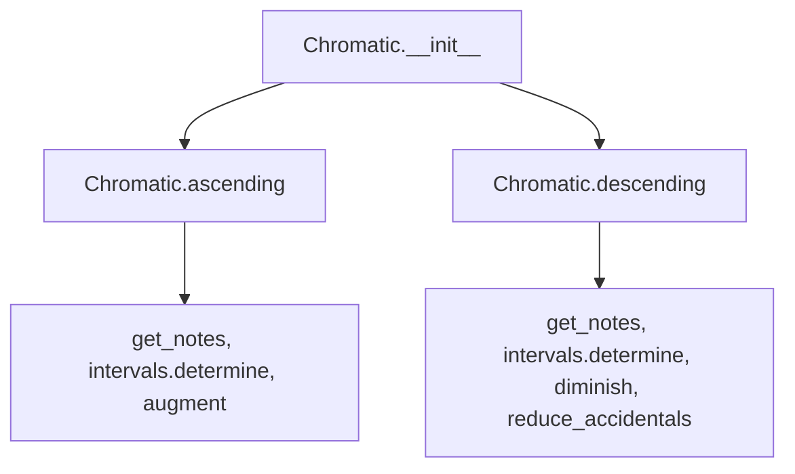

## Raises:
- `NoteFormatError`: Raised in __init__ when the key parameter is not in a recognized format.
- `IndexError`: May be raised by internal functions when processing invalid note strings.
- `TypeError`: May occur if invalid types are passed to internal note processing functions.

## Example:
```python
# Create a chromatic scale for C major
scale = Chromatic("C")

# Get ascending chromatic scale
ascending_notes = scale.ascending()
# Returns: ['C', 'C#', 'D', 'D#', 'E', 'F', 'F#', 'G', 'G#', 'A', 'A#', 'B', 'C']

# Get descending chromatic scale  
descending_notes = scale.descending()
# Returns: ['C', 'B', 'Bb', 'A', 'Ab', 'G', 'Gb', 'F', 'Eb', 'E', 'D', 'Db', 'C']

# Create a chromatic scale spanning 2 octaves
scale_2_octaves = Chromatic("G", octaves=2)
ascending_2 = scale_2_octaves.ascending()
# Returns: ['G', 'G#', 'A', 'A#', 'B', 'C', 'C#', 'D', 'D#', 'E', 'F', 'F#', 'G', 'G#', 'A', 'A#', 'B', 'C', 'C#', 'D', 'D#', 'E', 'F', 'F#', 'G']
```

### `mingus.core.scales.Chromatic.__init__` · *method*

## Summary:
Initializes a Chromatic scale object with a specified key and octave range.

## Description:
Sets up the internal state of a Chromatic scale instance by storing the key, calculating the tonic note, and defining the octave range. This method prepares the object for generating chromatic scale sequences.

The initialization logic is separated into its own method to ensure proper object setup before any scale generation operations are performed. This approach allows for clean instantiation and ensures all required attributes are properly configured.

## Args:
    key (str): The musical key for the chromatic scale. Must be a valid key string recognized by the system.
    octaves (int): Number of octaves to include in the scale. Defaults to 1.

## Returns:
    None: This method does not return a value.

## Raises:
    NoteFormatError: When the provided key string is not in a recognized format according to the is_valid_key validation.

## State Changes:
    Attributes READ: None
    Attributes WRITTEN: self.key, self.tonic, self.octaves, self.name

## Constraints:
    Preconditions:
        - The key parameter must be a valid key string that can be validated by the is_valid_key function.
        - The get_notes function must be able to process the provided key string.
        
    Postconditions:
        - The self.key attribute is set to the provided key string.
        - The self.tonic attribute contains the first note of the key's diatonic scale.
        - The self.octaves attribute is set to the provided octaves value.
        - The self.name attribute is formatted as "{tonic} chromatic".

## Side Effects:
    - Calls the get_notes function which may access global caching mechanisms.
    - May raise NoteFormatError if the key is invalid.

### `mingus.core.scales.Chromatic.ascending` · *method*

## Summary:
Generates an ascending chromatic scale by applying enharmonic adjustments to notes that form major seconds.

## Description:
Creates a chromatic scale ascending from the tonic note, where notes that form major second intervals with the previous note are augmented to maintain proper enharmonic spelling. This method implements the specific logic for constructing ascending chromatic scales in the mingus music theory library.

The method is separated from inline logic to encapsulate the complex interval detection and enharmonic adjustment process, making it reusable and testable. It leverages the existing `get_notes` function to obtain the diatonic scale for the key, then processes each note to determine if it needs enharmonic adjustment based on interval relationships.

Known callers:
- This method is called by the Chromatic scale class when generating ascending chromatic scales
- It is part of the public API for the Chromatic class and is used in musical composition and analysis workflows

## Args:
    None

## Returns:
    list[str]: A list of note names forming the ascending chromatic scale, repeated across the specified number of octaves plus the initial note to close the scale.

## Raises:
    None

## State Changes:
    Attributes READ: self.tonic, self.key, self.octaves
    Attributes WRITTEN: None

## Constraints:
    Preconditions:
        - The object must have a valid `tonic`, `key`, and `octaves` attribute set during initialization
        - The `key` must be a valid musical key recognized by the system
        - The `octaves` attribute must be a positive integer
    Postconditions:
        - The returned list contains properly enharmonically-spelled notes
        - The scale spans the specified number of octaves
        - The last note in the returned list matches the first note to close the scale

## Side Effects:
    None

### `mingus.core.scales.Chromatic.descending` · *method*

## Summary:
Constructs a descending chromatic scale by traversing key notes in reverse order, applying interval-based accidental adjustments, and repeating across specified octaves.

## Description:
Generates a descending chromatic scale starting from the tonic note. The method iterates through the notes of the specified key in reverse order, checking for major second intervals between consecutive notes. When a major second is detected, it adjusts the previous note's accidental using diminish and reduce_accidentals before appending the current note. This ensures proper chromatic scale construction with correct accidentals. The resulting scale pattern is repeated across the specified number of octaves.

This method is part of the Chromatic scale class and complements the ascending() method by providing the descending variant of chromatic scale generation. The algorithm specifically handles the case where consecutive notes form a major second interval by modifying the preceding note's accidental to maintain proper scale construction.

## Args:
    None

## Returns:
    list[str]: A list of note strings representing the descending chromatic scale. The scale begins with the tonic, includes all notes from the key in reverse order with appropriate interval adjustments, and repeats the pattern across the specified number of octaves before ending with the tonic.

## Raises:
    None

## State Changes:
    Attributes READ: self.tonic, self.key, self.octaves
    Attributes WRITTEN: None

## Constraints:
    Preconditions:
        - The instance must have a valid key attribute that can be processed by get_notes()
        - The instance must have a valid tonic attribute derived from the key
        - The octaves attribute must be a positive integer
        
    Postconditions:
        - The returned list contains valid note strings in proper musical order
        - The scale begins and ends with the same tonic note
        - The scale spans the specified number of octaves
        - All notes in the returned list are valid musical note strings

## Side Effects:
    None

## `mingus.core.scales.WholeTone` · *class*

## Summary:
Represents a whole tone scale, a musical scale consisting of six notes where each consecutive pair is separated by a whole step (major second interval).

## Description:
The WholeTone class implements a specific type of musical scale that uses only whole steps (major seconds) between consecutive notes. This creates a scale with no semitone intervals, resulting in a distinctive sound often used in impressionist music. The class inherits from the abstract _Scale base class and provides the specific implementation for generating whole tone scales.

This class should be instantiated when creating a whole tone scale for a specific tonic note and octave span. It is typically used in musical composition and analysis applications where whole tone scales are required.

## State:
- `tonic` (str): The root note of the scale, inherited from _Scale parent class. Must be an uppercase letter representing a note name (e.g., 'C', 'D#').
- `octaves` (int): Number of octaves the scale spans, inherited from _Scale parent class. Must be a positive integer.
- `name` (str): The descriptive name of the scale, formatted as "{tonic} whole tone"
- `type` (str): Class attribute set to "other" indicating this is a specialized scale type

## Lifecycle:
- Creation: Instantiate with a tonic note (string) and optional number of octaves (integer, default 1). The tonic must be in uppercase format.
- Usage: Call the `ascending()` method to generate the complete scale sequence. The scale follows the pattern: Tonic → Note+WholeStep → Note+2WholeSteps → ... → Note+5WholeSteps → Tonic (repeated at end)
- Destruction: Standard Python object destruction; no special cleanup required

## Method Map:
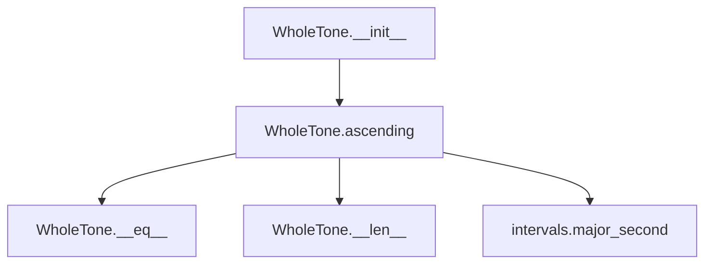

## Raises:
- `NoteFormatError`: Raised in parent constructor when the tonic note is lowercase (invalid format)
- `RangeError`: Raised in parent class methods when degree_number is less than 1
- `FormatError`: Raised in parent class methods when direction is neither 'a' nor 'd'

## Example:
```python
# Create a whole tone scale starting on C
scale = WholeTone('C', 1)

# Generate the ascending scale
notes = scale.ascending()
# Returns: ['C', 'D', 'E', 'F#', 'G#', 'A#', 'C']

# Create a two-octave whole tone scale
scale2 = WholeTone('A', 2)
notes2 = scale2.ascending()
# Returns: ['A', 'B', 'C#', 'D#', 'F', 'G', 'A', 'B', 'C#', 'D#', 'F', 'G', 'A']
```

### `mingus.core.scales.WholeTone.__init__` · *method*

## Summary:
Initializes a WholeTone scale object with a specified tonic note and octave span, setting its descriptive name.

## Description:
The `__init__` method constructs a WholeTone scale instance by calling the parent class constructor to initialize the tonic note and octave span, then sets the object's name attribute to a descriptive string format. This method is part of the initialization lifecycle where the scale's identity is established.

This logic is encapsulated in its own method rather than being inlined because:
1. It separates the initialization concerns from the core scale generation logic
2. It ensures proper inheritance chain execution via super()
3. It provides a clean place to set derived attributes like the name
4. It maintains consistency with the parent class interface requirements

## Args:
    note (str): The tonic note of the scale, represented as an uppercase letter (e.g., 'C', 'D#')
    octaves (int): Number of octaves the scale spans, defaults to 1

## Returns:
    None: This method initializes the object state and does not return a value

## Raises:
    NoteFormatError: When the note parameter is not in uppercase format (lowercase letters)
    RangeError: When octaves parameter is less than 1

## State Changes:
    Attributes READ: self.tonic
    Attributes WRITTEN: self.name

## Constraints:
    Preconditions: 
    - The note parameter must be a valid uppercase note name (A-G with optional sharps/flats)
    - The octaves parameter must be a positive integer
    
    Postconditions:
    - The object's tonic attribute is properly initialized from the note parameter
    - The object's octaves attribute is properly initialized from the octaves parameter
    - The object's name attribute is set to "{tonic} whole tone"

## Side Effects:
    None: This method performs no I/O operations or external service calls

### `mingus.core.scales.WholeTone.ascending` · *method*

## Summary:
Generates the ascending whole tone scale by sequentially applying major second intervals from the tonic note.

## Description:
This method constructs the ascending whole tone scale by starting with the tonic note and successively applying major second intervals (whole steps). A whole tone scale consists of six notes where each consecutive pair of notes is separated by a whole step (two semitones). The resulting sequence is repeated for the specified number of octaves and concludes with the first note of the scale to complete the octave.

The method is implemented as a separate function to encapsulate the specific logic for generating whole tone scales, enabling clean reuse and separation of concerns within the scale generation system. This approach ensures consistent scale construction regardless of the underlying scale type.

## Args:
    None

## Returns:
    list[str]: A list of note strings representing the ascending whole tone scale, including all octaves and ending with the first note of the scale

## Raises:
    None

## State Changes:
    Attributes READ: self.tonic, self.octaves
    Attributes WRITTEN: None

## Constraints:
    Preconditions:
        - The object must have a valid tonic note stored in self.tonic
        - The object must have a valid octaves integer stored in self.octaves
    Postconditions:
        - The returned list contains exactly 6 notes per octave (including the repeated first note)
        - The total length of the returned list is (6 * self.octaves) + 1
        - The notes form a proper whole tone scale with consistent whole step intervals (major seconds)

## Side Effects:
    None

## `mingus.core.scales.Octatonic` · *class*

## Summary:
Represents an octatonic scale, a musical scale consisting of alternating whole tones and minor thirds, with a distinctive 8-note pattern.

## Description:
The Octatonic class implements a specific type of musical scale that follows the pattern of alternating major seconds and minor thirds. This scale is commonly used in jazz and contemporary classical music due to its symmetrical properties and rich harmonic possibilities. The class inherits from the abstract _Scale base class and provides a concrete implementation of the ascending() method that generates the characteristic octatonic pattern.

This class is typically instantiated by users who want to work with octatonic scales, often in the context of composition, analysis, or performance. It's particularly useful for musicians and composers working with atonal or chromatic music where such scales provide interesting harmonic and melodic possibilities.

## State:
- `tonic` (str): The root note of the scale, stored as a string. Must be an uppercase letter representing a note name (e.g., 'C', 'D#'). Inherited from _Scale parent class.
- `octaves` (int): Number of octaves the scale spans. Must be a positive integer. Inherited from _Scale parent class.
- `name` (str): The descriptive name of the scale, formatted as "{tonic} octatonic". Set during initialization.
- `type` (str): Class attribute indicating this scale type is "other", distinguishing it from standard diatonic scales.

## Lifecycle:
- Creation: Instantiate with a tonic note (string) and optional number of octaves (integer). The tonic must be in uppercase format.
- Usage: Call the `ascending()` method to generate the complete octatonic scale pattern. The resulting sequence contains exactly (8 × self.octaves + 1) notes, including the closing tonic.
- Destruction: Standard Python object destruction; no special cleanup required.

## Method Map:
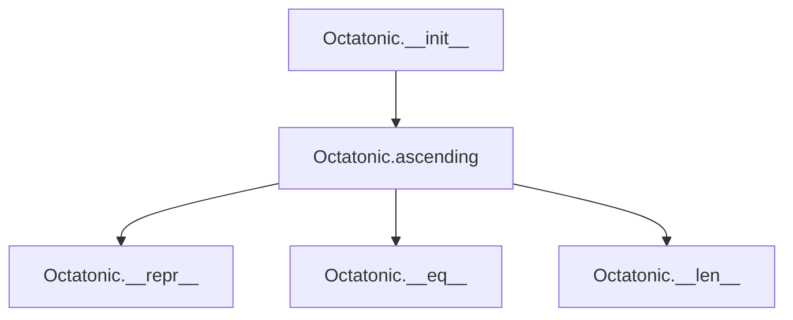

## Raises:
- `NoteFormatError`: Raised by the parent _Scale.__init__ when the tonic note is lowercase (invalid format).
- `RangeError`: Raised by the parent _Scale.__init__ when the octaves parameter is not a positive integer.

## Example:
```python
# Create an octatonic scale starting on C
scale = Octatonic('C', 1)

# Generate the ascending scale pattern
notes = scale.ascending()
print(notes)  # ['C', 'D', 'Eb', 'F', 'Gb', 'A', 'B', 'C#', 'C']

# Create a two-octave scale
scale_2 = Octatonic('A#', 2)
notes_2 = scale_2.ascending()
print(len(notes_2))  # 17 (8 notes × 2 octaves + 1 closing note)
```

### `mingus.core.scales.Octatonic.__init__` · *method*

## Summary:
Initializes an octatonic scale object with a specified tonic note and octave span, setting its descriptive name.

## Description:
The `__init__` method constructs an octatonic scale instance by calling the parent class constructor to establish the tonic and octave properties, then sets the object's name attribute to a descriptive string format. This method serves as the primary constructor for the Octatonic class, ensuring proper initialization of scale properties and establishing the scale's identity.

This logic is encapsulated in its own method rather than being inlined because:
1. It separates the initialization concerns from the scale generation logic
2. It allows for consistent setup across all octatonic scale instances
3. It enables inheritance from the parent _Scale class to maintain common behavior
4. It provides a clear entry point for debugging and testing scale instantiation

## Args:
    note (str): The tonic note of the scale, represented as an uppercase letter (e.g., 'C', 'D#').
    octaves (int): The number of octaves the scale spans. Defaults to 1.

## Returns:
    None: This method initializes the object's state and does not return a value.

## Raises:
    NoteFormatError: When the note parameter is not in uppercase format (lowercase letters are invalid).
    RangeError: When the octaves parameter is not a positive integer.

## State Changes:
    Attributes READ: self.tonic
    Attributes WRITTEN: self.name

## Constraints:
    Preconditions:
    - The note parameter must be a string containing a single uppercase letter representing a valid note name
    - The octaves parameter must be a positive integer greater than zero
    
    Postconditions:
    - The object's tonic attribute is properly set from the note parameter
    - The object's octaves attribute is properly set from the octaves parameter
    - The object's name attribute is set to "{tonic} octatonic" format

## Side Effects:
    None: This method performs no I/O operations or external service calls. It only modifies the object's internal state.

### `mingus.core.scales.Octatonic.ascending` · *method*

## Summary:
Generates an octatonic scale pattern by computing a sequence of 8 notes based on alternating major seconds and minor thirds, with specific adjustments for the final intervals.

## Description:
This method constructs an octatonic scale by starting with the tonic note and applying a specific interval pattern: major second, minor third, repeated three times, followed by a major seventh and a major sixth adjustment. The resulting 8-note sequence is then repeated for the specified number of octaves and closed by returning to the initial tonic.

The method is implemented as a separate function because it encapsulates the unique interval pattern specific to octatonic scales, which alternates between whole tones and minor thirds. This allows for clean reuse and testing of the octatonic scale construction logic independently from other scale types.

## Args:
    self: The Octatonic scale instance containing the tonic note and octave count.

## Returns:
    list[str]: A list of note strings representing the octatonic scale pattern, repeated across the specified octaves and ending with the tonic note. The total length is (8 * self.octaves + 1) notes.

## Raises:
    None explicitly raised, though underlying interval functions may raise NoteFormatError or similar exceptions.

## State Changes:
    Attributes READ: self.tonic, self.octaves
    Attributes WRITTEN: None

## Constraints:
    Preconditions:
        - The instance must have a valid tonic note set in self.tonic
        - The octaves attribute must be a positive integer
    Postconditions:
        - The returned list contains exactly (8 * self.octaves + 1) notes
        - The first and last notes in the sequence are identical (the tonic)
        - All intermediate notes follow the octatonic interval pattern: [tonic, major_second, minor_third, major_second, minor_third, major_second, minor_third, major_seventh, major_sixth]

## Side Effects:
    None

