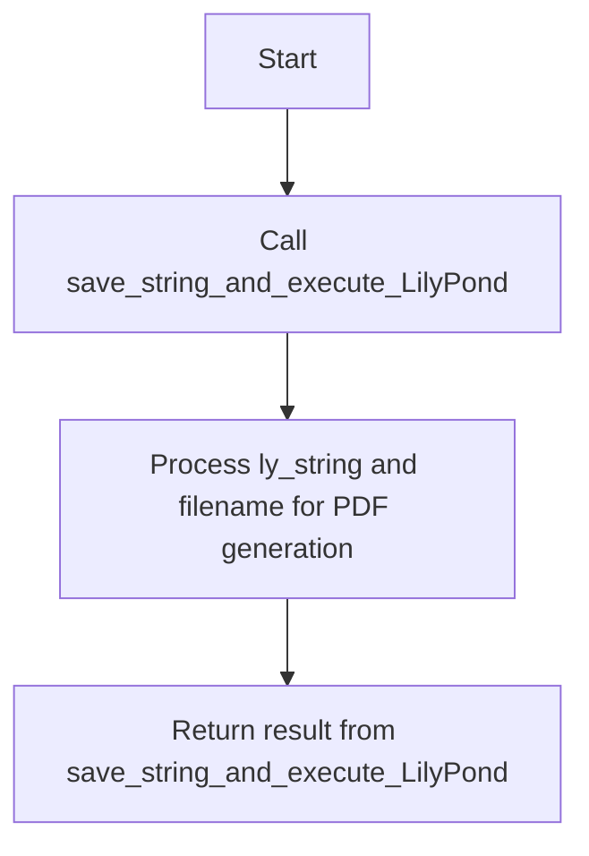
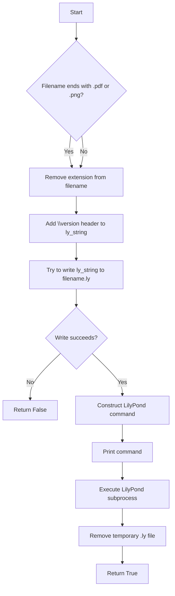

# `lilypond.py`

## `mingus.extra.lilypond.from_Note` · *function*

## Summary:
Converts a mingus Note object into LilyPond notation format.

## Description:
Transforms a mingus Note instance into its equivalent LilyPond musical notation representation. This function handles note names, accidentals, and octave adjustments to produce proper LilyPond syntax. The function is designed to be reusable across different LilyPond-related operations within the mingus library.

## Args:
    note (Note): A mingus Note object containing pitch name and octave information. The note.name attribute must be a valid note name string (e.g., "C", "D#", "Eb").
    process_octaves (bool): When True, adjusts octave indicators (' and ,) based on the note's octave value relative to middle C (C4). Defaults to True.
    standalone (bool): When True, wraps the result in curly braces {} required for standalone LilyPond elements. Defaults to True.

## Returns:
    str or bool: The LilyPond representation of the note as a string, or False if the input note lacks a name attribute.

## Raises:
    None explicitly raised by this function.

## Constraints:
    Preconditions:
        - The note parameter must be a valid mingus Note object with a name attribute
        - The note.name must be a valid note name string (e.g., "C", "D#", "Eb")
        - The note.octave must be a non-negative integer
    Postconditions:
        - Returns a properly formatted LilyPond note string when successful
        - Returns False when the note object doesn't have a name attribute

## Side Effects:
    None.

## Control Flow:
```mermaid
flowchart TD
    A[Start from_Note] --> B{note has name attr?}
    B -- No --> C[Return False]
    B -- Yes --> D[Initialize result with note.name[0].lower()]
    D --> E[Process accidentals in note.name[1:]]
    E --> F{process_octaves?}
    F -- Yes --> G[Adjust octave indicators]
    F -- No --> H[Skip octave processing]
    G --> I[Return formatted result]
    H --> I
    I --> J{standalone?}
    J -- Yes --> K[Wrap in { }]
    J -- No --> L[Return raw result]
    K --> M[End]
    L --> M
```

## Examples:
    # Basic usage with default parameters
    note = Note("C", 4)
    lilypond_notation = from_Note(note)
    # Returns "{ c }"
    
    # With accidentals
    note = Note("D#", 5)
    lilypond_notation = from_Note(note)
    # Returns "{ dis }"
    
    # Without octave processing
    note = Note("F", 2)
    lilypond_notation = from_Note(note, process_octaves=False)
    # Returns "f"
    
    # As standalone element
    note = Note("A", 3)
    lilypond_notation = from_Note(note, standalone=False)
    # Returns "a"

## `mingus.extra.lilypond.from_NoteContainer` · *function*

## Summary:
Converts a mingus NoteContainer object into LilyPond notation format, handling single notes, chords, and optional duration specifications.

## Description:
Transforms a mingus NoteContainer instance into its equivalent LilyPond musical notation representation. This function handles various container types including single notes, chords (multiple notes), and empty containers. It also supports optional duration specification and standalone formatting. The function delegates note conversion to the `from_Note` helper function and uses `value.determine` for duration parsing.

## Args:
    nc (NoteContainer or None): A mingus NoteContainer object containing notes, or None for rest notation. Must have a notes attribute.
    duration (str or None): Optional duration specification (e.g., "quarter", "half"). Defaults to None.
    standalone (bool): When True, wraps the result in curly braces {} required for standalone LilyPond elements. Defaults to True.

## Returns:
    str or bool: The LilyPond representation of the note container as a string, or False if the input lacks a notes attribute.

## Raises:
    None explicitly raised by this function.

## Constraints:
    Preconditions:
        - The nc parameter must either be None or have a notes attribute
        - If nc is not None, it must be a valid NoteContainer object
        - The duration parameter, if provided, must be a valid duration string recognized by value.determine
    Postconditions:
        - Returns properly formatted LilyPond notation for the container
        - Returns False when nc is not None but lacks a notes attribute

## Side Effects:
    None.

## Control Flow:
```mermaid
flowchart TD
    A[Start from_NoteContainer] --> B{nc is not None AND has no notes attr?}
    B -- Yes --> C[Return False]
    B -- No --> D{nc is None OR no notes?}
    D -- Yes --> E[result = "r"]
    D -- No --> F{single note?}
    F -- Yes --> G[result = from_Note(single_note)]
    F -- No --> H[result = "<"]
    H --> I[Loop through all notes]
    I --> J[result += from_Note(note) + " "]
    J --> K[result = result[:-1] + ">"]
    K --> L{duration provided?}
    L -- Yes --> M[parsed_value = value.determine(duration)]
    M --> N{dur == longa?}
    N -- Yes --> O[result += "\\longa"]
    N -- No --> P{dur == breve?}
    P -- Yes --> Q[result += "\\breve"]
    P -- No --> R[result += str(int(parsed_value[0]))]
    R --> S[Add dots for tuplets]
    S --> T[Return result if standalone=False]
    T --> U[Wrap in { } if standalone=True]
    U --> V[End]
    L -- No --> W[Return result if standalone=False]
    W --> X[Wrap in { } if standalone=True]
    X --> V
```

## Examples:
    # Basic usage with single note
    note_container = NoteContainer([Note("C", 4)])
    lilypond_notation = from_NoteContainer(note_container)
    # Returns "{ c }"
    
    # Chord notation
    note_container = NoteContainer([Note("C", 4), Note("E", 4), Note("G", 4)])
    lilypond_notation = from_NoteContainer(note_container)
    # Returns "{ < c e g > }"
    
    # With duration specification
    note_container = NoteContainer([Note("D", 5)])
    lilypond_notation = from_NoteContainer(note_container, duration="quarter")
    # Returns "{ d4 }"
    
    # As standalone element
    note_container = NoteContainer([Note("A", 3)])
    lilypond_notation = from_NoteContainer(note_container, standalone=False)
    # Returns "a"

## `mingus.extra.lilypond.from_Bar` · *function*

## Summary:
Converts a mingus Bar object into LilyPond musical notation format, including key signature, time signature, and musical content with proper tuplet handling.

## Description:
Transforms a mingus Bar instance into its equivalent LilyPond musical notation representation. This function handles the complete conversion of musical content including key signatures, time signatures, and note/chord sequences while properly formatting tuplet ratios and musical durations. The function processes bar entries that contain note containers and duration information, applying LilyPond-specific formatting for tuplets, key signatures, and time signatures.

## Args:
    bar (mingus.containers.Bar): A mingus Bar object containing musical content with attributes including bar (list of bar entries), key (Key object), and meter (tuple of time signature values).
    showkey (bool): When True, includes the key signature in the LilyPond output. Defaults to True.
    showtime (bool): When True, includes the time signature in the LilyPond output. Defaults to True.

## Returns:
    str or bool: The LilyPond representation of the bar as a string, or False if the input bar lacks a bar attribute. The returned string follows LilyPond syntax with proper grouping, tuplet formatting, and musical notation.

## Raises:
    None explicitly raised by this function.

## Constraints:
    Preconditions:
        - The bar parameter must be a valid mingus Bar object with a bar attribute
        - The bar must contain valid bar entries where each entry is a tuple with at least 3 elements
        - Entry[1] must be a duration value that can be processed by mingus.core.value.determine
        - Entry[2] must be a note container or similar musical object that can be converted by from_NoteContainer
        - The bar.key must be a valid Key object with key and mode attributes
        - The bar.meter must be a tuple of two integers representing time signature (numerator, denominator)
    Postconditions:
        - Returns properly formatted LilyPond notation for the entire bar
        - Returns False when the bar object doesn't have a bar attribute
        - The output string is enclosed in curly braces as required by LilyPond syntax

## Side Effects:
    None.

## Control Flow:
```mermaid
flowchart TD
    A[Start from_Bar] --> B{bar has bar attr?}
    B -- No --> C[Return False]
    B -- Yes --> D{showkey?}
    D -- Yes --> E[Create key notation with from_Note]
    D -- No --> F[Set result = ""]
    E --> G[Initialize latest_ratio = (1,1)]
    F --> G
    G --> H[Loop through bar.bar entries]
    H --> I[Parse entry duration with value.determine(entry[1])]
    I --> J[Extract ratio from parsed value (indices 2:)]
    J --> K{ratio == latest_ratio?}
    K -- Yes --> L[Append note container with existing format]
    K -- No --> M{ratio_has_changed?}
    M -- Yes --> N[Close previous tuplet group with "}"]
    N --> O[Open new tuplet group with "\\times numerator/denominator {"]
    O --> P[Append note container with new format]
    P --> Q[Update latest_ratio and ratio_has_changed]
    Q --> R[Loop to next entry]
    R --> S{All entries processed?}
    S -- No --> H
    S -- Yes --> T{ratio_has_changed?}
    T -- Yes --> U[Close final tuplet group with "}"]
    U --> V[Apply time signature if showtime]
    V --> W[Return formatted result]
    T -- No --> X[Apply time signature if showtime]
    X --> W
```

## Examples:
    # Basic usage with key and time signature
    from mingus.containers import Bar
    bar = Bar("C", (4, 4))
    # Add notes to bar...
    lilypond_notation = from_Bar(bar)
    # Returns "{ \\key c \\major \\time 4/4 { c d e f } }"
    
    # Without key signature
    lilypond_notation = from_Bar(bar, showkey=False)
    # Returns "{ \\time 4/4 { c d e f } }"
    
    # Without time signature
    lilypond_notation = from_Bar(bar, showtime=False)
    # Returns "{ \\key c \\major { c d e f } }"
    
    # With tuplet handling
    # When bar entries have different durations, tuplets are automatically created
    lilypond_notation = from_Bar(bar)
    # May return "{ \\key c \\major \\time 4/4 { \\times 3/2 { c d } e } }"

## `mingus.extra.lilypond.from_Track` · *function*

## Summary:
Converts a mingus Track object into LilyPond musical notation format by processing each bar and generating appropriate key/time signature changes.

## Description:
Transforms a mingus Track instance into its equivalent LilyPond musical notation representation. This function iterates through each bar in the track, determining when key and time signature changes occur, and delegates the conversion of individual bars to the from_Bar function. It manages the display of key and time signatures by tracking changes between consecutive bars and ensures proper LilyPond syntax by wrapping the entire output in curly braces.

## Args:
    track (object): A mingus Track object that must have a 'bars' attribute containing Bar objects. The track represents a sequence of musical bars.

## Returns:
    str or bool: A string containing the complete LilyPond representation of the track wrapped in curly braces, or False if the track lacks a 'bars' attribute.

## Raises:
    None explicitly raised by this function.

## Constraints:
    Preconditions:
        - The track parameter must be a valid object with a 'bars' attribute
        - Each item in track.bars must be a valid Bar object with 'key' and 'meter' attributes
        - The track.bars must be iterable in order
    Postconditions:
        - Returns properly formatted LilyPond notation for the entire track
        - Returns False when the track object doesn't have a 'bars' attribute
        - The output string is enclosed in curly braces as required by LilyPond syntax

## Side Effects:
    None.

## Control Flow:
```mermaid
flowchart TD
    A[Start from_Track] --> B{track has bars attr?}
    B -- No --> C[Return False]
    B -- Yes --> D[Initialize lastkey = Key("C"), lasttime = (4,4)]
    D --> E[Initialize result = ""]
    E --> F[Loop through track.bars]
    F --> G{lastkey != bar.key?}
    G -- Yes --> H[Set showkey = True]
    G -- No --> I[Set showkey = False]
    H,I --> J{lasttime != bar.meter?}
    J -- Yes --> K[Set showtime = True]
    J -- No --> L[Set showtime = False]
    K,L --> M[Call from_Bar(bar, showkey, showtime)]
    M --> N[Append result with from_Bar output + " "]
    N --> O[Update lastkey = bar.key, lasttime = bar.meter]
    O --> P{All bars processed?}
    P -- No --> F
    P -- Yes --> Q[Return "{ %s}" % result]
```

## Examples:
    # Basic usage with a track containing bars
    track = Track()
    # Add bars to track...
    lilypond_notation = from_Track(track)
    # Returns "{ ... }" where ... contains LilyPond notation for all bars
    
    # Track without bars attribute
    bad_track = object()
    result = from_Track(bad_track)
    # Returns False

## `mingus.extra.lilypond.from_Composition` · *function*

## Summary:
Converts a mingus Composition object into LilyPond musical notation format by generating header information and processing each track.

## Description:
Transforms a mingus Composition instance into its equivalent LilyPond musical notation representation. This function extracts metadata from the composition (title, author, subtitle) to create a LilyPond header, then processes each track in the composition by delegating to the from_Track function. The function serves as the entry point for converting complete compositions into LilyPond format.

## Args:
    composition (object): A mingus Composition object that must have 'tracks', 'title', 'author', and 'subtitle' attributes. The composition represents a complete musical work with multiple tracks.

## Returns:
    str or bool: A string containing the complete LilyPond representation of the composition with header information and all tracks, or False if the composition object lacks a 'tracks' attribute.

## Raises:
    None explicitly raised by this function.

## Constraints:
    Preconditions:
        - The composition parameter must be a valid object with a 'tracks' attribute
        - The composition must have 'title', 'author', and 'subtitle' attributes
        - Each item in composition.tracks must be a valid Track object with a 'bars' attribute
    Postconditions:
        - Returns properly formatted LilyPond notation for the entire composition
        - Returns False when the composition object doesn't have a 'tracks' attribute
        - The output string includes header information followed by track representations

## Side Effects:
    None.

## Control Flow:
```mermaid
flowchart TD
    A[Start from_Composition] --> B{composition has tracks attr?}
    B -- No --> C[Return False]
    B -- Yes --> D[Create header with title, author, subtitle]
    D --> E[Initialize result with header]
    E --> F[Loop through composition.tracks]
    F --> G[Call from_Track(track)]
    G --> H[Append result with from_Track output + " "]
    H --> I{All tracks processed?}
    I -- No --> F
    I -- Yes --> J[Return result[:-1]]
```

## Examples:
    # Basic usage with a valid composition
    composition = Composition()
    composition.title = "My Song"
    composition.author = "Composer Name"
    composition.subtitle = "Opus 1"
    # Add tracks to composition...
    lilypond_notation = from_Composition(composition)
    # Returns "\\header { title = \"My Song\" composer = \"Composer Name\" opus = \"Opus 1\" } ...track notations..."
    
    # Composition without tracks attribute
    bad_composition = object()
    result = from_Composition(bad_composition)
    # Returns False
```

## `mingus.extra.lilypond.from_Suite` · *function*

*No documentation generated.*

## `mingus.extra.lilypond.to_png` · *function*

## Summary:
Converts a LilyPond music notation string into a PNG image file.

## Description:
This function provides a convenient interface for generating PNG images from LilyPond music notation strings. It leverages the underlying `save_string_and_execute_LilyPond` function to handle the complete workflow of saving the notation to a temporary file, executing the LilyPond command with PNG-specific flags, and cleaning up temporary resources.

The function is particularly useful for applications that need to programmatically generate visual representations of musical scores from Python code without requiring manual intervention.

## Args:
    ly_string (str): The LilyPond notation string containing the musical score to be rendered
    filename (str): The base filename (without extension) for the output PNG file

## Returns:
    bool: True if the PNG generation was successful, False if file writing fails

## Raises:
    Exception: Any exception that occurs during file I/O operations (due to bare except clause in underlying function)

## Constraints:
    Preconditions:
    - The LilyPond executable must be available in the system PATH
    - The ly_string parameter must be a valid LilyPond notation string
    - The filename parameter should not contain invalid characters for file systems
    
    Postconditions:
    - A .ly file is created temporarily in the working directory
    - The .ly file is deleted after processing regardless of success or failure
    - The LilyPond command is executed with PNG output flag (-fpng)

## Side Effects:
    - Creates a temporary .ly file in the current working directory
    - Executes an external subprocess command (LilyPond with -fpng flag)
    - Removes the temporary .ly file after processing
    - Prints the executed command to standard output

## Control Flow:
```mermaid
flowchart TD
    A[Start] --> B[Call save_string_and_execute_LilyPond]
    B --> C[Pass ly_string, filename, and "-fpng" to underlying function]
    C --> D[Return result from save_string_and_execute_LilyPond]
```

## Examples:
    # Basic usage to generate a PNG from LilyPond notation
    success = to_png("\\relative c' { c d e f }", "my_music")
    
    # Check if generation was successful
    if success:
        print("PNG generated successfully")
    else:
        print("Failed to generate PNG")

## `mingus.extra.lilypond.to_pdf` · *function*

## Summary:
Converts a LilyPond music notation string into a PDF file using the LilyPond engraving software.

## Description:
This function provides a convenient interface for generating PDF music notation from Python-generated LilyPond strings. It leverages the underlying `save_string_and_execute_LilyPond` function to handle the complete workflow of file creation, LilyPond execution, and cleanup. The function is specifically designed for PDF output generation.

## Args:
    ly_string (str): A valid LilyPond music notation string that defines the musical content to be rendered
    filename (str): Base filename for the output PDF (extension is automatically handled)

## Returns:
    bool: True if the PDF generation completed successfully, False if file writing fails

## Raises:
    Exception: Any exception that occurs during file I/O operations (due to bare except clause in underlying function)

## Constraints:
    Preconditions:
    - The LilyPond executable must be available in the system PATH
    - The ly_string parameter must contain valid LilyPond syntax
    - The filename parameter should not contain invalid characters for file systems
    
    Postconditions:
    - A temporary .ly file is created and subsequently deleted
    - The LilyPond command is executed with PDF output options

## Side Effects:
    - Creates a temporary .ly file in the current working directory
    - Executes an external subprocess command (LilyPond)
    - Removes the temporary .ly file after processing
    - Prints the executed command to standard output

## Control Flow:


## Examples:
    # Generate a PDF from a simple melody
    success = to_pdf("\\relative c' { c d e f }", "simple_melody")
    if success:
        print("PDF generated successfully")
    
    # Handle potential errors
    if not to_pdf("\\relative c' { c d e f }", "my_music"):
        print("Failed to generate PDF")
```

## `mingus.extra.lilypond.save_string_and_execute_LilyPond` · *function*

## Summary:
Writes a LilyPond music notation string to a file and executes the LilyPond command to generate output files.

## Description:
This function serves as a bridge between Python-generated LilyPond notation strings and the LilyPond music engraving software. It handles the complete workflow of saving the notation to a temporary .ly file, executing the LilyPond command with specified options, and cleaning up the temporary file. The function is designed to be a convenient wrapper for automating LilyPond processing from within Python applications.

## Args:
    ly_string (str): The LilyPond notation string to be processed
    filename (str): The base filename (without extension) for the output files
    command (str): Additional command-line arguments to pass to LilyPond

## Returns:
    bool: True if successful execution completes, False if file writing fails

## Raises:
    Exception: Any exception that occurs during file I/O operations (due to bare except clause)

## Constraints:
    Preconditions:
    - The LilyPond executable must be available in the system PATH
    - The ly_string parameter must be a valid LilyPond notation string
    - The filename parameter should not contain invalid characters for file systems
    
    Postconditions:
    - A .ly file is created temporarily in the working directory
    - The .ly file is deleted after processing regardless of success or failure
    - The LilyPond command is executed with the provided parameters

## Side Effects:
    - Creates a temporary .ly file in the current working directory
    - Executes an external subprocess command (LilyPond)
    - Removes the temporary .ly file after processing
    - Prints the executed command to standard output

## Control Flow:


## Examples:
    # Basic usage to generate PDF
    success = save_string_and_execute_LilyPond("\\relative c' { c d e f }", "my_music", "-f pdf")
    
    # Usage with PNG output
    success = save_string_and_execute_LilyPond("\\relative c' { c d e f }", "my_music.pdf", "-f png")
    
    # Error handling example
    if not save_string_and_execute_LilyPond("\\relative c' { c d e f }", "invalid/filename", "-f pdf"):
        print("Failed to write LilyPond file")

