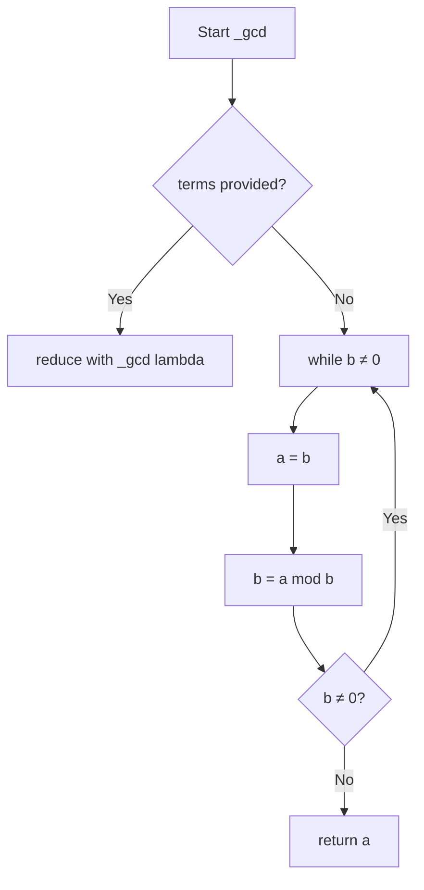
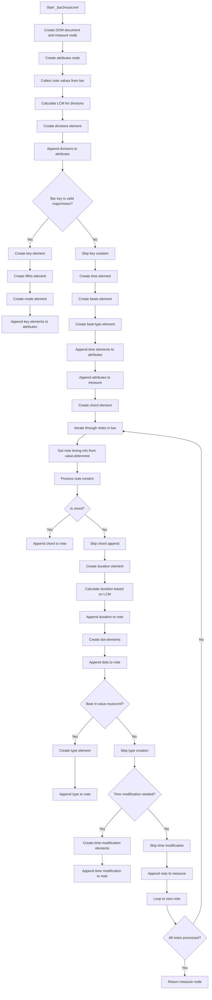
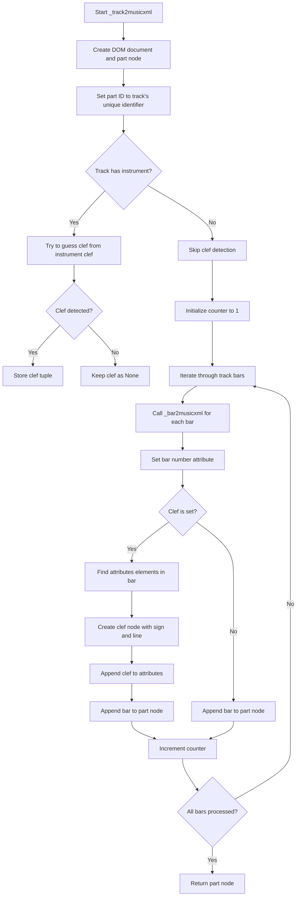
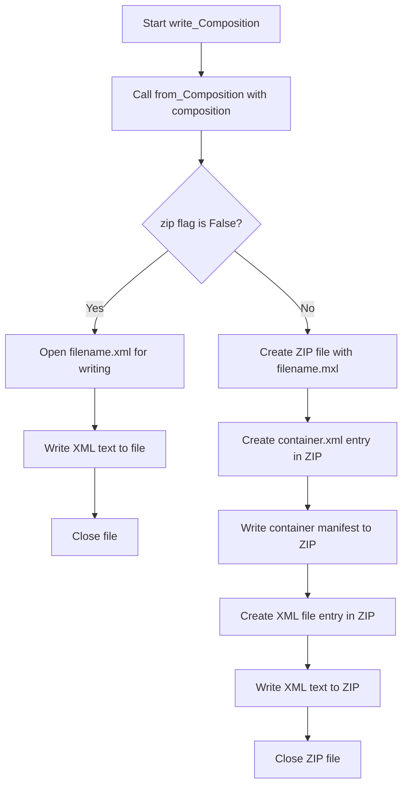

# `musicxml.py`

## `mingus.extra.musicxml._gcd` · *function*

## Summary:
Computes the greatest common divisor (GCD) of two numbers or a list of numbers using Euclid's algorithm.

## Description:
This function implements Euclid's algorithm to calculate the greatest common divisor of two integers. It can also handle multiple numbers by recursively applying the GCD operation. The function serves as a utility for finding the largest positive integer that divides all provided numbers without remainder.

## Args:
    a (int, optional): First integer operand. Defaults to None.
    b (int, optional): Second integer operand. Defaults to None.
    terms (list[int], optional): List of integers to compute GCD for. Defaults to None.

## Returns:
    int: The greatest common divisor of the input numbers. For two numbers, returns the largest positive integer that divides both numbers without remainder. For a list of numbers, returns the GCD of all numbers in the list.

## Raises:
    TypeError: If inputs are not integers or if terms contains non-integers.
    ValueError: If no arguments are provided or if terms is empty.

## Constraints:
    Preconditions:
    - When using a and b parameters, both must be integers
    - When using terms parameter, all elements must be integers
    - Input values should be non-negative for meaningful results
    
    Postconditions:
    - Returns a positive integer (or zero if one input is zero)
    - For two inputs, result is always non-negative
    - For multiple inputs, result is the GCD of all provided numbers

## Side Effects:
    None

## Control Flow:


## Examples:
    >>> _gcd(12, 8)
    4
    >>> _gcd(15, 25)
    5
    >>> _gcd(terms=[12, 8, 16])
    4
    >>> _gcd(7, 7)
    7
    >>> _gcd(0, 5)
    5
    >>> _gcd(10, 0)
    10
```

## `mingus.extra.musicxml._lcm` · *function*

## Summary:
Computes the least common multiple (LCM) of two numbers or a list of numbers.

## Description:
This function calculates the least common multiple of two integers or a list of integers. It leverages the mathematical relationship between LCM and GCD: LCM(a,b) = (a × b) / GCD(a,b). For multiple numbers, it recursively applies this formula. The function is designed to work with integer inputs and handles both pairwise calculations and batch operations.

## Args:
    a (int, optional): First integer operand. Defaults to None.
    b (int, optional): Second integer operand. Defaults to None.
    terms (list[int], optional): List of integers to compute LCM for. Defaults to None.

## Returns:
    int: The least common multiple of the input numbers. For two numbers, returns the smallest positive integer divisible by both numbers. For a list of numbers, returns the LCM of all numbers in the list.

## Raises:
    TypeError: If inputs are not integers or if terms contains non-integers.
    ValueError: If no arguments are provided or if terms is empty.

## Constraints:
    Preconditions:
    - When using a and b parameters, both must be integers
    - When using terms parameter, all elements must be integers
    - Input values should be non-negative for meaningful results
    
    Postconditions:
    - Returns a positive integer (or zero if one input is zero)
    - For two inputs, result is always non-negative
    - For multiple inputs, result is the LCM of all provided numbers

## Side Effects:
    None

## Control Flow:
```mermaid
flowchart TD
    A[Start _lcm] --> B{terms provided?}
    B -- Yes --> C[reduce with _lcm lambda]
    B -- No --> D[return (a * b) / _gcd(a, b)]
```

## Examples:
    >>> _lcm(4, 6)
    12
    >>> _lcm(12, 8)
    24
    >>> _lcm(terms=[4, 6, 8])
    24
    >>> _lcm(7, 7)
    7
    >>> _lcm(0, 5)
    0
    >>> _lcm(10, 0)
    0
```

## `mingus.extra.musicxml._note2musicxml` · *function*

## Summary:
Converts a note object into a MusicXML note element node.

## Description:
Transforms a note object into a structured XML node representing a musical note in MusicXML format. This function handles both regular notes and rests, creating appropriate XML elements for pitch information including step, octave, and accidental alterations. The function is extracted from the larger MusicXML conversion process to encapsulate the logic for converting individual note objects into their XML representation.

## Args:
    note: A note object with 'name' and 'octave' attributes, or None to represent a rest

## Returns:
    A DOM Element node representing the MusicXML note structure

## Raises:
    None explicitly raised

## Constraints:
    Preconditions:
        - The note object must have a 'name' attribute containing the note name (e.g., 'C', 'D#', 'Eb')
        - The note object must have an 'octave' attribute containing an integer value
        - If note is None, it represents a rest

    Postconditions:
        - Returns a properly structured XML DOM Element node
        - The returned node contains either a 'rest' element or a 'pitch' element with appropriate child elements

## Side Effects:
    None

## Control Flow:
```mermaid
flowchart TD
    A[Start _note2musicxml] --> B{note == None?}
    B -- Yes --> C[Create rest element]
    B -- No --> D[Create pitch element]
    C --> E[Return note_node]
    D --> F[Extract step from note.name[:1]]
    F --> G[Create step element]
    G --> H[Add step text node]
    H --> I[Create octave element]
    I --> J[Add octave text node]
    J --> K[Process accidentals]
    K --> L{count != 0?}
    L -- Yes --> M[Create alter element]
    M --> N[Add alter text node]
    N --> O[Append alter to pitch]
    L -- No --> P[Skip alter creation]
    O --> Q[Append pitch to note_node]
    P --> Q
    Q --> E
```

## Examples:
    # Creating a note element for a C4 note
    from mingus.containers.note import Note
    note = Note('C', 4)
    note_element = _note2musicxml(note)
    
    # Creating a rest element
    rest_element = _note2musicxml(None)
    
    # Creating a note with sharp
    note_sharp = Note('D#', 5)
    note_sharp_element = _note2musicxml(note_sharp)
    
    # Creating a note with flat
    note_flat = Note('Eb', 3)
    note_flat_element = _note2musicxml(note_flat)
```

## `mingus.extra.musicxml._bar2musicxml` · *function*

## Summary:
Converts a musical bar object into a MusicXML measure element node.

## Description:
Transforms a bar object containing musical notes and metadata into a structured XML node representing a complete musical measure in MusicXML format. This function handles the conversion of bar attributes like key signatures, time signatures, and note durations while properly structuring the musical content according to MusicXML specifications. The function is part of the MusicXML export functionality in the mingus library.

## Args:
    bar: A bar object containing musical content with attributes including key, meter, and note collections. The bar object must have:
        - key attribute with key, signature, and mode properties
        - meter attribute with two elements representing beats and beat type
        - Be iterable, yielding note collections in the format (note_name, note_value, note_content)

## Returns:
    A DOM Element node representing the MusicXML measure structure with all necessary attributes and note elements

## Raises:
    None explicitly raised

## Constraints:
    Preconditions:
        - The bar object must have a 'key' attribute with 'key', 'signature', and 'mode' properties
        - The bar object must have a 'meter' attribute with two elements representing beats and beat type
        - The bar object must be iterable, yielding note collections in the format (note_name, note_value, note_content)
        - The bar object's key must be a valid major or minor key (present in major_keys or minor_keys)
        - Each note collection must have a valid note_value that can be processed by value.determine()
        
    Postconditions:
        - Returns a properly structured XML DOM Element node representing a MusicXML measure
        - The returned node contains all necessary attributes including divisions, key, and time signatures
        - All notes in the bar are converted to proper MusicXML note elements with correct durations and rhythmic modifications
        - The divisions element is calculated based on the least common multiple of note durations

## Side Effects:
    None

## Control Flow:


## `mingus.extra.musicxml._track2musicxml` · *function*

## Summary:
Converts a musical track object into a MusicXML part element node with clef information and bar measurements.

## Description:
Transforms a track object containing musical bars and optional instrument information into a structured XML node representing a complete musical part in MusicXML format. This function handles the conversion of track attributes like instrument clefs and bar sequences while properly structuring the musical content according to MusicXML specifications. The function is part of the MusicXML export functionality in the mingus library.

## Args:
    track: A track object containing musical content with attributes including bars and optional instrument information. The track object must have:
        - bars attribute that is iterable, yielding bar objects
        - instrument attribute (optional) with a clef property that can be analyzed for clef determination

## Returns:
    A DOM Element node representing the MusicXML part structure with all necessary attributes and bar elements. The returned node contains:
        - An ID attribute set to the track's unique identifier
        - Bar elements with sequential numbering starting from 1
        - Clef information embedded in the first bar's attributes when applicable

## Raises:
    None explicitly raised

## Constraints:
    Preconditions:
        - The track object must have a 'bars' attribute that is iterable
        - Each bar in the track must be compatible with the _bar2musicxml function
        - The track's instrument clef string (if present) must contain recognizable clef keywords
        
    Postconditions:
        - Returns a properly structured XML DOM Element node representing a MusicXML part
        - The returned node contains all necessary attributes including the track ID
        - All bars in the track are converted to proper MusicXML bar elements with sequential numbering
        - Clef information is properly embedded in the first bar's attributes when instrument clef is recognized

## Side Effects:
    None

## Control Flow:


## Examples:
    # Basic usage with a track containing bars
    track = Track()
    # ... add bars to track ...
    part_node = _track2musicxml(track)
    # Returns a DOM Element representing the MusicXML part
    
    # Usage with instrument having clef information
    track = Track()
    track.instrument = MidiInstrument()
    track.instrument.clef = "treble"
    # ... add bars to track ...
    part_node = _track2musicxml(track)
    # Returns a DOM Element with clef information embedded in the first bar
```

## `mingus.extra.musicxml._composition2musicxml` · *function*

## Summary:
Converts a musical composition object into a MusicXML score-partwise document structure.

## Description:
Transforms a Composition object containing tracks and metadata into a structured XML document following the MusicXML 2.0 specification. This function handles the conversion of composition-level information such as title, author, and encoding metadata, alongside the structural organization of individual tracks into a complete musical score representation.

## Args:
    comp: A Composition object containing musical tracks and metadata. The composition object must have:
        - title attribute (optional) for the movement title
        - author attribute (optional) for composer information
        - Iterable tracks that can be processed by _track2musicxml function

## Returns:
    A DOM Element node representing the root "score-partwise" element of a MusicXML document. The returned element contains:
        - Version attribute set to "2.0"
        - Movement title element if composition title is provided
        - Identification section with composer and encoding metadata
        - Part list containing score-part elements for each track
        - Individual track elements converted via _track2musicxml function

## Raises:
    None explicitly raised

## Constraints:
    Preconditions:
        - The composition object must be iterable, yielding track objects
        - Each track in the composition must be compatible with _track2musicxml function
        - The composition object must have title and author attributes that can be converted to strings
        
    Postconditions:
        - Returns a properly structured XML DOM Element node representing a complete MusicXML score
        - All composition metadata (title, author) is properly encoded in the identification section
        - Each track in the composition is converted to a MusicXML part with appropriate IDs
        - Instrument information and MIDI settings are properly handled for each track

## Side Effects:
    None

## Control Flow:
```mermaid
flowchart TD
    A[Start _composition2musicxml] --> B[Create DOM document and score element]
    B --> C[Set score version to "2.0"]
    C --> D{Composition has title?}
    D -- Yes --> E[Create movement-title element]
    E --> F[Add title text to movement-title]
    F --> G[Append movement-title to score]
    D -- No --> H[Skip title creation]
    H --> I[Create identification element]
    I --> J{Composition has author?}
    J -- Yes --> K[Create creator element]
    K --> L[Set creator type to "composer"]
    L --> M[Add author text to creator]
    M --> N[Append creator to identification]
    J -- No --> O[Skip author creation]
    O --> P[Create encoding element]
    P --> Q[Create software element]
    Q --> R[Add "mingus" text to software]
    R --> S[Append software to encoding]
    S --> T[Create encoding-date element]
    T --> U[Add today's date to encoding-date]
    U --> V[Append encoding-date to encoding]
    V --> W[Append encoding to identification]
    W --> X[Append identification to score]
    X --> Y[Create part-list element]
    Y --> Z[Append part-list to score]
    Z --> AA[Iterate through composition tracks]
    AA --> AB[Call _track2musicxml for each track]
    AB --> AC[Create score-part element]
    AC --> AD[Set track ID to track's unique identifier]
    AD --> AE[Set score-part ID to track's unique identifier]
    AE --> AF[Create part-name element]
    AF --> AG[Add track name to part-name]
    AG --> AH[Append part-name to score-part]
    AH --> AI{Track has instrument?}
    AI -- Yes --> AJ[Create score-instrument element]
    AJ --> AK[Set score-instrument ID to instrument's unique identifier]
    AK --> AL[Create instrument-name element]
    AL --> AM[Add instrument name to instrument-name]
    AM --> AN[Append instrument-name to score-instrument]
    AN --> AO[Append score-instrument to score-part]
    AO --> AP{Instrument is MidiInstrument?}
    AP -- Yes --> AQ[Create midi-instrument element]
    AQ --> AR[Set midi-instrument ID to instrument's unique identifier]
    AR --> AS[Create midi-channel element]
    AS --> AT[Add "1" text to midi-channel]
    AT --> AU[Create midi-program element]
    AU --> AV[Add instrument number to midi-program]
    AV --> AW[Append midi-channel and midi-program to midi-instrument]
    AW --> AX[Append midi-instrument to score-part]
    AP -- No --> AY[Skip MIDI instrument processing]
    AY --> AZ[Append score-part to part-list]
    AZ --> BA[Set track ID to track's unique identifier]
    BA --> BB[Append track to score]
    BB --> BC{All tracks processed?}
    BC -- No --> AA
    BC -- Yes --> BD[Return score element]
```

## Examples:
    # Basic usage with a composition containing tracks
    composition = Composition()
    # ... add tracks to composition ...
    score_element = _composition2musicxml(composition)
    # Returns a DOM Element representing the complete MusicXML score
    
    # Usage with composition metadata
    composition = Composition()
    composition.title = "Symphony No. 5"
    composition.author = "Ludwig van Beethoven"
    # ... add tracks to composition ...
    score_element = _composition2musicxml(composition)
    # Returns a DOM Element with title and author in identification section

## `mingus.extra.musicxml.from_Note` · *function*

## Summary:
Converts a single musical note into a complete MusicXML score representation.

## Description:
Transforms a musical note into a MusicXML document by wrapping it in a Composition object and converting it through the standard composition-to-MusicXML pipeline. This function serves as a convenience wrapper for generating MusicXML from individual notes without requiring explicit composition construction.

## Args:
    note: A musical note object that can be added to a Composition. The note object must be compatible with Composition.add_note() method.

## Returns:
    str: A formatted MusicXML string representing the note as a complete score with proper XML formatting and indentation.

## Raises:
    None explicitly raised

## Constraints:
    Preconditions:
        - The note parameter must be a valid musical note object that can be added to a Composition
        - The note must be compatible with the internal composition-to-MusicXML conversion process
        
    Postconditions:
        - Returns a properly formatted XML string with correct MusicXML structure
        - The resulting XML follows MusicXML 2.0 specification
        - The output includes proper document declaration and formatting

## Side Effects:
    None

## Control Flow:
```mermaid
flowchart TD
    A[Start from_Note] --> B[Create empty Composition]
    B --> C[Add note to composition]
    C --> D[Call _composition2musicxml with composition]
    D --> E[Call toprettyxml() on result]
    E --> F[Return formatted XML string]
```

## Examples:
    # Convert a single note to MusicXML
    from mingus.containers.note import Note
    note = Note('C', 4)
    xml_string = from_Note(note)
    print(xml_string)
    # Returns a formatted MusicXML string representing the note
    
    # Convert a note with specific pitch and duration
    from mingus.containers.note import Note
    note = Note('A', 5, 0.5)  # A5, half note
    xml_output = from_Note(note)
    # Produces complete MusicXML score with the specified note
```

## `mingus.extra.musicxml.from_Bar` · *function*

## Summary:
Converts a musical bar into a formatted MusicXML string representation.

## Description:
Transforms a single musical bar into a complete MusicXML score-partwise document. This function serves as a convenience wrapper that creates a minimal composition containing only the provided bar, then converts it to MusicXML format. It's designed for scenarios where individual bars need to be exported as standalone MusicXML documents.

## Args:
    bar: A Bar object containing musical content to be converted to MusicXML format. The bar should contain valid musical data that can be processed by the underlying conversion functions.

## Returns:
    str: A formatted MusicXML string representing the musical content of the provided bar. The output follows the MusicXML 2.0 specification and includes proper indentation for readability.

## Raises:
    None explicitly raised by this function, though underlying conversion functions may raise exceptions for malformed input.

## Constraints:
    Preconditions:
        - The input bar must be a valid Bar object from the mingus library
        - The bar should contain properly structured musical data that can be processed by _track2musicxml and _composition2musicxml functions
        
    Postconditions:
        - Returns a valid MusicXML string with proper formatting
        - The resulting XML document follows MusicXML 2.0 specification
        - The output includes complete document structure with proper headers and indentation

## Side Effects:
    None

## Control Flow:
```mermaid
flowchart TD
    A[Start from_Bar] --> B[Create empty Composition]
    B --> C[Create empty Track]
    C --> D[Add bar to track using add_bar]
    D --> E[Add track to composition using add_track]
    E --> F[Convert composition to MusicXML using _composition2musicxml]
    F --> G[Format XML with toprettyxml()]
    G --> H[Return formatted XML string]
```

## Examples:
    # Basic usage with a simple bar
    from mingus.containers import Bar
    from mingus.extra.musicxml import from_Bar
    
    # Create a bar with some musical content
    bar = Bar()
    # ... add notes/chords to bar ...
    
    # Convert to MusicXML
    xml_string = from_Bar(bar)
    print(xml_string)
    # Returns properly formatted MusicXML string

## `mingus.extra.musicxml.from_Track` · *function*

## Summary:
Converts a musical track into a formatted MusicXML string representation.

## Description:
Transforms a Track object into a complete MusicXML score-partwise document by wrapping it in a Composition and converting it using the internal _composition2musicxml function. This function serves as a convenient interface for exporting individual tracks to MusicXML format.

## Args:
    track (Track): A Track object containing musical content to be converted to MusicXML format. The track must be a valid Track instance from the mingus.containers.track module.

## Returns:
    str: A formatted MusicXML string representing the track as a complete musical score. The output follows the MusicXML 2.0 specification with proper indentation and structure.

## Raises:
    UnexpectedObjectError: Raised when the track parameter is not a valid Track object instance, as this would cause failures in the underlying Composition.add_track() method.

## Constraints:
    Preconditions:
        - The track parameter must be a valid Track object instance
        - The track should contain valid musical content (bars with notes/chords)
        
    Postconditions:
        - Returns a properly formatted XML string with correct MusicXML structure
        - The resulting XML includes complete score-partwise document structure
        - All musical content from the track is preserved in the output

## Side Effects:
    None

## Control Flow:
```mermaid
flowchart TD
    A[Start from_Track] --> B[Create empty Composition]
    B --> C[Add track to composition]
    C --> D[Call _composition2musicxml with composition]
    D --> E[Call toprettyxml() on result]
    E --> F[Return formatted XML string]
```

## Examples:
    # Basic usage with a track containing musical content
    track = Track()
    track.add_notes("C-E-G", 4)  # Add a chord
    xml_string = from_Track(track)
    # Returns a formatted MusicXML string representing the track
    
    # Usage with a track that has an instrument
    instrument = MidiInstrument()
    track = Track(instrument)
    track.add_notes("D-F-A", 4)  # Add another chord
    xml_string = from_Track(track)
    # Returns a formatted MusicXML string with instrument information

## `mingus.extra.musicxml.from_Composition` · *function*

## Summary:
Converts a Composition object into a formatted MusicXML string representation.

## Description:
Transforms a musical Composition object into a complete MusicXML score representation. This function serves as the entry point for converting mingus composition objects into the standard MusicXML format, enabling interoperability with music notation software and other XML-based music processing tools.

## Args:
    comp: A Composition object containing musical tracks and metadata. The composition object must have:
        - title attribute (optional) for the movement title
        - author attribute (optional) for composer information
        - Iterable tracks that can be processed by _track2musicxml function

## Returns:
    str: A formatted MusicXML string representing the complete musical score. The output follows the MusicXML 2.0 specification and includes all composition metadata, track information, and musical content.

## Raises:
    None explicitly raised

## Constraints:
    Preconditions:
        - The composition object must be iterable, yielding track objects
        - Each track in the composition must be compatible with _track2musicxml function
        - The composition object must have title and author attributes that can be converted to strings
        
    Postconditions:
        - Returns a properly formatted MusicXML string with complete document structure
        - All composition metadata (title, author) is properly encoded in the identification section
        - Each track in the composition is converted to a MusicXML part with appropriate IDs
        - Instrument information and MIDI settings are properly handled for each track

## Side Effects:
    None

## Control Flow:
```mermaid
flowchart TD
    A[Start from_Composition] --> B[Call _composition2musicxml with comp]
    B --> C[Get DOM Element from _composition2musicxml]
    C --> D[Call toprettyxml() on DOM Element]
    D --> E[Return formatted XML string]
```

## Examples:
    # Basic usage with a composition containing tracks
    composition = Composition()
    # ... add tracks to composition ...
    xml_string = from_Composition(composition)
    # Returns a formatted MusicXML string representing the complete score
    
    # Usage with composition metadata
    composition = Composition()
    composition.title = "Symphony No. 5"
    composition.author = "Ludwig van Beethoven"
    # ... add tracks to composition ...
    xml_string = from_Composition(composition)
    # Returns a formatted MusicXML string with title and author in identification section
```

## `mingus.extra.musicxml.write_Composition` · *function*

## Summary:
Writes a Composition object to a MusicXML file, either as a plain XML file or as a compressed MXL file.

## Description:
This function converts a mingus Composition object into MusicXML format and writes it to disk. It provides two output formats: standard XML files (.xml extension) or compressed MXL files (.mxl extension) which are ZIP archives containing the XML file and a container manifest. The function delegates the actual MusicXML conversion to the `from_Composition` helper function and handles the file I/O operations.

Known callers within the codebase:
- This function appears to be directly called by user-facing APIs or command-line tools that export compositions to MusicXML format
- It's likely used in batch processing workflows or music notation applications that require XML output

The logic is extracted into its own function to separate the concerns of MusicXML generation from file I/O operations, allowing for easier testing of the conversion process and supporting multiple output formats without duplicating the conversion logic.

## Args:
    composition (Composition): A mingus Composition object containing musical tracks and metadata to be exported
    filename (str): Base name for the output file (without extension) - the actual file will have .xml or .mxl extension appended
    zip (bool): If True, creates a compressed MXL file; if False, creates a plain XML file. Defaults to False

## Returns:
    None: This function does not return any value

## Raises:
    IOError: When unable to write to the specified file path due to permission issues, invalid directory paths, or file system errors

## Constraints:
    Preconditions:
        - The composition parameter must be a valid Composition object with tracks
        - The filename parameter must be a valid string that can form a file path
        - When zip=True, the system must support ZIP file creation and compression

    Postconditions:
        - A file is created at the specified location with proper MusicXML content
        - When zip=False, the file has .xml extension
        - When zip=True, the file has .mxl extension and contains a valid ZIP archive with proper container manifest
        - Existing files with the same name will be overwritten

## Side Effects:
    - Creates a file on the filesystem (either .xml or .mxl extension)
    - Overwrites existing files with the same name
    - Writes to disk using standard file I/O operations

## Control Flow:


## Examples:
    # Export composition as plain XML file
    composition = Composition()
    # ... add tracks to composition ...
    write_Composition(composition, "my_composition", zip=False)
    # Creates my_composition.xml file

    # Export composition as compressed MXL file
    composition = Composition()
    # ... add tracks to composition ...
    write_Composition(composition, "my_composition", zip=True)
    # Creates my_composition.mxl file (compressed ZIP archive)
    
    # Overwrite existing file
    write_Composition(composition, "existing_file", zip=False)
    # Overwrites existing_existing_file.xml if it exists
```

