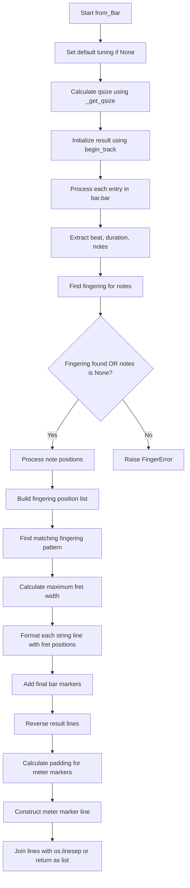
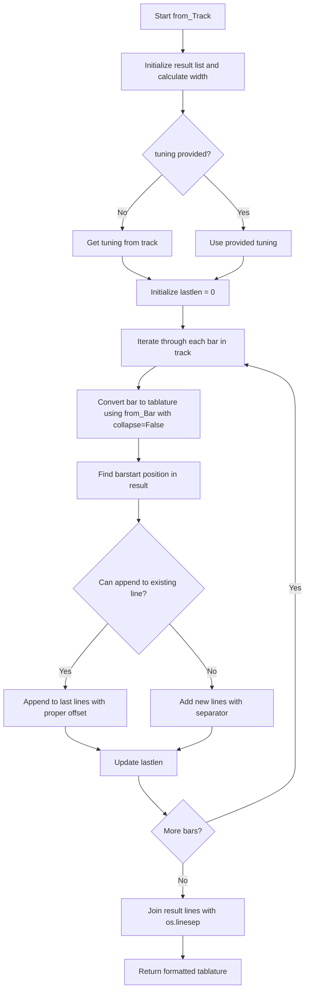
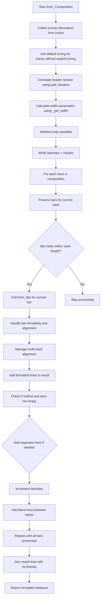
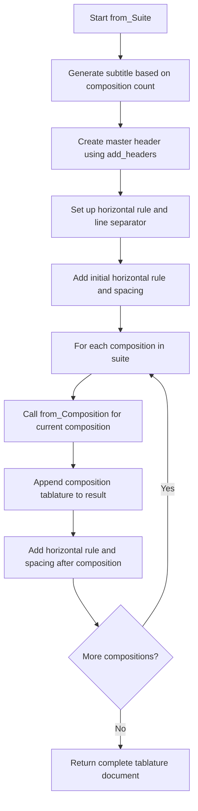
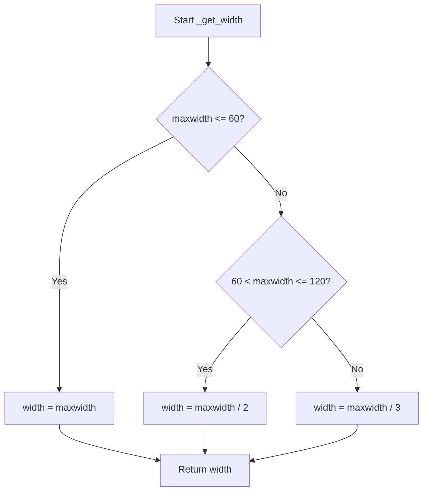

# `tablature.py`

## `mingus.extra.tablature.begin_track` · *function*

## Summary:
Creates a formatted header line for a tablature track based on instrument tuning and padding settings.

## Description:
This function generates a visual header line that represents the string names and their formatting for a musical tablature track. It processes each string in the tuning to create properly aligned formatted strings for display purposes.

## Args:
    tuning (object): A tuning object containing a list of notes in the tuning. Must have a `tuning` attribute that is iterable, where each item supports a `to_shorthand()` method.
    padding (int): Number of dash characters to append after the separator. Defaults to 2.

## Returns:
    list[str]: A list of formatted string representations for each string in the tuning, ready for display in a tablature. Each entry follows the pattern " {shorthand} ||{padding}".

## Raises:
    AttributeError: If `tuning.tuning` does not exist or is not iterable.
    AttributeError: If elements in `tuning.tuning` do not have a `to_shorthand()` method.

## Constraints:
    - Precondition: The `tuning` argument must have a `tuning` attribute that is iterable.
    - Precondition: Each item in `tuning.tuning` must have a `to_shorthand()` method.
    - Postcondition: The returned list will have the same length as the number of strings in the tuning.
    - The function ensures all entries in the result have the same base width for proper alignment.

## Side Effects:
    None

## Control Flow:
```mermaid
flowchart TD
    A[begin_track called] --> B[Extract shorthand names]
    B --> C[Find max width among names]
    C --> D[Calculate basesize = max_width + 3]
    D --> E[Initialize empty result list]
    E --> F[For each shorthand name]
    F --> G[Format: " {name}"]
    G --> H[Calculate spaces needed for alignment]
    H --> I[Append " " * spaces + "||" + "-" * padding]
    I --> J[Add to result list]
    J --> K[Return result list]
```

## Examples:
    Example usage with standard tuning:
    ```python
    # Assuming tuning has strings with names like ['E', 'A', 'D', 'G', 'B', 'E']
    result = begin_track(tuning, padding=3)
    # Returns: [' E   ||---', ' A   ||---', ' D   ||---', ' G   ||---', ' B   ||---', ' E   ||---']
    # Where each entry has consistent spacing for alignment
    ```

## `mingus.extra.tablature.add_headers` · *function*

## Summary:
Generates a formatted header section for tablature documents with customizable metadata and tuning information.

## Description:
Creates a standardized header block containing title, subtitle, author information, description, and instrument tuning details for musical tablature files. This function extracts the formatting logic for tablature headers into a reusable component, separating presentation concerns from the core tablature generation process.

## Args:
    width (int): Total width of the header block in characters. Defaults to 80.
    title (str): Main title of the tablature. Defaults to "Untitled".
    subtitle (str): Secondary title or subtitle. Defaults to "".
    author (str): Author name. Defaults to "".
    email (str): Author's email address. Defaults to "".
    description (str): Detailed description of the tablature. Defaults to "".
    tunings (list): List of tuning objects containing instrument and description attributes. Defaults to None.

## Returns:
    list[str]: Formatted header lines as a list of strings, ready to be joined into a header block.

## Raises:
    None explicitly raised.

## Constraints:
    Preconditions:
    - width must be a positive integer
    - title, subtitle, author, email, description should be strings
    - tunings should be a list of objects with instrument and description attributes
    
    Postconditions:
    - Returns a list of strings with proper formatting
    - Empty fields are skipped in output
    - All text is centered within the specified width
    - The first element of the returned list is an empty string

## Side Effects:
    None.

## Control Flow:
```mermaid
flowchart TD
    A[Start add_headers] --> B{tunings is None?}
    B -- Yes --> C[tunings = []]
    B -- No --> D[Continue]
    C --> E[title = str.upper(title)]
    D --> E
    E --> F[Add empty line to result]
    F --> G[result += str.center("  ".join(title), width)]
    G --> H{subtitle != ""?}
    H -- Yes --> I[result += ["", str.center(str.title(subtitle), width)]]
    H -- No --> J[Skip]
    I --> J
    J --> K{author != "" OR email != ""?}
    K -- Yes --> L[result += ["", ""]]
    K -- No --> M[Skip]
    L --> N{email != ""?}
    N -- Yes --> O[result += str.center("Written by: %s <%s>" % (author, email), width)]
    N -- No --> P[result += str.center("Written by: %s" % author, width)]
    O --> Q[Continue]
    P --> Q
    Q --> R{description != ""?}
    R -- Yes --> S[result += ["", ""]]
    R -- No --> T[Skip]
    S --> U[Split description into words]
    U --> V[Build lines respecting width limit]
    V --> W[Format lines with centering]
    W --> X[Append formatted lines to result]
    T --> Y[Skip]
    X --> Y
    Y --> Z{tunings != []?}
    Z -- Yes --> AA[result += ["", "", str.center("Instruments", width)]]
    Z -- No --> AB[Skip]
    AA --> AC[Iterate through tunings]
    AC --> AD[Format tuning info with numbering]
    AD --> AE[Append formatted tuning lines]
    AB --> AF[Add final empty lines]
    AE --> AF
    AF --> AG[Return result]
```

## Examples:
    >>> add_headers(title="Amazing Song", author="John Doe")
    ['', 'AMAZING SONG', '', 'Written by: John Doe']
    
    >>> add_headers(width=60, title="Test", subtitle="A Test", description="This is a test description")
    ['', 'TEST', '', 'A TEST', '', '', 'This is a test description']

## `mingus.extra.tablature.from_Note` · *function*

## Summary:
Converts a musical note into a tablature representation showing which string and fret to play.

## Description:
Generates a visual tablature string that indicates the optimal string and fret position for playing a given musical note based on the specified tuning. The function first attempts to match the note to an existing string/fret combination, and if none matches exactly, it finds the closest available fret position. This function is designed to be used for creating guitar or similar string instrument tablature displays.

## Args:
    note (object): A musical note object that either has string and fret attributes or can be matched against tuning frequencies.
    width (int): Maximum width of the resulting tablature line. Defaults to 80.
    tuning (object): Tuning object defining the instrument's string pitches. Defaults to None, which uses default_tuning.

## Returns:
    str: A formatted tablature string showing the note's position on the instrument's strings, with proper alignment and visual markers. Each line represents a string with the fret position marked appropriately.

## Raises:
    RangeError: When no valid fret position can be found for the given note within the tuning's range.

## Constraints:
    - Precondition: The note object must either have string and fret attributes or be compatible with tuning.find_frets().
    - Precondition: The tuning object must support get_Note() and find_frets() methods.
    - Postcondition: The returned string will be properly formatted with consistent width and alignment.
    - The function assumes that tuning objects have a proper interface for finding fret positions.

## Side Effects:
    None

## Control Flow:
```mermaid
flowchart TD
    A[from_Note called] --> B[Set default tuning if None]
    B --> C[Initialize result with begin_track]
    C --> D[Initialize min = 1000, s = -1, f = -1]
    D --> E[Check if note has string and fret attributes]
    E --> F{Has string/fret?}
    F -->|Yes| G[Get note from tuning at string/fret]
    G --> H{Match found?}
    H -->|Yes| I[Set s,f to note.string, note.fret; min = 0]
    I --> J[Skip further search]
    F -->|No| J
    J --> K[Search all string/fret combinations via tuning.find_frets()]
    K --> L{Found valid fret?}
    L -->|Yes| M[Update min, s, f if closer fret found]
    M --> N[Continue searching]
    L -->|No| O[Continue to width calculation]
    N --> O
    O --> P[Calculate width parameters]
    P --> Q{Valid fret found?}
    Q -->|Yes| R[Build tablature line with fret position]
    R --> S[Apply proper spacing and alignment]
    S --> T[Reverse result order]
    T --> U[Join with OS line separator]
    Q -->|No| V[Throw RangeError]
    V --> W[End]
    U --> W
```

## Examples:
    Basic usage with default tuning:
    ```python
    # Assuming note is a valid musical note object
    tab_line = from_Note(note)
    # Returns a formatted string like "E|--0--|\nA|--1--|\nD|--2--|\nG|--3--|\nB|--4--|\nE|--5--|"
    ```

## `mingus.extra.tablature.from_NoteContainer` · *function*

## Summary:
Converts a collection of musical notes into a formatted tablature representation showing finger positions on instrument strings.

## Description:
Transforms a list of musical notes into a visual tablature format that displays which strings and frets should be played to produce those notes. The function analyzes the notes to find playable fingering patterns based on the provided instrument tuning and formats the result as a multi-line string with proper alignment.

## Args:
    notes (list): A collection of musical note objects that either have 'string' and 'fret' attributes or are compatible with the tuning system's fingering algorithm. Each note object should represent a playable musical note.
    width (int): Maximum width of each tablature line in characters. Defaults to 80. Must be at least 4 characters wide.
    tuning (object): Instrument tuning object that implements 'find_fingering' and 'get_Note' methods. If None, defaults to a global default tuning.

## Returns:
    str: A multi-line string representing the tablature, where each line corresponds to a string in the instrument tuning. Lines contain proper spacing and fret positions indicated by numeric characters.

## Raises:
    FingerError: When no playable fingering pattern can be determined for the given notes.

## Constraints:
    - Precondition: The notes parameter must contain objects that either have 'string' and 'fret' attributes or are compatible with the tuning's fingering algorithm.
    - Precondition: The tuning parameter must have 'find_fingering' and 'get_Note' methods implemented.
    - Postcondition: The returned string will be properly formatted with consistent width and alignment across all lines.
    - The width parameter must be at least 4 characters to ensure readable output.

## Side Effects:
    None

## Control Flow:
```mermaid
flowchart TD
    A[from_NoteContainer called] --> B[Check if tuning is None]
    B --> C{tuning is None?}
    C -->|Yes| D[Set tuning to default_tuning]
    C -->|No| E[Use provided tuning]
    D --> F[Call begin_track with tuning]
    E --> F
    F --> G[Calculate width parameters]
    G --> H[Get fingering patterns from tuning.find_fingering()]
    H --> I{fingerings found?}
    I -->|No| J[raise FingerError]
    I -->|Yes| K[Process note attributes]
    K --> L[Filter valid note positions]
    L --> M[Find matching fingering pattern]
    M --> N[Select best fingering]
    N --> O[Build result dictionary]
    O --> P[Format each string line]
    P --> Q[Reverse result lines]
    Q --> R[Join lines with os.linesep]
    R --> S[Return formatted tablature]
```

## Examples:
    Basic usage with default tuning:
    ```python
    # Assuming notes contains objects with string/fret attributes
    tablature = from_NoteContainer(notes)
    # Returns a formatted multi-line string showing finger positions
    ```

    Usage with custom tuning and width:
    ```python
    # Using custom tuning and setting width to 100 characters
    custom_tuning = SomeTuningClass()
    tablature = from_NoteContainer(notes, width=100, tuning=custom_tuning)
    # Returns a formatted tablature with wider lines
    ```

## `mingus.extra.tablature.from_Bar` · *function*

## Summary:
Converts a musical bar into a formatted tablature representation showing finger positions and note durations.

## Description:
Transforms a musical bar structure into a visual tablature format that displays note fingerings, string positions, and timing information. This function processes each note entry in the bar, finds appropriate fingering patterns, and formats them into a readable tablature view with proper alignment and spacing.

The function is designed to be called internally by tablature rendering systems and handles complex logic for determining which fingering patterns to display, calculating proper spacing for note durations, and managing various edge cases in note representation.

## Args:
    bar (object): A musical bar object containing note entries in the format (beat, duration, notes). Must have a `bar` attribute that is iterable, where each entry is a tuple of (beat, duration, notes).
    width (int): Maximum width in characters for the tablature output. Defaults to 40.
    tuning (mingus.extra.tunings.Tuning): Musical tuning configuration to use for fingering calculations. Defaults to None, which uses a global default tuning variable.
    collapse (bool): Whether to join the result lines with newline characters. Defaults to True.

## Returns:
    str or list[str]: Formatted tablature string when collapse=True, or list of lines when collapse=False. Each line represents a string in the tablature with proper fingering positions and timing markers.

## Raises:
    FingerError: When no playable fingering can be found for a given set of notes.

## Constraints:
    Preconditions:
        - The `bar` parameter must have a `bar` attribute that is iterable containing note entries.
        - Each note entry in `bar.bar` must be a tuple of (beat, duration, notes).
        - The `tuning` parameter must be a valid Tuning object or None.
        - The `width` parameter must be a positive integer.
    Postconditions:
        - The returned tablature maintains proper alignment of string positions.
        - All note durations are represented with appropriate spacing.
        - The output respects the specified width constraint.

## Side Effects:
    None.

## Control Flow:


## Examples:
    Basic usage with default parameters:
    ```python
    # Assuming bar contains valid note data
    tablature = from_Bar(bar)
    # Returns a multi-line string representing the tablature
    ```

    Usage with custom width and tuning:
    ```python
    # Using custom tuning and wider display
    custom_tuning = mingus.extra.tunings.StandardTuning()
    tablature = from_Bar(bar, width=60, tuning=custom_tuning, collapse=True)
    # Returns formatted tablature with 60 character width
    ```

## `mingus.extra.tablature.from_Track` · *function*

## Summary:
Converts a musical track into a formatted tablature representation, organizing bars into a multi-line display with proper width management and bar alignment.

## Description:
Transforms a musical track (sequence of bars) into a visual tablature format that displays finger positions and note durations across multiple lines. This function processes each bar sequentially, converting it to tablature format and intelligently managing line wrapping and alignment to respect the specified maximum width constraint.

The function is designed to handle complex tablature rendering by processing bars individually and then combining them with proper spacing and alignment. It manages the challenge of fitting multiple bars within a constrained display width while maintaining proper musical structure and readability.

Known callers within the codebase:
- This function is likely called by higher-level tablature rendering functions that need to convert complete musical tracks into human-readable tablature format
- It's part of the tablature generation pipeline in the mingus library

This logic is extracted into its own function rather than being inlined because it encapsulates the complex logic of track-level tablature generation, including:
- Sequential processing of multiple bars
- Width management across multiple lines
- Intelligent bar alignment and spacing
- Handling of line wrapping and continuation

## Args:
    track (object): A musical track object containing sequential bar data. Must be iterable and support the get_tuning() method.
    maxwidth (int): Maximum width in characters for the tablature output. Defaults to 80. Must be a positive integer.
    tuning (mingus.extra.tunings.Tuning, optional): Musical tuning configuration to use for fingering calculations. Defaults to None, which uses the track's built-in tuning.

## Returns:
    str: A formatted tablature string with multiple lines representing the complete track. Each line contains tablature information for different strings, properly aligned and spaced.

## Raises:
    None explicitly raised by this function, though underlying functions like from_Bar may raise FingerError when fingering cannot be determined.

## Constraints:
    Preconditions:
        - The track parameter must be iterable and contain musical bar objects
        - Each bar in the track must be compatible with the from_Bar function
        - The maxwidth parameter must be a positive integer
        - The tuning parameter, if provided, must be a valid Tuning object or None
    Postconditions:
        - Returns a properly formatted tablature string respecting the width constraint
        - The output maintains proper alignment of musical elements across bars
        - Each bar is rendered with appropriate spacing and bar markers

## Side Effects:
    None.

## Control Flow:


## Examples:
    Basic usage with default parameters:
    ```python
    # Assuming track contains valid musical data
    tablature = from_Track(track)
    # Returns a multi-line string representing the complete track tablature
    ```

    Usage with custom maximum width:
    ```python
    # Using narrower display
    tablature = from_Track(track, maxwidth=60)
    # Returns formatted tablature respecting 60 character width limit
    ```

    Usage with custom tuning:
    ```python
    # Using custom tuning configuration
    custom_tuning = mingus.extra.tunings.StandardTuning()
    tablature = from_Track(track, tuning=custom_tuning)
    # Returns tablature using the specified tuning
    ```

## `mingus.extra.tablature.from_Composition` · *function*

## Summary:
Converts a musical composition into a formatted tablature representation with headers and aligned bar sections.

## Description:
Transforms a complete musical composition into a visual tablature format that displays note fingerings, string positions, and timing information across multiple tracks. This function orchestrates the generation of tablature by first creating a header section with composition metadata, then processing each bar across all tracks in sequence to build a complete tablature view.

The function handles multiple tracks with potentially different tunings by collecting tuning information from each track and applying appropriate fingering calculations for each bar. It manages complex layout logic for aligning tablature sections across multiple tracks and ensures proper spacing and formatting throughout the output.

## Args:
    composition (object): A musical composition object containing tracks with musical content. Must support iteration over tracks and have attributes for title, subtitle, author, email, and description.
    width (int): Maximum width in characters for the tablature output. Defaults to 80.

## Returns:
    str: A formatted tablature string containing headers and tablature sections for all tracks in the composition, with proper line breaks and alignment.

## Raises:
    None explicitly raised by this function.

## Constraints:
    Preconditions:
        - The composition parameter must be iterable over tracks
        - Each track in the composition must have a get_tuning() method
        - The composition must have title, subtitle, author, email, and description attributes
        - The width parameter must be a positive integer
        
    Postconditions:
        - Returns a properly formatted tablature string with headers and tablature sections
        - All tracks are processed and aligned in the output
        - The output respects the specified width constraint

## Side Effects:
    None.

## Control Flow:


## Examples:
    Basic usage with a composition:
    ```python
    # Assuming composition has tracks with musical content
    tablature = from_Composition(composition)
    # Returns a complete tablature string with headers and all tracks
    ```

    Usage with custom width:
    ```python
    # Using wider display for better readability
    tablature = from_Composition(composition, width=100)
    # Returns formatted tablature with 100 character width
    ```

## `mingus.extra.tablature.from_Suite` · *function*

## Summary:
Converts a Suite object containing multiple musical compositions into a formatted tablature document with headers and individual composition tablatures.

## Description:
Transforms a collection of musical compositions (Suite) into a complete tablature document that includes a master header with suite metadata and individual tablature sections for each composition. This function orchestrates the generation of comprehensive tablature documents by first creating a header section summarizing the suite's contents, then processing each composition in the suite to generate its individual tablature representation.

The function handles the structural organization of tablature documents by managing the overall document layout, including section separators and proper spacing between compositions. It leverages the existing `add_headers` function for metadata formatting and delegates individual composition processing to `from_Composition`.

## Args:
    suite (object): A Suite object containing multiple musical compositions. Must have the following attributes:
        - title (str): Main title of the suite
        - subtitle (str): Secondary title or description of the suite
        - author (str): Author name for the suite
        - email (str): Author's email address
        - description (str): Detailed description of the suite
        - compositions (list): List of composition objects contained in the suite
        - Must be iterable to support "for comp in suite" operation
    maxwidth (int): Maximum width in characters for the tablature output. Defaults to 80.

## Returns:
    str: A formatted tablature document containing:
        - Master header with suite metadata
        - Individual tablature sections for each composition in the suite
        - Section separators between compositions
        - Proper line breaks and formatting

## Raises:
    None explicitly raised.

## Constraints:
    Preconditions:
        - The suite parameter must be a valid object with the required attributes (title, subtitle, author, email, description, compositions)
        - The suite.compositions attribute must be iterable
        - The suite must be iterable to support "for comp in suite" operation
        - The maxwidth parameter must be a positive integer
        
    Postconditions:
        - Returns a properly formatted tablature document string
        - All compositions in the suite are processed and included in the output
        - The output maintains consistent formatting with proper section separators

## Side Effects:
    None.

## Control Flow:


## Examples:
    Basic usage with a suite containing compositions:
    ```python
    # Assuming suite has compositions and metadata
    tablature_document = from_Suite(suite)
    # Returns a complete tablature document with suite header and all compositions
    ```

## `mingus.extra.tablature._get_qsize` · *function*

## Summary:
Calculates the optimal number of frets to display in a tablature view based on available width and tuning configuration.

## Description:
This function determines how many frets can be shown in a tablature visualization by computing the available space after accounting for string name widths and padding. It's designed to be called internally by tablature rendering functions to ensure proper layout sizing.

The function extracts the shorthand representation of each string in the tuning, calculates the space needed for string labels, and computes how many fret columns can fit in the remaining space, assuming each fret takes approximately 4.5 characters.

## Args:
    tuning (mingus.extra.tunings.Tuning): The musical tuning configuration containing string names and their shorthand representations.
    width (int): The total available width in characters for the tablature display.

## Returns:
    int: The maximum number of frets that can be displayed, clamped to zero or greater. Returns 0 when the calculated fret count would be negative due to insufficient space.

## Raises:
    None explicitly raised by this function.

## Constraints:
    Preconditions:
        - The `tuning` parameter must be a valid Tuning object with a `tuning` attribute containing string objects that support the `to_shorthand()` method.
        - The `width` parameter must be a positive integer representing available display width.
    Postconditions:
        - The returned value is always a non-negative integer.
        - The calculation accounts for minimum spacing requirements for proper tablature formatting.

## Side Effects:
    None.

## Control Flow:
```mermaid
flowchart TD
    A[Start _get_qsize] --> B[Extract shorthand names from tuning]
    B --> C[Find maximum name length]
    C --> D[Calculate basesize = max_name_length + 3]
    D --> E[Calculate barsize = width - basesize - 2 - 1]
    E --> F[Calculate frets = barsize / 4.5]
    F --> G[Return max(0, int(frets))]
```

## Examples:
    Example 1: With standard tuning and 80 character width
        Input: tuning with 6 strings, max string name length of 2, width = 80
        Calculation: basesize = 2 + 3 = 5, barsize = 80 - 5 - 2 - 1 = 72, frets = 72 / 4.5 = 16.0
        Output: 16
    
    Example 2: With narrow width causing negative result
        Input: tuning with 6 strings, max string name length of 2, width = 10
        Calculation: basesize = 2 + 3 = 5, barsize = 10 - 5 - 2 - 1 = 2, frets = 2 / 4.5 = 0.44
        Output: 0 (clamped to zero)

## `mingus.extra.tablature._get_width` · *function*

## Summary:
Calculates and returns an appropriate width value based on a maximum width constraint, with different scaling behaviors for different ranges of input values.

## Description:
This function determines the optimal display width for tablature representations based on a given maximum width. It implements a piecewise scaling strategy where the returned width is adjusted according to specific thresholds. The function is designed to be used internally by the tablature module to ensure proper formatting of musical tablature displays.

## Args:
    maxwidth (int or float): The maximum allowable width value. This represents the upper bound for width calculation.

## Returns:
    float: The calculated width value, which depends on the input maxwidth:
        - If maxwidth <= 60: returns maxwidth unchanged
        - If 60 < maxwidth <= 120: returns maxwidth / 2
        - If maxwidth > 120: returns maxwidth / 3

## Raises:
    None explicitly raised by this function.

## Constraints:
    Preconditions:
        - maxwidth must be a numeric value (int or float)
    Postconditions:
        - The returned value will always be less than or equal to maxwidth
        - The returned value will be greater than or equal to 0 if maxwidth >= 0

## Side Effects:
    None.

## Control Flow:


## Examples:
    Example 1: _get_width(50) returns 50.0
    Example 2: _get_width(80) returns 40.0  
    Example 3: _get_width(150) returns 50.0

