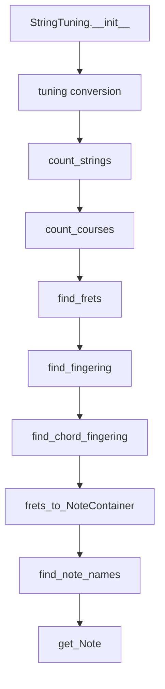
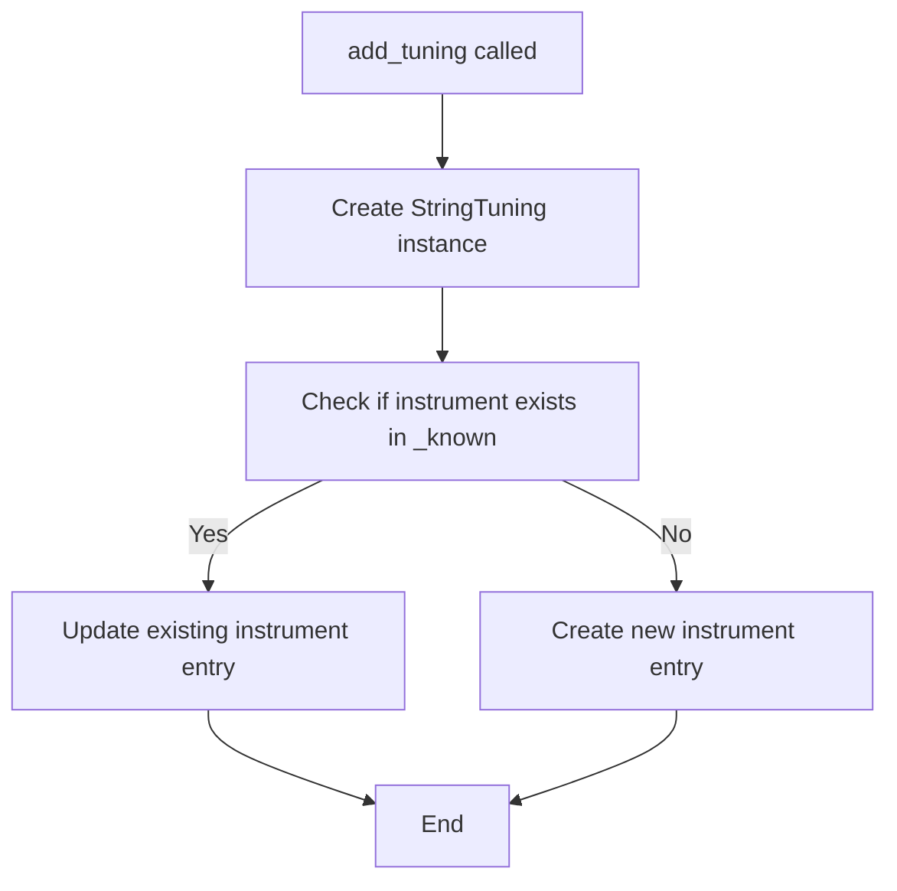
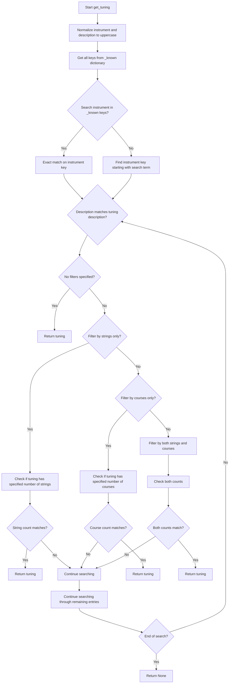

# `tunings.py`

## `mingus.extra.tunings.StringTuning` · *class*

## Summary:
Models the tuning configuration of stringed instruments, enabling note finding, fingering calculations, and chord positioning.

## Description:
The StringTuning class represents the pitch configuration of stringed instruments by storing the fundamental note for each string or course. It provides methods to calculate finger positions for specific musical notes or chords, supporting both single-string and multi-course tunings. This class integrates with the mingus music theory library to facilitate musical analysis and composition tasks involving stringed instruments.

## State:
- instrument (str): Name or identifier of the instrument this tuning represents
- tuning (list): List of Note objects or lists of Note objects representing the pitch of each string/course
  - Type: list of Note or list of Note
  - Valid range: Each element represents a valid musical note or course of notes
  - Invariant: All elements in tuning are properly converted to Note objects during initialization
- description (str): Human-readable description of this tuning configuration

## Lifecycle:
- Creation: Instantiate with instrument name, description, and tuning specification using `__init__(instrument, description, tuning)`
- Usage: Call methods like `find_frets()`, `find_fingering()`, or `find_chord_fingering()` to analyze musical positions
- Destruction: Uses standard Python garbage collection

## Method Map:


## Raises:
- RangeError: Raised by `get_Note()` when string or fret indices are outside valid ranges

## Example:
```python
# Create a standard guitar tuning
tuning = StringTuning("Guitar", "Standard Tuning", ["E", "A", "D", "G", "B", "E"])
print(tuning.count_strings())  # 6

# Find fret positions for a note
frets = tuning.find_frets("C")
print(frets)  # [8, 3, 10, 5, 0, 7]

# Find optimal fingering for a chord
chord_fingering = tuning.find_chord_fingering(["C", "E", "G"])
print(chord_fingering)  # [[0, 0, 0, 3, 2, 1]]
```

### `mingus.extra.tunings.StringTuning.__init__` · *method*

## Summary:
Initializes a StringTuning object with instrument, description, and note-based tuning specifications, converting note strings into Note objects.

## Description:
This method sets up the initial state of a StringTuning instance by storing the instrument name, processing the tuning specification into Note objects, and assigning a description. The tuning specification can contain either individual note strings or lists of note strings (for multi-string configurations), which are converted into proper Note objects for internal handling. These Note objects represent musical notes with pitch, octave, and MIDI dynamics information.

## Args:
    instrument (str): Name or identifier of the musical instrument this tuning is for.
    description (str): Human-readable description of the tuning configuration.
    tuning (list): List containing note specifications. Each element can be either a string representing a note (e.g., "C", "D#") or a list of strings representing multiple notes for a single string.

## Returns:
    None: This method does not return a value.

## Raises:
    None explicitly raised, though underlying Note() constructor may raise exceptions for invalid note specifications.

## State Changes:
    Attributes READ: None
    Attributes WRITTEN: self.instrument, self.tuning, self.description

## Constraints:
    Preconditions: 
    - The tuning parameter must be iterable.
    - Note specifications in tuning must be valid for the Note constructor.
    Postconditions:
    - self.instrument is set to the provided instrument value.
    - self.tuning is initialized as an empty list and populated with Note or list of Note objects.
    - self.description is set to the provided description value.

## Side Effects:
    None

### `mingus.extra.tunings.StringTuning.count_strings` · *method*

## Summary:
Returns the number of strings in the tuning configuration.

## Description:
This method provides a simple accessor to determine how many strings are defined in the StringTuning instance. It is called during various operations such as validating string indices in the `get_Note` method and calculating average course counts in `count_courses`. The method encapsulates the logic for retrieving the string count, making the code more readable and maintainable by abstracting away the direct access to the internal `tuning` attribute.

## Args:
    None

## Returns:
    int: The number of strings in the tuning, which corresponds to the length of the internal `self.tuning` list.

## Raises:
    None

## State Changes:
    - Attributes READ: self.tuning
    - Attributes WRITTEN: None

## Constraints:
    - Preconditions: The `self.tuning` attribute must be initialized as a list, which happens in the `__init__` method.
    - Postconditions: The returned integer value represents the exact count of string definitions in the tuning.

## Side Effects:
    None

### `mingus.extra.tunings.StringTuning.count_courses` · *method*

## Summary:
Calculates the average number of courses per string in a guitar tuning configuration.

## Description:
This method computes the average number of courses (individual strings or string groups) per string in a musical tuning configuration. Courses represent individual strings or groups of strings tuned to the same pitch. Single strings contribute 1 course each, while multi-course strings (represented as lists) contribute their length as courses. This metric quantifies the complexity or density of a tuning configuration.

## Args:
    None

## Returns:
    float: The average number of courses per string in the tuning. Returns 0.0 if the tuning is empty.

## Raises:
    None

## State Changes:
    Attributes READ: self.tuning
    Attributes WRITTEN: None

## Constraints:
    Preconditions: The tuning attribute must be iterable and contain either Note objects or lists of Note objects.
    Postconditions: The returned value is always a float representing the average course count per string.

## Side Effects:
    None

### `mingus.extra.tunings.StringTuning.find_frets` · *method*

## Summary:
Computes the fret positions for a given note across all strings in the tuning, returning None for strings where the note is out of range.

## Description:
This method calculates the fret number where a specified note would be played on each string of the tuning. It handles both string representations and Note objects as input, and returns a list of fret positions or None values for each string. The method is designed to work with StringTuning objects and provides a convenient way to map notes to fret positions across multiple strings.

## Args:
    note (str or Note): The note to find fret positions for. Can be a string representation like "C" or a Note object.
    maxfret (int): Maximum allowed fret position. Defaults to 24. Notes requiring higher frets are marked as None.

## Returns:
    list[int or None]: A list where each element corresponds to a string in the tuning. Each element is either:
        - An integer representing the fret position where the note can be played on that string
        - None if the note cannot be played on that string (either too low or too high)

## Raises:
    None explicitly raised. The method relies on Note constructor and measure methods which handle appropriate validation internally.

## State Changes:
    - Attributes READ: self.tuning
    - Attributes WRITTEN: None

## Constraints:
    - Preconditions: The tuning must be properly initialized with valid string notes or note lists
    - Postconditions: The returned list has the same length as the tuning and contains integers or None values

## Side Effects:
    - Creates Note objects from string inputs
    - Performs note measurement operations that may involve internal note comparisons

### `mingus.extra.tunings.StringTuning.find_fingering` · *method*

## Summary:
Finds optimal fingerings for a sequence of musical notes on a stringed instrument, considering string constraints and fret distance limitations.

## Description:
This method recursively explores all possible string-fret combinations for a given sequence of notes, returning the most efficient fingerings that minimize the total fret distance while respecting string usage restrictions. It's designed for guitar or similar stringed instruments where multiple strings can play the same note. The method uses a recursive backtracking approach to find all valid combinations and filters them based on maximum fret distance constraints.

## Args:
    notes (list): Sequence of musical notes to find fingerings for
    max_distance (int): Maximum allowed fret distance between the highest and lowest frets in a fingering (default: 4)
    not_strings (list): List of string indices that should be avoided in the current fingering (default: [])

## Returns:
    list: List of optimal fingerings, where each fingering is a list of (string, fret) tuples sorted by total fret count

## Raises:
    None explicitly raised

## State Changes:
    Attributes READ: self.tuning
    Attributes WRITTEN: None

## Constraints:
    Preconditions: 
    - Notes should be valid musical note representations
    - max_distance should be a non-negative integer
    - not_strings should contain valid string indices
    
    Postconditions:
    - Returns a list of fingerings where each fingering uses unique strings
    - All returned fingerings respect the max_distance constraint
    - Fingerings are sorted by total fret count in ascending order

## Side Effects:
    None

## Implementation Details:
The method works by:
1. Taking the first note from the notes list and finding all possible fret positions on each string using find_frets()
2. For each valid fret/string combination, recursively processing the remaining notes
3. Combining results to form complete fingerings
4. Filtering fingerings based on max_distance constraint (distance between highest and lowest frets)
5. Sorting results by total fret count to prioritize easier fingerings

The find_frets method returns a list of integers representing fret positions for each string in the tuning, with None for strings that cannot play the note within the allowed fret range.

### `mingus.extra.tunings.StringTuning.find_chord_fingering` · *method*

## Summary:
Finds optimal fingerings for playing a chord on a string instrument given the tuning and constraints.

## Description:
This method searches for valid fingering patterns that can be used to play a given set of notes on a string instrument. It uses a recursive backtracking approach to explore possible combinations of fret positions across strings, constrained by maximum distance between fingers, maximum fret number, and maximum fingers allowed. The method returns the best fingering options sorted by total fret position sum.

## Args:
    notes (list[str] or NoteContainer): List of note names (as strings) or a NoteContainer containing notes to be played
    max_distance (int): Maximum allowed distance between fret positions (default: 4)
    maxfret (int): Maximum fret number to consider (default: 18)
    max_fingers (int): Maximum number of fingers allowed (default: 4)
    return_best_as_NoteContainer (bool): Whether to return results as NoteContainer instead of raw fingering data (default: False)

## Returns:
    list[list[int]] or NoteContainer: List of valid fingering patterns, where each pattern is a list of fret positions for each string. If return_best_as_NoteContainer=True, returns a NoteContainer with note information.

## Raises:
    None explicitly raised

## State Changes:
    Attributes READ: self.tuning, self.find_note_names, self.frets_to_NoteContainer
    Attributes WRITTEN: None

## Constraints:
    Preconditions: 
    - Notes must be a valid list of note names or NoteContainer
    - Number of notes must be between 1 and length of tuning
    - max_distance, maxfret, max_fingers must be non-negative integers
    Postconditions:
    - Returns empty list if no valid fingering found
    - Results are sorted by total fret position sum
    - All returned fingering patterns cover all requested notes

## Side Effects:
    None

### `mingus.extra.tunings.StringTuning.frets_to_NoteContainer` · *method*

## Summary:
Converts a fingering array of fret positions into a NoteContainer containing the corresponding notes.

## Description:
Transforms an array representing finger positions on strings (where each element corresponds to a string and contains either a fret number or None) into a NoteContainer object containing the actual Note objects for the specified frets.

This method is designed to work with the StringTuning class and provides a clean interface for converting fingering data into musical note representations. It processes each string's fret position and constructs appropriate Note objects while skipping any None values in the fingering array.

## Args:
    fingering (list[int or None]): An array where each element represents a string's fret position. None indicates the string is not played, while an integer represents the fret number to play.

## Returns:
    NoteContainer: A container object holding all the Note objects corresponding to the non-None fret positions in the fingering array.

## Raises:
    RangeError: When a fret position or string index is out of valid range, as determined by the underlying get_Note method.

## State Changes:
    Attributes READ: self.count_strings(), self.tuning
    Attributes WRITTEN: None

## Constraints:
    Preconditions: 
    - The fingering array length must match the number of strings in the tuning (as returned by count_strings())
    - Each fret value must be within valid range (0 to 24) or None
    - String indices must be within valid range (0 to count_strings()-1)
    
    Postconditions:
    - Returns a NoteContainer with exactly the Notes for non-None fret positions
    - All returned Notes have their string and fret attributes properly set

## Side Effects:
    None

### `mingus.extra.tunings.StringTuning.find_note_names` · *method*

## Summary:
Finds all fret positions on a specified string where notes from a given list occur.

## Description:
This method determines which frets on a particular string of the instrument contain notes that match those in the provided note list. It's used to identify playable positions for specific notes on a string, which is useful for chord finding and fingering analysis. The method processes note lists in various formats (strings or Note objects) and returns a list of tuples containing fret numbers and corresponding note names.

The method works by:
1. Converting the input note list to a NoteContainer if needed
2. Getting the note names and their integer representations
3. Calculating the base note of the specified string
4. Iterating through fret positions to find matches
5. Returning tuples of (fret_number, note_name) for all matches

## Args:
    notelist (list): A list of notes represented as strings or Note objects to search for.
    string (int): Index of the string to search on. Defaults to 0.
    maxfret (int): Maximum fret number to check. Defaults to 24.

## Returns:
    list[tuple[int, str]]: A list of tuples where each tuple contains (fret_number, note_name) for matching notes.

## Raises:
    None explicitly raised

## State Changes:
    Attributes READ: self.tuning
    Attributes WRITTEN: None

## Constraints:
    Preconditions:
        - The string index must be valid for the instrument's tuning
        - The notelist should contain valid note representations
        - The notelist should not be None
    Postconditions:
        - Returns a list of tuples with fret numbers and note names
        - All returned fret numbers are within the specified maxfret limit
        - The method handles both string and Note object inputs for notelist

## Side Effects:
    None

### `mingus.extra.tunings.StringTuning.get_Note` · *method*

## Summary:
Returns a Note object representing the pitch produced by pressing a specified fret on a specified string in the tuning.

## Description:
This method calculates the musical note that would result from pressing a given fret on a specific string of the instrument, based on the tuning configuration. It validates both the string and fret parameters against the instrument's physical constraints before creating and returning the appropriate Note object with additional metadata.

## Args:
    string (int): The string number (0-indexed) to play. Defaults to 0.
    fret (int): The fret position to press. Defaults to 0.
    maxfret (int): The maximum allowed fret value. Defaults to 24.

## Returns:
    Note: A Note object representing the calculated pitch with string and fret information attached as attributes.

## Raises:
    RangeError: When the string index is out of bounds or when the fret position exceeds maxfret.

## State Changes:
    Attributes READ: self.tuning, self.count_strings()
    Attributes WRITTEN: None

## Constraints:
    Preconditions: 
    - The string index must be within [0, self.count_strings())
    - The fret index must be within [0, maxfret]
    Postconditions:
    - Returns a valid Note object with proper pitch calculation
    - Note object has string and fret attributes dynamically assigned

## Side Effects:
    None

## `mingus.extra.tunings.fingers_needed` · *function*

## Summary:
Calculates the minimum number of fingers needed to play a given fingering pattern on a string instrument.

## Description:
This function determines the optimal finger count for executing a fingering pattern, taking into account the special case of open strings that require splitting the hand position. It's designed to help musicians and music software calculate efficient fingering arrangements for guitar, violin, or similar string instruments.

The algorithm works by iterating through the fingering pattern from highest to lowest pitched string, counting fingers while considering that:
1. Open strings (0) require special handling that splits the hand position
2. The index finger (minimum finger number) is counted only once when it appears early in the pattern
3. Any finger other than the index finger counts as a separate finger

## Args:
    fingering (list[int]): A list of integers representing finger positions for each string, where:
        - 0 indicates an open string (no finger pressed)
        - Positive integers (1-4) represent finger numbers (1=index, 2=middle, 3=ring, 4=pinky)
    The list should be ordered from lowest to highest pitched string.

## Returns:
    int: The minimum number of fingers required to execute the fingering pattern, excluding open strings which are handled specially.

## Raises:
    ValueError: If fingering list is empty or contains only zeros, causing min() to fail.

## Constraints:
    - Preconditions: fingering must be a list of integers where each integer is either 0 (open string) or a positive integer (finger number)
    - Postconditions: Returns a non-negative integer representing finger count

## Side Effects:
    None

## Control Flow:
```mermaid
flowchart TD
    A[Start] --> B[Initialize split=False, indexfinger=False]
    B --> C[Find minimum finger number (excluding 0): minimum = min(finger for finger in fingering if finger)]
    C --> D[Initialize result=0]
    D --> E[Iterate through fingering in reverse order (highest to lowest pitch)]
    E --> F{Current finger == 0?}
    F -->|Yes| G[split = True]
    G --> H[Continue to next finger]
    F -->|No| I{split == False AND finger == minimum?}
    I -->|Yes| J{indexfinger == False?}
    J -->|Yes| K[result += 1, indexfinger = True]
    K --> L[Continue to next finger]
    J -->|No| M[result += 1]
    M --> L
    I -->|No| N[result += 1]
    N --> L
    L --> O[Next finger or End]
    O --> P{End of loop?}
    P -->|No| E
    P -->|Yes| Q[Return result]
```

## Examples:
    >>> fingers_needed([0, 2, 3, 4])  # Open string + 3 fingers
    3
    >>> fingers_needed([1, 2, 3, 4])  # 4 fingers, no open strings
    4
    >>> fingers_needed([0, 0, 2, 3])  # Two open strings + 2 fingers
    2
    >>> fingers_needed([1, 0, 0, 0])  # Index finger + 3 open strings
    1
    >>> fingers_needed([2, 3, 4, 0])  # 3 fingers + open string
    3
```

## `mingus.extra.tunings.add_tuning` · *function*

## Summary:
Registers a new string instrument tuning configuration into the global tuning registry.

## Description:
This function creates a StringTuning object from the provided parameters and stores it in a global registry (_known) for later retrieval. It enables the system to maintain and access various tuning configurations for different stringed instruments.

## Args:
    instrument (str): Name or identifier of the instrument being registered
    description (str): Human-readable description of this specific tuning configuration  
    tuning (list): List of note specifications representing the pitch of each string/course
        - Type: list of Note or list of Note
        - Valid range: Each element represents a valid musical note or course of notes

## Returns:
    None: This function does not return any value

## Raises:
    None explicitly raised by this function

## Constraints:
    Preconditions:
    - The instrument parameter must be a valid string identifier
    - The description parameter must be a valid string
    - The tuning parameter must be a valid list of note specifications
    - The StringTuning constructor must accept these parameters without error
    - The global _known registry must be initialized as a mutable mapping structure
    
    Postconditions:
    - The provided tuning is stored in the global _known registry
    - The registry structure appears to support hierarchical organization by instrument and description

## Side Effects:
    - Mutates the global _known dictionary by adding or updating entries
    - Creates a new StringTuning instance which may involve internal processing of note specifications

## Control Flow:


## Examples:
```python
# Register a standard guitar tuning
add_tuning("Guitar", "Standard Tuning", ["E", "A", "D", "G", "B", "E"])

# Register a custom ukulele tuning
add_tuning("Ukulele", "Low G Tuning", ["G", "C", "E", "A"])
```

## `mingus.extra.tunings.get_tuning` · *function*

## Summary:
Retrieves a musical tuning configuration based on instrument type, description, and optional string/course count specifications.

## Description:
This function serves as a lookup mechanism for predefined musical tunings stored in an internal registry. It allows users to find specific tuning configurations by matching instrument names and tuning descriptions, with optional filtering by number of strings or courses. The function is designed to abstract away the complexity of searching through a nested dictionary structure containing tuning definitions.

## Args:
    instrument (str): The name or partial name of the instrument to search for (case-insensitive).
    description (str): The description or partial description of the tuning to search for (case-insensitive).
    nr_of_strings (int, optional): Number of strings to filter results by. Defaults to None.
    nr_of_courses (int, optional): Number of courses to filter results by. Defaults to None.

## Returns:
    Tuning object or None: A tuning configuration matching the search criteria, or None if no match is found.

## Raises:
    None explicitly raised.

## Constraints:
    Preconditions:
        - The `_known` global variable must be properly initialized with tuning data having the structure: {instrument_key: [instrument_name, {description: tuning_object}]}. 
        - Instrument and description parameters should be non-empty strings for meaningful searches.
    Postconditions:
        - Returns either a matching tuning object or None if no matches are found.
        - When filtering by string/course counts, the returned tuning must satisfy those constraints.
        - The function performs case-insensitive matching on instrument and description parameters.

## Side Effects:
    None.

## Control Flow:


## Examples:
    # Find standard guitar tuning
    tuning = get_tuning("guitar", "standard")
    
    # Find guitar tuning with 6 strings
    tuning = get_tuning("guitar", "drop", nr_of_strings=6)
    
    # Find tuning for 4-course lute
    tuning = get_tuning("lute", "modal", nr_of_courses=4)
```

## `mingus.extra.tunings.get_tunings` · *function*

## Summary:
Retrieves a list of available instrument tunings that match specified criteria.

## Description:
This function provides access to a collection of predefined instrument tunings stored in the `_known` dictionary. It allows filtering by instrument type, number of strings, and number of courses to return matching tuning configurations. The function serves as a centralized interface for accessing tuning data throughout the mingus library.

## Args:
    instrument (str, optional): The name of the instrument to filter by. If None, all instruments are considered. Defaults to None. Matching is done via prefix matching when instrument is not an exact key in _known.
    nr_of_strings (int, optional): The number of strings to filter by. If None, no string count filtering is applied. Defaults to None.
    nr_of_courses (int, optional): The number of courses to filter by. If None, no course count filtering is applied. Defaults to None.

## Returns:
    list: A list of tuning objects that match the specified criteria. Each tuning object represents a specific tuning configuration for an instrument. Tuning objects are expected to have methods count_strings() and count_courses().

## Raises:
    None explicitly raised in the function body.

## Constraints:
    Preconditions:
        - The `_known` global variable must be properly initialized with tuning data.
        - Instrument names should match keys in the `_known` dictionary for exact matches.
        - Tuning objects returned must support count_strings() and count_courses() methods.
    Postconditions:
        - The returned list contains only tuning objects that satisfy all specified filtering criteria.
        - If no criteria are specified, all available tunings are returned.

## Side Effects:
    None.

## Control Flow:
```mermaid
flowchart TD
    A[Start get_tunings] --> B{instrument is not None?}
    B -- Yes --> C[search = str.upper(instrument)]
    B -- No --> D[search = ""]
    C --> E[Initialize result = []]
    D --> E
    E --> F[Get keys from _known]
    F --> G{search in keys?}
    G -- Yes --> H[Set inkeys = True]
    G -- No --> I[Set inkeys = False]
    H --> J[Iterate over keys]
    I --> J
    J --> K{instrument is None OR (not inkeys AND key.find(search)==0) OR (inkeys AND search==key)?}
    K -- Yes --> L{nr_of_strings is None AND nr_of_courses is None?}
    L -- Yes --> M[Add all tunings for key]
    L -- No --> N{nr_of_strings is not None AND nr_of_courses is None?}
    N -- Yes --> O[Filter by nr_of_strings]
    N -- No --> P{nr_of_strings is None AND nr_of_courses is not None?}
    P -- Yes --> Q[Filter by nr_of_courses]
    P -- No --> R[Filter by both nr_of_strings and nr_of_courses]
    M --> S[Add to result]
    O --> S
    Q --> S
    R --> S
    K -- No --> T[Skip key]
    J --> U{More keys?}
    U -- Yes --> J
    U -- No --> V[Return result]
```

## Examples:
    # Get all tunings for guitar
    guitar_tunings = get_tunings(instrument="guitar")
    
    # Get all 6-string tunings regardless of instrument
    six_string_tunings = get_tunings(nr_of_strings=6)
    
    # Get all 4-course tunings regardless of instrument
    four_course_tunings = get_tunings(nr_of_courses=4)
    
    # Get all 6-string guitar tunings
    guitar_6_string_tunings = get_tunings(instrument="guitar", nr_of_strings=6)
    
    # Get all 4-course banjo tunings
    banjo_4_course_tunings = get_tunings(instrument="banjo", nr_of_courses=4)
```

## `mingus.extra.tunings.get_instruments` · *function*

## Summary:
Returns a sorted list of all known instrument names available in the tunings module.

## Description:
This function provides access to the collection of instruments that are predefined and supported within the tunings system. It extracts instrument names from an internal registry (_known) and returns them in alphabetical order.

The function serves as a public interface to enumerate available instruments, enabling users to discover and select from the supported tuning configurations without needing to know the internal structure of the _known registry.

## Args:
    None

## Returns:
    list[str]: A sorted list of instrument names (strings) that are defined in the _known registry.

## Raises:
    None explicitly raised

## Constraints:
    Preconditions:
        - The global variable `_known` must be properly initialized and contain instrument definitions
        - Each entry in `_known` must have at least one element in its value list
    
    Postconditions:
        - The returned list is always sorted alphabetically
        - The returned list contains only unique instrument names
        - The original `_known` registry remains unmodified

## Side Effects:
    None

## Control Flow:
```mermaid
flowchart TD
    A[get_instruments() called] --> B{Iterate _known}
    B --> C[Access _known[upname][0]]
    C --> D[Collect instrument names]
    D --> E[Sort list alphabetically]
    E --> F[Return sorted list]
```

## Examples:
```python
# Basic usage
instruments = get_instruments()
print(instruments)
# Output might be: ['Acoustic Guitar', 'Banjo', 'Bass', ...]

# Usage in a loop to process all instruments
for instrument in get_instruments():
    print(f"Processing {instrument}")
```

